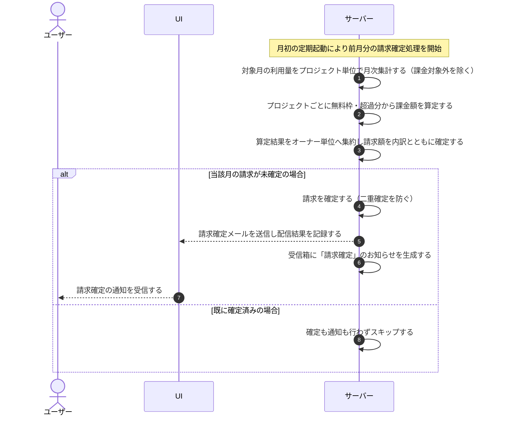

# UC-058: システムが月次請求を確定する

> **この業務ユースケースは「月次の締め後に、計測した利用量をオーナー単位(各オーナーが作成したプロジェクトを集計)の請求額として確定し、オーナーへ請求確定を通知する」処理を定義します。**

*主アクター システム ・ ステータス ドラフト*

## 概要

システムは、月次の締め後に、対象月に計測したプロジェクト単位の利用量をオーナー単位(各オーナーが作成したプロジェクト)へ集約し、無料枠と超過分から請求額を算定して請求を確定します。確定後は、各オーナーへ作成プロジェクトの内訳を添えた請求確定をメールと受信箱のお知らせで通知します。

## 主アクター

システム

## 目的

月次の利用量をオーナー単位(各オーナーが作成したプロジェクトを集計)で正確に請求確定し、オーナーが確定した請求内容を速やかに把握できるようにする。

## 事前条件

- 起動契機: 月初に、システムが前月分の月次請求確定処理を定期的に起動する。
- 対象月が暦月で締まっており、当該月の利用量が計測済みである。
- 各プロジェクトの無料枠・超過単価が保持されている。
- 対象プロジェクトが請求対象の状態(有効)である。利用停止中のプロジェクトは集計対象外とする。

## 基本フロー

1. システムが、月初の起動契機により前月分の月次請求確定処理を開始する。
2. システムが、対象月の利用量をプロジェクト単位で月次集計する。処理が失敗して課金対象外と区別された計測は請求対象から除く。
3. システムが、プロジェクトごとに無料枠と超過単価を参照し、質問数・FAQ 件数の超過分から課金額を算定する。
4. システムが、プロジェクトごとの算定結果をオーナー単位(各オーナーが作成したプロジェクト)へ集約し、当該オーナーの請求額を作成プロジェクトの内訳とともに確定する。
5. システムが、当該オーナー・当該請求月の請求がまだ確定していない場合に限り、請求を確定する(同一月の二重確定は行わない)。
6. システムが、当該オーナーへ作成プロジェクトの内訳を添えた請求確定を通知するメールを送信し、配信結果を記録する。
7. システムが、同時に当該オーナーの受信箱へ「請求確定」のお知らせを生成する。

## 代替フロー

—

## 例外フロー

- **請求対象なし**: 対象月に請求対象の利用が無いオーナーは、請求を確定せずに当該オーナーをスキップして処理を継続する。
- **二重確定**: 当該オーナー・当該請求月の請求が既に確定済みの場合は、確定も通知も行わず当該オーナーをスキップする。
- **通知配信失敗**: 請求自体は確定済みとし、確定通知の配信に失敗した場合は失敗として記録する。再送は別途の通知再送処理が扱う。

## 事後条件

- 対象月・対象オーナーの請求が確定し、オーナー単位(作成プロジェクトを集計)の請求額が作成プロジェクトの内訳とともに確定する。
- 同一オーナー・同一請求月の請求は一意で、二重請求が発生しない。
- オーナーへ作成プロジェクトの内訳を添えた確定通知メールが送信され、受信箱に「請求確定」のお知らせが生成される。
- 利用停止中のプロジェクトは請求対象外として扱われる。

## トレーサビリティ

トレーサビリティID [TR-058](../../02_basic_design/00_traceability/index.md#TR-058)。本ユースケースが対応する要件、および実現する設計(画面・システム・API・データベース・シーケンス)は当該 TR の行を参照する。

## 備考

利用量のリアルタイム集計・画面反映は本ユースケースの範囲外で、月次締め後の確定請求と確定通知の生成を範囲とする。
