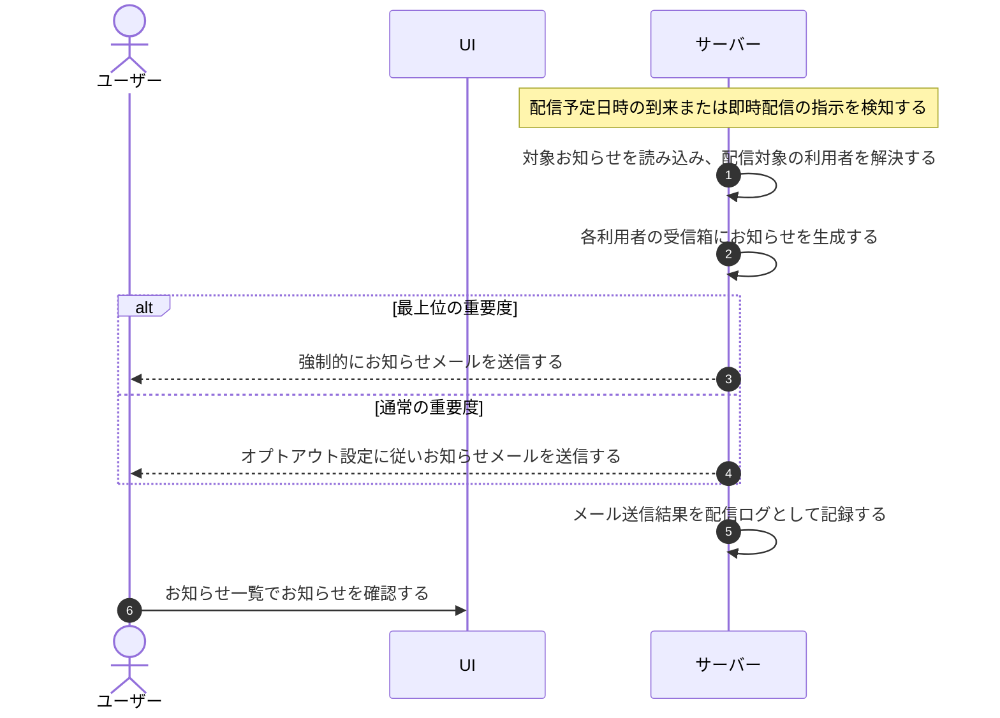

# UC-059: システムが運営お知らせを配信する

> **この業務ユースケースは「運営側が登録したお知らせを、配信予定日時の到来または即時配信を契機に、対象のアカウント利用者へ受信箱とメールで届ける」ことを定義します。**

*主アクター システム ・ ステータス ドラフト*

## 概要

サービス運営側が登録したお知らせ(メンテナンス予告・機能追加・規約改定・価格改定など)を、配信予定日時の到来または即時配信の契機にシステムが検知し、対象範囲のアカウント利用者へお知らせ受信箱とメールで配信する。受信箱のお知らせとメール通知を同期して生成し、対象者が見落とさず内容を把握できるようにする。

## 主アクター

システム

## 目的

運営からの重要なお知らせを対象のアカウント利用者へ確実に届け、メンテナンスや規約改定などへ利用者が適切に対応できるようにする。

## 事前条件

- 起動契機: 配信予定日時の到来、または運営による即時配信の指示が発生していること。
- 配信対象のお知らせ(宛先範囲・件名・本文・重要度)が登録され、内容が確定していること。
- 宛先範囲(全アカウント / 特定アカウント / 特定プロジェクト)から対象のアカウント利用者が解決できること。

## 基本フロー

1. システムが配信予定日時の到来、または即時配信の指示を検知し、お知らせ配信処理を起動する。
2. システムが対象のお知らせを読み込み、宛先範囲から配信対象のアカウント利用者を解決する。
3. システムが解決した各アカウント利用者の受信箱にお知らせを生成する。
4. システムがお知らせの重要度を判定し、メール送信対象の宛先へお知らせメールを送信する。最上位の重要度のお知らせはオプトアウトできない強制送信とし、通常のお知らせは各利用者のオプトアウト設定に従う。
5. システムがメールの送信結果を配信ログとして記録する。
6. 対象のアカウント利用者は、お知らせ一覧で配信されたお知らせを確認できる。

## 代替フロー

- システムが判定した重要度に応じて、強制送信か、利用者のオプトアウト設定に従う送信かが分かれる(基本フローに含む)。

## 例外フロー

- 宛先なし: 宛先範囲に該当するアカウント利用者が存在しない場合は、受信箱生成・メール送信を行わず正常終了する。
- メール送信失敗: 受信箱のお知らせは生成済みとし、メール送信の失敗は配信ログに記録する。再送は通知再送の業務で扱う。
- 送信停止対象の宛先: バウンスや苦情で送信停止対象となっている宛先へはメールを送らず、受信箱のお知らせのみ生成する。

## 事後条件

- 対象のアカウント利用者の受信箱にお知らせが生成される。
- メール送信対象の宛先へお知らせメールが送信され、配信ログが記録される。
- 最上位の重要度のお知らせは、対象者へ強制的に送信される。

## トレーサビリティ

関連する要件・基本設計の対応は [トレーサビリティ一覧](../../02_basic_design/00_traceability/index.md) で一元管理する。

## 備考

件名・本文テンプレートの全文、配信先の解決方法、重要度別の強制送信ルールはメール設計が正本であり、本ユースケースは配信契機から受信箱生成・メール送信までの業務の流れを範囲とする。
