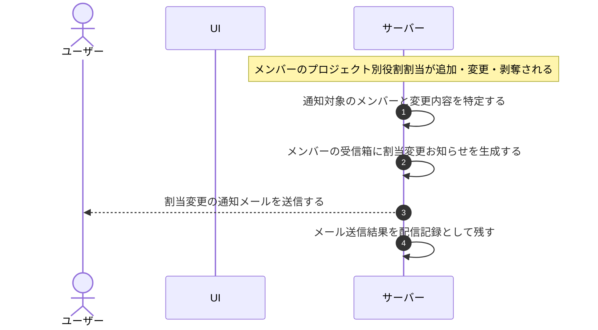

# UC-061: システムがメンバー割当変更を通知する

> **この業務ユースケースは「メンバーのプロジェクト別の役割割当が追加・変更・剥奪されたことを契機に、当該メンバーへお知らせ受信箱とメールで通知する」ことを定義します。**

*主アクター システム ・ ステータス ドラフト*

## 概要

メンバーのプロジェクト別の役割割当が追加・変更・剥奪されたことを契機に、システムが当該メンバーへ変更内容を通知する。お知らせ受信箱に運営お知らせとして生成し、あわせて変更通知メールを送る。受信箱とメールの内容を揃えて届ける。

## 主アクター

システム

## 目的

割当を変更された当事者であるメンバーが、自分のプロジェクト別の役割がどう変わったかを確実に把握できるようにする。見落としを防ぎ、変更後の権限に沿って速やかに業務へ移れるようにする。

## 事前条件

- 起動契機: メンバー管理の操作によって、メンバーのプロジェクト別役割割当が追加・変更・剥奪された。
- 通知対象となるメンバーが一意に特定できる。
- 対象メンバーが有効なアカウント利用者として通知の宛先を解決できる。

## 基本フロー

1. メンバーの割当が追加・変更・剥奪されたことを契機に、システムが割当変更通知の処理を起動する。
2. システムが通知対象のメンバーと、変更内容(対象プロジェクトと割当の追加・変更・剥奪の別)を特定する。
3. システムが対象メンバーのお知らせ受信箱に、運営お知らせ種別・通常重要度の割当変更お知らせを生成する。
4. システムが対象メンバーへ割当変更を知らせる通知メールを送信する。
5. システムがメールの送信結果を配信記録として残す。

## 代替フロー

—

## 例外フロー

- 宛先解決不可: 対象メンバーの通知宛先が解決できない場合は、受信箱のお知らせのみ生成し、メール送信は行わない。
- メール配信失敗: 受信箱のお知らせは生成済みとし、メール送信が失敗したことを配信記録に残す。再送は別の通知再送の業務で扱う。

## 事後条件

- 対象メンバーの受信箱に、運営お知らせ種別・通常重要度の割当変更お知らせが生成される。
- 対象メンバーへ割当変更の通知メールが送信され、その配信結果が記録される。

## トレーサビリティ

トレーサビリティID [TR-061](../../02_basic_design/00_traceability/index.md#TR-061)。本ユースケースが対応する要件、および実現する設計(画面・システム・API・データベース・シーケンス)は当該 TR の行を参照する。

## 備考

招待そのものの送信は、メンバー招待の業務の範囲とする。本ユースケースは割当が確定した後の、当該メンバーへの変更通知を範囲とする。

