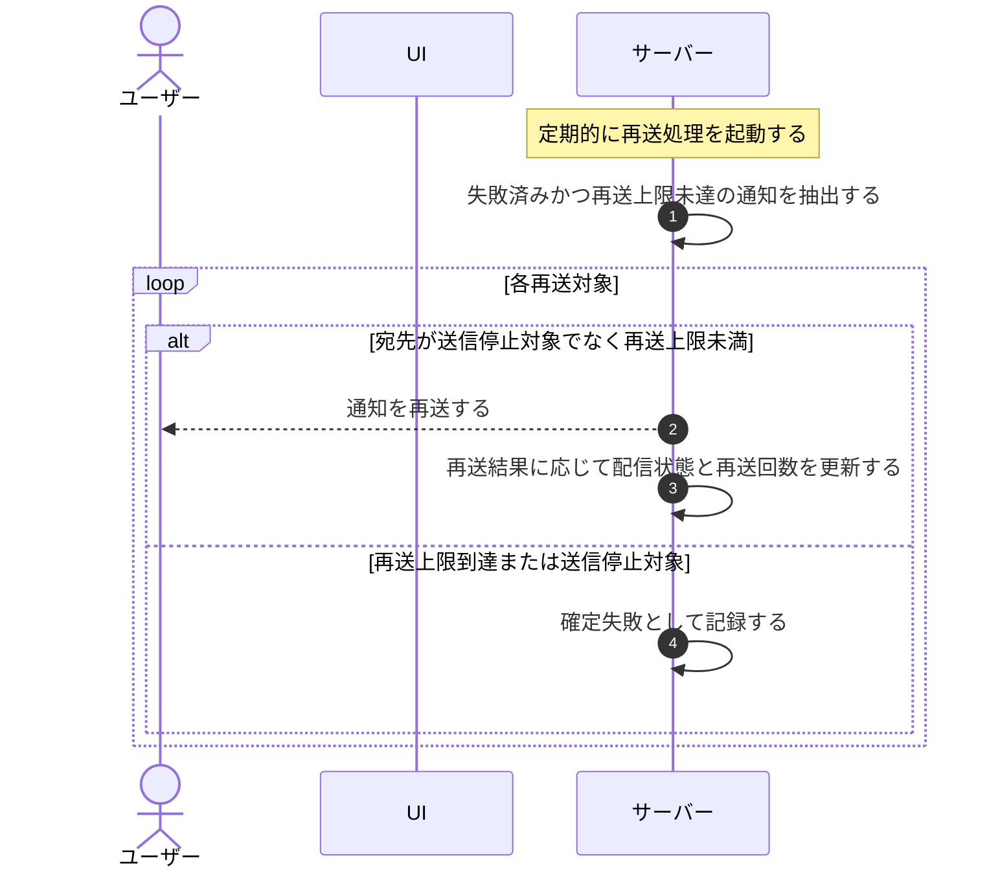

# UC-062: システムが配信失敗通知を再送する

> **この業務ユースケースは「配信に失敗した通知を検出し、再送上限の範囲内で自動的に再送する」業務を定義します。**

*主アクター システム ・ ステータス ドラフト*

## 概要

システムが配信に失敗した通知を定期的に検出し、再送回数の上限の範囲内で再送する。送信停止対象の宛先や再送上限に到達した分は再送せず確定失敗として扱い、配信状態を更新する。

## 主アクター

システム

## 目的

一時的な障害で届かなかった通知を再送して到達性を確保しつつ、無制限な再送による負荷や迷惑を避けるため、上限内に再送を抑える。

## 事前条件

- 通知ごとに配信状態(送信待ち・送信済み・失敗・バウンスなど)と再送回数が記録されている。
- 再送回数の上限が定められている。
- 起動契機: 定期的に起動する再送処理(失敗分の検出)。

## 基本フロー

1. システムが定期的に再送処理を起動する。
2. システムが配信に失敗し、まだ再送上限に達していない通知を再送対象として抽出する。
3. システムが各対象について再送の可否を判定する(宛先が送信停止対象でなく、再送回数が上限未満であること)。
4. システムが条件を満たす対象の通知を再送する。
5. システムが再送結果に応じて配信状態と再送回数を更新する。
6. 上限に達していない未達分は次回の再送処理で再評価される。

## 代替フロー

—

## 例外フロー

- **再送上限に到達した場合**: その対象は再送せず、確定失敗として記録する。
- **宛先が送信停止対象の場合**: その宛先には再送しない(認証関連の最優先通知を除く扱いは別途定める)。
- **再送も失敗した場合**: 再送回数を加算し、上限未到達であれば次回の再送処理で再評価する。

## 事後条件

- 再送可能な対象は上限の範囲内で再送され、配信状態が更新される。
- 再送上限到達分・送信停止対象分は確定失敗として記録され、再送されない。
- 通知の配信状態を後から確認できる。

## トレーサビリティ

トレーサビリティID [TR-062](../../02_basic_design/00_traceability/index.md#TR-062)。本ユースケースが対応する要件、および実現する設計(画面・システム・API・データベース・シーケンス)は当該 TR の行を参照する。

## 備考

バウンス・苦情の検知と送信停止リストへの登録は別の業務ユースケースが扱い、本ユースケースは送信停止リストを参照して再送可否を判定し、上限内で再送するまでを範囲とする。
