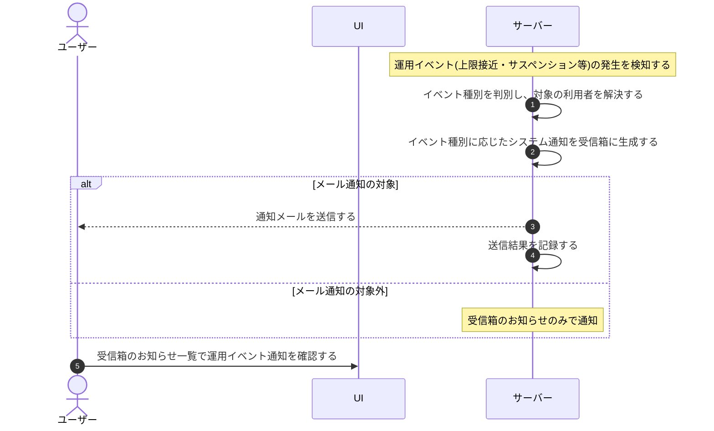

# UC-064: システムが運用イベントの通知を自動生成する

> **この業務ユースケースは「利用者が見落とすと不利益を被る運用イベントを、システムが自動で検知して通知を生成し届ける」ことを定義します。**

*主アクター システム ・ ステータス ドラフト*

## 概要

利用上限への接近・到達、通知失敗の急増、サスペンション、復元、規約改定、価格改定などの運用イベントが発生した時に、システムが自動でこれを検知し、対象のアカウント利用者へ「システム通知」を自動生成する。受信箱のお知らせを生成し、メール通知が必要な契機ではメールも送って、利用者が運用上の重要な変化を確実に把握できるようにする。

## 主アクター

システム

## 目的

利用者が見落とすと不利益を被る運用イベントを、利用者の操作を待たずにシステム側から確実に知らせ、利用者が早期に状況を把握し対処できるようにする。

## 事前条件

- 運用イベント(利用上限への接近・到達、通知失敗の急増、サスペンション、復元、規約改定、価格改定など)の発生が起動契機となる。
- 発生したイベントの対象となるアカウントやプロジェクトが特定できる。
- 通知の対象となるアカウント利用者(オーナーや当該プロジェクトのメンバーなど)を解決できる。

## 基本フロー

1. 運用イベントの発生をシステムが検知し、通知自動生成の処理を起動する。
2. システムがイベントの種別を判別し、通知の対象となるアカウント利用者を解決する。
3. システムがイベント種別に応じた内容で「システム通知」のお知らせを対象利用者の受信箱に生成する。
4. システムが当該イベントがメール通知の対象かを判定する。
5. メール対象の場合は、システムが対象利用者へ通知メールを送信し、送信結果を記録する。
6. メール対象外の場合は、受信箱のお知らせのみで利用者へ通知する。
7. 対象利用者は、後で受信箱のお知らせ一覧から当該の運用イベント通知を確認できる。

## 代替フロー

- **メール対象外のイベント**: メール通知の必要がないイベントは、受信箱のお知らせのみを生成し、メールは送らない。
- **同種イベントの連続発生**: 同一プロジェクトで同じ種別のイベントが短時間に連続発生した場合は、受信箱が埋もれないよう同種のお知らせを集約して扱う。

## 例外フロー

- **対象利用者が解決できない**: 通知すべきアカウント利用者を特定できない場合は、通知を生成せずに処理を終了する。
- **メール送信が失敗する**: 受信箱のお知らせは生成済みのまま残し、メール送信の失敗を記録する。再送は通知再送の業務で扱う。

## 事後条件

- 対象のアカウント利用者の受信箱に、運用イベントの「システム通知」のお知らせが生成される。
- メール対象の契機では、対象利用者へ通知メールが送信され、送信結果が記録される。
- メール対象外の契機では、受信箱のお知らせのみで通知される。

## トレーサビリティ

トレーサビリティID [TR-064](../../02_basic_design/00_traceability/index.md#TR-064)。本ユースケースが対応する要件、および実現する設計(画面・システム・API・データベース・シーケンス)は当該 TR の行を参照する。

## 備考

質問数上限のアラートやメンバーの役割変更通知は個別契機として別の業務ユースケースが扱い、本ユースケースは運用イベント全般のシステム通知の自動生成を範囲とする。
