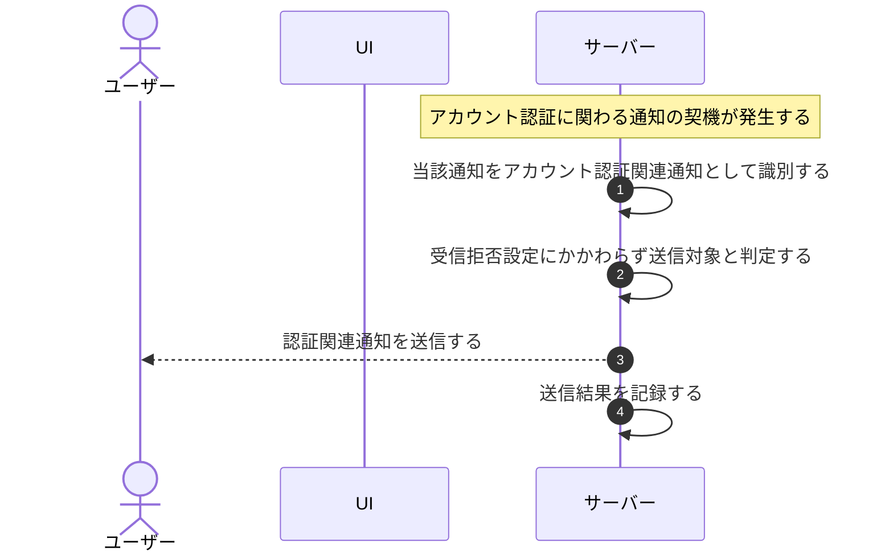

# UC-064: システムがアカウント認証関連通知をオプトアウト不可で送信する

> **この業務ユースケースは「パスワード再設定などのアカウント認証に関わる通知を、利用者の受信拒否設定にかかわらず必ず本人へ届ける」ことを定義します。**

*主アクター システム ・ ステータス ドラフト*

## 概要

アカウント認証に関わる通知(パスワード再設定など)は本人のアカウント保護に不可欠なため、システムはこれらを受信拒否(オプトアウト)の対象外として扱い、対象のアカウント利用者へ確実に送信する。利用者がお知らせの受信拒否を設定していても、認証関連通知だけは強制的に届ける。

## 主アクター

システム

## 目的

本人確認やアカウント保護に必要な認証関連の連絡を取りこぼしなく届け、なりすましや乗っ取りのリスクから利用者を守る。

## 事前条件

- トリガー(起動契機): パスワード再設定など、アカウント認証に関わる通知の契機が発生している。
- 通知対象のアカウント利用者と送信先が特定できる。

## 基本フロー

1. アカウント認証に関わる通知の契機(パスワード再設定など)が発生する。
2. システムが当該通知をアカウント認証関連通知として識別する。
3. システムが当該通知を受信拒否(オプトアウト)の対象外であると判定し、利用者の受信拒否設定にかかわらず送信対象とする。
4. システムが対象のアカウント利用者へ通知を送信する。
5. システムが送信の結果(成否)を記録する。

## 代替フロー

- 利用者がお知らせの受信拒否を設定している場合でも、認証関連通知は対象外とせず送信する。

## 例外フロー

- 一時的な送信障害で通知が届かなかった場合は、システムが再送して確実な到達を図る。

## 事後条件

- アカウント認証関連通知が、受信拒否設定にかかわらず対象のアカウント利用者へ送信される。
- 送信結果が記録される。

## トレーサビリティ

関連する要件・基本設計の対応は [トレーサビリティ一覧](../../02_basic_design/00_traceability/index.md) で一元管理する。

