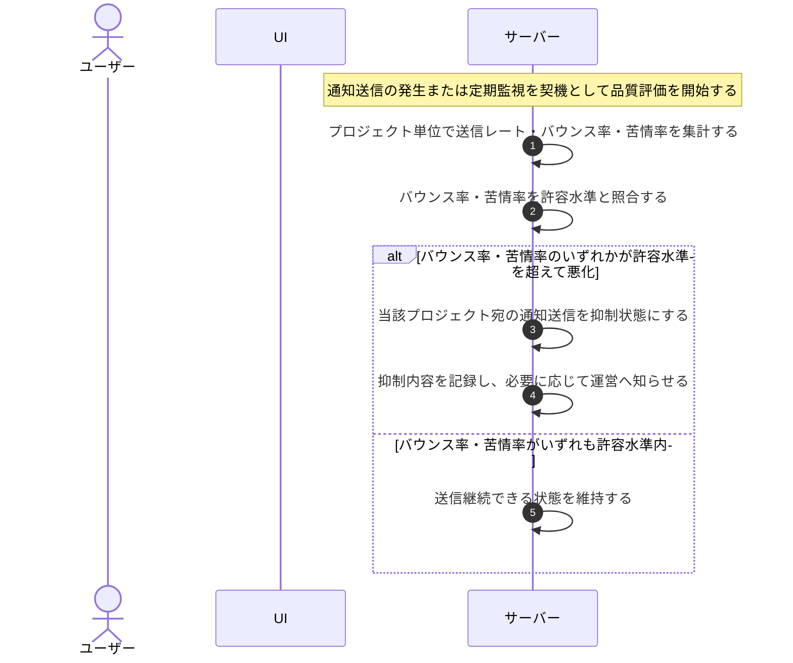

# UC-065: システムが送信指標を監視して送信を抑制する

> **この業務ユースケースは「システムがプロジェクト単位の送信品質を見張り、悪化したら自動で送信を抑える」ことを定義します。**

*主アクター システム ・ ステータス ドラフト*

## 概要

システムが、プロジェクトごとの送信品質(送信レート・バウンス率・苦情率)を継続的に監視する。このうちバウンス率・苦情率があらかじめ定めた水準を超えて悪化した場合、システムはそのプロジェクト宛の通知送信を自動で抑制し、送信元ドメインの信頼性低下を防ぐ。送信レートは監視・可視化の対象とし、自動抑制の契機にはしない。

## 主アクター

システム

## 目的

送信元ドメインの評判を健全に保ち、すべてのプロジェクトで通知が確実に届く状態を維持するため。送信品質が悪いプロジェクトを早期に検知して送信を抑え、外部の配信事業者からの送信停止やドメイン全体の評判悪化といった被害を未然に防ぐ。

## 事前条件

- トリガー(起動契機): 通知送信の発生、または定期的な品質監視のタイミング。
- プロジェクトごとの送信実績(送信件数・バウンス・苦情)が集計されている。
- 送信品質の判定に用いる許容水準(しきい値)が定められている。

## 基本フロー

1. システムが、通知送信の発生または定期監視を契機として送信品質の評価を開始する。
2. システムが、プロジェクト単位で直近の送信レート・バウンス率・苦情率を集計する。送信レートは監視・可視化のための集計値とし、抑制の契機にはしない。
3. システムが、集計したバウンス率・苦情率を許容水準と照合する。
4. バウンス率・苦情率のいずれかが許容水準を超えて悪化している場合、システムが当該プロジェクト宛の通知送信を抑制状態にする。
5. システムが、抑制を行った旨と対象を記録し、必要に応じて運営へ知らせる。
6. バウンス率・苦情率がいずれも許容水準内であれば、システムは送信を継続できる状態を維持する。

## 代替フロー

- バウンス率・苦情率がいずれも許容水準内の場合は、抑制を行わず送信可能な状態を保ったまま監視を終える。
- 監視時点で評価に足る送信実績が無いプロジェクトは、判定対象から除外する。
- 抑制中のプロジェクトが回復しきい値を連続して下回った場合、システムは抑制状態を解除し送信を再開する。

## 例外フロー

- 送信実績の集計が完了していない場合は、当該回の品質評価を見送り、次の監視機会に再評価する。

## 事後条件

- バウンス率・苦情率が悪化したプロジェクトの通知送信が抑制状態になる。
- 抑制の有無と対象が記録され、後から経緯を追跡できる。
- バウンス率・苦情率が許容水準内のプロジェクトは、引き続き送信できる状態が保たれる。
- 抑制状態は品質回復により自動的に解除されうる。

## トレーサビリティ

関連する要件・基本設計の対応は [トレーサビリティ一覧](../../02_basic_design/00_traceability/index.md) で一元管理する。

