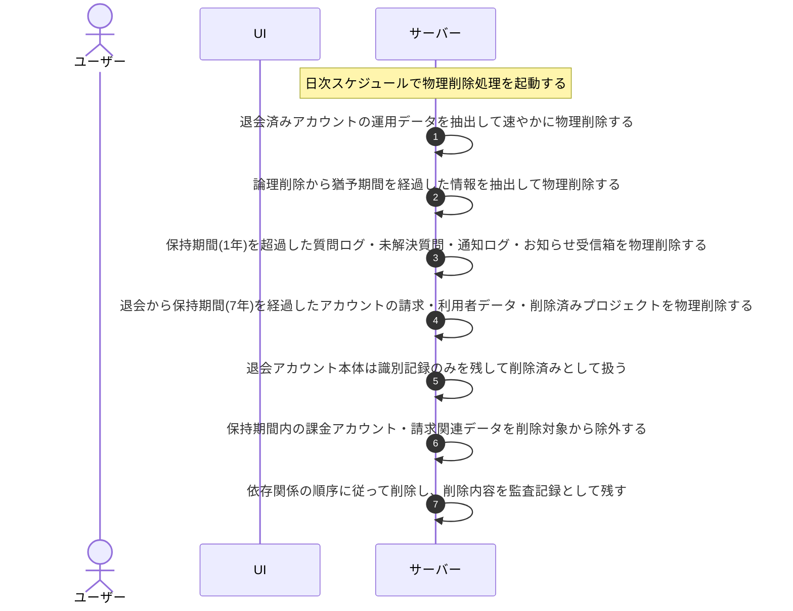

# UC-066: システムが保持期間・猶予に応じてデータを物理削除する

> **この業務ユースケースは「退会済みデータを速やかに、論理削除データを猶予経過後に、保持期間を超過したデータを期間経過後に、保持期間を経過した退会アカウントを期間経過後に、システムが定期的に物理削除し、保持義務のある課金アカウント・請求・監査データは保持する」処理を定義します。**

*主アクター システム ・ ステータス ドラフト*

## 概要

システムが定期的(日次)に走査し、各々の猶予・保持期間のルールに従ってデータを物理削除する物理削除の傘処理である。対象は次の 4 種に区分される。(1)退会済みのアカウントに属する運用データ(FAQ・プロジェクト・許可ドメイン・質問ログ・未解決質問・利用量・通知・お知らせ受信箱など)を速やかに物理削除する。(2)退会以外の事由で論理削除された情報(プロジェクト削除・アカウント無効化などで論理削除された情報)を、論理削除から猶予期間の経過後に物理削除する。(3)データ保持期間(1 年)を超過した質問ログ・未解決質問・通知ログ・お知らせ受信箱を、保持期間の経過後に物理削除する。(4)退会からアカウント・請求関連データの保持期間(7 年)を経過した退会アカウントの請求関連データ・利用者データ・退会時に削除済みとしたプロジェクトを物理削除し、アカウント本体は同一識別子の再利用を防ぐ最小限の識別記録のみを残して削除済みとして扱い、以後ログイン不可とする。いずれの削除も依存関係の順序に従って行い、削除内容を監査記録として残す。課金アカウント・請求関連データ(課金アカウント・請求書・サブスクリプション・支払方法・課金関連の監査記録)は、保持期間(7 年)が満了するまでは削除対象から除いて保持する。

## 主アクター

システム

## 目的

各々の猶予・保持期間のルールに従って不要となったデータを確定削除してデータ最小化を担保し、不要な個人データ・利用情報を残さないことでプライバシー保護とコンプライアンスを果たす。あわせて、保持義務のある課金アカウント・請求データは保持期間が満了するまで誤って削除しないようにする。

## 事前条件

- 起動契機: 定期的な実行スケジュール(日次)によりシステムが自動起動する。
- 各データに、猶予・保持期間の起算に用いる時点(作成時点・退会時点・論理削除時点など)が記録されている。
- データ保持期間(1 年)、論理削除後の猶予期間、退会後の保持期間(7 年)が定められている。

## 基本フロー

1. 実行スケジュールに従い、システムが物理削除処理を起動する。
2. システムが退会済みのアカウントに属する運用データ(FAQ・プロジェクト・許可ドメイン・質問ログ・未解決質問・利用量・通知・お知らせ受信箱など)を抽出し、速やかに物理削除する。
3. システムが、退会以外の事由で論理削除された情報を抽出し、論理削除から猶予期間を経過したものを物理削除する。
4. システムが、データ保持期間(1 年)を超過した質問ログ・未解決質問・通知ログ・お知らせ受信箱を抽出し、物理削除する。
5. システムが、退会からアカウント・請求関連データの保持期間(7 年)を経過した退会アカウントの請求関連データ・利用者データ・退会時に削除済みとしたプロジェクトを物理削除し、アカウント本体は同一識別子の再利用を防ぐ最小限の識別記録のみを残して削除済みとして扱う。
6. システムが、課金アカウント・請求関連データ(課金アカウント・請求書・サブスクリプション・支払方法・課金関連の監査記録)を、保持期間(7 年)が満了するまでは削除対象から除外して保持する。
7. システムが、いずれの削除も依存関係の順序に従って行い(従属する関連データから先に削除する)、削除した内容を監査記録として残して処理を完了する。

## 代替フロー

—

## 例外フロー

- いずれの区分でも削除対象が存在しない場合は、削除を行わずに正常終了する。
- いずれかの対象の削除が失敗した場合は、整合性を損なわない範囲で当該対象の削除を中止し、失敗を記録したうえで次回の実行時に再評価する。

## 事後条件

- 退会済みアカウントの運用データが速やかに物理削除され、復元できない(不可逆)。
- 論理削除から猶予期間を経過した情報、および保持期間(1 年)を超過した質問ログ・未解決質問・通知ログ・お知らせ受信箱が物理削除され、復元できない(不可逆)。
- 退会から保持期間(7 年)を経過したアカウントの請求・利用者データおよび退会時に削除済みとしたプロジェクトが物理削除され、アカウント本体は最小限の識別記録のみを残して削除済みとなり、当該アカウントの保有者は以後ログインできない。
- 課金アカウント・請求関連データは、保持期間(7 年)が満了するまで削除されず保持される。
- 削除は依存関係の順序で行われ、データ間の整合性が保たれている。
- 削除内容が監査記録に残る。

## トレーサビリティ

トレーサビリティID [TR-066](../../02_basic_design/00_traceability/index.md#TR-066)。本ユースケースが対応する要件、および実現する設計(画面・システム・API・データベース・シーケンス)は当該 TR の行を参照する。
