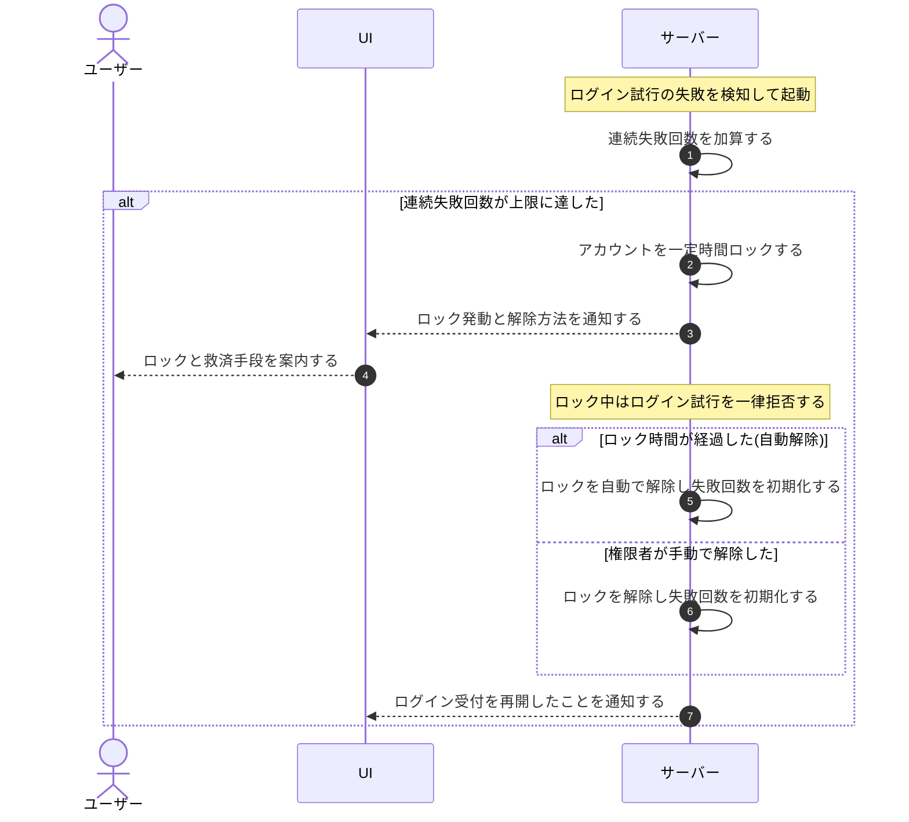

# UC-068: システムがログイン失敗をロックアウトし解除する

> **この業務ユースケースは「ログインが連続して一定回数失敗した利用者を一定時間ロックし、時間経過または権限者の操作でロックを解除すること」を定義します。**

*主アクター システム ・ ステータス ドラフト*

## 概要

システムは、ログインが続けて規定回数失敗した利用者を一定時間ロックし、ロック中はログインを受け付けません。ロックは時間経過による自動解除、または権限者の手動解除で解かれ、解除後は再びログインを受け付けます。

## 主アクター

システム

## 目的

連続したログイン失敗による不正なログイン試行(総当たり)を一定回数・一定時間のロックで抑え、サービスとアカウントを守りつつ、正規の利用者には解除の救済手段を提供する。

## 事前条件

- 起動契機: ログイン試行が失敗する、ロック期間が経過する、または権限者が手動解除を行う。
- ロックの条件(連続失敗回数)と効果(ロック時間)があらかじめ定められている。
- 対象となる利用者アカウントが存在する。

## 基本フロー

1. 利用者のログイン試行が認証情報の不一致で失敗すると、システムが当該アカウントの連続失敗回数を加算する。
2. 連続失敗回数が規定の上限に達した時点で、システムが当該アカウントを一定時間ロックする。
3. システムが本人および必要な権限者へロック発動を通知し、解除のための救済手段を案内する。
4. ロック中に届いたログイン試行は、システムが認証を行わずに一律拒否する。
5. ロック時間が経過すると、システムが当該アカウントのロックを自動で解除する。
6. または、権限者が手動でロックを解除すると、システムがロックを解く。
7. 解除後、システムは再びログイン試行を受け付け、連続失敗回数を初期化する。

## 代替フロー

- ロック解除は、ロック時間の経過(自動解除)と権限者による手動解除のいずれでも行える。

## 例外フロー

- ロック中にさらにログイン試行が届いても、システムは認証せず一律に拒否する。
- 解除後に再び連続して規定回数失敗した場合は、システムが改めてロックを発動する。

## 事後条件

- 連続失敗が上限に達したアカウントは一定時間ロックされ、ロック中はログインできない。
- ロックは時間経過または権限者の手動解除で解かれ、解除後はログイン試行を再受付する。
- ロック発動時に本人および必要な権限者へ通知され、救済手段が案内される。

## トレーサビリティ

トレーサビリティID [TR-068](../../02_basic_design/00_traceability/index.md#TR-068)。本ユースケースが対応する要件、および実現する設計(画面・システム・API・データベース・シーケンス)は当該 TR の行を参照する。

## 備考

ロック通知の配信先・文面はメッセージ設計を正本とし、本ユースケースはロック発動・到達拒否・解除の判定を範囲とする。
