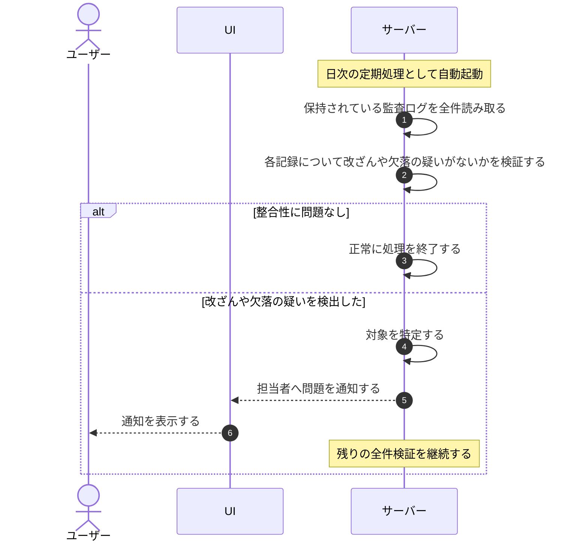

# UC-070: システムが監査ログの整合性を日次検証する

> **この業務ユースケースは「システムが毎日自動で監査ログ全件を点検し、改ざんや欠落の疑いがあれば通知する」ことを定義します。**

*主アクター システム ・ ステータス ドラフト*

## 概要

システムが日次の定期処理として、改ざん検知可能な形で保持された監査ログを全件点検し、整合性に問題がないかを検証する。改ざんや欠落の疑いを検出した場合は担当者へ通知する。検証は読み取りのみで、監査ログ自体は変更しない。

## 主アクター

システム

## 目的

監査ログの信頼性を継続的に担保し、不正・誤操作の事後追跡や説明責任に耐えられる状態を日々確認するため。問題を早期に検知して被害や疑念の拡大を防ぐ。

## 事前条件

- トリガー: 日次の定期処理として、システムが 1 日 1 回、整合性検証を自動起動する。
- 監査ログが改ざん検知可能な形で保持されている。
- 検証対象期間の監査ログが存在する。

## 基本フロー

1. システムが日次の定期処理として整合性検証を自動的に開始する。
2. システムが保持されている監査ログを全件読み取り、点検対象とする。
3. システムが各記録について改ざんや欠落の疑いがないかを順に検証する。
4. システムがすべての対象について検証を完了する。
5. 整合性に問題がなければ、システムは正常に処理を終了する。

## 代替フロー

- 検証対象の監査ログが存在しない場合、システムは検証を行わずに正常終了する。

## 例外フロー

- 改ざんや欠落の疑いを検出した場合、システムは対象を特定して担当者へ通知する。検証は中断せず、残りの全件点検を継続する。

## 事後条件

- 監査ログが日次で全件点検され、整合性が確認された状態になる。
- 問題が検出された場合は、対象を特定したうえで担当者へ通知済みの状態になる。
- 本検証によって監査ログ自体は変更されない。

## トレーサビリティ

関連する要件・基本設計の対応は [トレーサビリティ一覧](../../02_basic_design/00_traceability/index.md) で一元管理する。

## 備考

本検証は読み取りのみで監査ログを変更せず、改ざん検知の保持方式そのものは基本設計で定める。
