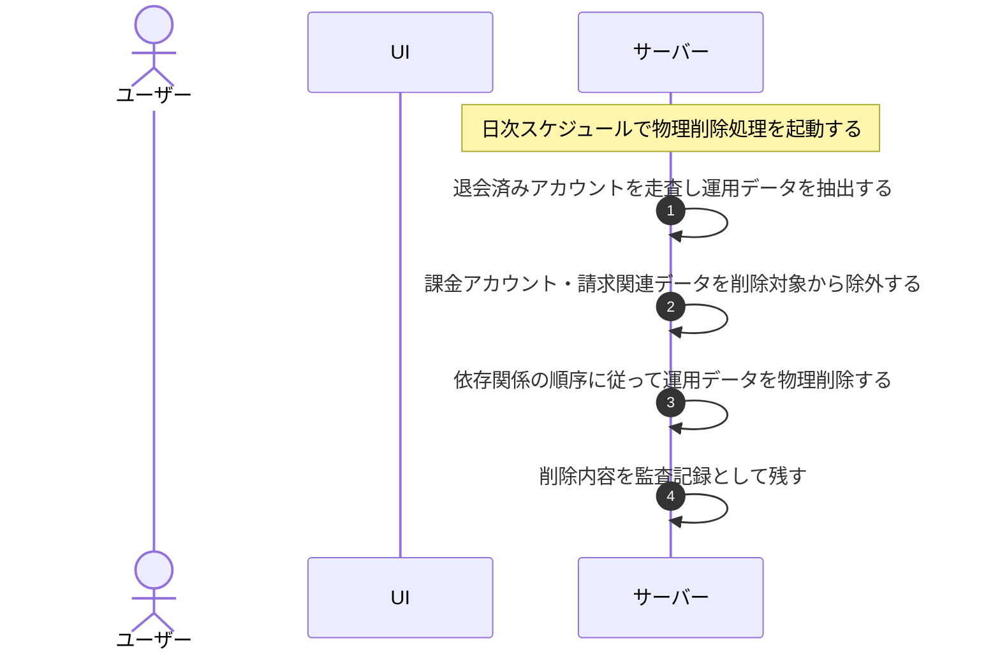

# UC-070: システムが退会済み・論理削除データを物理削除する

> **この業務ユースケースは「退会済みアカウントの運用データを速やかに、また退会以外で論理削除された情報を猶予期間の経過後に、システムが定期的に物理削除し、課金アカウント・請求・監査データは対象から除く」処理を定義します。**

*主アクター システム ・ ステータス ドラフト*

## 概要

退会済みのアカウントに属する運用データ(FAQ・プロジェクト・許可ドメイン・質問ログ・未解決質問・利用量・通知・お知らせ受信箱など)を、システムが定期的に走査して速やかに物理削除する。削除は依存関係の順序に従って行い、削除内容を監査記録として残す。課金アカウント・請求関連データ(課金アカウント・請求書・サブスクリプション・支払方法・課金関連の監査記録)は本処理の削除対象から除き、保持期間(7 年)にわたり別途保持する。あわせて、退会以外の事由で論理削除された情報(プロジェクト削除・アカウント無効化・保持期間超過で論理削除された情報など)を、論理削除から猶予期間の経過後に物理削除する。

## 主アクター

システム

## 目的

退会済みアカウントの運用データを速やかに確定削除してデータ最小化を担保し、不要な個人データ・利用情報を残さないことでプライバシー保護とコンプライアンスを果たす。あわせて、保持義務のある課金アカウント・請求データは誤って削除しないようにする。

## 事前条件

- 起動契機: 定期的な実行スケジュール(日次)によりシステムが自動起動する。
- 対象とするアカウントが退会済みの状態である。
- 課金アカウント・請求関連データの保持期間(7 年)が定められている。

## 基本フロー

1. 実行スケジュールに従い、システムが運用データの物理削除処理を起動する。
2. システムが退会済みのアカウントを走査し、それらに属する運用データ(FAQ・プロジェクト・許可ドメイン・質問ログ・未解決質問・利用量・通知・お知らせ受信箱など)を物理削除の対象として抽出する。
3. システムが、抽出した運用データを依存関係の順序に従って物理削除する(従属する関連データから先に削除する)。
4. システムが、課金アカウント・請求関連データ(課金アカウント・請求書・サブスクリプション・支払方法・課金関連の監査記録)を削除対象から除外し、保持期間に従って残す。
5. システムが、削除した内容を監査記録として残す。
6. システムが処理を完了する。

## 代替フロー

—

## 例外フロー

- 削除対象の運用データが存在しない場合は、削除を行わずに正常終了する。
- いずれかの対象の削除が失敗した場合は、整合性を損なわない範囲で当該対象の削除を中止し、失敗を記録したうえで次回の実行時に再評価する。

## 事後条件

- 退会済みアカウントの運用データが物理削除され、復元できない(不可逆)。
- 削除は依存関係の順序で行われ、データ間の整合性が保たれている。
- 課金アカウント・請求関連データは削除されず、保持期間(7 年)に従って保持される。
- 削除内容が監査記録に残る。

## トレーサビリティ

トレーサビリティID [TR-070](../../02_basic_design/00_traceability/index.md#TR-070)。本ユースケースが対応する要件、および実現する設計(画面・システム・API・データベース・シーケンス)は当該 TR の行を参照する。
