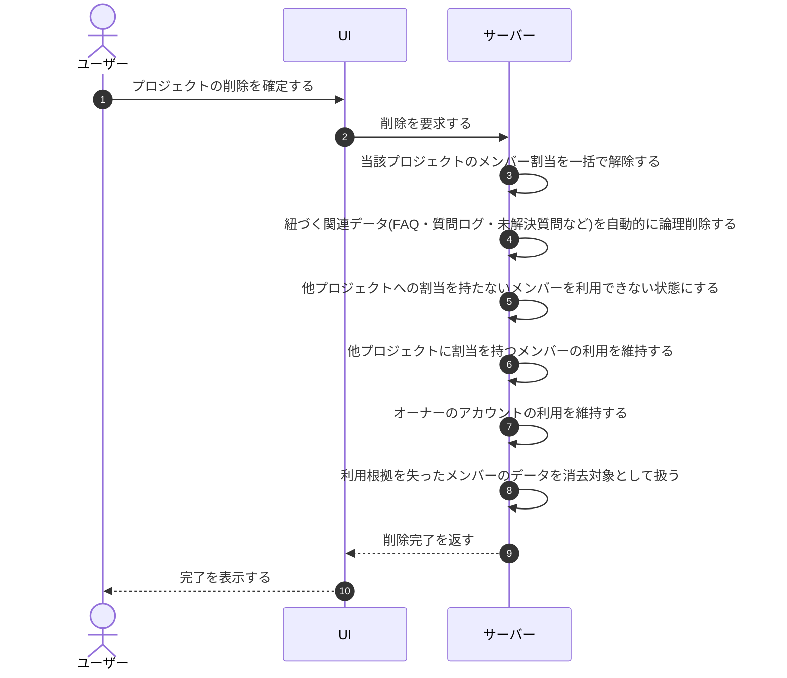

# UC-073: システムがプロジェクト削除時にメンバー割当解除と関連データの自動論理削除を行う

> **この業務ユースケースは「プロジェクトが削除されたとき、当該プロジェクトのメンバー割当を解除し、紐づく関連データを自動的に論理削除すること」を定義します。**

*主アクター システム ・ ステータス ドラフト*

## 概要

プロジェクトが削除されると、システムは当該プロジェクトに紐づくメンバーの割当を一括で解除し、あわせて紐づく関連データ(FAQ・質問ログ・未解決質問など)を自動的に論理削除します。関連データの取扱いを利用者が選ぶことはなく、システムが一律に論理削除します。割当解除により利用根拠を失ったメンバーは利用できない状態とし、利用根拠を失ったアカウントとデータを残さないようにします。他プロジェクトに割当が残るメンバーやオーナーは利用を維持します。

## 主アクター

システム

## 目的

不要となったメンバー割当を速やかに解除し、紐づく関連データを確実に整理して、利用根拠のないアクセス権や個人情報の滞留を防ぎ、権限の取り残しをなくす。

## 事前条件

- 削除対象のプロジェクトが存在する。
- 当該プロジェクトに、メンバーの割当または関連データ(FAQ・質問ログ・未解決質問など)が紐づいている。

## 基本フロー

1. プロジェクトの削除が確定する。
2. システムが、当該プロジェクトに紐づくメンバー割当を一括で解除する。
3. システムが、当該プロジェクトに紐づく関連データ(FAQ・質問ログ・未解決質問など)を、利用者の選択を介さず自動的に論理削除する。
4. システムが、解除後に他のプロジェクトへ有効な割当を持たないメンバー(オーナーを除く)を利用できない状態にする。
5. システムが、他のプロジェクトに有効な割当を持つメンバーは利用を維持し、当該プロジェクトの割当のみを解除する。
6. システムが、オーナーのアカウントは利用を維持する。
7. システムが、利用根拠を失ったメンバーの関連データを所定の保持期間の経過後に消去対象として扱う。

## 代替フロー

- 当該プロジェクトにメンバー割当が存在しない場合は、割当解除を行わず関連データの論理削除のみを行って完了する。

## 例外フロー

- 割当解除または関連データの論理削除に失敗した場合は、整合を取り直し、割当・利用状態・データの不整合を残さないようにする。

## 事後条件

- 当該プロジェクトのメンバー割当がすべて解除されている。
- 当該プロジェクトに紐づく関連データが自動的に論理削除されている。
- 利用根拠を失ったメンバー(オーナーを除く)が利用できない状態になっている。
- 他プロジェクトに割当が残るメンバーとオーナーは利用を維持している。
- 消去対象となったデータは所定の保持期間の経過後に完全に消去される。

## トレーサビリティ

トレーサビリティID [TR-073](../../02_basic_design/00_traceability/index.md#TR-073)。本ユースケースが対応する要件、および実現する設計(画面・システム・API・データベース・シーケンス)は当該 TR の行を参照する。

