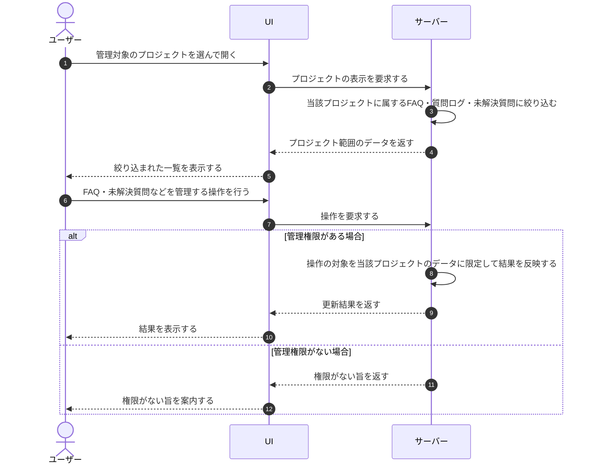

# UC-074: メンバーがプロジェクト範囲のFAQ・質問ログ・未解決質問を扱う

> **この業務ユースケースは「オーナー / メンバーが、開いているプロジェクトに属する FAQ・質問ログ・未解決質問だけを対象に管理できること」を定義します。**

*主アクター オーナー / メンバー ・ ステータス ドラフト*

## 概要

オーナー / メンバーが対象プロジェクトを開くと、そのプロジェクトに属する FAQ・質問ログ・未解決質問のみが表示・操作の対象となる。複数のプロジェクトを運用していても、データはプロジェクト単位で分離され、別プロジェクトの内容が混ざらない形で扱える。

## 主アクター

オーナー / メンバー

## 目的

プロジェクトごとに FAQ・質問ログ・未解決質問を分離して管理し、別プロジェクトのデータと取り違えることなく、担当範囲だけを安全かつ効率的に保守できるようにする。

## 事前条件

- オーナー / メンバーが認証済みである。
- 複数のプロジェクトが存在し得る。
- 対象プロジェクトに対する管理権限を持っている。

## 基本フロー

1. オーナー / メンバーが管理対象のプロジェクトを選んで開く。
2. システムが、当該プロジェクトに属する FAQ・質問ログ・未解決質問のみを表示対象として絞り込む。
3. オーナー / メンバーが、表示された範囲内で FAQ・質問ログ・未解決質問を確認する。
4. オーナー / メンバーが、プロジェクト範囲内のデータを管理する(FAQ の整備や未解決質問の対応状況の更新など)。
5. システムが、操作の対象を当該プロジェクトのデータに限定して結果を反映する。

## 代替フロー

- オーナー / メンバーが別のプロジェクトへ切り替えた場合は、システムが表示・操作の対象を切り替え先プロジェクトのデータに入れ替える。

## 例外フロー

- 対象プロジェクトに対する管理権限がない場合は、システムが操作を受け付けず、権限がない旨を案内する。

## 事後条件

- FAQ・質問ログ・未解決質問が、プロジェクト単位で分離されたまま管理される。
- 行った操作の結果が、当該プロジェクトの範囲内にのみ反映される。

## トレーサビリティ

トレーサビリティID [TR-074](../../02_basic_design/00_traceability/index.md#TR-074)。本ユースケースが対応する要件、および実現する設計(画面・システム・API・データベース・シーケンス)は当該 TR の行を参照する。

