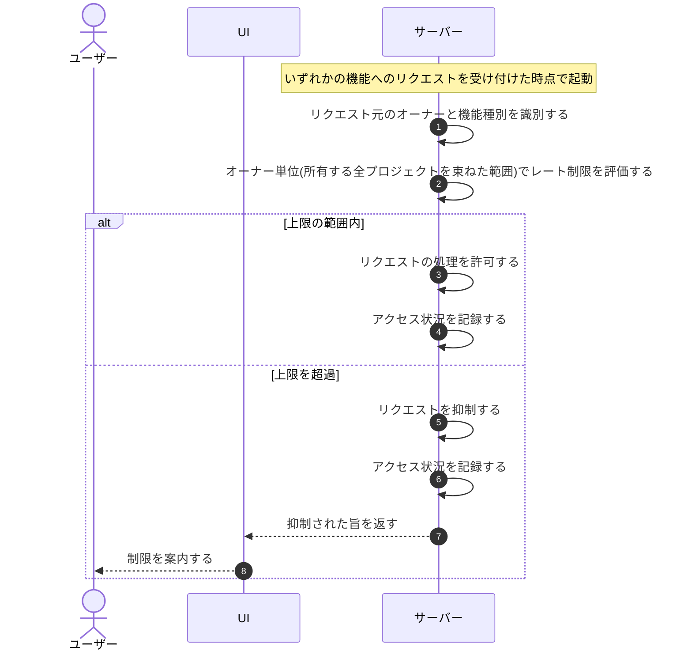

# UC-075: システムがオーナー単位のレート制限を適用する

> **この業務ユースケースは「DDoS・Bot・暴走対策として、各機能へのアクセスにオーナー・種別別の上限をオーナー単位(オーナーが所有する全プロジェクトを束ねた範囲)で適用し、超過時にリクエストを抑制する」ことを定義します。**

*主アクター システム ・ ステータス ドラフト*

## 概要

システムは、各機能へのリクエストが発生するたびに、オーナー・機能種別ごとに定めたレート制限をオーナー単位(当該オーナーが所有する全プロジェクトを束ねた範囲)で評価する。上限を超えたリクエストは抑制し、DDoS・Bot・暴走による過負荷からサービスを防御する。

## 主アクター

システム

## 目的

濫用や過負荷からサービスの可用性を守り、オーナー間で公平な利用を確保する。

## 事前条件

- トリガー(起動契機): いずれかの機能へのリクエストが発生する。
- オーナー・機能種別ごとのレート制限の上限が定められている。

## 基本フロー

1. システムが機能へのリクエストを受け付ける。
2. システムがリクエスト元のオーナー(リクエスト元プロジェクトの所有者)と機能種別を識別する。
3. システムが当該オーナー・種別に定められたレート制限の上限をオーナー単位(当該オーナーが所有する全プロジェクトを束ねた範囲)で評価する。
4. 上限の範囲内であれば、システムがリクエストの処理を許可する。
5. 上限を超過していれば、システムが当該リクエストを抑制する。
6. システムが評価結果に応じてアクセス状況を記録する。

## 代替フロー

- 本レート制限はオーナー単位(所有する全プロジェクトを束ねた範囲)での適用とし、プロジェクト単位化の対象外とする(月次の上限件数・無料枠のみプロジェクト単位で扱う)。

## 例外フロー

—

## 事後条件

- セキュリティ目的のレート制限がオーナー単位で適用された状態になる。
- 上限を超過したリクエストは抑制され、サービスの過負荷が防がれる。

## トレーサビリティ

トレーサビリティID [TR-075](../../02_basic_design/00_traceability/index.md#TR-075)。本ユースケースが対応する要件、および実現する設計(画面・システム・API・データベース・シーケンス)は当該 TR の行を参照する。

