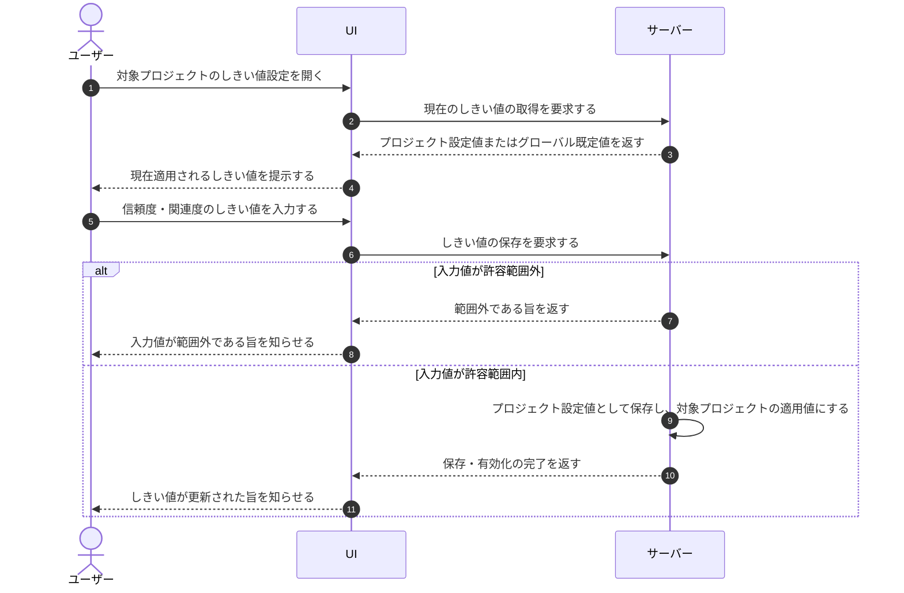

# UC-075: メンバーがプロジェクト単位の信頼度・関連度しきい値を調整する

> **この業務ユースケースは「回答可否を判定する信頼度・関連度のしきい値を、プロジェクト単位で調整できること」を定義します。**

*主アクター オーナー / メンバー ・ ステータス ドラフト*

## 概要

回答可否判定に用いる信頼度・関連度のしきい値を、対象プロジェクト単位で調整できる業務である。対象プロジェクトの設定値が登録されている場合はその値を使用し、未登録の場合はグローバル既定値を使用する。

## 主アクター

オーナー / メンバー

## 目的

プロジェクトの利用実態に合わせて回答可否の基準を調整し、誤回答の抑制と回答率のバランスを各現場の事情に応じて最適化する。

## 事前条件

- 主アクターが対象プロジェクトのしきい値を調整できる権限を持つ。
- 調整対象のプロジェクトが存在する。

## 基本フロー

1. 主アクターが対象プロジェクトのしきい値設定を開く。
2. 主アクターが信頼度・関連度のしきい値を入力する。
3. システムが入力値が許容範囲内であることを確認する。
4. システムが入力値をプロジェクト設定値として保存し、同時に有効化する。
5. 以後の回答可否判定では、対象プロジェクトの設定値を使用する。

## 代替フロー

- 対象プロジェクトの設定値が未登録の場合、システムはグローバル既定値を使用する。
- 主アクターが両方のしきい値を未入力のまま保存した場合、システムはプロジェクト設定値を削除し、グローバル既定値へ復帰する。

## 例外フロー

- 入力値が許容範囲外の場合、システムは保存せず、値が範囲外である旨を主アクターに通知する。

## 事後条件

- 調整したしきい値が対象プロジェクトの設定値として有効化され、以後の回答可否判定に反映される。

## トレーサビリティ

関連する要件・基本設計の対応は [トレーサビリティ一覧](../../02_basic_design/00_traceability/index.md) で一元管理する。
