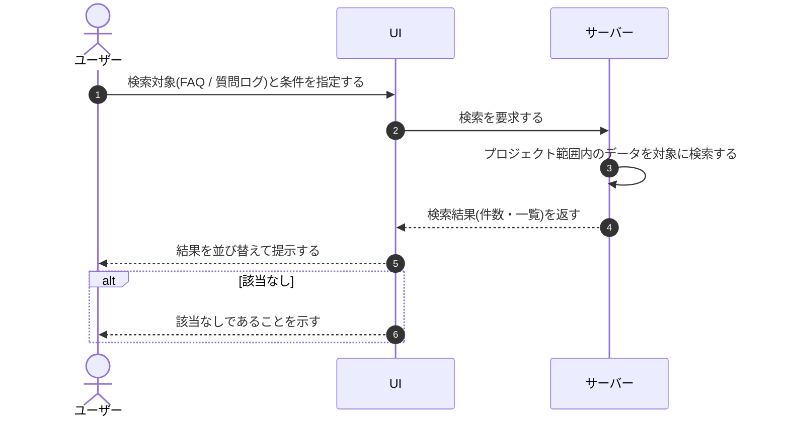

# UC-076: メンバーがFAQ・質問ログを検索する

> **この業務ユースケースは「オーナー / メンバーが、担当プロジェクトの範囲で FAQ と質問ログを条件で絞り込んで探し出せること」を定義します。**

*主アクター オーナー / メンバー ・ ステータス ドラフト*

## 概要

オーナー / メンバーが、現在開いているプロジェクトの FAQ と質問ログを対象に、キーワードや期間などの条件で検索して目的のデータに短時間で到達できる業務である。FAQ はキーワードによる全文検索、質問ログはキーワードに加えて期間でも絞り込める。

## 主アクター

オーナー / メンバー

## 目的

FAQ 件数や質問ログが増えても、目的の FAQ や過去の問い合わせ内容に短時間でたどり着き、FAQ の整備状況の確認や未解決質問の対応進捗の把握を効率的に行うため。

## 事前条件

- オーナー / メンバーが対象プロジェクトを開いている。
- 検索対象となる FAQ または質問ログが存在する。

## 基本フロー

1. オーナー / メンバーが、FAQ または質問ログのいずれを探すかを選び、検索条件(キーワード、質問ログの場合は対象期間)を指定する。
2. システムが、現在開いているプロジェクトに属するデータだけを対象に検索を実行する。
3. システムが、検索結果を見やすい順序に並べ替え、件数が多い場合は分割して提示する。
4. オーナー / メンバーが、提示された結果を参照し、目的の FAQ や質問ログを確認する。

## 代替フロー

- FAQ を探す場合はキーワードによる全文検索を行う。
- 質問ログを探す場合はキーワードと対象期間の双方で絞り込める。

## 例外フロー

- 検索条件に合致するデータが 1 件もない場合は、該当なしであることが分かる状態で提示される。

## 事後条件

- プロジェクト範囲内の FAQ・質問ログの検索結果がオーナー / メンバーに提示され、参照できる状態になる。

## トレーサビリティ

関連する要件・基本設計の対応は [トレーサビリティ一覧](../../02_basic_design/00_traceability/index.md) で一元管理する。

## 備考

本業務ユースケースは、FAQ の全文検索と質問ログの検索(質問ログは期間検索を含む)を 1 つの検索業務として統合したものである。
