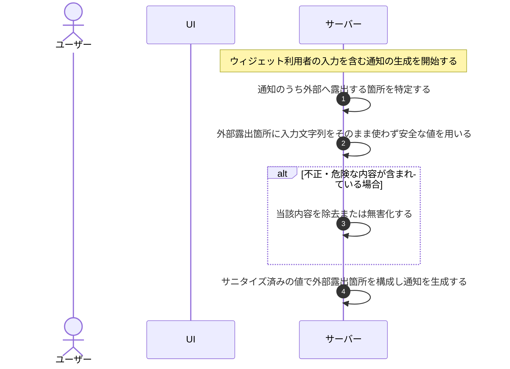

# UC-076: システムがウィジェット入力を外部露出箇所からサニタイズする

> **この業務ユースケースは「ウィジェット利用者が入力した文字列を、メール件名や送信元情報などの外部に露出する箇所へそのまま使わず、安全な値に整えてから使うこと」を定義します。**

*主アクター システム ・ ステータス ドラフト*

## 概要

ウィジェット利用者の入力を含む通知を生成する際に、システムがその入力文字列を外部へ露出する箇所(メール件名・送信元情報など)へそのまま使わず、安全な固定値やサニタイズ済みの値で構成する。これにより、ウィジェットの入力を悪用したスパム埋め込みやなりすましを防ぐ。

## 主アクター

システム

## 目的

ウィジェット利用者の入力に紛れ込ませた不正な文字列が外部露出箇所へそのまま流れることを防ぎ、サービスからの通知に対する受信者の信頼となりすまし防止を確保する。

## 事前条件

- トリガー: ウィジェット利用者の入力を含む通知を生成しようとしている。
- 通知の対象となる入力文字列が、外部へ露出する箇所で利用され得る状態にある。

## 基本フロー

1. システムが、ウィジェット利用者の入力を含む通知の生成を開始する。
2. システムが、通知のうち外部へ露出する箇所(件名・送信元情報など)を特定する。
3. システムが、外部露出箇所には入力文字列をそのまま使わず、安全な固定値またはサニタイズ済みの値を用いる。
4. システムが、サニタイズ済みの値で外部露出箇所を構成し、通知を生成する。

## 代替フロー

—

## 例外フロー

- 入力文字列に不正・危険とみなす内容が含まれている場合は、当該内容を除去または無害化してから利用する。

## 事後条件

- スパム埋め込み・なりすましを防いだ通知が生成される。
- 外部露出箇所には安全な固定値またはサニタイズ済みの値のみが用いられている。

## トレーサビリティ

トレーサビリティID [TR-076](../../02_basic_design/00_traceability/index.md#TR-076)。本ユースケースが対応する要件、および実現する設計(画面・システム・API・データベース・シーケンス)は当該 TR の行を参照する。

