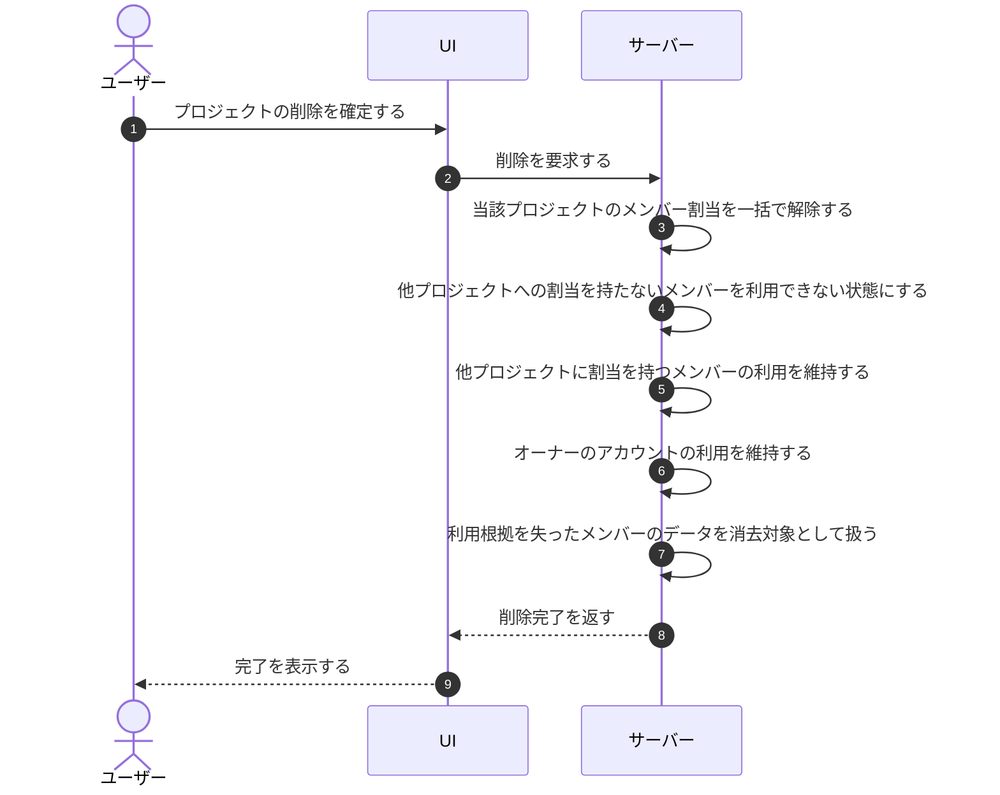

# UC-077: システムがプロジェクト削除時にメンバー割当を解除する

> **この業務ユースケースは「プロジェクトが削除されたとき、当該プロジェクトのメンバー割当を解除し、利用根拠を失ったメンバーを利用停止にすること」を定義します。**

*主アクター システム ・ ステータス ドラフト*

## 概要

プロジェクトが削除されると、システムは当該プロジェクトに紐づくメンバーの割当を一括で解除します。これにより利用根拠を失ったメンバーは利用できない状態とし、利用根拠を失ったアカウントとデータを残さないようにします。他プロジェクトに割当が残るメンバーやオーナーは利用を維持します。

## 主アクター

システム

## 目的

不要となったメンバー割当を速やかに解除し、利用根拠のないアクセス権や個人情報の滞留を防ぎ、権限の取り残しをなくす。

## 事前条件

- 削除対象のプロジェクトが存在する。
- 当該プロジェクトに対するメンバーの割当が登録されている。

## 基本フロー

1. オーナーがプロジェクトの削除を確定する。
2. システムが削除を受け付け、当該プロジェクトに紐づくメンバー割当を一括で解除する。
3. システムが、解除後に他のプロジェクトへ有効な割当を持たないメンバー(オーナーを除く)を利用できない状態にする。
4. システムが、他のプロジェクトに有効な割当を持つメンバーは利用を維持し、当該プロジェクトの割当のみを解除する。
5. システムが、オーナーのアカウントは利用を維持する。
6. システムが、利用根拠を失ったメンバーの関連データを所定の保持期間の経過後に消去対象として扱う。

## 代替フロー

- 当該プロジェクトに他のメンバー割当が存在しない場合は、割当解除を行わず削除のみを完了する。

## 例外フロー

- 割当解除の処理に失敗した場合は、整合を取り直し、割当・利用状態の不整合を残さないようにする。

## 事後条件

- 当該プロジェクトのメンバー割当がすべて解除されている。
- 利用根拠を失ったメンバー(オーナーを除く)が利用できない状態になっている。
- 他プロジェクトに割当が残るメンバーとオーナーは利用を維持している。
- 消去対象となったデータは所定の保持期間の経過後に完全に消去される。

## トレーサビリティ

トレーサビリティID [TR-077](../../02_basic_design/00_traceability/index.md#TR-077)。本ユースケースが対応する要件、および実現する設計(画面・システム・API・データベース・シーケンス)は当該 TR の行を参照する。

