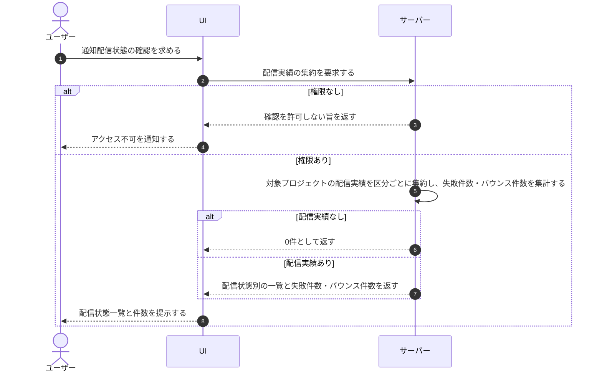

# UC-077: メンバーが通知配信状態・失敗・バウンス件数を確認する

> **この業務ユースケースは「オーナー / メンバーが、通知の配信状態(送信待ち・送信済み・配信済み・失敗・バウンス・苦情・送信停止)と失敗件数・バウンス件数を確認して配信状況を把握できること」を定義します。**

*主アクター オーナー / メンバー ・ ステータス ドラフト*

## 概要

オーナー / メンバーが、自プロジェクトで送信した通知の配信状態(送信待ち・送信済み・配信済み・失敗・バウンス・苦情・送信停止)を一覧で確認し、あわせて失敗件数・バウンス件数を把握する業務である。配信状態を可視化することで、通知が相手に届いているか、失敗や停止が起きていないかを把握し、トラブル時の対処につなげる。

## 主アクター

オーナー / メンバー

## 目的

通知の到達状況と配信状態を把握し、配信失敗や送信停止が起きている場合に早期に気づいて対処できるようにする。

## 事前条件

- 主アクターがオーナー / メンバーとして認証済みである。
- 対象プロジェクトの通知配信実績が蓄積されている。

## 基本フロー

1. オーナー / メンバーが、対象プロジェクトの通知の配信状態を確認する操作を行う。
2. システムが対象プロジェクトの通知配信実績を集約する。
3. システムが、各通知の配信状態(送信待ち・送信済み・配信済み・失敗・バウンス・苦情・送信停止)を区分した一覧と、失敗件数・バウンス件数を提示する。
4. オーナー / メンバーが配信状態と件数を確認し、失敗や停止が起きていないかを把握する。

## 代替フロー

- 対象となる通知配信実績が 1 件も無い場合は、システムが0件である旨を示す。

## 例外フロー

- 主アクターに対象プロジェクトを参照する権限が無い場合は、システムが確認を許可しない。

## 事後条件

- オーナー / メンバーに対象プロジェクトの通知配信状態と失敗件数・バウンス件数が提示される。
- 配信状態の確認による業務データの変更は発生しない。

## トレーサビリティ

トレーサビリティID [TR-077](../../02_basic_design/00_traceability/index.md#TR-077)。本ユースケースが対応する要件、および実現する設計(画面・システム・API・データベース・シーケンス)は当該 TR の行を参照する。

