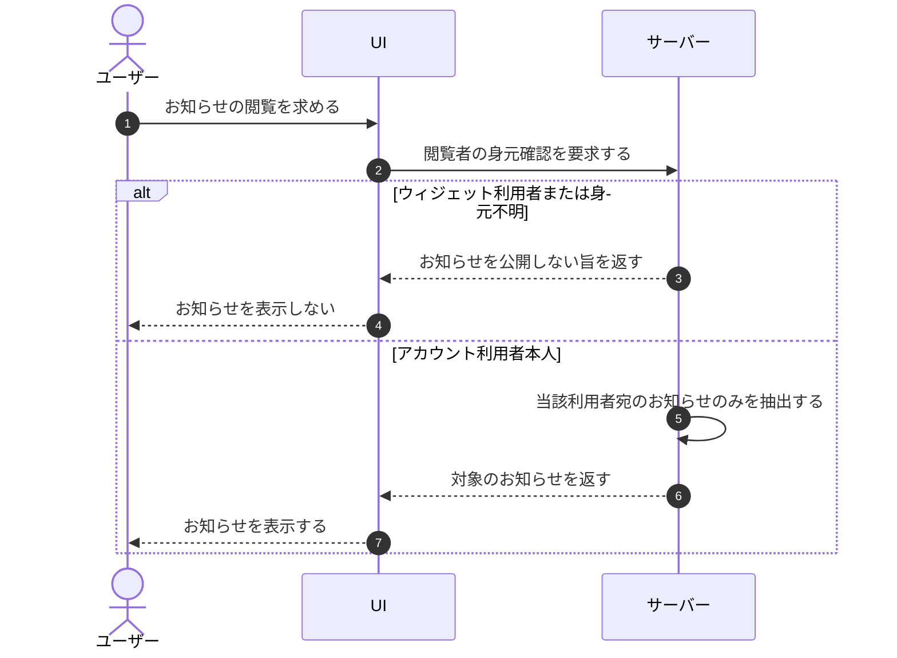

# UC-078: システムがお知らせをアカウント利用者のみに表示する

> **このユースケースは「お知らせをアカウント利用者本人だけに見せ、ウィジェット利用者には公開しないこと」を定義します。**

*主アクター システム ・ ステータス ドラフト*

## 概要

お知らせにはアカウントの機微情報が含まれうるため、システムはお知らせをアカウント利用者本人にのみ表示する。エンドユーザーであるウィジェット利用者にはお知らせを一切公開しない。

## 主アクター

システム

## 目的

お知らせの閲覧範囲をアカウント利用者本人に限定することで、アカウントの機微情報が部外者やウィジェット利用者に漏れることを防ぐ。

## 事前条件

- 対象のアカウント利用者宛にお知らせが配信されている。
- 閲覧しようとする者の身元(アカウント利用者か否か)を識別できる。

## 基本フロー

1. 利用者がお知らせの閲覧を求める。
2. システムが閲覧者がアカウント利用者本人であることを確認する。
3. システムが当該アカウント利用者宛のお知らせのみを抽出する。
4. システムがそのお知らせをアカウント利用者本人に表示する。

## 代替フロー

- 閲覧者がウィジェット利用者である場合、システムはお知らせを一切表示しない。

## 例外フロー

- 閲覧者がアカウント利用者として識別できない場合、システムはお知らせを表示しない。

## 事後条件

- お知らせが、宛先であるアカウント利用者本人にのみ表示される。
- ウィジェット利用者にはお知らせが公開されていない。

## トレーサビリティ

関連する要件・基本設計の対応は [トレーサビリティ一覧](../../02_basic_design/00_traceability/index.md) で一元管理する。

