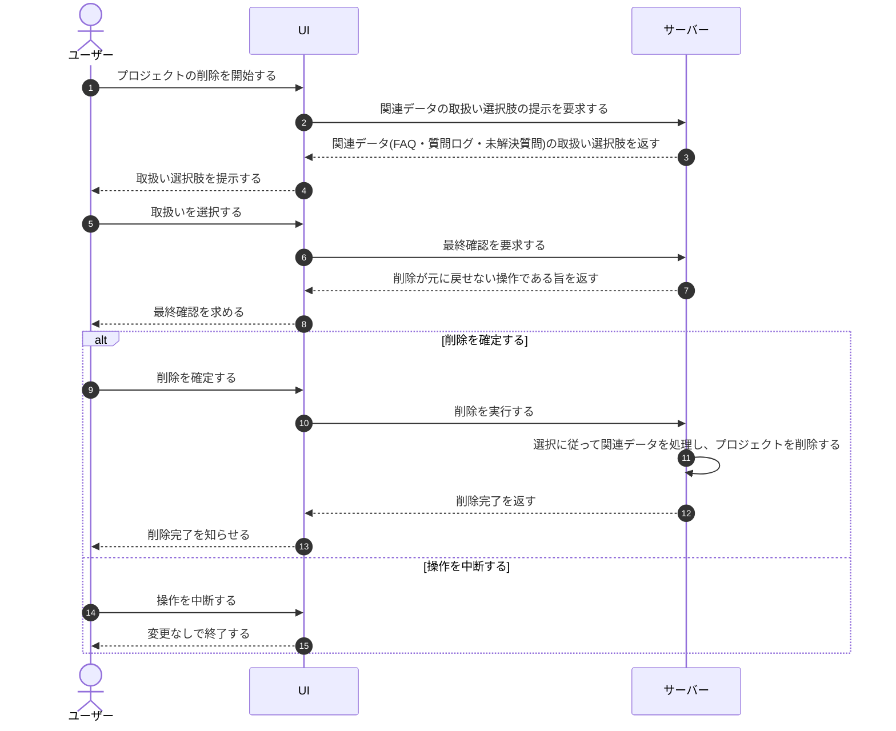

# UC-079: 利用者がプロジェクト削除時の関連データ取扱いを選択する

> **この業務ユースケースは「プロジェクトを削除するとき、利用者が FAQ・質問ログ・未解決質問など関連データの取扱いを確認したうえで削除を進められること」を定義します。**

*主アクター オーナー ・ ステータス ドラフト*

## 概要

オーナーがプロジェクトの削除を始めると、システムはそのプロジェクトに紐づく FAQ・質問ログ・未解決質問といった関連データの取扱い選択肢を提示する。オーナーは取扱いを確認・選択したうえで削除を確定し、システムは選択に従って関連データを処理する。削除は元に戻せないため、確定前の確認を業務上の前提とする。

## 主アクター

オーナー

## 目的

オーナーが不要になったプロジェクトを整理する際に、紐づく関連データの取扱いを把握したうえで削除でき、意図しないデータの喪失や誤削除を避けられるようにする。

## 事前条件

- オーナーが対象プロジェクトを削除する権限を持つ。
- 削除対象のプロジェクトに、FAQ・質問ログ・未解決質問などの関連データが存在する。

## 基本フロー

1. オーナーが対象プロジェクトの削除を開始する。
2. システムが、削除に伴う関連データ(FAQ・質問ログ・未解決質問)の取扱い選択肢を提示する。
3. オーナーが提示内容を確認し、関連データの取扱いを選択する。
4. システムが、削除が元に戻せない操作であることを案内し、最終確認を求める。
5. オーナーが削除を確定する。
6. システムが選択に従って関連データを処理し、プロジェクトを削除する。

## 代替フロー

- オーナーが取扱いの選択をやり直す場合は、選択肢の確認に戻ってから削除を確定する。

## 例外フロー

- オーナーが確認・選択の途中で操作を中断した場合、削除は実行されず、プロジェクトと関連データはそのまま残る。

## 事後条件

- オーナーの選択に従って、プロジェクトに紐づく関連データが処理される。
- 削除が確定したプロジェクトとその関連データは元に戻せない状態となる。
- 操作を中断した場合は、プロジェクトと関連データに変更が生じない。

## トレーサビリティ

トレーサビリティID [TR-079](../../02_basic_design/00_traceability/index.md#TR-079)。本ユースケースが対応する要件、および実現する設計(画面・システム・API・データベース・シーケンス)は当該 TR の行を参照する。

