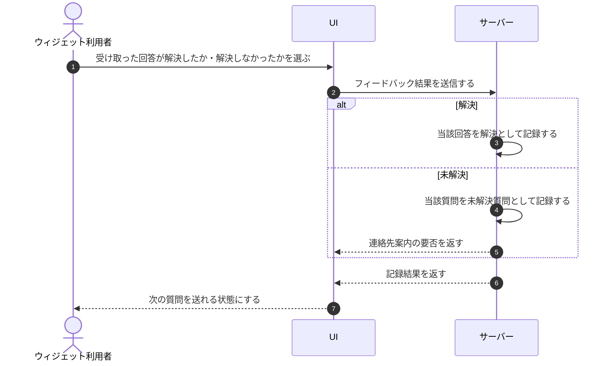

# UC-083: ウィジェット利用者が回答の解決・未解決をフィードバックする

> **この業務ユースケースは「ウィジェット利用者が AI の回答に対して解決したか未解決かをフィードバックし、未解決の場合は運用が追える未解決質問として記録される」ことを定義します。**

*主アクター ウィジェット利用者 ・ ステータス ドラフト*

## 概要

ウィジェット利用者が AI から回答を受け取った後、その回答で疑問が解決したか・解決しなかったかをフィードバックする業務である。フィードバックは次の質問を送る前に必ず行い、未解決を選んだ場合は当該質問が未解決質問として記録され、設定があれば連絡先の案内が示される。

## 主アクター

ウィジェット利用者

## 目的

回答が役に立ったかを利用者自身の評価として集め、解決できなかった問い合わせを確実に運用へ引き継ぐことで、FAQ 改善と取りこぼし防止につなげる。

## 事前条件

- ウィジェットで質問を送り、AI からの回答を受け取っている。
- 同じ回答にまだフィードバックを行っていない。

## 基本フロー

1. ウィジェット利用者が、受け取った回答について解決したか・解決しなかったかを選ぶ。
2. システムがフィードバック結果を記録する。
3. 解決しなかった場合、システムが当該質問を未解決質問として記録する。
4. 連絡先が設定済みであれば、システムが利用者に連絡先の案内を示す。
5. フィードバック後、利用者は次の質問を送れるようになる。

## 代替フロー

- 解決を選んだ場合、未解決質問は記録せず解決として扱う。

## 例外フロー

- フィードバックの記録に失敗した場合、システムはその旨を示し、利用者に再度のフィードバックを促す(記録できるまで次の質問は送れない)。

## 事後条件

- フィードバック結果が記録されている。
- 解決しなかった場合は当該質問が未解決質問として記録されている。
- フィードバック後、利用者は次の質問を送れる状態になっている。

## トレーサビリティ

関連する要件・基本設計の対応は [トレーサビリティ一覧](../../02_basic_design/00_traceability/index.md) で一元管理する。

## 備考

回答ごとのフィードバックは次の質問を送る前の必須操作とする(未選択のままでは次の質問を送れない)。
