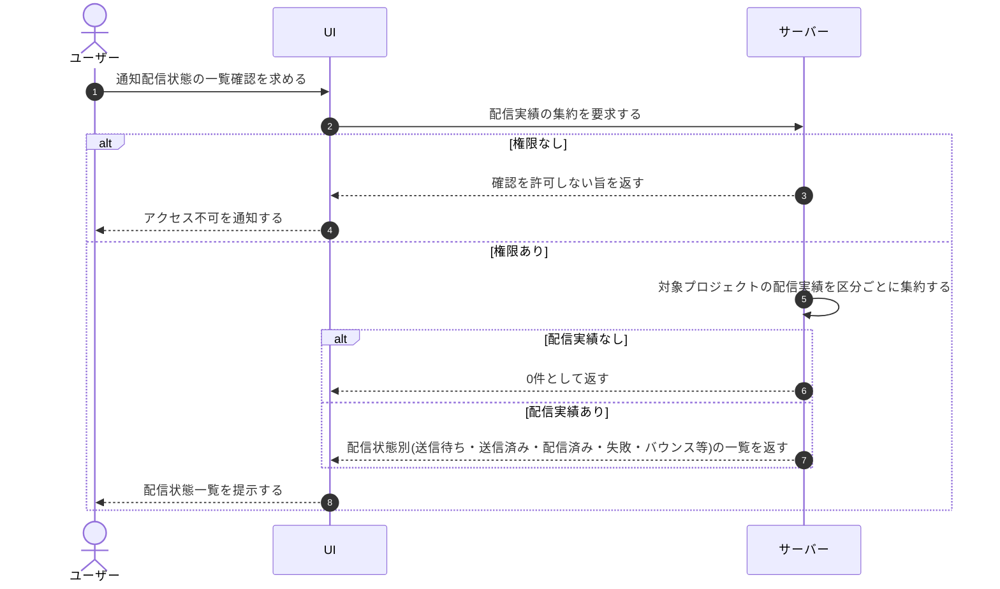

# UC-083: メンバーが通知配信状態を確認する

> **この業務ユースケースは「メンバーが、各通知が相手に届いたか・失敗や停止が起きていないかを配信状態として確認できる」ことを定義します。**

*主アクター オーナー / メンバー ・ ステータス ドラフト*

## 概要

オーナー / メンバーが、自プロジェクトから送信した通知の配信状態(送信待ち・送信済み・配信済み・失敗・バウンス・苦情・送信停止)を一覧で確認できる業務である。通知が相手に届いたかどうかや、失敗・停止が発生していないかを把握し、トラブル時の対処につなげる。

## 主アクター

オーナー / メンバー

## 目的

通知が利用者へ確実に届いているかをメンバー自身が把握し、配信失敗や送信停止を早期に発見してトラブルへ対処できるようにする。

## 事前条件

- 主アクターがオーナー / メンバーとして認証済みである。
- 対象プロジェクトの通知配信実績が蓄積されている。

## 基本フロー

1. 主アクターが、対象プロジェクトの通知配信状態の確認を求める。
2. システムが、対象プロジェクトの通知配信実績を集約する。
3. システムが、各通知の配信状態(送信待ち・送信済み・配信済み・失敗・バウンス・苦情・送信停止)を区分して一覧で示す。
4. 主アクターが、配信状態を確認し、失敗や停止が起きていないかを把握する。

## 代替フロー

- 対象となる通知配信実績が 1 件も無い場合は、システムが0件である旨を示す。

## 例外フロー

- 主アクターに対象プロジェクトを参照する権限が無い場合は、システムが確認を許可しない。

## 事後条件

- 対象プロジェクトの通知配信状態が主アクターに提示される。
- 配信状態の確認による業務データの変更は発生しない。

## トレーサビリティ

トレーサビリティID [TR-083](../../02_basic_design/00_traceability/index.md#TR-083)。本ユースケースが対応する要件、および実現する設計(画面・システム・API・データベース・シーケンス)は当該 TR の行を参照する。

