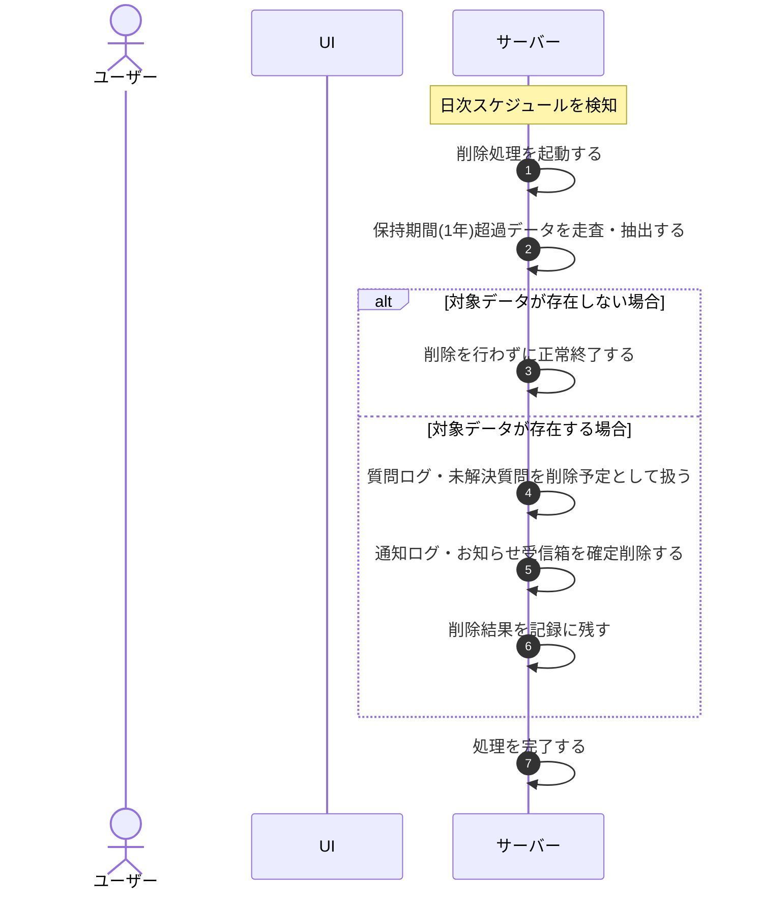

# UC-087: システムが保持期間超過データを自動削除する

> **この業務ユースケースは「データ保持期間(1 年)を過ぎた質問ログ・未解決質問・通知ログ・お知らせ受信箱を、システムが定期的に抽出し、対象に応じた方式で削除する」処理を定義します。**

*主アクター システム ・ ステータス ドラフト*

## 概要

定められたデータ保持期間(1 年)を超過した質問ログ・未解決質問・通知ログ・お知らせ受信箱を、システムが定期的(日次)に走査して抽出し、対象ごとの削除方式に従って削除する。後から確定削除する仕組みを持つ対象は一旦削除予定として扱い、追記のみで管理される対象はその場で確定削除する。削除した結果は記録に残し、対象が存在しない場合は何も削除せずに正常終了する。

## 主アクター

システム

## 目的

保持期間を過ぎたデータを定期的に整理することで、不要なデータを抱え込まずデータ最小化を担保し、プライバシー保護とコンプライアンスを果たす。

## 事前条件

- 起動契機: 定期的な実行スケジュール(日次)によりシステムが自動起動する。
- 各データに、保持期間の起算に用いる作成時点が記録されている。
- データ保持期間(1 年)が定められている。

## 基本フロー

1. 実行スケジュールに従い、システムが保持期間超過データの削除処理を起動する。
2. システムが質問ログ・未解決質問・通知ログ・お知らせ受信箱を走査し、作成時点から保持期間(1 年)を超過したものを削除の対象として抽出する。
3. システムが、後から確定削除する仕組みを持つ対象(質問ログ・未解決質問)を削除予定として扱う(確定削除は猶予期間の経過後に別途行われる)。
4. システムが、追記のみで管理される対象(通知ログ・お知らせ受信箱)をその場で確定削除する。
5. システムが、削除を実行した結果を記録に残す。
6. システムが処理を完了する。

## 代替フロー

—

## 例外フロー

- 保持期間を超過したデータが存在しない場合は、削除を行わずに正常終了する。

## 事後条件

- 保持期間(1 年)を超過した質問ログ・未解決質問が削除予定として扱われ、猶予期間の経過後に確定削除される。
- 保持期間(1 年)を超過した通知ログ・お知らせ受信箱が確定削除され、復元できない(不可逆)。
- 削除を実行した結果が記録に残る。

## トレーサビリティ

トレーサビリティID [TR-087](../../02_basic_design/00_traceability/index.md#TR-087)。本ユースケースが対応する要件、および実現する設計(画面・システム・API・データベース・シーケンス)は当該 TR の行を参照する。
