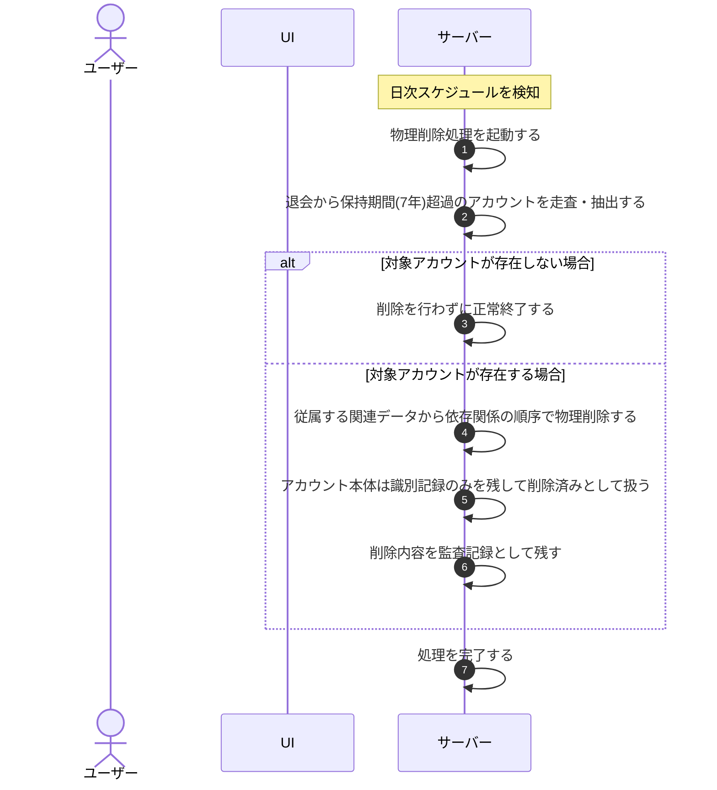

# UC-089: システムが保持期間経過アカウントを物理削除する

> **この業務ユースケースは「退会から保持期間(7 年)を経過したアカウントのアカウント・請求・利用者データ(および退会時に削除済みとなったプロジェクト)を、システムが定期的に物理削除し、以後ログイン不可とする」処理を定義します。**

*主アクター システム ・ ステータス ドラフト*

## 概要

退会済みのアカウントのうち、退会からアカウント・請求関連データの保持期間(7 年)を経過したものを、システムが定期的(日次)に走査して抽出し、当該アカウントに紐づく請求関連データ(請求書・サブスクリプション・支払方法・課金関連の監査記録)、当該アカウントが退会時に削除済みとしたプロジェクト、および利用者データを物理削除する。ただし、同一識別子の再利用を防ぐため、アカウントそのものは最小限の識別記録のみを復元不能な形で残して削除済みとして扱い、それ以外を削除する。削除は依存関係の順序に従って行い、削除内容を監査記録として残す。削除後は当該アカウントの保有者はログインできなくなる。

## 主アクター

システム

## 目的

保持義務の期間を満了した請求・利用者データおよびアカウント・プロジェクトのデータを確定削除してデータ最小化を担保し(アカウントは同一識別子の再利用防止に必要な最小限の記録のみを残す)、不要な個人データを残さないことでプライバシー保護とコンプライアンスを果たす。

## 事前条件

- 起動契機: 定期的な実行スケジュール(日次)によりシステムが自動起動する。
- 対象とするアカウントが退会済みの状態である。
- 退会からアカウント・請求関連データの保持期間(7 年)を経過している。

## 基本フロー

1. 実行スケジュールに従い、システムが保持期間経過アカウントの物理削除処理を起動する。
2. システムが退会済みのアカウントを走査し、退会から保持期間(7 年)を経過したものを物理削除の対象として抽出する。
3. システムが、抽出したアカウントに紐づく請求関連データ(請求書・サブスクリプション・支払方法・課金関連の監査記録)、当該アカウントが退会時に削除済みとしたプロジェクト、および利用者データを、依存関係の順序に従って物理削除する(従属する関連データから先に削除する)。アカウントそのものは、同一識別子の再利用を防ぐため最小限の識別記録のみを残して削除済みとして扱う。
4. システムが、削除した内容を監査記録として残す。
5. システムが処理を完了する。

## 代替フロー

—

## 例外フロー

- 保持期間を経過したアカウントが存在しない場合は、削除を行わずに正常終了する。
- いずれかの対象の削除が失敗した場合は、整合性を損なわない範囲で当該対象の削除を中止し、失敗を記録したうえで次回の実行時に再評価する。

## 事後条件

- 保持期間(7 年)を経過したアカウントの請求・利用者データ、および当該アカウントが退会時に削除済みとしたプロジェクトが物理削除され、復元できない(不可逆)。アカウントそのものは、同一識別子の再利用を防ぐための最小限の識別記録のみを残して削除済みとなる。
- 削除は依存関係の順序で行われ、データ間の整合性が保たれている。
- 当該アカウントの保有者は以後ログインできない。
- 削除内容が監査記録に残る。

## トレーサビリティ

トレーサビリティID [TR-089](../../02_basic_design/00_traceability/index.md#TR-089)。本ユースケースが対応する要件、および実現する設計(画面・システム・API・データベース・シーケンス)は当該 TR の行を参照する。
