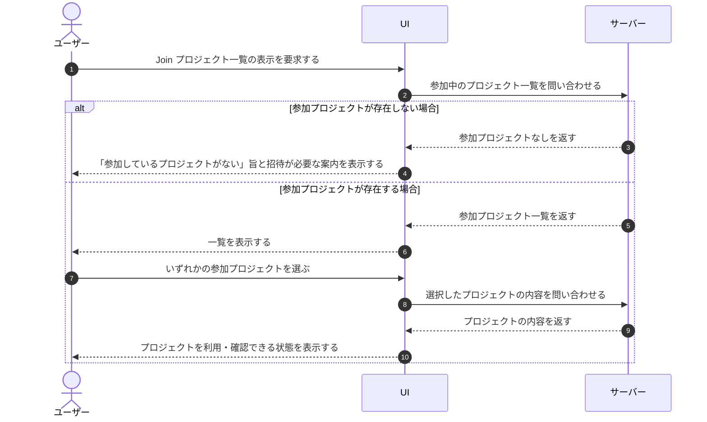

# UC-090: ユーザーが Join プロジェクト一覧を閲覧する

> **この業務ユースケースは「ユーザーが、他者が作成したプロジェクトに招待されて参加している(自分がオーナーでない)プロジェクトの一覧を一望し、参加先の利用や次の操作の起点とする」ことを定義します。**

*主アクター ユーザー(メンバー) ・ ステータス ドラフト*

## 概要

ユーザーが、他者が作成したプロジェクトに招待されて参加している(自分がオーナーではなくメンバーである)プロジェクトの一覧(Join プロジェクト一覧)を表示して、参加先の状況を把握する。一覧からは、各参加プロジェクトの利用や内容の確認といった後続操作の起点に進める。招待されて参加しているプロジェクトがまだ 1 件もない場合は、その旨と、参加するにはオーナーからの招待が必要である案内が示される。

> [!NOTE]
> 本ユースケースは、ユーザーが他者のプロジェクトに招待されて参加しているメンバーとしての参加先(Join プロジェクト)のみを対象とする。ユーザー自身が作成しオーナーとなっているプロジェクト(My プロジェクト)の一覧は、別ユースケース [UC-014](UC-014.md#UC-014) で扱う。

## 主アクター

ユーザー(メンバー)

## 目的

ユーザーが、自分が招待されて参加している参加先プロジェクトの全体像を一目で確認し、参加先での利用や確認の操作に迷わず着手できるようにする。

## 事前条件

- ユーザーとしてログイン済みである。
- 当該機能は、他者が作成したプロジェクトに招待されて参加している本人に対して、自分が参加しているプロジェクトの範囲で提供される。

## 基本フロー

1. ユーザーが Join プロジェクト一覧の表示を要求する。
2. システムが、当該ユーザーが招待されて参加している(自分がオーナーでない)プロジェクトを集約し、一覧として提示する。
3. ユーザーが一覧を確認し、各参加プロジェクトの状況を把握する。
4. ユーザーがいずれかの参加プロジェクトを選んだ場合、システムは当該プロジェクトの内容を確認・利用できる状態に移る。

## 代替フロー

- 招待されて参加しているプロジェクトが 1 件も存在しない場合、システムは一覧の代わりに「まだ参加しているプロジェクトがない」旨と、参加するにはオーナーからの招待が必要である案内を提示する。

## 例外フロー

- 一覧の取得に時間がかかる場合、システムは取得中であることをユーザーに示し、完了後に結果へ切り替える。

## 事後条件

- ユーザーが自分の参加しているプロジェクトの一覧、または参加先が無い旨を把握している。
- ユーザーが、必要に応じていずれかの参加プロジェクトの利用・確認の起点へ進める状態にある。

## トレーサビリティ

トレーサビリティID [TR-090](../../02_basic_design/00_traceability/index.md#TR-090)。本ユースケースが対応する要件、および実現する設計(画面・システム・API・データベース・シーケンス)は当該 TR の行を参照する。

## 備考

- 立場(オーナー / メンバー)はプロジェクトごとに決まる。同一ユーザーが、あるプロジェクトではオーナー(My プロジェクト)であり、別のプロジェクトではメンバー(Join プロジェクト)であることがあり得る。Join プロジェクト一覧は後者のみを対象とする。
- 参加先プロジェクトの料金は当該プロジェクトのオーナーに請求され、参加しているメンバー本人には請求されない。
