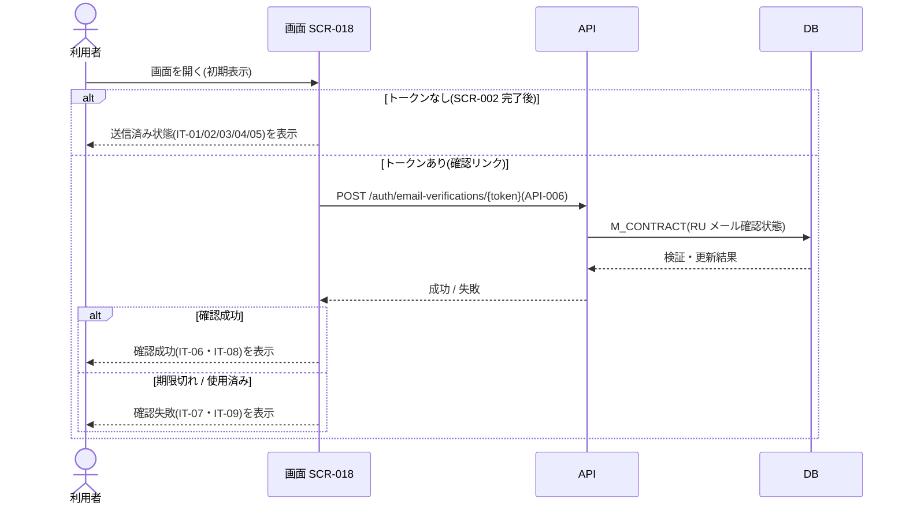

<!-- portal-top -->
[設計ポータル](../../README.md) ／ [要件定義](../index.md) ／ [業務ユースケース](index.md) ／ **UC-151: 初期表示**
<!-- /portal-top -->

# UC-151: 初期表示

> **URL パラメータに応じて送信済み状態を表示し、確認トークンがある場合はメール確認 API で検証して成功 / 失敗状態を表示するユースケース。**

*主アクター 対象ユーザー(認証前 / トークン) ・ ステータス ドラフト ・ 再構成 P2*

| 項目 | 内容 |
|---|---|
| 業務ユースケースID | UC-151 |
| 業務ユースケース名 | 初期表示 |
| 対応要件ID | [FR-003](../02_FunctionalRequirement/01_account-fr.md#FR-003) |
| 主アクター | 対象ユーザー(認証前 / トークン) |
| 目的 | URL パラメータに応じて送信済み状態を表示し、確認トークンがある場合はメール確認 API で検証して成功 / 失敗状態を表示するユースケース。 |

## 事前条件

SCR-002 完了後に遷移、または確認リンクから到達した

## 基本フロー

1. 画面が URL パラメータ(確認トークンの有無)を確認する。
2. トークンなし(SCR-002 完了後)の場合、状態タイムライン(IT-01)・送信先メールアドレス(IT-02)・案内文(IT-03)を表示し、再送(IT-04)・メールアドレス変更(IT-05)を活性表示する。
3. トークンあり(確認リンクからのアクセス)の場合、メール確認 API(`POST /auth/email-verifications/{token}` = [API-006](../../02_basic_design/03_apis/API-006.md#API-006))でトークンを検証する。
4. API は確認トークンを検証し、メール確認状態(`M_CONTRACT`)を更新する。
5. 成功時、画面は確認成功アラート(IT-06)と「ログインする」(IT-08)を表示する。

## 代替フロー

—(本イベントは単一の正常フロー。条件分岐は基本フローに含む)

## 例外フロー

- 失敗(期限切れ・使用済み): 確認失敗アラート(IT-07)と「新規登録からやり直す」(IT-09)を表示する(有効期限 24 時間)。

## 事後条件

トークンなし(SCR-002 完了後)は送信済み状態(IT-01・IT-02・IT-03・IT-04・IT-05)を表示する。トークンありは検証し、成功時は確認成功(IT-06・IT-08)、失敗時は確認失敗(IT-07・IT-09)を表示する

## 関連

| 関連区分 | 内容 |
|---|---|
| 関連画面ID | [SCR-018](../../02_basic_design/01_screens/SCR-018.md#SCR-018) ・ [SCR-002](../../02_basic_design/01_screens/SCR-002.md#SCR-002) |
| 関連画面イベントID | [EVT-151](../../02_basic_design/02_screen_events/EVT-151.md#EVT-151) |
| 関連API ID | [API-006](../../02_basic_design/03_apis/API-006.md#API-006) |
| 関連テーブルID | `M_CONTRACT` = [TBL-002](../../02_basic_design/04_database/TBL-002.md#TBL-002) |

## 備考

再構成 P2 で旧 `UC-SCR-013-EV01`(画面 SCR-018 のイベント `EV-01`)から導出。トリガー: EV-01: 初期表示。シーケンス図は P6(SEQ)で保持する。

---

<!-- portal-bottom -->
[← 業務ユースケース](index.md) ・ [要件定義](../index.md) ・ [↑ 設計ポータル](../../README.md)
<!-- /portal-bottom -->
