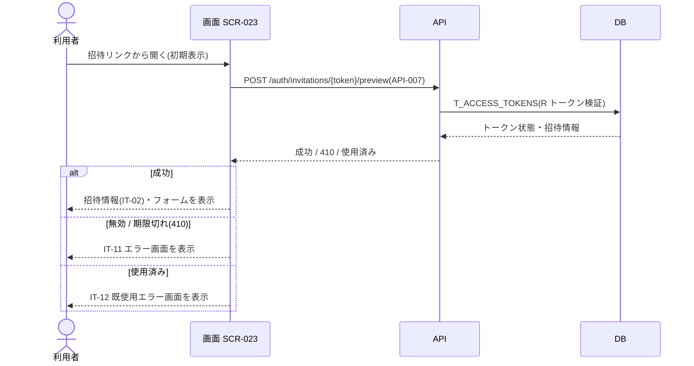

<!-- portal-top -->
[設計ポータル](../../README.md) ／ [要件定義](../index.md) ／ [業務ユースケース](index.md) ／ **UC-181: 初期表示**
<!-- /portal-top -->

# UC-181: 初期表示

> **招待トークン検証・プレビュー API を実行し、成功時は招待情報と入力フォーム、無効 / 期限切れ・使用済み時は各エラー画面を表示するユースケース。**

*主アクター 招待メンバー(トークン) ・ ステータス ドラフト ・ 再構成 P2*

| 項目 | 内容 |
|---|---|
| 業務ユースケースID | UC-181 |
| 業務ユースケース名 | 初期表示 |
| 対応要件ID | [FR-018](../02_FunctionalRequirement/01_account-fr.md#FR-018) ・ [FR-019](../02_FunctionalRequirement/01_account-fr.md#FR-019) ・ [FR-021](../02_FunctionalRequirement/01_account-fr.md#FR-021) ・ [FR-023](../02_FunctionalRequirement/01_account-fr.md#FR-023) ・ [FR-032](../02_FunctionalRequirement/01_account-fr.md#FR-032) |
| 主アクター | 招待メンバー(トークン) |
| 目的 | 招待トークン検証・プレビュー API を実行し、成功時は招待情報と入力フォーム、無効 / 期限切れ・使用済み時は各エラー画面を表示するユースケース。 |

## 事前条件

招待メール内リンク(`purpose='activation'` の有効トークン付き URL)からアクセスした

## 基本フロー

1. 画面が招待トークン検証・プレビュー API(`POST /auth/invitations/{token}/preview` = [API-007](../../02_basic_design/03_apis/API-007.md#API-007))を実行する。
2. API は招待トークン(`T_ACCESS_TOKENS`)を検証し、招待情報(プロジェクト名 / 招待元)を返す。
3. 成功時、画面は招待情報パネル(IT-02)・メールアドレス(IT-03)・入力フォームを表示する。

## 代替フロー

—(本イベントは単一の正常フロー。条件分岐は基本フローに含む)

## 例外フロー

- トークン無効 / 期限切れ(HTTP 410): IT-11 トークン無効 / 期限切れエラー画面を表示する(有効期限 7 日)。
- トークン使用済み: IT-12 既使用エラー画面を表示する。

## 事後条件

成功時は招待情報パネル(IT-02)・メールアドレス(IT-03)・入力フォームを表示する。無効 / 期限切れ(410)は IT-11、使用済みは IT-12 を表示する

## 関連

| 関連区分 | 内容 |
|---|---|
| 関連画面ID | [SCR-023](../../02_basic_design/01_screens/SCR-023.md#SCR-023) |
| 関連画面イベントID | [EVT-181](../../02_basic_design/02_screen_events/EVT-181.md#EVT-181) |
| 関連API ID | [API-007](../../02_basic_design/03_apis/API-007.md#API-007) |
| 関連テーブルID | `T_ACCESS_TOKENS` = [TBL-014](../../02_basic_design/04_database/TBL-014.md#TBL-014) |

## 備考

再構成 P2 で旧 `UC-SCR-018-EV01`(画面 SCR-023 のイベント `EV-01`)から導出。トリガー: EV-01: 初期表示。シーケンス図は P6(SEQ)で保持する。

P7 後続(第2段)で FR-019 の対応業務UCとして再連結した(要レビュー)。

P7 後続(第2段)で FR-021 の対応業務UCとして再連結した(要レビュー)。

P7 後続(第2段)で FR-023 の対応業務UCとして再連結した(要レビュー)。

P7 後続(第2段)で FR-032 の対応業務UCとして再連結した(要レビュー)。

---

<!-- portal-bottom -->
[← 業務ユースケース](index.md) ・ [要件定義](../index.md) ・ [↑ 設計ポータル](../../README.md)
<!-- /portal-bottom -->
