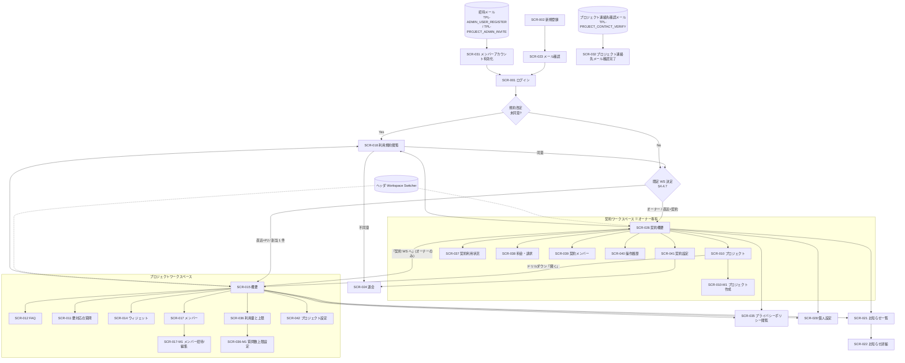

# 画面設計書(メイン)

## 1. 文書概要

### 1.1 目的

メインシステム(利用者向け FAQ ウィジェット SaaS)の画面仕様を一元化する。画面一覧 / 画面遷移 / 共通 UI 部品 / サイドメニュー / 各画面の表示項目・入力項目・操作・バリデーション・状態別表示・モーダルを定義する。

### 1.2 対象範囲

- 対象 SCR: SCR-001〜003(認証)/ SCR-010〜018 / SCR-021〜028 / SCR-031〜042(各モーダルを含む)
- 対象外: 運営者画面(02_運営者システム/個別設計書群/02_画面設計書.md 参照)。ウィジェット内 UI は本書 §5.7a に状態・遷移・主要表示を定義し、配信・API の詳細は DD13 を正本とする

### 1.3 版数

| 項目 | 値 |
|---|---|
| 版数 | 3.3 |
| 更新日 | 2026-06-12 |

### 1.4 関連ドキュメント

| ドキュメント名 | 役割 | 参照先 |
|---|---|---|
| 索引 | 11 ドキュメント体系の俯瞰 | [00_索引.md](00_索引.md) |
| API 設計書 | 各画面の API 呼び出し | [03_API設計書.md](03_API設計書.md) |
| メッセージ一覧 | 画面ラベル / エラー文言(正本)| [07_メッセージ一覧.md](07_メッセージ一覧.md) |
| 権限設計書 | 画面別権限・表示制御 | [05_権限設計書.md](05_権限設計書.md) |
| 認証・認可設計書 | ログイン / セッション / 認可判定 | [09_認証認可設計書.md](09_認証認可設計書.md) |
| エラー設計書 | 異常系挙動 | [06_エラー設計書.md](06_エラー設計書.md) |
| テーブル定義書 | 状態遷移 / コード値 | [04_テーブル定義書.md](04_テーブル定義書.md) |
| ワイヤーフレーム | UI 表現 | [../画面遷移図.html](../画面遷移図.html) |

### 1.5 ダッシュボード / KPI 共通表示ルール(全 SCR 共通)

本節は SCR-015 / SCR-026 を中心に、KPI カード・一覧・アラート等のダッシュボード系 UI 要素が SCR 横断で守るべき表示ルールを正本化する。各画面の項目表は本節を参照し、独自表記を発明しないこと。共有概念は [共有/共有概念.md](../../共有/共有概念.md) を正とする。

#### 1.5.1 数値・期間・最終更新

| 項目 | ルール |
|---|---|
| 整数件数 | 3 桁ごとカンマ区切り(例: `1,234 件`)。単位は「件」「人」「回」など対象を含意する語で必ず付与 |
| 金額 | `¥1,234` 形式(円貨)。`円` 後置表記は使わない |
| 比率(%) | 小数 1 桁固定(例: `82.3%`)。比較は `pp`(percentage points)で表記する場合に限り `+1.2pp` |
| 比較値ラベル | 比較値を表示する画面では `(前月比 +N.N%)` / `(前週比 -M.M%)` 形式で統一。当月集計 KPI は前月比、週次 KPI は前週比を原則とする。SCR-015 の KPI カードには表示しない |
| 増減の方向性 | 比較値を表示する画面では、解決率増 = 緑、通知失敗率増 = 赤、AI コスト増 = 黄/赤、質問数増 = 中立(青)など、KPI ごとに方向性を定義し項目表に明記する |
| 期間絞り込み | 「当月 / 前月 / 任意期間」の 3 種を SCR-015 / SCR-026 共通で提供。任意期間は最大 13 ヶ月 |
| 最終更新タイムスタンプ | KPI カード群の右上に「最終更新: YYYY-MM-DD HH:MM(JST)」を統一配置。取得元は集計バッチ最終実行時刻またはマテビュー最終更新時刻 |
| 集計遅延 | 最終更新が 5 分以上前のとき「⚠ 集計遅延(最終: YYYY-MM-DD HH:MM)」と黄表記で警告 |

#### 1.5.2 ステータス色 & アイコン語彙(全 SCR 共通)

色のみに依存せず、必ず「色 + アイコン + テキストラベル」3 点セットで状態を伝える。色覚多様性配慮。

| 色 | 意味 | アイコン | 主な用途 | 単独使用 |
|---|---|---|---|---|
| 赤 | 要対応 / 期限超過 | ⚠ | サスペンション / DLQ 滞留 / SLA 超過 / 取得失敗 / 通知失敗率上昇 | 不可 |
| 黄 | 要監視 | ⏳ または ▲ | AI コスト消化 80% 超 / 残期間 24h / 集計遅延 | 不可 |
| 緑 | 正常 | ✅ | ハッシュチェーン検証済 / 「異常なし」表示 / 規約同意済 | 不可 |
| 青 | 情報 / 案内 | ℹ️ | お知らせ / OnboardingChecklist 進行中 / 中立 KPI | 不可 |
| 紫 | 高権限操作 | 🔒(HardgateBadge) | 運営者の restore / update / delete 行強調(運営者側のみ) | 不可 |
| グレー | 非活性 / 0 件 | — | EmptyState / 完了済 Onboarding ステップ / 未割当 | 可 |

「単独使用不可」とは、色だけで意味を伝えてはならず、必ずアイコン + テキストラベルを併用すること。

#### 1.5.3 状態表現(EmptyState / null / 集計中 / 取得失敗 / 期間外)

| 状態 | 表示 | クリック挙動 | 例 |
|---|---|---|---|
| 0 件 / 該当なし | EmptyState 「{対象}はありません」+ 薄いグレー背景 | クリック不可(リンク非活性) | 「未解決質問はありません」 |
| null / 未集計 | 「—」(em-dash) + Tooltip「集計予定」 | クリック不可 | 当日分の質問数がまだバッチ未実行のとき |
| 集計中 / 処理中 | 「集計中…」+ スピナー | クリック不可 | 期間変更直後 |
| 取得失敗 | 「取得に失敗しました(再読込)」+ 赤縁 + ⚠ + 該当 `E-*` を Tooltip | 「再読込」ボタンのみ活性 | API エラー時 |
| 期間外 | 「対象期間にデータがありません」 | クリック不可 | 任意期間で範囲外 |
| 集計遅延 | 「⚠ 集計遅延(最終: …)」を画面右上 | — | 集計バッチ遅延時 |

#### 1.5.4 KPI カードのクリック導線

KPI カード / 一覧行 / アラートは、可能な限り「数値クリックで詳細画面に遷移」できるようにする。項目表に必ず「クリック挙動」列を設け、遷移先 SCR ID とフィルタ条件を明記する。0 件 / 集計中 / 取得失敗 状態のときはクリック不可(リンク非活性)。

#### 1.5.5 ラベル統一

KPI カードのタイトルは「{対象}{単位を含意する単語}」で統一(例: 「未解決質問件数」「当月 AI 推論コスト」)。ただし、SCR-015 は同一エリア内で質問数との関係が明確なため「未解決数」と表示する。

日時系項目のラベルは表示値の粒度で区別する。**「{対象}日時」**(更新日時・配信日時・既読日時など)は「日付 + 時刻」を表示する項目に用い、一覧では相対表記(「3 分前」)+ tooltip で絶対日時を併記する。**「{対象}日」**(発効日・同意期限など)は時刻を持たない日付のみの項目に用いる。同一画面内で同じ粒度の項目には同じ接尾辞を用い、混在させない。

---

## 2. 画面一覧

| 画面ID | 画面名 | 利用者 | 主たる関連 FR | 優先度 |
|---|---|---|---|:---:|
| SCR-001 | ログイン | admin | FR-004, FR-007, FR-008, FR-332 | P0 |
| SCR-002 | アカウント登録 | admin | FR-001, FR-002 | P0 |
| SCR-003 | パスワード再設定 | admin | FR-004, FR-006 | P0 |
| SCR-010 | プロジェクト | オーナー専有 | FR-030〜035, FR-329 | P0 |
| SCR-010-M1 | プロジェクト作成モーダル | オーナー専有 | FR-030, FR-030a | P0 |
| SCR-011 | 要対応の質問 一覧 / 詳細 | admin | FR-070〜079, FR-132, FR-329, BR-019, BR-020 | P0 |
| SCR-012 | FAQ | admin | FR-040〜048, FR-100〜103, FR-105, FR-106, FR-320〜323 | P0 |
| SCR-012-M1 | FAQ CSV インポートモーダル | オーナー / 該当 PJ の管理者・メンバー(FAQ 管理権限)| FR-310 | P1 |
| SCR-014 | ウィジェット | プロジェクト管理者主、メンバーは閲覧 + 埋め込みコードのコピーのみ | FR-031, FR-150〜156, FR-193, FR-194 | P0 |
| SCR-015 | 概要(プロジェクト)| プロジェクト管理者 / メンバー | FR-130〜135h, FR-191 | P0 |
| ~~SCR-015-M1~~ | (廃止)月次上限件数設定はプロジェクト単位に移行し SCR-036-M1 へ統合 | — | — | — |
| ~~SCR-016~~ | (廃止)旧「設定」 | — | — | — |
| SCR-017 | メンバー(プロジェクト)| オーナー / 当該プロジェクト管理者(`admin`)| FR-017, FR-018a〜c, FR-019a, FR-021a〜c, FR-333 | P0 |
| SCR-017-M1 | メンバー招待 / 編集モーダル | オーナー / プロジェクト管理者(該当プロジェクト範囲)| FR-015〜021, FR-333〜338 | P0 |
| SCR-018 | 利用規約閲覧(利用規約のみ)| 全利用者 | FR-164 | P0 |
| SCR-021 | お知らせ一覧 | admin | FR-180〜183, FR-323 | P0 |
| SCR-022 | お知らせ詳細 | admin | FR-181, FR-182 | P0 |
| SCR-023 | メール確認 | admin | FR-003 | P0 |
| SCR-024 | 退会申請 | オーナー専有 | FR-009 | P0 |
| SCR-025 | 規約再同意割込み | admin | FR-011, FR-164 | P0 |
| SCR-026 | 契約概要 | オーナー専有 | FR-130〜135h, FR-148, FR-326, BR-013f | P0 |
| SCR-028 | 個人設定(プロフィール / セキュリティ / 参加プロジェクト)| 全認証ユーザー | FR-001, FR-005, FR-006, FR-332, FR-340 | P0 |
| ~~SCR-030~~ | (廃止)旧プロジェクト設定。SCR-042 として責務を再定義 | — | — | — |
| SCR-031 | メンバーアカウント有効化(招待リンク先 / 氏名 + 初回パスワード + 利用規約 + プライバシーポリシー同意)| 招待トークン保有者(未認証)| FR-016, FR-016a, FR-016d, FR-016e, FR-006, FR-160, FR-164, FR-177 | P0 |
| SCR-032 | プロジェクト連絡先メール確認完了(TPL-PROJECT_CONTACT_VERIFY 着地ページ)| プロジェクト連絡先メール所有者(未認証、`access_tokens.purpose='contact_verify'` 保有者)| FR-033a, FR-150〜156 | P0 |
| SCR-035 | プライバシーポリシー閲覧(プライバシーポリシーのみ)| 全利用者 | FR-160, FR-164, FR-168 | P0 |
| SCR-036 | 利用量と上限(プロジェクト)| 閲覧 = オーナー / 当該 PJ の管理者・メンバー、変更 = オーナー / 当該 PJ の管理者 | FR-121, FR-122, FR-125, FR-126, FR-127 | P0 |
| SCR-036-M1 | 質問数上限設定モーダル | オーナー / 当該 PJ の管理者 | FR-121, FR-122, FR-125, FR-127 | P0 |
| SCR-037 | 契約利用状況 | オーナー専有 | FR-120, FR-123, FR-126, FR-127, FR-327 | P0 |
| SCR-038 | 料金・請求 | オーナー専有 | FR-123, FR-124, FR-136〜139, FR-148 | P0 |
| SCR-039 | 契約メンバー | オーナー専有 | FR-017, FR-019, FR-019b, FR-021 | P0 |
| SCR-040 | 操作履歴 | オーナー専有 | FR-018b, FR-145a, NFR-602系列 | P1 |
| SCR-041 | 契約設定 | オーナー専有 | FR-009, FR-125, FR-162, FR-167, FR-330 | P0 |
| SCR-042 | プロジェクト設定 | オーナー専有(プロジェクト管理者は参照)| FR-030〜034, FR-033a, FR-033c, FR-330 | P0 |

## 3. 画面遷移

### 3.1 Mermaid 遷移図



### 3.2 主要遷移ルール

| 観点 | 説明 |
|---|---|
| 認証フロー | SCR-001 → SCR-023(メール確認)→ SCR-001 → 既定ワークスペース決定(§4.4.7)→ SCR-026 / SCR-015 のいずれかに着地。アカウント削除はアカウントレベル論理削除(`users.valid=0`)であり、`valid=0` の `users` 行に対するログインは認証ミドルウェアで 401 拒否する。よって「割当 0 件のメンバーアカウント」はログイン時に構造的に存在しない(FR-015d / FR-019)|
| 規約改定割込み | ログイン直後に未同意があれば SCR-025 強制割込み。SCR-025 で機能制限ガード(FAQ 編集とウィジェット稼働は継続、課金画面操作と新規プロジェクト作成は不可)|
| 管理範囲切替 | ヘッダの「管理範囲を切り替え」で契約 ⇄ 各プロジェクトを切替。同種画面が存在すれば維持し、存在しなければ切替先の概要へ着地する |
| 契約 ⇄ プロジェクトの遷移 | SCR-026 のプロジェクト名リンク → SCR-015。各プロジェクトへの移動と契約概要への復帰は「管理範囲を切り替え」から1操作で行える |
| 割当ゼロのメンバー | FR-339 に基づき割当ゼロ状態は構造的に発生しない前提とする(招待・ロール変更・離脱の各操作で割当が 0 件になる場合は API / 画面の両方でバリデーションエラーとして拒否、プロジェクト削除起因の孤立メンバーは `users.valid=0` で論理削除)。万一データ不整合で割当ゼロが発生した場合のフェイルセーフは運営者経由の連携 IF #2(強制ログアウト)で当該アカウントを停止し、オーナーへサポートチケットで通知する |
| エンドユーザー導線 | ウィジェット通常状態で質問 → AI 未解決時は問い合わせIDと確認済みプロジェクト連絡先メールを同じ会話欄へ表示する。別のFAQ質問は引き続き入力できる |
| お知らせ導線 | ヘッダ通知ベル → SCR-021 → SCR-022(自動既読)。サイドバーには重複配置しない |

## 4. 共通 UI 部品 + サイドメニュー

### 4.0 URL 設計規約(FR-325)

利用者向け管理コンソールの画面 URL は **スコープ別 4 系列** に分離する。URL から現在の管理スコープを判別可能とし、開発・運用・利用者三者の認知負荷を下げる。

| 系列 | プレフィックス | スコープ | 主アクター |
|---|---|---|---|
| 認証フロー | `/auth/*` | 共通領域(未認証含む)| 全認証ユーザー / 未認証 |
| 契約ワークスペース | `/owner/*` | 契約スコープ(オーナー専有)| オーナー専有 |
| プロジェクトワークスペース | `/projects/:projectId/*` | プロジェクトスコープ | オーナー(暗黙 admin)+ プロジェクト管理者 + メンバー |
| 共通領域 | `/account/*` | 認証済共通領域(プロフィール、お知らせ、規約閲覧等)| 全認証ユーザー |

#### 4.0.1 SCR ↔ URL マッピング

| SCR ID | URL | 系列 |
|---|---|---|
| SCR-001 | `/auth/login` | 認証 |
| SCR-002 | `/auth/register` | 認証 |
| SCR-003 | `/auth/password-reset` | 認証 |
| SCR-023 | `/auth/email-verification` | 認証 |
| SCR-031 | `/auth/activate?token=...` | 認証(未認証可、トークン認証のみ)|
| SCR-032 | `/auth/contact-verify?token=...` | 認証(未認証可、トークン認証のみ)|
| SCR-026 | `/owner` または `/owner/home` | 契約 WS |
| SCR-010 | `/owner/projects` | 契約 WS |
| SCR-010-M1 | `/owner/projects/new`(全画面モーダル)| 契約 WS |
| SCR-037 | `/owner/usage` | 契約 WS |
| SCR-038 | `/owner/billing` | 契約 WS |
| SCR-039 | `/owner/members` | 契約 WS |
| SCR-040 | `/owner/activity` | 契約 WS |
| SCR-041 | `/owner/settings` | 契約 WS |
| SCR-024 | `/owner/withdraw` | 契約 WS |
| SCR-025 | `/owner/terms-reconsent`(全画面割込み)| 契約 WS |
| SCR-015 (プロジェクト視点) | `/projects/:projectId` または `/projects/:projectId/home` | プロジェクト WS |
| SCR-011 | `/projects/:projectId/inquiries` | プロジェクト WS |
| SCR-012 | `/projects/:projectId/faqs` | プロジェクト WS |
| SCR-012-M1 | `/projects/:projectId/faqs/import`(全画面モーダル)| プロジェクト WS |
| SCR-014 | `/projects/:projectId/widget` | プロジェクト WS |
| SCR-017 | `/projects/:projectId/members` | プロジェクト WS |
| SCR-017-M1 | `/projects/:projectId/members/new` / `/projects/:projectId/members/:userId/edit`(全画面モーダル)| プロジェクト WS |
| SCR-036 | `/projects/:projectId/usage` | プロジェクト WS |
| SCR-036-M1 | `/projects/:projectId/usage/limits/questions/edit`(全画面モーダル)| プロジェクト WS |
| SCR-042 | `/projects/:projectId/settings` | プロジェクト WS |
| SCR-018 | `/account/terms` | 共通 |
| SCR-021 | `/account/inbox` | 共通 |
| SCR-022 | `/account/inbox/:announcementId` | 共通 |
| SCR-028 | `/account/settings/profile` / `/account/settings/security` / `/account/settings/projects` | 共通 |
| SCR-035 | `/account/policy` | 共通 |

#### 4.0.2 アクセス制御規約

- `/owner/*` への到達はオーナー(`contract_owners` 行存在で判定)以外は 403 + 当該ユーザーの既定ワークスペースへリダイレクト
- `/projects/:projectId/*` への到達は当該 `projectId` に対し `project_users` を持たないユーザーは 403 + 既定ワークスペース(§4.4.7)へリダイレクト
- 認証フロー(`/auth/*`)は未認証時のみ到達可。認証済ユーザーが到達した場合は既定ワークスペース(§4.4.7)へリダイレクト
- URL ベースでスコープ違反を検知できるため、ナビゲーション層・API 層の二重チェックを統一する基準とする

### 4.1 既存共通部品(§5.3.1)

| 部品 | 用途 | 主な仕様 |
|---|---|---|
| Header | ロゴ、管理範囲スイッチャー、サイドバー折り畳みトグル、通知ベル、ヘルプ、アカウントメニュー | 管理画面共通。配置は左から `ロゴ → 管理範囲を切り替え → (空白)→ 通知ベル → ヘルプ → アカウントメニュー`。現在の適用ロールはスイッチャーまたはアカウントメニュー内で表示する |
| WorkspaceSwitcher | 契約 / プロジェクトの管理範囲切替 | ユーザー向けラベルは「管理範囲を切り替え」。オーナーには「契約」と全プロジェクト、他ロールには参加プロジェクトのみを表示する。各行に適用ロールを補助表示し、最終選択範囲を localStorage に保持する |
| WorkspaceBar | 領域 + 現在地の常時表示 | ヘッダ直下の細帯。`領域: [契約 / プロジェクト]` の領域バッジ + 契約名 / プロジェクト名 + (プロジェクト WS のみ)「契約 WS へ →」リンク(オーナーのみ表示)。背景色は契約 = 紺系 / プロジェクト = 緑系で物理識別 |
| Sidebar | 管理画面の主要メニュー左側表示 | ワークスペース別に 2 種類(契約 WS 版 / プロジェクト WS 版)。詳細は §4.4 |
| ProjectSelector | 同種画面に居る状態で別プロジェクトに切替 | プロジェクト WS の WorkspaceBar 内に表示。同種画面(例: FAQ → 別 PJ の FAQ)に維持遷移、存在しない場合は別 PJ ホームに着地 |
| RoleBadge | 現在地で適用される操作者ロール | 独立した常設バッジは設けず、管理範囲スイッチャーの選択行とアカウントメニューに「契約オーナー / プロジェクト管理者 / プロジェクトメンバー」を表示する |
| DomainBadge | 管理範囲バッジ(契約 / プロジェクト)| 必要な参照カードに限定して表示し、同じ情報をヘッダーと本文で重複させない。「利用中のプロジェクト: N」を補助表示する |
| StatusBadge | FAQ 状態、案件状態、通知状態、契約状態 | **色 + テキストの三重識別** を必須(FR-390)|
| ConfirmDialog | 削除、公開、退会など | 重要操作は再認証(FR-005)。削除系には「この操作は取り消せません」必須表示(FR-354)|
| ErrorAlert | 入力エラー、通信エラー、処理エラー | 原因 + 解決策をセットで表現(FR-353)|
| Pagination | 一覧画面 | カーソル方式 + 件数表示「1-50 / 全 254 件」併記(FR-358)|
| EmptyState | データなし | アイコン + 説明文 + CTA を必須。「データがありません」単独表示は禁止(FR-351)|
| Toast | 成功・失敗通知 | 成功 4 秒・警告 6 秒・エラーは手動閉じ(FR-382)|
| FormField | 入力部品 | 必須印、補助文、エラー文を構成要素として保持(FR-359)|
| NotificationBell | ヘッダの通知ベル | `critical` 赤色強調、`high` 黄色。未読件数バッジ、直近 10 件ドロップダウン、admin のみ表示 |
| InboxItem | お知らせ一覧の行 | 種別バッジ、重要度インジケータ、タイトル、配信日時、未読インジケータ |
| AnnouncementCategoryBadge | お知らせ種別バッジ | `billing`(青)/ `announcement`(緑)/ `system`(オレンジ)|
| ImportanceIndicator | お知らせ重要度インジケータ | `critical` = 赤マーク + バッジ、`high` = 黄色マーク、`normal` = 無印、`low` = 淡色(FR-181)|
| PaymentMethodBanner | 支払方法登録誘導バナー | 無料枠 80% 到達かつ支払方法未登録で表示(黄)、100% 超過かつ未登録で赤強調(「無料枠を超過しました ― お支払い方法が未登録のため、ウィジェットは現在制限中です。」)+ 支払方法登録 CTA(FR-136 支払方法ゲート。契約は `active` のまま)|
| UsageBar | 利用量バー(80% / 100% / 125%) | 80% 黄色、100% 赤、125% アニメーション強調(FR-390)|

### 4.2 UI/UX 共通要件で追加する部品(§5.3.2)

| 部品 | 用途 | 主な仕様 |
|---|---|---|
| Breadcrumb | パンくず | 認証フロー除く全画面。最大 3 階層(FR-370)|
| PageHeader | 画面タイトル + 説明文 | 全画面の最上部に配置(FR-350)。タイトルは画面名だけとし、契約名・プロジェクト名・サイト名を「—」等で連結しない。現在の管理範囲名は WorkspaceSwitcher / WorkspaceBar で表示する |
| QuickFilterChips | クイックフィルタ | 一覧画面上部、URL クエリで状態保持(FR-371)|
| AppliedFilterChips | 適用済フィルタ表示 + クリア | 「すべてクリア」リンクを常設(FR-371)|
| BulkActionBar | 一括操作バー | 1 件以上選択時に画面下部固定表示(FR-372)|
| SummaryCard | 数値サマリーカード | 数字 + 単位 + 補助バー + ラベル の 4 要素構成 |
| Timeline | 段階・フローの可視化 | 縦タイムライン、現在位置強調 |
| AutosaveIndicator | 自動保存状態の表示 | 緑点「30 秒前に保存しました」/ 黄点「保存中…」/ 赤点「保存できませんでした」(FR-321)|
| UnsavedChangesGuard | 未保存変更時の離脱警告 | フォーム編集中の戻る・タブ閉じ・リロード時に警告(FR-373)|
| PermissionTooltip | 権限不足時のグレーアウト | ボタンをグレーアウトし tooltip で必要権限表示(FR-356)|
| PermissionBoundaryTooltip | 権限境界の説明(操作レベル)| 非活性ボタン 🔒 のホバー / フォーカス時に表示。「必要な権限」+ 「依頼先(同一プロジェクトの `admin` 保持者一覧 + オーナー)」+ 「メッセージで依頼する」リンクを内包(FR-341)|
| PermissionGateBanner | 権限境界の説明(画面レベル)| 403 を踏んだ画面の上部に常設バナー。「この操作には〜権限が必要です」+ 依頼先(FR-341)|
| DangerSection | 危険操作の物理分離 | 画面最下部「危険な操作」セクション。Primary ボタンの隣に置かない(FR-364 相当)。L2 / L3 操作は本セクション内に集約 |
| TypeToConfirmInput | L2 確認の対象名タイプ入力 | 対象名(プロジェクト名 / メールアドレス / `DELETE` 等)を完全一致でタイプ入力させ、入力一致時のみ「削除する」「保存する」など対象操作を明示したボタンを活性化(§4.6 誤操作防止) |
| ReauthConfirmModal | L3 確認の再認証ダイアログ | TypeToConfirmInput + パスワード再入力(FR-005)。再認証成功 + タイプ一致時のみ、対象操作を明示したボタンを活性化(§4.6 誤操作防止) |
| LoadingSkeleton | スケルトン UI | テーブルは行スケルトン、スピナー単独表示を避ける(FR-380)|
| ProgressText | 進捗テキスト(3 秒超)| 「保存中…」「処理中…(2/5 段階)」など(FR-381)|
| ReauthBadge | 再認証必須操作の可視化 | Primary ボタン横に再認証ラベル + tooltip(FR-360)|
| OnboardingChecklist | 初回セットアップガイド | 4ステップ(プロジェクト作成 / 最初のFAQ / 動作確認 / サイト設置)+ 完了率バー。メンバー招待は任意導線 |

### 4.3 文言の共通基準

詳細は [07_メッセージ一覧.md §2](07_メッセージ一覧.md) を正本とする。

### 4.4 ワークスペース・サイドメニュー(§5.6)

利用者向け管理コンソールは「契約ワークスペース(Owner Workspace)」「プロジェクトワークスペース(Project Workspace)」「共通領域」の 3 領域構成とする(BR-013f / BR-013g、FR-135a / FR-135b)。各画面はいずれかの領域に必ず帰属し、サイドメニューは領域ごとに 2 種類(§4.4.3 / §4.4.4)で切替表示する。

#### 4.4.1 領域モデル

| 領域 | 主アクター | 主管 SCR | 主な特徴 |
|---|---|---|---|
| 契約ワークスペース | オーナー専有(`contract_owners` 行存在)| SCR-026 / SCR-010 / SCR-010-M1 / SCR-037〜041 / SCR-024 / SCR-025 | 契約全体の概要、プロジェクト、契約メンバー、利用状況、料金・請求、操作履歴、契約設定を扱う |
| プロジェクトワークスペース | オーナー + プロジェクト管理者 + メンバー | SCR-015 / SCR-011 / SCR-012 / SCR-014 / SCR-017 / SCR-036 / SCR-042 | プロジェクト固有の運用、ウィジェット、メンバー割当、利用量・上限、プロジェクト設定を扱う |
| 共通領域 | 全認証ユーザー / 未認証 | SCR-001 / SCR-002 / SCR-003 / SCR-018 / SCR-021 / SCR-022 / SCR-023 / SCR-028 / SCR-035 | 認証フロー、プロフィール、お知らせ、利用規約閲覧、プライバシーポリシー閲覧。ワークスペースサイドメニューの外側に置く |

#### 4.4.2 レイアウト方針(共通)

| 項目 | 仕様 |
|---|---|
| 画面構造 | 上から Header → WorkspaceBar(領域バッジ + 領域内ナビ補助)→ メイン(Sidebar + 本文)|
| サイドバー幅 | 通常 240px、折り畳み時 64px(アイコンのみ)|
| 折り畳み | ヘッダ内トグルボタン、または画面幅 < 1024px で自動折り畳み |
| モバイル | ハンバーガーメニュー(オーバーレイ)|
| 固定表示 | スクロール時もサイドバーは固定。サイドバー内部は独立スクロール可 |
| アクティブ表示 | 現在画面のメニュー項目を強調(背景色 + 左境界アクセント)。`aria-current="page"` を付与 |
| 領域バッジ | WorkspaceBar に「契約」/「プロジェクト」を色 + アイコン + テキストで常時表示(FR-340 と整合)|
| 適用ロール | 管理範囲スイッチャーまたはアカウントメニューで確認可能(FR-340)|

#### 4.4.3 サイドメニュー — 契約ワークスペース版(オーナー専有)

| グループ | メニュー項目 | 遷移先 SCR | 表示種別 |
|---|---|---|---|
| (グループなし) | 契約概要 | SCR-026 | リンク |
| (グループなし) | プロジェクト | SCR-010 | リンク |
| (グループなし) | メンバー | SCR-039 | リンク |
| (グループなし) | 契約利用状況 | SCR-037 | リンク |
| (グループなし) | 料金・請求 | SCR-038 | リンク + 警告バッジ |
| (グループなし) | 操作履歴 | SCR-040 | リンク |
| (グループなし) | 契約設定 | SCR-041 | リンク |

#### 4.4.4 サイドメニュー — プロジェクトワークスペース版

| グループ | メニュー項目 | 遷移先 SCR | 表示種別 |
|---|---|---|---|
| (グループなし) | 概要 | SCR-015 | リンク |
| (グループなし) | 要対応の質問 | SCR-011 | リンク + 対応中件数 |
| (グループなし) | FAQ | SCR-012 | リンク |
| (グループなし) | ウィジェット | SCR-014 | リンク + 設定警告 |
| (グループなし) | メンバー | SCR-017 | リンク + 招待中件数 |
| (グループなし) | 利用量と上限 | SCR-036 | リンク + 最大消化率 |
| (グループなし) | プロジェクト設定 | SCR-042 | リンク。編集はオーナーのみ |

プロジェクト範囲で契約共通の概念を参照表示する場合は「契約共通」と影響範囲を併記し、オーナーにはSCR-037またはSCR-038への導線を表示する。影響範囲の文言は「利用中のプロジェクト: N」とする。

#### 4.4.5 サイドメニューに含めない画面

| 画面 | 除外理由 | アクセス手段 |
|---|---|---|
| SCR-023 メール確認 | 新規登録フロー内の中継画面 | SCR-002 登録 → 自動遷移 |
| SCR-024 退会申請 | 重大かつ可逆性の低い操作 | SCR-041 契約設定の DangerSection |
| SCR-025 規約再同意割込み | 強制割込み画面(全画面モーダル)| ログイン時 / 操作時に自動表示 |
| SCR-010-M1 プロジェクト作成モーダル | SCR-010 から開く全画面モーダル | SCR-010「プロジェクトを作成」 |
| SCR-012-M1 FAQ CSV インポートモーダル | SCR-012 から開く全画面モーダル | SCR-012「CSV をインポート」ボタン |
| SCR-017-M1 メンバー招待/編集モーダル | SCR-017 から開く全画面モーダル | SCR-017 行アクション |
| SCR-036-M1 質問数上限設定モーダル | SCR-036 から開く全画面モーダル | SCR-036 の「アラート設定」ボタン |
| SCR-028 個人設定 | 全画面共通のヘッダ右上アカウントメニュー経由 | アカウントメニュー「個人設定」|
| SCR-031 メンバーアカウント有効化 | 未認証画面(招待トークン認証のみ)| 招待メール内リンク |
| SCR-032 プロジェクト連絡先メール確認完了 | 未認証画面(連絡先確認トークン認証のみ)| プロジェクト連絡先確認メール内リンク |

#### 4.4.6 ヘッダ部品

ヘッダ内の配置順は **左から: ロゴ → 管理範囲を切り替え → (フレキシブルスペース)→ 通知ベル → ヘルプ → アカウントメニュー** とする。

| 部品 | 種類 | 配置 | 概要 |
|---|---|---|---|
| ロゴ | 画像 + リンク | ヘッダ最左 | クリックで「既定ワークスペースのホーム」へ。既定 = §4.4.7 のロジック |
| 管理範囲を切り替え | ボタン + ドロップダウン | ロゴの直右 | 現在の契約またはプロジェクト名を表示し、契約 / 参加プロジェクトを選択する。各選択肢に適用ロールを補助表示 |
| サイドバー折り畳みトグル | アイコンボタン | ヘッダ右寄せ群の左 | サイドバーの開閉 |
| 通知ベル | アイコンボタン + バッジ + ドロップダウン | ヘッダ右寄せ群 | 未読件数バッジ、`critical` 赤バッジ + 強調アニメーション。直近 10 件ドロップダウン、admin のみ表示 |
| ヘルプ | アイコンボタン + ドロップダウン | ヘッダ右側 | セットアップガイド再表示、ヘルプ、利用規約、プライバシーポリシー |
| アカウントメニュー | ボタン + ドロップダウン | ヘッダ最右 | メールアドレス、現在の適用ロール、「個人設定」「ログアウト」を表示 |

「DashboardViewSwitch(ダッシュボード切替アイコン)」は本版で **廃止** し、WorkspaceSwitcher に統合する。

##### 4.4.6.1 WorkspaceSwitcher ドロップダウン構造(3 階層)

ドロップダウンを開いた際、利用者は「契約全体の管理」と「特定プロジェクトの管理」のどちらに切り替えるかを 1 ドロップダウン内で選択できる。メニュー項目は次の 3 階層構造とする。

```
ワークスペース                      ← 見出し(クリック不可)
 ├ 契約ダッシュボード               ← オーナーのみ表示。クリックで SCR-026 へ
 └ プロジェクトダッシュボード       ← 見出し(クリック不可)。常時展開
    ├ サポートサイト                ← クリックで該当 PJ の SCR-015 / 同種画面へ
    ├ 製品 A
    └ 採用サイト
```

| 階層 | 項目 | 種類 | 表示条件 | クリック時の挙動 |
|---|---|---|---|---|
| 1 | `ワークスペース` | 見出し(非選択)| 常時表示 | (操作不可)|
| 2 | `契約ダッシュボード` | 選択可項目(⛓ アイコン)| オーナー(`contract_owners` 行存在)のみ | 契約 WS / SCR-026 へ切替(URL `/owner`)|
| 2 | `プロジェクトダッシュボード` | 見出し(非選択、常時展開)| 自分が割当を持つプロジェクトが 1 件以上ある場合のみ | (操作不可、子項目を展開表示するのみ)|
| 3 | `{プロジェクト名}` | 選択可項目(📁 アイコン)| 当該プロジェクトに `project_users` を持つ(オーナーは全 PJ。プロジェクト数が 10 件超なら検索ボックスを冒頭に表示)| プロジェクト WS / 同種画面が新 WS 側に存在すれば維持、無ければ SCR-015 ホーム |

##### 4.4.6.2 表示制御ルール

| ロール | `契約ダッシュボード` 表示 | `プロジェクトダッシュボード` 見出し表示 |
|---|---|---|
| オーナー | ◯ 表示(自分の契約 1 件)| ◯ 表示 + 配下に自契約の全プロジェクト |
| プロジェクト管理者(`admin` を 1 件以上保持)| × 非表示 | ◯ 表示 + 配下に自分が割当を持つプロジェクトのみ |
| メンバー(`member` / `admin` 混在含む)| × 非表示 | ◯ 表示 + 配下に自分が割当を持つプロジェクトのみ |

##### 4.4.6.3 現在地表示

ドロップダウン内で **現在選択中の項目** にはチェック印 `✓` を付与し、項目背景を強調する。ヘッダのスイッチャー ボタン本体には、現在地に対応する `{現在のWS名} {スコープ記号}` を表示する(`⛓` = 契約 / `📁` = プロジェクト)。

##### 4.4.6.4 動作

| 観点 | 仕様 |
|---|---|
| 開閉 | ボタンクリックまたは `Alt+W` で開く。Esc / 外側クリックで閉じる |
| キーボード | ↑↓ で選択可項目(階層 2 の `契約ダッシュボード` と階層 3 のプロジェクト行)をフォーカス移動。見出し(階層 1 の `ワークスペース`、階層 2 の `プロジェクトダッシュボード`)はスキップ |
| 検索 | 割当プロジェクトが **10 件超** の場合のみドロップダウン冒頭に検索ボックス(プロジェクト名部分一致)を表示。10 件以下では検索ボックスを表示しない |
| ARIA | ルート要素 `role="menu"`、見出しは `role="presentation"`、選択可項目は `role="menuitemradio"` + `aria-checked` で現在地を表現 |

#### 4.4.7 動作要件

| 観点 | 仕様 |
|---|---|
| キーボード操作 | Tab で移動、Enter / Space で遷移、Esc でモバイル時のオーバーレイを閉じる |
| アクセシビリティ | `aria-current="page"` でアクティブ項目を示す。領域バッジ・ロールバッジは `aria-label` で領域名 / ロール名を読み上げ可能にする(NFR-1001〜1003)|
| バッジ更新 | 未解決件数・未読件数は画面遷移時に再取得。長時間滞在時は定期ポーリング |
| 折り畳み状態の保持 | ローカルストレージで利用者ごとに保持 |
| 既定ワークスペースの決定 | ログイン直後は (a) 直前セッションで開いていた WS / (b) 初回オーナーは契約 WS / (c) 割当 1 件のみのメンバーは該当 PJ WS / (d) 割当複数のメンバーは直近 PJ WS。アカウント削除はアカウントレベル論理削除(`users.valid=0`)であり、`valid=0` 行はログイン拒否されるため割当ゼロ着地は構造的に発生しない(FR-019)|
| 管理範囲切替の遷移 | 同種画面が切替先に存在すれば維持し、無ければ切替先の概要へ |

### 4.5 レスポンシブ方針

| ブレイクポイント | レイアウト | 主要操作 |
|---|---|---|
| PC ≥ 1024px | 3 ペイン(ヘッダ + サイドバー 200-240px + メイン)| サイドバー常時表示、テーブル横並び |
| Tablet 768-1023px | サイドバー折り畳み(64px)、必要時オーバーレイ展開 | テーブル重要列に絞込 |
| SP < 768px | サイドバーはハンバーガー、テーブルは原則カード型、Primary CTA は固定フッタ | モーダルはフルスクリーン。課金対象別テーブル(SCR-037)は列比較を優先し、カード化せず横スクロール + 先頭列固定とする。SCR-036 の質問数サマリーは 1 列に積む |

### 4.6 誤操作防止レベル(L1 / L2 / L3)

不可逆または影響範囲の大きい操作は次の三段モデルで確認を取る(FR-324 が本節を正本指定)。

| レベル | 構成 | UI 部品 | 解除条件 |
|---|---|---|---|
| L1 | 確認ダイアログ(「キャンセル」/「削除する」など対象操作名)| ConfirmDialog | 対象操作を明示したボタン押下 |
| L2 | L1 + 対象名タイプ確認(プロジェクト名 / メールアドレス / `DELETE` 等の完全一致入力)| ConfirmDialog + TypeToConfirmInput | 入力一致時のみ対象操作ボタンを活性 |
| L3 | L2 + 再認証(パスワード再入力。FR-005 と整合)| ReauthConfirmModal | 再認証成功 + タイプ一致時のみ対象操作ボタンを活性 |

#### 4.6.1 操作レベル対応マトリクス(主要操作)

| 操作 | レベル | 関連 SCR | 関連 FR / エラー |
|---|---|---|---|
| FAQ 削除 | L1 | SCR-012 | `DELETE /faqs/{id}` |
| FAQ 公開(状態 `published` を選択して保存)| L1 | SCR-012 | `PATCH /faqs/{id}` |
| お知らせ一括既読化 | L1 | SCR-021 | — |
| プロジェクトから外す | L1 | SCR-017-M1 | `DELETE /projects/{id}/members/{userId}`。当該割当だけを解除 |
| 招待メール再送 | L1 + 再認証(L3 相当) | SCR-017-M1 | FR-016b |
| プロジェクト管理者 → メンバー降格(他者) | L2 + 最後の管理者保護 | SCR-017-M1 | FR-018a / `E-AUTHZ-LAST-ADMIN-PROTECTED` |
| プロジェクト削除(論理削除、`projects.valid=0`)| L3(プロジェクト名タイプ + 再認証)| SCR-042 プロジェクト設定の DangerSection | FR-030 / `E-AUTHZ-OWNER-ONLY` |
| 契約メンバーのアカウント削除(論理削除、`users.valid=0`)| L3(表示名タイプ確認 + 再認証)| SCR-039 契約メンバー | FR-019 / FR-019b |
| ウィジェット公開キー再発行 | L3(対象プロジェクト名タイプ + 再認証)| SCR-014(プロジェクト WS)| FR-031(再発行時は既存埋め込みコードが即座に無効化される旨を確認文に明記)|
| プロジェクトの質問数上限・アラート変更 | L3 | SCR-036-M1(SCR-036 から起動。オーナー / 当該 PJ 管理者)| `PATCH /projects/{id}/quota-limits/questions` |
| 契約解約 / 退会 | L3 | SCR-024 | FR-009 |
| 規約不同意(退会フロー誘導)| L1 → SCR-024 | SCR-025 | FR-011 |

#### 4.6.2 配置原則

L2 / L3 の操作ボタンは画面最下部の `DangerSection` に物理分離して配置し、Primary ボタンの隣には置かない。

#### 4.6.3 権限境界の説明原則(FR-341)

権限不足で操作不可なボタン・トグル等は、`PermissionBoundaryTooltip`(操作レベル)+ `PermissionGateBanner`(画面レベル)の 2 段構えで「必要な権限」と「依頼先(同一プロジェクトの `admin` 保持者一覧 + オーナー)」を提示する。単純な非活性化のみでの放置は本版で禁止する。
タッチターゲット: PC 36x36px / SP 44x44px 以上、隣接要素間 8px 以上の余白(FR-392)。

## 5. 画面詳細

### 5.0 UI/UX刷新に伴う責務マスタ

本節は v3.0 の画面責務の正本である。以降の旧節に旧名称または旧配置が残る場合、データ項目・バリデーションのみを再利用し、画面名・配置・遷移・操作権限は本節を優先する。

| 画面 | 主目的 | 主CTA / 次の行動 | 扱わないもの |
|---|---|---|---|
| SCR-026 契約概要 | 契約全体の異常、未完了設定、プロジェクト状況を把握する | 警告の解消、プロジェクトを開く、セットアップを進める | 請求履歴の詳細、プロジェクト編集 |
| SCR-015 概要 | 選択中プロジェクトの利用状況を把握する | 質問、未解決質問、FAQの各一覧を開く | 契約請求、プロジェクト編集・削除 |
| SCR-010 プロジェクト | 契約内プロジェクトを探して開く | プロジェクト名を開く、プロジェクトを作成 | 既存プロジェクト編集 |
| SCR-017 メンバー | 選択中プロジェクトの参加者とロールを管理する | 招待、ロール変更、プロジェクトから外す | アカウント全体の削除 |
| SCR-036 利用量と上限 | 選択中プロジェクトの質問数利用量と制限を確認する | アラート設定を開く | 無料利用枠、設定元、FAQ・チャットの利用設定、契約請求 |
| SCR-037 契約利用状況 | 全プロジェクトの利用量と傾向を比較する | プロジェクトの利用量へドリルダウン | 支払方法変更 |
| SCR-038 料金・請求 | 支払方法、請求状態、請求履歴を管理する | 支払方法更新、請求書を開く | プロジェクト上限変更 |
| SCR-039 契約メンバー | 契約内の人と参加プロジェクトを横断管理する | メンバー詳細、契約から削除 | プロジェクト別の日常的なロール編集 |
| SCR-040 操作履歴 | 重要操作を監査する | 条件で絞り込む、対象画面を開く | 運営者専用監査情報 |
| SCR-041 契約設定 | 契約連絡先、規約、退会を管理する | 連絡先更新、退会手続き | 個人プロフィール |
| SCR-042 プロジェクト設定 | プロジェクト名、ドメイン、連絡先、削除を管理する | 保存、プロジェクト削除 | メンバー割当、利用上限 |

### 5.0.1 一覧と文言の共通変更

- 名称を主リンクとし、IDは補助情報 + コピーボタンとする。SCR-010 / SCR-011 / SCR-012 に適用する。
- `open` / `closed` はAPI・DB内部値として維持し、画面では「対応中 / 対応済み」と表示する。
- 「無料枠」は「無料利用枠」、「月次上限件数」は「今月の利用上限」、「Used by Projects」は「利用中のプロジェクト」と表示する。
- アイコンや絵文字だけで状態を示さず、必ずテキストを併記する。主要操作のタップ領域は44×44 CSS px以上とする。

### 5.0.2 新設画面の主要項目

| SCR | 主要項目 |
|---|---|
| SCR-037 | 当月利用量、前月比較、プロジェクト別内訳、利用中のプロジェクト、最終更新日時 |
| SCR-038 | 支払方法、次回請求見込み、請求状態、請求履歴、請求書PDF、支払い失敗時の復旧CTA |
| SCR-039 | 氏名、メール、状態、参加プロジェクト数、プロジェクト別ロール、契約から削除(L3) |
| SCR-040 | 日時、操作者、操作種別、対象、結果、プロジェクト、期間 / 操作者 / 操作種別フィルタ |
| SCR-041 | 契約連絡先、規約同意状況、データエクスポート導線、退会DangerSection |
| SCR-042 | プロジェクト名、ID、許可ドメイン、連絡先メールと確認状態、保存、削除DangerSection |

各画面のメッセージ ID 体系(MSG-SCR-XXX-*)は [07_メッセージ一覧.md §4](07_メッセージ一覧.md) を正本とする。本書では原文の項目構造(表示・入力・操作・バリデーション・モーダル・状態)を網羅する。

---

### 5.1 SCR-001 ログイン

#### 画面概要

| 項目 | 内容 |
|---|---|
| 画面ID | SCR-001 |
| 目的 | 利用者(オーナー / メンバー)が認証情報を入力してセッションを確立する |
| 利用者 | 未ログイン admin |
| 関連 FR | FR-004, FR-007, FR-008, FR-332 |
| 関連 API | `POST /v1/sessions` |
| 関連メッセージID | MSG-SCR-001-* |
| 必要権限 | 不要(認証前)|

#### 表示・入力・操作項目

| 区分 | 項目 | 種類 | 概要 |
|---|---|---|---|
| 入力 | メールアドレス | メールアドレスボックス | 必須 |
| 入力 | パスワード | パスワードボックス | 必須 |
| 操作 | ログインボタン | ボタン | 認証 → 規約再同意チェック(必要なら SCR-025)→ 利用状況系画面へ |
| 操作 | パスワードを忘れた場合 | リンク | SCR-003 へ遷移 |
| 操作 | アカウント登録 | リンク | SCR-002 へ遷移 |
| 表示 | 認証エラーメッセージ | エラー | 失敗時の共通文言(攻撃者にヒントを与えない)|
| 表示 | ロックアウト警告 | エラー | 5 回失敗後(FR-007)|
| 表示 | アクティブセッション一覧 | テーブル | ログイン後に SCR-028 個人設定 §(2) から表示可能(FR-332)。同一アカウントの複数デバイスログインを確認 |

---

### 5.2 SCR-002 アカウント登録

#### 画面概要

| 項目 | 内容 |
|---|---|
| 画面ID | SCR-002 |
| 目的 | 新規利用者(オーナー)が SaaS にアカウント登録する |
| 利用者 | 未ログイン admin |
| 関連 FR | FR-001, FR-002 |
| 関連 API | `POST /v1/accounts` |
| 関連メッセージID | MSG-SCR-002-* |

#### 表示・入力・操作項目

| 区分 | 項目 | 種類 | 概要 |
|---|---|---|---|
| 入力 | メールアドレス | メールアドレスボックス | 必須。管理者本人のメール |
| 入力 | パスワード | パスワードボックス | 必須。FR-006 強度要件(12 文字以上、3 種類以上の文字種)|
| 入力 | パスワード(確認)| パスワードボックス | 必須。一致確認 |
| 入力 | 利用規約同意 | チェックボックス | 必須チェック |
| 入力 | プライバシーポリシー同意 | チェックボックス | 必須チェック |
| 入力 | 業種選択 | プルダウン | 任意。「金融」「医療」等の高規制業界を選択した場合は標準提供範囲外であることを表示し、サポート窓口を案内(要件 §16)|
| 表示 | 規約・ポリシーリンク | リンク | 別ウィンドウで全文表示 |
| 操作 | 登録ボタン | ボタン | 入力検証 → 登録 → 確認メール送信 → SCR-023 へ |
| 操作 | ログイン画面リンク | リンク | 既存ユーザー向け |

---

### 5.3 SCR-003 パスワード再設定

#### 画面概要 / 構成

3 段階構成 + Timeline:
- 段階 1: メールアドレス入力 → 再設定リンク送信
- 段階 1 送信後: メール送信済み案内(再送 5 分カウントダウン)
- 段階 2: 新パスワード設定 → 完了画面

#### 表示・入力・操作項目

| 区分 | 項目 | 種類 | 概要 |
|---|---|---|---|
| 表示 | ステップタイムライン | Timeline | 「① メールアドレス入力 → ② 受信メールのリンクをクリック → ③ 新しいパスワードを設定」。現在ステップを `aria-current="step"` で強調 |
| 段階 1 入力 | メールアドレス | メールアドレスボックス | 必須、形式チェック |
| 段階 1 操作 | 「再設定リンクを送信」 | ボタン(Primary)| リクエスト発行(**存在有無は同一応答**、列挙攻撃対策)|
| 段階 1 送信後 表示 | 完了画面 | 中間表示 | 「{メールアドレス} にメールを送信しました。1 時間以内にメールのリンクをクリックして再設定を完了してください」 |
| 段階 1 送信後 操作 | 「メールを再送信する」 | ボタン(Secondary、レート制限カウントダウン併記)| 5 分以内は disabled、残時間表示 |
| 段階 2 入力 | 新パスワード | パスワードボックス + 強度メーター | 必須。FR-006 強度要件。入力中にリアルタイムで強度 5 段階(極弱/弱/中/強/極強)+ 不足要件を表示 |
| 段階 2 入力 | 新パスワード(確認)| パスワードボックス | 必須。一致確認 |
| 段階 2 操作 | 「新しいパスワードを設定する」 | ボタン(Primary)| パスワード更新 → 全セッション失効 → 完了画面 → 自動的に SCR-001 へ |
| 段階 2 表示 | トークン無効 / 期限切れエラー | アラート帯(画面上部固定)+ 再送 CTA | 段階 2 でリンク不正の場合、「再設定リンクが期限切れ、または無効です(有効期限 1 時間)。新しいリンクを再送してください」 |
| 段階 2 完了表示 | 完了画面 | 中間表示 | 「新しいパスワードを設定しました。ログインしてください」+ 「ログインする」CTA(SCR-001 へ)|

#### バリデーション

- メールアドレス: 形式チェック(段階 1)
- 新パスワード: 12 文字以上、英大文字・小文字・数字・記号のうち 3 種類以上
- 新パスワード(確認): 一致確認

---

### 5.4 SCR-010 プロジェクト

#### 画面概要

| 項目 | 内容 |
|---|---|
| 画面ID | SCR-010 |
| 配置 | 契約ワークスペース / サイドメニュー「管理 > プロジェクト」(§4.4.3)|
| 目的 | 契約内のプロジェクトを探し、対象プロジェクトの概要へ移動する |
| 利用者 | オーナー専有 |
| 関連 FR | FR-030〜035, FR-030a, FR-030b |
| 必要権限 | オーナー専有 |
| アクセス | 契約ワークスペースのサイドメニューから直接アクセス(旧版の「アカウントメニュー > プロジェクト設定」経由は廃止)|
| 誤操作防止 | 編集・削除は SCR-042 プロジェクト設定に集約し、本画面では提供しない |

#### 表示・入力・操作項目

| 区分 | 項目 | 種類 | 概要 |
|---|---|---|---|
| 表示 | パンくず | Breadcrumb | 「契約 > プロジェクト」 |
| 表示 | プロジェクト名 | テキストリンク(主)| 一覧先頭列に表示。クリックで当該プロジェクトの SCR-015 概要へ遷移する |
| 表示 | プロジェクト ID | 補助テキスト + コピーボタン | プロジェクト名の下に表示。クリック遷移には使わず、コピー操作のみ提供する |
| 表示 | 許可ドメイン | タグバッジ群 | 設定値を最大 3 件まで表示、超過分は `+N 件` で折り畳み。サブドメインワイルドカード `*.example.com` も表示 |
| 表示 | ステータス | 状態バッジ | 連絡先メール確認状態を「確認済み」(緑)/「確認待ち」(黄)/「未設定」(灰)で表示。`projects.contact_email` と `projects.contact_email_verified_at` から UI 側で自動判定(`未設定` = `contact_email IS NULL` / `確認待ち` = `contact_email_verified_at IS NULL` / `確認済み` = `contact_email_verified_at IS NOT NULL`)。色のみ依存禁止(常にテキストラベル併記) |
| 表示 | 連絡先メール | テキスト表示 | メールアドレス本文のみ表示。未設定行は `—`。確認状態バッジは「ステータス」列に分離 |
| 表示 | 更新日時 | テキスト表示 | 相対表記「3 時間前」+ tooltip で絶対日時 |
| 表示 | 件数表示 | テキスト | 「1-50 / 全 N 件」 |
| 操作 | + 新規プロジェクトを作成 | ボタン(Primary、ページヘッダー右上に 1 件のみ配置)| SCR-010-M1 を「新規作成」モードで開く。一覧上部に重複配置はしない |
| 表示 | 空状態 | EmptyState | 「プロジェクトがまだありません。最初のプロジェクトを作成しましょう」+ 「+ 新規プロジェクトを作成」CTA |
| 表示 | ローディング状態 | LoadingSkeleton | テーブル/カード行スケルトン 3 行 |

> 一覧表に行内の「操作」列は設けない。プロジェクト名を主リンクとして概要へ遷移し、編集は概要またはサイドバーから SCR-042 プロジェクト設定を開く。
>
> 削除動線は SCR-042 プロジェクト設定の DangerSection のみに集約する。

#### モーダル

| モーダルID | 表示タイミング | 目的 |
|---|---|---|
| SCR-010-M1 | 「+ 新規プロジェクトを作成」クリック時 | プロジェクトの新規作成 |

---

### 5.5 SCR-010-M1 プロジェクト作成モーダル

#### モーダル概要

| 項目 | 内容 |
|---|---|
| 画面ID | SCR-010-M1 |
| 目的 | プロジェクトの新規作成を全画面割込みモーダルで実施 |
| 呼出元 | SCR-010「+ 新規プロジェクトを作成」 |
| モード | 新規作成のみ |
| 関連 FR | FR-030, FR-030a |
| 必要権限 | オーナー専有 |

#### (1) 基本情報

| 区分 | 項目 | 種類 | 概要 |
|---|---|---|---|
| 表示 | 見出し | 見出し | 「新規プロジェクトを作成」 |
| 入力 | プロジェクト名 *(必須)| テキストボックス | 1〜100 文字、placeholder「例: サポートサイト」、文字数カウンタ |
| 入力 | 許可ドメイン *(必須)| タグ入力(複数値)| placeholder「例: https://example.com、*.example.com」。Enter またはカンマで 1 件追加、即時検証。完全一致 + `*.example.com` 形式可。IP アドレス・プロトコル指定は不可 |
| 表示 | 許可ドメイン補足ヘルプ | helper | 「ウィジェット埋め込みを許可するドメイン。サブドメインを許可するには `*.example.com` のように記載します」 |
| 入力 | プロジェクト連絡先メール | メールアドレスボックス | 任意。確認メール送信 → リンククリックで確認完了。確認完了後はウィジェットの未解決時・制限中の「お問い合わせ先」表示にのみ利用 |
| 表示 | 連絡先メール注記 | helper | 作成後の確認状態・再送は SCR-042 プロジェクト設定で管理する |

> 本モーダルに「プロジェクト管理者を指定」セクションは設けない。オーナーは作成時に自動で当該プロジェクトの管理者となる(`project_users(role='admin', valid=1)` 自動 INSERT。FR-030a と整合)。他者をプロジェクト管理者として招待する操作は、プロジェクト作成後に当該プロジェクトの SCR-017 / SCR-017-M1(プロジェクト WS)で行う。

#### (2) 操作

| 区分 | 項目 | 種類 | 概要 |
|---|---|---|---|
| 操作 | キャンセル | ボタン(Secondary)| 変更を破棄してモーダルを閉じる。未保存変更があれば UnsavedChangesGuard で警告 |
| 操作 | プロジェクトを作成 | ボタン(Primary)| バリデーション通過時に作成。ウィジェット公開キーの初回発行に加え、オーナー自身を `project_users(role='admin', valid=1)` に自動 INSERT する |

#### バリデーション

- プロジェクト名: 必須、1〜100 文字
- 許可ドメイン: 必須、形式チェック(URL or ワイルドカード)、IP / プロトコル指定不可
- 連絡先メール: 任意、メール形式

---

### 5.6 SCR-011 要対応の質問 一覧 / 詳細

#### 画面概要

利用者(管理者ユーザー)がウィジェットで回答できなかった質問を確認・対応する画面。一覧 + 詳細の 2 サブ画面構成。

| 項目 | 内容 |
|---|---|
| 関連 FR | FR-070〜079, BR-019, BR-020 |
| 必要権限 | 参照・状況変更・FAQ 登録: オーナー / 該当 PJ のプロジェクト管理者・メンバー |

#### 一覧画面の表示・操作項目

| 区分 | 項目 | 種類 | 概要 |
|---|---|---|---|
| 入力 | 詳細フィルタ | 常設パネル | 状況(open / closed)/ 期間。折り畳まず常時表示 |
| 表示 | 件数表示 | テキスト | 「1-50 / 全 248 件」 |
| 操作 | CSV エクスポート | ボタン | フィルタ適用結果をエクスポート |
| 表示 | 問い合わせ ID | テキストリンク | 一覧先頭列(チェックボックス列の右)に `inquiry_code` を表示。クリックで当該未解決質問の詳細画面へ遷移(遷移リンクは ID 列に付与する全画面共通方針)。詳細画面のパンくず / ページタイトルでも表示する |
| 表示 | 状況(主バッジ)| バッジ | 状況(open / closed)|
| 表示 | 質問抜粋 | テキスト表示 | 先頭 60 文字を表示(クリック不可)|
| 表示 | 未解決理由(副情報)| サブテキスト(グレー)| `reason_code` を補助情報として 1 行下に表示 |
| 表示 | 更新日時 | テキスト表示 | 一覧の一番右端に配置。`inquiries.updated_at` を相対表記し、tooltip で絶対日時を表示 |
| 表示 | 空状態 | EmptyState | 「未解決質問はありません。ウィジェットを設置済みなら正常な状態です。」+ 「ウィジェット設定を見る」リンク |

一覧表に「操作」列は設けない。詳細遷移は問い合わせ ID リンクに集約し(遷移リンクは ID 列に付与する全画面共通方針)、状況変更・FAQ 登録は詳細画面で行う。

#### 詳細画面の構成

左 6 割: 質問・未解決理由 / 右 4 割: FAQ 登録状況(状況変更 + 登録先 FAQ)・候補 FAQ の 2 ペイン構成(SP では縦積み)。

| 区分 | 項目 | 種類 | 概要 |
|---|---|---|---|
| 表示 | パンくず | Breadcrumb | 「ホーム / 未解決質問 / {inquiry_code}」 |
| 表示 | ページタイトル | PageHeader | 「未解決質問 — {inquiry_code}」+ 状況バッジ |
| 表示 | 質問 | 本文ブロック | 全文 |
| 表示 | 未解決理由 | バッジ + 補足テキスト | `reason_code` |
| 表示 | 候補 FAQ | リンク一覧(右ペイン)| 関連性の高い既存 FAQ |
| 表示 | 状況バッジ | バッジ | `inquiries.status` の open / closed |
| 表示 | 登録先 FAQ | リンク | FAQ 下書き保存後に当該 FAQ を表示。未作成時は「未作成」(状況とは独立) |
| 入力 | 状況 | プルダウン | 「open」「closed」から選択。現在値はあらかじめ選択済みで表示する。**プルダウン変更時に即時 `PATCH /inquiries/{id}` を呼び出して保存**(保存ボタンは設けない)。誤操作防止 L1(open → closed の場合のみ確認ダイアログ、キャンセル時はプルダウンを元に戻す)。成功時はトースト |
| 操作 | FAQ 登録へ | ボタン(admin のみ)| SCR-012 へ |
| 表示 | 権限不足表示 | PermissionTooltip | 該当プロジェクトに割当がない場合や、プロジェクト範囲外のメンバーが URL 直アクセスした場合、操作はグレーアウト + tooltip(本画面の操作は該当プロジェクト割当ありの `member` 以上で実行可) |

状況は SCR-011 詳細画面のプルダウン選択(変更時即時保存)のみで `open` ↔ `closed` を切り替える。FAQ 下書き保存・FAQ 公開からは状況を変更しない。

---

### 5.7 SCR-012 FAQ 管理

#### 画面概要

一覧 / 編集。CSV インポートは SCR-012-M1 モーダルに分離。

| 項目 | 内容 |
|---|---|
| 関連 FR | FR-040〜048, FR-100〜103, FR-105, FR-106, FR-320〜323(CSV インポートは SCR-012-M1 / FR-310)|
| 必要権限 | オーナー / プロジェクト管理者(該当 PJ)/ メンバー(該当 PJ)── 該当プロジェクト範囲のみ |

#### 一覧画面の表示・操作項目

| 区分 | 項目 | 種類 | 概要 |
|---|---|---|---|
| 入力 | キーワード検索 | テキストボックス | 質問・回答の全文検索 |
| 入力 | カテゴリフィルタ | プルダウン | プロジェクト内のカテゴリ |
| 入力 | 並び順 | プルダウン | 関連度 / 更新日時 / 作成日時 |
| 表示 | 件数表示 | テキスト | 「1-50 / 全 124 件」 |
| 表示 | FAQ ID | テキストリンク | 一覧先頭列(チェックボックス列の右)に `faqs.id`(`faq_…` 形式)を表示。クリックで編集モード SCR-012(編集)へ遷移(遷移リンクは ID 列に付与する全画面共通方針)。CSV インポート(SCR-012-M1)の FAQ ID 列と対応し、上書き時に参照できる。編集モード SCR-012(編集)のヘッダ / パンくずでも表示する |
| 表示 | 質問 | テキスト表示 | 質問の先頭 60 文字(クリック不可)|
| 表示 | カテゴリ | テキスト表示 | - |
| 表示 | 状態バッジ | バッジ | 状態別。色のみ依存禁止 |
| 表示 | 更新日時 | テキスト表示 | 相対表記 + tooltip で絶対日時 |
| 操作 | + 新規作成 | ボタン(Primary)| 編集モードへ |
| 操作 | 一括操作バー | BulkActionBar | 1 件以上選択時に下部固定。最大 50 件。チェックボックス選択に対する一括処理(操作列ではない)|
| 操作 | CSV をインポート | ボタン | 押下で **SCR-012-M1 FAQ CSV インポートモーダル** を開く(ファイル選択(D&D 対応)・テンプレート DL・進捗表示はモーダル側に集約)|
| 操作 | CSV をエクスポート | ボタン | フィルタ適用結果を **CSV(UTF-8)** でエクスポート |
| 表示 | 空状態 | EmptyState | 「FAQ がまだありません。最初の FAQ を作成しましょう。」 |

> 一覧表に行内の「操作」列(編集 / 公開・非公開切替 / 削除ボタン)は設けない。詳細・編集遷移は FAQ ID リンクに集約し(遷移リンクは ID 列に付与する全画面共通方針。SCR-010 / SCR-011 一覧と同方針)、状態切替(下書き / 公開 / 非公開)・削除は編集モード SCR-012(編集)で「状態」ラジオ + 「保存」/「削除」により行う。複数 FAQ への一括処理は BulkActionBar(チェックボックス選択)で引き続き提供する。FAQ ID 列は先頭に表示し遷移リンクとする(質問列はクリック不可のテキスト)。

#### 編集モードの構成

質問・回答エディタの 1 ペイン構成。

| 区分 | 項目 | 種類 | 概要 |
|---|---|---|---|
| 表示 | パンくず | Breadcrumb | 「ホーム / FAQ / {FAQ ID} 編集」 |
| 表示 | 自動保存インジケータ | AutosaveIndicator | 「30 秒前に保存しました」/「保存中…」/「保存できませんでした」 |
| 入力 | 質問 *(必須)| テキストエリア | 1〜500 文字 |
| 入力 | 回答 *(必須)| リッチテキストエリア | 1〜5,000 文字。簡易ツールバー |
| 入力 | カテゴリ | テキストボックス + サジェスト | 任意。100 文字以内 |
| 入力 | 状態 | ラジオボタン | `draft` / `published` / `hidden`。ラベルは「下書き」「公開中」「非公開」 |
| 表示 | 登録元未解決質問 | テキスト表示 + リンク | 存在する場合 |
| 表示 | 改訂履歴 | リンク → モーダル | 直近 50 件、差分表示、任意版へのロールバック |
| 操作 | キャンセル | ボタン(Secondary)| 編集を破棄して一覧へ戻る。未保存変更時は確認ダイアログ |
| 操作 | 保存 | ボタン(Primary)| 「状態」ラジオで選択した値(`draft` / `published` / `hidden`)のまま `PATCH /faqs/{id}` で保存(`member`+)。`published` 選択時はウィジェット利用者に表示される旨の確認ダイアログ |
| 操作 | 削除 | ボタン(Danger / 確認ダイアログ)| 論理削除 |
| 表示 | 楽観ロック衝突 | エラーアラート | `faqs.version` 不一致時 |

> ボタンは「キャンセル」「保存」「削除」の 3 つに集約する。公開 / 下書き / 非公開の切替は独立ボタンを設けず「状態」ラジオの選択 + 「保存」で一元化する(専用の公開 API・状態遷移ガードは持たない)。`published` を選択して保存する操作が「公開前の管理者確認」(FR-045)を兼ねる。

#### バリデーション

- 質問: 1〜500 文字
- 回答: 1〜5,000 文字
- カテゴリ: 100 文字以内
- 状態は `draft` / `published` / `hidden` を相互に自由遷移できる(状態遷移ガードなし)。`published` 選択時のみ保存前に確認ダイアログを表示する

---

### 5.7a SCR-012-M1 FAQ CSV インポートモーダル

#### モーダル概要

| 項目 | 内容 |
|---|---|
| 画面ID | SCR-012-M1 |
| 目的 | FAQ を CSV ファイルから一括インポート(FAQ ID 判定による新規/上書き・部分失敗確認・進捗表示)を全画面割込みモーダルで実施 |
| 呼出元 | SCR-012 一覧「CSV をインポート」ボタン |
| モード | 単一(インポート専用)|
| 関連 FR | FR-310 |
| 必要権限 | オーナー / 該当 PJ の管理者・メンバー(FAQ 管理権限)── 該当プロジェクト範囲のみ |

#### (1) 入力

| 区分 | 項目 | 種類 | 概要 |
|---|---|---|---|
| 入力 | ファイル選択 *(必須)| ドロップゾーン + ファイルピッカー | CSV ファイルをドラッグ&ドロップ、またはクリックして選択。`.csv` のみ。1 ファイル最大 1000 件 / 1 行 = 1 FAQ。ヘッダ行必須。列構成: `FAQ ID, 質問, 回答, カテゴリ` |
| 表示 | FAQ ID による登録判定 | 説明テキスト | 各行の FAQ ID 列で判定: **空欄 = 新規登録(状態 draft)/ 既存 ID 一致 = 上書き(状態維持・改訂履歴に残す)/ 当該契約に存在しない無効 ID = 当該行を失敗扱い**。質問・回答は必須、カテゴリは任意 |

**CSV 列構成**(ヘッダ行必須、UTF-8 / BOM 許容):

| 列名 | 必須 | 内容 |
|---|:---:|---|
| FAQ ID | 任意 | 空欄 = 新規登録 / 既存 ID = 上書き / 無効 ID = 行エラー |
| 質問 | 必須 | 1〜500 文字 |
| 回答 | 必須 | 1〜5,000 文字 |
| カテゴリ | 任意 | 100 文字以内 |

> status(状態)列は持たない。新規行は一律 `draft`、上書き行は既存状態を維持する。

#### (2) 進捗・結果

| 区分 | 項目 | 種類 | 概要 |
|---|---|---|---|
| 表示 | 進捗バー | ProgressBar + テキスト(スピナーなし)| 「処理中…({done} / {total} 件)」。100 件超は非同期ジョブ化、24h タイムアウト |
| 表示 | エラー一覧 | スクロール領域(行番号 + エラー理由の表)| 「失敗した行: {n} 件」見出しの下に、各失敗行を「行番号 / エラー理由」の 2 列でインライン表示。件数が多い場合は領域内を縦スクロール(CSV ダウンロードは行わない)|

#### (3) 操作

| 区分 | 項目 | 種類 | 概要 |
|---|---|---|---|
| 操作 | テンプレートをダウンロード | リンク / ボタン(Secondary)| `GET /faqs/import/template` を呼びヘッダ行のみの CSV を取得(`FAQ ID, 質問, 回答, カテゴリ`)。モーダル説明直下に配置 |
| 操作 | キャンセル | ボタン(Secondary)| モーダルを閉じる。処理中は中断確認ダイアログ |
| 操作 | 読み込みを開始 | ボタン(Primary)| `POST /faqs/import`(202 + jobId)。バリデーション通過時のみ活性 |

#### バリデーション

- ファイル: 必須、拡張子 `.csv`、ヘッダ列一致、最大 1000 行 → 不一致時 E-INPUT-CSV-INVALID(MSG-SCR-012-M1-ERR-001 / ERR-002)
- 文字コード: **ドラッグ&ドロップ / ファイル選択の時点でクライアント側が文字コードを判定し、UTF-8(BOM 許容)以外はアップロードせず即エラー**(E-INPUT-CSV-INVALID / MSG-SCR-012-M1-ERR-005、検出した文字コード名を併記)
- FAQ ID: 空欄可。値がある場合は当該契約内に存在する FAQ ID であること。存在しない無効な FAQ ID は当該行を失敗扱いとし、画面のエラー一覧に理由を表示(E-INPUT-CSV-FAQID-NOTFOUND / 行単位)
- 各行: 質問・回答は必須。欠落 / 文字数超過は当該行を失敗扱い(E-INPUT-CSV-INVALID 包含、行単位)

---

### 5.7a エンドユーザー向け FAQ ウィジェット

#### 画面概要

Web サイト訪問者が FAQ への質問、AI 回答の確認、未解決時の問い合わせID・連絡先確認を同じ会話欄で行うチャット UI。管理コンソールの SCR とは独立した埋め込み UI とし、表示状態は通常 / 未解決 / 制限中の 3 種類とする。

| 項目 | 内容 |
|---|---|
| 関連 FR | FR-050〜057, FR-070〜079, FR-122, FR-136, FR-150〜156, FR-156a〜d |
| 利用者 | エンドユーザー |
| 認証 | ウィジェットセッション |

#### 共通表示・操作

| 区分 | 項目 | 種類 | 概要 |
|---|---|---|---|
| 表示 | ヘッダー | 固定領域 | プロジェクトのウィジェットタイトルと現在状態を表示 |
| 操作 | ハンバーガーメニュー | メニューボタン | ヘッダー右上に配置。「利用規約」→ SCR-018、「プライバシーポリシー」→ SCR-035 |
| 表示 | 会話履歴 | チャットメッセージリスト | エンドユーザーの質問、AI 回答、システム返信を時系列表示 |
| 入力 | 質問 | テキスト入力 | 通常状態と未解決表示後は入力可能。制限中は無効 |
| 操作 | 送信 | ボタン | 通常状態と未解決表示後は活性。制限中は無効 |

#### 状態別表示

| 状態 | 条件 | 表示・遷移 |
|---|---|---|
| 通常 | 新規質問受付可能 | 質問入力・送信を受け付け、AI 回答を同じ会話欄に追加する |
| 未解決 | `POST /widget/v1/ask` が `type=unanswered` | 回答を見つけられなかった旨、問い合わせID、確認済みプロジェクト連絡先メール(設定済みの場合)をシステム返信として表示する。別のFAQ質問は引き続き送信可能 |
| 制限中 | 質問数上限到達または支払方法ゲートにより 429 | 新規質問を受け付けられない旨と確認済み連絡先メールをシステム返信として表示する。入力欄と送信ボタンを無効化する |

### 5.9 SCR-014 ウィジェット設定

#### 画面概要

左 50% に設定パネル、右 50% に **プレビュー** を固定配置。SP では縦積み。

| 項目 | 内容 |
|---|---|
| 配置 | プロジェクトワークスペース / サイドメニュー「コンテンツ > ウィジェット」(§4.4.4)|
| 目的 | プロジェクト単位のウィジェット公開キー・埋め込みコード・見た目・プレビューを 1 画面に統合 |
| 利用者 | プロジェクト管理者(`admin`)主、メンバー(`member`)は閲覧 + 埋め込みコードのコピーのみ |
| 関連 FR | FR-031, FR-150〜156, FR-193, FR-194, FR-350 |
| 必要権限 | 公開キー再発行・見た目の編集は当該プロジェクトの `admin` 以上。メンバーは閲覧 + 埋め込みコードのコピーのみ可。**契約共通ではなく、プロジェクトごとに 1 セットの公開キーを管理する** |
| 誤操作防止 | 公開キー再発行は L3(対象プロジェクト名タイプ + 再認証。§4.6)|
| PageHeader | 「ウィジェット」。プロジェクト名・サイト名は付加しない |

#### (1) 公開キー管理セクション

| 区分 | 項目 | 種類 | 概要 |
|---|---|---|---|
| 表示 | スコープ注記 | 注意文 | 「この公開キーは本プロジェクト専用です。他プロジェクトのウィジェットとは共有されません」 |
| 表示 | ウィジェット公開キー | テキスト + コピーボタン | 形式 `pk_live_<32-char base62>`(FR-194)。参照のみ。コピー成功時に緑チェック + トースト。公開キーは無期限のため有効期限の表示・設定 UI は持たない(失効は再発行でのみ。FR-194)|
| 表示 | 旧キー使用中バッジ | バッジ + 注意文 | ローテーション猶予 24 時間中に旧キー使用検知時に表示 |
| 操作 | 公開キーを再発行(ローテーション)| ボタン(Danger / DangerSection / L3 = タイプ確認 + 再認証)| `admin` 以上のみ。新キー発行と同時に旧キーは 24 時間猶予で失効予告(FR-193)。確認文に「既存の埋め込みコードは旧キー失効後に動作しなくなります」を必須表示(FR-031)|

#### (2) 見た目セクション

| 区分 | 項目 | 種類 | 概要 |
|---|---|---|---|
| 入力 | 主色(プライマリカラー)| カラーピッカー(HEX 指定)| FR-152。プレビューにリアルタイム反映 |

配置(右下固定)・角丸度(8px 固定)は MVP では変更不可のため、本セクションに UI 項目を設けない(FR-152)。プレビューには固定値で反映する。

#### (3) プレビュー(右ペイン固定)

| 区分 | 項目 | 種類 | 概要 |
|---|---|---|---|
| 表示 | プレビュー | プレビューウィンドウ | 設定変更時にリアルタイム反映 |
| 表示 | 「Powered by」表示 | 注釈 | 本サービス運営者ロゴを必須表示 |

#### (4) 埋め込みコードセクション

| 区分 | 項目 | 種類 | 概要 |
|---|---|---|---|
| 表示 | 埋め込みコード | コードブロック(コピーアイコンをコード右上に重ねて配置) | コードのみを表示し、別ボタンは設けない。コピーアイコンをコードブロック右上にオーバーレイ表示し、クリックで全文をコピー(成功時 MSG-SCR-014-TOAST-002)|
| 操作 | 設定の保存 | ボタン(Primary)| 設定更新 + KV キャッシュ無効化 |

---

### 5.10 SCR-015 概要(プロジェクト)

**画面目的(FR-135c)**: 選択中プロジェクトの質問数・未解決数・公開 FAQ 件数を確認する。

本SCRはプロジェクト概要のみを扱う。契約利用状況はSCR-037、料金・請求はSCR-038、プロジェクト編集・削除はSCR-042へ分離する。

表示ルール(数値・期間・最終更新・色語彙・状態表現)は [§1.5 ダッシュボード / KPI 共通表示ルール](#15-ダッシュボード--kpi-共通表示ルール全-scr-共通) に正本化する。

#### 画面概要

| 項目 | 内容 |
|---|---|
| 配置 | プロジェクトワークスペース / サイドメニュー先頭「概要」 |
| 関連 FR | FR-130〜135h, FR-191 |
| 必要権限 | オーナー / プロジェクト管理者 / メンバー(該当 PJ 割当があること) |
| 誤操作防止 | 変更・削除操作は置かない |

#### 表示・操作項目

KPI カード群は白背景モノクロの「利用状況」4カードで配置する。各カードは項目名と件数だけを表示し、前月比・状態説明等のコメントやゲージは表示しない。0 件 / 集計中 / 取得失敗 時のクリック非活性ルールは §1.5.3 / §1.5.4 を参照。

| 区分 | 項目 | 種類 | 概要 | クリック挙動 |
|---|---|---|---|---|
| 表示 | PageHeader | PageHeader | タイトルは「概要」のみ。プロジェクト名は付加せず、現在の管理範囲は WorkspaceSwitcher / WorkspaceBar で確認する | — |
| 入力 | 期間選択 | プルダウン + 日付ピッカー | 当月 / 前月 / 任意期間(最大 13 ヶ月)| — |
| 表示 | 最終更新タイムスタンプ | テキスト | KPI カード群右上に「最終更新: YYYY-MM-DD HH:MM(JST)」。5 分以上前は「⚠ 集計遅延」黄表記(§1.5.1)| — |
| 表示 | サスペンション中の表示 | アラート | `contract_status=suspended` で「現在ご利用いただけません」+ オーナー連絡導線(non-owner)/ 支払方法更新リンク(owner)| 「支払方法を更新」→ SCR-038(オーナーのみ) |
| 表示 | 利用状況エリア | SummaryCard × 4 | 白背景モノクロの4カードを配置 | — |
| 表示 | 質問数 | SummaryCard | 期間内の質問総数 | 数値クリック → SCR-011(`?project_id={現在}`、status 絞り込みなし) |
| 表示 | 未解決数 | SummaryCard | 期間内の未解決質問数 | 数値クリック → SCR-011(`?status=open&project_id={現在}`) |
| 表示 | 公開 FAQ 件数 | SummaryCard | 当該プロジェクトの公開 FAQ 件数 | 数値クリック → SCR-012 FAQ 管理 |

#### 分離した責務

- 契約単位の利用量は SCR-037 契約利用状況で扱う。
- 支払方法、請求状態、請求履歴、契約解約は SCR-038 料金・請求および SCR-041 契約設定で扱う。
- プロジェクト情報の編集と削除は SCR-042 プロジェクト設定で扱う。

通知設定は v2.0 で常時 ON 固定とし、画面設定は提供しない。プロジェクト関連通知(`NOTIF-CHAT_REPLY_TO_STAFF` / `NOTIF-CHAT_HOLD_CHECK`)は当該プロジェクトの全メンバー(オーナー + admin + member)へ即時配信する。

「ヘッダの DashboardViewSwitch(ダッシュボード切替アイコン)」は本版で廃止し、契約 ⇄ プロジェクトの切替は WorkspaceSwitcher に統合した(§4.4.6)。

---

### 5.10a SCR-036 利用量と上限(プロジェクト単位)

#### 画面概要

**画面目的(FR-121 / FR-122 / FR-126 / FR-127)**: 当該プロジェクトの質問数について、当月利用・月次上限件数・消化率を簡潔に確認し、オーナー / 当該プロジェクト管理者がアラート設定へ着地するための画面。無料利用枠・アラート状態・設定元・FAQ 件数は表示しない。

| 項目 | 内容 |
|---|---|
| 画面ID | SCR-036 |
| 配置 | プロジェクトワークスペース / サイドメニュー「利用量と上限」 |
| 関連 FR | FR-121, FR-122, FR-125, FR-126, FR-127 |
| 必要権限 | 閲覧 = オーナー / 当該 PJ の管理者(`admin`)/ メンバー(`member`)。変更 = オーナー / 当該 PJ の管理者(member は変更ボタン非表示)|
| 誤操作防止 | 質問数の上限・アラート変更は SCR-036-M1(L3 = 再認証、§4.6)|

表示ルール(数値・期間・最終更新・色語彙・状態表現)は [§1.5 ダッシュボード / KPI 共通表示ルール](#15-ダッシュボード--kpi-共通表示ルール全-scr-共通) に従う。

#### 表示・操作項目

| 区分 | 項目 | 種類 | 概要 |
|---|---|---|---|
| 表示 | PageHeader | 見出し | 「利用量と上限」のみ。プロジェクト名・サイト名は付加しない |
| 表示 | 集計対象期間 | テキスト | 当月固定(消化状況は当月)。最終更新タイムスタンプを併記(準リアルタイム 5 分以内)|
| 表示 | 質問数サマリー | SummaryCard 群 | 「当月利用」「今月の利用上限」の 2 項目を表示する。上限ON時は今月の利用上限に「{limit}件 - {freeQuota}件(無料枠) = {billableCount}件 (¥{yen} / 月)」を併記し、上限OFF時は値を「OFF」として計算式を表示しない |
| 表示 | 利用量 | ProgressBar + テキスト | 上限ON時は質問数の当月利用 ÷ 今月の利用上限を表示する。80% 未満は通常、80% 以上は黄、100% 以上は赤とし、件数も「N / M 件」で併記する。上限OFF時は割合・件数比・ProgressBar・状態バッジを表示せず、上限設定がOFFである旨の説明文だけを表示する。本セクションにアラート状態・設定元は表示しない |
| 操作 | アラート設定 | ボタン(Secondary、L3、**オーナー / 当該 PJ 管理者のみ表示**)| **SCR-036-M1 質問数上限設定モーダル** を開く(§5.10b)。member には表示しない |
| 表示 | 空状態 | EmptyState | 集計前は「集計中です」、取得失敗は §1.5.3 のフォールバック表示 |
| 表示 | 権限不足ガード | PermissionTooltip | member は閲覧のみ(変更ボタン非表示)。当該 PJ に割当のないユーザーの URL 直アクセスは 403 → ダッシュボードへリダイレクト |

---

### 5.10b SCR-036-M1 質問数上限設定モーダル

#### モーダル概要

| 項目 | 内容 |
|---|---|
| 画面ID | SCR-036-M1 |
| モーダル見出し | 「質問数の上限設定」。プロジェクト名・サイト名は付加しない |
| 目的 | 当該プロジェクトの質問数について、月次上限件数とアラート閾値を全画面割込みモーダルで設定する |
| 呼出元 | SCR-036 の「アラート設定」ボタン |
| 必要権限 | **オーナー / 当該プロジェクト管理者(`admin`)**(オーナーは暗黙 admin。member は不可)|
| 誤操作防止 | **L3 = 再認証(パスワード再入力、FR-005)**。上限件数・アラート設定の変更は保存時に再認証を要求(プロジェクト削除のような対象名タイプ確認は課さない)|
| 関連 FR | FR-121, FR-122, FR-125, FR-127, FR-307 |
| 関連 API | `PATCH /projects/{id}/quota-limits/questions` |

#### (1) 上限設定

| 区分 | 項目 | 種類 | 概要 |
|---|---|---|---|
| 入力 | 上限設定 | トグル | ON / OFF を切り替える。OFF時は今月の利用上限入力と上限アラート設定を無効化し、保存時に `limitEnabled=false` とする |
| 入力 | 今月の利用上限 | 数値入力(件、ON時必須)| 上限ON時だけ表示・活性化し、1 件刻みで入力する。最小〜最大件数の入力ガード(KV `usage-limit:min` / `usage-limit:max`)。入力に応じて「{limit}件 - {freeQuota}件(無料枠) = {billableCount}件 (¥{yen} / 月)」をリアルタイム併記する。左から上限件数、適用中の無料利用枠、課金対象件数、最大課金額を表す |
| 表示 | 設定適用の説明 | helper | 未設定時はデフォルト推奨値が適用される旨を表示する。質問数の無料利用枠は本モーダルに表示せず、更新対象にも含めない |

#### (2) アラート設定

| 区分 | 項目 | 種類 | 概要 |
|---|---|---|---|
| 入力 | アラート設定 | チェックボックス群 | 25% / 50% / 80% / 90% / 100% を表示し、複数選択を許可する。選択した閾値へ当月初回到達した時点でメールを送信する。全項目未選択はアラート通知なし。上限OFF時は全項目を未選択・非活性とする |
| 動作 | メール送信 | システム動作 | 選択した閾値ごとに、オーナーと当該プロジェクトの有効な管理者へメール送信する。同一メールアドレスは重複排除し、画面上に送信先の表示・編集項目は設けない |

#### (3) 操作

| 区分 | 項目 | 種類 | 概要 |
|---|---|---|---|
| 操作 | キャンセル | ボタン(Secondary)| 変更を破棄してモーダルを閉じる。未保存変更があれば UnsavedChangesGuard で警告 |
| 操作 | 保存 | ボタン(Primary、L3)| バリデーション通過後、**再認証(パスワード再入力)** を経て `PATCH /projects/{id}/quota-limits/questions` を実行。質問数の上限とアラート閾値を更新し、成功で TOAST 表示してモーダルを閉じる |

#### バリデーション

- 質問数の上限件数: 上限ON時のみ必須、1 件刻み、最小〜最大件数の範囲内(範囲外は E-INPUT-*、MSG-SCR-036-M1-ERR-001)。上限OFF時は `limit=null`
- アラート設定: `25` / `50` / `80` / `90` / `100` の配列として保存する。重複値と許可値以外は受け付けない
- 上限OFF時は `alertThresholds=[]` として保存する
- 課金対象件数は `max(0, 今月の利用上限 - 適用中の質問数無料利用枠)`、最大課金額は `課金対象件数 × 質問単価` をサーバ側で算出する。無料利用枠は独立した設定項目として表示せず、計算式内だけに表示する
- 保存は再認証成功が前提(再認証失敗時は E-AUTH-REAUTH-FAILED、保存を中断)

---

### 5.12 SCR-017 メンバー(プロジェクト)

#### 画面概要

本SCRは当該プロジェクトに割当のあるメンバーを表示し、招待・ロール変更・プロジェクトから外す操作を行う。契約全体からのアカウント削除は扱わず、オーナー専有のSCR-039契約メンバーへ分離する。

招待・ロール変更・招待再送・割当解除はSCR-017-M1に集約する。プロジェクト管理者が見られる範囲は当該プロジェクトのみとする。

| 項目 | 内容 |
|---|---|
| 配置 | プロジェクトワークスペース / サイドメニュー「メンバー」 |
| 関連 FR | FR-017, FR-018a〜c, FR-019a, FR-021a〜c, FR-333 |
| 必要権限 | オーナー(暗黙 admin)+ 該当プロジェクト管理者(`admin`)|
| 誤操作防止 | プロジェクトから外す L1、プロジェクト管理者降格 L2、ロール変更 L1 |

#### 表示・操作項目

| 区分 | 項目 | 種類 | 概要 |
|---|---|---|---|
| 入力 | 検索 | テキストボックス | 表示名・メール部分一致 |
| 入力 | 招待状態フィルタ | プルダウン | すべて / 招待中のみ / アクティベーション済み |
| 表示 | 件数表示 | テキスト | 「1-50 / 全 N 件」 |
| 表示 | 利用者表示名 | テキストリンク(主) | クリックで SCR-017-M1 編集モードを開く。オーナー行と自分の行はテキスト表示のみ。招待中は名前隣に「招待中」バッジ |
| 表示 | ユーザー ID | 補助テキスト + コピーボタン | 表示名の下に表示し、遷移には使用しない |
| 表示 | メールアドレス | テキスト表示 | - |
| 表示 | このプロジェクトでのロール | バッジ | `オーナー`(青、`project_users(role='admin')` を自動付与、削除対象外)/ `管理者`(緑、当該プロジェクトに `admin`)/ `メンバー`(灰、当該プロジェクトに `member`)。本一覧のバッジ表記のみ短縮形(`管理者`)とし、編集モーダル(SCR-017-M1)・RoleBadge・FR / 詳細設計の正式呼称「プロジェクト管理者」とは表記レベルで分離。**契約横断の「プロジェクト別ロール」列は持たない**(本画面は常に当該プロジェクト範囲の一覧であり、他プロジェクトのロールは表示しない)|
| 表示 | **ステータス** | バッジ | `利用中` / `招待中` の2値。残日数は併記しない |
| 表示 | **招待中行強調** | 行背景色 | `pending_activation` は黄色背景(一覧での視認性を確保)|
| 操作 | + メンバーを招待 | ボタン(Primary)| SCR-017-M1 を「招待」モード(当該プロジェクトの 1 件の割当のみを扱う)|
| 表示 | 空状態 | EmptyState | 「このプロジェクトにはまだメンバーが割当されていません。」 |
| 表示 | 権限不足ガード | PermissionTooltip | 当該プロジェクトに対する `admin` ロールを持たないユーザーの URL 直アクセス時は 403 → ダッシュボードへリダイレクト |

---

### 5.13 SCR-017-M1 メンバー招待 / 編集モーダル(プロジェクト単位)

#### モーダル概要

SCR-017メンバーから開く全画面割込みモーダル。現在開いているプロジェクトの1件の割当のみを操作対象とする。

| 項目 | 内容 |
|---|---|
| 配置 | プロジェクトワークスペース / SCR-017 行アクションから起動(契約 WS 視点には起動経路を置かない)|
| モード | 招待モード(新規)/ 編集モード(既存メンバー)|
| 関連 FR | FR-015, FR-015b, FR-016〜016e, FR-018, FR-018a〜c, FR-019a, FR-021c, FR-333〜339 |
| 必要権限 | 当該プロジェクトに対する `admin`(オーナー含む)|
| 誤操作防止 | プロジェクトから外す L1 / プロジェクト管理者降格 L2 / 招待メール再送 L1 + 再認証 |

#### 表示・入力・操作項目

| 区分 | 項目 | 種類 | 概要 |
|---|---|---|---|
| 表示 | モード見出し | 見出し | 招待「{プロジェクト名} へメンバーを招待」/ 編集「{プロジェクト名} のメンバー編集 — {表示名}」 |
| 操作 | モーダル閉じる(×)| アイコンボタン(モーダル右上)| 変更を破棄してモーダルを閉じる。未保存変更があれば UnsavedChangesGuard で警告。Escape キー / オーバーレイクリックでも同等の動作とする(フッターに離脱専用ボタンは置かない方針)|
| 表示 | **自己編集警告帯**(編集モードかつ自分自身編集時)| アラート帯 | 「自分のアカウントを編集中: このプロジェクトのロールは変更できません / 自分のアカウントは削除できません」 |
| 入力 | メールアドレス | メールアドレスボックス | 必須。招待モードでのみ編集可。編集モードでは表示のみ。同一オーナースコープに既存アカウントが存在する場合は名前解決して既存アカウントに当該プロジェクト分の `project_users` 行を追加する(FR-021c)|
| 表示 | 表示名(氏名)| テキスト表示(read-only)| 招待モードでは **表示しない**(個人情報原則により、他人の氏名を管理者が任意に登録することを禁止。氏名は招待された本人が SCR-031 メンバーアカウント有効化ページで入力する)。編集モードでは `users.name` を読み取り専用で表示し、`NULL` の場合は灰色テキストで「未設定(本人が SCR-031 で未入力)」と表示する。helper: 「氏名は本人のみが SCR-028 個人設定で変更できます(個人情報原則)」 |
| 表示 | 招待モード氏名注記 | helper | 招待モードのみ表示: 「氏名(表示名)は招待されたご本人が招待リンク先のメンバーアカウント有効化ページ(SCR-031)で入力します。招待者は事前に入力できません」(FR-016d)|
| 表示 | このプロジェクトでのロール見出し | h3 | 「{プロジェクト名} でのロール」 |
| 表示 | セクションヘルプ | helper | 「このプロジェクトに対する権限を指定します。プロジェクト管理者はメンバー招待・ロール変更・割当解除を行えます」 |
| 入力 | **ロール選択(ラジオ)** | ラジオボタン | 「○ メンバー(`member`) / ○ プロジェクト管理者(`admin`)」の 2 値必須。ラジオ末尾にロール説明のヘルプアイコン |
| 表示 | 招待状態 | バッジ | 編集モードかつ `pending_activation` のときのみ「招待中」バッジを表示(残日数併記・カウントダウンは行わない。失効日時は招待メール本文に記載される)。`active` では非表示 |
| 操作 | 招待メールを再送 | ボタン(フッター、再認証)| 編集モードかつ `pending_activation` のみ表示。旧リンク失効・新リンク発行 |
| 操作 | **プロジェクトから外す** | ボタン(Danger、フッター、L1確認)| 編集モードのみ表示。当該プロジェクトの `project_users` 行だけを `valid=0` にし、他プロジェクトの割当と `users` 行には影響させない。最後の有効割当になる場合は `E-BIZ-MEMBER-NO-GRANT` で拒否し、オーナーに SCR-039 からの契約削除を案内する |
| 操作 | 招待メールを送信 | ボタン(Primary、フッター最右、再認証)| 招待モードのみ。`access_tokens.purpose='activation'`(7 日)発行(`meta={"invitedProjectId": "...", "invitedRole": "admin|member"}` を JSON 保持)。当該プロジェクトに対する 1 件の `project_users` 予約行(`valid=0`)を作成。`users` 行は `name=NULL` / `status='pending_activation'` で作成(氏名は SCR-031 で本人が入力。FR-016d / FR-016e)|
| 操作 | 変更を保存 | ボタン(Primary、フッター最右、再認証)| 編集モードのみ。当該プロジェクトの `project_users.role` を `admin` / `member` ラジオ値で更新 |
| ガード | 自己割当解除不可 | UI 制御 | 自分自身には「プロジェクトから外す」を表示しない |
| ガード | オーナー割当解除不可 | UI 制御 | 契約オーナーには「プロジェクトから外す」を表示しない |
| ガード | 最後の割当保護 | UI制御 + バリデーション | 対象の他プロジェクト有効割当が0件の場合は非活性 + 「契約から削除する場合は契約オーナーが契約メンバー画面で操作してください」 |
| ガード | 自己ロール降格 | UI 制御 | 自分が当該プロジェクトで `admin` を持つ **唯一の管理者** の場合、`member` への切替を非活性 + tooltip「このプロジェクトの最後の管理者です。先に別の管理者を追加するか、自分のロールは管理者のままにしてください」 |
| ガード | 他メンバー降格時の最後の管理者保護 | バリデーション | 他メンバーを `admin` → `member` へ降格する操作で、当該プロジェクトの `admin` が 0 件になる場合は L2 確認 + サーバ側 `E-AUTHZ-LAST-ADMIN-PROTECTED` で拒否(降格はオーナーが暗黙継承する仕組みの対象外。降格ではなく削除を選択する経路に誘導)|

#### ロール定義(参照)

| ロール | 該当プロジェクト範囲で可能な操作 |
|---|---|
| メンバー(`member`)| FAQ 管理 / 要対応質問の状況管理 / ログ参照 |
| 管理者(`admin`)| メンバーが可能な全操作 + 該当プロジェクトへのメンバー招待・ロール変更・割当解除 |

契約全体のアカウント削除は SCR-039 と `DELETE /owner/members/{userId}` を正本とする。SCR-017-M1 はプロジェクト割当のみを変更する。

**氏名(表示名)に関する個人情報原則**: 招待モードでは氏名フィールドを表示しない(管理者は他人の氏名を事前入力できない)。編集モードでは氏名は read-only 表示(未入力時は「未設定」、本人のみが SCR-031 メンバーアカウント有効化ページおよび SCR-028 個人設定で変更可能)。FR-016d / FR-018 と整合。

---

### 5.14 SCR-018 利用規約閲覧

#### 画面概要

**利用規約のみ**を扱う閲覧画面。上部に同意状態バッジ、その下に**最新版の全文のみ**を 1 枚のページとして表示する。セクション分け(目次・章タブ・アコーディオン)や過去バージョン履歴は設けない。プライバシーポリシーは SCR-035 に分離。

| 項目 | 内容 |
|---|---|
| 関連 FR | FR-164 |
| 必要権限 | 不要(認証前可)|

#### 表示項目

| 区分 | 項目 | 種類 | 概要 |
|---|---|---|---|
| 表示 | パンくず | Breadcrumb | 「ホーム / 利用規約」 |
| 表示 | **同意状態バッジ**(上部固定)| バッジ | 「利用規約に同意済み({同意日})」(緑)/「⚠ 利用規約 未同意」(赤、SCR-025 へのリンク併記)。利用規約の `doc_type='terms_of_service'` 最新版に対する同意状態のみを表示 |
| 表示 | 最新版の全文 | リッチテキスト表示(sanitize 済)| 利用規約(`GET /terms/current`)の**最新版のみ**を 1 枚のページに連続表示する。目次・章ナビ・セクション分け・過去バージョン履歴・差分表示は設けない |

---

### 5.14a SCR-035 プライバシーポリシー閲覧

#### 画面概要

**プライバシーポリシーのみ**を扱う閲覧画面。上部に同意状態バッジ、その下に**最新版の全文のみ**を 1 枚のページとして表示する。セクション分け(目次・章タブ・アコーディオン)や過去バージョン履歴は設けない。利用規約は SCR-018 に分離。

| 項目 | 内容 |
|---|---|
| 関連 FR | FR-160, FR-164, FR-168 |
| 必要権限 | 不要(認証前可)|

#### 表示項目

| 区分 | 項目 | 種類 | 概要 |
|---|---|---|---|
| 表示 | パンくず | Breadcrumb | 「ホーム / プライバシーポリシー」 |
| 表示 | **同意状態バッジ**(上部固定)| バッジ | 「プライバシーポリシーに同意済み({同意日})」(緑)/「⚠ プライバシーポリシー 未同意」(赤、SCR-025 へのリンク併記)。プライバシーポリシーの `doc_type='privacy_policy'` 最新版に対する同意状態のみを表示 |
| 表示 | 最新版の全文 | リッチテキスト表示(sanitize 済)| プライバシーポリシー(`GET /privacy/current`)の**最新版のみ**を 1 枚のページに連続表示する。目次・章ナビ・セクション分け・過去バージョン履歴・差分表示は設けない |

---

### 5.15 SCR-021 お知らせ一覧

#### 画面概要

| 項目 | 内容 |
|---|---|
| 関連 FR | FR-180〜183, FR-323 |
| 必要権限 | 全 admin |

#### 表示・操作項目

| 区分 | 項目 | 種類 | 概要 |
|---|---|---|---|
| 表示 | パンくず | Breadcrumb | 「ホーム / お知らせ」 |
| 表示 | クイックフィルタチップ | QuickFilterChips | 「未読のみ」(**デフォルト選択**)「重要のみ」「課金」「お知らせ」「システム」「すべて」 |
| 表示 | 適用済フィルタチップ | AppliedFilterChips | 適用条件 + 「すべてクリア」 |
| 入力 | 詳細フィルタ | 常設パネル | 期間 / キーワード検索。折り畳まず常時表示 |
| 表示 | 件数表示 | テキスト | 「1-50 / 全 24 件(未読 3 件)」 |
| 表示 | **未読行の背景強調** | 行背景色 | 薄い水色背景 + 行頭ドット |
| 表示 | 種別バッジ | バッジ | AnnouncementCategoryBadge |
| 表示 | 重要度 | バッジ | `critical` +「重要」/ `high` +「重要」/ `normal` 無印 / `low` 淡色 |
| 表示 | お知らせ ID | テキストリンク | 一覧先頭付近に `announcements.id`(`ann_…` 形式)を表示。クリックで SCR-022 お知らせ詳細へ遷移(遷移リンクは ID 列に付与する全画面共通方針)。同時に該当行を既読化 |
| 表示 | タイトル | テキスト表示 | クリック不可のテキスト表示。未読タイトルは bold |
| 表示 | 配信日時 | テキスト表示 | 相対表記 + tooltip で絶対日時 |
| 操作 | 詳細表示 | お知らせ ID リンク | SCR-022 へ。同時に該当行を既読化(遷移リンクは ID 列に付与する全画面共通方針)|
| 表示 | **BulkActionBar(複数選択時のみ)** | 画面下部固定 | 1 件以上選択時に表示。最大 100 件 |
| 操作 | 一括既読化 | ボタン(BulkActionBar 内)| 選択した行を既読化 |
| 操作 | **表示中の未読をすべて既読化** | ボタン(画面右上)| 現在のフィルタで表示中の未読のみを既読化 |
| 操作 | すべての未読を既読化 | リンク(副次的)| フィルタ無視で全未読を既読化。確認ダイアログ |
| 表示 | ページング | カーソル方式 | - |
| 表示 | 空状態 | EmptyState | 「お知らせはまだありません」/「未読のお知らせはありません」 |

---

### 5.16 SCR-022 お知らせ詳細

#### 画面概要

| 項目 | 内容 |
|---|---|
| 関連 FR | FR-181, FR-182 |
| 必要権限 | 全 admin |

#### 表示・操作項目

| 区分 | 項目 | 種類 | 概要 |
|---|---|---|---|
| 表示 | パンくず | Breadcrumb | 「ホーム / お知らせ / {タイトル(短縮)}」 |
| 表示 | **メタ情報バー**(タイトル直下)| バッジ群 | 種別バッジ + 重要度バッジ + 配信日時 + 既読日時(あれば)|
| 表示 | 種別バッジ | AnnouncementCategoryBadge | billing / announcement / system |
| 表示 | 重要度バッジ | ImportanceIndicator | `critical`/ `high`/ `normal`(無印)/ `low`(淡色)|
| 表示 | タイトル | h1 | - |
| 表示 | 配信日時 | テキスト表示 | 絶対日時 + 相対日時 |
| 表示 | 既読日時 | テキスト表示 | 既読の場合のみ |
| 表示 | 本文 | リッチテキスト表示(sanitize 済 HTML)| §10.5.1 二重サニタイズ、許可タグ・属性ホワイトリスト |
| 操作 | 自動既読化 | 自動 + 完了トースト | 詳細画面表示時に自動既読化(初回のみ)|
| 操作 | 一覧へ戻る | リンク(画面下部 + パンくず)| SCR-021 へ |
| 操作 | 前のお知らせ / 次のお知らせ | リンク | 一覧の並び順に基づく前後 |

---

### 5.17 SCR-023 メール確認

#### 画面概要

新規登録後のメール確認画面。送信済み / 確認成功 / 確認失敗 の 3 状態。

| 項目 | 内容 |
|---|---|
| 関連 FR | FR-003 |

#### 表示・操作項目

| 区分 | 項目 | 種類 | 概要 |
|---|---|---|---|
| 表示 | 状態タイムライン | Timeline | 「① 新規登録 → ② 確認メールのリンクをクリック → ③ ログイン」 |
| 表示 | 送信先メールアドレス | テキスト表示(強調)| 確認メール送信先 |
| 表示 | 案内文 | テキスト表示 | 「確認リンクの有効期限は 24 時間です」+ 「メールが届かない場合は迷惑メールフォルダもご確認ください」 |
| 操作 | **メールを再送する** | ボタン(Secondary、レート制限カウントダウン併記)| レート制限 5 分以内 1 回 |
| 操作 | メールアドレスを変更する | リンク(Secondary)| SCR-002 へ戻る |
| 表示 | 確認成功 | 完了画面 | + 「メールアドレスの確認が完了しました」+ 「ログインする」CTA |
| 表示 | 確認失敗 | エラー画面 + 復旧 CTA | 「確認リンクが期限切れ、または使用済みです」+ 「新規登録からやり直す」CTA |
| 操作 | ログインする | ボタン(Primary)| 成功後 SCR-001 へ |

---

### 5.18 SCR-024 退会申請

#### 画面概要

オーナー専有機能。タイムライン形式で 3 ステップを可視化。

| 項目 | 内容 |
|---|---|
| 関連 FR | FR-009 |
| 必要権限 | **オーナー専有** |

#### 表示・入力・操作項目

| 区分 | 項目 | 種類 | 概要 |
|---|---|---|---|
| 表示 | **退会フロー タイムライン** | Timeline | (1)申請(今日)→ (2){当月末日}: サービス停止 → (3){当月末日 + 30 日}: データ完全削除(復元不可)|
| 表示 | 退会案内 | テキスト表示 | 月末締めで停止、データエクスポート猶予 30 日 |
| 表示 | データエクスポート 強調セクション | パネル(目立つ位置)| 「📦 すべてのデータをエクスポートする」CTA |
| 表示 | 課金影響 | パネル | 「当月分の従量課金は通常通り請求されます。次月以降の請求は発生しません」 |
| 表示 | メンバーへの影響 | パネル | 「全メンバーのアクセス権が当月末で失効します」 |
| 入力 | 退会理由(任意)| テキストエリア | 任意。最大 500 文字 |
| 操作 | 個人設定へ戻る | ボタン(Secondary)| SCR-028 個人設定へ戻る |
| 操作 | 退会を申請する | ボタン(Danger / 確認ダイアログ + 再認証)| `contract_owners.contract_status=deleted_pending` |
| 表示 | データエクスポート猶予残日数 | カウントダウン表示 | 退会確定後表示 |
| 表示 | 物理削除予定日 | テキスト表示 | 退会確定後 30 日経過後の物理削除日 |

---

### 5.19 SCR-025 規約再同意割込み

#### モーダル概要

全画面モーダル割込み(SP / PC ともフルスクリーン)。3 段 timeline で機能制限の段階的影響を可視化。

| 項目 | 内容 |
|---|---|
| 関連 FR | FR-011, FR-164 |

#### 表示・入力・操作項目

| 区分 | 項目 | 種類 | 概要 |
|---|---|---|---|
| 表示 | 改定内容 | リッチテキスト表示(sanitize 済)| 旧 / 新の差分または要約 |
| 表示 | 発効日 | テキスト表示(強調)| カレンダーアイコン + 日付 |
| 表示 | 同意期限 | カウントダウン + テキスト表示 | 発効日 + 14 日。緑 → 黄 → 赤 |
| 表示 | **影響タイムライン**(3 段)| Timeline | ① 発効日まで: 通常通り / ② 発効日 〜 同意期限: 選択を促す / ③ 同意期限超過後: 課金画面操作 + 新規プロジェクト作成 不可 |
| 入力 | 利用規約同意 | チェックボックス | 必須。`doc_type='terms_of_service'` 最新版への同意。「全文を読む」リンク(SCR-018 利用規約閲覧を別タブ)|
| 入力 | プライバシーポリシー同意 | チェックボックス | 必須。`doc_type='privacy_policy'` 最新版への同意。「全文を読む」リンク(SCR-035 プライバシーポリシー閲覧を別タブ)|
| 操作 | 同意して続行する | ボタン(Primary)| 利用規約・プライバシーポリシー双方の最新版に同意(両チェック充足)時のみ活性化。`POST /terms/agree` と `POST /privacy/agree` を実行し、`terms_agreements` に `doc_type` 別で各 1 行記録(改定された文書のみが対象の場合は当該文書のみ)|
| 操作 | 同意しない(退会手続きへ)| リンク(Danger 文字色)| 退会フロー誘導(SCR-024 へ)。確認ダイアログ |
| 表示 | 機能制限ガード案内 | アラート | 期限超過時「同意期限({期限日})を過ぎたため、課金画面操作と新規プロジェクト作成は同意するまで制限されます」 |
| 表示 | 段階的実施案内 | helper テキスト | 「契約単位で発効日が分散されます」 |

---

### 5.20a SCR-026 契約概要

**画面目的(FR-135c)**: オーナーが契約全体の経営状況(契約ステータス / AI コスト消化率 / 次回請求)と各プロジェクトの俯瞰を行い、各プロジェクトワークスペースへドリルダウンするための起点画面。

#### 画面概要

契約ワークスペースのトップ画面。オーナーが契約全体の異常、未完了設定、各プロジェクトの状況を把握する起点。利用量の詳細はSCR-037、料金・請求はSCR-038へ分離する。

表示ルール(数値・期間・最終更新・色語彙・状態表現)は [§1.5 ダッシュボード / KPI 共通表示ルール](#15-ダッシュボード--kpi-共通表示ルール全-scr-共通) に正本化する。

| 項目 | 内容 |
|---|---|
| 配置 | 契約ワークスペース / サイドメニュー先頭「契約概要」 |
| 利用者 | オーナー専有 |
| 関連 FR | FR-130〜135h, FR-148, FR-326, FR-327, BR-013f |
| 必要権限 | オーナー専有 |
| PageHeader | 「契約概要」。契約名は付加しない |

#### 表示・操作項目

画面の縦並びは「(0) 契約ステータス帯 → (1) OnboardingChecklist → (2) 契約サマリ → (3) プロジェクト一覧 → (4) お知らせ → (5) クイック導線」の順とし、オーナーが画面を開いた瞬間に「契約全体として今どういう状態か(利用が上限件数内か / 次回請求はいつか / サスペンションはないか)」を 3 秒で判断できる構造とする。

| 区分 | 項目 | 種類 | 概要 | クリック挙動 |
|---|---|---|---|---|
| 表示 | パンくず | Breadcrumb | 「契約 > ホーム」 | — |
| 表示 | 画面タイトル | PageHeader | 「契約概要」。契約名は付加しない。挨拶とロールは説明文に表示する | — |
| 表示 | 最終更新タイムスタンプ | テキスト | KPI カード群右上に「最終更新: YYYY-MM-DD HH:MM(JST)」。集計遅延時は ⚠ 黄表記(§1.5.1)| — |
| 表示 | サスペンション中の表示 | アラート(全画面上部)| `contract_status=suspended` で「現在ご利用いただけません」+ 復旧手順 | 「支払方法を更新」→ SCR-038 |
| 表示 | **(0) 契約ステータス帯** | StatusBar(常時表示)| 契約状態 / AI コスト消化率 / 次回請求予定 を 1 行で集約。詳細は本節「契約ステータス帯」項参照 | 各セクションの詳細リンクで該当画面へ |
| 表示 | **(1) 初回セットアップガイド**(FR-326)| OnboardingChecklist | 3 ステップの完了率バー付きチェックリスト。詳細は本節 OnboardingChecklist 項を参照。3 ステップ全て完了で本セクション全体を非表示(FR-135h 再表示はヘッダ「?」メニューから手動)| — |
| 表示 | **(2) 契約サマリ KPI** | SummaryCard × 5 | プロジェクト数 / メンバー数 / 今月の質問数 / 要対応の質問 / 当月AIコスト。「利用中のプロジェクト: N」を補助表示 | 利用量 → SCR-037、プロジェクト数 → SCR-010、メンバー数 → SCR-039 |
| 表示 | **(3) プロジェクト一覧サマリ** | テーブル | プロジェクト名、要対応件数、公開FAQ数、最終更新。名称を主リンクとする | プロジェクト名クリックでSCR-015概要へ。削除はSCR-042 |
| 表示 | **(4) お知らせ(契約共通)**| InboxItem × 3 + 「すべて見る」リンク | `critical` / `high` 優先表示。各 InboxItem は「重要度バッジ(critical=赤 / high=黄 / normal=青)」+「発生日時(相対 + tooltip 絶対)」+「対応期限(あれば、残時間赤表示)」+「1 行サマリ」の 4 点で構成 | 各 InboxItem → SCR-022 お知らせ詳細。「すべて見る」→ SCR-021 |
| 表示 | **(5) クイック導線** | ボタングループ | 「支払方法を確認」「利用状況を見る」 | SCR-038 / SCR-037 |
| 操作 | + 新規プロジェクト | ボタン(Primary、サマリ右上)| SCR-010-M1 を新規モードで開く | — |
| 操作 | OnboardingChecklist 再表示 | ヘッダ「?」メニュー → 「セットアップガイドを再表示」 | FR-135h。全完了で非表示後に再度確認したいときの手動再表示手段 | クリック → 当画面リロード時に OnboardingChecklist を再描画 |

#### 契約ステータス帯(StatusBar、常時表示)

オーナーが画面を開いた瞬間に契約全体の「今の健康状態」を 3 秒で把握できる集約バー。3 セクション横並びで構成する。

| セクション | 表示内容 | 色・アイコン(§1.5.2)| クリック挙動 |
|---|---|---|---|
| 契約状態 | `contract_owners.contract_status` を可読化(`active` = 緑 ✅ / `suspended` = 赤 ⚠(無料枠超過 + 支払方法未登録の場合は「お支払い方法の登録が必要です」)/ `deleted_pending` = 赤 ⚠ + 残日数)| 状態別 | — |
| 月次上限件数の消化率(プロジェクト横断サマリ)| 自契約の全プロジェクトのうち**消化率が最も高いプロジェクト × 課金対象**を代表表示し「{プロジェクト名}: 利用 N 件 / 上限 M 件(¥{円相当})」(プログレスバー)。0〜60% = 緑、61〜80% = 青、81〜100% = 黄 ⏳、>100% = 赤 ⚠。上限・無料枠はプロジェクト単位で管理する | 閾値別 | クリック → 当該プロジェクトの SCR-036 利用量と上限 |
| 次回請求予定 | 「次回請求: YYYY-MM-DD 予定 ¥{金額}」(請求予定なしの場合は「今月の請求予定はありません」)| 中立(青)| クリック → SCR-038 |

#### OnboardingChecklist(初回セットアップガイド / FR-326)

契約開始直後のオーナーが成果到達まで迷わないよう、契約概要の上部に4ステップのセットアップガイドを表示する。

| 項目 | 仕様 |
|---|---|
| 表示位置 | PageHeader(挨拶 + ロール)の直下、契約サマリより上 |
| 表示対象 | オーナー専有(`contract_owners` 行存在のユーザーのみ。プロジェクト管理者 / メンバーには表示しない)|
| 完了率バー | 「{完了数} / 4 ステップ完了」+ プログレスバー |
| 全完了時の挙動 | 4ステップ全て完了になった時点で本セクション全体を非表示にする |
| 再表示手段(FR-135h)| ヘッダ右上の「?」メニュー → 「セットアップガイドを再表示」を選択すると、当画面リロード時に本セクションが再描画される。状態が逆戻りした場合(メンバー全員無効化等)の自動再表示は MVP では行わない |

##### ステップ定義

| # | ステップ | 完了判定ロジック | 未完了時 CTA | 遷移先 |
|---|---|---|---|---|
| 1 | プロジェクトを作成する | `projects` テーブルに当該契約のプロジェクト行が **1 件以上** 存在 | 「プロジェクトを作成 →」(Primary)| SCR-010-M1 新規モード |
| 2 | 最初のFAQを登録する | 当該契約配下に公開FAQが1件以上存在 | 「FAQを登録 →」(Primary)| 最新作成プロジェクトの SCR-012 |
| 3 | ウィジェットで動作確認する | プレビューから質問送信が1回以上成功 | 「動作確認する →」(Primary)| SCR-014 プレビュー |
| 4 | サイトに設置する | 公開キーが発行済みで、埋め込みコード表示まで完了 | 「設置方法を見る →」(Primary)| SCR-014 埋め込みコード |

- 各ステップは依存関係を持ち、未完了ステップは説明文付きで表示する。完了は色だけでなく「完了」テキストとアイコンで示す
- メンバー招待はチェックリスト外の任意導線として表示する
- 完了判定はページロード時に再計算する(リアルタイム購読はしない。MVP)
- メッセージ ID 体系は `MSG-SCR-026-*-ONBOARDING-*`(詳細は [06_メッセージ一覧.md](06_メッセージ一覧.md) §6 SCR-026 参照)

---

### 5.20b SCR-028 個人設定

#### 画面概要

ヘッダ右上のアカウントメニュー「個人設定」から開く全画面。プロフィール、セキュリティ、参加プロジェクトをタブで扱う。契約連絡先と退会はSCR-041契約設定へ分離する。

**個人ごとの通知受信オプトアウトは本SCRでは扱わない**。プロジェクト関連通知は常時ON固定とする。

| 項目 | 内容 |
|---|---|
| 配置 | 共通領域 / アカウントメニュー「個人設定」 |
| 利用者 | 全認証ユーザー |
| 関連 FR | FR-001, FR-005, FR-006, FR-332, FR-340 |
| 必要権限 | 認証済みであれば全員、自分の情報のみ編集可能 |
| 誤操作防止 | パスワード変更は L1 + 再認証、メールアドレス変更は L1 + メール確認 |

#### 表示・操作項目

##### (1) プロフィール

| 区分 | 項目 | 種類 | 概要 |
|---|---|---|---|
| 入力 | 表示名 | テキストボックス | 必須。1〜64 文字 |
| 入力 | メールアドレス | メールアドレスボックス | 必須。変更時は確認メール送信(SCR-023 再利用)|

##### (2) セキュリティ

| 区分 | 項目 | 種類 | 概要 |
|---|---|---|---|
| 表示 | アクティブセッション一覧 | テーブル | デバイス / 最終アクセス / IP / ログアウト操作(FR-332)|
| 操作 | このセッションを終了 | ボタン(行アクション、L1)| 該当セッションのみ失効 |
| 操作 | すべての他セッションを終了 | ボタン(L1 + 再認証)| 自分の現在のセッションを除き全失効 |
| 操作 | パスワードを変更する | ボタン(L3)| 旧パスワード + 新パスワード + 確認 |

##### (3) 参加プロジェクト

| 区分 | 項目 | 種類 | 概要 |
|---|---|---|---|
| 表示 | 参加プロジェクト一覧 | テーブル | プロジェクト名、適用ロール。プロジェクト名から該当SCR-015へ遷移 |

---

### 5.20c SCR-031 メンバーアカウント有効化

#### 画面概要

招待メール内リンクからのトークン認証で到達する **未認証画面**(共通領域配置)。招待されたメンバー本人が氏名(表示名) + 初回パスワード + 利用規約同意 + プライバシーポリシー同意を入力してアカウントを有効化する。完了時に `users.name` 設定 + `users.status='active'` + `terms_agreements` INSERT + `project_users.valid=1` 化 + `access_tokens.used_at` セットを **同一トランザクション** で実行する。

| 項目 | 内容 |
|---|---|
| 画面 ID | SCR-031 |
| 名称 | メンバーアカウント有効化 |
| 配置 | 共通領域(`/auth/activate?token=...`、未認証可)|
| 利用者 | 招待トークン保有者(未認証、`access_tokens.purpose='activation'` 検証通過者のみ)|
| 関連 FR | FR-016, FR-016a, FR-016d, FR-016e, FR-006(パスワード強度), FR-160(規約同意), FR-164, FR-177(Turnstile)|
| 関連 API | `POST /auth/invitations/{token}/preview` / `POST /auth/invitations/{token}/activate` |
| 関連 TPL | TPL-ADMIN_USER_REGISTER / TPL-PROJECT_ADMIN_INVITE(両方とも本画面に着地)|
| 必要権限 | トークン認証のみ(未ログイン可、`access_tokens.purpose='activation'` の有効トークン保持が唯一の認可条件)|
| 関連メッセージ ID | MSG-SCR-031-*(06_メッセージ一覧.md §4.23)|

#### 表示・入力・操作項目

| 区分 | 項目 | 種類 | 概要 |
|---|---|---|---|
| 表示 | ステップタイムライン | Timeline | 「① メールリンクをクリック → ② 氏名・パスワード・規約同意を入力 → ③ ログイン」、② を `aria-current="step"` で強調 |
| 表示 | 招待情報パネル | パネル(背景色 `#eef6ff`)| トークン検証成功時のみ表示: 「プロジェクト: {projectName} / 付与ロール: {assigned_role_label}(プロジェクト管理者 / プロジェクトメンバー)/ 招待元: {inviter_owner_name}」 |
| 表示 | メールアドレス | テキスト表示(read-only)| トークンから復号した `users.email` を表示。編集不可 |
| 入力 | 氏名(表示名)| テキストボックス | **必須**。1〜100 文字。プレースホルダ「例: 山田 太郎」。入力中の長さカウンタ併記 |
| 入力 | 初回パスワード | パスワードボックス + 強度メーター | **必須**。FR-006 強度要件(12 文字以上、英大文字 / 小文字 / 数字 / 記号のうち 3 種類以上)。入力中にリアルタイムで強度 5 段階表示 |
| 入力 | パスワード(確認)| パスワードボックス | **必須**。一致確認 |
| 入力 | 利用規約同意 | チェックボックス | **必須チェック**。「全文を見る」リンク(SCR-018 利用規約閲覧を別タブで開く)|
| 入力 | プライバシーポリシー同意 | チェックボックス | **必須チェック**。「全文を見る」リンク(SCR-035 プライバシーポリシー閲覧を別タブで開く)|
| 入力 | Turnstile(CAPTCHA)| 検証ウィジェット | FR-177、SCR-001/002/003 と同等の Turnstile を配置 |
| 操作 | 登録を完了する | ボタン(Primary、画面最下部)| 入力検証 → `POST /auth/invitations/{token}/activate` → 成功時に完了画面 → 「ログインする」CTA で SCR-001 へ |
| 表示 | トークン無効 / 期限切れエラー画面 | エラー画面 + 復旧 CTA | プレビュー API またはアクティベーション API が 410 を返した場合、「招待リンクが期限切れ、または無効です(有効期限 7 日)。招待元のオーナーまたはプロジェクト管理者に再送をご依頼ください」+ ログイン画面(SCR-001)へのリンク |
| 表示 | 既使用エラー画面 | エラー画面 | `access_tokens.used_at IS NOT NULL` の場合、「このリンクは既に使用済みです。ログイン画面からお進みください」+ SCR-001 リンク |
| 表示 | 完了画面 | 中間表示 | 「アカウントを有効化しました」+「ログインしてサービスをご利用ください」+「ログインする」CTA |

#### バリデーション

| 項目 | ルール | エラーメッセージ ID |
|---|---|---|
| 氏名 | 必須、1〜100 文字、前後空白トリム | MSG-SCR-031-ERROR-001(必須)/ MSG-SCR-031-ERROR-002(長さ)|
| パスワード | 12 文字以上、英大文字 / 小文字 / 数字 / 記号のうち 3 種類以上(FR-006)| MSG-SCR-031-ERROR-003 |
| パスワード(確認)| パスワード本体と一致 | MSG-SCR-031-ERROR-004 |
| 利用規約同意 | チェック必須 | MSG-SCR-031-ERROR-005 |
| プライバシーポリシー同意 | チェック必須 | MSG-SCR-031-ERROR-006 |
| Turnstile | 検証成功 | MSG-COMMON-TURNSTILE(既存)|

#### 状態遷移(ページ内)

| 起点状態 | トリガー | 遷移先 |
|---|---|---|
| 入力可能 | 「登録を完了する」押下 → 入力検証成功 → API 200 | 完了画面 |
| 入力可能 | API 410(期限切れ / 使用済み)| エラー画面(再送依頼案内)|
| 入力可能 | API 400(バリデーションエラー)| エラーをフィールド単位で表示し入力可能のまま |

#### サーバ側処理(API `POST /auth/invitations/{token}/activate`)

同一トランザクションで以下を実行:

1. `verifyToken(rawToken, 'activation', env)` → 期限・使用済みチェック(8 認証・認可設計 §4 参照)
2. `access_tokens.meta` から `invitedProjectId` / `invitedRole` を取得(JSON パース)
3. `UPDATE users SET name=?, password_hash=?, status='active', updated_at=now() WHERE id=?`
4. `INSERT INTO terms_agreements (user_id, doc_type, terms_version, agreed_at) VALUES (?, 'terms_of_service', ?, now()), (?, 'privacy_policy', ?, now())`(利用規約・プライバシーポリシーの各最新版に対して `doc_type` 別の 2 行を記録)
5. `UPDATE project_users SET valid=1, updated_at=now() WHERE user_id=? AND project_id=?`(招待時に作成された予約行を有効化)
6. `consumeToken(rawToken, 'activation', env)` → `access_tokens.used_at` セット
7. `writeAudit('user.activation_completed', { user_id, project_id, role })`(運用設計 03_ログ設計.md 参照)

#### 注記

- 本画面は **TPL-ADMIN_USER_REGISTER / TPL-PROJECT_ADMIN_INVITE 両方の着地点**(11_メール設計.md §4.3 / §4.4)。
- 氏名(表示名)は本人のみが入力し、招待者(オーナー / プロジェクト管理者)は事前に氏名を入力できない(FR-016d、個人情報原則)。
- 完了後の氏名変更は SCR-028 個人設定 §プロファイルで本人のみが行える。
- サイドメニュー除外(未認証画面のため、§4.4.5 参照)。

---

### 5.20d SCR-032 プロジェクト連絡先メール確認完了

#### 画面概要

TPL-PROJECT_CONTACT_VERIFY 確認メール内リンクからのトークン認証で到達する **未認証画面**(共通領域配置)。連絡先メールアドレスの所有者(オーナーや管理者である必要はなく、第三者でも構わない)がリンクをクリックして所有権を確認するための単純な着地ページ。トークン検証成功時に `projects.contact_email_verified_at=now()` をセットし、結果(完了 / 期限切れ / 既使用)を表示するのみ。入力フォームは持たない。

| 項目 | 内容 |
|---|---|
| 画面 ID | SCR-032 |
| 名称 | プロジェクト連絡先メール確認完了 |
| 配置 | 共通領域(`/auth/contact-verify?token=...`、未認証可)|
| 利用者 | プロジェクト連絡先メール所有者(`access_tokens.purpose='contact_verify'` 保有者、ログイン不要)|
| 関連 FR | FR-033a, FR-033c, FR-150〜156 |
| 関連 API | `POST /auth/contact-verifications/{token}`(未認証可、Turnstile 不要 ── 状態変更は単純な `verified_at` セットのみで副作用が軽微、トークン HMAC-SHA256 検証 + レート制限で十分)|
| 関連 TPL | TPL-PROJECT_CONTACT_VERIFY |
| 必要権限 | トークン認証のみ |
| 関連メッセージ ID | MSG-SCR-032-*(06_メッセージ一覧.md §4.23a)|

#### 表示・操作項目(確認専用ページ、入力フォームなし)

| 区分 | 項目 | 種類 | 概要 |
|---|---|---|---|
| 表示 | (a) 確認完了画面 | SUCCESS ステート | トークン検証成功時: 「プロジェクト「{projectName}」のお問い合わせ先メールアドレスを確認しました。FAQ ウィジェット上にお問い合わせ先として表示されるようになります」+ チェックマークアイコン +「閉じる」ボタン |
| 表示 | (b) トークン期限切れ画面 | ERROR ステート | API が 410 `E-AUTH-TOKEN-EXPIRED` を返した場合: 「確認リンクが期限切れ、または無効です(有効期限 24 時間)。プロジェクトのオーナーまたは管理者に再送をご依頼ください」 |
| 表示 | (c) 既使用画面 | ERROR ステート | API が 410 `E-AUTH-TOKEN-USED` を返した場合: 「このリンクは既に使用済みです。確認は完了しています」 |
| 操作 | 閉じる | ボタン | window.close() または静的なランディングメッセージ表示(認証コンソールへの遷移は行わない、未認証ユーザーは戻り先がないため)|

#### 状態遷移(ページ内)

| 起点 | トリガー | 遷移先 |
|---|---|---|
| URL 訪問時 | `POST /auth/contact-verifications/{token}` → 200 | 完了画面(a) |
| 同上 | API → 410 期限切れ | エラー画面(b) |
| 同上 | API → 410 使用済み | エラー画面(c) |

#### サーバ側処理(API `POST /auth/contact-verifications/{token}`)

同一トランザクションで:

1. `verifyToken(rawToken, 'contact_verify', env)` → 期限・使用済みチェック(08_認証・認可設計 §4 参照)
2. `access_tokens.meta` から `projectId` を取得(JSON パース)
3. `UPDATE projects SET contact_email_verified_at=now(), updated_at=now() WHERE id=?`
4. `consumeToken(rawToken, 'contact_verify', env)` → `access_tokens.used_at` セット
5. `writeAudit('project.contact_email_verified', { project_id, email_hmac })`

#### 注記

- 本画面は **TPL-PROJECT_CONTACT_VERIFY の唯一の着地点**(11_メール設計.md §4.5)。
- 入力フォームを持たない確認専用ページのため、Turnstile / 規約同意 / パスワード入力はなし(SCR-031 とは大きく異なる、最小限のページ)。
- サイドメニュー除外(未認証画面のため、§4.4.5 参照)。
- 連絡先メールアドレスの所有者は、オーナーや管理者である必要はなく、第三者(例: サポート窓口担当者の共有メールアドレス)でも構わない。SCR ID は付与するが、本人のアカウント作成は不要。

---

### 5.21 SCR-037 契約利用状況

| 項目 | 内容 |
|---|---|
| 配置 | 契約ワークスペース / 「契約利用状況」 |
| 利用者 | オーナー専有 |
| 目的 | 全プロジェクトの利用量、前月比較、上限接近状況を把握する |
| 主な操作 | 期間変更、課金対象別サマリ・プロジェクト別内訳の並べ替え、SCR-036へのドリルダウン |
| API | `GET /usage?viewMode=owner`, `GET /owner/projects/usage` |

表示項目は質問数、FAQ件数、AI利用コスト、プロジェクト別利用量、最終更新日時とする。課金対象別サマリはテーブルとし、質問数は上限合計・上限接近プロジェクト数、FAQは「上限なし」を表示する。プロジェクト別利用状況の消化率・状態は質問数上限を基準とする。

### 5.22 SCR-038 料金・請求

| 項目 | 内容 |
|---|---|
| 配置 | 契約ワークスペース / 「料金・請求」 |
| 利用者 | オーナー専有 |
| 目的 | 支払方法、次回請求見込み、請求状態、請求履歴を管理する |
| 主な操作 | 支払方法更新、請求書PDF表示 |
| API | `GET /billing/summary`, `GET /billing/invoices`, `PATCH /billing/payment-method` |

支払い失敗・支払方法未登録時は、原因、影響、復旧手順、復旧CTAを同一バナーに表示する。契約解約は本画面ではなくSCR-041へ配置する。

### 5.23 SCR-039 契約メンバー

| 項目 | 内容 |
|---|---|
| 配置 | 契約ワークスペース / 「メンバー」 |
| 利用者 | オーナー専有 |
| 目的 | 契約内の全メンバーと参加プロジェクトを横断して管理する |
| 主な操作 | 検索、メンバー詳細表示、契約から削除(L3) |
| API | `GET /owner/members`, `DELETE /owner/members/{userId}` |

一覧は氏名を主リンクとし、メール、状態、参加プロジェクト数を表示する。詳細ではプロジェクト別ロールを表示する。「契約から削除」は全プロジェクト割当、全セッション、未使用招待を失効することを確認画面に明示する。オーナー自身は対象外とする。

### 5.24 SCR-040 操作履歴

| 項目 | 内容 |
|---|---|
| 配置 | 契約ワークスペース / 「操作履歴」 |
| 利用者 | オーナー専有 |
| 目的 | 契約内の重要操作を追跡する |
| 主な操作 | 期間、操作者、操作種別、プロジェクト、結果で絞り込む |
| API | `GET /owner/activity` |

日時、操作者、操作種別、対象、プロジェクト、結果を表示する。認証秘密、トークン、本文PIIは表示しない。運営者専用の内部監査情報は対象外とする。

### 5.25 SCR-041 契約設定

| 項目 | 内容 |
|---|---|
| 配置 | 契約ワークスペース / 「契約設定」 |
| 利用者 | オーナー専有 |
| 目的 | 契約連絡先、規約、データ出力、退会を管理する |
| 主な操作 | 契約連絡先更新、データエクスポート、退会手続き |
| API | `PATCH /v1/me/contact-email`, 既存エクスポートAPI、SCR-024退会API |

退会操作は画面最下部のDangerSectionに配置し、通常設定と視覚的に分離する。

### 5.26 SCR-042 プロジェクト設定

| 項目 | 内容 |
|---|---|
| 配置 | プロジェクトワークスペース / 「プロジェクト設定」 |
| 利用者 | オーナーは編集可、プロジェクト管理者は参照可、メンバーはメニュー非表示 |
| 目的 | プロジェクト名、許可ドメイン、連絡先メール、削除を管理する |
| 主な操作 | 設定保存、確認メール再送、プロジェクト削除(L3) |
| API | `GET /projects/{id}`, `PATCH /projects/{id}`, `DELETE /projects/{id}` |

プロジェクトIDは読み取り専用 + コピーボタンとする。削除はDangerSectionのみに置き、プロジェクト名タイプ確認と再認証を必須とする。

## 6. ユーザー種別別表示制御(§5.5)

| 画面 | admin 表示 | end_user 表示 | service_operator 表示 |
|---|---|---|---|
| Sidebar 全項目 | ◎(ワークスペースごとに 2 種類)| × | × |
| 管理範囲を切り替え | 契約(オーナーのみ)+ 自分が割当を持つプロジェクト | × | × |
| ProjectSelector(プロジェクト WS 内)| 全プロジェクト(オーナー)/ 自分が割当を持つ PJ(管理者・メンバー)| × | × |
| SCR-010 プロジェクト(契約 WS 配置)| ◎(オーナーのみ)| × | × |
| SCR-012 FAQ(プロジェクト WS 配置)| ◎ | × | × |
| SCR-014 ウィジェット(プロジェクト WS 配置)| ◎(`admin` 以上は再発行可、`member` は閲覧 + 埋め込みコピーのみ)| × | × |
| SCR-037〜041 契約管理 | ◎(オーナーのみ)| × | × |
| SCR-042 プロジェクト設定 | オーナー=編集、PJ管理者=参照、メンバー=非表示 | × | × |
| SCR-021 / SCR-022 お知らせ・通知ベル(共通領域)| ◎ | × | △(運用調査時のみ)|
| SCR-024 退会申請(契約 WS 配置)| ◎(オーナーのみ)| × | × |
| SCR-025 規約再同意割込み | ◎(自アカウント)| × | × |
| SCR-026 契約概要(契約 WS 配置)| ◎(オーナーのみ)| × | × |
| SCR-028 個人設定(共通領域)| ◎(全認証ユーザー)| × | × |

凡例: ◎ = 主アクター、○ = 可、△ = 必要時のみ、× = 不可

end_user が管理画面 URL を直叩きした場合は API 側で 403 を返す(AC-031)。

## 7. エンドユーザー向け画面の共通方針(§5.7)

MVPのウィジェットはエンドユーザーが任意の許可ドメイン上でアクセスするため、以下を共通方針とする。

| 観点 | 方針 |
|---|---|
| iframe sandbox 属性(NFR-314)| `sandbox="allow-scripts allow-forms allow-same-origin allow-popups"` を必須設定。`allow-top-navigation` は付与しない |
| CSP `frame-ancestors`(NFR-313)| ウィジェットは許可ドメインに応じた `frame-ancestors` を返す |
| HSTS(NFR-315)| `max-age=31536000; includeSubDomains; preload` を必須付与 |
| Cookie 属性(NFR-318)| `Secure; HttpOnly; SameSite=Lax; Path=/` |
| CSRF(NFR-311)| ウィジェット公開APIは公開キー・Origin・ウィジェットセッションを検証し、管理コンソール用Cookieを使用しない |

## 8. 未決事項

| No | 内容 | 確認先 | 期限 | ステータス |
|---|---|---|---|---|
