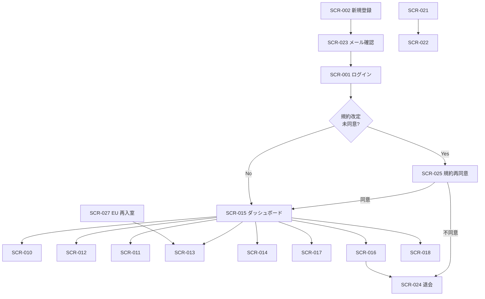

# 画面設計書(メイン)

## 1. 文書概要

### 1.1 目的

メインシステム(利用者向け FAQ ウィジェット SaaS)の画面仕様を一元化する。画面一覧 / 画面遷移 / 共通 UI 部品 / サイドメニュー / 各画面の表示項目・入力項目・操作・バリデーション・状態別表示・モーダルを定義する。

### 1.2 対象範囲

- 対象 SCR(20 画面): SCR-001〜003(認証)/ SCR-010 / SCR-010-M1 / SCR-011〜014 / SCR-015 / SCR-016 / SCR-017 / SCR-017-M1 / SCR-018 / SCR-021 / SCR-022 / SCR-023 / SCR-024 / SCR-025 / SCR-027
- 対象外: 運営者画面(02_運営者システム/個別設計書群/02_画面設計書.md 参照)、ウィジェット内 UI(基本設計書 §5.7 から § 7 に要約のみ)

### 1.3 版数

| 項目 | 値 |
|---|---|
| 版数 | 1.0 |
| 更新日 | 2026-05-17 |

### 1.4 関連ドキュメント

| ドキュメント名 | 役割 | 参照先 |
|---|---|---|
| 索引 | 11 ドキュメント体系の俯瞰 | [00_索引.md](00_索引.md) |
| API 設計書 | 各画面の API 呼び出し | [03_API設計書.md](03_API設計書.md) |
| メッセージ一覧 | 画面ラベル / エラー文言(正本)| [07_メッセージ一覧.md](07_メッセージ一覧.md) |
| 権限設計書 | 画面別権限・表示制御 | [05_権限設計書.md](05_権限設計書.md) |
| 認証・認可設計書 | ログイン / セッション / 認可判定 | [09_認証認可設計書.md](09_認証認可設計書.md) |
| エラー設計書 | 異常系挙動 | [06_エラー設計書.md](06_エラー設計書.md) |
| テーブル定義書 | 状態遷移 / コード値 | [04_テーブル定義書.md](04_テーブル定義書.md) |
| ワイヤーフレーム | UI 表現 | [../画面遷移図.html](../画面遷移図.html) |

## 2. 画面一覧

| 画面ID | 画面名 | 利用者 | 主たる関連 FR | 優先度 |
|---|---|---|---|:---:|
| SCR-001 | ログイン | admin | FR-004, FR-007, FR-008, FR-332 | P0 |
| SCR-002 | アカウント登録 | admin | FR-001, FR-002 | P0 |
| SCR-003 | パスワード再設定 | admin | FR-004, FR-006 | P0 |
| SCR-010 | プロジェクト一覧 | admin | FR-030〜035 | P0 |
| SCR-010-M1 | プロジェクト設定モーダル(新規/編集) | admin | FR-030〜035, FR-033a, FR-033c | P0 |
| SCR-011 | 未解決質問一覧 / 詳細 | admin | FR-070〜079, BR-019, BR-020 | P0 |
| SCR-012 | FAQ 管理 | admin | FR-040〜048, FR-100〜106, FR-310, FR-320〜323 | P0 |
| SCR-013 | 個別チャット部屋 | admin / end_user | FR-080〜091, FR-082a〜c | P0 |
| SCR-014 | ウィジェット設定 | admin(`project:manage`)| FR-150〜156, FR-193, FR-194 | P0 |
| SCR-015 | 利用状況・課金ダッシュボード | admin(オーナー専有)| FR-120〜127, FR-129, FR-148, FR-191 | P0 |
| SCR-016 | 設定(退会・課金画面入口)| admin(オーナー専有)| FR-009, FR-125, FR-162, FR-167 | P0 |
| SCR-017 | ユーザー管理 | オーナー / `users:manage` 保持メンバー | FR-017, FR-021a〜c, FR-333 | P0 |
| SCR-017-M1 | メンバー招待 / 編集モーダル | オーナー / `users:manage` 保持メンバー | FR-015〜021, FR-333〜338 | P0 |
| SCR-018 | プライバシーポリシー / 利用規約 | 全利用者 | FR-160, FR-164, FR-168 | P0 |
| SCR-021 | お知らせ一覧 | admin | FR-180〜183, FR-323 | P0 |
| SCR-022 | お知らせ詳細 | admin | FR-181, FR-182 | P0 |
| SCR-023 | メール確認 | admin | FR-003 | P0 |
| SCR-024 | 退会申請 | admin(オーナー専有)| FR-009 | P0 |
| SCR-025 | 規約再同意割込み | admin | FR-011, FR-164 | P0 |
| SCR-027 | エンドユーザー再入室 | end_user | FR-083, FR-084, FR-174 | P0 |

## 3. 画面遷移

### 3.1 Mermaid 遷移図

### 3.2 主要遷移ルール

| 観点 | 説明 |
|---|---|
| 認証フロー | SCR-001 → SCR-023(メール確認)→ SCR-001 → 利用状況系画面。SCR-002 新規登録経由は SCR-023 で本人確認後にログイン |
| 規約改定割込み | ログイン直後に未同意があれば SCR-025 強制割込み。SCR-025 で機能制限ガード(FAQ 編集とウィジェット稼働は継続、課金画面操作と新規プロジェクト作成は不可)|
| エンドユーザー導線 | ウィジェット → メール登録 → SCR-013。再入室メールからは SCR-027 を経由(トークン検証)|
| お知らせ導線 | ヘッダ通知ベル / サイドバー「通知 > お知らせ」→ SCR-021 → SCR-022(自動既読)|

## 4. 共通 UI 部品 + サイドメニュー

### 4.1 既存共通部品(§5.3.1)

| 部品 | 用途 | 主な仕様 |
|---|---|---|
| Header | ロゴ、プロジェクト切替、ユーザーメニュー、通知ベル | 管理画面共通 |
| Sidebar | 管理画面の主要メニュー左側表示 | ユーザー種別別表示。詳細は §4.4 |
| ProjectSelector | 対象プロジェクト切替 | admin は全件 |
| StatusBadge | FAQ 状態、案件状態、通知状態、契約状態 | **色 + アイコン + テキストの三重識別** を必須(FR-390)|
| ConfirmDialog | 削除、公開、退会など | 重要操作は再認証(FR-005)。削除系には「この操作は取り消せません」必須表示(FR-354)|
| ErrorAlert | 入力エラー、通信エラー、処理エラー | 原因 + 解決策をセットで表現(FR-353)|
| Pagination | 一覧画面 | カーソル方式 + 件数表示「1-50 / 全 254 件」併記(FR-358)|
| EmptyState | データなし | アイコン + 説明文 + CTA を必須。「データがありません」単独表示は禁止(FR-351)|
| Toast | 成功・失敗通知 | 成功 4 秒・警告 6 秒・エラーは手動閉じ(FR-382)|
| FormField | 入力部品 | 必須印、補助文、エラー文を構成要素として保持(FR-359)|
| NotificationBell | ヘッダの通知ベル | `critical` 赤色強調、`high` 黄色。未読件数バッジ、直近 10 件ドロップダウン、admin のみ表示 |
| InboxItem | お知らせ一覧の行 | 種別バッジ、重要度インジケータ、タイトル、配信日時、未読インジケータ |
| AnnouncementCategoryBadge | お知らせ種別バッジ | `billing`(青)/ `announcement`(緑)/ `system`(オレンジ)|
| ImportanceIndicator | お知らせ重要度インジケータ | `critical` = 赤マーク + バッジ、`high` = 黄色マーク、`normal` = 無印、`low` = 淡色(FR-181)|
| TrialBanner | トライアル残日数の警告バナー | 残 3 日以内に表示、支払方法登録誘導 |
| UsageBar | 利用量バー(80% / 100% / 125%) | 80% 黄色、100% 赤、125% アニメーション強調(FR-390)|

### 4.2 UI/UX 共通要件で追加する部品(§5.3.2)

| 部品 | 用途 | 主な仕様 |
|---|---|---|
| Breadcrumb | パンくず | 認証フロー除く全画面。最大 3 階層(FR-370)|
| PageHeader | 画面タイトル + 説明文 | 全画面の最上部に配置(FR-350)|
| QuickFilterChips | クイックフィルタ | 一覧画面上部、URL クエリで状態保持(FR-371)|
| AppliedFilterChips | 適用済フィルタ表示 + クリア | 「すべてクリア」リンクを常設(FR-371)|
| BulkActionBar | 一括操作バー | 1 件以上選択時に画面下部固定表示(FR-372)|
| SummaryCard | 数値サマリーカード | 数字 + 単位 + 補助バー + ラベル の 4 要素構成 |
| Timeline | 段階・フローの可視化 | 縦タイムライン、現在位置強調 |
| AutosaveIndicator | 自動保存状態の表示 | 緑点「30 秒前に保存しました」/ 黄点「保存中…」/ 赤点「保存できませんでした」(FR-321)|
| UnsavedChangesGuard | 未保存変更時の離脱警告 | フォーム編集中の戻る・タブ閉じ・リロード時に警告(FR-373)|
| PermissionTooltip | 権限不足時のグレーアウト | ボタンをグレーアウトし tooltip で必要権限表示(FR-356)|
| LoadingSkeleton | スケルトン UI | テーブルは行スケルトン、スピナー単独表示を避ける(FR-380)|
| ProgressText | 進捗テキスト(3 秒超)| 「保存中…」「処理中…(2/5 段階)」など(FR-381)|
| ReauthBadge | 再認証必須操作の可視化 | Primary ボタン横に 🛡 アイコン + tooltip(FR-360)|

### 4.3 文言の共通基準

詳細は [07_メッセージ一覧.md §2](07_メッセージ一覧.md) を正本とする。

### 4.4 サイドメニュー(§5.6)

#### 4.4.1 レイアウト方針

| 項目 | 仕様 |
|---|---|
| サイドバー幅 | 通常 240px、折り畳み時 64px(アイコンのみ)|
| 折り畳み | ヘッダ内トグルボタン、または画面幅 < 1024px で自動折り畳み |
| モバイル | ハンバーガーメニュー(オーバーレイ)|
| 固定表示 | スクロール時もサイドバーは固定。サイドバー内部は独立スクロール可 |
| アクティブ表示 | 現在画面のメニュー項目を強調(背景色 + 左境界アクセント)|

#### 4.4.2 メニュー構成

| グループ | メニュー項目 | 遷移先 | 表示種別 |
|---|---|---|---|
| (グループなし) | ホーム(利用状況サマリ)| SCR-015 | リンク |
| 対応 | 未解決質問 | SCR-011 | リンク + バッジ(未解決件数)|
| 対応 | 個別チャット | SCR-013 | リンク + バッジ(未読 / 未返信件数)|
| 通知 | お知らせ | SCR-021 | リンク + バッジ(未読件数)|
| コンテンツ | FAQ 管理 | SCR-012 | リンク |
| プロジェクト | プロジェクト | SCR-010 | リンク |
| プロジェクト | ユーザー管理 | SCR-017 | リンク |
| 利用状況 | 利用量・課金 | SCR-015 | リンク + バッジ(警告時)|
| 設定 | 設定・退会 | SCR-016 | リンク |
| 設定 | プライバシーポリシー / 利用規約 | SCR-018 | リンク |

#### 4.4.3 サイドメニューに含めない画面

| 画面 | 除外理由 | アクセス手段 |
|---|---|---|
| SCR-023 メール確認 | 新規登録フロー内の中継画面 | SCR-002 登録 → 自動遷移 |
| SCR-024 退会申請 | 重大かつ可逆性の低い操作 | SCR-016 「退会申請」ボタン |
| SCR-025 規約再同意割込み | 強制割込み画面(全画面モーダル)| ログイン時 / 操作時に自動表示 |
| SCR-027 エンドユーザー再入室 | トークン URL のみアクセス | 再入室メール内リンク |
| SCR-010-M1 プロジェクト設定モーダル | SCR-010 から開く全画面モーダル | SCR-010 行アクション |
| SCR-017-M1 メンバー招待/編集モーダル | SCR-017 から開く全画面モーダル | SCR-017 行アクション |

#### 4.4.4 ヘッダ部品

| 部品 | 種類 | 概要 |
|---|---|---|
| ロゴ | 画像 + リンク | クリックでホームへ |
| サイドバー折り畳みトグル | アイコンボタン | サイドバーの開閉 |
| 通知ベル | アイコンボタン + バッジ + ドロップダウン | 未読件数バッジ、`critical` 赤バッジ + 強調アニメーション。直近 10 件ドロップダウン、admin のみ表示 |
| ユーザーメニュー | ドロップダウン | プロフィール、アクティブセッション、ログアウト |

#### 4.4.5 動作要件

| 観点 | 仕様 |
|---|---|
| キーボード操作 | Tab で移動、Enter / Space で遷移、Esc でモバイル時のオーバーレイを閉じる |
| アクセシビリティ | `aria-current="page"` でアクティブ項目を示す。アイコンには `aria-label` を付与(NFR-1001〜1003)|
| バッジ更新 | 未解決件数・未読件数は画面遷移時に再取得。長時間滞在時は定期ポーリング |
| 折り畳み状態の保持 | ローカルストレージで利用者ごとに保持 |

### 4.5 レスポンシブ方針

| ブレイクポイント | レイアウト | 主要操作 |
|---|---|---|
| PC ≥ 1024px | 3 ペイン(ヘッダ + サイドバー 200-240px + メイン)| サイドバー常時表示、テーブル横並び |
| Tablet 768-1023px | サイドバー折り畳み(64px)、必要時オーバーレイ展開 | テーブル重要列に絞込 |
| SP < 768px | サイドバーはハンバーガー、テーブルはカード型、Primary CTA は固定フッタ | モーダルはフルスクリーン |

タッチターゲット: PC 36x36px / SP 44x44px 以上、隣接要素間 8px 以上の余白(FR-392)。

## 5. 画面詳細

各画面のメッセージ ID 体系(MSG-SCR-XXX-*)は [07_メッセージ一覧.md §4](07_メッセージ一覧.md) を正本とする。本書では原文の項目構造(表示・入力・操作・バリデーション・モーダル・状態)を網羅する。

---

### 5.1 SCR-001 ログイン

#### 画面概要

| 項目 | 内容 |
|---|---|
| 画面ID | SCR-001 |
| 目的 | 利用者(オーナー / メンバー)が認証情報を入力してセッションを確立する |
| 利用者 | 未ログイン admin |
| 関連 FR | FR-004, FR-007, FR-008, FR-332 |
| 関連 API | `POST /v1/sessions` |
| 関連メッセージID | MSG-SCR-001-* |
| 必要権限 | 不要(認証前)|

#### 表示・入力・操作項目

| 区分 | 項目 | 種類 | 概要 |
|---|---|---|---|
| 入力 | メールアドレス | メールアドレスボックス | 必須 |
| 入力 | パスワード | パスワードボックス | 必須 |
| 操作 | ログインボタン | ボタン | 認証 → 規約再同意チェック(必要なら SCR-025)→ 利用状況系画面へ |
| 操作 | パスワードを忘れた場合 | リンク | SCR-003 へ遷移 |
| 操作 | アカウント登録 | リンク | SCR-002 へ遷移 |
| 表示 | 認証エラーメッセージ | エラー | 失敗時の共通文言(攻撃者にヒントを与えない)|
| 表示 | ロックアウト警告 | エラー | 5 回失敗後(FR-007)|
| 表示 | アクティブセッション一覧 | テーブル | ログイン後にユーザーメニューから表示可能(FR-332)。同一アカウントの複数デバイスログインを確認 |

---

### 5.2 SCR-002 アカウント登録

#### 画面概要

| 項目 | 内容 |
|---|---|
| 画面ID | SCR-002 |
| 目的 | 新規利用者(オーナー)が SaaS にアカウント登録する |
| 利用者 | 未ログイン admin |
| 関連 FR | FR-001, FR-002 |
| 関連 API | `POST /v1/accounts` |
| 関連メッセージID | MSG-SCR-002-* |

#### 表示・入力・操作項目

| 区分 | 項目 | 種類 | 概要 |
|---|---|---|---|
| 入力 | メールアドレス | メールアドレスボックス | 必須。管理者本人のメール |
| 入力 | パスワード | パスワードボックス | 必須。FR-006 強度要件(12 文字以上、3 種類以上の文字種)|
| 入力 | パスワード(確認)| パスワードボックス | 必須。一致確認 |
| 入力 | 利用規約同意 | チェックボックス | 必須チェック |
| 入力 | プライバシーポリシー同意 | チェックボックス | 必須チェック |
| 入力 | 業種選択 | プルダウン | 任意。「金融」「医療」等の高規制業界を選択した場合は標準提供範囲外であることを表示し、サポート窓口を案内(要件 §16)|
| 表示 | 規約・ポリシーリンク | リンク | 別ウィンドウで全文表示 |
| 操作 | 登録ボタン | ボタン | 入力検証 → 登録 → 確認メール送信 → SCR-023 へ |
| 操作 | ログイン画面リンク | リンク | 既存ユーザー向け |

---

### 5.3 SCR-003 パスワード再設定

#### 画面概要 / 構成

3 段階構成 + Timeline:
- 段階 1: メールアドレス入力 → 再設定リンク送信
- 段階 1 送信後: メール送信済み案内(再送 5 分カウントダウン)
- 段階 2: 新パスワード設定 → 完了画面

#### 表示・入力・操作項目

| 区分 | 項目 | 種類 | 概要 |
|---|---|---|---|
| 表示 | ステップタイムライン | Timeline | 「① メールアドレス入力 → ② 受信メールのリンクをクリック → ③ 新しいパスワードを設定」。現在ステップを `aria-current="step"` で強調 |
| 段階 1 入力 | メールアドレス | メールアドレスボックス | 必須、形式チェック |
| 段階 1 操作 | 「再設定リンクを送信」 | ボタン(Primary)| リクエスト発行(**存在有無は同一応答**、列挙攻撃対策)|
| 段階 1 送信後 表示 | 完了画面 | 中間表示 | 「{メールアドレス} にメールを送信しました。1 時間以内にメールのリンクをクリックして再設定を完了してください」 |
| 段階 1 送信後 操作 | 「メールを再送信する」 | ボタン(Secondary、レート制限カウントダウン併記)| 5 分以内は disabled、残時間表示 |
| 段階 2 入力 | 新パスワード | パスワードボックス + 強度メーター | 必須。FR-006 強度要件。入力中にリアルタイムで強度 5 段階(極弱/弱/中/強/極強)+ 不足要件を表示 |
| 段階 2 入力 | 新パスワード(確認)| パスワードボックス | 必須。一致確認 |
| 段階 2 操作 | 「新しいパスワードを設定する」 | ボタン(Primary)| パスワード更新 → 全セッション失効 → 完了画面 → 自動的に SCR-001 へ |
| 段階 2 表示 | トークン無効 / 期限切れエラー | アラート帯(画面上部固定)+ 再送 CTA | 段階 2 でリンク不正の場合、「再設定リンクが期限切れ、または無効です(有効期限 1 時間)。新しいリンクを再送してください」 |
| 段階 2 完了表示 | 完了画面 | 中間表示 | 「新しいパスワードを設定しました。ログインしてください」+ 「ログインする」CTA(SCR-001 へ)|

#### バリデーション

- メールアドレス: 形式チェック(段階 1)
- 新パスワード: 12 文字以上、英大文字・小文字・数字・記号のうち 3 種類以上
- 新パスワード(確認): 一致確認

---

### 5.4 SCR-010 プロジェクト一覧

#### 画面概要

| 項目 | 内容 |
|---|---|
| 画面ID | SCR-010 |
| 目的 | ウィジェット設置サイトごとのプロジェクトを管理 |
| 利用者 | admin |
| 関連 FR | FR-030〜035 |
| 必要権限 | `project:manage`(編集・削除)/ 参照は全 admin |

#### 表示・入力・操作項目

| 区分 | 項目 | 種類 | 概要 |
|---|---|---|---|
| 表示 | パンくず | Breadcrumb | 「ホーム / プロジェクト」 |
| 表示 | プロジェクト ID | テキスト表示(テーブル列)| 内部 ID(短縮表示 + tooltip でフル表示)|
| 表示 | プロジェクト名 | テキスト表示(主)| カード型レイアウト時は見出しとして強調 |
| 表示 | 許可ドメイン | タグバッジ群 | 設定値を最大 3 件まで表示、超過分は `+N 件` で折り畳み。サブドメインワイルドカード `*.example.com` も表示 |
| 表示 | 連絡先メール | テキスト + 状態バッジ | 「✅ 確認済み」(緑)/「⏳ 確認待ち」(黄)/「未設定」(灰)。色のみ依存禁止 |
| 表示 | 更新日時 | テキスト表示 | 相対表記「3 時間前」+ tooltip で絶対日時 |
| 表示 | 件数表示 | テキスト | 「1-50 / 全 N 件」 |
| 操作 | + 新規プロジェクトを作成 | ボタン(Primary)| SCR-010-M1 を「新規作成」モードで開く |
| 操作 | 編集 | ボタン(行アクション)| SCR-010-M1 を「編集」モードで開く |
| 操作 | 削除する | ボタン(Danger / 確認ダイアログ + 再認証)| 管理画面からの復元手段は提供しない |
| 表示 | 空状態 | EmptyState | 「プロジェクトがまだありません。最初のプロジェクトを作成しましょう」+ 「+ 新規プロジェクトを作成」CTA |
| 表示 | ローディング状態 | LoadingSkeleton | テーブル/カード行スケルトン 3 行 |

#### モーダル

| モーダルID | 表示タイミング | 目的 |
|---|---|---|
| SCR-010-M1 | 「+ 新規プロジェクトを作成」または編集ボタンクリック時 | プロジェクトの新規作成 / 編集 |
| 削除確認 | 削除ボタンクリック時 | 「プロジェクトを削除しますか?」+ 再認証 |

---

### 5.5 SCR-010-M1 プロジェクト設定モーダル(新規 / 編集)

#### モーダル概要

| 項目 | 内容 |
|---|---|
| 画面ID | SCR-010-M1 |
| 目的 | プロジェクトの新規作成 / 編集を全画面割込みモーダルで実施 |
| 呼出元 | SCR-010「+ 新規プロジェクトを作成」/ 編集ボタン |
| モード | 新規作成 / 編集(同一画面でモード切替)|

#### 表示・入力・操作項目

| 区分 | 項目 | 種類 | 概要 |
|---|---|---|---|
| 表示 | モード見出し | 見出し | 新規「新規プロジェクトを作成」/ 編集「プロジェクト設定 — {プロジェクト名}」 |
| 入力 | プロジェクト名 *(必須)| テキストボックス | 1〜100 文字、placeholder「例: サポートサイト」、文字数カウンタ |
| 入力 | 許可ドメイン *(必須)| タグ入力(複数値)| placeholder「例: https://example.com、*.example.com」。Enter またはカンマで 1 件追加、即時検証。完全一致 + `*.example.com` 形式可。IP アドレス・プロトコル指定は不可 |
| 表示 | 許可ドメイン補足ヘルプ | helper | 「ウィジェット埋め込みを許可するドメイン。サブドメインを許可するには `*.example.com` のように記載します」 |
| 入力 | プロジェクト連絡先メール | メールアドレスボックス | 任意。確認メール送信 → リンククリックで確認完了。確認完了後は SCR-013 ウィジェットチャット上の「お問い合わせ先」表示にのみ利用 |
| 表示 | 連絡先メール 状態バッジ | バッジ | 編集モード時のみ。「✅ 確認済み」/「⏳ 確認待ち(残 N 時間)」/「未設定」 |
| 操作 | 確認メールを再送 | ボタン(Secondary、レート制限カウントダウン併記)| 編集モードかつ未確認時のみ活性 |
| 操作 | キャンセル | ボタン(Secondary)| 変更を破棄してモーダルを閉じる。未保存変更があれば UnsavedChangesGuard で警告 |
| 操作 | プロジェクトを作成 / 変更を保存 | ボタン(Primary)| バリデーション通過時に値を保存。新規作成時はウィジェット公開キーの初回発行も実施 |

#### バリデーション

- プロジェクト名: 必須、1〜100 文字
- 許可ドメイン: 必須、形式チェック(URL or ワイルドカード)、IP / プロトコル指定不可
- 連絡先メール: 任意、メール形式

---

### 5.6 SCR-011 未解決質問一覧 / 詳細

#### 画面概要

利用者(管理者ユーザー)がウィジェットで回答できなかった質問を確認・対応する画面。一覧 + 詳細の 2 サブ画面構成。

| 項目 | 内容 |
|---|---|
| 関連 FR | FR-070〜079, BR-019, BR-020 |
| 必要権限 | 参照: 全 admin / 返信: `chat:respond` |

#### 一覧画面の表示・操作項目

| 区分 | 項目 | 種類 | 概要 |
|---|---|---|---|
| 入力 | クイックフィルタチップ | チップグループ | 「自分の未対応」「期日切れ」「今日来た」「すべて」の 4 プリセット。各チップに件数バッジ |
| 入力 | 詳細フィルタ(折り畳み)| 折り畳みパネル | 状況 / 担当管理者 / 期間 |
| 表示 | 適用済フィルタチップ | チップ + クリア | 「すべてクリア」を常設 |
| 表示 | 件数表示 | テキスト | 「1-50 / 全 248 件」 |
| 操作 | CSV エクスポート | ボタン | フィルタ適用結果をエクスポート |
| 表示 | 問い合わせ ID | テキスト表示 | `inquiry_code` |
| 表示 | 状況(主バッジ)| バッジ | 派生値(未解決 / 対応中 / 解決済み / 終了)。色のみに依存しない |
| 表示 | 質問文(抜粋)| テキスト表示 | 先頭 60 文字 |
| 表示 | 発生理由(副情報)| サブテキスト(グレー)| `reason_code` を補助情報として 1 行下に表示 |
| 表示 | メール登録 | アイコン | 登録済み / 未登録 |
| 表示 | 最終投稿日時 | テキスト表示 | 相対表記 + tooltip で絶対日時 |
| 表示 | 担当管理者ユーザー | テキスト表示 | - |
| 操作 | 詳細 / 行クリック | ボタン | 詳細画面へ |
| 操作 | チャット | ボタン | SCR-013 へ |
| 操作 | FAQ 登録 | ボタン(admin のみ)| SCR-012 FAQ 登録モードへ |
| 操作 | 担当管理者ユーザー設定 | プルダウン(行内)| 管理者ユーザー選択 |
| 表示 | 空状態 | EmptyState | 「未解決質問はありません。ウィジェットを設置済みなら正常な状態です。」+ 「ウィジェット設定を見る」リンク |

#### 詳細画面の構成

左 6 割: 質問 + チャット / 右 4 割: 候補 FAQ + 状態管理 + 履歴 の 2 ペイン構成(SP では縦積み + タブ)。

| 区分 | 項目 | 種類 | 概要 |
|---|---|---|---|
| 表示 | パンくず | Breadcrumb | 「ホーム / 未解決質問 / {inquiry_code}」 |
| 表示 | ページタイトル | PageHeader | 「未解決質問の対応 — {inquiry_code}」+ 部屋状態バッジ |
| 表示 | 元質問 | 本文ブロック | 全文 |
| 表示 | 回答不可理由 | バッジ + 補足テキスト | `reason_code` |
| 表示 | チャット履歴 | パネル(左ペイン)| SCR-013 のサブ表示 |
| 表示 | 候補 FAQ | リンク一覧(右ペイン)| 関連性の高い既存 FAQ |
| 表示 | 案件状態バッジ | バッジ | `case_status`(4 値)|
| 表示 | チャット対応 | バッジ + 日時 | 返信済み(初回返信日時付き)/ 未返信 |
| 表示 | 状態履歴(折り畳み)| アコーディオン | 状態変更ログ。デフォルト折り畳み |
| 入力 | 案件状態 | プルダウン | **`open` / `resolved` のみ**(closed は別操作経由)|
| 入力 | FAQ 候補状態 | プルダウン | `none` / `candidate` / `drafted` / `registered` |
| 入力 | 担当管理者ユーザー | プルダウン | - |
| 操作 | 変更を保存 | ボタン(Primary)| 状態遷移ガード適用 |
| 操作 | チャット返信 | テキストエリア + 「送信」ボタン | 投稿フォーム |
| 操作 | FAQ 登録へ | ボタン(admin のみ)| SCR-012 へ |
| 操作 | **その他の操作 ▼(折り畳み)** | アコーディオン | 危険・低頻度操作 |
| 操作 | ┗ **対応不要として終了**(admin のみ)| ボタン(確認ダイアログ)| 終了理由(必須・最大 500 文字)入力 → `case_status=closed`(**FR-079 admin の明示操作のみ**)|
| 表示 | 終了情報 | テキスト表示 | `case_status=closed` のとき終了日時・操作者・理由を表示 |
| 表示 | 権限不足表示 | PermissionTooltip | `chat:respond` なしのメンバーは返信欄をグレーアウト + tooltip |

#### モーダル

| モーダルID | 表示タイミング | 目的 |
|---|---|---|
| 終了確認 | 「対応不要として終了する」クリック時 | `case_status=closed` への遷移確認 + 終了理由入力 |

---

### 5.7 SCR-012 FAQ 管理

#### 画面概要

一覧 / 編集 / インポート / 下書き生成。

| 項目 | 内容 |
|---|---|
| 関連 FR | FR-040〜048, FR-100〜106, FR-310, FR-320〜323 |
| 必要権限 | `faq:manage` |

#### 一覧画面の表示・操作項目

| 区分 | 項目 | 種類 | 概要 |
|---|---|---|---|
| 表示 | 状態サマリチップ | チップグループ | 「公開中 X」「下書き Y」「非公開 Z」をクリックで状態フィルタ即適用 |
| 入力 | キーワード検索 | テキストボックス | 質問文・回答文の全文検索 |
| 入力 | カテゴリフィルタ | プルダウン | プロジェクト内のカテゴリ |
| 入力 | 並び順 | プルダウン | 関連度 / 更新日時 / 作成日時 |
| 表示 | 件数表示 | テキスト | 「1-50 / 全 124 件」 |
| 表示 | FAQ ID | テキスト表示 | - |
| 表示 | 質問文(抜粋)| テキスト表示 | 先頭 60 文字 |
| 表示 | カテゴリ | テキスト表示 | - |
| 表示 | 状態バッジ | バッジ | 状態別。色のみ依存禁止 |
| 表示 | 登録元 | テキスト表示 + リンク | 未解決質問起源の場合 |
| 表示 | 更新日時 | テキスト表示 | 相対表記 + tooltip で絶対日時 |
| 操作 | + 新規作成 | ボタン(Primary)| 編集モードへ |
| 操作 | 編集 / 行クリック | ボタン | 編集モードへ |
| 操作 | 公開 / 非公開切替 | トグルスイッチ | 状態変更(admin のみ)|
| 操作 | 削除 | ボタン(行アクション、確認ダイアログ)| 論理削除 |
| 操作 | 一括操作バー | BulkActionBar | 1 件以上選択時に下部固定。最大 50 件 |
| 操作 | CSV インポート | ボタン → モーダル | 競合処理(スキップ / 上書き / 別件追加)を選択 |
| 操作 | CSV エクスポート | ボタン | CSV / JSON エクスポート |
| 表示 | インポート進捗 | ProgressText + プログレスバー | 100 件超は非同期ジョブ化、24h タイムアウト |
| 表示 | 空状態 | EmptyState | 「FAQ がまだありません。最初の FAQ を作成しましょう。」 |

#### 編集モードの構成

左 7 割: 質問・回答エディタ / 右 3 割: AI 下書きパネル + メタ情報。

| 区分 | 項目 | 種類 | 概要 |
|---|---|---|---|
| 表示 | パンくず | Breadcrumb | 「ホーム / FAQ / {FAQ ID} 編集」 |
| 表示 | 自動保存インジケータ | AutosaveIndicator | 「30 秒前に保存しました」/「保存中…」/「保存できませんでした」 |
| 入力 | 質問文 *(必須)| テキストエリア | 1〜500 文字 |
| 入力 | 回答文 *(必須)| リッチテキストエリア | 1〜5,000 文字。簡易ツールバー |
| 入力 | カテゴリ | テキストボックス + サジェスト | 任意。100 文字以内 |
| 入力 | 状態 | ラジオボタン | `draft` / `published` / `hidden`。ラベルは「下書き」「公開中」「非公開」 |
| 表示 | 登録元未解決質問 | テキスト表示 + リンク | 存在する場合 |
| 表示 | 改訂履歴 | リンク → モーダル | 直近 50 件、差分表示、任意版へのロールバック |
| 操作 | キャンセル | ボタン(Secondary)| 一覧へ戻る。未保存変更時は警告 |
| 操作 | 下書き保存 | ボタン | `status=draft` で保存 |
| 操作 | 削除する | ボタン(Danger / 確認ダイアログ)| 論理削除 |
| 操作 | 公開する | ボタン(Primary / 確認ダイアログ)| `status=published` で保存(admin のみ)|
| 操作 | **AI 下書きパネル**(右ペイン)| パネル | 元未解決質問を選択 → 「下書きを生成する」→ プレビュー → 「採用する」「やり直す」 |
| 表示 | 楽観ロック衝突 | エラーアラート | `faqs.version` 不一致時 |

#### バリデーション

- 質問文: 1〜500 文字
- 回答文: 1〜5,000 文字
- カテゴリ: 100 文字以内
- 公開時ガード(基本設計書 §4.2.1): AI / Batch による `draft → published` 直接遷移を 3 層で禁止

---

### 5.8 SCR-013 個別チャット部屋

#### 画面概要

管理者側 / エンドユーザー側の 2 視点。一覧 + 部屋画面。

| 項目 | 内容 |
|---|---|
| 関連 FR | FR-080〜091, FR-082a〜c |
| 必要権限 | 参照: 全 admin / 返信: `chat:respond` |

#### 管理者側 一覧画面

| 区分 | 項目 | 種類 | 概要 |
|---|---|---|---|
| 表示 | パンくず | Breadcrumb | 「ホーム / 個別チャット / {問い合わせ ID}」 |
| 表示 | 部屋状態バッジ | バッジ | `room_status`(open / closed)を画面上部に固定 |
| 表示 | **自動クローズ進捗バー** | Timeline + ProgressText | `reminder_state` 6 段階を「3/6 段階」のように抽象化表示 |
| 入力 | プロジェクトフィルタ | プルダウン | 全体 / プロジェクト別 |
| 入力 | 対応状態フィルタ | チェックボックスグループ | `case_status` |
| 入力 | 部屋状態フィルタ | チェックボックスグループ | `open` / `closed` |
| 表示 | 案件状態列 | バッジ | 色 + アイコン + テキスト |
| 表示 | 自動クローズ段階列 | バッジ + 残時間 | 段階番号と次段階までの残時間 |
| 表示 | 件数表示 | テキスト | 「1-50 / 全 N 件」 |
| 表示 | 空状態 | EmptyState | 「個別チャットはまだありません。エンドユーザーからの問い合わせが始まるとここに表示されます」 |

#### 管理者側 部屋画面(左ペイン: 会話)

| 区分 | 項目 | 種類 | 概要 |
|---|---|---|---|
| 表示 | メッセージ履歴 | チャットメッセージリスト | 投稿者種別 / 本文 / 時刻、ページング、`aria-live="polite"` |
| 表示 | **機密情報注意警告帯** | アラート帯(入力欄直上に常時表示)| 「機密情報(電話番号・クレジットカード番号・パスワード等)は入力しないでください」 |
| 入力 | 本文 | テキストエリア | 必須。最大 2,000 文字。エンドユーザーは 10 件/分の投稿頻度制限 |
| 操作 | 送る | ボタン(Primary)| メッセージ保存 → 相手側に通知 Queue 投入 |

#### 管理者側 部屋画面(右ペイン: 状態・危険操作)

| 区分 | 項目 | 種類 | 概要 |
|---|---|---|---|
| 入力 | 案件状態 | プルダウン | `open` / `resolved` のみ |
| 操作 | 変更を保存 | ボタン | 案件状態更新 |
| 操作 | 「利用者待ち」判定(`reminder_state=stage1_pending_admin` 時のみ)| ボタン | `stage2_user_check_sent` へ遷移、EU へ通知送信 |
| 操作 | 「対応中」判定(同上)| ボタン | `active` へ戻す |
| 操作 | FAQ として登録 | ボタン(admin のみ)| SCR-012 へ |
| 操作 | 管理者ユーザー割当 | プルダウン | - |
| 操作 | **その他の操作 ▼ (危険操作セクション)** | アコーディオン | 以下の危険操作をまとめ |
| 操作 | ┗ 部屋を閉じる | ボタン(Danger / 確認ダイアログ / 再認証)| admin のみ。`room_status=closed` |
| 操作 | ┗ **部屋を再オープン**(admin のみ、closed 時)| ボタン(確認ダイアログ / 再認証)| クローズから 30 日以内に限り同 `room_id` を再オープン |
| 表示 | 部屋クローズ後 帯 | アラート帯 | `room_status=closed` 時「この問い合わせは {終了日} に終了しました」 |

#### エンドユーザー側

| 区分 | 項目 | 種類 | 概要 |
|---|---|---|---|
| 表示 | 問い合わせ ID | 見出し | `inquiry_code` |
| 表示 | 残時間カウントダウン | テキスト | 再入室トークン有効期限を「あと 25 日」のように相対表示 |
| 表示 | 元質問 | 参照ブロック | 未解決の元質問文 |
| 表示 | メッセージ履歴 | チャットメッセージリスト | - |
| 表示 | **機密情報注意警告帯** | アラート帯 | 同上 |
| 表示 | お問い合わせ先メール | 案内ブロック | 確認完了済の連絡先メール設定時のみ表示 |
| 表示 | 終了案内 | アラート帯 | `room_status=closed` のとき投稿フォーム非表示 |
| 入力 | メールアドレス(初回のみ)| メールアドレスボックス | 必須。同一契約内で同一メールが保有可能な未クローズ案件は最大 5 件。メールアドレス変更 UI は MVP 不提供 |
| 入力 | 利用目的への了承 | チェックボックス | 必須 |
| 入力 | 本文 | テキストエリア | 必須。最大 2,000 文字 |
| 操作 | メッセージを送る | ボタン(Primary)| メッセージ保存 → admin に通知 |

#### モーダル

| モーダルID | 表示タイミング | 目的 |
|---|---|---|
| 部屋クローズ確認 | 「部屋を閉じる」クリック | 終了確認 + 再認証 |
| 部屋再オープン確認 | 「部屋を再オープン」クリック | 再オープン確認 + 再認証 |

---

### 5.9 SCR-014 ウィジェット設定

#### 画面概要

左 50% に設定パネル、右 50% に **プレビュー(デバイス切替可)** を固定配置。SP では縦積み。

| 項目 | 内容 |
|---|---|
| 関連 FR | FR-150〜156, FR-193, FR-194, FR-350 |
| 必要権限 | `project:manage` |

#### (1) 公開キー管理セクション

| 区分 | 項目 | 種類 | 概要 |
|---|---|---|---|
| 表示 | ウィジェット公開キー | テキスト + コピーボタン | 形式 `pk_live_<32-char base62>`(FR-194)。参照のみ。コピー成功時に緑チェック + トースト |
| 表示 | キー有効期限残日数 | カウントダウン | 残時間に応じて色変化(残 30 日以上: 通常 / 残 7-30 日: 黄 / 残 7 日以内: 赤)|
| 入力 | 公開キー有効期限 | プルダウン | 7 日 / 30 日 / 90 日 / 180 日 / 1 年、無期限不可、デフォルト 1 年 |
| 操作 | **有効期限を 1 年延長する** | ボタン(Secondary)| 「現在の残日数 + 1 年」を新有効期限として設定 |
| 表示 | 旧キー使用中バッジ | バッジ + 注意文 | ローテーション猶予 30 日中に旧キー使用検知時に表示 |
| 操作 | 公開キーを再発行(ローテーション)| ボタン(Danger / 確認ダイアログ + 再認証 🛡)| 新キー発行と同時に旧キーは 30 日猶予で失効予告(FR-193)|

#### (2) 見た目セクション

| 区分 | 項目 | 種類 | 概要 |
|---|---|---|---|
| 入力 | 主色(プライマリカラー)| カラーピッカー(HEX 指定)| FR-152。プレビューにリアルタイム反映 |
| 入力 | 強調色(アクセントカラー)| カラーピッカー | FR-152 |
| 入力 | 配置 | ラジオボタン | 右下 / 左下 / 中央下 |
| 入力 | 角丸度 | ラジオボタン | 0px / 4px / 8px / 16px |

#### (3) プレビュー(右ペイン固定)

| 区分 | 項目 | 種類 | 概要 |
|---|---|---|---|
| 表示 | プレビュー | プレビューウィンドウ | 設定変更時にリアルタイム反映 |
| 入力 | プレビューデバイス切替 | タブ(PC / Tablet / SP)| 360px / 768px / 1200px |
| 表示 | 「Powered by」表示 | 注釈 | 本サービス運営者ロゴを必須表示 |

#### (4) 埋め込みコードセクション

| 区分 | 項目 | 種類 | 概要 |
|---|---|---|---|
| 表示 | 埋め込みコード | コードブロック + コピーボタン | - |
| 操作 | 設定の保存 | ボタン(Primary)| 設定更新 + KV キャッシュ無効化 |

---

### 5.10 SCR-015 利用状況・課金ダッシュボード

#### 画面概要

| 項目 | 内容 |
|---|---|
| 関連 FR | FR-120〜127, FR-129, FR-148, FR-191 |
| 必要権限 | **オーナー専有** |

#### 表示・操作項目

| 区分 | 項目 | 種類 | 概要 |
|---|---|---|---|
| 入力 | 期間選択 | プルダウン + 日付ピッカー | 当月 / 前月 / 任意期間 |
| 表示 | **TrialBanner(常時表示)** | バナー | トライアル中は常時表示。残 3 日以内は赤強調 + 「支払い方法を登録」CTA |
| 表示 | サスペンション中の表示 | アラート | `contract_status=suspended` で「現在ご利用いただけません」+ 支払方法更新導線 |
| 表示 | **サマリカードグリッド** | SummaryCard × 6(PC 6 列 / Tablet 3 列 / SP 2 列)| 質問数 / 解決数 / 未解決数 / FAQ 件数 / チャット部屋数 / AI 利用コスト |
| 表示 | UsageBar 状態ラベル | テキスト + 色 | 〜60%: 表示なし / 61〜80%: 黄 / 81〜100%: 赤 / 101〜125%: 濃赤 |
| 表示 | `metering_billable=false` 件数 | カード | 失敗時の課金対象外件数 |
| 表示 | **料金プランカード** | カード | 質問数: ¥0〜10,000 件/月 (無料枠) + ¥0.5/件 (超過分)、FAQ 件数: 8,000 件まで(警告) / 12,000 件まで(拒否)、チャット部屋: 200 件/月まで |
| 表示 | 月次予算上限 | テキスト表示 | 管理者ユーザー設定値 |
| 操作 | 予算上限を変更する | ボタン(再認証必須 🛡)| 設定変更画面へ |
| 表示 | 請求状態 | バッジ | `active` / `trialing` / `past_due` / `canceled` / `suspended` |
| 表示 | 警告アラート | アラートバナー | 上限接近(80%)/ 超過(100%)/ 追加制限(125%)|
| 表示 | 請求履歴 | テーブル(折り畳み可)| 月別履歴、月毎の請求書 PDF リンク |
| 操作 | **最新の請求書 PDF を開く** | ボタン | R2 署名 URL、有効期限 5 分 |
| 操作 | 支払い方法を変更する | リンク | Stripe Customer Portal へ |
| 操作 | 契約を解約する | ボタン(Danger、最下部、確認ダイアログ + 再認証)| 解約フローへ。誤クリック防止のため「契約管理」セクション(折り畳み)に配置 |
| 表示 | 空状態 | EmptyState | 「請求履歴はまだありません。トライアル終了後に最初の請求が発生します。」 |

---

### 5.11 SCR-016 設定(退会・課金画面入口)

#### 画面概要

4 セクションに分割。誤操作防止のため危険操作セクションは画面最下部に分離。

| 項目 | 内容 |
|---|---|
| 関連 FR | FR-009, FR-125, FR-162, FR-167 |
| 必要権限 | **オーナー専有** |

#### (1) 連絡先 / アカウント情報

| 区分 | 項目 | 種類 | 概要 |
|---|---|---|---|
| 表示 | 契約情報 | テキスト表示(編集不可)| オーナーアカウントの基本情報 |
| 入力 | 連絡先メール | メールアドレスボックス | 編集可能 |

#### (2) データ保持

| 区分 | 項目 | 種類 | 概要 |
|---|---|---|---|
| 入力 | 質問ログ保持日数 | 数値入力 / プルダウン + helper | **初期値(365 日)以下のみ設定可。引き上げ不可**(NFR-702、サーバ側で検証)|
| 入力 | チャット履歴保持日数 | 数値入力 / プルダウン + helper | 初期値以下のみ |
| 入力 | 通知ログ保持日数 | 数値入力 / プルダウン + helper | 初期値以下のみ |

#### (3) アクセス制限

| 区分 | 項目 | 種類 | 概要 |
|---|---|---|---|
| 入力 | IP 許可リスト(FR-179 / FR-330)| テキストエリア(CIDR 複数行入力)| 契約単位でオプトイン。IPv4 / IPv6 両対応の CIDR 表記、ワイルドカード不可。空欄 = 制限なし |
| 操作 | **現在の IP を追加する** | ボタン(Secondary)| 操作中のクライアント IP を `<your-ip>/32` または `/128` として末尾に追加 |
| 表示 | 現在の IP 表示 | helper | 「あなたが現在使用している IP: {currentIp}」を常時表示 |
| 表示 | 自己ロックアウト警告 | アラート | 入力中の IP リストに「現在の IP」が含まれていない場合「⚠ あなたの現在の IP がリストに含まれていません」を即時表示 |
| 操作 | 設定を保存 | ボタン(Primary)| IP 許可リスト変更時は確認ダイアログ + 再認証 |

#### (4) 契約管理(最下部に分離)

| 区分 | 項目 | 種類 | 概要 |
|---|---|---|---|
| 表示 | 退会案内 | 注意文 | 「退会するとサービスがご利用いただけなくなります」 |
| 操作 | 退会を申請する | ボタン(Danger、最下部)| → SCR-024 |

---

### 5.12 SCR-017 ユーザー管理

#### 画面概要

オーナーおよび `users:manage` 権限フラグ保持メンバーのみアクセス可能。一覧表示と行アクション(編集 / 削除)のみ。詳細操作はすべて **SCR-017-M1** に集約。

| 項目 | 内容 |
|---|---|
| 関連 FR | FR-017, FR-021a〜c, FR-333 |
| 必要権限 | オーナー / `users:manage` |

#### 表示・操作項目

| 区分 | 項目 | 種類 | 概要 |
|---|---|---|---|
| 表示 | **オーナー要約バナー(折り畳み可)** | 情報パネル | 通常「オーナー: {表示名} ({メール}) [詳細 ▼]」のみ。展開時に「オーナーは契約 1 つにつき 1 人で、課金・退会・規約再同意を専有します。MVP では降格・停止・削除・譲渡はできません」 |
| 表示 | 権限フラグの説明セクション | 折りたたみパネル | 5 種フラグそれぞれの「できること」一覧と「ダッシュボードはどの権限も不要で利用可」を明示 |
| 入力 | 検索 | テキストボックス | 表示名・メール部分一致 |
| 入力 | 状態フィルタ | プルダウン | すべて / 有効 / 停止中 / 招待中 |
| 表示 | 件数表示 | テキスト | 「1-50 / 全 N 件」 |
| 表示 | 利用者表示名 | テキスト表示 | 自分の行は「{表示名}(あなた)」と末尾に注釈 |
| 表示 | メールアドレス | テキスト表示 | - |
| 表示 | ロール | バッジ | `オーナー`(青・👑)または `メンバー`(灰)|
| 表示 | 状態 | バッジ | 「⏳ 招待中」「🟢 有効」「⚫ 停止中」 |
| 表示 | **権限フラグアイコン群** | アイコンバッジ × 5 | 📝 FAQ 管理 / 💬 チャット対応 / 👥 ユーザー管理 / ⚙ プロジェクト設定 / 📋 ログ参照。付与時はカラー、未付与は淡色。各 hover で tooltip。オーナー行は「👑 全権限」バッジ |
| 表示 | 割当プロジェクト | バッジ群 | 3 件超は `+N 件` で折り畳み。割当 0 は「ダッシュボードのみ」、オーナー行は「全プロジェクト」 |
| 表示 | 最終ログイン日時 | テキスト表示 | 相対表記 + tooltip で絶対日時 |
| 表示 | **招待中行強調** | 行背景色 | `pending_activation` は黄色背景。「⏳ 招待中(残 N 日)」、残 1 日以下は赤背景 |
| 操作 | + メンバーを招待 | ボタン(Primary)| SCR-017-M1 を「招待」モード |
| 操作 | 編集 | ボタン(行アクション)| メンバー行のみ。SCR-017-M1 を「編集」モード |
| 操作 | 削除する | ボタン(Danger / 確認ダイアログ + 再認証)| メンバー行のみ。`pending_activation` 行では招待取消として動作 |
| 表示 | 空状態 | EmptyState | 「メンバーがまだ招待されていません。」 |
| 表示 | 権限不足ガード | PermissionTooltip | `users:manage` なしの URL 直アクセス時 403 → ダッシュボードへリダイレクト |

---

### 5.13 SCR-017-M1 メンバー招待 / 編集モーダル

#### モーダル概要

SCR-017 の「+ メンバーを招待」または「編集」ボタンから開く全画面割込みモーダル。招待 / 編集をモード切替で扱う。

| 項目 | 内容 |
|---|---|
| 関連 FR | FR-015〜021, FR-015a〜d, FR-016a〜c, FR-018a〜c, FR-021c, FR-333, FR-334, FR-335, FR-336〜338 |

#### 表示・入力・操作項目

| 区分 | 項目 | 種類 | 概要 |
|---|---|---|---|
| 表示 | モード見出し | 見出し | 招待「メンバーを招待」/ 編集「メンバー編集 — {表示名}」 |
| 表示 | **自己編集警告帯**(編集モードかつ自分自身編集時)| アラート帯 | 「あなた自身を編集中: 権限・状態は変更できません」 |
| 入力 | メールアドレス | メールアドレスボックス | 必須。招待モードでのみ編集可。編集モードでは表示のみ |
| 入力 | 表示名(氏名)| テキストボックス | 必須。オーナーの表示名はオーナー本人のみ編集可 |
| 入力 | 通知設定 | チェックボックス | 招待時の初期値、編集時の現値を表示・更新 |
| 入力 | **権限テンプレ(プリセット)** | ラジオボタングループ | 「FAQ 担当者」「問合せ対応者」「プロジェクト管理者」「ログ参照のみ」「カスタム」の 5 択 |
| 入力 | メンバー権限フラグ(カスタム時のみ展開)| チェックボックス × 5 | `📝 FAQ 管理` / `💬 個別チャット対応` / `👥 ユーザー管理` / `⚙ プロジェクト設定` / `📋 ログ参照` |
| 入力 | 割当プロジェクト | チェックボックス群 | プロジェクト一覧から 0 個以上を選択。操作者自身が割当を持つ(またはオーナーである)プロジェクトのみ選択可 |
| 表示 | **割当 0 件選択時の即時警告** | アラート | 「⚠ プロジェクト未選択の場合、このメンバーはダッシュボードのみ利用できます」 |
| 表示 | 招待状態 | バッジ | 編集モード時のみ |
| 表示 | **変更内容プレビューパネル** | パネル(編集モード)| 差分を「変更前 → 変更後」形式で表示 |
| 操作 | 招待メールを送信 | ボタン(Primary、再認証 🛡)| 招待モードのみ。`access_tokens.purpose='activation'`(7 日)発行 |
| 操作 | 変更を保存 | ボタン(Primary、再認証 🛡)| 編集モードのみ |
| 操作 | 招待を再送 | ボタン(再認証 🛡)| 編集モードかつ `pending_activation` のみ。旧リンク失効・新リンク発行 |
| 操作 | 招待を取り消す | ボタン(Danger、確認ダイアログ、再認証 🛡)| 編集モードかつ `pending_activation` のみ |
| 操作 | メンバーを停止 | ボタン(Danger、確認ダイアログ、再認証 🛡)| 編集モードかつ `active` のみ |
| 操作 | 停止を解除 | ボタン(確認ダイアログ、再認証 🛡)| 編集モードかつ `disabled` のみ |
| 操作 | 強制ログアウト | ボタン(Danger、確認ダイアログ、再認証 🛡)| 編集モードかつ `active` のみ。対象メンバーの全セッション失効 |
| ガード | 自己権限剥奪 | UI 制御 | 自分自身の `users:manage` チェックを外す操作は非活性化 + tooltip |
| ガード | 自己状態変更 | UI 制御 | 自分自身を編集モードで開いた場合、「停止」「強制ログアウト」「招待取消」は非活性化 |

#### 権限テンプレ プリセット定義

| プリセット名 | 含まれる権限フラグ |
|---|---|
| FAQ 担当者 | `faq:manage` |
| 問合せ対応者 | `faq:manage` + `chat:respond` |
| プロジェクト管理者 | `faq:manage` + `chat:respond` + `project:manage` + `logs:view`(`users:manage` を除く全権限)|
| ログ参照のみ | `logs:view` |
| カスタム | 選択した個別フラグの組合せ |

---

### 5.14 SCR-018 プライバシーポリシー / 利用規約閲覧

#### 画面概要

上部に同意状態バッジ + 最新版見出し、下に全文(目次付き)、最下部に過去バージョン一覧(折り畳み)。

| 項目 | 内容 |
|---|---|
| 関連 FR | FR-160, FR-164, FR-168 |
| 必要権限 | 不要(認証前可)|

#### 表示項目

| 区分 | 項目 | 種類 | 概要 |
|---|---|---|---|
| 表示 | パンくず | Breadcrumb | 「ホーム / プライバシーポリシー・利用規約」 |
| 表示 | **同意状態バッジ**(上部固定)| バッジ | 「✓ 同意済み({同意日})」(緑)/「⚠ 未同意」(赤、SCR-025 へのリンク併記)|
| 表示 | 現行版見出し | h2 | 「利用規約 vX.X(発効 {YYYY-MM-DD})」 |
| 表示 | 目次(全文の章構成)| ナビゲーション | 全文の見出しをクリックで該当章へジャンプ |
| 表示 | 全文 | リッチテキスト表示(sanitize 済)| 利用規約 / プライバシーポリシー |
| 表示 | **過去バージョン一覧**(折り畳み)| アコーディオン + 表 | バージョン番号 + 発効日 + 「全文を見る」リンク |
| 表示 | バージョン比較リンク | リンク | 過去バージョンと最新版の差分を別タブで表示(diff 形式)|

---

### 5.15 SCR-021 お知らせ一覧

#### 画面概要

| 項目 | 内容 |
|---|---|
| 関連 FR | FR-180〜183, FR-323 |
| 必要権限 | 全 admin |

#### 表示・操作項目

| 区分 | 項目 | 種類 | 概要 |
|---|---|---|---|
| 表示 | パンくず | Breadcrumb | 「ホーム / お知らせ」 |
| 表示 | クイックフィルタチップ | QuickFilterChips | 「未読のみ」(**デフォルト選択**)「重要のみ」「課金」「お知らせ」「システム」「すべて」 |
| 表示 | 適用済フィルタチップ | AppliedFilterChips | 適用条件 + 「すべてクリア」 |
| 入力 | 詳細フィルタ(折り畳み)| 折り畳みパネル | 期間 / キーワード検索 |
| 表示 | 件数表示 | テキスト | 「1-50 / 全 24 件(未読 3 件)」 |
| 表示 | **未読行の背景強調** | 行背景色 | 薄い水色背景 + 行頭ドット |
| 表示 | 種別バッジ | バッジ | AnnouncementCategoryBadge |
| 表示 | 重要度 | アイコン + テキスト | `critical` 🔴+「重要」/ `high` 🟡+「重要」/ `normal` 無印 / `low` 淡色 |
| 表示 | タイトル | テキスト表示 | 行クリックで SCR-022 へ。未読タイトルは bold |
| 表示 | 配信日時 | テキスト表示 | 相対表記 + tooltip で絶対日時 |
| 操作 | 詳細表示 | 行クリック | SCR-022 へ。同時に該当行を既読化 |
| 表示 | **BulkActionBar(複数選択時のみ)** | 画面下部固定 | 1 件以上選択時に表示。最大 100 件 |
| 操作 | 一括既読化 | ボタン(BulkActionBar 内)| 選択した行を既読化 |
| 操作 | **表示中の未読をすべて既読化** | ボタン(画面右上)| 現在のフィルタで表示中の未読のみを既読化 |
| 操作 | すべての未読を既読化 | リンク(副次的)| フィルタ無視で全未読を既読化。確認ダイアログ |
| 表示 | ページング | カーソル方式 | - |
| 表示 | 空状態 | EmptyState | 「お知らせはまだありません」/「未読のお知らせはありません」 |

---

### 5.16 SCR-022 お知らせ詳細

#### 画面概要

| 項目 | 内容 |
|---|---|
| 関連 FR | FR-181, FR-182 |
| 必要権限 | 全 admin |

#### 表示・操作項目

| 区分 | 項目 | 種類 | 概要 |
|---|---|---|---|
| 表示 | パンくず | Breadcrumb | 「ホーム / お知らせ / {タイトル(短縮)}」 |
| 表示 | **メタ情報バー**(タイトル直下)| バッジ群 | 種別バッジ + 重要度バッジ + 配信日時 + 既読化日時(あれば)|
| 表示 | 種別バッジ | AnnouncementCategoryBadge | billing / announcement / system |
| 表示 | 重要度バッジ | ImportanceIndicator | `critical`(🔴)/ `high`(🟡)/ `normal`(無印)/ `low`(淡色)|
| 表示 | タイトル | h1 | - |
| 表示 | 配信日時 | テキスト表示 | 絶対日時 + 相対日時 |
| 表示 | 既読化日時 | テキスト表示 | 既読の場合のみ |
| 表示 | 本文 | リッチテキスト表示(sanitize 済 HTML)| §10.5.1 二重サニタイズ、許可タグ・属性ホワイトリスト |
| 表示 | **関連リンク**(本文末尾)| リンク一覧(目立つカード形式)| 種別に応じた遷移先 |
| 操作 | 自動既読化 | 自動 + 完了トースト | 詳細画面表示時に自動既読化(初回のみ)|
| 操作 | 一覧へ戻る | リンク(画面下部 + パンくず)| SCR-021 へ |
| 操作 | 前のお知らせ / 次のお知らせ | リンク | 一覧の並び順に基づく前後 |

---

### 5.17 SCR-023 メール確認

#### 画面概要

新規登録後のメール確認画面。送信済み / 確認成功 / 確認失敗 の 3 状態。

| 項目 | 内容 |
|---|---|
| 関連 FR | FR-003 |

#### 表示・操作項目

| 区分 | 項目 | 種類 | 概要 |
|---|---|---|---|
| 表示 | 状態タイムライン | Timeline | 「① 新規登録 → ② 確認メールのリンクをクリック → ③ ログイン」 |
| 表示 | 送信先メールアドレス | テキスト表示(強調)| 確認メール送信先 |
| 表示 | 案内文 | テキスト表示 | 「確認リンクの有効期限は 24 時間です」+ 「メールが届かない場合は迷惑メールフォルダもご確認ください」 |
| 操作 | **メールを再送する** | ボタン(Secondary、レート制限カウントダウン併記)| レート制限 5 分以内 1 回 |
| 操作 | メールアドレスを変更する | リンク(Secondary)| SCR-002 へ戻る |
| 表示 | 確認成功 | 完了画面 | ✅ + 「メールアドレスの確認が完了しました」+ 「ログインする」CTA |
| 表示 | 確認失敗 | エラー画面 + 復旧 CTA | 「確認リンクが期限切れ、または使用済みです」+ 「新規登録からやり直す」CTA |
| 操作 | ログインする | ボタン(Primary)| 成功後 SCR-001 へ |

---

### 5.18 SCR-024 退会申請

#### 画面概要

オーナー専有機能。タイムライン形式で 3 ステップを可視化。

| 項目 | 内容 |
|---|---|
| 関連 FR | FR-009 |
| 必要権限 | **オーナー専有** |

#### 表示・入力・操作項目

| 区分 | 項目 | 種類 | 概要 |
|---|---|---|---|
| 表示 | **退会フロー タイムライン** | Timeline | (1)申請(今日)→ (2){当月末日}: サービス停止 → (3){当月末日 + 30 日}: データ完全削除(復元不可)|
| 表示 | 退会案内 | テキスト表示 | 月末締めで停止、データエクスポート猶予 30 日 |
| 表示 | データエクスポート 強調セクション | パネル(目立つ位置)| 「📦 すべてのデータをエクスポートする」CTA |
| 表示 | 課金影響 | パネル | 「当月分の従量課金は通常通り請求されます。次月以降の請求は発生しません」 |
| 表示 | メンバーへの影響 | パネル | 「全メンバーのアクセス権が当月末で失効します」 |
| 入力 | 退会理由(任意)| テキストエリア | 任意。最大 500 文字 |
| 操作 | キャンセル | ボタン(Secondary)| SCR-016 へ戻る |
| 操作 | 退会を申請する | ボタン(Danger / 確認ダイアログ + 再認証 🛡)| `accounts.contract_status=deleted_pending` |
| 表示 | データエクスポート猶予残日数 | カウントダウン表示 | 退会確定後表示 |
| 表示 | 物理削除予定日 | テキスト表示 | 退会確定後 30 日経過後の物理削除日 |

---

### 5.19 SCR-025 規約再同意割込み

#### モーダル概要

全画面モーダル割込み(SP / PC ともフルスクリーン)。3 段 timeline で機能制限の段階的影響を可視化。

| 項目 | 内容 |
|---|---|
| 関連 FR | FR-011, FR-164 |

#### 表示・入力・操作項目

| 区分 | 項目 | 種類 | 概要 |
|---|---|---|---|
| 表示 | 改定内容 | リッチテキスト表示(sanitize 済)| 旧 / 新の差分または要約 |
| 表示 | 発効日 | テキスト表示(強調)| カレンダーアイコン + 日付 |
| 表示 | 同意期限 | カウントダウン + テキスト表示 | 発効日 + 14 日。緑 → 黄 → 赤 |
| 表示 | **影響タイムライン**(3 段)| Timeline | ① 発効日まで: 通常通り / ② 発効日 〜 同意期限: 選択を促す / ③ 同意期限超過後: 課金画面操作 + 新規プロジェクト作成 不可 |
| 入力 | 規約同意 | チェックボックス | 必須。「全文を読む」リンク(SCR-018 を別タブ)|
| 入力 | プライバシーポリシー同意 | チェックボックス | 必須 |
| 操作 | 同意して続行する | ボタン(Primary)| 両チェック充足時のみ活性化 |
| 操作 | 同意しない(退会手続きへ)| リンク(Danger 文字色)| 退会フロー誘導(SCR-024 へ)。確認ダイアログ |
| 表示 | 機能制限ガード案内 | アラート | 期限超過時「同意期限({期限日})を過ぎたため、課金画面操作と新規プロジェクト作成は同意するまで制限されます」 |
| 表示 | 段階的実施案内 | helper テキスト | 「契約単位で発効日が分散されます」 |

---

### 5.20 SCR-027 エンドユーザー再入室

#### 画面概要

エンドユーザーがメール内トークンで個別チャット部屋へ再入室するための画面。エンドユーザー向けなので簡潔で直感的な表示を最優先。

| 項目 | 内容 |
|---|---|
| 関連 FR | FR-083, FR-084, FR-174 |
| 状態 | 有効 / 期限間近 / 期限切れ の 3 状態 |

#### 表示・操作項目

| 区分 | 項目 | 種類 | 概要 |
|---|---|---|---|
| 表示 | 問い合わせ ID | 見出し | トークンから復号 |
| 表示 | 問い合わせ件名(あれば)| テキスト表示 | 質問本文の冒頭 50 文字 |
| 表示 | トークン有効期限 | テキスト表示 + アイコン | 「あと {N} 日 {H} 時間」+ カラーグラデーション(残 14 日以上: 緑 / 残 3-14 日: 黄 / 残 3 日以内: 赤)|
| 表示 | 期限切れ・無効エラー | アラート + 復旧 CTA | 「リンクの有効期限が切れました(または無効です)。下記から新しいリンクをメールで受け取ってください」 |
| 入力 | メールアドレス(期限切れ時のみ)| メールアドレスボックス | 必須。元の問い合わせと同じアドレスで本人確認 |
| 操作 | **新しいリンクをメールで送る**(期限切れ時のみ)| ボタン(Primary、ProgressText 付き)| レート制限 5 分以内 1 回 |
| 操作 | **続きから再開する**(有効時)| ボタン(Primary、大きく目立つ)| トークン検証 → SCR-013 へ |
| 表示 | 再送後の表示 | 完了画面 | 「{メールアドレス} に新しいリンクをメールで送信しました(有効期限 30 日)」+ 「メールを確認する」ボタン |

#### トークン形式

不透明文字列 + HMAC-SHA256(オーナー派生鍵で計算)。トークン内に `inquiry_id` を含めて、同一メールで複数の問い合わせ ID がある場合の識別を担保(FR-084)。

## 6. ユーザー種別別表示制御(§5.5)

| 画面 | admin 表示 | end_user 表示 | service_operator 表示 |
|---|---|---|---|
| Sidebar 全項目 | ◎ | × | × |
| ProjectSelector | 全プロジェクト | × | × |
| SCR-012 FAQ 管理 | ◎ | × | × |
| 課金・設定リンク | ◎ | × | × |
| SCR-021 / SCR-022 お知らせ・通知ベル | ◎ | × | △(運用調査時のみ)|
| SCR-024 退会申請 | ◎ | × | × |
| SCR-025 規約再同意割込み | ◎(自アカウント)| × | × |
| SCR-027 エンドユーザー再入室 | × | ◎(トークン保有者のみ)| × |

凡例: ◎ = 主アクター、○ = 可、△ = 必要時のみ、× = 不可

end_user が管理画面 URL を直叩きした場合は API 側で 403 を返す(AC-031)。

## 7. エンドユーザー向け画面の共通方針(§5.7)

ウィジェット・SCR-027 はエンドユーザーが任意のドメイン上でアクセスする可能性があるため、以下を共通方針とする。

| 観点 | 方針 |
|---|---|
| iframe sandbox 属性(NFR-314)| `sandbox="allow-scripts allow-forms allow-same-origin allow-popups"` を必須設定。`allow-top-navigation` は付与しない |
| CSP `frame-ancestors`(NFR-313)| ウィジェットは `frame-ancestors *`、SCR-027 は `frame-ancestors 'self'`(iframe 埋め込み不可)|
| HSTS(NFR-315)| `max-age=31536000; includeSubDomains; preload` を必須付与 |
| Cookie 属性(NFR-318)| `Secure; HttpOnly; SameSite=Lax; Path=/` |
| CSRF(NFR-311)| SCR-027 はトークン認証のため CSRF Cookie 不要だが、`X-Inquiry-Token` ヘッダ + URL クエリ二重送信で検証 |

## 8. 未決事項

| No | 内容 | 確認先 | 期限 | ステータス |
|---|---|---|---|---|

## 9. 変更履歴

| 日付 | 版数 | 変更内容 | 変更者 |
|---|---|---|---|
| 2026-05-17 | 1.0 | 初版作成 | claude |
