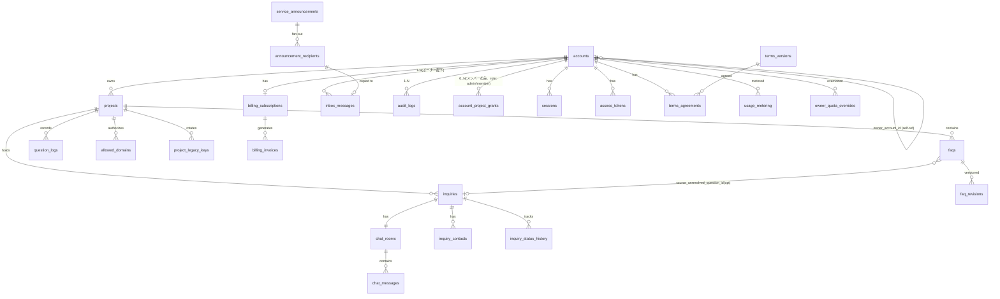

# テーブル定義書(メイン)

## 1. 文書概要

### 1.1 目的

メインシステムのデータベース(Cloudflare D1)に存在するすべてのテーブルについて、カラム / 型 / 制約 / インデックス / 外部キー / コード値 / 保持期間 / 保持起点 / `owner_account_id` 分離方式を一元化する。

### 1.2 対象範囲

- 対象: 利用者向けデータ 32 テーブル(認証 / プロジェクト / FAQ / 案件 / チャット / 通知 / 課金 / お知らせ / 監査 / 規約 等)
- 対象外: 運営者側専用テーブル(`operator_*`, `audit_logs`(ハッシュチェーン構造の運営者部分), `webhook_events`, `operator_approvals`, `accounts_retired` 等)── 02_運営者システム/個別設計書群/04_テーブル定義書.md 参照

### 1.3 版数

| 項目 | 値 |
|---|---|
| 版数 | 1.0 |
| 更新日 | 2026-05-17 |

### 1.4 関連ドキュメント

| ドキュメント名 | 役割 | 参照先 |
|---|---|---|
| 索引 | 11 ドキュメント体系の俯瞰 | [00_索引.md](00_索引.md) |
| 共有概念対応表 | `accounts.contract_status` / オーナーユーザーモデルなど | [../../共有/共有概念.md](../../共有/共有概念.md) |
| API 設計書 | テーブルを操作する API | [03_API設計書.md](03_API設計書.md) |
| 認証・認可設計書 | オーナー境界判定 | [09_認証認可設計書.md](09_認証認可設計書.md) |
| 権限設計書 | `account_project_grants.role`(3 ロール定義) | [05_権限設計書.md](05_権限設計書.md) |
| セキュリティ設計書 | PII 暗号化 / 監査 / 削除モード | [10_セキュリティ設計書.md](10_セキュリティ設計書.md) |
| 課金・請求設計書 | `accounts.contract_status` 正本 / 契約上書きテーブル | [11_課金請求設計書.md](11_課金請求設計書.md) |
| 詳細設計書 | 実装関連の詳細(モジュール構成 / バッチ / マイグレーション)| [../03_詳細設計書.md](../03_詳細設計書.md) |

## 2. テーブル一覧

| # | テーブル名 | 論理名 | 概要 | 主キー | `owner_account_id` | 主管 FR | 保持期間 | 保持起点 | retention_class |
|---|---|---|---|---|---|---|---|---|---|
| 1 | `accounts` | アカウント | オーナー / メンバー両方を 1 表に保持(`is_owner=1` がオーナー) | `id` | 自己参照(オーナー行は `id = owner_account_id`) | FR-015a, FR-333 | 永久(契約存続中)/ 退会後は §7 削除ポリシー | 作成日時 | `billing` |
| 2 | `account_project_grants` | メンバープロジェクト割当 + プロジェクト別ロール | メンバーのプロジェクトアクセスとロール(`admin` / `member`) | `(account_id, project_id)` | (`accounts` 経由) | FR-015, FR-030-035 | 紐づくアカウントに従属 | - | `general` |
| 4 | `sessions` | セッション | セッション管理(複数デバイス対応) | `id` | (`accounts` 経由) | FR-022, FR-332 | 期限切れ後 90 日 | 最終アクティビティ | `general` |
| 5 | `access_tokens` | アクセストークン | 招待 / パスワード再設定 / 再入室等のトークン | `id` | (`accounts` 経由) | FR-004, FR-008 | 使用後 30 日 | 発行日時 | `general` |
| 6 | `projects` | プロジェクト | FAQ プロジェクト / ウィジェット設定 | `id` | あり | FR-030-035 | 永久(プロジェクト存続中) | 作成日時 | `general` |
| 7 | `project_legacy_keys` | レガシー API キー | ウィジェット鍵ローテーション 30 日猶予 | `id` | (`projects` 経由) | - | 30 日 | ローテーション日時 | `general` |
| 8 | `allowed_domains` | 許可ドメイン | ウィジェット埋め込み許可ドメイン | `id` | (`projects` 経由) | FR-150-156 | プロジェクトに従属 | - | `general` |
| 8a | `project_ip_allowlist` | プロジェクト IP 許可リスト | FAQ ウィジェット向け IP 制限(プロジェクト単位 / FR-179・FR-330) | `id` | (`projects` 経由) | FR-179, FR-330 | プロジェクトに従属 | - | `general` |
| 9 | `faqs` | FAQ | FAQ 本体 | `id` | あり | FR-040-048, FR-322 | 永久(FAQ 存続中) | 作成日時 | `general` |
| 10 | `faq_revisions` | FAQ 改訂履歴 | 全文スナップショット 50 件保持 | `id` | (`faqs` 経由) | FR-322 | 永久(版ごと) | 改訂日時 | `general` |
| 11 | `faq_search_fts` | FAQ 全文検索 | FTS5 仮想テーブル(trigram) | (rowid) | (`faqs` 連動) | FR-300 | `faqs` に従属 | - | - |
| 12 | `question_logs` | 質問ログ | エンドユーザーからの質問 / AI 推論 | `id` | あり | FR-003, NFR-601 | 730 日(自動匿名化)| 投稿日時 | `general` |
| 13 | `question_log_faq_refs` | 参照 FAQ | 質問と FAQ の M:N 関係 | `id` | (経由) | - | `question_logs` に従属 | - | `general` |
| 14 | `inquiries` | 案件 | 未解決質問のグループ | `id` | あり | FR-070-079 | 永久(`case_status=closed` 後は NFR-706)| 作成日時 / クローズ日時 | `general` |
| 15 | `inquiry_status_history` | 案件状態履歴 | 状態変更トレース | `id` | (`inquiries` 経由) | FR-077 | `inquiries` に従属 | - | `general` |
| 16 | `inquiry_contacts` | 案件連絡先 | エンドユーザーメール(AES-256-GCM 暗号化 + HMAC) | `id` | (`inquiries` 経由) | FR-079, NFR-319 | `inquiries` に従属(物理削除 / 匿名化)| - | `general` |
| 17 | `chat_rooms` | 個別チャット部屋 | エンドユーザーとの個別チャット(自動クローズ 6 段階) | `id` | (`inquiries` 経由) | FR-080-091 | 730 日(自動匿名化)| クローズ日時と最終投稿日時の遅い方 | `general` |
| 18 | `chat_messages` | チャットメッセージ | 個別チャットの投稿 | `id` | (`chat_rooms` 経由) | FR-080-091 | `chat_rooms` に従属 | - | `general` |
| 19 | `notification_logs` | 通知ログ | メール通知の送信履歴 | `id` | あり | NFR-506, NFR-319 | 1 年 | 送信日時 | `general` |
| 20 | `ai_threshold_persistent_cache` | AI しきい値キャッシュ | 3 階層しきい値の永続キャッシュ | `id` | あり(scope=`owner` 時)| FR-341 | 30 日 | 更新日時 | `general` |
| 21 | `email_suppression_list` | メールサプレスリスト | バウンス・苦情の全契約横断管理 | `id` | (全契約横断)| FR-149b | 永久 | サプレス日時 | `general` |
| 22 | `audit_logs` | 監査ログ | メイン側 API 操作ログ + 監査(運営者側がハッシュチェーン構造の正本)| `id` | あり(`owner_account_id` カラム)| NFR-602a/b/d | retention_class 別(1 / 7 / 5 年)| 操作日時 | `general` / `billing` / `operator_high_priv` |
| 23 | `error_logs` | エラーログ | サーバーエラー記録 | `id` | あり(可)| NFR-704 | 180 日 | 発生日時 | `general` |
| 24 | `billing_subscriptions` | 課金サブスクリプション | Stripe Subscription 連動 | `id` | あり | FR-148 | 永久(契約存続中)| 作成日時 | `billing` |
| 25 | `billing_invoices` | 請求書 | 月次請求書(電子帳簿保存法)| `id` | あり | FR-148, NFR-602b | 7 年 | 発行日時 | `billing` |
| 26 | `usage_metering` | 利用量計測 | 質問数 / FAQ 件数 / チャット部屋数 | `id` | あり | FR-148 | 7 年 | 計測日時 | `billing` |
| 27 | `owner_quota_overrides` | 契約別レート / 予算上書き | 運営者上書き(SCR-093)── レート / 予算ともに本テーブルで統一実装(`resource_kind` で区別)| `id` | あり | IF #5 | 5 年 | 設定日時 | `operator_high_priv` |
| 28 | `service_announcements` | お知らせ(Control Plane) | 運営者発信のお知らせ本体 | `id` | (全契約横断 or 限定)| - | 5 年 | 配信日時 | `operator_high_priv` |
| 29 | `announcement_recipients` | お知らせ受信者 | お知らせ配信先・配信集計・監査 | `id` | あり | - | 5 年 | 配信日時 | `general` |
| 30 | `inbox_messages` | 受信箱(Tenant Plane)| 利用者のお知らせ・通知の既読管理 | `id` | あり | FR-182-192 | 1 年 | 既読日時 | `general` |
| 31 | `withdrawal_requests` | 退会申請 | 退会申請レコード(30 日猶予)| `id` | あり | FR-189 | 7 年 | 申請日時 | `billing` |
| 32 | `terms_versions` | 規約版数 | 規約 / プライバシーポリシーの版 | `version` | (全契約横断)| - | 永久 | 制定日時 | `general` |
| 33 | `terms_agreements` | 規約同意 | 利用者ごとの同意履歴 | `id` | (`accounts` 経由)| - | 7 年 | 同意日時 | `billing` |

### 2.1 retention_class 値の正本定義(`audit_logs.retention_class`)

| 値 | 保持期間 | 用途 | 例 |
|---|---|---|---|
| `general` | **1 年**(NFR-602a)| 業務監査 | 通常の操作 / チャット / FAQ 編集 / ログイン |
| `billing` | **7 年**(NFR-602b、電子帳簿保存法)| 課金・法定保管 | 請求 / 支払 / サブスク / 予算 / `owner.suspend` prefix |
| `operator_high_priv` | **5 年**(NFR-602d、SOX 類似)| 運営者高権限操作 | 復元 / 契約停止 / 物理削除 / AI 変更 / レート上書き / 鍵ローテーション |

詳細は [10_セキュリティ設計書.md §7](10_セキュリティ設計書.md)(運営者側 §7 が正本)を参照。

### 2.2 主要関係性(§7.3 から移管)

| 関係 | 型 | 説明 |
|---|---|---|
| オーナー ↔ アカウント | 1:N | 契約削除時にアカウントも削除対象(オーナー行: `is_owner=1`) |
| 契約 ↔ プロジェクト | 1:N | - |
| プロジェクト ↔ FAQ | 1:N | FAQ はプロジェクトに帰属 |
| プロジェクト ↔ 未解決質問 | 1:N | - |
| 未解決質問 ↔ チャット部屋 | 1:1 | - |
| チャット部屋 ↔ メッセージ | 1:N | - |
| 未解決質問 ↔ FAQ | 0..1:N | `faqs.source_unresolved_question_id` で参照可 |
| お知らせ ↔ 受信箱 | 1:N | `service_announcements` → `announcement_recipients` → `inbox_messages` の fan-out |

### 2.3 メンバー権限保持方式(設計判断履歴、§7.1.1 から移管)

採用方式は **プロジェクト単位ロール方式**(`account_project_grants.role`)。`(account_id, project_id)` 複合 PK + `role` 列(`admin` / `member`) + `granted_at` / `granted_by` 保持で行レベル監査を維持。

オーナー(`accounts.is_owner=1`)は `account_project_grants` に行を持たず、全プロジェクトの暗黙の `admin` ロール相当として扱う。MVP 前期に検討した「個別権限フラグ方式(`account_permissions` 別テーブル + `permission_kind` 5 値)」は、運用パターンが固定的なため UI / 認可ロジック双方の複雑さに見合わず廃止した。

## 3. テーブル詳細

### 3.1 `accounts`(アカウント)

| 項目 | 内容 |
|---|---|
| テーブル名 | `accounts` |
| 論理名 | アカウント |
| 概要 | オーナー(`is_owner=1`)とメンバー(`is_owner=0`)の両方を 1 表に保持 |
| 主キー | `id`(TEXT, ULID) |
| 設計判断 | オーナー行は `owner_account_id = id` で自己参照。**`is_owner=1` 行は `account_project_grants` に行を持たない(オーナーは全プロジェクトの暗黙の `admin` 相当)**|

#### DDL(詳細設計書 行 5827-5859 由来)

```sql
CREATE TABLE accounts (
  id                       TEXT PRIMARY KEY,
  owner_account_id         TEXT NOT NULL REFERENCES accounts(id) ON DELETE CASCADE,
  email_encrypted          TEXT NOT NULL,
  email_hmac               TEXT NOT NULL,
  password_hash            TEXT,
  name                     TEXT,
  role                     TEXT NOT NULL CHECK (role IN ('admin','service_operator','end_user')),
  is_owner                 INTEGER NOT NULL DEFAULT 0 CHECK (is_owner IN (0,1)),
  status                   TEXT NOT NULL DEFAULT 'pending_verification'
                           CHECK (status IN ('pending_verification','pending_activation','active')),
  contract_status          TEXT NOT NULL DEFAULT 'active'
                           CHECK (contract_status IN ('active','suspended','deleted_pending','deleted')),
  notification_preferences TEXT NOT NULL DEFAULT '{}',
  last_login_at            TEXT,
  email_verified_at        TEXT,
  created_at               TEXT NOT NULL,
  deleted_at               TEXT,
  CHECK ((is_owner = 1 AND owner_account_id = id) OR (is_owner = 0 AND owner_account_id <> id))
);
CREATE UNIQUE INDEX uq_accounts_owner_email ON accounts(owner_account_id, email_hmac);
CREATE INDEX idx_accounts_email_hmac     ON accounts(email_hmac);
CREATE INDEX idx_accounts_owner_role_status ON accounts(owner_account_id, role, status);
CREATE INDEX idx_accounts_is_owner       ON accounts(is_owner) WHERE is_owner = 1;
```

#### コード値: `role` / `is_owner` / `status` / `contract_status`

| カラム | 値 | 説明 |
|---|---|---|
| `role` | `admin` | 利用者管理者 |
| `role` | `service_operator` | 運営者(運営者画面アクセス用、メインでも `accounts` に格納)|
| `role` | `end_user` | エンドユーザー(ウィジェット利用者)|
| `is_owner` | `0` | メンバー |
| `is_owner` | `1` | オーナー(契約あたり 1 つ)|
| `status` | `pending_verification` | メール未確認 |
| `status` | `pending_activation` | 招待中(初回パスワード未設定)|
| `status` | `active` | 有効 |
| `contract_status` | `active` | 有効(オーナー行でのみ意味を持つ。**共有概念正本**)|
| `contract_status` | `suspended` | サスペンション中 |
| `contract_status` | `deleted_pending` | 退会申請中(30 日猶予)|
| `contract_status` | `deleted` | 削除済み |

詳細状態遷移は [11_課金請求設計書.md §4](11_課金請求設計書.md) を正本とする。

### 3.2 `account_project_grants`(メンバープロジェクト割当 + プロジェクト別ロール)

メンバー(`accounts.is_owner=0`)に対し、プロジェクトごとに `admin`(プロジェクト管理者) / `member`(メンバー)のロールを付与する。オーナー(`is_owner=1`)は本テーブルに行を持たず、全プロジェクトの暗黙の `admin` 相当として扱う(オーナー判定が認可フロー先頭で bypass される)。

**不変条件(FR-015d / FR-339)**: メンバー行(`is_owner=0`)は本テーブルに **常に最低 1 行** を持つ。割当が 0 件になる操作(招待・ロール一括上書き・離脱・最後の割当の取消)はアプリ層で `E-BIZ-MEMBER-NO-GRANT` として拒否する。プロジェクト削除起因で割当が 0 件になるメンバーは同一トランザクション内で `accounts` 行ごと物理削除する(下記「プロジェクト削除時の孤立メンバー処理」)ことで不変条件を維持する。DB レベルでは部分インデックスや CHECK 制約で表現できないため、アプリ層のトランザクション境界で担保する(差分カウントは `account_project_grants` の現件数 + 操作差分から計算)。

#### DDL

```sql
CREATE TABLE account_project_grants (
  account_id  TEXT NOT NULL REFERENCES accounts(id) ON DELETE CASCADE,
  project_id  TEXT NOT NULL REFERENCES projects(id) ON DELETE CASCADE,
  role        TEXT NOT NULL CHECK (role IN ('admin','member')),
  granted_at  TEXT NOT NULL,
  granted_by  TEXT NOT NULL REFERENCES accounts(id),
  PRIMARY KEY (account_id, project_id)
);
CREATE INDEX idx_account_project_grants_project ON account_project_grants(project_id);
-- プロジェクト管理者の高速検索用(critical 通知宛先解決でも使用)
CREATE INDEX idx_account_project_grants_role_admin
  ON account_project_grants(account_id) WHERE role = 'admin';
```

#### コード値: `role` 2 値

| 値 | 表示名(UI)| 該当プロジェクト範囲で可能な操作 |
|---|---|---|
| `admin` | プロジェクト管理者 | FAQ 管理 / 個別チャット対応 / ログ参照 / ユーザー管理(該当プロジェクトへの招待・離脱・ロール変更)|
| `member` | メンバー | FAQ 管理 / 個別チャット対応 / ログ参照 |

詳細は [05_権限設計書.md §3](05_権限設計書.md) を正本とする。

#### プロジェクト削除時の孤立メンバー処理(アプリ層)

DDL の `ON DELETE CASCADE` は `account_project_grants` の削除止まりで、`accounts` 本体までは連動しない(`account_project_grants → accounts` は逆方向の依存)。そのため次の処理はアプリ層のトランザクション内で明示する:

1. `DELETE FROM account_project_grants WHERE project_id = ?`
2. 削除後に「他プロジェクト割当が 0 件かつ `is_owner=0`」となったメンバー `accounts` 行を抽出して `DELETE FROM accounts WHERE id IN (...)` および全セッション失効

オーナーは対象外(`is_owner=1` は常に存続)。本処理は不変条件「メンバーは常に最低 1 件の割当を持つ」(FR-015d)を維持するために必須であり、招待・離脱の各 API では事前検査により割当 0 件化を拒否するため、孤立メンバー cleanup が走るのはプロジェクト削除経路のみとなる。詳細は [DD02_プロジェクト・FAQ管理.md](../03_詳細設計/DD02_プロジェクト・FAQ管理.md) を参照。

### 3.4 `sessions`(セッション)

#### DDL(行 5894-5905)

```sql
CREATE TABLE sessions (
  id              TEXT PRIMARY KEY,
  account_id      TEXT NOT NULL REFERENCES accounts(id) ON DELETE CASCADE,
  ip_address      TEXT NOT NULL,
  user_agent      TEXT,
  created_at      TEXT NOT NULL,
  last_accessed_at TEXT NOT NULL,
  expires_at      TEXT NOT NULL,
  revoked_at      TEXT
);
CREATE INDEX idx_sessions_account ON sessions(account_id) WHERE revoked_at IS NULL;
CREATE INDEX idx_sessions_expires ON sessions(expires_at) WHERE revoked_at IS NULL;
```

### 3.5 `access_tokens`(アクセストークン)

#### DDL(行 5908-5920)

```sql
CREATE TABLE access_tokens (
  id          TEXT PRIMARY KEY,
  account_id  TEXT REFERENCES accounts(id) ON DELETE CASCADE,
  token_hash  TEXT NOT NULL,
  purpose     TEXT NOT NULL CHECK (purpose IN ('email_verify','password_reset','activation','reentry')),
  meta        TEXT,
  created_at  TEXT NOT NULL,
  expires_at  TEXT NOT NULL,
  used_at     TEXT
);
CREATE UNIQUE INDEX uq_access_tokens_hash ON access_tokens(token_hash);
CREATE INDEX idx_access_tokens_expires ON access_tokens(expires_at) WHERE used_at IS NULL;
```

#### コード値: `purpose`

| 値 | 用途 |
|---|---|
| `email_verify` | メール確認 |
| `password_reset` | パスワード再設定 |
| `activation` | 招待受諾(初回パスワード設定)|
| `reentry` | エンドユーザー再入室 |

### 3.6 `projects`(プロジェクト)

#### DDL(行 5923-5944)

```sql
CREATE TABLE projects (
  id                              TEXT PRIMARY KEY,
  owner_account_id                TEXT NOT NULL REFERENCES accounts(id) ON DELETE CASCADE,
  name                            TEXT NOT NULL CHECK (length(name) BETWEEN 1 AND 100),
  description                     TEXT,
  status                          TEXT NOT NULL DEFAULT 'active' CHECK (status IN ('active','deleted')),
  widget_public_key               TEXT NOT NULL UNIQUE,
  widget_public_key_expires_at    TEXT NOT NULL,
  contact_email                   TEXT,
  contact_email_verified_at       TEXT,
  settings                        TEXT NOT NULL DEFAULT '{}',
  created_at                      TEXT NOT NULL,
  updated_at                      TEXT NOT NULL,
  deleted_at                      TEXT,
  CHECK (contact_email_verified_at IS NULL OR contact_email IS NOT NULL)
);
CREATE INDEX idx_projects_owner_status ON projects(owner_account_id, status);
CREATE INDEX idx_projects_widget_key   ON projects(widget_public_key);
```

### 3.7 `project_legacy_keys`(レガシー API キー)

#### DDL(行 5947-5954)

```sql
CREATE TABLE project_legacy_keys (
  id           TEXT PRIMARY KEY,
  project_id   TEXT NOT NULL REFERENCES projects(id) ON DELETE CASCADE,
  public_key   TEXT NOT NULL,
  grace_until  TEXT NOT NULL,
  created_at   TEXT NOT NULL DEFAULT (datetime('now'))
);
CREATE INDEX idx_legacy_keys_key ON project_legacy_keys(public_key);
```

### 3.8 `allowed_domains`(許可ドメイン)

#### DDL(行 5957-5963)

```sql
CREATE TABLE allowed_domains (
  id          TEXT PRIMARY KEY,
  project_id  TEXT NOT NULL REFERENCES projects(id) ON DELETE CASCADE,
  domain      TEXT NOT NULL,
  created_at  TEXT NOT NULL
);
CREATE UNIQUE INDEX uq_allowed_domains_project_domain ON allowed_domains(project_id, domain);
```

### 3.8a `project_ip_allowlist`(プロジェクト IP 許可リスト)

FAQ ウィジェット(エンドユーザーアクセス)に対する IP 制限を CIDR で保持する。プロジェクト単位設定。空 = 制限なし。管理画面 API は本テーブルの参照対象外(FR-179 / FR-330)。

#### DDL

```sql
CREATE TABLE project_ip_allowlist (
  id          TEXT PRIMARY KEY,
  project_id  TEXT NOT NULL REFERENCES projects(id) ON DELETE CASCADE,
  cidr        TEXT NOT NULL,                                                    -- IPv4 / IPv6 CIDR(例: 203.0.113.0/24、2001:db8::/32)
  family      TEXT NOT NULL CHECK (family IN ('ipv4','ipv6')),                  -- 評価高速化用に family を冗長化
  note        TEXT,                                                             -- 任意メモ(SCR-010-M1 では未公開、将来用)
  created_at  TEXT NOT NULL DEFAULT (datetime('now')),
  updated_at  TEXT NOT NULL DEFAULT (datetime('now'))
);
CREATE UNIQUE INDEX uq_project_ip_allowlist_project_cidr ON project_ip_allowlist(project_id, cidr);
CREATE INDEX idx_project_ip_allowlist_project_family    ON project_ip_allowlist(project_id, family);
```

#### 制約・評価

- 1 プロジェクトあたり最大 100 行(アプリ層で検証)
- 同一プロジェクト内の重複 CIDR は UNIQUE 制約で拒否
- ウィジェット API ハンドラは `(project_id, family)` インデックスを用いてキャッシュ生成し、判定はメモリ上の LPM(longest-prefix-match)で 5 分 TTL キャッシュ
- 監査ログ: `audit_logs.action` に `project.ip_allowlist.update` を記録(変更前後の CIDR セット差分を `metadata` に格納)

### 3.9 `faqs`(FAQ)

#### DDL(行 5966-5987)

```sql
CREATE TABLE faqs (
  id                                TEXT PRIMARY KEY,
  owner_account_id                  TEXT NOT NULL REFERENCES accounts(id) ON DELETE CASCADE,
  project_id                        TEXT NOT NULL REFERENCES projects(id) ON DELETE CASCADE,
  title                             TEXT NOT NULL CHECK (length(title) BETWEEN 1 AND 200),
  body                              TEXT NOT NULL CHECK (length(body) BETWEEN 1 AND 10000),
  category                          TEXT,
  status                            TEXT NOT NULL DEFAULT 'draft'
                                    CHECK (status IN ('draft','published','hidden','deleted')),
  version                           INTEGER NOT NULL DEFAULT 1,
  tags                              TEXT,
  source_unresolved_question_id     TEXT REFERENCES inquiries(id),
  created_by                        TEXT NOT NULL REFERENCES accounts(id),
  updated_by                        TEXT NOT NULL REFERENCES accounts(id),
  created_at                        TEXT NOT NULL,
  updated_at                        TEXT NOT NULL,
  deleted_at                        TEXT
);
CREATE INDEX idx_faqs_owner_project    ON faqs(owner_account_id, project_id);
CREATE INDEX idx_faqs_project_status   ON faqs(project_id, status);
CREATE INDEX idx_faqs_source_inquiry   ON faqs(source_unresolved_question_id);
CREATE INDEX idx_faqs_category         ON faqs(project_id, category) WHERE category IS NOT NULL;
```

#### コード値: `status`(状態遷移は §8 参照)

| 値 | 説明 |
|---|---|
| `draft` | 下書き |
| `published` | 公開中 |
| `hidden` | 非公開 |
| `deleted` | 論理削除(復元は **運営者のみ** = IF #4)|

### 3.10 `faq_revisions`(FAQ 改訂履歴)

#### DDL(行 5992-6008)

```sql
CREATE TABLE faq_revisions (
  id              TEXT PRIMARY KEY,
  faq_id          TEXT NOT NULL REFERENCES faqs(id) ON DELETE CASCADE,
  version         INTEGER NOT NULL,
  title           TEXT NOT NULL,
  body            TEXT NOT NULL,
  category        TEXT,
  tags            TEXT,
  status_snapshot TEXT NOT NULL CHECK (status_snapshot IN ('draft','published','hidden','deleted')),
  source          TEXT NOT NULL DEFAULT 'manual' CHECK (source IN ('manual','import')),
  created_at      TEXT NOT NULL,
  created_by      TEXT NOT NULL REFERENCES accounts(id)
);
CREATE INDEX idx_faq_revisions_faq    ON faq_revisions(faq_id, version DESC);
CREATE INDEX idx_faq_revisions_source ON faq_revisions(source);
```

### 3.11 `faq_search_fts`(FAQ 全文検索、FTS5 仮想テーブル)

#### DDL(行 6011-6017)

```sql
CREATE VIRTUAL TABLE faq_search_fts USING fts5(
  title, body, category, tags,
  content='faqs',
  content_rowid='rowid',
  tokenize='trigram'
);
```

`faqs` テーブルへの INSERT / UPDATE / DELETE トリガで自動同期。詳細は詳細設計 §9.9 参照。

### 3.12 `question_logs`(質問ログ)

#### DDL(行 6020-6042)

```sql
CREATE TABLE question_logs (
  id                     TEXT PRIMARY KEY,
  owner_account_id       TEXT NOT NULL REFERENCES accounts(id),
  project_id             TEXT NOT NULL REFERENCES projects(id),
  user_question          TEXT NOT NULL CHECK (length(user_question) BETWEEN 1 AND 2000),
  ai_response            TEXT,
  is_resolved            INTEGER NOT NULL DEFAULT 0,
  metering_billable      INTEGER NOT NULL DEFAULT 0,
  confidence_score       REAL,
  relevance_score        REAL,
  ai_model               TEXT,
  ai_token_count_input   INTEGER,
  ai_token_count_output  INTEGER,
  result_type            TEXT CHECK (result_type IN ('answered','unanswered','error')),
  result_reason_code     TEXT,
  pii_masked             INTEGER NOT NULL DEFAULT 0,
  session_id             TEXT,
  ip_address             TEXT,
  created_at             TEXT NOT NULL
);
CREATE INDEX idx_qlog_owner_created           ON question_logs(owner_account_id, created_at DESC);
CREATE INDEX idx_qlog_project_billable_created ON question_logs(project_id, metering_billable, created_at DESC);
```

### 3.13 `inquiries`(案件)

#### DDL(行 6053-6074)── 詳細設計の `case_status` CHECK 制約欠落を補正

```sql
CREATE TABLE inquiries (
  id                       TEXT PRIMARY KEY,
  owner_account_id         TEXT NOT NULL REFERENCES accounts(id) ON DELETE CASCADE,
  project_id               TEXT NOT NULL REFERENCES projects(id) ON DELETE CASCADE,
  inquiry_code             TEXT NOT NULL,
  question_log_id          TEXT REFERENCES question_logs(id),
  user_question            TEXT NOT NULL,
  case_status              TEXT NOT NULL DEFAULT 'open'
                           CHECK (case_status IN ('open','resolved','closed','faq_registered')),  -- ★ 詳細設計欠落分の補正
  faq_candidate_status     TEXT NOT NULL DEFAULT 'none'
                           CHECK (faq_candidate_status IN ('none','candidate','drafted','registered')),
  faq_draft                TEXT,
  assignee_account_id      TEXT REFERENCES accounts(id) ON DELETE SET NULL,
  created_at               TEXT NOT NULL,
  updated_at               TEXT NOT NULL,
  closed_at                TEXT,
  deleted_at               TEXT
);
CREATE INDEX idx_inquiries_contract_status_created ON inquiries(owner_account_id, case_status, created_at DESC);
CREATE INDEX idx_inquiries_project_status          ON inquiries(project_id, case_status);
CREATE INDEX idx_inquiries_assignee                ON inquiries(assignee_account_id) WHERE case_status != 'closed';
CREATE UNIQUE INDEX uq_inquiries_code              ON inquiries(inquiry_code);
```

#### コード値: `case_status`(共有概念正本 = FR-079 自動 `closed` 遷移禁止)

| 値 | 説明 | 遷移条件 |
|---|---|---|
| `open` | 未対応 | 新規作成時 |
| `resolved` | 解決済み | admin の「解決済み」操作のみ |
| `closed` | 対応不要終了 | **admin の明示操作のみ。自動 retention で `closed` に遷移させない(FR-079)** |
| `faq_registered` | FAQ 化済み | admin の「FAQ 登録完了」操作 |

詳細遷移は §8.2 参照。

### 3.14 `inquiry_status_history`(案件状態履歴)

#### DDL(行 6076-6086)

```sql
CREATE TABLE inquiry_status_history (
  id           TEXT PRIMARY KEY,
  inquiry_id   TEXT NOT NULL REFERENCES inquiries(id) ON DELETE CASCADE,
  from_status  TEXT NOT NULL,
  to_status    TEXT NOT NULL,
  reason       TEXT,
  changed_by   TEXT REFERENCES accounts(id),
  changed_at   TEXT NOT NULL
);
CREATE INDEX idx_isth_inquiry_changed ON inquiry_status_history(inquiry_id, changed_at DESC);
```

### 3.15 `inquiry_contacts`(エンドユーザー連絡先、PII 暗号化)

#### DDL(行 6089-6100)

```sql
CREATE TABLE inquiry_contacts (
  id                TEXT PRIMARY KEY,
  inquiry_id        TEXT NOT NULL REFERENCES inquiries(id) ON DELETE CASCADE,
  email_encrypted   TEXT,
  email_hmac        TEXT,
  display_name      TEXT,
  verified          INTEGER NOT NULL DEFAULT 0,
  notify_enabled    INTEGER NOT NULL DEFAULT 1,
  created_at        TEXT NOT NULL DEFAULT (datetime('now'))
);
CREATE INDEX idx_inquiry_contacts_email_hmac ON inquiry_contacts(email_hmac);
CREATE UNIQUE INDEX uq_inquiry_contacts_inquiry ON inquiry_contacts(inquiry_id);
```

`email_encrypted` は AES-256-GCM(オーナー派生鍵)で暗号化。`email_hmac` は HMAC-SHA256 で検索用。詳細は [10_セキュリティ設計書.md §3](10_セキュリティ設計書.md) 参照。

### 3.16 `chat_rooms`(個別チャット部屋)

#### DDL(行 6103-6121)

```sql
CREATE TABLE chat_rooms (
  id                        TEXT PRIMARY KEY,
  inquiry_id                TEXT NOT NULL REFERENCES inquiries(id) ON DELETE CASCADE,
  room_status               TEXT NOT NULL DEFAULT 'open' CHECK (room_status IN ('open','closed')),
  reminder_state            TEXT NOT NULL DEFAULT 'active'
                            CHECK (reminder_state IN ('active','stage1_pending_admin','stage2_user_check_sent',
                                                       'stage3_user_no_response','stage4_final_check',
                                                       'stage5_final_no_response','stage6_auto_closed')),
  last_message_at           TEXT,
  last_message_actor_type   TEXT,
  reminder_state_changed_at TEXT,
  created_at                TEXT NOT NULL,
  closed_at                 TEXT
);
CREATE INDEX idx_chat_rooms_inquiry        ON chat_rooms(inquiry_id);
CREATE INDEX idx_chat_rooms_open_reminder  ON chat_rooms(reminder_state, last_message_at) WHERE room_status = 'open';
```

#### コード値: `reminder_state`(自動クローズ 6 段階)

詳細は §8.3 参照。

### 3.17 `chat_messages`(チャットメッセージ)

#### DDL(行 6124-6132)

```sql
CREATE TABLE chat_messages (
  id            TEXT PRIMARY KEY,
  chat_room_id  TEXT NOT NULL REFERENCES chat_rooms(id) ON DELETE CASCADE,
  actor_type    TEXT NOT NULL CHECK (actor_type IN ('admin','end_user','system')),
  actor_id      TEXT REFERENCES accounts(id) ON DELETE SET NULL,
  content       TEXT NOT NULL CHECK (length(content) BETWEEN 1 AND 2000),
  created_at    TEXT NOT NULL
);
CREATE INDEX idx_chat_messages_room_created ON chat_messages(chat_room_id, created_at);
```

### 3.18 `notification_logs`(通知ログ)

#### DDL(行 6241-6260)

```sql
CREATE TABLE notification_logs (
  id                    TEXT PRIMARY KEY,
  owner_account_id      TEXT NOT NULL,
  inquiry_id            TEXT,
  chat_message_id       TEXT,
  recipient_email_hmac  TEXT,
  notification_type     TEXT NOT NULL,
  delivery_state        TEXT NOT NULL
                        CHECK (delivery_state IN ('queued','sending','sent','delivered',
                                                   'failed','bounced','complained','suppressed')),
  message_id            TEXT,
  attempt_count         INTEGER NOT NULL DEFAULT 0,
  sent_at               TEXT,
  delivered_at          TEXT,
  failed_at             TEXT,
  fail_reason           TEXT,
  created_at            TEXT NOT NULL
);
CREATE INDEX idx_nlog_owner_created ON notification_logs(owner_account_id, created_at DESC);
CREATE INDEX idx_nlog_message_id    ON notification_logs(message_id);
CREATE INDEX idx_nlog_state         ON notification_logs(delivery_state);
```

#### コード値: `delivery_state`(状態遷移は §8.4 参照)

| 値 | 説明 |
|---|---|
| `queued` | Queue 投入済み |
| `sending` | 送信中 |
| `sent` | 送信成功 |
| `delivered` | 配信成功(Resend Webhook 経由)|
| `failed` | 失敗(当方再送対象、最大 3 回)|
| `bounced` | バウンス(ハードまたはソフト 5 連続)|
| `complained` | スパム報告 |
| `suppressed` | サプレスリスト追加済み(終了状態)|

### 3.19 `ai_threshold_persistent_cache`(AI しきい値キャッシュ)

#### DDL(行 6323-6335)

```sql
CREATE TABLE ai_threshold_persistent_cache (
  id                      TEXT PRIMARY KEY,
  owner_account_id        TEXT,
  project_id              TEXT,
  scope                   TEXT NOT NULL CHECK (scope IN ('global','owner','project')),
  confidence_threshold    REAL NOT NULL,
  relevance_threshold     REAL NOT NULL,
  version                 INTEGER NOT NULL,
  received_at             TEXT NOT NULL,
  updated_at              TEXT NOT NULL
);
CREATE UNIQUE INDEX uq_ai_threshold_scope ON ai_threshold_persistent_cache(scope, COALESCE(owner_account_id, ''), COALESCE(project_id, ''));
```

3 階層しきい値: `global` / `owner` / `project`。詳細は [03_API設計書.md §5.5.5](03_API設計書.md)(IF #6)参照。

### 3.20 `email_suppression_list`(メールサプレスリスト、全契約横断)

#### DDL(行 6289-6298)

```sql
CREATE TABLE email_suppression_list (
  id            TEXT PRIMARY KEY,
  email_hmac    TEXT NOT NULL UNIQUE,
  reason        TEXT NOT NULL CHECK (reason IN ('bounced_hard','bounced_soft_5x','complained','manual')),
  is_permanent  INTEGER NOT NULL DEFAULT 1,
  created_at    TEXT NOT NULL,
  released_at   TEXT
);
CREATE INDEX idx_suppression_permanent ON email_suppression_list(is_permanent, email_hmac);
```

**全契約横断テーブル**(R-003 共通ドメインレピュテーション保護対策)。[10_セキュリティ設計書.md §11](10_セキュリティ設計書.md) 参照。

### 3.21 `audit_logs`(監査ログ、メイン側)

#### DDL(行 6266-6287)

```sql
CREATE TABLE audit_logs (
  id                 TEXT PRIMARY KEY,
  owner_account_id   TEXT,
  actor_account_id   TEXT,
  actor_role         TEXT,
  action             TEXT NOT NULL,
  target_type        TEXT,
  target_id          TEXT,
  ip_address_masked  TEXT,
  user_agent         TEXT,
  metadata           TEXT,
  retention_class    TEXT NOT NULL DEFAULT 'general'
                     CHECK (retention_class IN ('general','billing','operator_high_priv')),
  prev_hash          TEXT,
  current_hash       TEXT NOT NULL,
  tombstone          INTEGER NOT NULL DEFAULT 0,
  created_at         TEXT NOT NULL
);
CREATE INDEX idx_audit_owner_action_created ON audit_logs(owner_account_id, action, created_at DESC) WHERE tombstone = 0;
CREATE INDEX idx_audit_retention_created    ON audit_logs(retention_class, created_at);
```

- ハッシュチェーン構造の正本(運営者側 §7)。`prev_hash` / `current_hash` で連結
- 3 区分保持(`general` 1y / `billing` 7y / `operator_high_priv` 5y)
- 保持期間経過後は **tombstone 方式**(本文を物理削除し、`log_id` / `prev_hash` / `current_hash` / `deleted_at` を保持してチェーン破断を防ぐ)

### 3.22 `error_logs`(エラーログ)

#### DDL(行 9052-6061、詳細設計内記載)

```sql
CREATE TABLE error_logs (
  id                TEXT PRIMARY KEY,
  owner_account_id  TEXT,
  account_id        TEXT,
  url               TEXT,
  error_type        TEXT,
  stack             TEXT,
  occurred_at       TEXT NOT NULL
);
CREATE INDEX idx_error_logs_owner_occurred ON error_logs(owner_account_id, occurred_at DESC);
```

PII / トークン / カード情報を記録禁止(FR-114、エンドユーザー入力は先頭 100 文字 + ハッシュのみ)。

### 3.23 `billing_subscriptions`(課金サブスクリプション)

#### DDL(行 6138-6154)

```sql
CREATE TABLE billing_subscriptions (
  id                      TEXT PRIMARY KEY,
  owner_account_id        TEXT NOT NULL REFERENCES accounts(id) ON DELETE CASCADE,
  stripe_subscription_id  TEXT UNIQUE,
  status                  TEXT NOT NULL
                          CHECK (status IN ('trialing','active','past_due','canceled','unpaid','incomplete')),
  plan_id                 TEXT NOT NULL,
  trial_started_at        TEXT,
  trial_ends_at           TEXT,
  current_period_start    TEXT,
  current_period_end      TEXT,
  cancel_at               TEXT,
  created_at              TEXT NOT NULL,
  updated_at              TEXT NOT NULL
);
CREATE INDEX idx_billing_subs_owner  ON billing_subscriptions(owner_account_id);
CREATE INDEX idx_billing_subs_status ON billing_subscriptions(status);
```

### 3.24 `billing_invoices`(請求書、7 年保持)

#### DDL(行 6156-6174)

```sql
CREATE TABLE billing_invoices (
  id                  TEXT PRIMARY KEY,
  owner_account_id    TEXT NOT NULL REFERENCES accounts(id),
  billing_year_month  TEXT NOT NULL,
  status              TEXT NOT NULL CHECK (status IN ('draft','issued','paid','past_due','refunded','void')),
  amount_total        INTEGER NOT NULL,
  amount_tax          INTEGER NOT NULL DEFAULT 0,
  currency            TEXT NOT NULL DEFAULT 'JPY',
  stripe_invoice_id   TEXT UNIQUE,
  pdf_r2_key          TEXT,
  issued_at           TEXT,
  paid_at             TEXT,
  refunded_at         TEXT,
  created_at          TEXT NOT NULL
);
CREATE UNIQUE INDEX uq_billing_invoices_owner_month ON billing_invoices(owner_account_id, billing_year_month);
CREATE INDEX idx_billing_invoices_status            ON billing_invoices(status);
```

### 3.25 `usage_metering`(利用量計測)

#### DDL(行 6176-6190)

```sql
CREATE TABLE usage_metering (
  id                  TEXT PRIMARY KEY,
  owner_account_id    TEXT NOT NULL REFERENCES accounts(id) ON DELETE CASCADE,
  billing_year_month  TEXT NOT NULL,
  question_count      INTEGER NOT NULL DEFAULT 0,
  faq_count_snapshot  INTEGER NOT NULL DEFAULT 0,
  chat_room_count     INTEGER NOT NULL DEFAULT 0,
  ai_token_input      INTEGER NOT NULL DEFAULT 0,
  ai_token_output     INTEGER NOT NULL DEFAULT 0,
  ai_cost_yen         INTEGER NOT NULL DEFAULT 0,
  finalized_at        TEXT,
  updated_at          TEXT NOT NULL
);
CREATE UNIQUE INDEX uq_usage_metering_owner_month ON usage_metering(owner_account_id, billing_year_month);
```

### 3.26 `owner_quota_overrides`(契約別レート / 予算上書き、統一実装)

**重要**: `rate_limit_overrides` / `budget_limit_overrides` は別テーブルではなく、本テーブル + `resource_kind` 値で統一実装される。

#### DDL(行 6337-6350)

```sql
CREATE TABLE owner_quota_overrides (
  id            TEXT PRIMARY KEY,
  owner_account_id TEXT NOT NULL REFERENCES accounts(id) ON DELETE CASCADE,
  resource_kind TEXT NOT NULL
                CHECK (resource_kind IN ('widget_ask_per_min','widget_inquiry_per_min','widget_chat_per_min',
                                          'email_per_hour','admin_api_per_min')),
  threshold     INTEGER NOT NULL,
  window_sec    INTEGER NOT NULL,
  valid_until   TEXT NOT NULL,
  reason        TEXT,
  created_by    TEXT,
  created_at    TEXT NOT NULL
);
CREATE INDEX idx_tqo_owner_kind ON owner_quota_overrides(owner_account_id, resource_kind, valid_until);
```

#### コード値: `resource_kind`

| 値 | 用途 |
|---|---|
| `widget_ask_per_min` | ウィジェット質問レート |
| `widget_inquiry_per_min` | ウィジェット未解決質問送信レート |
| `widget_chat_per_min` | ウィジェットチャット投稿レート |
| `email_per_hour` | メール送信レート |
| `admin_api_per_min` | 管理 API レート |

詳細は [11_課金請求設計書.md §3](11_課金請求設計書.md) / [05_権限設計書.md §7](05_権限設計書.md) 参照。

### 3.27 `service_announcements`(お知らせ Control Plane)

#### DDL(行 6196-6208)

```sql
CREATE TABLE service_announcements (
  id                          TEXT PRIMARY KEY,
  title                       TEXT NOT NULL CHECK (length(title) BETWEEN 1 AND 200),
  body_html                   TEXT NOT NULL,
  importance                  TEXT NOT NULL CHECK (importance IN ('low','normal','high','critical')),
  audience_owner_account_ids  TEXT,
  published_at                TEXT NOT NULL,
  retracted_at                TEXT,
  created_by                  TEXT NOT NULL,
  created_at                  TEXT NOT NULL
);
CREATE INDEX idx_announcements_published ON service_announcements(published_at DESC) WHERE retracted_at IS NULL;
```

`importance` 4 値は共有概念正本(`critical` はメール強制送信)。[07_メッセージ一覧.md §2.4](07_メッセージ一覧.md) 参照。

### 3.28 `announcement_recipients`(お知らせ配信先 Control Plane)

#### DDL(行 6210-6220)

```sql
CREATE TABLE announcement_recipients (
  id                TEXT PRIMARY KEY,
  announcement_id   TEXT NOT NULL REFERENCES service_announcements(id) ON DELETE CASCADE,
  owner_account_id  TEXT NOT NULL,
  account_id        TEXT NOT NULL,
  sent_at           TEXT NOT NULL,
  delivery_status   TEXT NOT NULL CHECK (delivery_status IN ('pending','delivered','failed')),
  read_at           TEXT
);
CREATE INDEX idx_ar_announcement   ON announcement_recipients(announcement_id);
CREATE INDEX idx_ar_owner_account  ON announcement_recipients(owner_account_id, account_id);
```

### 3.29 `inbox_messages`(受信箱 Tenant Plane)

#### DDL(行 6222-6239)

```sql
CREATE TABLE inbox_messages (
  id                    TEXT PRIMARY KEY,
  owner_account_id      TEXT NOT NULL REFERENCES accounts(id) ON DELETE CASCADE,
  recipient_account_id  TEXT NOT NULL REFERENCES accounts(id) ON DELETE CASCADE,
  category              TEXT NOT NULL CHECK (category IN ('billing','announcement','system')),
  priority              TEXT NOT NULL CHECK (priority IN ('low','normal','high','critical')),
  title                 TEXT NOT NULL CHECK (length(title) BETWEEN 1 AND 200),
  body_html             TEXT NOT NULL,
  source_kind           TEXT,
  source_id             TEXT,
  dedup_key             TEXT NOT NULL,
  read_at               TEXT,
  hidden_at             TEXT,
  created_at            TEXT NOT NULL
);
CREATE INDEX idx_inbox_owner_account_unread ON inbox_messages(owner_account_id, recipient_account_id, read_at, created_at DESC);
CREATE INDEX idx_inbox_dedup                ON inbox_messages(owner_account_id, dedup_key, created_at);
```

#### お知らせ二層構成

- **Control Plane**(`service_announcements` / `announcement_recipients`): 運営者作成お知らせ本体 + 配信集計・監査
- **Tenant Plane**(`inbox_messages`): 利用者管理者の受信箱(既読管理)
- `announcement` カテゴリは Control → Tenant の二層経由。`billing` / `system` は `inbox_messages` 直接生成
- 重複生成対策: `(owner_account_id, event_kind, dedup_key)` で 60 分以内は 1 件に集約

### 3.30 `withdrawal_requests`(退会申請)

#### DDL(行 6352-6361)

```sql
CREATE TABLE withdrawal_requests (
  id                       TEXT PRIMARY KEY,
  owner_account_id         TEXT NOT NULL REFERENCES accounts(id) ON DELETE CASCADE,
  applied_at               TEXT NOT NULL,
  applied_by               TEXT NOT NULL REFERENCES accounts(id),
  reason                   TEXT,
  scheduled_deletion_at    TEXT NOT NULL
);
CREATE INDEX idx_withdrawal_owner_scheduled ON withdrawal_requests(owner_account_id, scheduled_deletion_at);
```

### 3.31 `terms_versions`(規約版数、全契約横断)

#### DDL(行 6300-6308)

```sql
CREATE TABLE terms_versions (
  version                  TEXT PRIMARY KEY,
  effective_date           TEXT NOT NULL,
  body_html                TEXT NOT NULL,
  diff_summary             TEXT,
  notification_sent_at     TEXT,
  consent_deadline_days    INTEGER NOT NULL DEFAULT 14,
  created_at               TEXT NOT NULL
);
```

### 3.32 `terms_agreements`(規約同意)

#### DDL(行 6310-6317)

```sql
CREATE TABLE terms_agreements (
  id                TEXT PRIMARY KEY,
  account_id        TEXT NOT NULL REFERENCES accounts(id) ON DELETE CASCADE,
  terms_version     TEXT NOT NULL REFERENCES terms_versions(version),
  agreed_at         TEXT NOT NULL,
  agreed_ip_masked  TEXT
);
CREATE UNIQUE INDEX uq_terms_account_version ON terms_agreements(account_id, terms_version);
```

## 4. ER 図(主要部分、§7.2 から移管)



## 5. テーブル間関連(§2.2 と同期)

§2.2「主要関係性」を参照。

## 6. 命名規則・型方針(§7.5 から移管)

| 対象 | 規則 |
|---|---|
| テーブル | snake_case 複数形 |
| 主キー | 文字列 ID(ULID)/ `*_versions` 等の例外あり |
| 外部キー | `{table_singular}_id` |
| 日時 | TEXT(ISO 8601 UTC、NFR-1103) |
| 状態 | `status` または `{対象}_status` |
| 真偽値 | INTEGER 0/1 |
| JSON | TEXT 列に JSON 文字列で保存 |
| 暗号化 | `{column}_encrypted`(AES-256-GCM) + `{column}_hmac`(検索用)の 2 列構成 |

## 7. SaaS データ分離観点

### 7.1 オーナー境界によるデータ分離方式(§2.6 + §7.1 から移管)

- 全契約スコープのテーブルに `owner_account_id` カラム必須(全契約横断テーブルを除く ── §7.3 参照)
- API / 認可レイヤで境界検証: `actor.owner_account_id == target.owner_account_id`(認証・認可設計書 09 §5)
- 違反時は **404 偽装**(403 だと相手契約のリソース存在が漏れる)
- 150 契約到達時に D1 シャーディング設計を着手予定(Future 参照)

### 7.2 オーナー行とメンバー行の判定

- オーナー行: `accounts.is_owner=1` かつ `owner_account_id = id`(自己参照)
- メンバー行: `accounts.is_owner=0` かつ `owner_account_id <> id`
- `accounts` テーブルの CHECK 制約で強制: `((is_owner = 1 AND owner_account_id = id) OR (is_owner = 0 AND owner_account_id <> id))`

### 7.3 全契約横断テーブル(`owner_account_id` を持たない)

| テーブル名 | 理由 |
|---|---|
| `email_suppression_list` | メール bounce / 苦情の全契約横断管理(R-003 共通ドメイン対策)|
| `terms_versions` | 規約 / プライバシーポリシーの版(全利用者共通)|
| `service_announcements` | 運営者発信のお知らせ本体(配信先は `announcement_recipients` で契約別)|

## 8. 状態コード値・状態遷移(§4.x から移管)

### 8.1 FAQ 状態遷移(`faqs.status`)

| From | To | トリガー | 条件 |
|---|---|---|---|
| - | `draft` | FAQ 作成 | admin のみ |
| `draft` | `published` | 公開操作 | admin のみ、`interactive` セッション、内容確認ガード(基本設計書 §4.2.1)|
| `draft` | `hidden` | 非公開保存 | admin のみ |
| `published` | `hidden` | 非公開化 | admin のみ |
| `hidden` | `published` | 再公開 | admin のみ |
| any | `deleted` | 論理削除 | admin のみ |
| `deleted` | `draft` | 復元 | **運営者のみ**(IF #4)|

**ガード**: `draft → published` 直接遷移を 3 層で禁止(API / Domain / DB)。公開状態への遷移は管理者の明示操作のみ。

### 8.2 案件状態遷移(`inquiries.case_status`、共有概念正本)

| From | To | トリガー | 条件 | 通知 |
|---|---|---|---|---|
| - | `open` | 未解決質問登録 | システム自動 | エンドユーザーへ `INQUIRY_CREATED` |
| `open` | `resolved` | admin「解決済み」 | admin のみ | なし |
| `open` | `closed` | admin「対応不要終了」 | **admin の明示操作のみ。自動 retention で `closed` に遷移させない(FR-079)** | エンドユーザーへ inbox(`announcement`) |
| any | `faq_registered` | admin「FAQ 登録完了」 | admin のみ | エンドユーザーへ `FAQ_REGISTERED` |

### 8.3 チャット部屋自動クローズ 6 段階(`chat_rooms.reminder_state`)

| From | To | トリガー | 経過時間 | 通知 |
|---|---|---|---|---|
| `active` | `stage1_pending_admin` | 最終投稿から | 7 日 | admin へ `CHAT_HOLD_CHECK` |
| `stage1_pending_admin` | `stage2_user_check_sent` | admin「利用者待ち」判定 or 14 日未操作 | 即時 / 14 日 | エンドユーザーへ `CHAT_RESOLUTION_CHECK` |
| `stage2_user_check_sent` | `stage3_user_no_response` | 投稿なし | 7 日 | なし(Cron 同期)|
| `stage3_user_no_response` | `stage4_final_check` | 即時遷移 | (同周期)| エンドユーザーへ `CHAT_FINAL_CONFIRM` |
| `stage4_final_check` | `stage5_final_no_response` | 投稿なし | 7 日 | なし |
| `stage5_final_no_response` | `stage6_auto_closed` | 即時遷移 | (3 日後)| エンドユーザーへ `CHAT_AUTO_CLOSED`、`room_status=closed` |
| `stage6_auto_closed` | `active`(再オープン)| エンドユーザー再アクセス | 30 日以内 | なし |
| `stage6_auto_closed` | (`access_tokens` 消滅)| 30 日経過 | - | エンドユーザーへ「新規部屋案内」 |
| 任意の `active` 系 | `active` | EU / admin 投稿 | - | カウンタリセット |
| `active` 系 | 手動 close | admin 明示操作 | - | エンドユーザーへ `CHAT_CLOSED` |
| `closed` | `active` | admin 再オープン | 30 日以内 | 監査ログ記録必須 |

### 8.4 通知状態遷移(`notification_logs.delivery_state`)

| From | To | トリガー |
|---|---|---|
| - | `queued` | Queue 投入 |
| `queued` | `sending` | Worker 起動 |
| `sending` | `sent` | Resend API 成功 |
| `sending` | `failed` | Resend API 失敗(恒久)── 当方再送対象(最大 3 回、NFR-506)|
| `sent` | `delivered` | `email.delivered` Webhook(終了状態)|
| `sent` | `bounced` | `email.bounced` Webhook(ハード / ソフト 5 連続)|
| `sent` | `complained` | `email.complained` Webhook |
| `sent` | `delayed` | `email.delivery_delayed` Webhook(Resend 再送中)|
| `delayed` | `delivered` / `bounced` | 後続結果 |
| `bounced` | `suppressed` | サプレスリスト追加 |
| `complained` | `suppressed` | 即時永久サプレス(復帰不可)|
| `failed` | `queued` | 当方再送(最大 3 回、3 回失敗 + 24 時間経過で admin へ system 通知)|

### 8.5 契約状態遷移(`accounts.contract_status`、共有概念正本)

詳細は [11_課金請求設計書.md §4 / §5](11_課金請求設計書.md) を正本とする。本書では概要のみ:

| From | To | トリガー | reason |
|---|---|---|---|
| - | `active` | 契約作成 | - |
| `active` | `suspended` | IF #1(支払い失敗 7 日猶予経過)| `payment_failure_grace_expired` |
| `active` | `suspended` | IF #1(運営者手動)| `operator_manual` / `tos_violation` |
| `active` | `suspended` | Cron(トライアル終了 + 支払方法未登録)| `trial_expired_no_payment_method` |
| `suspended` | `active` | IF #1(支払再開 / 解除)| - |
| `active` / `suspended` | `deleted_pending` | admin 退会申請(SCR-024)| - |
| `deleted_pending` | `active` / `suspended`(元の状態)| admin 撤回(30 日以内)| - |
| `deleted_pending` | `deleted` | 30 日経過 + 物理削除 Batch | - |

## 9. データ削除モード(§7.8 から移管)

**設定**: `accounts.notification_preferences` に `data_deletion_mode`(`physical` / `anonymize`、初期値 `physical`)を保持(将来カラム化検討)。

| 対象テーブル | 物理削除 | 匿名化 |
|---|---|---|
| `question_logs` | DELETE | `user_question` 空字, `ip_address` / `user_agent` NULL, 集計値維持 |
| `inquiries` | DELETE | `user_question` 空字, `inquiry_code` 維持, `closed_reason` 空字 |
| `chat_messages` | DELETE | `content` 空字, `actor_type` 維持 |
| `inquiry_contacts` | DELETE | `email_encrypted` → `anon_<sha256>`, `display_name` → 「匿名」 |
| `notification_logs` | DELETE | `recipient_email_hmac` → SHA-256, vars → 空 JSON |
| `access_tokens` | DELETE | (常に物理削除、匿名化対象外)|
| `audit_logs` | 削除しない | (tombstone 方式、匿名化対象外)|

## 10. データ保持の調整制約(NFR-702)

- **データ保持期間はシステム固定値とし、契約・管理者ユーザーによる UI 上の変更は不可**(短縮・長期化いずれも不可)
- 固定値は本書 §2 のテーブル一覧「保持期間」列および要件定義 NFR-701 / NFR-705 を正本とする
- 短縮が必要な場合(法令・契約義務範囲内)はサポート窓口経由の運営者対応とし、長期化が必要な場合は将来要件(FUT01_認証・セキュリティ強化 / FUT 配下)で再検討する
- SCR-016 にデータ保持期間設定 UI を持たない(基本設計 01_画面設計.md §5.11 参照)
- `usage_metering` / `billing_invoices` / `audit_logs(retention_class='billing')` は電子帳簿保存法・国税法の要請により最低 7 年保持(NFR-602b)、これを下回る短縮は不可

## 11. PII 取扱(§7.10 から移管)

| 観点 | 仕様 |
|---|---|
| 暗号化方式 | AES-256-GCM 列単位、オーナー派生鍵(NFR-319) |
| 対象テーブル | `inquiry_contacts.email_encrypted`、`accounts.email_encrypted` |
| 検索方式 | 暗号化 + `*_hmac` カラム(HMAC-SHA256)で復号不要 |
| 鍵ローテーション | 年次 Master Key ローテーション時に KDF 再実行。60 日 dual-decrypt 期間(NFR-321) |
| カード情報 | Stripe に委譲(PCI-DSS 範囲外) |

詳細は [10_セキュリティ設計書.md §3 / §8](10_セキュリティ設計書.md) を正本とする。

## 12. インデックス方針(§7.6 から移管)

| 観点 | 方針 |
|---|---|
| FAQ 検索(FTS5)| `faq_search_fts` 仮想テーブル、`(project_id, status='published')` 前段フィルタ |
| 未解決質問一覧 | `(owner_account_id, project_id, case_status, created_at DESC)` |
| お知らせ一覧(NFR-106)| `(recipient_account_id, read_at)` / `(recipient_account_id, category, created_at DESC)` |
| 未読件数(NFR-106)| KV キャッシュ `inbox:unread:<account_id>`(TTL 60 秒) + DB フォールバック |
| ユニーク | `inquiry_code`, `widget_public_key`, `access_tokens.token_hash`, `(owner_account_id, billing_year_month)` |
| 監査ログ | `(owner_account_id, action, created_at)` (WHERE tombstone=0), `(retention_class, created_at)`(保持期間バッチ用)|

## 13. 未決事項

| No | 内容 | 確認先 | 期限 | ステータス |
|---|---|---|---|---|
| 1 | 詳細設計書の `inquiries.case_status` に CHECK 制約欠落(本書では補正済)| 詳細設計書 行 6060 | - | 補正待ち |
| 2 | `rate_limit_overrides` / `budget_limit_overrides` を別テーブルに分離するか(現状 `owner_quota_overrides.resource_kind` で統一)| - | - | 既決: 統一実装で継続 |
| 3 | `data_deletion_mode` を `accounts` の独立カラムにするか(現状 `notification_preferences` JSON 内)| 詳細設計書 §7.8 | Future | 確認中 |

## 14. 変更履歴

| 日付 | 版数 | 変更内容 | 変更者 |
|---|---|---|---|
| 2026-05-17 | 1.0 | 初版作成 | claude |
