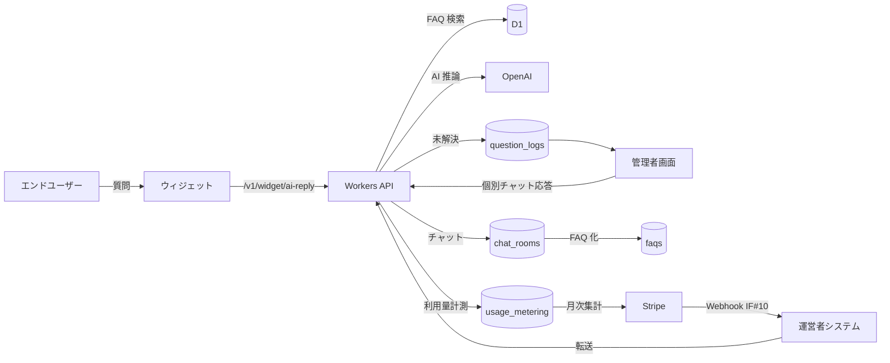

# 基本設計 index(メインシステム)

## 0. 文書情報

| 項目 | 内容 |
|---|---|
| 文書名 | 基本設計 index(メインシステム) |
| 対象システム名 | FAQ AI ウィジェット SaaS / メインシステム(利用者向け) |
| 作成日 | 2026-05-17 |
| 作成者 | プロジェクト設計チーム |
| 版数 | v1.0 |
| ステータス | 承認済(v1.0 初版) |

## 1. 目的・対象範囲

| 項目 | 内容 |
|---|---|
| 目的 | メインシステム(利用者向け FAQ ウィジェット SaaS)の全体方針 + 設計方針 + 個別設計書への索引を示す。詳細仕様は本ディレクトリ配下の 10 個別設計書を正本とする。 |
| 対象範囲 | 利用者(オーナー / メンバー / エンドユーザー)向け SaaS のシステム全体方針 |
| 対象外 | 運営者システム([../../02_運営者システム/02_基本設計/](../../02_運営者システム/02_基本設計/))、実装ディレクトリ構成(詳細設計)、デプロイ詳細(運用設計) |
| 想定読者 | 設計レビュアー / 実装担当者 / AI 駆動開発担当 |

## 2. 設計方針(全体像)

| # | 方針 | 概要 | 詳細 |
|---|---|---|---|
| 1 | 画面設計方針 | SaaS 標準 SPA + サーバーサイドルーティング併用。SCR-001〜027(モーダル含む)を網羅。 | [01_画面設計.md](01_画面設計.md) |
| 2 | API 設計方針 | REST + JSON。`/v1` 配下に統一。`Authorization` ヘッダ。連携 IF #1〜#12(送信側)。 | [02_API設計.md](02_API設計.md) |
| 3 | データ設計方針 | RDB(マルチオーナーは `contract_owner_user_id` 列で分離)+ KV(セッション / トークン / レート制限)+ R2(添付・ウィジェット静的)。 | [03_テーブル設計.md](03_テーブル設計.md) |
| 4 | 権限設計方針 | オーナー専有機能 + プロジェクト別ロール(`project_users.role` = `admin` / `member`) + 契約状態による利用上書き。 | [04_権限設計.md](04_権限設計.md) |
| 5 | エラー設計方針 | `E-AUTH-*` / `E-AUTHZ-*` / `E-BIZ-*` / `E-INPUT-*` / `E-IF-*` の ID 体系。ステータスコード対応表。 | [05_エラー設計.md](05_エラー設計.md) |
| 6 | メッセージ設計方針 | `MSG-SCR-*` の ID 体系。通知契機 + テンプレート。重要度 `critical` はメール強制送信。 | [06_メッセージ一覧.md](06_メッセージ一覧.md) |
| 7 | トレーサビリティ方針 | 要件 → 機能 → 画面 → API → DB → 権限 → エラー → メッセージ → テスト観点を縦串で追跡。 | [07_トレーサビリティマトリクス.md](07_トレーサビリティマトリクス.md) |
| 8 | 認証・認可設計方針 | ID/PW + メール確認 + 規約同意。セッション + アクセストークン + リフレッシュトークン。オーナー境界 + Principal。 | [08_認証・認可設計.md](08_認証・認可設計.md) |
| 9 | セキュリティ設計方針 | PII 列単位暗号化 + 鍵管理 + 監査ログ + 不正利用検知 + メール配信信頼性 + Web 脆弱性対策。 | [09_セキュリティ設計.md](09_セキュリティ設計.md) |
| 10 | 課金・請求設計方針 | MVP 単一プラン(完全従量課金 + 月次無料枠 + 14 日トライアル)+ Stripe Smart Retries + 契約状態 4 値。 | [10_課金・請求設計.md](10_課金・請求設計.md) |
| 11 | メール設計方針 | システムが送信する全 `TPL-*` テンプレートの件名・本文・送信契機の正本。共通基準(送信元・i18n・サニタイズ・配信信頼性)+ テンプレート詳細 + 配信運用。 | [11_メール設計.md](11_メール設計.md) |

## 3. システム構成(全体像)

| レイヤ | 構成要素 | 補足 |
|---|---|---|
| フロントエンド | SPA(Web)+ ウィジェット(エンドユーザー側 JS) | 認証画面 / 管理画面 / エンドユーザー画面 |
| API バックエンド | Cloudflare Workers + REST API | `/v1` 配下に統一 |
| データストア | D1(SQLite ベース)+ KV + R2 | RDB + キャッシュ + オブジェクト |
| 外部連携 | Stripe / Resend / OpenAI / 運営者システム / メール SMTP | 連携 IF #1〜#12 で明文化 |
| インフラ | Cloudflare Workers + Cron Triggers + Queues | サーバーレス前提 |

詳細構成図と利用技術一覧は [../03_詳細設計/index.md](../03_詳細設計/index.md) §2 を参照。

## 4. 機能一覧(FRxx_*.md と基本設計成果物の対応)

| FRxx ファイル | 概要 | 主関連画面 | 主関連 API |
|---|---|---|---|
| [../01_要件定義/FR01_アカウント管理.md](../01_要件定義/FR01_アカウント管理.md) | 新規登録 / ログイン / 再認証 / ログアウト | SCR-001〜003 | `POST /v1/sessions`, `POST /v1/accounts` |
| [../01_要件定義/FR02_ユーザー管理.md](../01_要件定義/FR02_ユーザー管理.md) | メンバー招待 / 権限 / プロジェクト割当(プロジェクト単位)| SCR-017 | `POST /v1/projects/:id/members`(招待), `PATCH /v1/projects/:id/members/:userId`(ロール変更), `DELETE /v1/projects/:id/members/:userId`(離脱)|
| [../01_要件定義/FR03_プロジェクト管理.md](../01_要件定義/FR03_プロジェクト管理.md) | プロジェクト作成 / 編集 / 削除 | SCR-010 | `GET /v1/projects` ほか |
| [../01_要件定義/FR04_FAQ管理.md](../01_要件定義/FR04_FAQ管理.md) | FAQ CRUD + 公開 + 改版 | SCR-012 | `GET /v1/faqs` ほか |
| [../01_要件定義/FR05_AI回答.md](../01_要件定義/FR05_AI回答.md) | AI 推論 + 信頼度しきい値判定 | ウィジェット | `POST /v1/widget/ai-reply` |
| [../01_要件定義/FR06_未解決質問登録.md](../01_要件定義/FR06_未解決質問登録.md) | 未解決質問の登録 / 一覧 | SCR-011 | `GET /v1/inquiries` ほか |
| [../01_要件定義/FR07_個別チャット.md](../01_要件定義/FR07_個別チャット.md) | 個別チャット一覧 / 部屋 / チャット管理 | SCR-013 / SCR-033 / SCR-034 | `POST /v1/chats/:id/messages`, `PATCH /chat-rooms/{id}`, `PATCH /projects/{id}` |
| [../01_要件定義/FR08_未解決質問からFAQ登録.md](../01_要件定義/FR08_未解決質問からFAQ登録.md) | 未解決 → FAQ 候補化 / 公開 | SCR-011 / SCR-012 | `POST /v1/faqs/from-inquiry` |
| [../01_要件定義/FR09_処理エラー.md](../01_要件定義/FR09_処理エラー.md) | エラー一覧 / 再実行 | SCR-019 | `GET /v1/errors` |
| [../01_要件定義/FR10_利用量・課金.md](../01_要件定義/FR10_利用量・課金.md) | 利用量メータリング / 請求書 / プラン | SCR-015 | `GET /v1/usage`, `GET /v1/invoices` |
| [../01_要件定義/FR11_管理ダッシュボード.md](../01_要件定義/FR11_管理ダッシュボード.md) | KPI ダッシュボード | SCR-020 | `GET /v1/dashboard` |
| [../01_要件定義/FR12_通知.md](../01_要件定義/FR12_通知.md) | 通知 / インボックス / メール | SCR-021 / SCR-022 | `GET /v1/inbox-messages` |
| [../01_要件定義/FR13_ウィジェット.md](../01_要件定義/FR13_ウィジェット.md) | ウィジェット配信 + 設定 + 許可ドメイン | SCR-014 | `GET /v1/widget-config` ほか |
| [../01_要件定義/FR14_プライバシー・データ管理.md](../01_要件定義/FR14_プライバシー・データ管理.md) | プライバシー / データ削除 | SCR-018 / SCR-035 / SCR-024 | `POST /v1/withdrawal-requests` |
| [../01_要件定義/FR15_セキュリティ.md](../01_要件定義/FR15_セキュリティ.md) | 不正利用検知 / 鍵管理 / 監査 | — | — |
| [../01_要件定義/FR16_お知らせ.md](../01_要件定義/FR16_お知らせ.md) | お知らせ配信 / 既読 | SCR-021 / SCR-022 | `GET /v1/inbox-messages` |
| [../01_要件定義/FR17_検索・全文検索.md](../01_要件定義/FR17_検索・全文検索.md) | FTS 検索 | SCR-012 | `GET /v1/faqs?q=` |
| [../01_要件定義/FR18_インポート・エクスポート.md](../01_要件定義/FR18_インポート・エクスポート.md) | FAQ の CSV インポート/エクスポート / 質問ログのエクスポート | SCR-012 / SCR-012-M1 / SCR-015 | `POST /v1/imports`(CSV のみ), `GET /v1/exports`(CSV のみ)|
| [../01_要件定義/FR19_UX細部・データ運用.md](../01_要件定義/FR19_UX細部・データ運用.md) | UX 細部要件 / データ運用要件 | 全画面 | — |
| [../01_要件定義/FR20_アクセス制御細部.md](../01_要件定義/FR20_アクセス制御細部.md) | アクセス制御細部要件 | — | — |
| [../01_要件定義/FR21_AI推論動作.md](../01_要件定義/FR21_AI推論動作.md) | AI 推論動作要件 | — | `POST /v1/widget/ai-reply` |
| [../01_要件定義/FR22_SCR画面マスタ.md](../01_要件定義/FR22_SCR画面マスタ.md) | SCR 画面一覧マスタ | 全画面 | — |

## 5. データフロー(概観)

## 6. 非機能要件への対応方針(基本)

| 観点 | 対応方針 | 詳細 |
|---|---|---|
| 性能 | API p95 < 500ms / AI 回答 p95 < 3s | [../03_詳細設計/index.md](../03_詳細設計/index.md) §13.1 |
| 可用性 | Cloudflare グローバル分散 + マルチリージョン DB レプリケーション | §13.2 |
| スケーラビリティ | サーバーレス自動スケール + KV キャッシュ | §13.3 |
| アクセシビリティ | WCAG 2.1 AA 準拠 | §13.4 |
| 国際化 | i18n 基盤(MVP は日本語のみ。将来英語追加) | §13.5 / [../05_future/index.md](../05_future/index.md) |
| バックアップ | D1 自動バックアップ + R2 ライフサイクル | §13.6 / [../04_運用設計/02_バックアップ・リストア設計.md](../04_運用設計/02_バックアップ・リストア設計.md) |
| データ保持 | テーブル別 retention class 制御 | §13.7 |

## 7. 基本設計ファイル一覧

| # | ファイル | 概要 |
|---|---|---|
| 01 | [01_画面設計.md](01_画面設計.md) | SCR-001〜027 + モーダル の全画面定義 |
| 02 | [02_API設計.md](02_API設計.md) | 管理 API + 連携 IF #1〜#12(送信側)の全エンドポイント |
| 03 | [03_テーブル設計.md](03_テーブル設計.md) | 全テーブル + DDL + コード値 + 状態遷移 |
| 04 | [04_権限設計.md](04_権限設計.md) | 3 ロール(オーナー / プロジェクト管理者 / メンバー)+ プロジェクト別ロール(`project_users.role`)+ 契約状態上書き |
| 05 | [05_エラー設計.md](05_エラー設計.md) | エラー ID 体系 + ステータスコード対応表 + 共通方針 |
| 06 | [06_メッセージ一覧.md](06_メッセージ一覧.md) | メッセージ / 通知契機(メール本文の正本は §11 メール設計)|
| 07 | [07_トレーサビリティマトリクス.md](07_トレーサビリティマトリクス.md) | 要件 → 設計 → テスト観点の対応 |
| 08 | [08_認証・認可設計.md](08_認証・認可設計.md) | 認証 / セッション / Principal / オーナー境界 |
| 09 | [09_セキュリティ設計.md](09_セキュリティ設計.md) | PII 暗号化 / 鍵管理 / 監査ログ / 不正利用検知 |
| 10 | [10_課金・請求設計.md](10_課金・請求設計.md) | MVP 単一プラン + 契約状態 + Stripe Smart Retries |
| 11 | [11_メール設計.md](11_メール設計.md) | 全 `TPL-*` 件名 + 本文テンプレートの正本 + 配信運用 |

## 8. SCR × ドキュメント カバレッジ表

| SCR ID | 画面名 | 画面 | API | テーブル | 権限 | エラー | メッセージ | 認証認可 | セキュリティ | 課金 |
|---|---|---|---|---|---|---|---|---|---|---|
| SCR-001 | ログイン | §5.SCR-001 | `POST /v1/sessions` | `accounts`, `sessions` | §3 ロール | E-AUTH-* | MSG-SCR-001-* | §3 ログイン | §5 ロックアウト | - |
| SCR-002 | 新規登録 | §5.SCR-002 | `POST /v1/accounts` | `accounts` | - | E-AUTH-VALIDATION | MSG-SCR-002-* | §3 新規登録 | - | §5 トライアル |
| SCR-003 | パスワード再設定 | §5.SCR-003 | `POST /v1/password/reset` | `accounts` | - | E-AUTH-* | MSG-SCR-003-* | §3 パスワード再設定 | §7 監査 | - |
| SCR-010 | プロジェクト一覧 | §5.SCR-010 | `GET /v1/projects` | `projects`, `project_users` | オーナー専有 | E-AUTHZ-OWNER-ONLY | MSG-SCR-010-* | §6 オーナー境界 | - | - |
| SCR-010-M1 | プロジェクト設定モーダル(「管理者を指定」セクション・削除動線は持たない)| §5.SCR-010-M1 | `POST/PATCH /v1/projects` | `projects`(作成時にオーナー grants 自動 INSERT)| オーナー専有 | E-INPUT-* | MSG-SCR-010-M1-* | §6 認可判定 | - | - |
| SCR-011 | 未解決質問一覧 / 詳細 | §5.SCR-011 | `GET /v1/inquiries` | `question_logs`, `inquiries` | オーナー / 該当 PJ の `member`+ | E-BIZ-CASE-* | MSG-SCR-011-* | §6 オーナー境界 | - | - |
| SCR-012 | FAQ 管理 | §5.SCR-012 | `GET /v1/faqs` ほか | `faqs`, `faq_revisions`, `faq_search_fts` | オーナー / 該当 PJ の `member`+ | E-BIZ-NOT-FOUND | MSG-SCR-012-* | §6 認可判定 | - | §3 FAQ 件数上限 |
| SCR-012-M1 | FAQ CSV インポートモーダル | §5.SCR-012-M1 | `POST /faqs/import`(CSV のみ), `GET /faqs/import/template` | `faqs`, `faq_revisions` | オーナー / 該当 PJ の `member`+ | E-INPUT-CSV-INVALID, E-INPUT-CSV-FAQID-NOTFOUND | MSG-SCR-012-M1-* | §6 認可判定 | - | §3 1 ファイル 1000 件 |
| SCR-013 | 個別チャット一覧 | §5.SCR-013 | `GET /v1/chat-rooms` | `chat_rooms`, `chat_messages` | オーナー / 該当 PJ の `member`+ | E-BIZ-CHAT-* | MSG-SCR-013-* | §6 オーナー境界 | - | §3 チャット部屋数上限 |
| SCR-033 | 個別チャット部屋(利用者側)| §5.SCR-033 | `POST /v1/chats/:id/messages`, `PATCH /chat-rooms/{id}`(担当変更)| `chat_rooms`(`assignee_user_id` NOT NULL), `chat_messages` | オーナー / 該当 PJ の `member`+ | E-BIZ-CHAT-* / E-INPUT-ASSIGNEE | MSG-SCR-033-* | §6 オーナー境界 | - | §3 チャット部屋数上限 |
| SCR-034 | チャット管理(デフォルト担当者設定)| §5.SCR-034 | `PATCH /projects/{id}`(`defaultAssigneeUserId`)| `projects`(`default_assignee_user_id`)| オーナー / 該当 PJ の `admin` | E-AUTHZ-FORBIDDEN | MSG-SCR-034-* | §6 認可判定 | - | - |
| SCR-014 | ウィジェット設定(プロジェクト WS / 公開キー + 見た目 + プレビュー)| §5.SCR-014 | `PATCH /v1/widget-config`, `POST /v1/projects/{id}/widget-key/rotate` | `projects`, `allowed_domains`, `project_legacy_keys` | 当該 PJ の `admin` 以上(`member` は閲覧のみ)| E-INPUT-DOMAIN | MSG-SCR-014-* | §6 API キー検証 | §12 ウィジェット保護 | - |
| SCR-015 | プロジェクトホーム(プロジェクト視点)+ 課金部(契約 WS 配置)。**プロジェクト削除動線を集約**| §5.SCR-015 | `GET /v1/usage`, `GET /v1/invoices`, `DELETE /v1/projects/{id}` | `usage_metering`, `billing_invoices`, `projects.valid` | プロジェクト視点 = オーナー / 該当 PJ の `member`+ / 課金部・プロジェクト削除部 = オーナー専有 | E-AUTHZ-OWNER-ONLY | MSG-SCR-015-*(プロジェクト削除 MSG: BTN-DELETE-001 / CONFIRM_*-DELETE-001 / TOAST-DELETE-001) | §6 認可判定 | - | §9〜§11 |
| SCR-017 | ユーザー管理(プロジェクト WS のみ)| §5.SCR-017 | `POST /v1/projects/:id/members`, `PATCH /v1/projects/:id/members/:userId`, `DELETE /v1/projects/:id/members/:userId`(アカウント全体論理削除)| `users.valid`, `project_users.valid`, `sessions.revoked_at` | オーナー / `admin`(該当 PJ)| E-AUTHZ-MEMBER / E-AUTHZ-ADMIN-DELETE-PROTECTED / E-BIZ-ACCOUNT-INACTIVE | MSG-SCR-017-* | §3 招待受諾 | - | - |
| SCR-017-M1 | メンバー招待 / 編集モーダル(プロジェクト単位)| §5.SCR-017-M1 | `POST /v1/projects/:id/members`(招待), `PATCH /v1/projects/:id/members/:userId`(ロール変更), `DELETE /v1/projects/:id/members/:userId`(離脱)| `users`, `project_users` | オーナー / `admin`(該当 PJ)| E-INPUT-* / E-BIZ-MEMBER-NO-GRANT | MSG-SCR-017-M1-* | §3 招待トークン | - | - |
| SCR-018 | 利用規約閲覧(利用規約のみ)| §5.SCR-018 | `GET /v1/terms/current` | `terms_versions`(`doc_type='terms_of_service'`)| 認証不要 | - | MSG-SCR-018-* | - | - | - |
| SCR-035 | プライバシーポリシー閲覧(プライバシーポリシーのみ)| §5.SCR-035 | `GET /v1/privacy/current` | `terms_versions`(`doc_type='privacy_policy'`)| 認証不要 | - | MSG-SCR-035-* | - | - | - |
| SCR-021 | お知らせ一覧 | §5.SCR-021 | `GET /v1/inbox-messages` | `inbox_messages` | 全ユーザー | - | MSG-SCR-021-* | §6 認可判定 | - | - |
| SCR-022 | お知らせ詳細 | §5.SCR-022 | `PATCH /v1/inbox-messages/:id/read` | `inbox_messages` | 全ユーザー | - | MSG-SCR-022-* | §6 認可判定 | - | - |
| SCR-023 | メール確認 | §5.SCR-023 | `POST /v1/email-verification` | `accounts` | - | E-AUTH-VERIFICATION | MSG-SCR-023-* | §3 メール確認 | - | - |
| SCR-024 | 退会申請 | §5.SCR-024 | `POST /v1/withdrawal-requests` | `withdrawal_requests` | オーナー専有 | E-BIZ-WITHDRAWAL | MSG-SCR-024-* | §6 オーナー専有 | - | §5 退会フロー |
| SCR-025 | 規約再同意割込み | §5.SCR-025 | `POST /v1/terms/agree` | `terms_agreements` | 全ユーザー | E-AUTHZ-TERMS | MSG-SCR-025-* | §3 規約再同意 | - | - |
| SCR-026 | 契約ホーム(オーナー視点ダッシュボード / 契約 WS のトップ)| §5.SCR-026 | `GET /v1/usage?viewMode=owner` | `usage_metering`, `question_logs`, `chat_rooms`, `faqs`, `projects.valid` | オーナー専有 | E-AUTHZ-OWNER-ONLY / E-BIZ-PROJECT-INACTIVE | MSG-SCR-026-*(プロジェクト名リンク → SCR-015 着地。プロジェクト削除動線は SCR-015 に集約) | §6 認可判定 | - | - |
| SCR-027 | エンドユーザー再入室 | §5.SCR-027 | `GET /v1/widget/sessions/:token` | `access_tokens`, `chat_rooms` | エンドユーザー | E-AUTH-TOKEN | MSG-SCR-027-* | §3 ウィジェットトークン | §12 ウィジェット保護 | - |
| SCR-028 | アカウント設定(共通領域)| §5.SCR-028 | `PATCH /v1/me`, `POST /v1/me/password`, `GET /v1/me/sessions`, `PATCH /v1/me/contact-email`(オーナーのみ)| `accounts`, `sessions` | 全認証ユーザー(自分のみ。退会セクションはオーナーのみ)| E-AUTH-* | MSG-SCR-028-* | §3 ログイン / §3 パスワード変更 | §7 監査 | §5 退会(オーナーのみ)|

## 9. 連携 IF × ドキュメント カバレッジ

| IF # | 方向 | 概要 | API | エラー | セキュリティ | 課金 |
|---|---|---|---|---|---|---|
| #1 | 顧管 → メ | 契約停止イベント受信 | §5 IF #1 | E-IF-001-* | - | §5 サスペンション |
| #2 | 顧管 → メ | 強制ログアウト受信 | §5 IF #2 | E-IF-002-* | §7 監査 | - |
| #4 | 顧管 → メ | 復元実行 | §5 IF #4 | E-IF-004-* | §7 監査 | - |
| #5 | 顧管 → メ | レート制限上書き | §5 IF #5 | E-IF-005-* | - | §3 契約上書き |
| #6 | 顧管 → メ | AI パラメータ上書き | §5 IF #6 | E-IF-006-* | - | - |
| #7 | 顧管 → メ | お知らせ生成 | §5 IF #7 | E-IF-007-* | - | - |
| #8 | メ → 顧管 | 監視メトリクス取得 | §5 IF #8 | E-IF-008-* | §10 監視 | - |
| #9 | メ → 顧管 | 不正利用検知通知 | §5 IF #9 | E-IF-009-* | §10 不正利用検知 | - |
| #10 | 外 → 顧管 → メ | 課金 Webhook 受信・転送 | §5 IF #10 | E-IF-010-* | §7 監査 | §13 Webhook 処理 |
| #12 | 顧管 → メ → 利用者 | 運営者操作通知 | §5 IF #12 | E-IF-012-* | - | - |

(#3 / #11 は要件側で予約。MVP では未割り当て)

## 10. 関連ドキュメント

| ドキュメント | 役割 | リンク |
|---|---|---|
| 要件定義 | WHAT(機能要件 / 非機能要件 / 業務要件 / 受入条件) | [../01_要件定義/index.md](../01_要件定義/index.md) |
| 詳細設計 | 実装関連の詳細(モジュール構成 / バッチ / ログ / 監視 / 実装ガイドライン) | [../03_詳細設計/index.md](../03_詳細設計/index.md) |
| 運用設計 | 監視 / バックアップ / ログ / 障害対応 / リリース / 運用手順 | [../04_運用設計/index.md](../04_運用設計/index.md) |
| 将来対応 | MVP 範囲外 | [../05_future/index.md](../05_future/index.md) |
| 画面遷移図(ワイヤーフレーム)| エンドユーザー UI 表現 | [../画面遷移図.html](../画面遷移図.html) |
| 運営者側ドキュメント | 顧客管理システム側設計書 | [../../02_運営者システム/02_基本設計/index.md](../../02_運営者システム/02_基本設計/index.md) |
| 共有概念対応表 | メイン / 運営者の正本所在 | [../../共有/共有概念.md](../../共有/共有概念.md) |

## 11. 未確定事項・確認事項

| 確認事項ID | 確認内容 | 関連箇所 | 優先度 | ステータス |
|---|---|---|---|---|
| Q-BASE-001 | (現時点で未確定事項なし — v1.0 リリース時点で全項目確定済み) | - | 低 | 確認済 |
