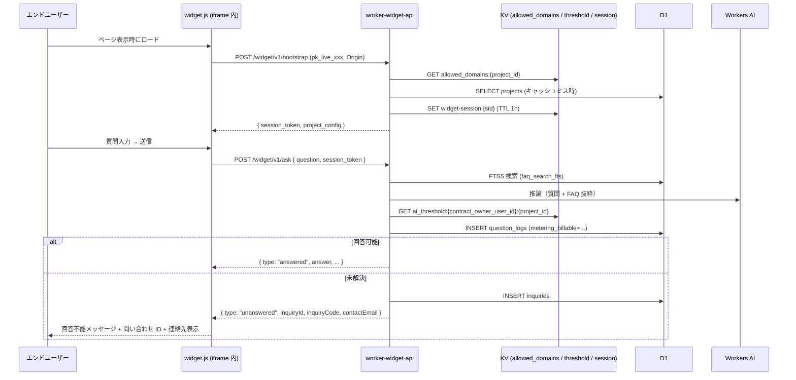

# DD13: ウィジェット配信

## 0. 文書情報

| 項目 | 内容 |
|---|---|
| 文書名 | DD13: ウィジェット配信 |
| 詳細設計ID | DD13 |
| 対象システム | FAQ AI ウィジェット SaaS / メインシステム |
| 関連機能ID | FR-150〜156, FR-156a〜d（ウィジェット設定 / 配信 / エンドユーザー向けチャット UI）/ FR-070〜079（未解決質問）/ AC-015 / AC-025 / AC-033 |
| 作成日 | 2026-05-17 |
| 版数 | v1.3 |
| ステータス | 承認済 |

## 1. 対象範囲

| 種別 | ID | 名称 |
|---|---|---|
| 機能 | FR-150〜156, FR-156a〜d | ウィジェット設定 / 配信 / 許可ドメイン / 公開鍵 / チャット UI 状態 |
| 機能 | FR-070〜079 | 未解決質問登録 / 問い合わせID表示 |
| 機能 | FR-194 | レート制限契約別 |
| 画面 | SCR-014 | ウィジェット表示 |
| API | `/widget/v1/bootstrap` `/widget/v1/ask` `/widget/v1/inquiries` | ウィジェット API |
| デプロイ単位 | `pages-widget` `worker-widget-api` | ウィジェット配信基盤 |

## 2. 収録ロジック・対応章

| 元章 | 元タイトル | 概要 |
|---|---|---|
| §2.2 | コンポーネント詳細責務 | pages-widget / worker-widget-api |
| §2.3.2 | ウィジェット API（end_user）リクエストフロー | bootstrap → ask |
| §3.3.2 | `worker-widget-api` モジュール構成 | routes / handlers / middleware |
| §6 SCR-014 | 画面詳細設計 | ウィジェット表示（正本は基本設計） |
| §7 | 機能詳細設計（ウィジェット関連） | 公開鍵 / 許可ドメイン / レート制限（正本は基本設計） |
| §13.1.2 | ウィジェット応答経路の最適化 | KV 60s キャッシュ / 埋め込み事前計算 |

## 3. 詳細設計本文

### 3.1 ウィジェット API リクエストフロー



### 3.2 配信構成

- **`pages-widget`**: `widget.js` および iframe コンテンツ配信。CSP / HSTS 設定。
- **`worker-widget-api`**: ウィジェット用 API（`/widget/v1/*`）。bootstrap → session token 認証。

### 3.3 実装モジュール構成

```
worker-widget-api/src/
├── index.ts
├── routes/
│   ├── bootstrap.ts          # POST /widget/v1/bootstrap
│   ├── ask.ts                # POST /widget/v1/ask
│   └── inquiries.ts          # /widget/v1/inquiries/*
├── handlers/
├── repository/
├── adapter/
│   └── workers-ai-answer-provider.ts
├── middleware/
│   ├── verify-widget-key.ts  # pk_live_xxx の検証 + Origin 一致
│   ├── widget-session.ts     # session_token 検証
│   ├── rate-limit.ts         # 50/min 警告 / 60/min 拒否
│   └── audit.ts
└── lib/
```

### 3.4 性能目標（NFR-101 / NFR-102）

| API | p95 目標 | 達成方策 |
|-----|---------|---------|
| `POST /widget/v1/bootstrap` | < 200ms | KV キャッシュ（60s）優先、D1 ヒット時のみフォールバック |
| `POST /widget/v1/ask` (FAQ ヒット) | < 1000ms | FTS5 検索 + Workers AI バインディング内呼出、最大 5 FAQ |
| `POST /widget/v1/ask` (FAQ miss) | < 500ms | AI 推論スキップ |

### 3.5 ウィジェット応答経路の最適化

- KV 60s キャッシュ: `project_key`, `allowed_domains`, `ai_threshold`
- 埋め込みベクトル: FAQ 公開時に事前計算、KV または `faq_embeddings` テーブル保存
- AI モデル: `@cf/meta/llama-3.1-8b-instruct` を第一選択（早い）、品質要件で `llama-3.1-70b` に切替可能

### 3.6 AI 推論タイムアウト + フォールバック

```ts
const inferencePromise = provider.answer(input);
const timeoutPromise = new Promise<never>((_, reject) =>
  setTimeout(() => reject(new Error('AI_TIMEOUT')), 5000),
);
try {
  const result = await Promise.race([inferencePromise, timeoutPromise]);
  // ...
} catch (e) {
  if ((e as Error).message === 'AI_TIMEOUT') {
    // unanswered + 管理者ユーザー誘導
    return { type: 'unanswered', reason: 'ai_timeout' };
  }
  throw e;
}
```

### 3.7 レート制限（FR-194 / AC-033）

ウィジェット質問レートは 50/min（警告）/ 60/min（拒否、429 `RATE_LIMITED` + Retry-After 付）。同時並列はオーナー 10 / グローバル 200。詳細は [DD12_利用量計測・課金.md](DD12_利用量計測・課金.md) §3.1 参照。

### 3.7a 質問受付停止時のウィジェット応答（FR-122 / FR-136）

`POST /widget/v1/ask` の処理冒頭で、公開キーから解決した `project_id` について以下 **2 つの契機のいずれか** を満たす場合、**AI 推論・FTS5 検索を実行せず** 即時に停止応答する(KV `usage-limit:<owner>:<projectId>` 30s TTL を参照。判定はプロジェクト単位):

| 契機 | 条件 | `reason` |
|---|---|---|
| 上限件数到達(FR-122)| 当月の **当該プロジェクト** 質問数 ≥ `project_quota_limits.question_monthly_limit`(当該プロジェクト設定)| `question_monthly_limit_reached` |
| 支払方法ゲート(FR-136)| 支払方法未登録(契約単位)かつ 当月の **当該プロジェクト** 質問数 ≥ 当該プロジェクトの無料枠(`project_quota_limits.free_quota` or デフォルト 1,000)| `payment_method_required` |

停止応答の共通仕様:

| 項目 | 内容 |
|---|---|
| 応答コード | **429**(`E-QUOTA-QUESTIONS-LIMIT`)、`Retry-After` = 当月末 23:59:59 JST までの秒数 |
| レスポンスボディ | `{ type: "limited", reason: <上表>, contactEmail: <確認済みプロジェクト連絡先メール or null> }` |
| ウィジェット表示 | `contactEmail` あり → `MSG-WIDGET-QUESTION-LIMIT`(メール誘導)。null → `MSG-WIDGET-QUESTION-LIMIT-NOEMAIL`(フォールバック)|
| 計上 | `question_logs` に計上しない(`metering_billable=false`、停止質問はカウント外)|
| レート制限との区別 | 一時的なレート超過(60/min)は `RATE_LIMITED`「混み合っています」、本停止は別メッセージ |
| 契約状態 | **`contract_status` は変更しない**(`active` のまま、**当該プロジェクトの**ウィジェット質問受付のみ停止。他プロジェクトは継続。契約サスペンション 423 とは別)|
| 復帰 | 上限件数到達: 翌月リセット or オーナー / 当該プロジェクト管理者の上限引き上げ(SCR-036-M1)。支払方法ゲート: **支払方法登録(Setup Intent 成功)で即時再開**(契約単位の支払方法登録で全プロジェクトのゲートが解除)|

連絡先メール表示は確認済み(`projects.contact_email_verified_at IS NOT NULL`)のもののみ。停止判定・通知ロジックの正本は上限件数到達 = [DD12_利用量計測・課金.md §3.8](DD12_利用量計測・課金.md)、支払方法ゲート = [DD14_バッチ・非同期処理.md §3.1.3](DD14_バッチ・非同期処理.md)。

### 3.7b ウィジェット UI 状態遷移（FR-156a〜d）

| 現在状態 | 契機 | 次状態 | UI 処理 |
|---|---|---|---|
| `normal` | `/ask` が `answered` | `normal` | AI 回答を会話履歴へ追加し、入力を継続 |
| `normal` | `/ask` が `unanswered` | `normal` | `inquiries`を登録し、`MSG-WIDGET-UNANSWERED`、問い合わせID、確認済み連絡先メールを会話履歴へ追加。FAQ質問入力は継続 |
| `normal` | `/ask` が制限 429 | `limited` | `MSG-WIDGET-QUESTION-LIMIT` または `MSG-WIDGET-QUESTION-LIMIT-NOEMAIL` をシステム返信として追加し、入力・送信を無効化 |

ウィジェットヘッダー右上には全状態でハンバーガーメニューを表示する。MVPのメニュー項目は次の固定2件とする。

| 項目 | 遷移先 |
|---|---|
| 利用規約 | SCR-018 公開閲覧 URL |
| プライバシーポリシー | SCR-035 公開閲覧 URL |

### 3.8 関連する横断設計

- AI 回答: [DD03_AI回答パイプライン.md](DD03_AI回答パイプライン.md)
- しきい値: [DD04_AIしきい値3階層適用.md](DD04_AIしきい値3階層適用.md)
- 監査ログ: ウィジェットからの操作は `widget.ask` / `widget.session.start` 等で記録（PII マスク）

## 4. 関連設計

| 種別 | 参照先 |
|---|---|
| 要件 | [../01_要件定義/index.md](../01_要件定義/index.md) |
| 基本設計 | [../02_基本設計/index.md](../02_基本設計/index.md) |
| 画面設計 | [../02_基本設計/01_画面設計.md](../02_基本設計/01_画面設計.md) |
| API 設計 | [../02_基本設計/02_API設計.md](../02_基本設計/02_API設計.md) |
| 運用設計 | [../04_運用設計/index.md](../04_運用設計/index.md) |
| 関連 DD | [DD03_AI回答パイプライン.md](DD03_AI回答パイプライン.md) / [DD04_AIしきい値3階層適用.md](DD04_AIしきい値3階層適用.md) / [DD12_利用量計測・課金.md](DD12_利用量計測・課金.md) |

## 5. テスト観点

| AC ID | テスト ID | テスト方式 | テストファイル |
|---|---|---|---|
| AC-015 | `e2e-widget-001` | E2E | `apps/widget/e2e/bootstrap.spec.ts` |
| AC-025 | `e2e-reentry-001` | E2E | `apps/widget/e2e/reentry.spec.ts` |
| AC-033 | `it-rate-limit-001` | Integration | `workers/widget-api/test/integration/rate-limit.test.ts` |

### 5.1 ウィジェット E2E 例

```ts
test('ウィジェット質問が answered になる', async ({ page }) => {
  await page.goto('https://test-site.example.com/');  // ウィジェット埋込テストページ
  await page.frameLocator('iframe.widget').locator('button.trigger').click();
  await page.frameLocator('iframe.widget').locator('textarea').fill('返品方法を教えて');
  await page.frameLocator('iframe.widget').locator('button[type=submit]').click();
  await expect(page.frameLocator('iframe.widget').locator('.answer')).toContainText('返品');
});
```

### 5.2 負荷試験

| シナリオ | 構成 | 目的 |
|---------|------|------|
| (S1) 均等分布 | 200 契約 × 50 FAQ 平均、ask 100 RPS 全体 | ベースライン性能 |
| (S2) 偏在 | 1 契約 10,000 FAQ + 199 契約 × 25 FAQ | 大規模契約時の FTS5 / D1 限界 |
| (S3) 急増 | 50 → 200 契約 / 5 分で線形増加 | スケール時のオートスケール反応 |
| (S4) AI 高並列 | 100 契約 × ask 5 RPS、AI 推論 200 並列上限到達 | AI 並列上限・タイムアウト挙動 |
| (S5) ピーク (オプション) | 月次キャンペーン想定、200 → 400 RPS スパイク | エラーバジェット消費量検証 |

合格基準: 全シナリオで p95 ≤ §3.4 目標値 + http_req_failed < 1%。

### 5.3 その他観点

| 観点 | 内容 |
|---|---|
| 単体 | `verifyWidgetKey` の pk_live_xxx + Origin 一致 / `widgetSession` の session_token TTL |
| 結合 | bootstrap → ask の一連の流れ / Workers AI タイムアウト 5000ms 時の unanswered |
| 異常系 | 不正 Origin / 期限切れ session_token / 60/min 超過時 429 |
| 境界値 | レート制限 50/60 ぴったり / AI タイムアウト 5000ms ぴったり |
| 性能 | p95 bootstrap < 200ms / ask (hit) < 1000ms / (miss) < 500ms |

## 6. 未確定事項・確認事項

| 確認事項ID | 確認内容 | 優先度 | ステータス |
|---|---|---|---|
| - | v1.0 リリース時点で全項目確定済み | 低 | 確認済 |
