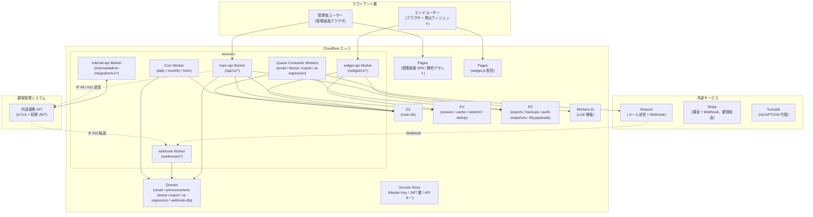
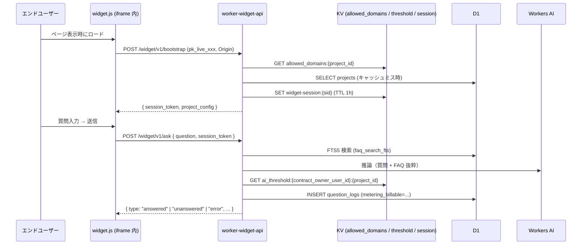
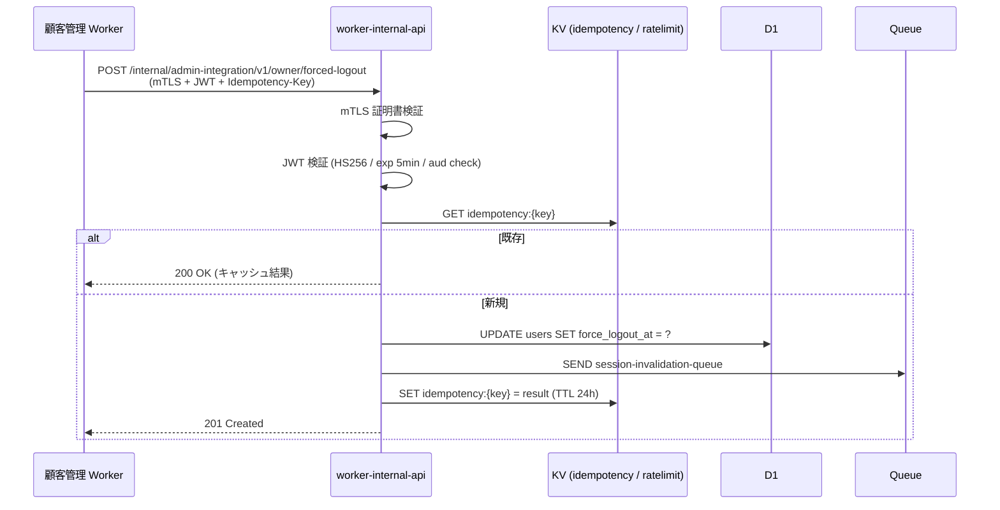

# 詳細設計 index（メインシステム）

## 0. 文書情報

| 項目 | 内容 |
|---|---|
| 文書名 | 詳細設計 index（メインシステム） |
| 対象システム | FAQ AI ウィジェット SaaS / メインシステム（管理画面 + 公開ウィジェット + エンドユーザー画面） |
| 版数 | v1.1 |
| 作成日 | 2026-05-17 |
| ステータス | 承認済 |
| 入力文書 | [../01_要件定義/index.md](../01_要件定義/index.md) / [../02_基本設計/index.md](../02_基本設計/index.md) / [../画面遷移図.html](../画面遷移図.html) |
| 実装スタック前提 | Cloudflare Workers / Pages / D1 / R2 / KV / Queues + TypeScript + Hono + Zod |

> **位置づけ**: 本書は実装関連の詳細(モジュール構成 / ロジック / 非機能 / バッチ / ログ / 監視 / テスト / リリース / 実装ガイドライン)を扱う。画面・API・DB・権限・エラー・セキュリティ・状態遷移は **02_基本設計/ 配下の 10 ドキュメント体系** を正本とし、本書からは参照のみ行う。

---

## 1. 詳細設計方針

### 1.1 目的

基本設計書で定義された FAQ AI ウィジェット SaaS メインシステムの設計を、Cloudflare Workers + TypeScript + Hono + Zod を用いた実装に直接落とし込めるレベルまで詳細化することを目的とする。設計の各構成要素について、「どこに何を書くか（ファイル配置）」「何をどう書くか（型・関数・テーブル・SQL・JSON スキーマ）」を明示し、実装者が翌日からコード作成に着手できる粒度を達成する。

### 1.2 対象システム

本書の対象は、FAQ AI ウィジェット SaaS のメインシステムである。具体的には以下を含む。

- **管理画面**（管理者ユーザー admin 向け、SCR-001〜027）
- **公開ウィジェット**（エンドユーザー end_user 向け、JavaScript 配信、iframe sandbox）
- **公開ウィジェット**（通常 / 未解決 / 制限中）
- **内部連携 API**（顧客管理システムとの IF #1〜#12 送受信）
- **非同期処理基盤**（cron / Queue / Webhook 受信）

### 1.3 スコープ

リリース優先度 P0（必須）に該当する全機能要件・非機能要件を対象とする。P1 のうち P0 と密結合する以下については本書で扱う。


- AI 品質回帰テスト（FR-059 / FR-342）

### 1.4 関連ドキュメント

| 種別 | パス | 役割 |
|------|------|------|
| 要件 | [../01_要件定義/index.md](../01_要件定義/index.md) | 機能・非機能要件の正本 |
| 基本設計 | [../02_基本設計/index.md](../02_基本設計/index.md) | アーキテクチャ・データモデル・状態の正本 |
| 詳細設計（本書） | 本ファイル | 実装に直結する具体仕様 |
| 画面設計書 | [../画面遷移図.html](../画面遷移図.html) | 画面レイアウト、画面目的、権限、入出力、遷移、例外の視覚情報 |
| 運用設計 | [../04_運用設計/index.md](../04_運用設計/index.md) | 運用手順 / runbook |

---

## 2. システム全体構成

### 2.1 全体構成図



### 2.2 コンポーネント詳細責務

| # | コンポーネント | デプロイ単位 | 主責務 | 主使用バインディング |
|---|--------------|------------|--------|------------------|
| 1 | `pages-admin` | Cloudflare Pages | 管理画面 SPA（SCR-001〜027）配信。静的アセット + クライアントサイドルーティング。 | - |
| 2 | `pages-widget` | Cloudflare Pages | `widget.js` および iframe コンテンツ配信。CSP / HSTS 設定。 | - |
| 3 | `pages-public` | Cloudflare Pages | 利用規約・プライバシーポリシー等の公開ページ配信。 | - |
| 4 | `worker-main-api` | Workers | 管理画面用 API（`/api/v1/*`）。Cookie + CSRF 認証。 | D1 / KV / R2 / QU / AI / SS |
| 5 | `worker-widget-api` | Workers | ウィジェット用 API（`/widget/v1/*`）。bootstrap → session token 認証。 | D1 / KV / AI |
| 6 | `worker-internal-api` | Workers | 顧客管理連携 API（`/internal/admin-integration/v1/*`）。mTLS + 短期 JWT 認証。 | D1 / KV / QU / SS |
| 7 | `worker-webhook` | Workers | 外部 Webhook 受信（Resend / Stripe 経由 / Turnstile）。署名検証 → Queue 投入。 | D1 / KV / QU / R2 / SS |
| 8 | `worker-queue-consumer` | Workers Queue Consumer | Queue ジョブ実行（email / fanout / export / ai-regression / dlq）。 | D1 / R2 / QU / SS / 外部 API |
| 9 | `worker-cron` | Workers Cron Trigger | 定期処理（日次 / 月次 / 5 分間隔）。 | D1 / KV / QU / SS |

### 2.3 リクエストフロー

#### 2.3.1 管理画面 API（admin）

```mermaid
sequenceDiagram
  participant U as ブラウザ (admin)
  participant P as pages-admin
  participant W as worker-main-api
  participant K as KV (session)
  participant D as D1
  participant A as audit_logs

  U->>P: GET /
  P-->>U: SPA + HTML/JS/CSS
  U->>W: POST /api/v1/auth/login (Cookie 未保持)
  W->>D: SELECT users WHERE email_hmac=?
  W->>D: Argon2id verify
  W->>K: SET session:{sid} (TTL 12h)
  W-->>U: Set-Cookie: session=...; CSRF Cookie
  U->>W: GET /api/v1/inquiries (Cookie + X-CSRF-Token)
  W->>K: GET session:{sid}
  W->>D: SELECT inquiries WHERE contract_owner_user_id=? AND ...
  W->>A: INSERT audit_logs (read 操作は省略可)
  W-->>U: 200 OK + JSON
```

#### 2.3.2 ウィジェット API（end_user）



#### 2.3.3 内部連携 API（顧客管理 → メイン）



### 2.4 環境構成

| 環境 | 用途 | データ | 承認 |
|------|------|--------|------|
| `dev` | 開発者個人環境 | テストデータのみ | なし |
| `staging` | 統合テスト・MVP リリース前検証 | マスキング済み本番相当 | 1 名承認 |
| `prod` | 本番運用 | 実データ | **2 名承認**（NFR-805、AC-018） |

#### 2.4.1 wrangler.toml バインディング一覧（prod 例）

```toml
# wrangler.toml (worker-main-api)
name = "main-api"
main = "src/index.ts"
compatibility_date = "2026-05-12"

[[d1_databases]]
binding = "DB"
database_name = "main-db-prod"
database_id = "<UUID>"

[[kv_namespaces]]
binding = "KV_SESSION"
id = "<UUID>"

[[kv_namespaces]]
binding = "KV_CACHE"
id = "<UUID>"

[[kv_namespaces]]
binding = "KV_RATELIMIT"
id = "<UUID>"

[[kv_namespaces]]
binding = "KV_DEDUP"
id = "<UUID>"

[[r2_buckets]]
binding = "R2_EXPORTS"
bucket_name = "main-exports-prod"

[[r2_buckets]]
binding = "R2_AUDIT"
bucket_name = "main-audit-prod"

[[r2_buckets]]
binding = "R2_DLQ"
bucket_name = "main-dlq-prod"

[[queues.producers]]
binding = "Q_EMAIL"
queue = "email-queue-prod"

[[queues.producers]]
binding = "Q_FANOUT"
queue = "announcement-fanout-prod"

[[queues.producers]]
binding = "Q_EXPORT"
queue = "export-queue-prod"

[ai]
binding = "AI"

[vars]
ENV = "prod"
JWT_AUD = "main.example.com"
JWT_ISS_EXPECTED = "admin.example.com"
```

#### 2.4.2 マスキング方針（staging）

- メールアドレス: `user{N}@example.com` 置換
- 電話番号: `0900-0000-{4 桁ハッシュ}` 置換
- 氏名: `テストユーザー{N}` 置換
- チャット本文: 長さを保ったランダム文字列に置換（FAQ 本文は維持）

### 2.5 デプロイ単位

| デプロイ単位 | リポジトリ内パス（想定） | デプロイ方式 | 依存 |
|--------------|---------------------|------------|------|
| `pages-admin` | `app/admin/` | Cloudflare Pages（GitHub Actions） | - |
| `pages-widget` | `app/widget/` | Cloudflare Pages | - |
| `pages-public` | `app/public/` | Cloudflare Pages | - |
| `worker-main-api` | `app/workers/main-api/` | wrangler deploy | D1 マイグレーション完了 |
| `worker-widget-api` | `app/workers/widget-api/` | wrangler deploy | 同上 |
| `worker-internal-api` | `app/workers/internal-api/` | wrangler deploy | 同上 |
| `worker-webhook` | `app/workers/webhook/` | wrangler deploy | 同上 |
| `worker-queue-consumer` | `app/workers/queue-consumer/` | wrangler deploy | Queue 作成完了 |
| `worker-cron` | `app/workers/cron/` | wrangler deploy | 同上 |

CI/CD は GitHub Actions を用い、以下の段階を踏む。

1. PR: `vitest` + `tsc --noEmit` + `eslint`
2. main マージ: dev 環境へ自動デプロイ
3. release タグ: staging 環境へ自動デプロイ（1 名承認）
4. prod タグ: prod 環境へデプロイ（**2 名承認**、 GitHub Environment Protection）

---

## 3. ディレクトリ構成・モジュール構成

### 3.1 リポジトリレイアウト

実装リポジトリ（本設計リポジトリとは別、想定パス）は以下のモノレポ構成を採用する。

```
faq-saas/                                # 実装リポジトリ
├── app/
│   ├── admin/                           # 管理画面 SPA (React + Vite, pages-admin)
│   │   ├── src/
│   │   │   ├── pages/                   # SCR-001..025 のページコンポーネント
│   │   │   ├── components/              # 共通 UI 部品 (16 部品)
│   │   │   ├── hooks/
│   │   │   ├── lib/                     # API クライアント / バリデーション / i18n
│   │   │   ├── routes.ts                # ルーティング定義
│   │   │   └── main.tsx
│   │   ├── public/
│   │   ├── package.json
│   │   └── vite.config.ts
│   ├── widget/                          # widget.js + iframe コンテンツ (pages-widget)
│   ├── public/                          # 利用規約・プライバシーポリシー等 (pages-public)
│   ├── workers/                         # Cloudflare Workers 群
│   │   ├── main-api/                    # /api/v1/*
│   │   ├── widget-api/                  # /widget/v1/*
│   │   ├── internal-api/                # /internal/admin-integration/v1/*
│   │   ├── webhook/                     # /webhooks/*
│   │   ├── queue-consumer/              # Queue Consumer
│   │   └── cron/                        # Cron Trigger
│   └── shared/                          # 全 Worker 共通の型・ロジック
├── migrations/                          # D1 マイグレーション (forward-only)
├── scripts/
├── tests/
│   ├── unit/
│   ├── integration/
│   ├── e2e/
│   ├── load/                            # k6
│   └── isolation/                       # オーナー境界によるデータ分離検証
├── .github/
│   └── workflows/
├── package.json                         # ワークスペース管理 (pnpm workspace)
├── pnpm-workspace.yaml
├── tsconfig.base.json
└── README.md
```

### 3.2 レイヤ構成

各 Worker 内では以下の 5 層構成を採用する。**依存方向は上から下のみ**を許可する（ヘキサゴナルアーキテクチャ）。

| 層 | パス | 責務 | 依存先 |
|----|------|------|--------|
| プレゼンテーション | `routes/` | Hono のルート定義、リクエスト/レスポンスの Zod 検証、HTTP ステータス決定 | handlers |
| ユースケース | `handlers/` | 業務フロー（認可チェック → ドメインロジック → 永続化 → 通知 Queue 投入 → 監査ログ） | domain, repository, adapter, middleware |
| ドメイン | `domain/` | 状態遷移ガード、ビジネスルール、純関数 | （`shared` のみ） |
| アダプタ | `adapter/` | 外部 API クライアント（Resend / Stripe / 顧客管理）、Queue 投入、KV/R2 アクセス | （`shared` のみ） |
| リポジトリ | `repository/` | D1 SQL 実行、トランザクション | （`shared` のみ） |
| ミドルウェア | `middleware/` | 認証 / CSRF / 認可 / 監査 / レート制限 | repository, adapter, shared |
| ライブラリ | `lib/` | Worker 固有のユーティリティ | shared |
| 共通 | `shared/` | 全 Worker 共通の型・スキーマ・純関数 | （外部 npm のみ） |

### 3.3 主要モジュール

#### 3.3.1 `worker-main-api` モジュール構成

```
src/
├── index.ts                  # Hono app entry + 全ミドルウェア配線
├── routes/
│   ├── auth.ts               # /auth/*
│   ├── admin-users.ts         # /admin-users/*
│   ├── projects.ts           # /projects/*
│   ├── faqs.ts               # /faqs/*
│   ├── inquiries.ts          # /inquiries/*
│   ├── usage.ts              # /usage
│   ├── billing.ts            # /billing/*
│   ├── data.ts               # /data/*
│   ├── withdrawal.ts         # /withdrawal/*
│   ├── announcements.ts      # /me/announcements/*
│   ├── notification-prefs.ts # /me/notification-preferences
│   ├── terms.ts              # /me/terms*
│   └── email-verification.ts # /me/email-verification/*
├── handlers/                 # routes と 1:1 対応
├── domain/
│   ├── faq-status.ts
│   ├── inquiry-status.ts
│   ├── chat-room-status.ts
│   ├── notification-status.ts
│   ├── contract-status.ts
│   ├── pii-scrubber.ts
│   ├── post-check.ts
│   ├── ai-threshold.ts
│   ├── inquiry-code.ts
│   └── ...
├── repository/               # 23 テーブル × 1 ファイル
├── adapter/
│   ├── email-provider.ts
│   ├── resend-email-provider.ts
│   ├── answer-provider.ts
│   ├── workers-ai-answer-provider.ts
│   ├── admin-integration-client.ts
│   └── stripe-client.ts
├── middleware/
│   ├── authenticate.ts
│   ├── csrf.ts
│   ├── authorize.ts
│   ├── require-active-contract.ts
│   ├── require-terms-agreement.ts
│   ├── require-reauth.ts
│   ├── rate-limit.ts
│   ├── audit.ts
│   └── error-handler.ts
├── lib/
│   ├── kv.ts
│   ├── d1.ts
│   ├── queue.ts
│   ├── ulid.ts
│   ├── argon2id.ts
│   ├── token.ts
│   ├── encrypt.ts
│   ├── hmac.ts
│   ├── audit-hash.ts
│   ├── ip-mask.ts
│   └── logger.ts
└── types.ts
```

#### 3.3.2 `worker-widget-api` モジュール構成

```
src/
├── index.ts
├── routes/
│   ├── bootstrap.ts
│   ├── ask.ts
│   └── inquiries.ts
├── handlers/
├── repository/
├── adapter/
├── middleware/
│   ├── verify-widget-key.ts
│   ├── widget-session.ts
│   ├── rate-limit.ts
│   └── audit.ts
└── lib/
```

#### 3.3.3 `worker-internal-api` モジュール構成

```
src/
├── index.ts
├── routes/
│   ├── owner.ts             # IF #1 (suspend/resume) / IF #2 (forced-logout)
│   ├── restore.ts            # IF #4
│   ├── rate-limit.ts         # IF #5
│   ├── threshold.ts          # IF #6
│   ├── announcement.ts       # IF #7
│   ├── metrics.ts            # IF #8
│   ├── billing-webhook.ts    # IF #10
│   ├── operator-operation.ts # IF #12
│   └── ai-regression.ts      # v2.1 新規
├── middleware/
│   ├── verify-mtls.ts
│   ├── verify-jwt.ts
│   ├── idempotency.ts
│   └── audit.ts
└── ...
```

#### 3.3.4 `worker-webhook` モジュール構成

```
src/
├── index.ts
├── routes/
│   ├── resend.ts
│   └── stripe.ts             # 実質 IF #10 経由
├── handlers/
│   ├── resend/               # 8 イベント種別
│   │   ├── delivered.ts
│   │   ├── bounced.ts
│   │   ├── complained.ts
│   │   ├── delayed.ts
│   │   ├── opened.ts
│   │   ├── clicked.ts
│   │   ├── failed.ts
│   │   └── suppressed.ts
│   └── stripe/               # 8 イベント種別 (IF #10)
│       ├── invoice-paid.ts
│       ├── invoice-payment-failed.ts
│       ├── customer-subscription-created.ts
│       ├── customer-subscription-updated.ts
│       ├── customer-subscription-deleted.ts
│       ├── charge-refunded.ts
│       ├── charge-dispute-created.ts
│       └── customer-tax-id-updated.ts
├── middleware/
│   ├── verify-resend-signature.ts
│   ├── verify-stripe-signature.ts
│   └── idempotency.ts
└── ...
```

#### 3.3.5 `worker-queue-consumer` モジュール構成

```
src/
├── index.ts                  # Queue Consumer 共通エントリ
├── consumers/
│   ├── email.ts              # Resend 送信
│   ├── fanout.ts             # お知らせ fan-out
│   ├── export.ts             # データエクスポート生成
│   ├── ai-regression.ts      # AI 回帰テスト実行
│   └── dlq.ts                # DLQ 退避 (R2 退避 + 監視通知)
└── lib/
    └── retry.ts              # 指数バックオフ + 最大 3 回
```

#### 3.3.6 `worker-cron` モジュール構成

```
src/
├── index.ts                  # scheduled() ハンドラ + cron 分岐
├── jobs/
│   ├── monthly-aggregate.ts        # UTC 15:00 (月末日)
│   ├── monthly-finalize.ts         # JST 02:00 (月初 1 日)
│   ├── quota-exceeded-no-payment-check.ts  # JST 00:00 (毎日) 支払方法ゲート(FR-136)
│   ├── open-inquiry-retention-notice.ts # JST 09:00 (毎日)
│   ├── open-inquiry-retention.ts   # JST 02:00 (毎日)
│   ├── auto-close-evaluation.ts    # */5 * * * * (5 分間隔)
│   ├── audit-chain-verify.ts       # JST 03:00 (日次全件再計算)
│   ├── tombstone-batch.ts          # JST 04:00 (毎日)
│   ├── retention-cleanup.ts        # JST 05:00 (毎日)
│   └── d1-capacity-check.ts        # 0 * * * * (毎時)
└── lib/
```

### 3.4 共通ライブラリ

`app/shared/src/` 配下に配置し、全 Worker から `@faq-saas/shared` として import する。

| モジュール | 主エクスポート | 用途 |
|-----------|-------------|------|
| `schemas/` | `inquirySchema`, `faqSchema`, `askRequestSchema`, ... | Zod スキーマ（API リクエスト / レスポンス / DB レコード） |
| `constants/status.ts` | `INQUIRY_STATUS`, `FAQ_STATUS`, `CHAT_ROOM_STATUS`, `REMINDER_STATE`, `NOTIFICATION_STATUS`, `TENANT_STATUS`, `DELETION_LOCAL_STATUS` | 状態の文字列定数 |
| `constants/error-codes.ts` | `ErrorCode` enum | 全 40+ エラーコード |
| `constants/notification-types.ts` | `NOTIFICATION_TYPES` (13 種) | メール送信契機 |
| `constants/audit-actions.ts` | `AUDIT_ACTIONS` (9 カテゴリ網羅) | 監査ログ action コード |
| `domain/inquiry-status-transition.ts` | `canTransition()`, `nextStatus()` | 状態遷移ガード（純関数） |
| `domain/faq-status-transition.ts` | 同上 | FAQ |
| `domain/chat-room-status-transition.ts` | 同上 | 部屋 |
| `lib/ulid.ts` | `generateUlid()` | ULID v7 風生成 |
| `lib/hmac.ts` | `hmacSha256(key, data)` | HMAC 計算 |
| `lib/encrypt.ts` | `aesGcmEncrypt()`, `aesGcmDecrypt()`, `deriveOwnerKey()` | AES-256-GCM + HKDF |
| `lib/argon2id.ts` | `hashPassword()`, `verifyPassword()` | Argon2id ラッパ |
| `lib/token.ts` | `generateToken()`, `verifyToken()` | HMAC-SHA256 トークン |
| `lib/audit-hash.ts` | `computeChainHash()` | ハッシュチェーン |
| `lib/ip-mask.ts` | `maskIp(ip)` | IPv4/IPv6 マスク |
| `lib/inquiry-code.ts` | `generateInquiryCode()` | INQ-YYYYMMDD-XXXXXXXX |
| `lib/logger.ts` | `Logger` | structured logging |
| `i18n/ja.ts` | `messages` | 日本語メッセージカタログ |

### 3.5 設定ファイル

#### 3.5.1 `wrangler.toml` の管理

- 環境別ファイル: `wrangler.toml`（dev デフォルト）, `wrangler.staging.toml`, `wrangler.prod.toml`
- デプロイ時に `--config` で切替
- バインディング ID は環境ごとに異なる（KV namespace / D1 database / R2 bucket / Queue は環境別に作成）

#### 3.5.2 シークレット管理

すべての機密値は Cloudflare Secrets Store（`wrangler secret put`）に格納し、コード・wrangler.toml に直書きしない。

| シークレット名 | 用途 | ローテーション |
|--------------|------|---------------|
| `MASTER_KEY` | オーナー派生鍵の HKDF 元 / 暗号化列 / トークン HMAC | 年次 |
| `JWT_HS256_KEY` | 連携 IF JWT 署名 | 年次 |
| `RESEND_API_KEY` | Resend API 認証 | 必要時 |
| `TURNSTILE_SECRET` | Turnstile 検証 | 必要時 |
| `ADMIN_INTEGRATION_MTLS_CERT` | 顧管送信時のクライアント証明書 | 年次 |
| `ADMIN_INTEGRATION_MTLS_KEY` | 同上の秘密鍵 | 年次 |

---

## 4. 共通処理方針

### 4.1 エラー設計（参照のみ）

エラー分類 11 種、エラー ID 体系（`E-*`）、ステータスコード対応、異常系共通方針の全項目は [../02_基本設計/05_エラー設計.md](../02_基本設計/05_エラー設計.md) を正本とする。

### 4.2 セキュリティ詳細設計（参照のみ）

具体的なセキュリティ施策・PII 暗号化・Web 脆弱性対策・鍵管理・監査ログ詳細・不正利用検知・メール配信信頼性の全項目は [../02_基本設計/09_セキュリティ設計.md](../02_基本設計/09_セキュリティ設計.md) を正本とする。

### 4.3 ログ設計概要

| 種別 | 保存先 | 保持期間 | PII |
|------|-------|---------|------|
| 監査ログ | `audit_logs` (D1) | 1/5/7 年 | マスク済み |
| エラーログ | `error_logs` (D1) | 180 日 | マスク済み |
| 通知ログ | `notification_logs` (D1) | 1 年 | HMAC のみ |
| アクセスログ | Cloudflare Logpush → R2 | 180 日 | IP マスク |
| 連携 IF ログ | `integration_logs` (D1) | 90 日 | - |

- 監査・エラー・通知ログは D1 内（クエリ可能）
- アクセスログは R2（圧縮、長期保存）
- すべて Cloudflare Logpush / R2 / Analytics Engine の運用ログ基盤に集約
- 構造化ログには `trace_id` (ULID) と `cf_ray` (Cloudflare) を必須で出力し、CDN 側ログとアプリ層ログを突合可能とする

### 4.4 監視・アラート

監視・アラート運用の詳細は [../04_運用設計/index.md](../04_運用設計/index.md) の「メインシステム 監視・アラート詳細」に集約する。本書では実装・テスト設計との接点のみを扱う。

### 4.5 実装ガイドライン

#### 4.5.1 TypeScript / Hono / Cloudflare Workers の規約

- **strict mode**: `"strict": true` 必須。`any` 禁止（unknown を使う）
- **import 順**: 外部ライブラリ → `@faq-saas/shared` → 相対 import
- **エクスポート**: named export を基本とし、default export は React コンポーネント等のみ
- **非同期**: `Promise` チェーンより `async/await`
- **エラー throw**: `HTTPException` (Hono) または `Error` サブクラス。文字列 throw 禁止

#### 4.5.2 命名規則

| 対象 | ルール | 例 |
|------|-------|----|
| ファイル | kebab-case | `inquiry-status.ts`, `widget-key-rotate.ts` |
| クラス | PascalCase | `WorkersAIAnswerProvider` |
| 関数 / 変数 | camelCase | `generateInquiryCode`, `contractOwnerUserId` |
| 定数 | UPPER_SNAKE_CASE | `MAX_RETRY`, `DEFAULT_LIMITS` |
| 型 | PascalCase | `Inquiry`, `AnswerInput` |
| Zod スキーマ | `xxxSchema` | `loginSchema`, `createFaqSchema` |
| DB テーブル / カラム | snake_case | テーブル設計 |
| API パス | kebab-case | `/inquiries/{id}` |

#### 4.5.3 エラーハンドリング規約

- `handlers/` 層で `throw new HTTPException(...)` を使い、`errorHandler` ミドルウェアで一括変換
- リトライ対象 / 非対象を明示するため、`SystemError`, `BusinessError` の 2 種カスタム例外を派生
- Result 型は不使用（throw ベースに統一）

#### 4.5.4 セキュアコーディング（OWASP Top 10）

| OWASP 項目 | 対応 |
|----------|------|
| A01 Broken Access Control | 認可ロジック、`requireProject` / `requireInquiry` / 境界チェック |
| A02 Cryptographic Failures | AES-256-GCM、HMAC、HKDF |
| A03 Injection | Zod 検証、D1 Prepared Statements 必須、CSP |
| A04 Insecure Design | 状態遷移ガード、3 層公開禁止、再認証 |
| A05 Security Misconfiguration | HTTP セキュリティヘッダ、Secrets Store |
| A06 Vulnerable Components | pnpm audit を CI に組込み |
| A07 Identification & Authentication | Argon2id、Turnstile、ロックアウト |
| A08 Software & Data Integrity | 監査ログハッシュチェーン、forward-only マイグレーション |
| A09 Logging Failures | 構造化ログ、監査ログ、PII マスク |
| A10 SSRF | 外部 fetch 先を allowlist 化（Resend / Stripe API のみ） |

---

## 5. 詳細設計ファイル一覧

| ファイル | ドメイン | 対応 FR | 主関連章 |
|---|---|---|---|
| [DD01_アカウント・ユーザー管理.md](DD01_アカウント・ユーザー管理.md) | アカウント・ユーザー管理 / フロント URL ルーティング / OnboardingChecklist | FR-001〜022 / FR-325〜327 | §4 / §6 SCR-001〜003,017,026 / §7 |
| [DD02_プロジェクト・FAQ管理.md](DD02_プロジェクト・FAQ管理.md) | プロジェクト・FAQ 管理 | FR-040〜048 / FR-100〜103, FR-105, FR-106 | §6 SCR-004〜006 / §7 / §9 |
| [DD03_AI回答パイプライン.md](DD03_AI回答パイプライン.md) | AI 回答パイプライン | FR-050〜060 | §10.1 |
| [DD04_AIしきい値3階層適用.md](DD04_AIしきい値3階層適用.md) | AI しきい値 3 階層適用 | FR-340 / FR-341 | §10.2 |
| [DD05_inquiry_code採番・未解決質問.md](DD05_inquiry_code採番・未解決質問.md) | inquiry_code 採番・未解決質問 | FR-070〜077 / FR-072 | §10.3 / §6 SCR-005 / §7 |
| [DD06_通知ロジック.md](DD06_通知ロジック.md) | 通知ロジック | FR-140〜149 | §10.4 |
| [DD07_トークン発行・検証.md](DD07_トークン発行・検証.md) | トークン発行・検証 | FR-003 / 004 / 006 | §10.5 |
| [DD08_認可ヘルパ.md](DD08_認可ヘルパ.md) | 認可ヘルパ | NFR-301 / FR-007 | §10.6 |
| [DD09_監査ログ書込・完全性検証.md](DD09_監査ログ書込・完全性検証.md) | 監査ログ書込・完全性検証 | NFR-601 / NFR-602 | §10.7 / §10.8 / §15.2 |
| [DD10_暗号化・鍵管理.md](DD10_暗号化・鍵管理.md) | 暗号化・鍵管理 | NFR-301 / NFR-401 | §10.9 |
| [DD11_利用量計測・課金.md](DD11_利用量計測・課金.md) | 利用量計測・課金 | FR-120〜127 / FR-139 | SCR-021 プロジェクト利用量 / SCR-022 契約利用状況 / SCR-023 料金・請求 |
| [DD12_ウィジェット配信.md](DD12_ウィジェット配信.md) | ウィジェット配信 | FR-150〜156, FR-156a〜d / FR-031 / FR-070〜077 | §6 SCR-007 / ウィジェット UI |
| [DD13_バッチ・非同期処理.md](DD13_バッチ・非同期処理.md) | バッチ・非同期処理 | FR-148 / FR-191 | §10.11 / §14 |
| [DD14_アクセシビリティ・国際化.md](DD14_アクセシビリティ・国際化.md) | アクセシビリティ・国際化 | NFR-401 / WCAG 2.1 AA | §13.4 / §13.5 |

---

## 6. 実装順序

実装順序は依存関係を考慮し、横断的基盤機能から積み上げ、ドメイン機能を後段で組み立てる。

1. **DD10 暗号化・鍵管理** — `MASTER_KEY` / HKDF / AES-256-GCM の基盤が他すべての依存元
2. **DD07 トークン発行・検証** — メール検証・パスワードリセットで利用
3. **DD08 認可ヘルパ** — `requireTenant` / `requireProjectRole` / `requireInquiry` / `requireOwner` は全 API 共通
4. **DD09 監査ログ書込・完全性検証** — 全業務処理で `writeAudit` を必須呼出
5. **DD01 アカウント・ユーザー管理** — 認証・オーナー / プロジェクト管理者 / メンバーの 3 ロール
6. **DD02 プロジェクト・FAQ 管理** — プロジェクト / FAQ CRUD + FTS5
7. **DD03 AI 回答パイプライン** — Workers AI / PostCheck / PII scrubber
8. **DD04 AI しきい値 3 階層適用** — KV / 永続キャッシュ / フォールバック
9. **DD12 ウィジェット配信** — bootstrap / ask / 未解決問い合わせID表示
10. **DD05 inquiry_code 採番・未解決質問** — INQ-YYYYMMDD-XXXXXXXX
11. **DD06 通知ロジック** — Resend / Queue / Webhook
12. **DD11 利用量計測・課金** — 月次集計 / Stripe 連動
13. **DD13 バッチ・非同期処理** — cron / Queue / DLQ 全体
14. **DD14 アクセシビリティ・国際化** — WCAG / i18n（横断的、リリース前ゲート）

---

## 7. 非機能設計サマリ

### 7.1 性能設計（§13.1）

- 公開ウィジェット `POST /widget/v1/bootstrap` p95 < 200ms
- `POST /widget/v1/ask` (FAQ ヒット) p95 < 1000ms / (miss) < 500ms
- AI 推論 p95 < 2500ms（タイムアウト 5000ms）
- 管理画面一覧 p95 ≤ 800ms（NFR-105）
- AI 推論タイムアウト時は `unanswered + 管理者ユーザー誘導` モードでウィジェット動作継続

### 7.2 可用性設計（§13.2）

| 指標 | SLO | エラーバジェット（月） |
|------|-----|--------------------|
| 公開ウィジェット可用性 | 99.9% | 43.2 分 |
| 管理画面可用性 | 99.5% | 216 分 |
| 公開 API 5xx 率 | < 0.5% | - |
| 通知配信失敗率 | < 1% | - |
| AI 推論 p95 | < 2.5s | 月 5% 超過まで |

- 顧客管理障害時もウィジェット応答 / 既存チャット返信 / FAQ 検索編集 / 既存ログインは継続
- `announcement.kind = critical` は障害時に Resend 直送フォールバック経路を持つ

### 7.3 スケーラビリティ（§13.3）

- D1 シャーディング判定閾値: アクティブ契約数 150 / D1 容量 80%（8 GB）/ p95 SELECT > 200ms 連続
- AI 推論並行数: グローバル 200 / オーナー 10（KV カウンタ）

### 7.4 アクセシビリティ・国際化

詳細は DD14 参照。WCAG 2.1 AA 準拠、i18n 基盤は `react-i18next` + `app/shared/src/i18n/ja.ts`。

### 7.5 バックアップ・復旧（§13.6）

| 復旧経過時間 | 採用バックアップ | RTO | RPO |
|---|---|---|---|
| 0〜30 日 | D1 Time Travel (PITR) | ≤ 30 分 | ≤ 1 分 |
| 30 日超〜12 週 | R2 週次バックアップ | ≤ 2 時間 | 週次 |
| 12 週超〜12 か月 | R2 月次バックアップ | ≤ 4 時間 | 月次 |
| 12 か月超 | R2 監査アーカイブ (5y/7y) | ≤ 1 営業日 | 法令保持内 |

- AES-256-GCM `BACKUP_KEY`、年次ローテーション + 60 日 dual-decrypt 期間
- 復元時整合性検証 4 項目（スキーマバージョン / 行件数 ±5% / チェックサム / KPI 差分）

### 7.6 データ保持・削除（§13.7）

データ保持期間は **システム固定値**（NFR-702、UI上の変更不可）。SCR-017個人設定およびSCR-026契約設定に変更UIは設けない。

| データ種別 | 保持期間 | 起点 |
|----------|---------|------|
| FAQ | 無期限 | - |
| question_logs / inquiries / 通知 / inbox | 1 年 | created_at / closed_at |
| 監査ログ (general / billing / operator_high_priv) | 1y / 7y / 5y | created_at |
| エラーログ | 180 日 | occurred_at |

調整制約は [03_テーブル設計.md §4.7](../02_基本設計/03_テーブル設計.md) を正本。短縮は法令・契約義務範囲内でサポート窓口経由運営者対応とする。

### 7.7 コンプライアンス（§13.X）

- 個人情報保護法 / GDPR / 電子帳簿保存法 / 特定電子メール法 / ISO/IEC 27017 を適用
- PCI-DSS はスコープ外宣言（SAQ A 相当、Stripe Elements 完全委託）

### 7.8 インフラコスト構造（§13.Y）

Cloudflare Workers / Workers AI / D1 / KV / R2 / Queues / Browser Rendering / Pages / Logpush の課金単位と発生源を四半期で試算管理。`docs/operations/cost-estimate/YYYY-Q.xlsx` で記録。

---

## 8. リリース計画

移行・リリース運用の詳細は [../04_運用設計/index.md](../04_運用設計/index.md) の「メインシステム 移行・リリース詳細」に移管した。本書では実装成果物との対応関係のみを扱う。

### 8.1 CI/CD パイプライン

1. PR: `vitest` + `tsc --noEmit` + `eslint`
2. main マージ: dev 環境へ自動デプロイ
3. release タグ: staging 環境へ自動デプロイ（1 名承認）
4. prod タグ: prod 環境へデプロイ（**2 名承認**、 GitHub Environment Protection）

### 8.2 ペネトレーション

MVP リリース前に外部委託で OWASP Top 10 + Cloudflare 環境特有のチェックを実施。レポートは社内共有 + 是正計画。

### 8.3 リリースゲート

- AI 品質回帰テスト合格（旧モデル正答一致率 ≥ 90% / 信頼度差 ±0.10 / 回答可能率劣化 -5pt 以内）
- 監査ハッシュチェーン整合性（直近 7 日ゼロ違反）
- 復旧訓練成功記録（直近 1 回以上、4 時間以内 + 整合性検証 4 項目合格）
- AC マッピング Test ID 未紐付け 0 件

---

## 9. 未確定事項・確認事項

| 確認事項ID | 確認内容 | 優先度 | ステータス |
|---|---|---|---|
| TBD-001 | NFR-101〜104 の p95 数値・測定ツールの最終選定 | 高 | 未確定（PO + SRE） |
| TBD-002 | 復旧訓練の所要時間ログと記録保管場所 | 中 | 未確定（SRE） |
| TBD-003 | i18n-lint 等の翻訳カタログ検証ツール選定 | 中 | 未確定（フロントリード） |
| TBD-004 | Workers AI Region 指定 SDK オプション名（公式仕様追随） | 中 | 未確定（バックエンドリード） |
| 完了 | 11 ドメイン分割（DD01〜DD14） | - | 完了 |
