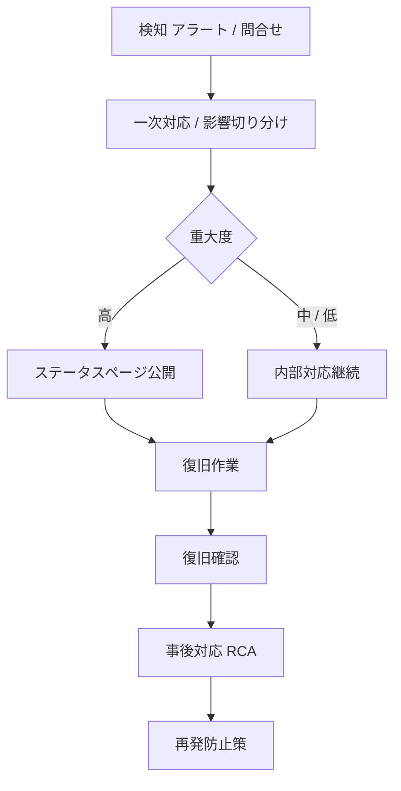

# 障害対応設計(メインシステム)

## 0. 文書情報

| 項目 | 内容 |
|---|---|
| 文書名 | 障害対応設計(メインシステム) |
| 運用ID | OPS-04 |
| 対象システム | FAQ AI ウィジェット SaaS / メインシステム |
| 作成日 | 2026-05-17 |
| 版数 | v1.0 |
| ステータス | 承認済 |

## 1. 障害対応方針(参照: NFR-801 / NFR-802 / NFR-810)

| ID | 区分 | 要件 |
|---|---|---|
| NFR-801 | 障害対応 | 障害時にエラー表示、再試行案内、運用確認、ステータス通知ができること |
| NFR-802 | 障害対応 | 障害発生時のエスカレーションフローを定めること |
| NFR-803 | バックアップ | データ越境ゼロを担保するため、バックアップは日本リージョン(apac)内で完結させること。日次・週次・月次の三層スナップショットを R2 内の別オブジェクトとして冗長保管。**訓練未達時の対応**: 訓練で RTO 4h または RPO 15min を達成できなかった場合は、(a) 30 日以内に改善計画を策定し運営チーム + PO に提出、(b) 90 日以内に再訓練、(c) 連続 2 回失敗した場合はサービス縮退または利用規約改定を経営層判断とすること |
| NFR-804 | 監視 | 主要 KPI を監視し、しきい値超過時にアラート通知できること(詳細は [01_監視設計.md](01_監視設計.md))|
| NFR-805 | プライバシー保護 | AI 回答およびチャット投稿から個人情報を検出しマスキングする仕組みを備えること |
| NFR-806 | 監視 | API エラー率やレイテンシなど主要 KPI の SLO しきい値を定義し、閾値を超過した場合にアラートを通知し自動復旧を試行できること |
| NFR-810 | DLQ 運用 | サービス間連携および外部 Webhook の Dead Letter Queue は (a) Cloudflare Queues DLQ 保持 4 日、R2 退避、(b) 1 時間以内自動指数 BO、以降は明示的リプレイ、(c) リプレイ可能範囲 30 日、(d) 滞留が IF 別上限を超過した瞬間に運営者へ high アラート |

## 2. 障害対応プロセス

| 段階 | 要件 |
|---|---|
| 検知 | 自動アラート(NFR-804)または利用者からの報告で検知 |
| 一次対応 | 対応着手までの目標時間を定める(オンコール体制 [06_運用手順.md](06_運用手順.md) §オンコール) |
| 切り分け | 影響範囲(全契約 / 特定契約 / 特定機能)を判定 |
| 復旧 | バックアップ、再起動、デプロイロールバックなどの手段を持つ |
| 事後対応 | 原因分析、再発防止策の策定、関係者への報告 |
| ステータス公開 | §4 障害告知 3 経路 |

## 3. 障害対応プロセス要件(参照: 要件 §14.2)

| 段階 | 要件 |
|---|---|
| 検知 | 自動アラートまたは利用者からの報告で検知できること |
| 一次対応 | 対応着手までの目標時間を定めること |
| 切り分け | 影響範囲(全契約 / 特定契約 / 特定機能)を判定できること |
| 復旧 | バックアップ、再起動、デプロイロールバックなどの手段を持つこと |
| 事後対応 | 原因分析、再発防止策の策定、関係者への報告 |
| ステータス公開 | 障害状態を利用者に告知できる手段を用意すること。手段は **公開ステータスページ + 管理画面のお知らせ受信箱(system 種別)+ 重大障害時のメール通知** の 3 経路を併用すること。ステータスページは Cloudflare 提供サービスまたは同等の SaaS の利用を可とする(基本設計で確定) |

## 4. 障害告知の 3 経路(参照: 要件 §14.2)

| 経路 | 用途 |
|---|---|
| 公開ステータスページ | サービス全体の稼働状況。**Cloudflare 提供サービスまたは同等の SaaS** を採用(MVP は Cloudflare Status Page) |
| 管理画面のお知らせ受信箱(system 種別) | オーナー / メンバー(ユーザー管理権限保持)向けの個別通知 |
| 重大障害時のメール通知 | 全オーナー / メンバー(ユーザー管理権限保持)・運営者へ |

3 経路を併用し、重大障害(`critical` 重要度)時には全経路を活用する。インシデント自動生成は NFR-804 critical アラートと連動。

## 5. DLQ 運用(参照: NFR-810)

| 観点 | 仕様 |
|---|---|
| Cloudflare Queues DLQ 保持 | **4 日間**(現行制限値)、これを超える保持が必要なイベントは R2 へコピー保存し `event_id` と保存パスを D1 で管理 |
| 自動再処理 | DLQ 投入から **1 時間以内** は自動指数 BO で再試行、それ以降は運営者の明示的リプレイ操作のみ(運営者側 SCR-097) |
| リプレイ可能範囲 | 直近 30 日 |
| 監視 | DLQ 滞留が IF 別上限を超過した瞬間に運営者 high お知らせ + メール通知 |

## 6. 復旧手段

| 種別 | 手段 | 参照 |
|---|---|---|
| アプリレベルロールバック | `wrangler rollback`(直前デプロイ) | [05_リリース・デプロイ設計.md](05_リリース・デプロイ設計.md) §ロールバック |
| DB スキーマロールバック | D1 Time Travel(最大 30 日) | [02_バックアップ・リストア設計.md](02_バックアップ・リストア設計.md) |
| データ復元 | R2 スナップショット(日次 30 日 / 週次 12 週 / 月次 12 ヶ月) | [02_バックアップ・リストア設計.md](02_バックアップ・リストア設計.md) |
| DLQ リプレイ | 運営者側 SCR-097 から手動リプレイ | §5 |
| KV キャッシュクリア | 詳細設計 §18.5.1 ロールバック後の状態キャッシュ整合性検証(runbook RB-008) | [05_リリース・デプロイ設計.md](05_リリース・デプロイ設計.md) |

## 7. 関連設計

| 種別 | 参照先 |
|---|---|
| 要件 | [../01_要件定義/index.md](../01_要件定義/index.md) §10.8 / §14.2 |
| 基本設計 | [../02_基本設計/index.md](../02_基本設計/index.md) §11.9 DLQ 運用 |
| 詳細設計 | [../03_詳細設計/index.md](../03_詳細設計/index.md) §16 / §18 |
| 監視 | [01_監視設計.md](01_監視設計.md) |
| バックアップ | [02_バックアップ・リストア設計.md](02_バックアップ・リストア設計.md) |
| リリース | [05_リリース・デプロイ設計.md](05_リリース・デプロイ設計.md) |
| 運用手順 | [06_運用手順.md](06_運用手順.md) §オンコール |

## 8. 未確定事項・確認事項

| 確認事項ID | 確認内容 | 優先度 | ステータス |
|---|---|---|---|
| - | v1.0 リリース時点で全項目確定済み | 低 | 確認済 |
