# FAQ AIウィジェット SaaS 顧客管理システム 基本設計書

| 項目 | 内容 |
|---|---|
| 文書種別 | 基本設計書 |
| 版 | v3.3 |
| 対象システム | FAQ AIウィジェット SaaS / 顧客管理システム(運営者コンソール) |
| サービス名 | open-faq |
| クラウド前提 | Cloudflare |
| アカウント管理 | 自前アカウント管理 |
| メール配信 | Resend |
| 課金プロバイダ | Stripe |
| 作成日 | 2026-05-08 |
| 最終改訂日 | 2026-05-14 |
| 位置づけ | 要件定義書(WHAT)と詳細設計書(実装可能粒度)の中間。要件 v2.6 の WHAT を、顧客管理システム(=サービス運営者向け運用コンソール)の HOW に展開する |
| 上位文書 | [02_admin/01_requirements.md](01_requirements.md)(要件定義 v2.6) |
| 関連文書 | [01_main/01_requirements.md](../01_main/01_requirements.md)(メイン要件 v2.6)、[01_main/02_basic_design.md](../01_main/02_basic_design.md)(メイン基本設計 v3.3) |

---

## 改訂履歴

| 版 | 日付 | 改訂内容 | 改訂者 |
|---|---|---|---|
| v1.0 | 2026-05-16 | 初版 | - |

---

## 0. 本書の前提

表記、採番、文書同期、基本設計と詳細設計の境界などの文書保守ルールは [CLAUDE.md](../CLAUDE.md) に置く。本書本文では、顧客管理システムの方式、構成、画面、機能、データ、連携、セキュリティ、非機能、運用設計を扱う。

### 0.1 基本設計の扱う範囲

本書は、要件定義 v2.4 の WHAT を顧客管理システムの HOW に展開する。Worker 名、OpenAPI、JSON Schema、DDL、cron UTC 式、実装関数名などの物理仕様は詳細設計で扱う。

### 0.2 運営者スコープ

「運営者」は `service_operator` ロールを持つアカウントを指す。本書では、管理者ユーザー、エンドユーザーの業務機能はメインシステム側の設計として参照する。

---

## 1. 本書の目的・位置づけ・スコープ

### 1.1 目的

本書は、FAQ AIウィジェット SaaS のうち **顧客管理システム**(=サービス運営者向け運用コンソール+運営者主管の連携 IF・Webhook 一次受信・課金確定 cron・監査基盤)について、要件定義 v2.4 を実装するための **HOW(どう実現するか)** を定める。要件定義は「何を実現するか」、本書は「どう実現するかの全体像」、詳細設計書は「実装可能な粒度」を担う。

### 1.2 位置づけ

```text
┌─────────────────────────┐
│ 要件定義書(02_admin/01_requirements.md v2.4) │ ← WHAT
└─────────────┬───────────┘
              │
┌─────────────┴───────────┐
│ 基本設計書(本書 v3.1)        │ ← HOW(全体像)
└─────────────┬───────────┘
              │
┌─────────────┴───────────┐
│ 詳細設計書                  │ ← HOW(実装粒度)
└─────────────────────────┘
```

本書は **MVP 範囲のみ** を記載する。MVP で実現する方式、初期値、運用制約だけを本文に置く。

### 1.3 対象スコープ

#### 1.3.1 本書の対象

| 区分 | 内容 | 要件参照 |
|---|---|---|
| 運営者コンソール画面 | SCR-090〜094, SCR-096〜099(削除データ参照/復元、AI 推論パラメータ、レート/予算上書き、お知らせ作成、運営者活動、Webhook リプレイ、PII 誤検出、ペイロード差分) | §8.19 / §8.18 / §8.20 |
| 運営者主管の連携 IF | #1 契約停止、#2 強制ログアウト、#4 復元実行、#5 レート制限上書き、#6 AI パラメータ上書き、#7 お知らせ生成、#10 課金 Webhook、#12 運営者操作通知 | §8.2 |
| 課金 Webhook 一次受信 | Stripe 署名検証・event_id 冪等性・ペイロード差分検出・DLQ・30 日リプレイ | FR-302 / NFR-310 / NFR-808 |
| 月次請求確定 cron | 月初 1 日 02:00 JST、無料枠超過分 × 単価、idempotent | FR-303 / AC-042 |
| 4-eyes 承認基盤 | MVP ハードゲート 3 操作 + 承認ログ 7 操作 | §6.3.3 |
| 運営者監査基盤 | ハッシュチェーン日次検証、3 区分保持(1y/5y/7y)、HMAC-SHA256 署名付きエクスポート | FR-229 / FR-232 / NFR-306 / NFR-602 |
| 削除データ参照・復元 | 論理削除データの参照・復元、FR-204 副作用ロールバック (a)〜(g) | §8.18 / FR-200〜FR-212 |
| PII 誤検出報告管理 | 3 営業日判定・KV ルール更新・過去データ修正なし | FR-064 / NFR-805 / AC-036 |
| AI 推論パラメータ 3 階層 | グローバル/オーナー/プロジェクト、保存即時有効、優先順位 プロジェクト > オーナー > グローバル | FR-061 / AC-034 |
| 運営者アカウント管理 | MFA 必須・IP 許可リスト・再認証 5 分・自己リセット禁止・単一 `service_operator` ロール | FR-220〜FR-226 / NFR-311 |

#### 1.3.2 メインシステム正本範囲

| 区分 | 内容 | 正本 |
|---|---|---|
| 利用者向け管理画面 | SCR-001〜025(ログイン、FAQ 管理、チャット、ウィジェット設定、お知らせ閲覧、退会 等) | メインシステム §8.18 / [01_main/02_basic_design.md](../01_main/02_basic_design.md) §5 |
| エンドユーザー向けウィジェット | 質問入力、AI 回答表示、解決可否回答、メール登録、個別チャット | メイン §6 / §8 |
| 利用者側 FAQ / 質問ログ / 個別チャット機能 | FAQ 登録・編集・公開、質問ログ、個別チャット部屋、未解決質問→FAQ 登録 | メイン §6 / §7 |
| AI 回答エンジン本体 | FAQ 根拠回答、信頼度判定、参照 FAQ 提示、プロンプト注入対策実装 | メイン §6.4 / §8.5 |
| メイン側状態遷移 | FAQ 状態、部屋状態、未解決質問対応状態、お知らせ既読状態 | メイン §4 |

#### 1.3.3 主管・補助の整理(連携 IF)

本書側を主管する連携 IF は #1, #2, #4, #5, #6, #7, #10, #12 の 8 件。残 2 件(#8 監視メトリクス、#9 不正利用検知通知)は本書側補助。

#### 1.3.4 要件 v2.4 で本文から退避した方式記述の正本化

| 退避した方式領域 | 本書の正本箇所 |
|---|---|
| 4-eyes ハードゲート、一時無効化、承認ログ | §3.3 / §6.3.1 / §6.3.13 |
| 課金 Webhook 一次受信、署名検証、差分検出、再処理待ち、リプレイ | §6.3.3 / §8.5 / §10.6 |
| 月次請求確定の冪等キー、実行スケジュール、訂正請求方式 | §6.3.5 / §8.5 / 詳細設計 |
| PII 誤検出報告、ルール更新、過去データ非修正 | §4.7 / §5.3.9 / §6.3.10 / §10.7 |
| レート制限・予算上限上書きの保存、反映、優先順位 | §5.3.4 / §6.3.8 / §11.7 |
| 運営者認証、MFA、IP 許可、ロックアウト、再認証 | §10.1〜§10.3 |
| 監査ログ検索・エクスポート、保持区分、ハッシュチェーン | §5.3.7 / §7.4 / §10.4 / §10.5 |

### 1.4 メインシステムとの責務分界

要件 §11.5 連携 IF マトリクスから、本書側主管 8 件の責務サマリ(詳細は §8 で再掲):

| # | 連携 IF | 本書側責務 | メイン側責務 |
|---|---|---|---|
| #1 | 契約停止イベント | 検知(Webhook 受信から判定) | 7 日猶予計測、状態遷移、画面制限 |
| #2 | 強制ログアウト | 操作元、対象範囲指定、監査記録 | 5 秒以内のセッション失効 |
| #4 | 復元実行 | 4-eyes 承認、副作用ロールバック駆動 | データ差し戻し |
| #5 | レート制限上書き | 設定保存(KV ミラー)、運営者承認 | エッジでの適用 |
| #6 | AI パラメータ上書き | 設定保存(KV、3 階層)、運営者承認 | 推論時の値解決 |
| #7 | お知らせ生成 | 下書き作成、配信予約 | メイン側 inbox 生成、メール送信 |
| #10 | 課金 Webhook | 一次受信、署名検証、event_id 冪等、差分検出、DLQ | 内部転送イベントの適用(サスペンション等) |
| #12 | 運営者操作通知 | 通知発火、集約窓 10 分 | 管理者ユーザー宛メール + 受信箱配信 |

### 1.5 法令対応スコープ

本書側で直接影響を受ける法令:

| 法令 | 影響箇所 | 物理化方針 |
|---|---|---|
| APPI 30 条(不適正利用禁止) | 監査ログ閲覧自体の記録(運営者が誰の何を見たかの追跡) | `audit.search` action コード(`retention_class='1y'`)で SCR-096 の検索操作を記録、`payload_json={filter, hit_count}` を保存 |
| APPI 33 条(開示請求) | MVP では運営者手動対応(チケット運用) | `inbox_messages` で運営者へ通知し手動対応 |
| GDPR 越境移転規制(46 条) | データリージョン管理 | MVP は Cloudflare apac リージョン固定で対応。EU 顧客の契約登録時の地域チェック・通知フローは §1.5.1 を参照 |
| 国税通則法・法人税法施行規則 | 課金エビデンスの **7 年保持**(NFR-602(c)) | `audit_logs.retention_class='7y'` で識別、`billing_invoices` は 7 年保持 |
| 電子帳簿保存法(真実性) | 取引データの改ざん防止 | 監査ログハッシュチェーン(`prev_hash || record_hash`)で担保、日次検証(D-04) |
| 電子帳簿保存法(可視性) | 「取引年月日 / 取引金額 / 取引先」3 検索要件(NTA ガイドライン) | SCR-096 または別画面で `billing_invoices` の検索 UI を提供(取引日範囲・金額範囲・owner_account_id 指定)。MVP 必須 |
| 電子帳簿保存法(関連書類保存) | 取引情報の **5 年保持**(運営者高権限操作は NFR-602(b) 5 年と整合) | `audit_logs.retention_class='5y'` |
| 改正電気通信事業法 | 外部送信規律(本書では利用者側 UI に影響、SCR-094 で運営者通知に明記) | SCR-094 で外部送信先一覧を運営者通知 |
| 特定電子メール法 | 運営者発のお知らせ・通知メール、送信者情報明示・オプトアウト導線 | メール本文末尾に **法人名・住所・問合せ先・配信停止 URL** を自動付与(運用必須項目)。`optOut=optional` 時も法人名・問合せ先は必須、`optOut=mandatory` 時は配信停止 URL も必須。詳細設計 §11.5 メールテンプレ規約に反映 |

#### 1.5.1 GDPR 越境移転規制への MVP 運用ガード

MVP は日本国内利用者を対象とし、データ保存リージョンは apac 固定とする。本節では MVP で誤契約を防ぐための運用ガードだけを定義する。

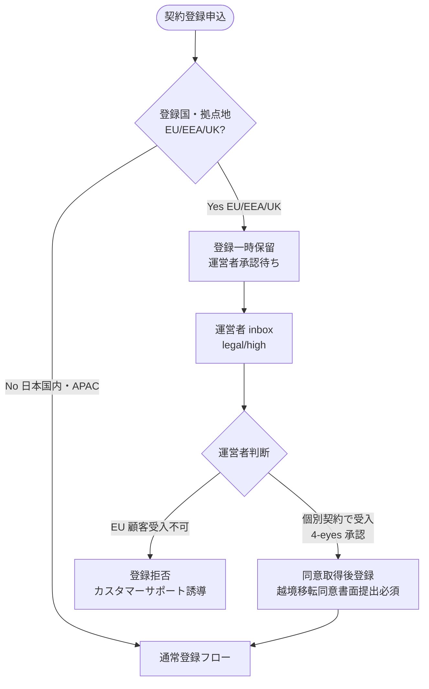
```mermaid
flowchart TD
    Start([契約登録申込]) --> RegionCheck{登録国・拠点地<br/>EU/EEA/UK?}
    RegionCheck -->|No 日本国内・APAC| Pass[通常登録フロー]
    RegionCheck -->|Yes EU/EEA/UK| Block[登録一時保留<br/>運営者承認待ち]
    Block --> NotifyOp[運営者 inbox<br/>legal/high]
    NotifyOp --> OperatorJudge{運営者判断}
    OperatorJudge -->|EU 顧客受入不可| Reject[登録拒否<br/>カスタマーサポート誘導]
    OperatorJudge -->|個別契約で受入<br/>4-eyes 承認| ApproveWithConsent[同意取得後登録<br/>越境移転同意書面提出必須]
    ApproveWithConsent --> Pass
```

**MVP 実装仕様**:

| 項目 | 仕様 |
|---|---|
| 検知点 | 契約登録フォーム(メイン SCR-002)で「事業所所在地」「主要顧客所在地」必須入力(任意項目だが運営者通知必須) |
| EU/EEA/UK 判定 | 国コード ISO 3166-1 alpha-2 のホワイトリスト方式。`AT, BE, BG, HR, CY, CZ, DK, EE, FI, FR, DE, GR, HU, IE, IT, LV, LT, LU, MT, NL, PL, PT, RO, SK, SI, ES, SE, IS, LI, NO, GB` を検知対象とする |
| EU 検知時の動作 | (1) `owner_registration_reviews.status='pending_legal_review'` に申込情報を保存し、`accounts.contract_status`(オーナー行) には書き込まない(4 値固定を維持)、(2) 運営者 inbox(legal/high)通知 + メール、(3) メイン側 SCR-002 完了画面に「審査中」表示。承認後に通常登録フローで `accounts.contract_status='active'` を作成し、拒否時は契約本体を作成しない |
| 4-eyes | MVP は法務確認書面の事後添付と監査ログ記録を必須とする |
| 同意取得書面 | EU 顧客と本 SaaS 提供者の間で「日本データセンター処理同意書」を別途締結。書面の保管は本 SaaS 提供者法務部の物理管理(SaaS 外)、書面 ID のみ `audit_logs(owner.legal_review.approve, ticket_id=<書面ID>, retention_class='5y')` に記録 |
| 監査ログ | `owner.legal_review.{detect,approve,reject}` の 3 action コード(retention_class='5y') |
| 既存契約の確認 | MVP 移行時点で `accounts` (is_owner=1) 既存全件を確認し、未確認の EU 拠点疑義は運営者 inbox に通知 |

**RB-023(EU 顧客検知時の対応)**: 「EU 顧客の登録試行を検知 → 法務エスカレーション → 受入可否判定 → 個別契約締結 or 拒否」の標準手順を Runbook として管理する。

---

## 2. アーキテクチャ設計

### 2.1 採用技術スタック

本書側で利用する技術スタックは要件 §16 制約条件に従い Cloudflare スタックで統一する。

| レイヤ | サービス | 用途 | 本書側での主な使用箇所 |
|---|---|---|---|
| エッジ実行 | Cloudflare Workers | 運営者 API、Webhook 受信、cron バッチ | 全章 |
| 静的配信 | Cloudflare Pages | 運営者コンソール SPA 配信(MVP 候補) | §5 |
| データベース | D1(SQLite 互換) | 運営者・監査・Webhook イベント等の永続化 | §7 |
| キャッシュ | KV(Key-Value) | AI パラメータ・レート/予算上書き・PII ルール・祝日マスタ | §6.3.8〜10, §10.7 |
| オブジェクト保管 | R2 | Webhook ペイロード退避(DLQ 30 日)、バックアップ三層スナップショット | §8.5, §11.5 |
| 非同期処理 | Queues | 運営者操作通知・お知らせ配信・DLQ | §6.3.12, §11.5 |
| AI 推論 | Workers AI | PII 第 1 / 第 3 層(MVP)、AnswerProvider 抽象 | §10.7, §8.7 |
| シークレット管理 | Secrets Store | マスター鍵保管(年次ローテーション)、HKDF-SHA256 派生 | §10.9 |
| Cron | Cron Triggers | 月次請求確定、ハッシュチェーン検証、お知らせ配信予約 | §6.3.5, §6.3.7, §6.6, §10.4 |
| 外部統合 | Resend | メール送信、Webhook(バウンス・苦情) | §9 |
| 外部統合 | Stripe | 決済処理、Webhook(支払成功/失敗/解除) | §8.5 |

### 2.2 全体構成図

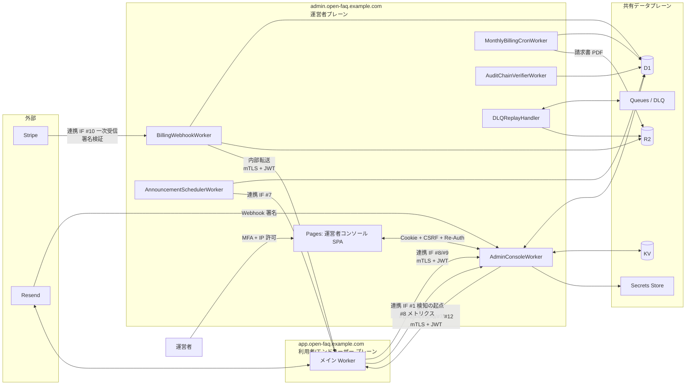
```mermaid
flowchart LR
    subgraph External[外部]
        Stripe[Stripe]
        Resend[Resend]
    end

    subgraph AdminPlane[admin.open-faq.example.com<br/>運営者プレーン]
        AdminUI[Pages: 運営者コンソール SPA]
        AdminWorker[AdminConsoleWorker]
        WebhookWorker[BillingWebhookWorker]
        BillingCron[MonthlyBillingCronWorker]
        ChainVerifier[AuditChainVerifierWorker]
        AnnScheduler[AnnouncementSchedulerWorker]
        DLQHandler[DLQReplayHandler]
    end

    subgraph DataPlane[共有データプレーン]
        D1[(D1)]
        KV[(KV)]
        R2[(R2)]
        Queues[Queues / DLQ]
        Secrets[Secrets Store]
    end

    subgraph MainPlane[app.open-faq.example.com<br/>利用者/エンドユーザー プレーン]
        MainWorker[メイン Worker]
    end

    Operator[運営者] -->|MFA + IP 許可| AdminUI
    AdminUI <-->|Cookie + CSRF + Re-Auth| AdminWorker
    AdminWorker <--> D1
    AdminWorker <--> KV
    AdminWorker -->|連携 IF #1/#2/#4/#5/#6/#7/#12<br/>mTLS + JWT| MainWorker
    MainWorker -->|連携 IF #8/#9<br/>mTLS + JWT| AdminWorker
    Stripe -->|連携 IF #10 一次受信<br/>署名検証| WebhookWorker
    WebhookWorker --> D1
    WebhookWorker --> R2
    WebhookWorker -->|内部転送<br/>mTLS + JWT| MainWorker
    Resend -->|Webhook 署名| AdminWorker
    Resend <--> MainWorker
    BillingCron --> D1
    BillingCron -->|請求書 PDF| R2
    ChainVerifier --> D1
    AnnScheduler --> D1
    AnnScheduler -->|連携 IF #7| MainWorker
    DLQHandler <--> Queues
    DLQHandler --> R2
    AdminWorker --> Secrets
    MainWorker -->|連携 IF #1 検知の起点<br/>#8 メトリクス| AdminWorker
```

### 2.3 コンポーネント責務一覧

| コンポーネント | 責務 | 関連 FR / NFR |
|---|---|---|
| `AdminConsoleWorker` | SCR-090〜094, SCR-096〜099 配信、運営者認証(MFA、IP 許可、再認証)、4-eyes 申請/承認 API、運営者向け REST API(`/admin/v1/*`) | FR-220〜232, NFR-311 |
| `BillingWebhookWorker` | Stripe Webhook 一次受信、署名検証、`event_id` 冪等、ペイロード SHA-256 比較、ペイロード差分検出(SCR-099)、DLQ 投入、内部転送(連携 IF #10) | FR-302, NFR-310, NFR-808 |
| `MonthlyBillingCronWorker` | 月初 1 日 02:00 JST に前月分の利用量集計、無料枠超過分 × 単価、`billing_invoices` 生成、idempotent key `(owner_account_id, billing_year_month)`、FR-148 / FR-187 を同期実行 | FR-303, AC-042 |
| `AuditChainVerifierWorker` | `audit_logs.prev_hash` チェーン日次全件再計算、不一致時は運営者 inbox(system/high)+ メール、検証実行ログ自体も監査記録 | NFR-306, RB-017 |
| `AnnouncementSchedulerWorker` | `announcement_drafts(scheduled_at)` を 1 分ポーリング、配信開始 5 分前まで取消可、配信実行で連携 IF #7 を呼出 | FR-149, FR-188, FR-189 |
| `DLQReplayHandler` | SCR-097 からの手動リプレイ要求を受信、R2 退避イベントの呼び戻し、最大 30 日のリプレイ範囲 | FR-302, NFR-809 |

### 2.4 デプロイ単位(決定事項 D-02)

**運営者プレーン(`admin.open-faq.example.com`)はメインプレーン(`app.open-faq.example.com`)と別 Worker(別 wrangler プロジェクト)で運用する。**

| 観点 | 採用理由 |
|---|---|
| 攻撃面の縮小 | 運営者画面・運営者 API は利用者向けエンドポイントから完全分離。IP 許可リスト・MFA・CSP を独立に強化できる |
| 独立デプロイ | 運営者機能の改修(SCR-090〜094, SCR-096〜099 / 連携 IF 主管)が利用者側のリリース計画に影響しない |
| ミドルウェア分離 | MFA TOTP 検証・IP 許可リスト判定・運営者セッション(8h)を運営者 Worker の入口で一括適用できる |
| 監査の局所性 | 運営者 Worker の全リクエストは監査ログ対象。利用者側 Worker は業務監査(1 年保持)のみ |
| シークレット境界 | Stripe Webhook シークレット・mTLS 秘密鍵を運営者 Worker のみが参照可、利用者側 Worker からは到達不可 |

wrangler プロジェクト構成の物理ファイル配置は詳細設計 §3 で扱う。本書では以下のディレクトリ分割を前提とする(参考):

```text
workers/
├── admin/             ← 運営者 Worker(本書スコープ)
│   ├── wrangler.toml
│   ├── src/
│   │   ├── console/         ← AdminConsoleWorker
│   │   ├── webhooks/stripe/ ← BillingWebhookWorker
│   │   ├── cron/billing/    ← MonthlyBillingCronWorker
│   │   ├── cron/audit/      ← AuditChainVerifierWorker
│   │   ├── cron/announce/   ← AnnouncementSchedulerWorker
│   │   └── dlq/             ← DLQReplayHandler
│   └── migrations/
└── main/              ← メイン Worker(メインシステム正本)
    └── ...
```

### 2.5 環境構成

要件 §14.5 と完全同一の構成を採用する(メイン §14.5 を正本参照)。本書側では運営者観点で以下を補足する。

| 環境 | 運営者観点の補足 |
|---|---|
| dev | 各開発者個別、合成データ、運営者アカウントはダミー TOTP |
| staging | 本番マスキング済みダンプを週次取込、運営者は本番と別 MFA セットアップ、IP 許可は社内 VPN のみ |
| prod | デプロイは **2 名承認**(GitHub OIDC + Environment Protection Rules)。**本番直接変更**は対応チケット ID 必須+全クエリを `audit_logs(retention_class='5y')` に記録(FR-229) |

マイグレーションは Wrangler D1 migrations、ダウンタイム無しのスキーマ変更は expand/contract 二段階(要件 §14.5 と整合)。

### 2.6 オーナー境界によるデータ分離方式の運営者側影響

メイン側のオーナー境界によるデータ分離方式は **単一 D1 + `owner_account_id` 列分離**(要件 §20.2 確定済)。運営者側の影響は以下:

| 影響項目 | 設計方針 |
|---|---|
| 運営者の横断参照 | 運営者は `owner_account_id` フィルタなしで全契約横断参照可。ただし FR-223 により本文(FAQ・チャット・PII 含む)は平常時閲覧不可、SCR-090 では直前主要属性プレビューのみ |
| `accounts_retired`(オーナー行スナップショット) 移送 | 物理削除完了時に `accounts.id` / `accounts.slug` を `accounts_retired`(オーナー行スナップショット) へ移送(NFR-707)。新規契約発行時のスラグ再利用禁止 |
| 認可境界 | 運営者 API は全て `accounts.user_type='service_operator'` をミドルウェアで検証、SCR-090〜094, SCR-096〜099 の各エンドポイントは追加で操作種別に応じた再認証・4-eyes チェック |
| エンドユーザー視点 | エンドユーザーは運営者プレーンに到達しない |
| クロス契約検知 | 連携 IF #8(メイン→本書、監視メトリクス)で全契約集計値のみ取得、個別本文は取得しない |

### 2.7 ドメイン分離方針

| 項目 | 運営者プレーン | 利用者/エンドユーザー プレーン |
|---|---|---|
| ドメイン | `admin.open-faq.example.com` | `app.open-faq.example.com`(管理画面)、`widget.open-faq.example.com`(ウィジェット配信、メイン主管) |
| Cookie スコープ | `Domain=admin.open-faq.example.com` 固定、`SameSite=Strict`、`Secure`、`HttpOnly` | メイン主管 |
| CORS | 完全閉(運営者 API は `admin.open-faq.example.com` 自身からのみ。`Access-Control-Allow-Origin` は固定値 1 件) | メイン主管 |
| CSP | `default-src 'self'` 最小、`frame-ancestors 'none'`(クリックジャック対策)、`form-action 'self'` | メイン主管(別 CSP) |
| TLS | Cloudflare Universal SSL + HSTS 1 年 + `includeSubDomains` | 同左 |

---

## 3. 利用者・権限設計

### 3.1 運営者ロール定義

| 項目 | 内容 |
|---|---|
| ロール識別子 | `accounts.user_type='service_operator'` |
| 適用範囲 | 本SaaS提供者の特定された自然人 1 名につき 1 アカウント(FR-220) |
| 認証要件 | MFA(TOTP または同等)必須(FR-221)、未設定時は管理画面・運営画面いずれにもログイン不可 |
| パスワード | Argon2id 採用、運営者強化プロファイル(NFR-304、利用者側より強化。具体パラメータは詳細設計) |
| セッション | MVP 初期値 8 時間(D-18) |
| 自己リセット | 禁止。MFA リセット・パスワード再設定は別運営者+本SaaS提供者側組織内承認(NFR-311) |
| 発行・無効化 | 既存運営者またはブートストラップ管理者のみ実行可(FR-220) |

### 3.2 運営者ロール(FR-225)

MVP は単一 `service_operator` ロールで運用する。運営者は SCR-090〜099 の運用機能を扱い、操作ごとの安全性は再認証、IP 許可リスト、4-eyes ハードゲート / 承認ログ、監査ログで担保する。

### 3.3 4-eyes 原則対象操作(MVP)

要件 §6.2.3 完全マップ:

| 段階 | 対象操作 | 実装 |
|---|---|---|
| **MVP ハードゲート(3 操作)** | (1) 契約物理削除(`deleted_pending → deleted`)<br/>(2) AI 推論パラメータ変更(信頼度/関連度しきい値・モデル切替)<br/>(3) マスター鍵ローテーション | `operator_approvals` テーブルでの申請→別運営者承認→実行の **フルワークフローを必須**。承認なしの実行は API 層で拒否(403)。承認待ち TTL 72h |
| **MVP 承認ログのみ(7 操作)** | (4) 契約無効化(`active → suspended`)<br/>(5) 契約復元(削除猶予中 → `active`)<br/>(6) 従量単価表・無料枠の改定(`pricing.update`)<br/>(7) 契約別レート制限・予算上限の上書き<br/>(8) 緊急ウィジェット強制停止<br/>(9) 削除データの復元(FR-204)<br/>(10) ハードゲート KV フラグ切替(`feature.hard_gate.toggle`) | 単独実行を許容、実行ログは `audit_logs(retention_class='5y')` に記録、SCR-096 で **事後可視化** |

**ハードゲート KV フラグの管理**: ハードゲート対象 action コードは実装定数(コード内 const)で持ち、KV `feature:hard-gate:<action_code>` は **緊急一時無効化(true → false 一時切替)のみ**(メイン要件 §6.2.1 区分3 セキュリティインシデント + §6.2.2 発動条件成立時に限る)。フラグ変更操作は (10) として 4-eyes 承認ログ対象(`feature.hard_gate.toggle`、`retention_class='5y'`)。誤操作で MVP 重大操作(`owner.physical_delete`)が単独実行可能になるリスクを排除する。

### 3.4 認可チェック層

リクエスト処理時の認可は以下の順序で行う。

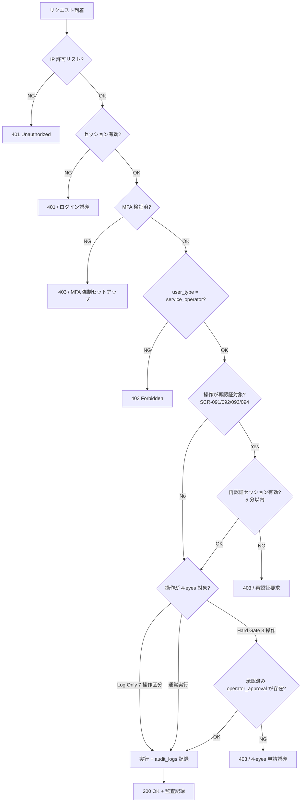
```mermaid
flowchart TD
    A[リクエスト到着] --> B{IP 許可リスト?}
    B -->|NG| X1[401 Unauthorized]
    B -->|OK| C{セッション有効?}
    C -->|NG| X2[401 / ログイン誘導]
    C -->|OK| D{MFA 検証済?}
    D -->|NG| X3[403 / MFA 強制セットアップ]
    D -->|OK| E{user_type = service_operator?}
    E -->|NG| X4[403 Forbidden]
    E -->|OK| F{操作が再認証対象?<br/>SCR-091/092/093/094}
    F -->|Yes| G{再認証セッション有効?<br/>5 分以内}
    F -->|No| H{操作が 4-eyes 対象?}
    G -->|NG| X5[403 / 再認証要求]
    G -->|OK| H
    H -->|Hard Gate 3 操作| I{承認済み operator_approval が存在?}
    H -->|Log Only 7 操作区分| J[実行 + audit_logs 記録]
    H -->|通常実行| J
    I -->|NG| X6[403 / 4-eyes 申請誘導]
    I -->|OK| J
    J --> K[200 OK + 監査記録]
```

### 3.5 運営者アカウント・ライフサイクル

| イベント | 実行可能者 | 監査記録 |
|---|---|---|
| 発行(`account.invite`) | 既存運営者(MVP は全員)/ ブートストラップ管理者 | `audit_logs(retention_class='5y')` |
| MFA 初回設定 | 本人(初回 72h セットアップトークン経由) | 同上 |
| MFA リセット | 別運営者+組織内承認 | 同上 |
| パスワード再設定 | 別運営者+組織内承認(自己リセット禁止) | 同上 |
| 無効化(`account.disable`) | 既存運営者 | 同上 |
| 再有効化(`account.enable`) | 既存運営者 | 同上 |

### 3.6 操作チケット ID 入力規約

要件 FR-224 / FR-231 に従い、運営者の高権限操作には対応チケット ID の入力を必須化する。

| 項目 | 仕様 |
|---|---|
| 形式 | 任意の文字列。推奨形式 `INC-XXXXX`(運営者側で規約定義) |
| 入力場所 | SCR-091〜094 / SCR-097(リプレイ操作)/ SCR-098(ルール更新)/ SCR-099(差分再処理)の各操作前モーダル |
| 監査記録 | `audit_logs.ticket_id` 列に保存、SCR-096 から逆引き検索可 |
| バリデーション | 必須・空白除外・最大 64 文字。形式バリデーションは MVP では緩く(任意文字列許容)|

---

## 4. 状態モデル設計

本章では本書側で主管する状態モデルを定義する。利用者側の状態モデル(FAQ 状態、部屋状態、未解決質問対応状態、お知らせ既読状態、契約状態遷移本体)はメインシステム §4 を正本参照する。

### 4.1 状態モデル一覧(本書主管)

| 状態モデル | 対象テーブル | 関連 FR / SCR |
|---|---|---|
| Webhook イベント状態 | `webhook_events.state` | FR-302, SCR-097, SCR-099 |
| 4-eyes 申請・承認状態 | `operator_approvals.state` | §6.3.3, FR-226 |
| お知らせ下書き状態 | `announcement_drafts.state` | FR-149, FR-188, FR-189, SCR-094 |
| PII 誤検出報告状態 | `pii_false_positive_reports.state` | FR-064, SCR-098 |
| Webhook ペイロード差分状態 | `webhook_payload_diffs.state` | FR-302 異常系, SCR-099 |

契約状態(`accounts.contract_status`(オーナー行))については本書側は検知元のみ。状態遷移本体・画面制御はメイン §4.9 を正本参照する。

### 4.3 Webhook イベント状態遷移(FR-302, NFR-808)

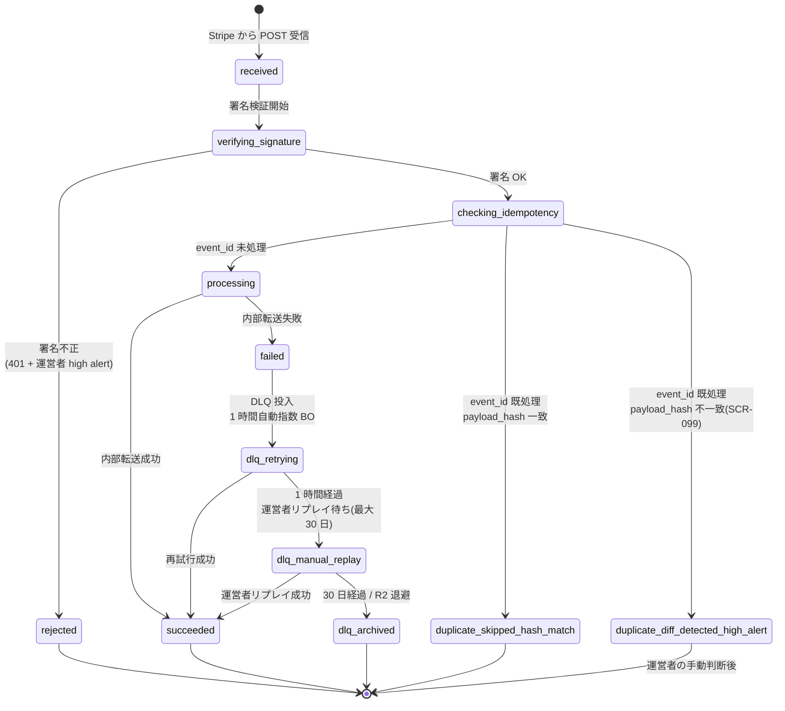
```mermaid
stateDiagram-v2
    [*] --> received: Stripe から POST 受信
    received --> verifying_signature: 署名検証開始
    verifying_signature --> rejected: 署名不正<br/>(401 + 運営者 high alert)
    verifying_signature --> checking_idempotency: 署名 OK
    checking_idempotency --> processing: event_id 未処理
    checking_idempotency --> duplicate_skipped_hash_match: event_id 既処理<br/>payload_hash 一致
    checking_idempotency --> duplicate_diff_detected_high_alert: event_id 既処理<br/>payload_hash 不一致(SCR-099)
    processing --> succeeded: 内部転送成功
    processing --> failed: 内部転送失敗
    failed --> dlq_retrying: DLQ 投入<br/>1 時間自動指数 BO
    dlq_retrying --> succeeded: 再試行成功
    dlq_retrying --> dlq_manual_replay: 1 時間経過<br/>運営者リプレイ待ち(最大 30 日)
    dlq_manual_replay --> succeeded: 運営者リプレイ成功
    dlq_manual_replay --> dlq_archived: 30 日経過 / R2 退避
    succeeded --> [*]
    duplicate_skipped_hash_match --> [*]
    duplicate_diff_detected_high_alert --> [*]: 運営者の手動判断後
    rejected --> [*]
    dlq_archived --> [*]
```

**遷移トリガー詳細**(§6.3.3, §6.3.4 で詳述):

| 遷移 | トリガー | 出力 |
|---|---|---|
| `received → verifying_signature` | Stripe-Signature ヘッダの HMAC-SHA256 検証開始 | - |
| `verifying_signature → rejected` | 検証失敗 | HTTP 401 即返却 + 運営者 inbox(system/high) |
| `checking_idempotency → duplicate_skipped_hash_match` | `webhook_events` に同一 `event_id` が存在し、正規化 JSON SHA-256 ハッシュが一致 | HTTP 200 OK + ログに `duplicate, skipped, hash_match` |
| `checking_idempotency → duplicate_diff_detected_high_alert` | 同一 `event_id` で `payload_hash` 不一致 | HTTP 200 OK + `webhook_payload_diffs` レコード作成 + 運営者 high alert + SCR-099 に表示 |
| `processing → failed` | メインへの内部転送が 5xx またはタイムアウト 30 秒 | DLQ 投入(Cloudflare Queues、4 日)+ R2 退避(30 日、`event_id` ベースのパス)|
| `dlq_retrying → dlq_manual_replay` | 1 時間経過(指数バックオフ最大 3 回完了)| SCR-097 にて運営者の手動リプレイ操作待ち |

### 4.4 契約状態の検知側責務(参照: メイン §4.9 / §9.10)

`accounts.contract_status`(オーナー行) の値域は要件 §3 で確定済の **`active` / `suspended` / `deleted_pending` / `deleted` の 4 値固定**。状態遷移本体・画面制御・ウィジェット 423 応答はメイン §4.9 / §9.10 が正本。本書側は以下の検知・駆動責務を持つ。

| イベント | 本書側責務 | 連携 IF |
|---|---|---|
| Stripe 支払失敗確定 Webhook 受信 | 受信・署名検証・冪等性チェック・内部転送 | #10 |
| 7 日猶予期間中の再決済リトライ | Stripe Smart Retries に委譲(本書側は監視のみ) | - |
| 7 日猶予経過判定 | メイン側で実施(検知元はメイン)。本書側は連携 IF #1 経由でイベント受領 | #1 |
| 規約違反による緊急 `suspended` 遷移 | 4-eyes 承認(Log Only)+ 連携 IF #1 でメインへ指示 | #1 |
| 支払い成功 Webhook 受信 → 自動 `active` 復旧 | 受信・転送 | #10 |
| 退会申請 → `deleted_pending` 遷移 | メイン側で実施 | - |
| `deleted_pending → active` 復元 | MVP は承認ログ + FR-204 副作用ロールバック (a)〜(g) 駆動 | #4 |
| `deleted_pending → deleted` 物理削除 | 4-eyes ハードゲート承認必須 + `accounts_retired`(オーナー行スナップショット) 移送 | - |

### 4.5 4-eyes 申請・承認状態遷移(`operator_approvals`)

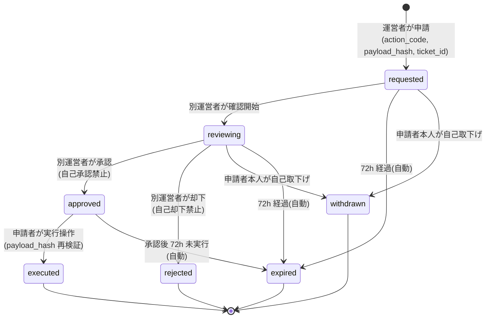
```mermaid
stateDiagram-v2
    [*] --> requested: 運営者が申請<br/>(action_code, payload_hash, ticket_id)
    requested --> reviewing: 別運営者が確認開始
    requested --> expired: 72h 経過(自動)
    requested --> withdrawn: 申請者本人が自己取下げ
    reviewing --> approved: 別運営者が承認<br/>(自己承認禁止)
    reviewing --> rejected: 別運営者が却下<br/>(自己却下禁止)
    reviewing --> withdrawn: 申請者本人が自己取下げ
    reviewing --> expired: 72h 経過(自動)
    approved --> executed: 申請者が実行操作<br/>(payload_hash 再検証)
    approved --> expired: 承認後 72h 未実行<br/>(自動)
    executed --> [*]
    rejected --> [*]
    withdrawn --> [*]
    expired --> [*]
```

**重要ルール**:

- **自己承認禁止**: `requested_by != approved_by` を DB 制約および API 層で二重チェック
- **自己却下禁止**: 別運営者の却下は `requested_by != rejected_by` を DB 制約および API 層で二重チェック。申請者本人による取下げは `withdrawn` 状態で表現する(`rejected` とは別意味)
- **payload 改ざん防止**: 承認時の payload と実行時の payload を SHA-256 で再検証、不一致は実行不可
- **承認後 TTL**: 承認後 72h 以内に実行されない場合は自動 `expired`、再申請が必要
- **ハードゲート対象操作のフラグ**: ハードゲート対象 action コードは詳細設計 §6.4 で確定する実装定数で管理し、KV `feature:hard-gate:<action_code>` は **緊急一時無効化のみ**(メイン要件 §6.2.1 区分3 セキュリティインシデント + §6.2.2 発動条件成立時に限る)。KV フラグの変更自体が 4-eyes 対象操作(`feature.hard_gate.toggle`、5y 監査)。MVP では `owner.physical_delete` / `ai_parameter.update` / `master_key.rotate` の 3 つのみハードゲート true

### 4.6 お知らせ下書き状態遷移(SCR-094, FR-149, FR-188, FR-189)

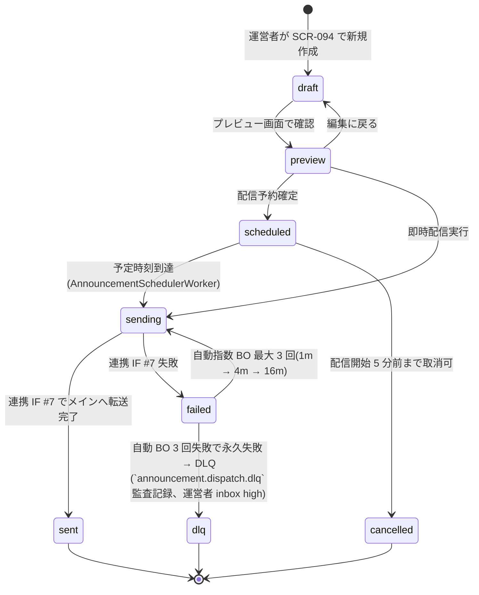
```mermaid
stateDiagram-v2
    [*] --> draft: 運営者が SCR-094 で新規作成
    draft --> preview: プレビュー画面で確認
    preview --> draft: 編集に戻る
    preview --> scheduled: 配信予約確定
    preview --> sending: 即時配信実行
    scheduled --> sending: 予定時刻到達(AnnouncementSchedulerWorker)
    scheduled --> cancelled: 配信開始 5 分前まで取消可
    sending --> sent: 連携 IF #7 でメインへ転送完了
    sending --> failed: 連携 IF #7 失敗
    failed --> sending: 自動指数 BO 最大 3 回(1m → 4m → 16m)
    failed --> dlq: 自動 BO 3 回失敗で永久失敗 → DLQ<br/>(`announcement.dispatch.dlq` 監査記録、運営者 inbox high)
    sent --> [*]
    cancelled --> [*]
    dlq --> [*]
```

### 4.7 PII 誤検出報告状態遷移(SCR-098, FR-064)

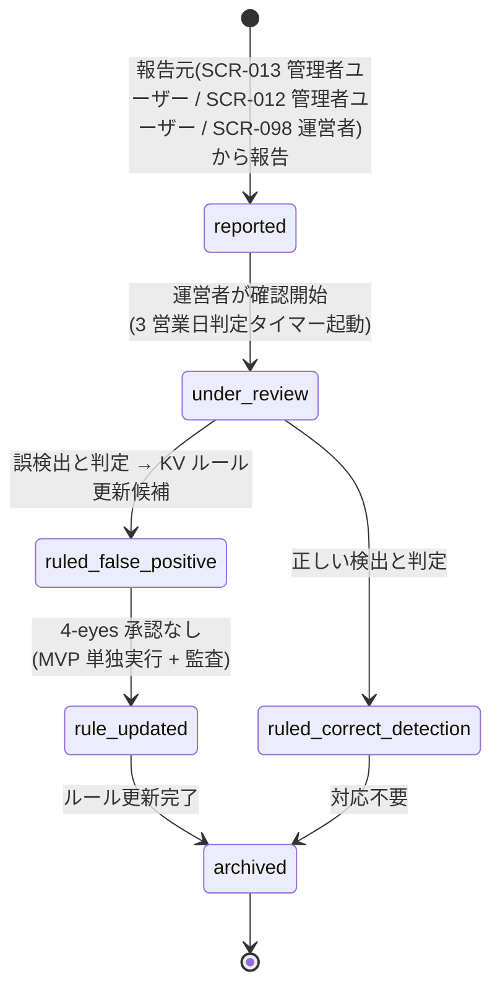
```mermaid
stateDiagram-v2
    [*] --> reported: 報告元(SCR-013 管理者ユーザー / SCR-012 管理者ユーザー / SCR-098 運営者)から報告
    reported --> under_review: 運営者が確認開始<br/>(3 営業日判定タイマー起動)
    under_review --> ruled_false_positive: 誤検出と判定 → KV ルール更新候補
    under_review --> ruled_correct_detection: 正しい検出と判定
    ruled_false_positive --> rule_updated: 4-eyes 承認なし<br/>(MVP 単独実行 + 監査)
    rule_updated --> archived: ルール更新完了
    ruled_correct_detection --> archived: 対応不要
    archived --> [*]
```

**3 営業日 SLA**: `reported → under_review` 後 3 営業日(営業日定義は §12.6)を超過すると運営者 inbox(system/normal)で督促。NFR-330 セキュリティ脆弱性 SLA(High = 7 日)との接続は §10.10 を参照。

### 4.8 Webhook ペイロード差分状態(SCR-099, FR-302 異常系)

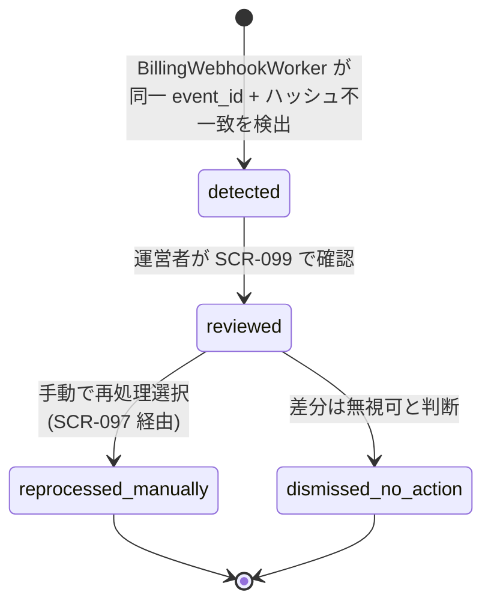
```mermaid
stateDiagram-v2
    [*] --> detected: BillingWebhookWorker が<br/>同一 event_id + ハッシュ不一致を検出
    detected --> reviewed: 運営者が SCR-099 で確認
    reviewed --> reprocessed_manually: 手動で再処理選択<br/>(SCR-097 経由)
    reviewed --> dismissed_no_action: 差分は無視可と判断
    reprocessed_manually --> [*]
    dismissed_no_action --> [*]
```

**重要**: ペイロード差分は自動上書きしない(FR-302 異常系)。運営者の手動判断のみで再処理可否を決定する。

---

## 5. 画面設計(SCR-090〜094, SCR-096〜099)

本章は、要件 §8.19 SCR 画面一覧マスタの本書側主管 9 画面について、画面項目・入出力種別・バリデーション・エラー表示を定義する。画面設計書（`wireframes.html`）・Figma は詳細設計に回す。要件 §8.19 注記に従い、本表に存在しない `SCR-XXX` は本文中で参照しない。

### 5.1 画面一覧

| SCR | 名称 | 主管 FR | 4-eyes 段階 | 再認証 |
|---|---|---|---|---|
| SCR-090 | 削除データ参照(運営者) | FR-200, FR-223 | なし | 不要 |
| SCR-091 | 削除データ復元 | FR-201〜FR-209, FR-211, FR-222 | MVP 承認ログのみ | 必須(5 分以内) |
| SCR-092 | AI 推論パラメータ設定(契約別上書き) | FR-055, FR-061〜FR-066, FR-222 | **MVP ハードゲート** | 必須 |
| SCR-093 | 契約別レート制限・予算上書き管理 | FR-121, FR-128, FR-224(b), §9.4 サプレスリスト復帰承認 | MVP 承認ログのみ | 必須 |
| SCR-094 | お知らせ作成・配信(運営者) | FR-149, FR-188, FR-189 | なし(配信予約は 5 分前まで取消可) | 必須 |
| SCR-096 | 運営者活動ダッシュボード(監査) | FR-229, FR-230, FR-232 | なし | 不要(参照のみ)/ エクスポートは記録対象 |
| SCR-097 | 課金 Webhook リプレイ・DLQ 操作画面 | FR-302, NFR-808 | なし | 必須(リプレイ実行時) |
| SCR-098 | PII 誤検出報告管理 | FR-060, FR-064, NFR-805 | なし | 必須(ルール更新時) |
| SCR-099 | Webhook ペイロード差分検出一覧 | FR-302 異常系, AC-041 | なし | 必須(手動再処理選択時) |
| SCR-AUTH | 運営者ログイン(URL 分離) | FR-220, FR-221, NFR-311 | なし | -(認証前) |
| SCR-AUTH-M1 | MFA 初回セットアップ | FR-220, RB-014, NFR-311 | なし | -(限定セッション) |
| SCR-APPROVALS | 承認待ち一覧(4-eyes) | FR-226, §6.2.3 | 4-eyes 中核画面 | 承認 / 却下時に必須(5 分以内) |
| SCR-APPROVALS-M1 | 4-eyes 承認申請モーダル | FR-226, §6.2.3, FR-231 | 申請発火点 | 必須(5 分以内) |
| SCR-APPROVALS-M2 | 4-eyes 承認 / 却下モーダル | FR-226, §6.2.3 | 承認 / 却下発火点 | 必須(5 分以内) |

### 5.2 共通 UI 部品

#### 5.2.1 既存共通部品

| 部品 | 配置 | 目的 |
|---|---|---|
| グローバルヘッダ | 全画面上部 | サービス名、運営者表示名、MFA バッジ(緑/赤)、運営者 inbox バッジ(未読件数)、ログアウト |
| サイドメニュー | 全画面左 | SCR-090〜094, SCR-096〜099 への遷移、未承認件数バッジ・DLQ 滞留バッジ・PII 未判定バッジ(FR-471) |
| チケット ID 入力モーダル | SCR-091〜094 / 097 / 098 / 099 の操作前 | 対応チケット ID(任意文字列、最大 64 文字、必須)+ 操作種別の確認。placeholder で受付例(`JIRA-12345` / `INC-001` / `#1234`)を提示、未入力時は Primary 非活性化(FR-458) |
| 再認証モーダル | SCR-091〜094 / 097 / 098 / 099 の操作前(過去 5 分以内に再認証していない場合) | パスワード再入力(MVP)+ 操作 1 回限り。**残時間 5 分カウントダウンを常時表示**(FR-457) |
| 4-eyes 申請モーダル | SCR-092 / マスター鍵ローテ / 契約物理削除 | 申請理由・対象操作・payload **要約**(変更前 → 変更後の対比)を主表示、生 JSON は折り畳み(FR-455) |
| 4-eyes 承認モーダル | 別運営者のホーム画面の「承認待ち」リスト経由 | 申請内容確認・承認/却下・コメント。`payload_hash` 不一致時は業務語で警告「申請内容が変更されている可能性があります」(FR-455)。自己承認は CTA 非活性化 + 補助文言「自分の申請は承認できません」(FR-456) |
| 運営者 inbox バッジ | ヘッダ右上 | 未読件数表示、ワンクリックで運営者 inbox 一覧画面へ。`critical` 申請通知は赤強調 |
| DLQ 滞留バッジ | サイドメニュー SCR-097 横 | DLQ 滞留件数(1 時間以上 / 24 時間以上)。24 時間以上は **赤強調**(FR-471) |

#### 5.2.2 UI/UX 共通要件で追加する部品(参照: 要件 §8.21〜§8.24)

メインシステム基本設計 §5.3.2 と同一の部品を運営者コンソールにも適用する。下記は運営者コンソール特有の運用ルール追加分:

| 部品 | 用途 | 主な仕様 |
|---|---|---|
| Breadcrumb | パンくず | 認証フローおよび全画面割込みモーダルを除く全画面に表示。最大 3 階層「ホーム / {SCR 群名} / {SCR 名}」(FR-470) |
| PageHeader | 画面タイトル + 1 行説明文 | 全画面の最上部(ヘッダー直下)。タイトルと説明文は SCR 別画面表を正本(FR-450) |
| ReauthBadge | 再認証必須操作の可視化 | Primary ボタン横に 🛡 アイコン + tooltip。FR-222 対象操作すべてに付与(FR-457) |
| ReauthCountdown | 再認証残時間表示 | 再認証モーダル内およびモーダル閉じた後のヘッダ右側に「再認証残 X:XX」を常時表示(FR-457) |
| HardgateBadge | 4-eyes ハードゲート可視化 | 紫枠 + ⚠ アイコン + tooltip「別運営者の承認が必要な操作です」。SCR-092 / マスター鍵ローテ / 契約物理削除の CTA に付与 |
| ApprovalStateBadge | 4-eyes 申請状態 | `requested`(青)/ `approved`(緑)/ `rejected`(赤)/ `withdrawn`(灰)を **色 + アイコン + テキスト** で表現(FR-490) |
| PayloadDiffViewer | 4-eyes 申請内容の対比 | 主表示は「変更前 → 変更後」のキー別対比、生 JSON は折り畳み(FR-455) |
| SelfApprovalGuard | 自己承認禁止の UI ガード | 自分の申請を開いたとき承認/却下 CTA を非活性化 + 補助文言「自分の申請は承認できません(他の運営者の承認が必要です)」(FR-456) |
| TicketIdField | 対応チケット ID 入力欄 | placeholder「例: JIRA-12345 / INC-001 / #1234」、未入力時 Primary 非活性化(FR-458) |
| PrecheckResultPanel | 副作用プリチェック結果(SCR-091) | 7 項目(a-g)を OK/NG/不要バッジで一覧表示、NG 詳細は折り畳み(基本設計 §6.3.2) |
| AppliedFilterChips | 適用済フィルタ表示 + クリア | 検索条件適用時にチップ表示、「すべてクリア」を常設(FR-460) |
| BulkActionBar | 一括操作バー | 一覧画面で複数選択時のみ画面下部固定で表示 |
| SummaryCard | KPI サマリーカード | 数字 + 単位 + 状態色 + 補助テキスト。SCR-HOME / SCR-096 等で使用 |
| LoadingSkeleton | スケルトン UI | 初期データ取得時のスピナー単独表示を回避(FR-480) |
| ProgressText | 進捗テキスト(3 秒超操作) | プリチェック実行、CSV エクスポート、Webhook リプレイ等で表示(FR-481) |
| Toast | 成功・警告・エラー通知 | 右上固定、成功 4 秒 / 警告 6 秒 / エラーは手動閉じ(FR-482) |
| PermissionTooltip | 権限不足のグレーアウト + 説明 | 「○○権限が必要です」を tooltip 表示(運営者ロール変動時に備える) |

#### 5.2.3 文言の共通基準(参照: 要件 §8.21、メインシステム基本設計 §5.3.3 と整合)

メインシステム基本設計 §5.3.3 と同じ文言基準を採用する。詳細設計の文言テンプレ集を正本とするが、設計レベルの基準として以下を固定する:

| 種別 | 運営者コンソール固有テンプレ | 例 |
|---|---|---|
| 画面タイトル | 名詞(機能名) | 「削除データ参照」「AI 推論パラメータ」「承認待ち」 |
| 画面説明文 | 動詞句(1 行) | 「論理削除済みのリソースを検索・参照します」 |
| ボタン(主操作) | 具体動詞 + する | 「復元する」「申請する」「承認する」「却下する」 |
| ボタン(取消) | 「キャンセル」固定 | — |
| 確認モーダル タイトル | 「{動詞}しますか?」 | 「リソースを復元しますか?」 |
| 確認モーダル 本文 | 操作結果 + 影響範囲 + 取消可否 | 「{契約名}の {リソース ID} を復元します。副作用(a)〜(g)が連動して回復します。取り消しはできません」(FR-454) |
| 4-eyes 申請完了 | 「申請を送信しました。承認待ち一覧から状況を確認できます」 | — |
| `payload_hash` 不一致 | 「申請内容が変更されている可能性があります。最新の内容を確認してから承認してください」(FR-455) | — |
| 自己承認ガード | 「自分の申請は承認できません(他の運営者の承認が必要です)」(FR-456) | — |

**禁則語(単独使用を禁止)**: 「OK」「実行」「処理する」「確定」「送信」「こちら」「エラーが発生しました」「不正な値です」「失敗しました」(FR-452 / FR-453)。代替表現は詳細設計の文言一覧を参照。

### 5.3 各画面の項目定義

#### 5.3.1 SCR-090 削除データ参照(運営者)

| 区分 | 項目 | 入出力 | バリデーション | エラー表示 | 関連 FR |
|---|---|---|---|---|---|
| 検索条件 | 契約検索(ID/名前) | 入力(部分一致) | 最大 100 文字 | - | FR-200 |
| 検索条件 | リソース種別 | 選択(複数可) | `owner` / `project` / `faq` / `account` / `announcement` | - | FR-200 |
| 検索条件 | 削除種別 | 選択(複数可) | `deleted` / `disabled` / `deleted_pending` | - | FR-200 |
| 検索条件 | 削除日範囲 | 入力(日付範囲) | from ≤ to、最大期間 1 年 | 期間不正 | FR-200 |
| 一覧 | リソース ID | 出力 | - | - | FR-200 |
| 一覧 | 契約 ID/スラグ | 出力 | - | - | FR-200 |
| 一覧 | 種別 | 出力 | - | - | FR-200 |
| 一覧 | 削除日時 | 出力 | - | - | FR-200 |
| 一覧 | 削除種別 | 出力 | - | - | FR-200 |
| 詳細 | 直前主要属性プレビュー | 出力 | **本文は非表示**(FR-223) | - | FR-223 |
| 詳細 | 物理削除予定日 | 出力 | `deleted_pending` の場合のみ | - | NFR-704 |
| 詳細 | 復元ボタン(SCR-091 遷移) | 操作 | 物理削除済(`deleted` 完了後)は非活性 | 404 表示(FR-209) | FR-209 |
| エラー | 物理削除済参照 | - | - | 「物理削除済のため復元不可」(FR-209)| FR-209 |

#### 5.3.2 SCR-091 削除データ復元

**ページヘッダ(参照: FR-450)**:
- タイトル「削除データ復元」
- 説明文「論理削除済みのリソースを副作用プリチェック後に復元します(運営者操作)」

**画面構成**: 上から (1) 復元対象情報、(2) 入力フィールド(理由・チケット ID)、(3) **副作用プリチェック結果セクション**、(4) 実行 CTA(タブで「4-eyes 申請」と「即時実行(承認ログ)」を切り替え)。

| 区分 | 項目 | 入出力 | バリデーション | エラー表示 | 関連 FR |
|---|---|---|---|---|---|
| 表示 | パンくず | 出力 | 「ホーム / 削除データ参照 / 復元」(FR-470) | - | FR-470 |
| 表示 | 復元対象サマリ | 出力 | リソース ID / 種別 / 契約名 / 削除日時 / 直前主要属性プレビュー(FR-223 範囲のみ) | - | FR-201, FR-223 |
| 入力 | 復元対象 ID | 入力(SCR-090 から遷移) | 必須 | 必須エラー | FR-201〜205 |
| 入力 | 復元理由 | 入力(テキストエリア、最大 1000 文字、文字数カウンタ表示) | 必須、最大 1000 文字 | 「復元理由を入力してください」 | FR-206, FR-453 |
| 入力 | 対応チケット ID | TicketIdField | 必須、最大 64 文字、placeholder「例: JIRA-12345 / INC-001 / #1234」 | 「対応チケット ID を入力してください」 | FR-231, FR-458 |
| 入力 | 再認証(過去 5 分以内に未実行の場合) | 入力(パスワード) | 必須 | 「再認証に失敗しました。パスワードをご確認の上、もう一度お試しください」 | FR-222, FR-453 |
| 表示 | **プリチェック結果ステータス帯** | アラート帯 + 折り畳み詳細 | 7 項目(a〜g)の結果を「全 OK / 一部 NG / 全 NG」で集約表示。NG がある場合は赤背景、すべて OK は緑背景。詳細はアコーディオン展開 | 「プリチェックで NG 項目があります。詳細を確認してください」 | FR-204 |
| プリチェック | 副作用ロールバック (a) Stripe サブスクリプション再開可否 | 出力(行 + 状態バッジ) | OK / NG / 不要 | NG 時は赤バッジ + 理由表示 | FR-204(a) |
| プリチェック | 副作用ロールバック (b) Webhook DLQ 滞留イベント数 | 出力 | 件数表示 + 詳細リンク → SCR-097 | - | FR-204(b) |
| プリチェック | 副作用ロールバック (c) お知らせ受信箱配信保留分 | 出力 | 件数表示 | - | FR-204(c) |
| プリチェック | 副作用ロールバック (d) ウィジェット再有効化可否 | 出力 | OK / NG / 不要 | NG 時は赤バッジ | FR-204(d) |
| プリチェック | 副作用ロールバック (e) Stripe customer_id 整合性 | 出力 | OK / NG | NG 時は赤バッジ + 理由 | FR-204(e) |
| プリチェック | 副作用ロールバック (f) 進行中登録完了・再入室トークン処置 | 出力 | 件数表示 | - | FR-204(f) |
| プリチェック | 副作用ロールバック (g) 監査・エラーログ参照ポインタ整合 | 出力 | OK / NG | NG 時は赤バッジ | FR-204(g) |
| 操作 | プリチェックを実行 | 操作(Primary、ProgressText 表示) | プリチェック未実行時、または入力変更後に活性化 | - | FR-481 |
| 表示 | 実行モードタブ | 出力(タブ) | 「4-eyes 申請」「即時実行(承認ログ)」の 2 タブで切替(誤クリック防止)。MVP ハードゲート対象は「4-eyes 申請」タブのみ表示、その他は両タブ表示 | - | §6.3.3, FR-454 |
| 操作 | **4-eyes 申請する**(申請タブ) | 操作(Primary + 🛡 HardgateBadge) | プリチェック全 OK 必須、SCR-APPROVALS-M1 へ遷移 | 二人目承認待ち | §6.3.3 |
| 操作 | **復元を実行する**(即時タブ) | 操作(Primary、Danger 寄り + 再認証 🛡) | プリチェック全 OK 必須、対応チケット ID 入力 + 再認証で実行 | 「他の運営者が処理中のため復元できません。少し時間を置いて再度お試しください」(423 Locked) | FR-204 異常系, FR-453 |
| 表示 | 結果トースト | 出力 | 「復元しました。副作用 (a)〜(g) の連動回復は監査ログを参照してください」 | - | FR-208 |
| 完了 | 監査ログ表示(`owner.restore` / `faq.restore` / etc.) | 出力 | 操作者・対象・理由・チケット ID・変更前後ステータス | - | FR-208 |
| 完了 | 管理者ユーザー通知発火 | 出力 | FR-211 と整合(10 分集約窓) | - | FR-211 |

**異常系**:

- deletion-queue が物理削除を進行中で `423 Locked` 取得失敗 → 復元中止、運営者 inbox(system/high)
- 副作用 (a)〜(g) のいずれかがロールバック失敗 → トランザクション全体ロールバック、`deleted_pending` に戻す
- バックグラウンドジョブで物理削除完了済(`deleted` 状態)→ 404 + 「物理削除済のため復元できません」(FR-209 案内)

**主要文言(SCR-091)**:

| 用途 | 文言 |
|---|---|
| 復元理由 placeholder | 「対応チケットの内容と復元判断の根拠を簡潔にご記入ください(申請履歴に残ります)」 |
| プリチェック実行ボタン | 「プリチェックを実行」 |
| プリチェック全 OK | 「✅ プリチェック全項目 OK。復元できます」 |
| プリチェック一部 NG | 「⚠ プリチェックで NG 項目があります。詳細を確認してください」 |
| 4-eyes 申請ボタン | 「4-eyes 申請する」(⚠ HardgateBadge 付き) |
| 即時実行ボタン | 「復元を実行する」(🛡 再認証必須) |
| 復元実行確認モーダル(`AdminConfirmDialogs.restore`) タイトル | 「リソースを復元しますか?」 |
| 同上 本文 | 「{ownerName} の {resourceLabel} を復元します。副作用 (a)〜(g) が連動して回復します。取り消しはできません」 |
| 同上 Primary | 「復元する」(再認証 🛡) |
| 完了トースト | 「復元しました。副作用 (a)〜(g) の連動回復は監査ログを参照してください」 |
| 競合エラー | 「他の運営者が処理中のため復元できません。少し時間を置いて再度お試しください」 |
| 物理削除済エラー | 「物理削除済のため復元できません」 |

#### 5.3.3 SCR-092 AI 推論パラメータ設定(契約別上書き)

**ページヘッダ(参照: FR-450)**:
- タイトル「AI 推論パラメータ」
- 説明文「信頼度・関連度しきい値とモデルを階層別に設定します(4-eyes ハードゲート対象)」

**画面構成**:
- 階層タブ: 「グローバル / 契約別 / プロジェクト別」(現在編集中の階層を明示)
- 編集セクション: しきい値 / モデル / 対応チケット ID / 申請理由
- ロールアウト進行可視化セクション(現在 % → 次回 % のステッパー)
- 変更履歴セクション(タブで「現在の値 / 過去 90 日履歴」を切替)

| 区分 | 項目 | 入出力 | バリデーション | エラー表示 | 関連 FR |
|---|---|---|---|---|---|
| 階層タブ | グローバル / 契約別 / プロジェクト別 | 選択 | - | - | FR-061, AC-034 |
| 表示 | **優先順位の可視化バナー** | 出力(情報パネル) | 「有効値 = min(プロジェクト, オーナー, グローバル)」を選択中の階層に応じて表示 | - | FR-061 |
| 入力 | 信頼度しきい値 | **スライダ + 数値入力併記** | 0.00〜1.00、0.01 刻み | 「信頼度しきい値は 0.00〜1.00 で入力してください」 | FR-061, FR-453 |
| 入力 | 関連度しきい値 | スライダ + 数値入力併記 | 0.00〜1.00、0.01 刻み | 「関連度しきい値は 0.00〜1.00 で入力してください」 | FR-061, FR-453 |
| 入力 | 使用モデル | 選択(プルダウン、検索付き) | KV `ai-models:available` から | 「指定のモデルは利用できません。他のモデルを選択してください」 | FR-059, FR-065 |
| 入力 | 申請理由 | 入力(テキストエリア、最大 1000 文字、文字数カウンタ) | 必須 | 「変更理由を入力してください(申請履歴に残ります)」 | FR-453 |
| 入力 | 対応チケット ID | TicketIdField | 必須、最大 64 文字 | 「対応チケット ID を入力してください」 | FR-231, FR-458 |
| 入力 | 再認証(5 分以内) | 入力(パスワード) | 必須 | 「再認証に失敗しました。パスワードをご確認の上、もう一度お試しください」 | FR-222, FR-453 |
| 操作 | **4-eyes 申請する** | 操作(Primary + HardgateBadge ⚠) | 別運営者承認必須(MVP ハードゲート) | `AdminMessages.selfApprovalBlocked`「自分の申請は承認できません」 | §6.3.3, FR-456 |
| 表示 | **ロールアウト進行ステッパー** | Timeline(段階表示) | 「0% → 10% → 50% → 100%」で現在の段階を強調(`aria-current="step"`)、次回ステップは「現在 10% → 次回 50%」のように予告表示 | - | FR-065 |
| 操作 | 次のステージへ進める(段階ロールアウト) | 操作(Primary) | 各段階で監査ログ記録、4-eyes 再申請 | - | FR-065 |
| プレビュー | 設定値の保存即時有効通知 | 出力(完了トースト) | 「AI パラメータを更新しました。次回ハイドレーション(60 秒以内)から有効になります」 | - | FR-055, FR-061 |
| 履歴タブ | 過去の変更履歴 | 出力(テーブル) | 直近 90 日。各行に申請者・承認者・before/after・チケット ID・日時 | - | FR-229 |

**主要文言(SCR-092)**:

| 用途 | 文言 |
|---|---|
| 4-eyes 申請ボタン | 「4-eyes 申請する」(HardgateBadge ⚠) |
| 申請理由 placeholder | 「なぜこの変更が必要か簡潔にご記入ください(申請履歴に残ります)」 |
| 優先順位バナー | 「有効値 = min(プロジェクト, オーナー, グローバル)」 |
| ロールアウト進行ラベル | 「現在 {currentPercent}% → 次回 {nextPercent}%」 |
| 完了トースト | 「AI パラメータを更新しました。次回ハイドレーション(60 秒以内)から有効になります」 |
| 自己承認エラー | 「自分の申請は承認できません(他の運営者の承認が必要です)」 |

#### 5.3.4 SCR-093 契約別レート制限・予算上書き管理

| 区分 | 項目 | 入出力 | バリデーション | エラー表示 | 関連 FR |
|---|---|---|---|---|---|
| 検索 | 契約検索 | 入力 | - | - | FR-121, FR-128 |
| 一覧 | 契約別現在値表示(レート / 予算) | 出力 | - | - | FR-121, FR-128 |
| 入力 | レート制限上書き(`/widget/ask` req/min) | 入力 | 1〜10000 req/min | 範囲エラー | FR-128, FR-224(b) |
| 入力 | チャット投稿レート(エンドユーザー側) | 入力 | 秒数 + 件数/分 | 範囲エラー | FR-128 |
| 入力 | チャット投稿レート(管理者ユーザー側) | 入力 | 秒数 + 件数/分 | 範囲エラー | FR-128 |
| 入力 | 月次予算上書き(円) | 入力 | 1 円刻み、KV `budget-limit:min` / `budget-limit:max` 範囲内 | 範囲エラー | FR-121 |
| 入力 | 上書き理由 | 入力 | 必須、最大 1000 文字(`audit_logs.before_value/after_value` に保存) | 必須エラー | FR-121(c) |
| 入力 | 対応チケット ID | 入力 | 必須 | 必須エラー | FR-231 |
| 入力 | 再認証 | 入力 | 必須 | 再認証エラー | FR-222 |
| 操作 | 保存(MVP 単独実行 + 承認ログ)| 操作 | - | - | §6.3.3 |
| サプレスリスト復帰承認 | 個別アドレス検索 | 入力 | メール形式 | - | §9.4 |
| サプレスリスト復帰承認 | 復帰承認ボタン | 操作 | 4-eyes Log Only | - | §9.4 |
| 完了 | 連携 IF #5 でメインへ即時反映 | 出力 | KV TTL 30s でメイン側エッジに反映 | - | 連携 IF #5 |
| 完了 | 管理者ユーザー通知発火(FR-211) | 出力 | 10 分集約窓 | - | FR-211 |

#### 5.3.5 SCR-094 お知らせ作成・配信(運営者)

**ページヘッダ(参照: FR-450)**:
- タイトル「お知らせ配信」
- 説明文「全契約・特定契約・ユーザー種別宛のお知らせを下書き・予約・即時配信で発信します」

**画面構成(4 段階ステッパー UI)**:
お知らせの配信フローを 4 段階で可視化し、誤クリック(特に即時配信)を防ぐ:

1. **作成・下書き**: 種別 / 重要度 / 宛先 / 件名 / 本文を入力 → 「下書き保存」
2. **テスト送信**: 運営者本人宛にテスト送信 → 表示確認
3. **配信予約**: 配信日時 + 対応チケット ID + 再認証 → `scheduled` 登録
4. **即時配信(オプション)**: 緊急時のみ。4-eyes 承認ログ対象、二段確認

| 区分 | 項目 | 入出力 | バリデーション | エラー表示 | 関連 FR |
|---|---|---|---|---|---|
| 表示 | ステッパー UI | 出力 | 現在ステップを `aria-current="step"` で強調 | - | FR-450, FR-490 |
| 入力 | 種別 | 選択 | `announcement` / `system` | - | FR-149, 要件 §12.5(メイン正本) |
| 入力 | 重要度 | 選択(色付きラジオ) | `low` / `normal` / `high` / `critical`。`critical` 選択時に注意喚起ヒント「critical は規約改定・重大セキュリティ通知・サスペンション確定などに限定」 | - | 要件 §12.5, FR-454 |
| 入力 | 宛先範囲 | 選択 | 全契約 / 特定契約(複数) / 特定ユーザー種別(admin) | 不正組合せ | FR-149 |
| 表示 | **想定配信件数の即時表示** | 出力 | 宛先確定時に「{recipientCount} 件に配信されます」を即時表示(誤宛先防止) | - | FR-454 |
| 入力 | 件名 | 入力 | 必須、最大 200 文字、HTML サニタイズ、文字数カウンタ | 「件名を入力してください」「件名は最大 200 文字までです」/ XSS 検出時に警告 | FR-149, R-011, FR-453 |
| 入力 | 本文 | 入力(リッチエディタ) | 必須、最大 10000 文字、HTML サニタイズ **二段階**(永続化前 + 表示時)、文字数カウンタ | 「本文を入力してください」/ XSS 検出時に警告 | FR-149, R-011, NFR-309, FR-453 |
| 入力 | オプトアウト可否 | 選択 | 規約改定・重要セキュリティ通知は強制送信(オプトアウト不可) | - | FR-149 |
| 入力 | 送信予定日時 | 入力(日時) | 現在時刻 ≤ 入力値、最大 30 日先 | 「送信予定日時は現在時刻より未来かつ 30 日以内で指定してください」 | FR-149, FR-453 |
| 入力 | 対応チケット ID | TicketIdField | 必須、最大 64 文字 | 「対応チケット ID を入力してください」 | FR-231, FR-458 |
| 入力 | 再認証 | 入力(パスワード) | 必須 | 「再認証に失敗しました」 | FR-222, FR-453 |
| プレビュー | 件名・本文(サニタイズ後 HTML) | 出力 | - | - | FR-149 |
| プレビュー | 宛先範囲・想定配信件数 | 出力 | - | - | FR-149 |
| 操作 | **ステップ 1: 下書き保存** | 操作(Primary) | 必須項目検証 | - | FR-149 |
| 操作 | **ステップ 2: テスト送信** | 操作(Primary、運営者本人宛) | ステップ 1 完了後活性化 | - | FR-149 |
| 操作 | **ステップ 3: 配信予約** | 操作(Primary 🛡) | ステップ 2 完了 + 送信予定日時必須 | 過去日時エラー | FR-149 |
| 操作 | 配信予約取消 | 操作 | 配信開始 **5 分前まで** 取消可、5 分以内は不可 | 「配信開始 5 分前を過ぎたため取消できません」 | FR-149, FR-453 |
| 操作 | **ステップ 4: 即時配信(緊急時)** | 操作(Danger + HardgateBadge ⚠ + 二段確認) | 確認モーダル + 再認証 + 4-eyes 承認ログ。即時配信はステッパー UI 上で別エリア(赤枠)に視覚的に分離し、誤クリックを防止 | - | FR-149, FR-454 |
| 操作 | 訂正告知発行(配信開始後) | 操作 | 別 SERVICE_ANNOUNCEMENT として新規発行(訂正リンクで紐付け) | - | FR-149 |
| 完了 | 連携 IF #7 でメインへ配信指示 | 出力 | メイン側で `inbox_messages` 生成 + メール送信 | - | FR-188, FR-189 |
| エラー | XSS パターン検出 | - | 拒否または除去 | 「危険な HTML 要素が含まれています。スクリプトタグなどを取り除いてください」 | R-011, NFR-309, FR-453 |

**主要文言(SCR-094)**:

| 用途 | 文言 |
|---|---|
| ステップ 1 ボタン | 「下書きを保存」 |
| ステップ 2 ボタン | 「テスト送信(自分宛に送る)」 |
| ステップ 3 ボタン | 「配信を予約する」(🛡 再認証必須) |
| ステップ 4 ボタン | 「即時配信する」(⚠ HardgateBadge + Danger) |
| critical 選択時注意 | 「critical は規約改定・重大セキュリティ通知・サスペンション確定などに限定してください」 |
| 想定配信件数表示 | 「{recipientCount} 件に配信されます」 |
| 即時配信確認モーダル(`AdminConfirmDialogs.immediateAnnouncement`) タイトル | 「お知らせを即時配信しますか?」 |
| 同上 本文 | 「配信対象: {audienceSummary}({recipientCount} 件)。即時配信は取り消しできません(4-eyes 承認ログ対象)」 |
| 同上 Primary | 「即時配信する」 |
| 完了トースト(下書き) | 「下書きを保存しました」 |
| 完了トースト(予約) | 「配信を予約しました(開始 5 分前まで取消可能)」 |
| 完了トースト(即時配信) | 「即時配信を実行しました。配信状況はホーム画面で確認できます」 |
| 取消不可エラー | 「配信開始 5 分前を過ぎたため取消できません」 |

#### 5.3.7 SCR-096 運営者活動ダッシュボード(監査)

| 区分 | 項目 | 入出力 | バリデーション | エラー表示 | 関連 FR |
|---|---|---|---|---|---|
| 検索 | `action` | 入力(部分一致) | `<resource>.<verb>` 形式 | - | FR-232 |
| 検索 | `actor_id` | 入力(完全一致) | - | - | FR-232 |
| 検索 | `actor_type` | 選択 | `service_operator` / `admin` / `end_user` / `system` | - | FR-232 |
| 検索 | `target_id` / `target_type` | 入力(完全一致) | - | - | FR-232 |
| 検索 | `occurred_at` | 入力(期間範囲) | **最大検索期間 1 年** | 期間超過エラー | FR-232 |
| 検索 | `owner_account_id` | 入力 | 運営者は全契約横断可、管理者ユーザーは自契約のみ(FR-018 系)| - | FR-232 |
| 検索 | `ip_masked` | 入力(部分一致) | IPv4/IPv6 マスク済 | - | FR-232 |
| 検索 | `retention_class` | 選択 | `1y` / `5y` / `7y` / 全部 | - | NFR-602 |
| 検索 | `ticket_id` | 入力 | - | - | FR-231 |
| 一覧 | 操作日時 / actor / action / target / IP / チケット ID / retention_class | 出力 | カーソル方式 100 件/ページ | 100 万件超過は絞り込み再要求 | FR-232 |
| 詳細 | `before_value` / `after_value` の JSON 差分表示 | 出力 | - | - | FR-232 |
| エクスポート | 形式 | 選択 | CSV / JSON Lines | - | FR-232 |
| エクスポート | 1 ファイル最大 10 万行 | 出力 | 超過は自動分割 | - | FR-232 |
| エクスポート | HMAC-SHA256 署名付き | 出力 | ファイル末尾に `signature` 行(D-17) | - | FR-232 |
| エクスポート | エクスポート操作自体の監査記録 | 出力 | `audit_logs(retention_class='5y')` | - | FR-232 |
| 異常系 | KPI 表示(NFR-804 (k)(l)) | 出力 | 運営者操作頻度異常 / 全契約横断 MAU・解決率 | - | FR-230, NFR-804 |
| 異常系 | 運営者操作頻度異常検知 | 出力 | 同一運営者の短時間大量操作を強調表示 | - | FR-229(c) |

#### 5.3.8 SCR-097 課金 Webhook リプレイ・DLQ 操作画面

**ページヘッダ(参照: FR-450)**:
- タイトル「Webhook リプレイ・DLQ」
- 説明文「課金 Webhook の失敗イベントを手動リプレイ・破棄します(30 日リプレイ枠)」

**画面構成**: 上から (1) **滞留サマリ アラート帯**(危険度の高いものを優先)、(2) フィルタバー、(3) イベント一覧、(4) 詳細ペイン。

| 区分 | 項目 | 入出力 | バリデーション | エラー表示 | 関連 FR |
|---|---|---|---|---|---|
| 表示 | **滞留サマリ アラート帯** | アラート(画面上部固定) | 「24h+ 滞留: {N} 件 / 30 日近接(残 3 日以内): {M} 件」を常時表示。24h+ がある場合は赤、30 日近接は黄。0 件の場合は表示しない | - | FR-471, NFR-808, NFR-809 |
| 一覧 | 直近 30 日 Webhook イベント一覧 | 出力 | `event_id` / `received_at` / `state` / `dlq_path` | 30 日経過は archived 表示 | FR-302 |
| 一覧 | 状態フィルタ(QuickFilterChips) | チップグループ | プリセット「DLQ 滞留」「24h+ 滞留」「30 日近接」「全て」(FR-460) | - | FR-302, FR-460 |
| 一覧 | 詳細フィルタ(折り畳み) | チェックボックスグループ | `received` / `processing` / `succeeded` / `failed` / `dlq_retrying` / `dlq_manual_replay` / `dlq_archived` / `duplicate_*` | - | FR-302 |
| 表示 | 件数表示 | テキスト | 「1-50 / 全 N 件」(FR-459) | - | FR-459 |
| 一覧 | **リプレイ枠残日数 列** | 出力(行毎) | 各行に「リプレイ枠 残 N 日」表示。残 3 日以内は黄、残 0 日(枠超過)は赤背景 | - | NFR-808, NFR-809 |
| 一覧 | 滞留時間バッジ | 出力 | 1h+ は黄、24h+ は赤強調 | - | NFR-808 |
| 詳細 | Webhook ペイロード(R2 退避から呼び戻し)| 出力 | 機密フィールドはマスク。PayloadDiffViewer(§5.2.5)の要約モード優先 | - | FR-302, FR-455 |
| 詳細 | 過去のリプレイ履歴 | 出力(テーブル) | `dlq_replay_log` を時系列表示 | - | FR-302(c) |
| 詳細 | ペイロード差分リンク | リンク | SCR-099 への直接ジャンプ(該当イベントに差分検出があるとき) | - | FR-302 |
| 操作 | **リプレイする** | ボタン(Primary + 再認証 🛡 + 確認モーダル) | 1 時間自動 BO 完了後のみ活性化、受信から 30 日以内、対応チケット ID 必須 | 「自動 BO 中はリプレイできません({N}分後に再試行可能になります)」/「受信から 30 日を超えたためリプレイできません(R2 退避済み)」 | NFR-809, FR-453 |
| 操作 | **破棄する** | ボタン(Danger + 4-eyes 承認ログ + 再認証 🛡) | DLQ 確定イベントのみ。破棄は復元不可 | - | FR-454 |
| 操作 | リプレイ実行時のチケット ID 入力 | TicketIdField | 必須 | 「対応チケット ID を入力してください」 | FR-231, FR-458 |
| 完了 | 監査ログ記録(`webhook.replay` / `webhook.discard`、5 年保持)| 出力 | - | - | NFR-602(b) |

**主要文言(SCR-097)**:

| 用途 | 文言 |
|---|---|
| 滞留サマリ帯(全て 0) | (表示しない) |
| 滞留サマリ帯(24h+ のみ) | 「⚠ 24 時間以上滞留中のイベントが {N} 件あります。早急に確認してください」 |
| 滞留サマリ帯(30 日近接) | 「⏳ リプレイ枠 30 日に近づくイベントが {M} 件あります(残 3 日以内)」 |
| リプレイ確認モーダル(`AdminConfirmDialogs.webhookReplay`) タイトル | 「Webhook イベントをリプレイしますか?」 |
| 同上 本文 | 「イベント {eventId} を再処理キューに投入します。冪等性キーで二重課金は防止されます」 |
| 同上 Primary | 「リプレイする」(再認証 🛡) |
| 破棄確認モーダル(`AdminConfirmDialogs.webhookDiscard`) タイトル | 「DLQ イベントを破棄しますか?」 |
| 同上 本文 | 「イベント {eventId} を破棄します。破棄後は復元できません(4-eyes 承認ログ対象)」 |
| 同上 Primary | 「破棄する」(再認証 🛡 + Danger) |
| 完了トースト(リプレイ) | 「Webhook イベント {eventId} をリプレイしました」 |
| 枠超過エラー | 「受信から 30 日を超えたためリプレイできません(R2 退避済み)」 |
| 自動 BO 中エラー | 「自動 BO 中はリプレイできません({N}分後に再試行可能になります)」 |

#### 5.3.9 SCR-098 PII 誤検出報告管理

| 区分 | 項目 | 入出力 | バリデーション | エラー表示 | 関連 FR |
|---|---|---|---|---|---|
| 一覧 | 報告一覧 | 出力 | 状態(reported / under_review / ruled_*/ archived)、報告元(SCR-013 管理者ユーザー / SCR-012 管理者ユーザー / SCR-098 運営者) | - | FR-064 |
| 一覧 | 3 営業日判定タイマー残時間 | 出力 | 黄バッジ(残 1 日)、赤バッジ(超過)| - | AC-036 |
| 詳細 | 報告内容(マスキング前後)| 出力 | 機密項目は表示制限 | - | FR-064 |
| 詳細 | 検出層(第 1 層 / 第 2 層 / 第 3 層)| 出力 | NFR-805 | - | NFR-805 |
| 操作 | `under_review` 開始 | 操作 | 3 営業日タイマー起動 | - | FR-064, AC-036 |
| 操作 | `ruled_false_positive` 判定 | 操作 | ルール更新候補へ | - | FR-064 |
| 操作 | `ruled_correct_detection` 判定 | 操作 | アーカイブへ | - | FR-064 |
| 操作 | KV ルール更新(正規表現 / 分類器パラメータ)| 操作 | 再認証必須、チケット ID 必須、**過去データ修正なし**(今後の検出のみ)| - | FR-064(d), D-13 |
| 操作 | ルール更新の段階ロールアウト | 操作 | NFR-330 セキュリティ SLA 連動 | - | NFR-330 |
| 完了 | 監査ログ記録 | 出力 | `pii_rule.update` 等 | - | FR-229 |

#### 5.3.10 SCR-099 Webhook ペイロード差分検出一覧

| 区分 | 項目 | 入出力 | バリデーション | エラー表示 | 関連 FR |
|---|---|---|---|---|---|
| 一覧 | 同一 `event_id` + payload_hash 不一致イベント | 出力 | `detected_at` / `event_id` / `owner_account_id` | - | FR-302 異常系 |
| 一覧 | 状態 | 出力 | `detected` / `reviewed` / `reprocessed_manually` / `dismissed_no_action` | - | 本書 §4.8 |
| 詳細 | 既処理 payload と新 payload の JSON diff 表示 | 出力 | 除外フィールド(D-06)はグレーアウト | - | FR-302 異常系 |
| 詳細 | 除外フィールド一覧(D-06、付録 H 参照)| 出力 | - | - | D-06 |
| 操作 | 手動再処理(SCR-097 へ遷移)| 操作 | 再認証必須、チケット ID 必須 | - | RB-015 |
| 操作 | `dismissed_no_action` マーク | 操作 | 理由必須(自由記述) | - | RB-015 |
| 完了 | 監査ログ記録(`webhook.payload_diff.*`、5 年保持)| 出力 | - | - | NFR-602(b) |

#### 5.3.11 SCR-APPROVALS 承認待ち一覧(4-eyes)

**ページヘッダ(参照: FR-450)**:
- タイトル「承認待ち一覧(4-eyes)」
- 説明文「別運営者の承認が必要な申請を一覧表示します。自分の申請には『あなたの申請』バッジが付きます」

4-eyes 原則対象操作の申請を、申請者・承認者の双方が一覧できる画面。新規申請の発火は各操作画面(SCR-091 / SCR-092 / SCR-093 / 鍵ローテーション)、承認 / 却下の発火は本画面の行アクションから行う。新規申請モーダル(SCR-APPROVALS-M1)・承認 / 却下モーダル(SCR-APPROVALS-M2)はサイドメニューから直接アクセスせず、本画面または各操作画面から呼び出す。

| 区分 | 項目 | 入出力 | バリデーション | エラー表示 | 関連 FR |
|---|---|---|---|---|---|
| 表示 | クイックフィルタチップ | チップグループ | 「承認待ち(別運営者)」「あなたの申請」「期限切れ間近」「すべて」(FR-460) | - | FR-460 |
| 表示 | 件数表示 | テキスト | 「1-50 / 全 N 件」(FR-459) | - | FR-459 |
| 一覧 | 申請一覧 | 出力 | 状態 / 操作種別 / 申請者 / 期限切れ間近のフィルタ | - | FR-226 |
| 一覧 | **「あなたの申請」バッジ** | 出力 | 自分が申請者の行に表示(自己承認禁止の可視化) | - | FR-456 |
| 一覧 | 状態(ApprovalStateBadge) | 出力 | `requested` / `reviewing` / `approved` / `rejected` / `withdrawn` / `executed` / `expired` の 7 状態。色 + アイコン + テキストで識別(FR-490) | - | FR-226, FR-490 |
| 一覧 | 自己取下げと他者却下の区別 | 出力 | `withdrawn`(自己取下げ)と `rejected`(別運営者却下)を別表示 | - | 要件 §6.2.3 |
| 一覧 | 残時間カウントダウン | 出力 | 72h タイマー、残 24h 以内は黄、残 6h 以内は赤強調 | - | FR-226 |
| 操作 | 詳細表示 | 操作 | 自分が申請者 / 承認候補のいずれであっても閲覧可。申請者本人は SCR-APPROVALS-M2 で「自己取下げ」のみ可 | - | FR-226 |
| 操作 | 承認 / 却下 | 操作 → SCR-APPROVALS-M2 | 別運営者前提。自分の申請行では SelfApprovalGuard で非活性化 + 補助文言表示 | 「自分の申請は承認できません(他の運営者の承認が必要です)」 | FR-226, FR-456 |
| 操作 | 取り下げる(自分の申請のみ) | 操作 → SCR-APPROVALS-M2 | 申請者本人のみ表示 | - | FR-226 |
| 表示 | 空状態 | EmptyState | 「承認待ちはありません」(FR-451) | - | FR-451 |
| 表示 | ローディング状態 | LoadingSkeleton | テーブル行スケルトン 5 行(FR-480) | - | FR-480 |
| 完了 | 監査ログ記録 | 出力 | `approval.requested` / `approval.approved` / `approval.rejected` / `approval.withdrawn` / `approval.executed` / `approval.expired` | - | NFR-602(b) |

#### 5.3.12 SCR-APPROVALS-M1 4-eyes 承認申請モーダル

**モーダルヘッダ(参照: FR-450)**:
- タイトル「4-eyes 承認を申請する」+ action_code バッジ
- 本文上部「この操作には別の運営者の承認が必要です。申請後、他の運営者に通知が送信されます」

各操作画面で「4-eyes 申請」を起動すると開く独立画面。MVP ハードゲート 3 操作(契約物理削除 / AI 推論パラメータ変更 / マスター鍵ローテーション)と承認ログ対象操作(SCR-091 復元など)で共通利用する。

| 区分 | 項目 | 入出力 | バリデーション | エラー表示 | 関連 FR |
|---|---|---|---|---|---|
| 表示 | 操作種別 | 出力 | 親画面から自動連携(`action_code`) | - | FR-226 |
| 表示 | 対象操作の概要 | 出力 | 親画面から自動連携(`target_type` / `target_id` / `payload_hash`) | - | FR-226 |
| 表示 | **変更内容の要約(主表示)** | PayloadDiffViewer(要約モード) | 主要変更点を「変更前 → 変更後」のキー別対比で表示。例: 「契約 ID xxx のレート制限を 1,000/min → 5,000/min に変更」 | - | FR-226, FR-455 |
| 表示 | 生 JSON(折り畳み) | PayloadDiffViewer(raw モード) | 詳細を必要とする運営者向けに展開可能 | - | FR-455 |
| 入力 | 申請理由 | 入力(テキストエリア、最大 1000 文字、文字数カウンタ) | 必須 | 「変更理由を入力してください(申請履歴に残ります)」 | FR-226, FR-453 |
| 入力 | 対応チケット ID | TicketIdField | 必須、最大 64 文字、placeholder「例: JIRA-12345 / INC-001 / #1234」 | 「対応チケット ID を入力してください」 | FR-231, FR-458 |
| 表示 | **通知先表示** | 出力 | 「申請後、運営者 N 名(あなたを除く)に通知されます」を申請ボタン直上に表示 | - | FR-454 |
| 操作 | 申請する | 操作(Primary + 再認証 🛡) | 再認証検証 → `operator_approvals(state='requested')` INSERT → 全運営者 inbox 通知 | 再認証失敗 / 重複申請 / payload 改変 | FR-226 / 本書 §6.5 |
| 操作 | キャンセル | 操作(Secondary) | フォームを破棄してモーダルを閉じる | - | - |
| 完了 | 監査ログ記録(`approval.requested`、5 年保持) | 出力 | - | - | NFR-602(b) |

**呼出元**: SCR-091「復元実行」/ SCR-092「変更を実行」/ SCR-093「保存」/ 設定画面「鍵ローテーション」など 4-eyes 対象操作のボタン。URL は呼出元画面のままで、UI 上はモーダルオーバーレイとして提示する。

**主要文言(SCR-APPROVALS-M1)**:

| 用途 | 文言 |
|---|---|
| タイトル | 「4-eyes 承認を申請する」 |
| 本文上部 | 「この操作には別の運営者の承認が必要です。申請後、他の運営者に通知が送信されます」 |
| 申請理由 placeholder | 「なぜこの変更が必要か簡潔にご記入ください(申請履歴に残ります)」 |
| 通知先表示 | 「申請後、運営者 {N} 名(あなたを除く)に通知されます」 |
| Primary | 「申請する」(再認証 🛡) |
| 完了トースト(`AdminMessages.approvalRequested`) | 「申請を送信しました。承認待ち一覧から状況を確認できます」 |

#### 5.3.13 SCR-APPROVALS-M2 4-eyes 承認 / 却下モーダル

**モーダルヘッダ(参照: FR-450)**:
- タイトル「申請内容を確認する」(承認 / 却下を確実に判定するためのモーダル)

SCR-APPROVALS 一覧の行アクションから開く独立画面。申請者本人は「自己取下げ」のみ、別運営者は「承認」または「却下」を実行可能。

| 区分 | 項目 | 入出力 | バリデーション | エラー表示 | 関連 FR |
|---|---|---|---|---|---|
| 表示 | 申請者 | 出力 | `requested_by` + 申請日時 + 残時間(72h カウントダウン、残時間に応じて色変化) | - | FR-226 |
| 表示 | 対象操作 / 対象 | 出力 | `action_code` / `target_type` / `target_id` | - | FR-226 |
| 表示 | **変更内容の要約(主表示)** | PayloadDiffViewer(要約モード) | 「変更前 → 変更後」のキー別対比表示。生 JSON は折り畳み(FR-455) | - | FR-226, FR-455 |
| 表示 | 申請理由 | 出力 | 申請モーダルで入力された自由記述 | - | FR-226 |
| 表示 | 対応チケット ID | 出力 | 申請モーダルで入力された値 | - | FR-231 |
| 表示 | **payload_hash 不一致警告**(該当時のみ) | アラート(モーダル上部固定) | hash 不一致時に赤帯で「申請内容が変更されている可能性があります(payload_hash 不一致)。最新の内容を確認してから承認してください」+ 「最新を表示」「最新で再申請」リンク | - | FR-226, FR-455 |
| 表示 | **自己承認禁止ガード**(申請者本人の場合) | アラート(モーダル上部) + CTA 非活性化 | SelfApprovalGuard が「自分の申請は承認できません(他の運営者の承認が必要です)」を表示し、「承認」「却下」を非活性化(FR-456) | 「自分の申請は承認できません(他の運営者の承認が必要です)」 | FR-456 |
| 入力 | 承認コメント(任意) | 入力 | 最大 1000 文字 | 「コメントは最大 1000 文字までです」 | FR-226 |
| 入力 | 却下コメント(必須) | 入力 | 却下時は必須、最大 1000 文字 | 「却下理由を入力してください(申請者に通知されます)」 | FR-226, FR-453 |
| 操作 | **承認する**(右下、緑系 Primary、再認証 🛡) | 操作 | 別運営者前提、`approved_by` 設定 → `state='approved'` 遷移 → 申請者通知 | 自己承認禁止 / 期限切れ / payload 改変 | FR-226 / 本書 §6.5 |
| 操作 | **却下する**(左下、赤系 Danger、再認証 🛡) | 操作 | 別運営者前提、却下コメント必須、`rejected_by` 設定 → `state='rejected'` 遷移 → 申請者通知 | 自己却下禁止 / 期限切れ | FR-226 |
| 操作 | 取り下げる(自分の申請のみ) | 操作(再認証 🛡) | 申請者本人前提(別運営者は非活性)、`withdrawn_by` 設定 → `state='withdrawn'` 遷移 | - | FR-226 / 要件 §6.2.3 |
| 操作 | キャンセル | 操作(Secondary) | 何も変更せずモーダルを閉じる | - | - |
| 完了 | 監査ログ記録(`approval.approved` / `approval.rejected` / `approval.withdrawn`、5 年保持) | 出力 | - | - | NFR-602(b) |

**呼出元**: SCR-APPROVALS 行アクション「承認 / 却下」または「取下げ」。URL は SCR-APPROVALS のままで、UI 上はモーダルオーバーレイとして提示する。

**主要文言(SCR-APPROVALS-M2)**:

| 用途 | 文言 |
|---|---|
| タイトル | 「申請内容を確認する」 |
| 「承認する」ボタン | 「承認する」(右下・緑系・再認証 🛡) |
| 「却下する」ボタン | 「却下する」(左下・赤系 Danger・再認証 🛡) |
| 自己承認ガード(`AdminMessages.selfApprovalBlocked`) | 「自分の申請は承認できません(他の運営者の承認が必要です)」 |
| payload_hash 不一致(`AdminMessages.payloadHashMismatch`) | 「申請内容が変更されている可能性があります(payload_hash 不一致)。最新の内容を確認してから承認してください」 |
| 期限切れ(`AdminMessages.approvalExpired`) | 「申請は期限切れです(72 時間)。再申請が必要です」 |
| 却下コメント placeholder | 「却下する理由を簡潔にご記入ください(申請者に通知されます)」 |
| 完了トースト(承認、`AdminMessages.approvalApproved`) | 「承認しました。申請者と監査ログに記録されます」 |
| 完了トースト(却下、`AdminMessages.approvalRejected`) | 「却下しました。申請者に通知されます」 |

#### 5.3.14 SCR-AUTH 運営者ログイン

URL 分離した運営者専用ログイン画面。詳細仕様は本書 §5.6 を正本とする。MFA 初回セットアップは独立画面 SCR-AUTH-M1(§5.3.15)に分離する。

**ページヘッダ(参照: FR-450)**:
- タイトル「open-faq Admin Console」(サービス識別を明確化)
- 説明文「運営者専用のログイン画面です。IP 許可リストと多要素認証が必須です」

| 区分 | 項目 | 入出力 | バリデーション | エラー表示 | 関連 FR |
|---|---|---|---|---|---|
| 入力 | メールアドレス | 入力 | 必須、254 文字以内、形式チェック | 「メールアドレスを入力してください」/「メールアドレスの形式が正しくありません(例: ops@example.com)」 | FR-220, FR-453 |
| 入力 | パスワード | 入力 | 必須、Argon2id 検証 | 「パスワードを入力してください」/ 認証失敗時の共通文言「メールアドレスまたはパスワードが正しくありません(攻撃者に情報を与えない共通表現)」 | FR-220, FR-453 |
| 入力 | TOTP コード | 入力(6 桁分割入力 UI、各桁オートタブ) | 必須(MFA 設定済み運営者)、6 桁数字 | 「認証コードを入力してください」/「認証コードが一致しません。アプリで最新コードを確認してください」 | NFR-311, FR-453 |
| 操作 | ログインする | 操作(Primary) | (1) IP 許可リスト照合 (2) Argon2id 検証 (3) TOTP 検証 (4) 認可セッション発行 | IP 拒否 / 認証失敗 / ロックアウト | FR-220, FR-221 |
| 表示 | **IP 拒否時の明示メッセージ** | アラート帯(画面上部固定) | IP 許可リスト不一致時に「許可された IP アドレスからアクセスしてください(現在の IP: {ip})。管理者にお問い合わせください」を表示。コード単独表示は不可 | - | FR-453 |
| 表示 | **ロックアウト残時間表示** | カウントダウン | 5 回失敗で 15 分ロックアウト。残時間「{N}分{S}秒後にもう一度お試しください」を相対表示 | - | FR-453 |
| 操作 | パスワードを忘れた場合 | リンク(Secondary) | 60 分有効リンク、自己リセット禁止 → 別運営者承認経由 | - | 本書 §5.6 |
| 表示 | MFA 未設定者向け案内 | 出力 | 招待 72h トークンを受領した運営者は SCR-AUTH-M1 へ誘導(リンク強調) | - | RB-014 |
| 完了 | 監査ログ記録(`auth.login.success` / `auth.login.failure`、5 年保持) | 出力 | - | - | NFR-602(b) |

**主要文言(SCR-AUTH)**:

| 用途 | 文言 |
|---|---|
| ページタイトル | 「open-faq Admin Console」 |
| 主要ボタン | 「ログインする」 |
| 認証失敗(攻撃者にヒントを与えない共通文言) | 「メールアドレスまたはパスワードが正しくありません」 |
| TOTP 失敗 | 「認証コードが一致しません。アプリで最新コードを確認してください」 |
| IP 拒否 | 「許可された IP アドレスからアクセスしてください(現在の IP: {ip})。管理者にお問い合わせください」 |
| ロックアウト | 「ログイン試行回数の上限に達しました。{N}分{S}秒後にもう一度お試しください」 |
| MFA 未設定案内 | 「MFA が未設定です。招待メールのセットアップリンクから初期設定を完了してください」 |

#### 5.3.15 SCR-AUTH-M1 MFA 初回セットアップ

招待時に発行される 72h セットアップトークンを保持する運営者が、TOTP 秘密鍵と回復コードを初期登録する独立画面。SCR-AUTH の通常ログイン UI とは別画面で、限定セッションのみが到達できる。

**ページヘッダ(参照: FR-450)**:
- タイトル「MFA 初回セットアップ」
- 説明文「認証アプリと回復コードを設定します。回復コードは紛失すると復旧できません」

セットアップは **3 ステップウィザード**:
1. ステップ 1: 認証アプリ登録(QR 表示 + 手動キー切替)
2. ステップ 2: 初回 TOTP 検証(6 桁分割入力)
3. ステップ 3: 回復コード保管(印刷 / コピー / ダウンロードの 3 択 + 保管警告帯)

| 区分 | 項目 | 入出力 | バリデーション | エラー表示 | 関連 FR |
|---|---|---|---|---|---|
| 表示 | ステッパー UI(3 段階) | 出力 | 現在ステップを `aria-current="step"` で強調 | - | FR-450, FR-490 |
| 表示 | セットアップトークン | 出力 | サーバ側でトークン有効性を検証、72h 期限切れは UC-007 へ誘導 | 「セットアップリンクが期限切れです(72 時間)。管理者へ再発行を依頼してください」 | RB-014, FR-453 |
| 表示 | TOTP QR コード | 出力 | 一意に発行された TOTP 秘密鍵を QR で表示。QR/手動キーをトグル切替 | - | NFR-311 |
| 表示 | 手動キー(QR 切替) | 出力 | QR 読取不可時の代替 | - | NFR-311 |
| 入力 | 初回 TOTP コード | 入力(6 桁分割入力) | 必須、6 桁数字、サーバ側で初回検証 | 「認証コードが一致しません。アプリで最新コードを確認してください」 | NFR-311, FR-453 |
| 表示 | **回復コード保管警告帯** | アラート(セットアップ完了時に上部固定) | 「⚠ 回復コードは認証アプリを失った場合の唯一の復旧手段です。安全な場所に保管してください。この画面を閉じると再表示できません」 | - | FR-454, RB-014 |
| 表示 | 回復コード(10 個) | 出力 | セットアップ確定時にのみ表示 | - | RB-014 |
| 操作 | 回復コードを **印刷する** | ボタン | `window.print()` で印刷ダイアログ起動 | - | FR-452 |
| 操作 | 回復コードを **コピーする** | ボタン | クリップボードにコピー、完了トースト「回復コードをコピーしました」 | - | FR-452 |
| 操作 | 回復コードを **PDF でダウンロード** | ボタン | PDF 生成 + ダウンロード | - | FR-452 |
| 入力 | 「回復コードを安全な場所に保管しました」確認チェック | 入力 | 必須(セットアップ完了の前提) | 未チェック時は Primary 非活性化 | FR-454, FR-459 |
| 操作 | セットアップを完了する | 操作(Primary) | (1) 初回 TOTP 検証 (2) `accounts.mfa_secret` 暗号化保存 (3) 回復コード暗号化保存 (4) 認可セッション昇格 | 検証失敗 | NFR-311 |
| 完了 | 監査ログ記録(`auth.mfa.setup`、5 年保持) | 出力 | - | - | NFR-602(b) |

**呼出元**: 招待メール内 72h セットアップリンク(`/admin/setup?token=...`)。URL は SCR-AUTH と分離し、独立した画面として遷移する。

**主要文言(SCR-AUTH-M1)**:

| 用途 | 文言 |
|---|---|
| ステップ 1 見出し | 「ステップ 1/3: 認証アプリを登録」 |
| ステップ 1 説明 | 「Google Authenticator / Authy / 1Password などのアプリで QR を読み取ってください」 |
| QR 切替リンク | 「QR を読み取れない場合 → 手動キーを表示」 |
| ステップ 2 見出し | 「ステップ 2/3: 認証コードを入力」 |
| ステップ 2 説明 | 「アプリに表示される 6 桁の認証コードを入力してください」 |
| ステップ 3 見出し | 「ステップ 3/3: 回復コードを保管」 |
| ステップ 3 警告 | 「⚠ 回復コードは認証アプリを失った場合の唯一の復旧手段です。安全な場所に保管してください。この画面を閉じると再表示できません」 |
| 保管確認チェック | 「回復コードを安全な場所に保管しました」 |
| Primary ボタン | 「セットアップを完了する」 |
| トークン期限切れ | 「セットアップリンクが期限切れです(72 時間)。管理者へ再発行を依頼してください」 |

### 5.4 画面遷移概要

```mermaid
flowchart TD
    Login[運営者ログイン<br/>+ MFA + IP 許可] --> Home[ホームダッシュボード<br/>未承認件数・DLQ滞留]
    Home --> SCR090[SCR-090 削除データ参照]
    Home --> SCR097[SCR-097 Webhook リプレイ]
    Home --> SCR098[SCR-098 PII 誤検出報告]
    Home --> SCR099[SCR-099 ペイロード差分]
    Home --> SCR096[SCR-096 運営者活動<br/>(監査)]
    Home --> SCR092[SCR-092 AI パラメータ]
    Home --> SCR093[SCR-093 レート/予算]
    Home --> SCR094[SCR-094 お知らせ配信]
    Home --> ApprovalsList[承認待ち一覧]
    SCR090 -->|復元実行| SCR091[SCR-091 削除データ復元]
    SCR099 -->|手動再処理| SCR097
    SCR092 -->|4-eyes 申請| ApprovalsList
    SCR091 -->|復元実行| ApprovalsList
    ApprovalsList -->|承認| SCR092
    ApprovalsList -->|承認| SCR091
```

### 5.5 サイドメニュー設計

| メニュー項目 | 表示順 | バッジ条件 |
|---|---|---|
| ホーム | 1 | - |
| 削除データ参照 (SCR-090) | 2 | - |
| 削除データ復元 (SCR-091) | 3 | - |
| AI 推論パラメータ (SCR-092) | 4 | ハードゲート申請中件数 |
| レート/予算上書き (SCR-093) | 5 | - |
| お知らせ配信 (SCR-094) | 6 | scheduled 件数 |
| Webhook リプレイ (SCR-097) | 7 | **DLQ 滞留 1h 以上 / 24h 以上(赤)** |
| PII 誤検出報告 (SCR-098) | 8 | 3 営業日経過件数 |
| ペイロード差分 (SCR-099) | 9 | detected 状態件数(赤) |
| 運営者活動 (SCR-096) | 10 | - |
| 承認待ち一覧 (SCR-APPROVALS) | 11 | 承認待ち件数(申請者・承認者問わず) |
| 運営者 inbox | 12 | 未読件数 |
| ログアウト | 13 | - |

### 5.6 SCR-AUTH 運営者ログイン画面(URL 分離)

| 項目 | 仕様 |
|---|---|
| URL | `https://admin.open-faq.example.com/login` |
| 入口 | 利用者側 `app.open-faq.example.com` からのリンクは設けない(発見可能性を下げる) |
| 認証 | メール + パスワード(Argon2id 運営者プロファイル)+ MFA(TOTP) |
| IP 許可 | リクエスト到着前にエッジで適用、未許可 IP は 403(ログイン画面さえ表示しない) |
| ロックアウト | 5 回連続失敗で `(IP × user_id)` ペア単位 15 分ロック(FR-007 と同基準) |
| パスワードリセット | 60 分有効リンク、自己リセット禁止 → 別運営者承認経由 |
| MFA セットアップ | 初回 72h トークン経由で SCR-AUTH-M1(§5.3.15)へ誘導。QR + 回復コード 10 個 |
| セッション TTL | MVP 初期値 8 時間(D-18) |

---

## 6. 機能設計

### 6.1 ユースケース一覧

本節は、顧客管理システム上で発生し得るすべての利用行為・業務処理・自動処理・外部連携・例外処理を **アクター軸を一次分類** とする単一のカタログとして整備したものである。**本一覧に記載されていない処理・画面操作・自動処理・管理操作・外部連携・例外処理は、原則として本システムでは発生しない**ものとして扱う。詳細フローは §6.3、API は §6.4、4-eyes 10 操作の役割区分は付録 E、要件 ID トレースは付録 G、状態遷移詳細は §4 / 付録 B を参照すること。本表と付録 E は役割が異なる(付録 E は 4-eyes 操作カタログとハードゲート区分が主、本表は動詞単位の業務行為が主)。

#### 6.1.1 凡例

**アクター略称**

| 略称 | 正式名称 | 説明 |
|---|---|---|
| 運営者 | service_operator(本人申請者) | 4-eyes 申請を起こす運営者、または単独実行可能な運営者 |
| 別運営者 | service_operator(approver) | 4-eyes 申請の承認・却下を行う、申請者と異なる運営者 |
| Cron | Cloudflare Cron Triggers | スケジュール起動するシステム自動処理 |
| Main | メインシステム | 連携 IF #1〜#12 の対向側(運営者から見た外部システム) |
| Stripe | Stripe(決済基盤) | Webhook 送信元・冪等性ソース |
| Resend | Resend(メール基盤) | メール送信・Webhook(バウンス/サプレス)送信元 |
| 内閣府 | 内閣府公開 CSV サーバ | 祝日マスタの取得元 |
| 未認証 | 未認証アクセス | ログイン前・Webhook 受信エンドポイント・公開 URL のみアクセス可 |

**異常系の独立 UC 化基準**: 以下の少なくとも 1 つを満たす場合に独立 UC とし、それ以外は親 UC の「例外・異常系」列に内包する。
- 監査ログに別 `action_code` を残す(例: `webhook.signature.failed`、`auth.lockout`)
- 通知 importance が `high` または `critical` となる
- 業務継続に影響する分岐(処理停止・ロールバック・自動再試行打切り等)が発生する

**audit_logs retention_class**: 1y(業務監査) / 5y(運営者高権限) / 7y(課金・取引)を備考欄に併記。詳細は付録 F。

**対象外明示(本表の範囲外)**: 以下はメインシステム(01_main)主管のため本表に列挙しない。
- (a) 利用者(オーナー / メンバー)(オーナー / メンバー)の操作 — メイン §3 / §6 主管
- (b) 規約・利用同意フロー — 運営者側に該当処理なし
- (c) エンドユーザーの質問入力 / チャット操作 — メイン主管(連携 IF #3 / #11 経由で間接登場のみ)

**分類軸**: 業務領域 = アクター。PM 標準アクター 9 種(未ログインユーザー / 一般ユーザー / 管理者 / システム管理者 / バッチ・スケジューラー / 外部サービス / 通知基盤 / 決済基盤 / 認証基盤)を一次分類とし、「システム管理者」は 4-eyes 区別のため 運営者 / 別運営者 (approver) の 2 細分。「一般ユーザー」「管理者」は本書スコープ外のため 0 件。PM 標準アクターとの対応は §6.1.1.1 アクター対応表のとおり。

##### 6.1.1.1 PM 標準アクター対応表

| # | PM 要求標準アクター | 本書(顧客管理側)業務領域 | UC 範囲 | 備考 |
|---|---|---|---|---|
| 1 | 未ログインユーザー | 未ログインユーザー | UC-001〜UC-003 | |
| 2 | 一般ユーザー | (本書スコープ外) | (なし) | メイン §18 を参照 |
| 3 | 管理者 | (本書スコープ外) | (なし) | メイン §18 を参照 |
| 4 | システム管理者 | システム管理者(運営者) / (別運営者 approver) | UC-004〜UC-065 / UC-066〜UC-071 | 4-eyes 区別のため 2 細分 |
| 5 | バッチ・スケジューラー | バッチ・スケジューラー(Cron) | UC-072〜UC-090 | |
| 6 | 外部サービス | 外部サービス | UC-091〜UC-098 | |
| 7 | 通知基盤 | 通知基盤 | UC-099〜UC-100 | |
| 8 | 決済基盤 | 決済基盤 | UC-101〜UC-101 | |
| 9 | 認証基盤 | 認証基盤(横断ミドルウェア) | UC-102〜UC-114 | |

##### 6.1.1.2 業務領域一覧(目次表)

| 領域記号 | 業務領域 | UC レンジ | 件数 |
|---|---|---|---:|
| A | 未ログインユーザー | UC-001〜UC-003 | 3 |
| B | システム管理者(運営者) | UC-004〜UC-065 | 62 |
| C | システム管理者(別運営者 approver) | UC-066〜UC-071 | 6 |
| D | バッチ・スケジューラー(Cron) | UC-072〜UC-090 | 19 |
| E | 外部サービス | UC-091〜UC-098 | 8 |
| F | 通知基盤 | UC-099〜UC-100 | 2 |
| G | 決済基盤 | UC-101〜UC-101 | 1 |
| H | 認証基盤(横断ミドルウェア) | UC-102〜UC-114 | 13 |
| **計** |  | **UC-001〜UC-114** | **114** |

#### 6.1.2 ユースケース一覧表


##### 6.1.2.1 未ログインユーザー

| No | 業務領域 | ユースケース ID | ユースケース名 | アクター | トリガー | 概要 | 主な処理内容 | 正常終了条件 | 例外・異常系 | 関連画面 | 関連 API | 関連データ | 権限 | 備考 |
|---:|---|---|---|---|---|---|---|---|---|---|---|---|---|---|
| 1 | 未ログインユーザー | UC-001 | 運営者ログイン | 運営者 / 未認証 | ログインフォーム送信 | メール+パスワード+IP+MFA で認可セッションを確立する | (1)IP 許可リスト照合<br/>(2)Argon2id パスワード検証<br/>(3)MFA 要求遷移<br/>(4)セッション Cookie 発行 | 認可セッション昇格・SCR-HOME へ遷移 | IP 拒否→UC-005<br/>誤入力 5 回→UC-006 ロックアウト<br/>MFA 未設定→UC-007 | SCR-AUTH | POST /admin/v1/auth/login | accounts(operator), audit_logs(5y) | 未認証 | FR-220, FR-221, NFR-304, NFR-311 |
| 2 | 未ログインユーザー | UC-002 | IP 許可リスト拒否 | 未認証 | ログイン画面アクセス | 許可リスト外 IP からのアクセスをログイン画面表示前に遮断 | (1)IP 抽出<br/>(2)`operator_ip_allowlist` 照合<br/>(3)403 応答 | 403 FORBIDDEN_IP・画面非表示 | (該当なし、独立 UC) | (画面表示なし) | GET /admin/v1/auth/login | operator_ip_allowlist, audit_logs(5y) | 未認証 | NFR-311, §10.2 |
| 3 | 未ログインユーザー | UC-003 | パスワード誤入力ロックアウト | 運営者 / 未認証 | 連続 5 回パスワード誤入力 | アカウントを 15 分一時ロックし関係者へ通知 | (1)失敗回数加算<br/>(2)5 回到達でロック<br/>(3)本人 email + 別運営者 inbox 通知 | アカウント `locked_until` 設定・通知配信 | orphan service_operator は全運営者へエスカレーション | SCR-090(エラー表示) | POST /admin/v1/auth/login(副作用) | accounts, inbox_messages, audit_logs(5y) | 未認証 | FR-007, §10.1 |

##### 6.1.2.2 システム管理者(運営者)

| No | 業務領域 | ユースケース ID | ユースケース名 | アクター | トリガー | 概要 | 主な処理内容 | 正常終了条件 | 例外・異常系 | 関連画面 | 関連 API | 関連データ | 権限 | 備考 |
|---:|---|---|---|---|---|---|---|---|---|---|---|---|---|---|
| 4 | システム管理者(運営者) | UC-004 | MFA TOTP 検証 | 運営者 | ログイン成功直後 | TOTP 6 桁コード検証で認可セッションを昇格 | (1)TOTP 検証<br/>(2)再認証起算時刻設定<br/>(3)認可セッション昇格 | 認可セッション昇格 | TOTP 不一致 3 回→アカウント一時ロック | SCR-090 | POST /admin/v1/auth/mfa/verify | accounts, audit_logs(5y) | 認証中 | FR-221, NFR-311 |
| 5 | システム管理者(運営者) | UC-005 | MFA 初回登録(72h トークン) | 運営者 | 招待メール受信後の初回ログイン | 招待時発行の 72h トークンで TOTP 秘密鍵を初期登録 | (1)招待トークン検証<br/>(2)TOTP QR 表示<br/>(3)初回 TOTP 検証<br/>(4)回復コード発行(紙運用) | TOTP 秘密鍵保存・回復コード PDF 発行 | トークン期限切れ→UC-007 へ再発行案内<br/>QR 読取失敗→再表示 | SCR-AUTH-M1 | POST /admin/v1/auth/mfa/setup | accounts, audit_logs(5y) | 認証中(限定セッション) | FR-220, RB-014, NFR-311 |
| 6 | システム管理者(運営者) | UC-006 | 再認証(5 分有効) | 運営者 | 再認証必須操作(復元・配信・パラメータ変更等)実行時 | パスワード再入力で 5 分有効な再認証フラグを立てる | (1)パスワード再入力<br/>(2)再認証時刻記録<br/>(3)直前操作へ戻る | 5 分有効の再認証フラグ確立 | 再認証失敗 3 回→セッション破棄 | SCR-090〜099 共通モーダル | POST /admin/v1/auth/reauth | accounts, audit_logs(5y) | 運営者 | AC-037, FR-221 |
| 7 | システム管理者(運営者) | UC-007 | MFA 未設定アクセス拒否 | 運営者 | MFA 未登録運営者がログイン試行 | MFA 設定完了まで通常 API 利用を拒否 | (1)`accounts.mfa_enabled` 確認<br/>(2)未設定なら 403 を返し再招待を促す | 403 FORBIDDEN_MFA_REQUIRED・MFA 登録 URL 案内 | 招待 72h トークン期限切れ時は別運営者から再招待発行 | SCR-090 | POST /admin/v1/auth/login | accounts, audit_logs(5y) | 認証中 | NFR-311 |
| 8 | システム管理者(運営者) | UC-008 | セッション失効自動ログアウト | 運営者 | 無操作 60 分または絶対 8 時間経過 | 期限切れセッションを失効させ再ログインを要求 | (1)KV セッション TTL 検査<br/>(2)失効判定<br/>(3)Cookie 破棄・401 応答 | セッション破棄・ログイン画面再表示 | (該当なし、独立 UC) | SCR-090〜099 共通 | (全 API)401 応答 | KV session, audit_logs(5y) | 運営者 | §10.0.3, FR-221 |
| 9 | システム管理者(運営者) | UC-009 | CSRF トークン違反検知 | 運営者 | 状態変更系 API 呼出時に CSRF トークン不一致 | 不正リクエストを 403 で拒否し監査記録 | (1)`X-CSRF-Token` 照合<br/>(2)不一致で 403<br/>(3)`csrf.violation` 記録 | 403 FORBIDDEN_CSRF・操作中断 | 短時間内に多発した場合は運営者 inbox(system/high) | SCR-090〜099 全画面 | (状態変更系全 API) | audit_logs(5y) | 運営者 | NFR-303, §10.8 |
| 10 | システム管理者(運営者) | UC-010 | 明示ログアウト | 運営者 | ログアウトボタン押下 | セッションを能動的に破棄し SCR-090 へ遷移 | (1)KV セッションキー削除<br/>(2)Cookie 失効ヘッダ送出<br/>(3)監査記録 | セッション破棄・ログイン画面表示 | (該当なし) | SCR-090〜099 共通ヘッダ | POST /admin/v1/auth/logout | KV session, audit_logs(5y) | 運営者 | FR-221 |
| 11 | システム管理者(運営者) | UC-011 | MFA リセット申請・実施 | 運営者 / 別運営者(approver) | デバイス紛失・回復コード喪失 | 4-eyes 承認のもと MFA 秘密鍵を破棄し再登録を許可 | (1)申請者から運営者 inbox 通知<br/>(2)別運営者がリセット承認<br/>(3)秘密鍵削除<br/>(4)再招待トークン発行 | TOTP 秘密鍵リセット完了 | 自己承認→403 FORBIDDEN_SELF_APPROVE | (管理画面外) | POST /admin/v1/operators/:id/mfa-reset | accounts, audit_logs(5y) | 別運営者 | FR-220, RB-014 |
| 12 | システム管理者(運営者) | UC-012 | 運営者一覧閲覧 | 運営者 | 監査・棚卸し目的 | 運営者アカウントの一覧を閲覧(機微情報マスク) | (1)一覧クエリ<br/>(2)email/MFA状態/最終ログイン表示<br/>(3)機微情報マスク | 運営者一覧表示 | (該当なし) | SCR-096(運営者活動ダッシュボード内) | GET /admin/v1/operators | accounts, audit_logs(`audit.search`,5y) | 運営者 | FR-229, §10.1 |
| 13 | システム管理者(運営者) | UC-013 | 4-eyes 申請(ハードゲート 3 操作) | 運営者 | 物理削除・AI パラメータ・マスター鍵ローテーション操作実行 | ハードゲート操作の申請を起こし別運営者承認を要求 | (1)action_code/payload/ticket_id 入力<br/>(2)payload_hash 計算<br/>(3)`operator_approvals(state=requested)` INSERT<br/>(4)全運営者 inbox 通知 | 申請レコード生成・承認待ち | 自己承認→UC-021 / TTL 72h 超→UC-022 | SCR-091 / SCR-092 / 設定画面 | POST /admin/v1/approvals | operator_approvals, audit_logs(5y) | 運営者 | FR-226, §3.3, §6.5 |
| 14 | システム管理者(運営者) | UC-014 | 自己承認・自己却下拒否 | 運営者 | 申請者が自身の申請を承認・却下しようとした | DB CHECK で拒否し監査記録 | (1)`requested_by == approved_by` 判定<br/>(2)403 応答<br/>(3)`auth.self_approve_denied` 記録 | 403 FORBIDDEN_SELF_APPROVE | (該当なし、独立 UC) | SCR-091 / SCR-092 | POST /admin/v1/approvals/:id/approve | operator_approvals, audit_logs(5y) | 運営者 | §6.5 |
| 15 | システム管理者(運営者) | UC-015 | payload_hash 不一致検知 | 運営者 | 承認後の実行 API 呼出時に payload 改変 | 承認時 hash と実行時 hash を再計算し不一致を検知 | (1)`X-Approval-Id` を取り出し<br/>(2)payload_hash 再計算<br/>(3)不一致で 409 応答 | 409 APPROVAL_PAYLOAD_MISMATCH | 検知時は high importance 通知 | (各クリティカル画面) | (各クリティカル API) | operator_approvals, audit_logs(5y) | 運営者 | AC-041, §6.5 |
| 16 | システム管理者(運営者) | UC-016 | 申請取下げ(withdrawn) | 運営者 | 申請者が誤申請を撤回 | 申請者自身による撤回を `withdrawn` で記録 | (1)`requested_by==current_operator` 判定<br/>(2)`state=withdrawn` 遷移<br/>(3)監査記録 | 申請撤回完了・別運営者通知 | 他人による撤回は不可(403) | SCR-091 / SCR-092 | POST /admin/v1/approvals/:id/withdraw | operator_approvals, audit_logs(5y) | 運営者(申請者本人) | D-12, §4.5 |
| 17 | システム管理者(運営者) | UC-017 | 単独実行(Log Only 7 操作) | 運営者 | 承認ログ対象 7 操作の単独実行 | MVP では単独実行を許可し事後追跡を行う | (1)操作実行<br/>(2)`operator_approvals(state=executed, approved_by=NULL)` INSERT<br/>(3)管理者ユーザー通知 IF #12 | 操作完了・事後監査ログ記録 | (該当なし) | SCR-091 / SCR-092 / SCR-093 / SCR-094 等 | (各 API)X-Op-Ticket-Id 必須 | operator_approvals, audit_logs(5y) | 運営者 | §3.3, §6.5 |
| 18 | システム管理者(運営者) | UC-018 | ハードゲート KV 切替(feature.hard_gate.toggle) | 運営者 / 別運営者(approver) | 緊急時の一時無効化(メイン要件 §6.2.1 区分3 + §6.2.2) | KV `feature:hard-gate:<action_code>` の値を 4-eyes 承認ログで切替 | (1)切替対象 action_code 入力<br/>(2)申請(action=`feature.hard_gate.toggle`)<br/>(3)別運営者承認<br/>(4)KV PUT | KV 値更新・切替監査記録 | 自己承認・payload_hash 不一致は UC-021/023 | (管理画面外、設定画面) | PUT /admin/v1/feature-flags/hard-gate | KV(`feature:hard-gate:*`), audit_logs(5y) | 運営者 | D-12, §3.3 |
| 19 | システム管理者(運営者) | UC-019 | 削除済みリソース一覧閲覧 | 運営者 | 復元検討・棚卸し | 削除済み(soft delete)リソースの一覧を閲覧 | (1)`deleted_at IS NOT NULL` で各テーブル横断検索<br/>(2)種別・削除日時・削除者でフィルタ<br/>(3)一覧表示 | 削除データ一覧表示 | (該当なし) | SCR-090 削除データ参照 | GET /admin/v1/deleted-resources | 各種テーブル, audit_logs(`audit.search`,5y) | 運営者 | FR-200, FR-223 |
| 20 | システム管理者(運営者) | UC-020 | 削除済みリソース詳細閲覧 | 運営者 | 復元判断材料の確認 | 個別リソースの削除前データ・関連エンティティを閲覧 | (1)リソース ID 指定<br/>(2)スナップショット読込<br/>(3)関連 7 段階プリチェック対象を表示 | 詳細表示 | 物理削除済→UC-033 | SCR-090 | GET /admin/v1/deleted-resources/:id | 各種テーブル, audit_logs(5y) | 運営者 | FR-200, FR-223 |
| 21 | システム管理者(運営者) | UC-021 | 削除データ復元 7 段階プリチェック | 運営者 | 復元画面で「プリチェック実行」押下 | 復元前に副作用(a)〜(g)を 7 段階で確認 | (1)Stripe 再開可否<br/>(2)DLQ 滞留有無<br/>(3)inbox 配信保留<br/>(4)ウィジェット再有効化<br/>(5)customer_id 整合性<br/>(6)進行中トークン<br/>(7)監査ポインタ | プリチェック OK で復元ボタン活性化 | いずれか NG→復元不可表示・理由提示 | SCR-091 削除データ復元 | POST /admin/v1/restorations/precheck | 各種テーブル, audit_logs(5y) | 運営者(再認証必須) | FR-201〜205, AC-038 |
| 22 | システム管理者(運営者) | UC-022 | 削除データ復元実行(副作用ロールバック付) | 運営者 / 別運営者(approver) | プリチェック OK 後の実行 | 4-eyes 承認ログのもと復元実行、副作用失敗時は全 undo | (1)`X-Approval-Id` 再検証<br/>(2)トランザクション内で復元<br/>(3)副作用(a)〜(g) 適用<br/>(4)失敗時 status を deleted_pending に戻す | 復元完了・通知 IF #12 配信 | 副作用失敗→UC-031 / 物理削除済→UC-033 | SCR-091 | POST /admin/v1/restorations | 各種テーブル, audit_logs(5y) | 運営者 | FR-204, §6.3.2 |
| 23 | システム管理者(運営者) | UC-023 | 復元期限超過拒否 | 運営者 | 保持期限超過リソースの復元試行 | retention 期限超過時は 410 で拒否 | (1)`deleted_at + retention` 判定<br/>(2)期限超過で 410 応答 | 410 RESTORATION_EXPIRED | (該当なし、独立 UC) | SCR-091 | POST /admin/v1/restorations | 各種テーブル, audit_logs(5y) | 運営者 | FR-209 |
| 25 | システム管理者(運営者) | UC-025 | AI 推論しきい値登録(プロジェクト/オーナー) | 運営者 / 別運営者(approver) | プロジェクト/オーナー固有のしきい値新規設定 | 信頼度・関連度しきい値の上書きをハードゲート申請で登録 | (1)scope/値入力<br/>(2)4-eyes 申請<br/>(3)別運営者承認<br/>(4)KV PUT・即時反映 | パラメータ KV 反映・通知 IF #12 | 自己承認→UC-021 / 値域外→422 | SCR-092 AI 推論パラメータ設定 | PUT /admin/v1/ai-parameters/{scope}/{id} | ai_parameters, KV, audit_logs(5y) | 運営者 | FR-055, FR-061, AC-034 |
| 26 | システム管理者(運営者) | UC-026 | AI 推論しきい値参照 | 運営者 | 現行値確認 | 3 階層(global/owner/project)の現行しきい値を閲覧 | (1)scope 階層クエリ<br/>(2)有効値計算<br/>(3)継承元表示 | 階層別現行値表示 | (該当なし) | SCR-092 | GET /admin/v1/ai-parameters/{scope}/{id} | ai_parameters, audit_logs(`audit.search`,5y) | 運営者 | FR-061 |
| 27 | システム管理者(運営者) | UC-027 | AI 推論しきい値更新(段階ロールアウト) | 運営者 / 別運営者(approver) | 既存値の改定 | 既存しきい値を旧値記録のうえ更新、段階ロールアウト適用 | (1)新旧値入力<br/>(2)4-eyes 申請<br/>(3)承認後 KV PUT<br/>(4)ロールアウト比率記録 | 更新反映・通知 IF #12 | 旧値ロールバックは UC-038 | SCR-092 | PUT /admin/v1/ai-parameters/{scope}/{id} | ai_parameters, KV, audit_logs(5y) | 運営者 | FR-065, FR-061 |
| 28 | システム管理者(運営者) | UC-028 | AI モデル切替 | 運営者 / 別運営者(approver) | 新モデルへの段階移行 | モデル切替をハードゲート承認のもと段階ロールアウト適用 | (1)新旧モデル ID 入力<br/>(2)4-eyes 申請<br/>(3)承認後 KV PUT<br/>(4)段階ロールアウト比率を反映 | モデル切替反映 | プロンプト注入回帰テスト未済→警告 | SCR-092 | PUT /admin/v1/ai-parameters/global/model | ai_parameters, KV, audit_logs(5y) | 運営者 | FR-059, FR-065, R-017 |
| 29 | システム管理者(運営者) | UC-029 | AI 推論パラメータ旧値ロールバック | 運営者 / 別運営者(approver) | 品質劣化検知 | 直近の更新を 1 段階ロールバック | (1)直近承認済 revision を取得<br/>(2)4-eyes 申請<br/>(3)承認後 KV PUT(旧値) | 旧値復帰・KPI 監視継続 | 復元先 revision 不在→422 | SCR-092 | POST /admin/v1/ai-parameters/{scope}/{id}/rollback | ai_parameters, KV, audit_logs(5y) | 運営者 | FR-066, R-017 |
| 30 | システム管理者(運営者) | UC-030 | プロンプト注入 20 ケース四半期検証起動 | 運営者 / Cron | 四半期定期(または手動)起動 | プロンプト注入回帰 20 ケースを実行し合否を記録 | (1)テストセット呼出<br/>(2)実行・採点<br/>(3)失敗件数を運営者 inbox 通知<br/>(4)監査記録 | テスト合否記録 | 失敗閾値超→high importance 通知 | SCR-092(結果リンク) | POST /admin/v1/ai-parameters/test/prompt-injection | audit_logs(5y) | 運営者 | FR-063, AC-035, NFR-318 |
| 31 | システム管理者(運営者) | UC-031 | 契約別レート制限上書き登録 | 運営者 | 個別契約の不正利用検知時 | レート制限上書き値を承認ログ付きで登録 | (1)owner_account_id/値入力<br/>(2)4-eyes 申請(承認ログ)<br/>(3)KV PUT<br/>(4)通知 IF #12 | レート上書き反映 | 値域外→422 | SCR-093 レート/予算上書き管理 | PUT /admin/v1/overrides/rate-limit/{owner_account_id} | overrides, KV, audit_logs(5y) | 運営者(再認証) | FR-128, FR-224 |
| 32 | システム管理者(運営者) | UC-032 | 契約別予算上限上書き登録 | 運営者 | 月次予算の臨時調整 | 予算上限を承認ログ付きで上書き | (1)owner_account_id/値入力<br/>(2)4-eyes 申請(承認ログ)<br/>(3)KV PUT<br/>(4)通知 IF #12 | 予算上書き反映 | 値域外→422 | SCR-093 | PUT /admin/v1/overrides/budget/{owner_account_id} | overrides, KV, audit_logs(5y) | 運営者(再認証) | FR-121, AC-044 |
| 33 | システム管理者(運営者) | UC-033 | 上書き解除 | 運営者 | 個別調整の解除 | 上書きを削除しグローバル値へ戻す | (1)`override_id` 指定<br/>(2)削除実行<br/>(3)KV DELETE<br/>(4)通知 IF #12 | 上書き解除・グローバル値復帰 | 既に削除済→404 | SCR-093 | DELETE /admin/v1/overrides/{type}/{owner_account_id} | overrides, KV, audit_logs(5y) | 運営者(再認証) | FR-121, FR-128 |
| 34 | システム管理者(運営者) | UC-034 | メールサプレスリスト復帰承認 | 運営者 / 別運営者(approver) | バウンス後の復帰要請 | サプレス登録済メールアドレスの解除を承認ログで実施 | (1)email 指定<br/>(2)4-eyes 申請<br/>(3)別運営者承認<br/>(4)サプレス解除 | サプレス解除・配信再開 | 永久失敗履歴があれば手動連絡誘導 | (運営者 inbox 経由) | POST /admin/v1/suppressions/:email/reactivate | suppressions, audit_logs(5y) | 運営者 | NFR-502, §9.4 |
| 35 | システム管理者(運営者) | UC-035 | 緊急ウィジェット強制停止 | 運営者 / 別運営者(approver) | 重大インシデント発生 | 対象契約のウィジェット配信を承認ログで強制停止 | (1)owner_account_id 入力<br/>(2)4-eyes 申請(承認ログ)<br/>(3)KV `widget:disabled` PUT<br/>(4)通知 IF #12 + IF #2 | ウィジェット即時停止 | 自己承認→UC-021 | SCR-093(緊急停止ボタン) | POST /admin/v1/widget/force-disable | KV, accounts, audit_logs(5y) | 運営者(再認証) | FR-224, §6.3.13 |
| 36 | システム管理者(運営者) | UC-036 | 上書き一覧閲覧 | 運営者 | 適用中の上書き棚卸し | 全契約横断の上書き状況を閲覧 | (1)種別/owner_account_id でフィルタ<br/>(2)有効期限と適用状態を一覧表示 | 一覧表示 | (該当なし) | SCR-093 | GET /admin/v1/overrides | overrides, audit_logs(`audit.search`,5y) | 運営者 | FR-128, FR-224 |
| 37 | システム管理者(運営者) | UC-037 | お知らせ下書き作成(登録) | 運営者 | 新規お知らせ起案 | 配信対象・本文を登録し下書きを保存 | (1)scope/本文/重要度入力<br/>(2)XSS サニタイズ<br/>(3)`announcement_drafts(state=draft)` INSERT | 下書き保存・SCR-094 で確認可 | XSS パターン検知→UC-057 | SCR-094 お知らせ作成・配信 | POST /admin/v1/announcements | announcement_drafts, audit_logs(5y) | 運営者(再認証) | FR-149, FR-188, FR-189 |
| 38 | システム管理者(運営者) | UC-038 | お知らせ下書き参照 | 運営者 | 下書き内容確認・編集前確認 | 下書き内容と配信予定を閲覧 | (1)id 指定 or 一覧クエリ<br/>(2)プレビュー表示 | 下書き内容表示 | (該当なし) | SCR-094 | GET /admin/v1/announcements/:id | announcement_drafts, audit_logs(`audit.search`,5y) | 運営者 | FR-149 |
| 39 | システム管理者(運営者) | UC-039 | お知らせ下書き更新 | 運営者 | 下書きの修正 | 下書きの本文・配信対象を更新(配信前のみ) | (1)id 指定<br/>(2)更新項目チェック<br/>(3)`announcement_drafts` UPDATE | 下書き更新完了 | 配信済→409 / XSS 検知→UC-057 | SCR-094 | PUT /admin/v1/announcements/:id | announcement_drafts, audit_logs(5y) | 運営者(再認証) | FR-149 |
| 40 | システム管理者(運営者) | UC-040 | お知らせ下書き削除 | 運営者 | 起案の取下げ | 配信前の下書きを完全削除 | (1)id 指定<br/>(2)`state=draft` 確認<br/>(3)DELETE | 下書き消去 | 配信済→409 | SCR-094 | DELETE /admin/v1/announcements/:id | announcement_drafts, audit_logs(5y) | 運営者(再認証) | FR-149 |
| 41 | システム管理者(運営者) | UC-041 | お知らせテスト送信 | 運営者 | 配信前の動作確認 | 運営者自身の inbox に限定して試送する | (1)テスト送信フラグで `IF #7` 内部呼出<br/>(2)宛先=自己<br/>(3)レンダリング確認 | テスト inbox 配信 | XSS 検知→UC-057 / 失敗時は inbox(high) | SCR-094 | POST /admin/v1/announcements/:id/test-send | announcement_drafts, audit_logs(5y) | 運営者(再認証) | FR-149 |
| 42 | システム管理者(運営者) | UC-042 | お知らせ配信予約 | 運営者 | 配信日時を未来日時で確定 | 配信スケジュールを登録し `state=scheduled` | (1)配信予定日時入力<br/>(2)5 分前以降の取消可否設定<br/>(3)`state=scheduled` 遷移 | 予約完了・配信待ち | 過去日時→422 | SCR-094 | POST /admin/v1/announcements/:id/schedule | announcement_drafts, audit_logs(5y) | 運営者(再認証) | FR-188, FR-189, AnnouncementSchedulerWorker |
| 43 | システム管理者(運営者) | UC-043 | お知らせ配信予約取消(5 分前まで) | 運営者 | 起案の撤回 | 配信開始 5 分以上前であれば予約を取消 | (1)現在時刻と `scheduled_at` 差分判定<br/>(2)5 分以上→取消許可<br/>(3)`state=draft` 復帰 | 予約取消完了 | 5 分以内→UC-058 | SCR-094 | POST /admin/v1/announcements/:id/cancel | announcement_drafts, audit_logs(5y) | 運営者(再認証) | FR-188, §4.6 |
| 44 | システム管理者(運営者) | UC-044 | お知らせ即時配信 | 運営者 | スケジュールせず即時配信 | 4-eyes 承認ログのもと即時配信指示 | (1)4-eyes 申請(承認ログ)<br/>(2)`IF #7` 同期発火<br/>(3)`state=sent` 遷移 | 配信完了・既読集計開始 | XSS 検知→UC-057 | SCR-094 | POST /admin/v1/announcements/:id/send-now | announcement_drafts, audit_logs(5y) | 運営者(再認証) | FR-149, §6.3.6 |
| 45 | システム管理者(運営者) | UC-045 | 配信 5 分前以降の取消拒否 | 運営者 | 直前取消試行 | 配信開始 5 分以内は取消不可で 422 応答 | (1)5 分以内判定<br/>(2)422 応答 | 422 ANNOUNCEMENT_CANCEL_WINDOW_EXPIRED | (該当なし、独立 UC) | SCR-094 | POST /admin/v1/announcements/:id/cancel | audit_logs(5y) | 運営者 | §4.6 |
| 46 | システム管理者(運営者) | UC-046 | お知らせ既読集計 | 運営者 | 配信後の効果測定 | 配信済お知らせの既読数を IF #8 メトリクス経由で参照 | (1)IF #8 KPI クエリ<br/>(2)既読/未読集計表示 | 集計結果表示 | IF #8 縮退時は前回値表示 | SCR-094(集計ビュー) | GET /admin/v1/announcements/:id/metrics | (メイン側集計) | 運営者 | FR-149, IF #8 |
| 49 | システム管理者(運営者) | UC-049 | 監査ログ一覧閲覧 | 運営者 | 棚卸し・調査 | 監査ログを期間・action でフィルタし一覧表示 | (1)期間/action_code/対象 ID 入力<br/>(2)D1 クエリ<br/>(3)結果表示<br/>(4)`audit.search` ログ記録 | 一覧表示・閲覧監査記録 | (該当なし) | SCR-096 運営者活動ダッシュボード | GET /admin/v1/audit-logs | audit_logs(1y/5y/7y, `audit.search` 5y) | 運営者 | FR-232, NFR-601 |
| 50 | システム管理者(運営者) | UC-050 | 監査ログ詳細閲覧 | 運営者 | 個別操作の詳細追跡 | 1 件分の payload・前値後値・hash を閲覧 | (1)log_id 指定<br/>(2)payload を JSON ビューア表示<br/>(3)`audit.search` ログ記録 | 詳細表示 | (該当なし) | SCR-096 | GET /admin/v1/audit-logs/:id | audit_logs, audit_logs(`audit.search`,5y) | 運営者 | FR-232 |
| 51 | システム管理者(運営者) | UC-051 | チケット ID 逆引き検索 | 運営者 | 操作チケット起点の追跡 | `X-Op-Ticket-Id` 値を起点に関連監査ログを横断検索 | (1)ticket_id 入力<br/>(2)`audit_logs.ticket_id` でクエリ<br/>(3)結果表示 | 逆引き結果表示 | (該当なし) | SCR-096 | GET /admin/v1/audit-logs?ticket_id= | audit_logs(`audit.search`,5y) | 運営者 | FR-231, §3.6 |
| 52 | システム管理者(運営者) | UC-052 | 監査ログ CSV エクスポート申請 | 運営者 | 法定保存・外部監査提出 | フィルタ済監査ログを HMAC-SHA256 署名付き CSV で出力 | (1)フィルタ確定<br/>(2)エクスポートジョブ INSERT<br/>(3)R2 へ非同期書出 | エクスポート受付完了・進捗表示 | サイズ上限超過→422 | SCR-096 | POST /admin/v1/audit-logs/exports | audit_logs(`audit.export`,5y) | 運営者(再認証) | FR-232, NFR-305 |
| 53 | システム管理者(運営者) | UC-053 | ハッシュチェーン整合性 OK 表示 | 運営者 | 日次検証結果の確認 | 直近の検証結果を SCR-096 に表示 | (1)`audit.chain.verify` 直近レコード読込<br/>(2)結果表示 | 検証 OK 表示 | (該当なし) | SCR-096 | GET /admin/v1/audit-chain/verify | audit_logs, audit_logs(5y) | 運営者 | NFR-306, §10.4 |
| 54 | システム管理者(運営者) | UC-054 | DLQ 手動リプレイ | 運営者 | DLQ イベントを救済処理 | 運営者が個別イベントをリプレイし再処理 | (1)対象 event_id 選択<br/>(2)再認証<br/>(3)`webhook.replay` 実行<br/>(4)`state=processing` へ復帰 | 再処理開始・成功で processed | 30 日超過→UC-084 / 差分→UC-088 | SCR-097 | POST /admin/v1/webhooks/:id/replay | webhook_events, audit_logs(5y) | 運営者(再認証) | FR-302 異常系 |
| 55 | システム管理者(運営者) | UC-055 | 30 日リプレイウィンドウ超過拒否 | 運営者 | 30 日経過したイベントのリプレイ試行 | 410 で拒否し R2 退避状態を案内 | (1)`webhook_events.received_at + 30d < now` 判定<br/>(2)410 応答 | 410 WEBHOOK_REPLAY_WINDOW_EXPIRED | (該当なし、独立 UC) | SCR-097 | POST /admin/v1/webhooks/:id/replay | webhook_events, audit_logs(5y) | 運営者 | FR-302 |
| 56 | システム管理者(運営者) | UC-056 | DLQ 手動破棄 | 運営者 / 別運営者(approver) | 復旧不能イベントの明示破棄 | 運営者判断で DLQ イベントを `discarded` へ確定 | (1)対象選択 + 理由入力<br/>(2)4-eyes 承認ログ<br/>(3)`state=discarded` 遷移 | 明示破棄完了 | 自己承認→UC-021 | SCR-097 | POST /admin/v1/webhooks/:id/discard | webhook_events, audit_logs(5y) | 運営者(再認証) | NFR-808 |
| 57 | システム管理者(運営者) | UC-057 | 差分レビュー開始 | 運営者 | SCR-099 でレビュー開始操作 | 差分レコードを `under_review` へ遷移 | (1)対象選択<br/>(2)`state=under_review` 遷移<br/>(3)担当者記録 | レビュー開始記録 | (該当なし) | SCR-099 | POST /admin/v1/webhook-payload-diffs/:id/start-review | webhook_payload_diffs, audit_logs(5y) | 運営者(再認証) | §4.8 |
| 58 | システム管理者(運営者) | UC-058 | 差分許容(dismiss) | 運営者 | 差分が許容範囲と判断 | 差分を許容として確定し再処理しない | (1)理由入力<br/>(2)`state=dismissed` 遷移<br/>(3)監査記録 | 許容完了 | (該当なし) | SCR-099 | POST /admin/v1/webhook-payload-diffs/:id/dismiss | webhook_payload_diffs, audit_logs(5y) | 運営者(再認証) | §4.8 |
| 59 | システム管理者(運営者) | UC-059 | 差分再処理(SCR-097 へ遷移) | 運営者 | 差分を正として再処理判断 | 差分のあるイベントを SCR-097 から手動リプレイ | (1)対象選択<br/>(2)`state=reprocessing` 遷移<br/>(3)SCR-097 にディープリンク<br/>(4)UC-083 を起動 | リプレイ完了 | 30 日超過→UC-084 | SCR-099 → SCR-097 | POST /admin/v1/webhook-payload-diffs/:id/reprocess | webhook_payload_diffs, webhook_events, audit_logs(5y) | 運営者(再認証) | §4.8, §6.7 |
| 60 | システム管理者(運営者) | UC-060 | 差分却下 | 運営者 / 別運営者(approver) | 重大な差分の明示却下 | 差分を `rejected` 確定し対応終了 | (1)却下理由入力<br/>(2)4-eyes 承認ログ<br/>(3)`state=rejected` 遷移 | 却下完了 | 自己承認→UC-021 | SCR-099 | POST /admin/v1/webhook-payload-diffs/:id/reject | webhook_payload_diffs, audit_logs(5y) | 運営者(再認証) | §4.8 |
| 61 | システム管理者(運営者) | UC-061 | PII 誤検出ルール判定 | 運営者 | 報告内容の精査 | 報告対象を確認し `under_review` へ遷移 | (1)担当者割当<br/>(2)`state=under_review`<br/>(3)推奨ルール案表示 | レビュー開始 | (該当なし) | SCR-098 | POST /admin/v1/pii-fp-reports/:id/start-review | pii_false_positive_reports, audit_logs(5y) | 運営者(再認証) | NFR-805 |
| 62 | システム管理者(運営者) | UC-062 | PII 検出ルール更新 | 運営者 / 別運営者(approver) | 誤検出を踏まえたルール改定 | 検出ルールを 4-eyes 承認ログで更新 | (1)新ルール本文入力<br/>(2)4-eyes 申請<br/>(3)承認後 KV PUT<br/>(4)`state=rule_updated` 遷移 | ルール反映 | 自己承認→UC-021 | SCR-098 | POST /admin/v1/pii-rules/revisions | pii_rules, KV, audit_logs(5y) | 運営者(再認証) | FR-064, AC-036 |
| 63 | システム管理者(運営者) | UC-063 | PII 報告却下 | 運営者 / 別運営者(approver) | 報告が無効と判断 | 報告を却下し `rejected` 確定 | (1)却下理由入力<br/>(2)4-eyes 承認ログ<br/>(3)`state=rejected` 遷移 | 却下完了・報告者通知 | 自己承認→UC-021 | SCR-098 | POST /admin/v1/pii-fp-reports/:id/reject | pii_false_positive_reports, audit_logs(5y) | 運営者(再認証) | §4.7 |
| 64 | システム管理者(運営者) | UC-064 | PII 報告一覧閲覧 | 運営者 | 棚卸し・SLA 監視 | 受付済 PII 報告を一覧表示 | (1)state/期間でフィルタ<br/>(2)SLA バッジ表示<br/>(3)`audit.search` 記録 | 一覧表示 | (該当なし) | SCR-098 | GET /admin/v1/pii-fp-reports | pii_false_positive_reports, audit_logs(5y) | 運営者 | FR-064 |
| 65 | システム管理者(運営者) | UC-065 | ブートストラップ管理者発行 | (Cloudflare Secrets) | 初回環境構築時 | 初期管理者を CLI で発行し以降は 4-eyes 移行 | (1)Secret から初期 email/MFA 種を読込<br/>(2)`accounts(operator, bootstrap=1)` INSERT<br/>(3)初回ログイン後即 MFA 強制 | 初期ログイン可・以降は通常運営者として扱う | (初回 1 回限り) | (画面なし) | (CLI/wrangler script) | accounts, audit_logs(5y) | システム初期化 | RB-014, §3.5 |

##### 6.1.2.3 システム管理者(別運営者 approver)

| No | 業務領域 | ユースケース ID | ユースケース名 | アクター | トリガー | 概要 | 主な処理内容 | 正常終了条件 | 例外・異常系 | 関連画面 | 関連 API | 関連データ | 権限 | 備考 |
|---:|---|---|---|---|---|---|---|---|---|---|---|---|---|---|
| 66 | システム管理者(別運営者 approver) | UC-066 | 運営者アカウント発行(招待) | 別運営者(approver) | 新規運営者の追加申請承認 | 招待メール + 72h トークンで新規運営者を発行 | (1)email/役割入力<br/>(2)招待トークン HMAC 生成<br/>(3)招待メール送信<br/>(4)`accounts(operator)` INSERT | 招待トークン発行・対象者へメール到達 | メール永久失敗時は別運営者経由で URL 共有 | (管理画面外、CLI/設定) | POST /admin/v1/operators | accounts, audit_logs(5y) | 別運営者 | FR-220, §3.5 |
| 67 | システム管理者(別運営者 approver) | UC-067 | 運営者アカウント無効化 | 別運営者(approver) | 退職・権限剥奪 | 対象運営者のセッション・アクセスを即時遮断 | (1)`accounts.contract_status` を `suspended` 相当に更新<br/>(2)既存セッション全失効<br/>(3)対象者 + 関係者へ通知 | 対象運営者ログイン不可・通知配信 | 自己無効化試行→403 SELF_DISABLE_FORBIDDEN | (管理画面外) | PUT /admin/v1/operators/:id/disable | accounts, KV session, audit_logs(5y) | 別運営者 | FR-220, §3.5 |
| 68 | システム管理者(別運営者 approver) | UC-068 | 運営者アカウント再有効化 | 別運営者(approver) | 一時無効化解除 | 無効化済運営者を再度利用可能化 | (1)無効化理由確認<br/>(2)再有効化操作<br/>(3)対象者へ通知メール | 対象運営者の認証可能化 | 永久無効化済アカウントは再有効化不可 | (管理画面外) | PUT /admin/v1/operators/:id/enable | accounts, audit_logs(5y) | 別運営者 | FR-220 |
| 69 | システム管理者(別運営者 approver) | UC-069 | パスワード再設定(別運営者経由) | 別運営者(approver) | 本人パスワード忘却 | 別運営者が初期パスワードを発行し本人初回変更を強制 | (1)申請受付<br/>(2)別運営者検証<br/>(3)初期パスワード一時発行<br/>(4)初回ログインで強制変更 | 本人ログイン回復 | 自己再発行は禁止(403) | (管理画面外) | POST /admin/v1/operators/:id/password-reset | accounts, audit_logs(5y) | 別運営者 | FR-220, §10.1 |
| 70 | システム管理者(別運営者 approver) | UC-070 | 4-eyes 承認 | 別運営者(approver) | 承認待ち申請のレビュー | 申請内容を確認し payload_hash 一致前提で承認 | (1)申請内容表示<br/>(2)`approved_by` 設定<br/>(3)`state=approved` 遷移<br/>(4)申請者へ通知 | 申請承認・実行可能化 | 自己承認→UC-021 / payload 改変→UC-023 | SCR-091 / SCR-092(承認モーダル) | POST /admin/v1/approvals/:id/approve | operator_approvals, audit_logs(5y) | 別運営者 | FR-226, §6.5 |
| 71 | システム管理者(別運営者 approver) | UC-071 | 4-eyes 却下 | 別運営者(approver) | 申請内容の不適切判断 | 申請を却下し申請者へ理由通知 | (1)却下理由入力<br/>(2)`rejected_by` 設定<br/>(3)`state=rejected` 遷移<br/>(4)申請者へ通知 | 申請却下・実行不可化 | 自己却下禁止→403(DB CHECK 違反) | SCR-091 / SCR-092 | POST /admin/v1/approvals/:id/reject | operator_approvals, audit_logs(5y) | 別運営者 | FR-226 |

##### 6.1.2.4 バッチ・スケジューラー(Cron)

| No | 業務領域 | ユースケース ID | ユースケース名 | アクター | トリガー | 概要 | 主な処理内容 | 正常終了条件 | 例外・異常系 | 関連画面 | 関連 API | 関連データ | 権限 | 備考 |
|---:|---|---|---|---|---|---|---|---|---|---|---|---|---|---|
| 72 | バッチ・スケジューラー(Cron) | UC-072 | 4-eyes 申請 72h 期限切れ自動失効 | Cron | 承認待ち申請の TTL 超過 | TTL 72h を超過した申請を `expired` へ自動遷移 | (1)`expires_at < now` 判定<br/>(2)`state=expired` 遷移<br/>(3)申請者通知 | 申請失効・再申請が必要 | (該当なし、独立 UC) | (バッチ実行のため画面なし) | (内部 Worker) | operator_approvals, audit_logs(5y) | システム | §6.5, AnnouncementSchedulerWorker 系 |
| 73 | バッチ・スケジューラー(Cron) | UC-073 | お知らせ配信実行(IF #7) | システム / Cron | 予約時刻到達 or 即時配信指示 | AnnouncementSchedulerWorker が連携 IF #7 を発火 | (1)`scheduled_at <= now` の下書きクエリ<br/>(2)IF #7 POST<br/>(3)`state=sent` 遷移 | メイン側 inbox/メール配信完了 | IF #7 失敗→指数 BO 3 回 + inbox(high) | (画面なし) | (内部呼出)IF #7 | announcement_drafts, audit_logs(5y) | システム | FR-188, FR-189, IF #7 |
| 78 | バッチ・スケジューラー(Cron) | UC-078 | ハッシュチェーン破損検知アラート | システム / Cron | 日次検証で hash 不一致 | チェーン破損を `audit.chain.verify.fail` で記録し high 通知 | (1)不一致レコード ID 特定<br/>(2)inbox(system/high) 通知<br/>(3)RB-006 起動誘導 | 破損通知・対応開始 | (該当なし、独立 UC) | SCR-096(警告バナー) | AuditChainVerifierWorker | audit_logs(5y) | システム | AC-038, R-014 |
| 79 | バッチ・スケジューラー(Cron) | UC-079 | Webhook 自動 BO リトライ成功 | システム / Cron | 受信処理一時失敗 | 指数バックオフで 3 回までリトライし成功で `state=processed` | (1)受信処理失敗検知<br/>(2)指数 BO スケジュール<br/>(3)成功時 `state=processed` 遷移 | 処理成功・冪等記録 | 3 回失敗→UC-081 | SCR-097 課金 Webhook リプレイ・DLQ | DLQAutoBackoffWorker | webhook_events, audit_logs(5y) | システム | NFR-808, AC-041 |
| 80 | バッチ・スケジューラー(Cron) | UC-080 | DLQ 滞留アラート | システム / Cron | DLQ で 1h/24h 経過 | 滞留 SLA に達した DLQ イベントを警告通知 | (1)`dlq_at + 1h/24h < now` 判定<br/>(2)inbox バッジ更新<br/>(3)24h 経過は high 通知 | 警告配信・対応誘導 | (該当なし、独立 UC) | SCR-097(滞留バッジ) | DLQAutoBackoffWorker | webhook_events, audit_logs(5y) | システム | NFR-820 |
| 81 | バッチ・スケジューラー(Cron) | UC-081 | 3 営業日タイマー超過アラート | システム / Cron | レビュー開始から 3 営業日経過 | 期限超過時に運営者 inbox(high) で警告 | (1)3 営業日経過判定<br/>(2)inbox(high) 通知 | 警告配信 | (該当なし、独立 UC) | SCR-098(警告バッジ) | PIIFpSlaWorker | pii_false_positive_reports, audit_logs(5y) | システム | NFR-820, §4.7 |
| 82 | バッチ・スケジューラー(Cron) | UC-082 | 月次請求確定 cron | Cron | 月初 02:00 JST | 全契約分の月次請求を冪等に確定 | (1)前月利用量集計<br/>(2)`(owner_account_id, billing_year_month)` 冪等性キー<br/>(3)`billing.invoice.issued` 監査<br/>(4)メイン側へ通知 | 全契約請求確定 | 1 契約失敗→3 回リトライ後 inbox(high) | (画面なし) | MonthlyBillingCronWorker | invoices, audit_logs(7y) | システム | FR-300, FR-303, AC-042 |
| 83 | バッチ・スケジューラー(Cron) | UC-083 | 監査ハッシュチェーン日次検証 | Cron | 日次 02:00 JST | 監査ログ全件の hash チェーンを再計算し整合性検証 | (1)前日分 + 過去 7 日ローリングで SHA256 検証<br/>(2)結果を `audit.chain.verify` に記録 | 検証成功記録 | 不一致→UC-077 | SCR-096 | AuditChainVerifierWorker | audit_logs(5y) | システム | NFR-306 |
| 85 | バッチ・スケジューラー(Cron) | UC-085 | お知らせ配信予約 1 分ポーリング | Cron | 毎分 | 配信予定時刻に到達したお知らせを配信実行 | (1)`scheduled_at <= now AND state=scheduled` クエリ<br/>(2)UC-056 を呼出<br/>(3)`state=sent` 遷移 | 配信完了 | IF #7 失敗→指数 BO | (画面なし) | AnnouncementSchedulerWorker | announcement_drafts, audit_logs(5y) | システム | FR-188, FR-189 |
| 86 | バッチ・スケジューラー(Cron) | UC-086 | DLQ 自動バックオフ | Cron | 5 分ポーリング | 受信処理失敗イベントを指数 BO で再試行 | (1)`webhook_events.state=failed` クエリ<br/>(2)BO スケジュール判定<br/>(3)再処理<br/>(4)3 回失敗で UC-081 | 再処理成功 or DLQ 移行 | (該当なし) | (画面なし) | DLQAutoBackoffWorker | webhook_events, audit_logs(5y) | システム | NFR-808 |
| 87 | バッチ・スケジューラー(Cron) | UC-087 | 監査ログ保持期限自動削除 | Cron | 日次 03:00 JST | retention_class(1y/5y/7y)に基づき期限超過レコードを削除 | (1)`retention_class` ごとに期限判定<br/>(2)対象削除<br/>(3)`retention.purge` 記録 | 期限切れレコード削除 | (該当なし) | (画面なし) | RetentionPurgeWorker | audit_logs(1y/5y/7y) | システム | NFR-602, NFR-701 |
| 88 | バッチ・スケジューラー(Cron) | UC-088 | R2 監査ログ年次アーカイブ | Cron | 年次 12/31 04:00 JST | 当年分の監査ログを R2 へ書出し長期保管 | (1)前年分をエクスポート形式で生成<br/>(2)R2 へアップロード<br/>(3)アーカイブ完了通知 | アーカイブ完了 | アップロード失敗→指数 BO + inbox(high) | (画面なし) | R2AuditArchiveWorker | R2, audit_logs(5y) | システム | NFR-602 |
| 89 | バッチ・スケジューラー(Cron) | UC-089 | 運営者操作 → 管理者ユーザー通知集約 | Cron | 毎分(10 分集約窓) | 同一 `(owner_account_id, operation_kind)` を集約し IF #12 で配信 | (1)KV TTL で集約<br/>(2)10 分窓終了で IF #12 POST<br/>(3)`inbox_messages` 書込<br/>(4)メール送信 Queue | 通知配信完了 | IF #12 失敗→指数 BO | (画面なし) | OperatorNotifyAggregatorWorker | inbox_messages, audit_logs(5y) | システム | FR-211, IF #12 |

##### 6.1.2.5 外部サービス

| No | 業務領域 | ユースケース ID | ユースケース名 | アクター | トリガー | 概要 | 主な処理内容 | 正常終了条件 | 例外・異常系 | 関連画面 | 関連 API | 関連データ | 権限 | 備考 |
|---:|---|---|---|---|---|---|---|---|---|---|---|---|---|---|
| 91 | 外部サービス | UC-091 | 不正利用検知通知(IF #9)受信時の自動下書き | システム / Main | メイン側不正利用検知通知 | IF #9 受信で SCR-093 に上書き下書きを自動生成 | (1)IF #9 受信<br/>(2)冪等性キー検証<br/>(3)下書き作成<br/>(4)運営者 inbox(system/high) | 下書き作成・運営者通知 | 冪等性キー重複→200 OK スキップ | SCR-093(自動下書き表示) | (内部受信)POST /internal/v1/abuse-detection/notify | overrides(draft), audit_logs(5y) | システム | IF #9, R-005 |
| 95 | 外部サービス | UC-095 | PII 誤検出報告受付 | システム / Main | 利用者(オーナー / メンバー)の誤検出申告(IF #3 拡張) | 報告を `pii_false_positive_reports(state=open)` で受付 | (1)報告 payload 受信<br/>(2)`state=open` で INSERT<br/>(3)運営者 inbox 通知 | 受付完了 | 重複申告→既存 ID へマージ | SCR-098 PII 誤検出報告管理 | (内部受信) | pii_false_positive_reports, audit_logs(5y) | システム | FR-060, FR-064, NFR-805 |
| 96 | 外部サービス | UC-096 | メイン側メトリクス受信(IF #8) | システム / Main | メイン側からの KPI 受信 | メイン側集計結果を SCR-094/SCR-096 で参照可能化 | (1)IF #8 受信<br/>(2)冪等性キー検証<br/>(3)`metrics_snapshots` 更新 | KPI 反映 | 冪等性キー重複→200 OK スキップ | SCR-094 / SCR-096 | (内部受信)IF #8 | metrics_snapshots, audit_logs(5y) | システム | FR-308, IF #8 |
| 97 | 外部サービス | UC-097 | 不正利用検知受信(IF #9) | システム / Main | メイン側不正検知通知 | UC-046 を起動しレート上書き下書きを生成 | (1)IF #9 受信<br/>(2)冪等性検証<br/>(3)UC-046 起動 | 下書き生成・運営者通知 | 冪等性キー重複→200 OK スキップ | SCR-093 | (内部受信)IF #9 | overrides, audit_logs(5y) | システム | IF #9, R-005 |

##### 6.1.2.6 通知基盤

| No | 業務領域 | ユースケース ID | ユースケース名 | アクター | トリガー | 概要 | 主な処理内容 | 正常終了条件 | 例外・異常系 | 関連画面 | 関連 API | 関連データ | 権限 | 備考 |
|---:|---|---|---|---|---|---|---|---|---|---|---|---|---|---|
| 99 | 通知基盤 | UC-099 | Resend Webhook 受信(バウンス/サプレス) | システム / Resend | Resend からの Webhook | 配送結果イベントを記録しサプレスへ反映 | (1)Resend 署名検証<br/>(2)バウンス/苦情判定<br/>(3)`suppressions` UPSERT | サプレス登録・記録完了 | 署名失敗→401 + high 通知 | (公開エンドポイント) | POST /webhooks/resend | suppressions, audit_logs(5y) | Resend | NFR-501 |
| 100 | 通知基盤 | UC-100 | Resend Webhook(バウンス) | システム / Resend | Resend からの配送失敗 | バウンスを `suppressions` に登録し以後の送信を停止 | (1)Resend 署名検証<br/>(2)`suppressions` UPSERT<br/>(3)`mail.suppress.add` 記録 | サプレス登録完了 | 永久失敗連続→運営者 inbox(high) | (公開エンドポイント) | POST /webhooks/resend | suppressions, audit_logs(5y) | Resend | NFR-501, NFR-502 |

##### 6.1.2.7 決済基盤

| No | 業務領域 | ユースケース ID | ユースケース名 | アクター | トリガー | 概要 | 主な処理内容 | 正常終了条件 | 例外・異常系 | 関連画面 | 関連 API | 関連データ | 権限 | 備考 |
|---:|---|---|---|---|---|---|---|---|---|---|---|---|---|---|
| 101 | 決済基盤 | UC-101 | Stripe Webhook 受信(署名検証) | システム / Stripe | Stripe からの Webhook POST | 署名検証成功時に `webhook_events(state=received)` を生成 | (1)Stripe-Signature HMAC 検証<br/>(2)payload_hash 計算<br/>(3)`webhook_events` INSERT<br/>(4)処理キュー投入 | イベント受付完了 | 署名失敗→UC-079 / 差分検知→UC-088 | (公開エンドポイント) | POST /webhooks/stripe | webhook_events, audit_logs(7y) | Stripe | FR-302, NFR-310 |

##### 6.1.2.8 認証基盤(横断ミドルウェア)

| No | 業務領域 | ユースケース ID | ユースケース名 | アクター | トリガー | 概要 | 主な処理内容 | 正常終了条件 | 例外・異常系 | 関連画面 | 関連 API | 関連データ | 権限 | 備考 |
|---:|---|---|---|---|---|---|---|---|---|---|---|---|---|---|
| 102 | 認証基盤(横断ミドルウェア) | UC-102 | 復元中の副作用ロールバック | システム | 復元実行中に副作用適用失敗 | 全トランザクションを undo し状態を元に戻す | (1)失敗ステップ検知<br/>(2)逆順 undo 実施<br/>(3)状態 deleted_pending 復帰<br/>(4)運営者 inbox(high) 通知 | 状態巻き戻り・運営者通知 | (該当なし、独立 UC) | SCR-091(エラー表示) | (内部処理)POST /admin/v1/restorations | 各種テーブル, audit_logs(5y) | システム | FR-204 異常系 |
| 103 | 認証基盤(横断ミドルウェア) | UC-103 | AI パラメータ KV 即時反映 + IF #6 通知 | システム | 上記 UC の承認確定直後 | KV へ PUT し次回推論から新値を反映、メイン側に IF #6 で同期通知 | (1)KV PUT(TTL 60s)<br/>(2)旧値スナップショット保存<br/>(3)IF #6 POST(冪等性=`(owner_account_id, scope, version)`)<br/>(4)反映確認(read-back) | KV 反映完了・IF #6 受信応答・read-back OK | KV PUT 失敗→3 回リトライ後 high 通知<br/>IF #6 失敗→指数 BO + inbox(high) | (画面なし) | (内部処理)IF #6 | KV, ai_parameters, audit_logs(5y) | システム | FR-055, IF #6 |
| 104 | 認証基盤(横断ミドルウェア) | UC-104 | お知らせ本文 XSS 検知ブロック | システム | 下書き保存・テスト送信・配信時の本文チェック | 禁止タグ・スクリプトを検知し操作を 422 で拒否 | (1)サニタイザ実行<br/>(2)違反タグ検出<br/>(3)422 応答 + 監査記録 | 422 XSS_PATTERN_DETECTED | (該当なし、独立 UC) | SCR-094 | (各お知らせ API 共通) | audit_logs(5y) | 運営者 | NFR-309, §9.5 |
| 107 | 認証基盤(横断ミドルウェア) | UC-107 | エクスポート完了通知 | システム | エクスポートジョブ完了 | 完了 URL をメールおよび運営者 inbox へ通知 | (1)R2 書出完了検知<br/>(2)署名付き URL 生成<br/>(3)inbox + メール送信 | 完了通知配信 | R2 失敗→指数 BO + inbox(high) | (画面なし) | (内部処理) | audit_logs, audit_logs(5y) | システム | NFR-602 |
| 108 | 認証基盤(横断ミドルウェア) | UC-108 | Stripe Webhook 署名検証失敗 | システム | 受信時に Stripe-Signature 不正 | 401 で拒否し inbox(system/high) で通知 | (1)署名照合失敗<br/>(2)401 応答<br/>(3)`webhook.signature.failed` 記録<br/>(4)inbox(high) | 401・通知配信 | (該当なし、独立 UC) | (公開エンドポイント) | POST /webhooks/stripe | audit_logs(5y) | Stripe | NFR-310, R-006 |
| 109 | 認証基盤(横断ミドルウェア) | UC-109 | DLQ 投入(永久失敗) | システム | 自動 BO 3 回失敗 | イベントを DLQ へ移し R2 退避、運営者通知 | (1)`state=dlq` 遷移<br/>(2)R2 へペイロード退避<br/>(3)inbox(system/high) 通知 | DLQ 滞留・R2 退避完了 | R2 退避失敗→2 重通知 | SCR-097 | DLQAutoBackoffWorker | webhook_events, audit_logs(5y) | システム | NFR-809, §11.7 |
| 110 | 認証基盤(横断ミドルウェア) | UC-110 | Stripe→Main 内部転送(IF #10) | システム | 受信処理本体 | 受信イベントをメイン側へ IF #10 で転送 | (1)正規化済 payload を組立<br/>(2)IF #10 POST(冪等性=`event_id`)<br/>(3)応答受領で processed 遷移 | メイン側へ転送完了 | IF #10 失敗→自動 BO(UC-080) | (画面なし) | (内部呼出)IF #10 | webhook_events, audit_logs(5y) | システム | FR-302, IF #10 |
| 111 | 認証基盤(横断ミドルウェア) | UC-111 | ペイロード差分検出 | システム | 同一 event_id で payload_hash 不一致 | 自動上書き禁止し検出レコードを生成 | (1)canonical_json で正規化<br/>(2)payload_hash 比較<br/>(3)`webhook_payload_diffs(state=detected)` INSERT<br/>(4)inbox(high) | 差分検出記録・運営者通知 | (該当なし、独立 UC) | SCR-099 Webhook ペイロード差分一覧 | (内部処理) | webhook_payload_diffs, audit_logs(5y) | システム | §6.7, AC-041 |
| 112 | 認証基盤(横断ミドルウェア) | UC-112 | 自動上書き禁止チェック | システム | 差分検出時の二次受信処理 | 差分検出後の同 event_id 受信を上書きせずスキップ | (1)`state IN (detected,under_review)` 判定<br/>(2)新規 INSERT を抑制<br/>(3)監査記録 | 上書きスキップ完了 | (該当なし、独立 UC) | (画面なし) | (内部処理) | webhook_payload_diffs, audit_logs(5y) | システム | §6.7 |
| 113 | 認証基盤(横断ミドルウェア) | UC-113 | ルール反映後の再判定 | システム | ルール更新直後 | 新ルールで以降の検出ロジックを切替(過去データ非修正) | (1)KV 反映確認<br/>(2)監査記録<br/>(3)報告者へ通知 | 新ルール適用開始 | (該当なし、独立 UC) | (画面なし) | (内部処理) | KV, audit_logs(5y) | システム | FR-064(d) |
| 114 | 認証基盤(横断ミドルウェア) | UC-114 | メール永久失敗通知 | システム | Resend で 5 回連続失敗 | 永久失敗を high importance で運営者 inbox に通知 | (1)連続失敗カウント<br/>(2)5 回到達で再送中止<br/>(3)inbox(system/high) | 永久失敗通知・手動連絡誘導 | (該当なし、独立 UC) | (運営者 inbox) | (内部処理) | suppressions, audit_logs(5y) | システム | NFR-502 |

#### 6.1.3 改訂・廃止ルール

- UC は通番で採番し、欠番は廃止履歴として残し再利用しない。
- 追加・廃止は本書改訂履歴(§ 改訂履歴)に記録する。
- UC が状態遷移を起こす場合は §4(状態モデル設計)および付録 B(状態遷移詳細表)と同期させる。
- アクター・関連画面・関連 API・関連データの表記揺れは §3 利用者・権限設計 / §5 画面設計 / §6.4 機能と API の対応概要 / §7 データ設計に準拠する。

#### 6.1.4 旧→新 UC 採番マッピング表

v3.5 → v3.6 改訂による採番総入れ替え(アクター軸再分類)に伴い、本節に旧 UC ID(114 件) から新 UC ID(114 件) への対応表を残す。詳細設計・API 設計・テスト設計など他章で旧 UC ID を参照している箇所は、本表に基づき別 PR で機械置換する。

| 旧 UC ID | 新 UC ID | 業務領域(新) | ユースケース名 |
|---|---|---|---|
| UC-001 | UC-001 | 未ログインユーザー | 運営者ログイン |
| UC-005 | UC-002 | 未ログインユーザー | IP 許可リスト拒否 |
| UC-006 | UC-003 | 未ログインユーザー | パスワード誤入力ロックアウト |
| UC-002 | UC-004 | システム管理者(運営者) | MFA TOTP 検証 |
| UC-003 | UC-005 | システム管理者(運営者) | MFA 初回登録(72h トークン) |
| UC-004 | UC-006 | システム管理者(運営者) | 再認証(5 分有効) |
| UC-007 | UC-007 | システム管理者(運営者) | MFA 未設定アクセス拒否 |
| UC-008 | UC-008 | システム管理者(運営者) | セッション失効自動ログアウト |
| UC-009 | UC-009 | システム管理者(運営者) | CSRF トークン違反検知 |
| UC-010 | UC-010 | システム管理者(運営者) | 明示ログアウト |
| UC-014 | UC-011 | システム管理者(運営者) | MFA リセット申請・実施 |
| UC-017 | UC-012 | システム管理者(運営者) | 運営者一覧閲覧 |
| UC-018 | UC-013 | システム管理者(運営者) | 4-eyes 申請(ハードゲート 3 操作) |
| UC-021 | UC-014 | システム管理者(運営者) | 自己承認・自己却下拒否 |
| UC-023 | UC-015 | システム管理者(運営者) | payload_hash 不一致検知 |
| UC-024 | UC-016 | システム管理者(運営者) | 申請取下げ(withdrawn) |
| UC-025 | UC-017 | システム管理者(運営者) | 単独実行(Log Only 7 操作) |
| UC-026 | UC-018 | システム管理者(運営者) | ハードゲート KV 切替(feature.hard_gate.toggle) |
| UC-027 | UC-019 | システム管理者(運営者) | 削除済みリソース一覧閲覧 |
| UC-028 | UC-020 | システム管理者(運営者) | 削除済みリソース詳細閲覧 |
| UC-029 | UC-021 | システム管理者(運営者) | 削除データ復元 7 段階プリチェック |
| UC-030 | UC-022 | システム管理者(運営者) | 削除データ復元実行(副作用ロールバック付) |
| UC-032 | UC-023 | システム管理者(運営者) | 復元期限超過拒否 |
| UC-033 | UC-024 | システム管理者(運営者) | 物理削除済リソース参照不能 |
| UC-034 | UC-025 | システム管理者(運営者) | AI 推論しきい値登録(プロジェクト/オーナー) |
| UC-035 | UC-026 | システム管理者(運営者) | AI 推論しきい値参照 |
| UC-036 | UC-027 | システム管理者(運営者) | AI 推論しきい値更新(段階ロールアウト) |
| UC-037 | UC-028 | システム管理者(運営者) | AI モデル切替 |
| UC-038 | UC-029 | システム管理者(運営者) | AI 推論パラメータ旧値ロールバック |
| UC-039 | UC-030 | システム管理者(運営者) | プロンプト注入 20 ケース四半期検証起動 |
| UC-041 | UC-031 | システム管理者(運営者) | 契約別レート制限上書き登録 |
| UC-042 | UC-032 | システム管理者(運営者) | 契約別予算上限上書き登録 |
| UC-043 | UC-033 | システム管理者(運営者) | 上書き解除 |
| UC-044 | UC-034 | システム管理者(運営者) | メールサプレスリスト復帰承認 |
| UC-045 | UC-035 | システム管理者(運営者) | 緊急ウィジェット強制停止 |
| UC-047 | UC-036 | システム管理者(運営者) | 上書き一覧閲覧 |
| UC-048 | UC-037 | システム管理者(運営者) | お知らせ下書き作成(登録) |
| UC-049 | UC-038 | システム管理者(運営者) | お知らせ下書き参照 |
| UC-050 | UC-039 | システム管理者(運営者) | お知らせ下書き更新 |
| UC-051 | UC-040 | システム管理者(運営者) | お知らせ下書き削除 |
| UC-052 | UC-041 | システム管理者(運営者) | お知らせテスト送信 |
| UC-053 | UC-042 | システム管理者(運営者) | お知らせ配信予約 |
| UC-054 | UC-043 | システム管理者(運営者) | お知らせ配信予約取消(5 分前まで) |
| UC-055 | UC-044 | システム管理者(運営者) | お知らせ即時配信 |
| UC-058 | UC-045 | システム管理者(運営者) | 配信 5 分前以降の取消拒否 |
| UC-059 | UC-046 | システム管理者(運営者) | お知らせ既読集計 |
| UC-061 | UC-047 | システム管理者(運営者) | 削除確認トークン発行 |
| UC-063 | UC-048 | システム管理者(運営者) | メイン側削除指示送信(IF #4) |
| UC-071 | UC-049 | システム管理者(運営者) | 監査ログ一覧閲覧 |
| UC-072 | UC-050 | システム管理者(運営者) | 監査ログ詳細閲覧 |
| UC-073 | UC-051 | システム管理者(運営者) | チケット ID 逆引き検索 |
| UC-074 | UC-052 | システム管理者(運営者) | 監査ログ CSV エクスポート申請 |
| UC-076 | UC-053 | システム管理者(運営者) | ハッシュチェーン整合性 OK 表示 |
| UC-083 | UC-054 | システム管理者(運営者) | DLQ 手動リプレイ |
| UC-084 | UC-055 | システム管理者(運営者) | 30 日リプレイウィンドウ超過拒否 |
| UC-086 | UC-056 | システム管理者(運営者) | DLQ 手動破棄 |
| UC-089 | UC-057 | システム管理者(運営者) | 差分レビュー開始 |
| UC-090 | UC-058 | システム管理者(運営者) | 差分許容(dismiss) |
| UC-091 | UC-059 | システム管理者(運営者) | 差分再処理(SCR-097 へ遷移) |
| UC-092 | UC-060 | システム管理者(運営者) | 差分却下 |
| UC-095 | UC-061 | システム管理者(運営者) | PII 誤検出ルール判定 |
| UC-096 | UC-062 | システム管理者(運営者) | PII 検出ルール更新 |
| UC-099 | UC-063 | システム管理者(運営者) | PII 報告却下 |
| UC-100 | UC-064 | システム管理者(運営者) | PII 報告一覧閲覧 |
| UC-016 | UC-065 | システム管理者(運営者) | ブートストラップ管理者発行 |
| UC-011 | UC-066 | システム管理者(別運営者 approver) | 運営者アカウント発行(招待) |
| UC-012 | UC-067 | システム管理者(別運営者 approver) | 運営者アカウント無効化 |
| UC-013 | UC-068 | システム管理者(別運営者 approver) | 運営者アカウント再有効化 |
| UC-015 | UC-069 | システム管理者(別運営者 approver) | パスワード再設定(別運営者経由) |
| UC-019 | UC-070 | システム管理者(別運営者 approver) | 4-eyes 承認 |
| UC-020 | UC-071 | システム管理者(別運営者 approver) | 4-eyes 却下 |
| UC-022 | UC-072 | バッチ・スケジューラー(Cron) | 4-eyes 申請 72h 期限切れ自動失効 |
| UC-056 | UC-073 | バッチ・スケジューラー(Cron) | お知らせ配信実行(IF #7) |
| UC-077 | UC-078 | バッチ・スケジューラー(Cron) | ハッシュチェーン破損検知アラート |
| UC-080 | UC-079 | バッチ・スケジューラー(Cron) | Webhook 自動 BO リトライ成功 |
| UC-082 | UC-080 | バッチ・スケジューラー(Cron) | DLQ 滞留アラート |
| UC-098 | UC-081 | バッチ・スケジューラー(Cron) | 3 営業日タイマー超過アラート |
| UC-101 | UC-082 | バッチ・スケジューラー(Cron) | 月次請求確定 cron |
| UC-102 | UC-083 | バッチ・スケジューラー(Cron) | 監査ハッシュチェーン日次検証 |
| UC-104 | UC-085 | バッチ・スケジューラー(Cron) | お知らせ配信予約 1 分ポーリング |
| UC-105 | UC-086 | バッチ・スケジューラー(Cron) | DLQ 自動バックオフ |
| UC-106 | UC-087 | バッチ・スケジューラー(Cron) | 監査ログ保持期限自動削除 |
| UC-107 | UC-088 | バッチ・スケジューラー(Cron) | R2 監査ログ年次アーカイブ |
| UC-108 | UC-089 | バッチ・スケジューラー(Cron) | 運営者操作 → 管理者ユーザー通知集約 |
| UC-046 | UC-091 | 外部サービス | 不正利用検知通知(IF #9)受信時の自動下書き |
| UC-094 | UC-095 | 外部サービス | PII 誤検出報告受付 |
| UC-109 | UC-096 | 外部サービス | メイン側メトリクス受信(IF #8) |
| UC-110 | UC-097 | 外部サービス | 不正利用検知受信(IF #9) |
| UC-087 | UC-099 | 通知基盤 | Resend Webhook 受信(バウンス/サプレス) |
| UC-112 | UC-100 | 通知基盤 | Resend Webhook(バウンス) |
| UC-078 | UC-101 | 決済基盤 | Stripe Webhook 受信(署名検証) |
| UC-031 | UC-102 | 認証基盤(横断ミドルウェア) | 復元中の副作用ロールバック |
| UC-040 | UC-103 | 認証基盤(横断ミドルウェア) | AI パラメータ KV 即時反映 + IF #6 通知 |
| UC-057 | UC-104 | 認証基盤(横断ミドルウェア) | お知らせ本文 XSS 検知ブロック |
| UC-075 | UC-107 | 認証基盤(横断ミドルウェア) | エクスポート完了通知 |
| UC-079 | UC-108 | 認証基盤(横断ミドルウェア) | Stripe Webhook 署名検証失敗 |
| UC-081 | UC-109 | 認証基盤(横断ミドルウェア) | DLQ 投入(永久失敗) |
| UC-085 | UC-110 | 認証基盤(横断ミドルウェア) | Stripe→Main 内部転送(IF #10) |
| UC-088 | UC-111 | 認証基盤(横断ミドルウェア) | ペイロード差分検出 |
| UC-093 | UC-112 | 認証基盤(横断ミドルウェア) | 自動上書き禁止チェック |
| UC-097 | UC-113 | 認証基盤(横断ミドルウェア) | ルール反映後の再判定 |
| UC-113 | UC-114 | 認証基盤(横断ミドルウェア) | メール永久失敗通知 |


##### 6.1.4.1 検証(v3.6 改訂時)

- [x] 旧 UC のうち存続対象の UC が新採番に 1:1 対応(欠落なし)
- [x] SCR-090〜094, SCR-096〜099 / IF #1, #2, #4〜#10, #12 / Cron 全件が新採番でも参照されている
- [x] メイン §18 との IF 対称性(メイン送信 UC ↔ 顧客管理受信 UC)が維持
- [x] CLAUDE.md Sync Rules の表記が維持
- [ ] 詳細設計 / API 設計 / テスト設計の旧 UC-ID 参照のリネームは別 PR で対応
- [x] `99_script/check-spec-sync.sh` がパス

### 6.2 機能ブロック

```mermaid
flowchart TB
    subgraph Auth[運営者認証・認可]
        Login[ログイン + MFA + IP 許可]
        ReAuth[再認証 5 分]
        FourEyes[4-eyes 申請承認]
    end

    subgraph Operations[運営機能ブロック]
        DeleteView[削除データ参照]
        Restore[削除データ復元 + 副作用 (a)〜(g)]
        AIParam[AI パラメータ 3 階層]
        RateOverride[レート/予算上書き]
        Announce[お知らせ作成・配信]
        WebhookRecv[課金 Webhook 受信]
        WebhookReplay[Webhook リプレイ]
        PIIReport[PII 誤検出報告管理]
        AuditView[監査ログ閲覧・エクスポート]
    end

    subgraph Background[バックグラウンド]
        BillingCron[月次請求確定 cron]
        ChainVerify[ハッシュチェーン日次検証]
        AnnSched[お知らせ配信予約 1 分ポーリング]
    end

    subgraph Notify[通知]
        OperatorNotify[運営者通知]
        TenantNotify[管理者ユーザー通知 連携 IF #12]
    end

    Auth --> Operations
    Operations --> Background
    Operations --> Notify
```

### 6.3 主要処理フロー

#### 6.3.1 4-eyes 申請・承認フロー

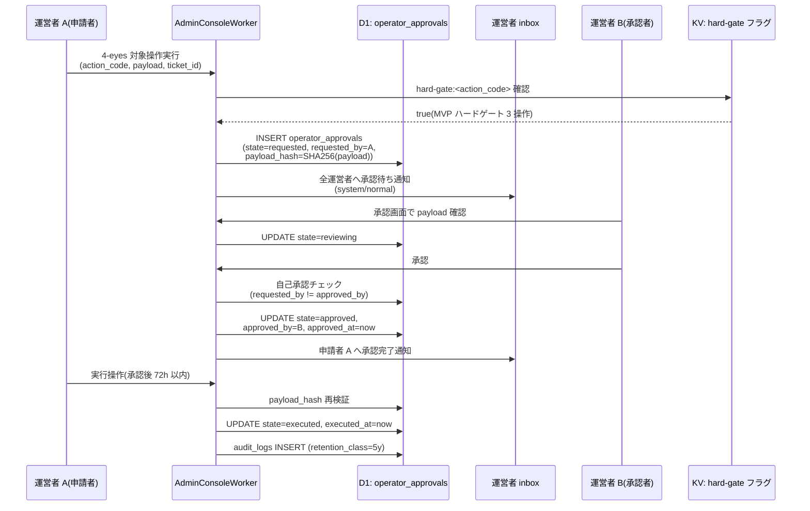
```mermaid
sequenceDiagram
    participant Op1 as 運営者 A(申請者)
    participant Admin as AdminConsoleWorker
    participant D1 as D1: operator_approvals
    participant Inbox as 運営者 inbox
    participant Op2 as 運営者 B(承認者)
    participant KV as KV: hard-gate フラグ

    Op1->>Admin: 4-eyes 対象操作実行<br/>(action_code, payload, ticket_id)
    Admin->>KV: hard-gate:<action_code> 確認
    KV-->>Admin: true(MVP ハードゲート 3 操作)
    Admin->>D1: INSERT operator_approvals<br/>(state=requested, requested_by=A,<br/>payload_hash=SHA256(payload))
    Admin->>Inbox: 全運営者へ承認待ち通知<br/>(system/normal)
    Op2->>Admin: 承認画面で payload 確認
    Admin->>D1: UPDATE state=reviewing
    Op2->>Admin: 承認
    Admin->>D1: 自己承認チェック<br/>(requested_by != approved_by)
    Admin->>D1: UPDATE state=approved,<br/>approved_by=B, approved_at=now
    Admin->>Inbox: 申請者 A へ承認完了通知
    Op1->>Admin: 実行操作(承認後 72h 以内)
    Admin->>D1: payload_hash 再検証
    Admin->>D1: UPDATE state=executed, executed_at=now
    Admin->>D1: audit_logs INSERT (retention_class=5y)
```

**MVP 単独実行(承認ログのみ 7 操作)のフロー**:

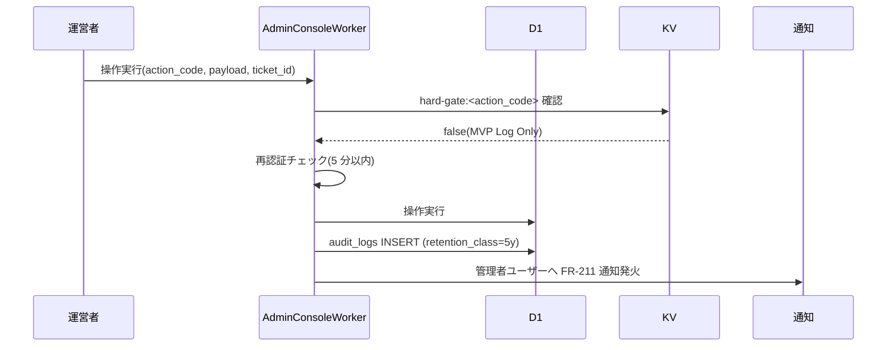
```mermaid
sequenceDiagram
    participant Op as 運営者
    participant Admin as AdminConsoleWorker
    participant D1 as D1
    participant KV as KV
    participant Notify as 通知

    Op->>Admin: 操作実行(action_code, payload, ticket_id)
    Admin->>KV: hard-gate:<action_code> 確認
    KV-->>Admin: false(MVP Log Only)
    Admin->>Admin: 再認証チェック(5 分以内)
    Admin->>D1: 操作実行
    Admin->>D1: audit_logs INSERT (retention_class=5y)
    Admin->>Notify: 管理者ユーザーへ FR-211 通知発火
```

#### 6.3.2 削除データ復元フロー(FR-204 副作用ロールバック)

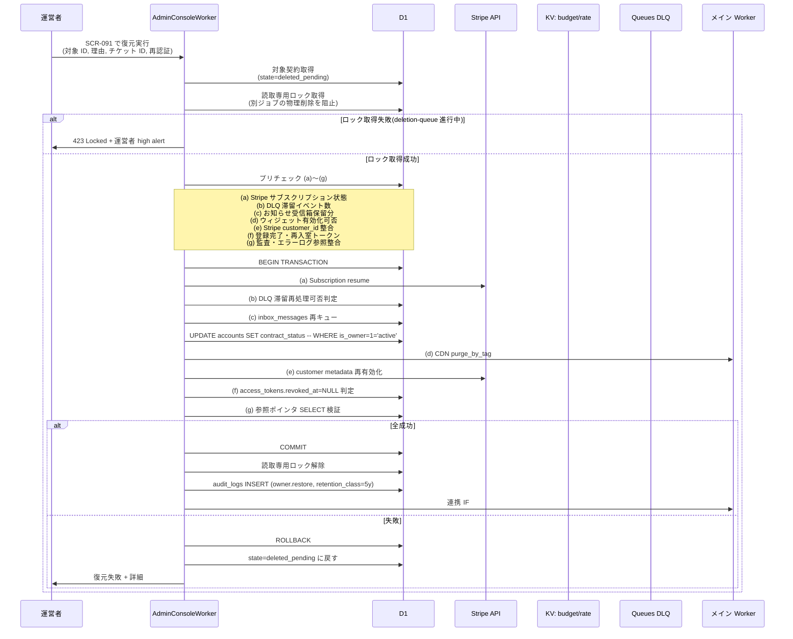
```mermaid
sequenceDiagram
    participant Op as 運営者
    participant Admin as AdminConsoleWorker
    participant D1 as D1
    participant Stripe as Stripe API
    participant KV as KV: budget/rate
    participant DLQ as Queues DLQ
    participant Main as メイン Worker

    Op->>Admin: SCR-091 で復元実行<br/>(対象 ID, 理由, チケット ID, 再認証)
    Admin->>D1: 対象契約取得<br/>(state=deleted_pending)
    Admin->>D1: 読取専用ロック取得<br/>(別ジョブの物理削除を阻止)
    alt ロック取得失敗(deletion-queue 進行中)
        Admin->>Op: 423 Locked + 運営者 high alert
    else ロック取得成功
        Admin->>D1: プリチェック (a)〜(g)
        Note over Admin,D1: (a) Stripe サブスクリプション状態<br/>(b) DLQ 滞留イベント数<br/>(c) お知らせ受信箱保留分<br/>(d) ウィジェット有効化可否<br/>(e) Stripe customer_id 整合<br/>(f) 登録完了・再入室トークン<br/>(g) 監査・エラーログ参照整合
        Admin->>D1: BEGIN TRANSACTION
        Admin->>Stripe: (a) Subscription resume
        Admin->>D1: (b) DLQ 滞留再処理可否判定
        Admin->>D1: (c) inbox_messages 再キュー
        Admin->>D1: UPDATE accounts SET contract_status -- WHERE is_owner=1='active'
        Admin->>Main: (d) CDN purge_by_tag
        Admin->>Stripe: (e) customer metadata 再有効化
        Admin->>D1: (f) access_tokens.revoked_at=NULL 判定
        Admin->>D1: (g) 参照ポインタ SELECT 検証
        alt 全成功
            Admin->>D1: COMMIT
            Admin->>D1: 読取専用ロック解除
            Admin->>D1: audit_logs INSERT (owner.restore, retention_class=5y)
            Admin->>Main: 連携 IF #12 で運営者操作通知発火(FR-211)
        else 失敗
            Admin->>D1: ROLLBACK
            Admin->>D1: state=deleted_pending に戻す
            Admin->>Op: 復元失敗 + 詳細
        end
    end
```

#### 6.3.3 課金 Webhook 受信フロー(FR-302)

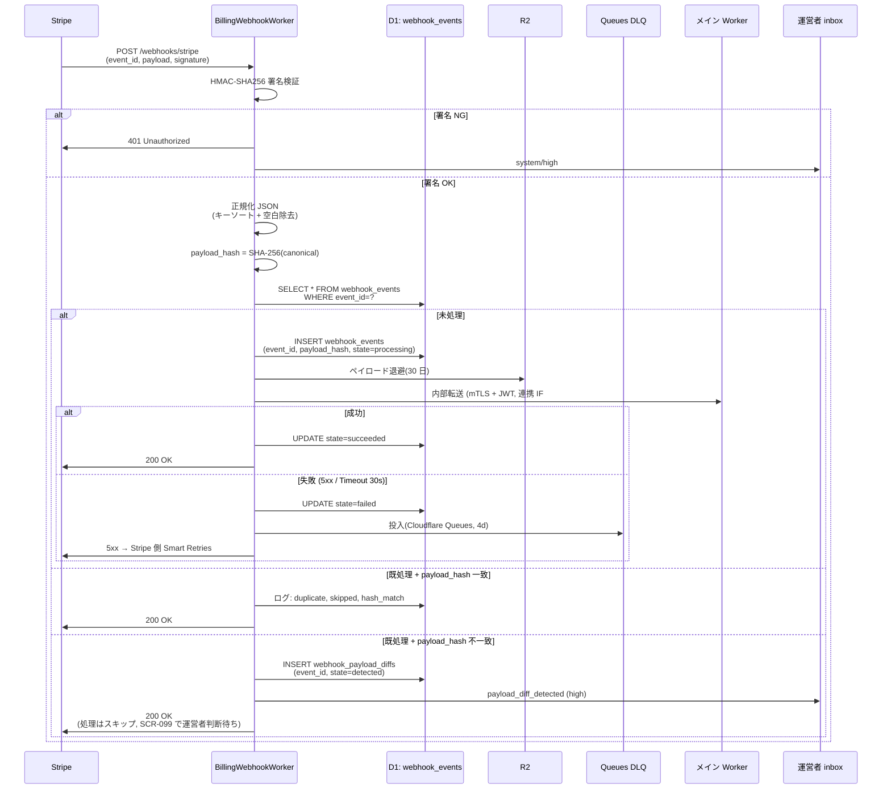
```mermaid
sequenceDiagram
    participant Stripe
    participant Webhook as BillingWebhookWorker
    participant D1 as D1: webhook_events
    participant R2
    participant DLQ as Queues DLQ
    participant Main as メイン Worker
    participant Inbox as 運営者 inbox

    Stripe->>Webhook: POST /webhooks/stripe<br/>(event_id, payload, signature)
    Webhook->>Webhook: HMAC-SHA256 署名検証
    alt 署名 NG
        Webhook->>Stripe: 401 Unauthorized
        Webhook->>Inbox: system/high
    else 署名 OK
        Webhook->>Webhook: 正規化 JSON<br/>(キーソート + 空白除去)
        Webhook->>Webhook: payload_hash = SHA-256(canonical)
        Webhook->>D1: SELECT * FROM webhook_events<br/>WHERE event_id=?
        alt 未処理
            Webhook->>D1: INSERT webhook_events<br/>(event_id, payload_hash, state=processing)
            Webhook->>R2: ペイロード退避(30 日)
            Webhook->>Main: 内部転送 (mTLS + JWT, 連携 IF #10)
            alt 成功
                Webhook->>D1: UPDATE state=succeeded
                Webhook->>Stripe: 200 OK
            else 失敗 (5xx / Timeout 30s)
                Webhook->>D1: UPDATE state=failed
                Webhook->>DLQ: 投入(Cloudflare Queues, 4d)
                Webhook->>Stripe: 5xx → Stripe 側 Smart Retries
            end
        else 既処理 + payload_hash 一致
            Webhook->>D1: ログ: duplicate, skipped, hash_match
            Webhook->>Stripe: 200 OK
        else 既処理 + payload_hash 不一致
            Webhook->>D1: INSERT webhook_payload_diffs<br/>(event_id, state=detected)
            Webhook->>Inbox: payload_diff_detected (high)
            Webhook->>Stripe: 200 OK<br/>(処理はスキップ, SCR-099 で運営者判断待ち)
        end
    end
```

**異常系**:

- 30 秒以内に応答できない場合は 5xx を返し、Stripe 側 Smart Retries に委ねる(NFR-808 と整合)
- DLQ 滞留が IF 別上限(メイン基本設計 §8.7.2 表)を超過した瞬間に運営者 high お知らせ + メール

#### 6.3.4 DLQ 自動 BO + 手動リプレイフロー

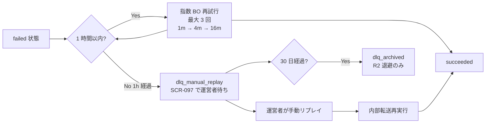
```mermaid
flowchart LR
    Failed[failed 状態] --> AutoBO{1 時間以内?}
    AutoBO -->|Yes| Retry[指数 BO 再試行<br/>最大 3 回<br/>1m → 4m → 16m]
    Retry --> Success[succeeded]
    Retry --> AutoBO
    AutoBO -->|No 1h 経過| Manual[dlq_manual_replay<br/>SCR-097 で運営者待ち]
    Manual --> ReplayBtn[運営者が手動リプレイ]
    ReplayBtn --> Replay[内部転送再実行]
    Replay --> Success
    Manual --> Archive{30 日経過?}
    Archive -->|Yes| Archived[dlq_archived<br/>R2 退避のみ]
```

#### 6.3.6 お知らせ配信フロー(FR-149, FR-188, FR-189)

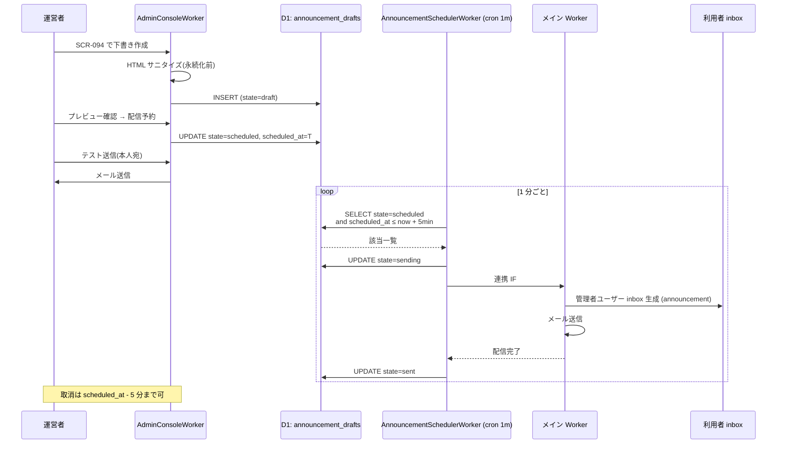
```mermaid
sequenceDiagram
    participant Op as 運営者
    participant Admin as AdminConsoleWorker
    participant D1 as D1: announcement_drafts
    participant Sched as AnnouncementSchedulerWorker (cron 1m)
    participant Main as メイン Worker
    participant Inbox as 利用者 inbox

    Op->>Admin: SCR-094 で下書き作成
    Admin->>Admin: HTML サニタイズ(永続化前)
    Admin->>D1: INSERT (state=draft)
    Op->>Admin: プレビュー確認 → 配信予約
    Admin->>D1: UPDATE state=scheduled, scheduled_at=T
    Op->>Admin: テスト送信(本人宛)
    Admin->>Op: メール送信

    loop 1 分ごと
        Sched->>D1: SELECT state=scheduled<br/>and scheduled_at ≤ now + 5min
        D1-->>Sched: 該当一覧
        Sched->>D1: UPDATE state=sending
        Sched->>Main: 連携 IF #7 でメインへ転送
        Main->>Inbox: 管理者ユーザー inbox 生成 (announcement)
        Main->>Main: メール送信
        Main-->>Sched: 配信完了
        Sched->>D1: UPDATE state=sent
    end

    Note over Op,Admin: 取消は scheduled_at - 5 分まで可
```

#### 6.3.7 月次請求確定 cron(FR-303)

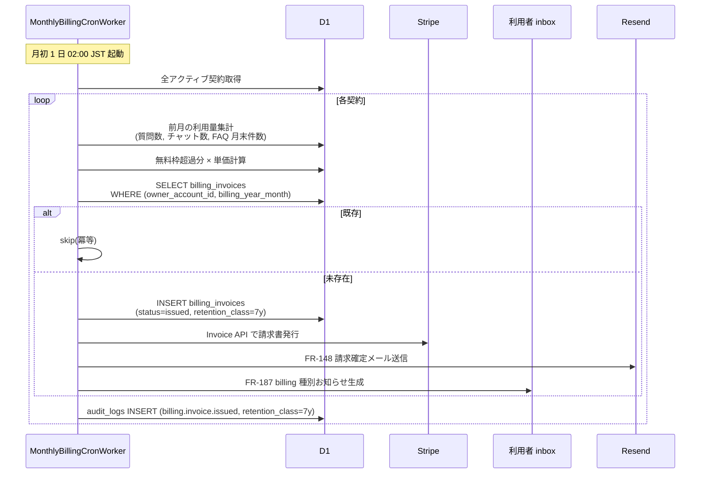
```mermaid
sequenceDiagram
    participant Cron as MonthlyBillingCronWorker
    participant D1
    participant Stripe
    participant Inbox as 利用者 inbox
    participant Mail as Resend

    Note over Cron: 月初 1 日 02:00 JST 起動
    Cron->>D1: 全アクティブ契約取得
    loop 各契約
        Cron->>D1: 前月の利用量集計<br/>(質問数, チャット数, FAQ 月末件数)
        Cron->>D1: 無料枠超過分 × 単価計算
        Cron->>D1: SELECT billing_invoices<br/>WHERE (owner_account_id, billing_year_month)
        alt 既存
            Cron->>Cron: skip(冪等)
        else 未存在
            Cron->>D1: INSERT billing_invoices<br/>(status=issued, retention_class=7y)
            Cron->>Stripe: Invoice API で請求書発行
            Cron->>Mail: FR-148 請求確定メール送信
            Cron->>Inbox: FR-187 billing 種別お知らせ生成
        end
        Cron->>D1: audit_logs INSERT (billing.invoice.issued, retention_class=7y)
    end
```

**訂正請求(クレジットメモ)**: 自動発行禁止。運営者が SCR-094 または別画面から Stripe Credit Note API 経由で手動発行(FR-303(d))。

#### 6.3.8 契約別レート制限・予算上書き適用(FR-121, FR-128)

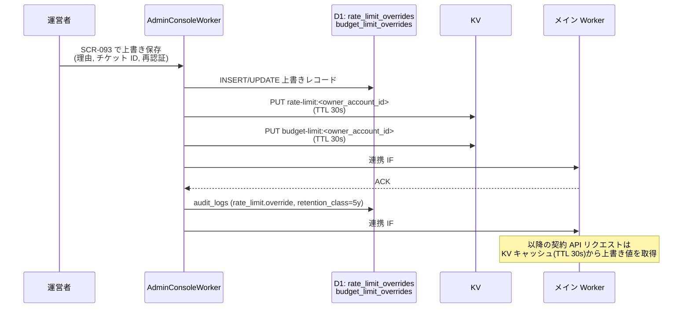
```mermaid
sequenceDiagram
    participant Op as 運営者
    participant Admin as AdminConsoleWorker
    participant D1 as D1: rate_limit_overrides<br/>budget_limit_overrides
    participant KV as KV
    participant Main as メイン Worker

    Op->>Admin: SCR-093 で上書き保存<br/>(理由, チケット ID, 再認証)
    Admin->>D1: INSERT/UPDATE 上書きレコード
    Admin->>KV: PUT rate-limit:<owner_account_id><br/>(TTL 30s)
    Admin->>KV: PUT budget-limit:<owner_account_id><br/>(TTL 30s)
    Admin->>Main: 連携 IF #5 でメインへ同期
    Main-->>Admin: ACK
    Admin->>D1: audit_logs (rate_limit.override, retention_class=5y)
    Admin->>Main: 連携 IF #12 で管理者ユーザー通知発火

    Note over Main: 以降の契約 API リクエストは<br/>KV キャッシュ(TTL 30s)から上書き値を取得
```

**優先順位**: アカウント設定(オーナー設定) > 運営者上書き > デフォルト推奨値(FR-121(c))。

#### 6.3.9 AI 推論パラメータ 3 階層適用(FR-061, AC-034)

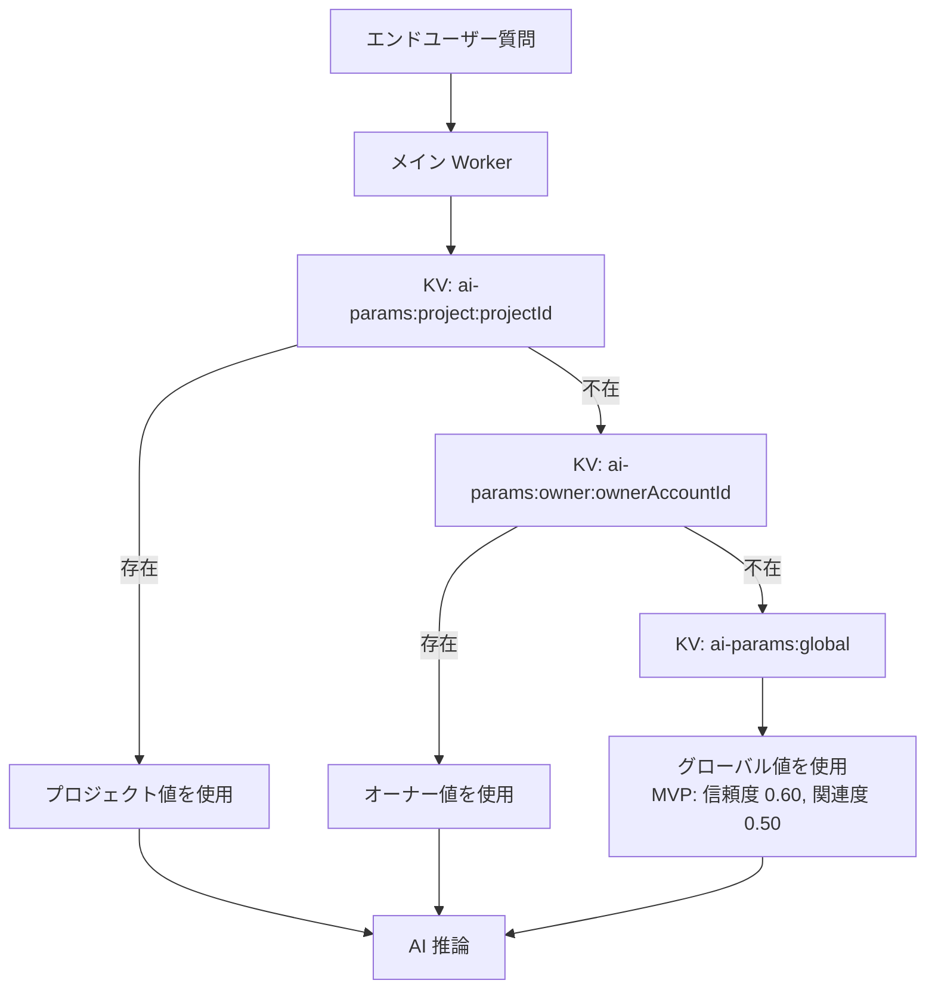
```mermaid
flowchart TD
    Request[エンドユーザー質問] --> Main[メイン Worker]
    Main --> ResolveProj[KV: ai-params:project:projectId]
    ResolveProj -->|存在| UseProj[プロジェクト値を使用]
    ResolveProj -->|不在| ResolveTenant[KV: ai-params:owner:ownerAccountId]
    ResolveTenant -->|存在| UseTenant[オーナー値を使用]
    ResolveTenant -->|不在| ResolveGlobal[KV: ai-params:global]
    ResolveGlobal --> UseGlobal[グローバル値を使用<br/>MVP: 信頼度 0.60, 関連度 0.50]
    UseProj --> AI[AI 推論]
    UseTenant --> AI
    UseGlobal --> AI
```

**保存即時有効**: SCR-092 から保存すると KV へ PUT され、メイン側 Worker は次リクエストから新値を参照(再起動・再デプロイ不要、FR-055)。

#### 6.3.10 PII 誤検出報告 → ルール更新フロー(FR-064, NFR-805)

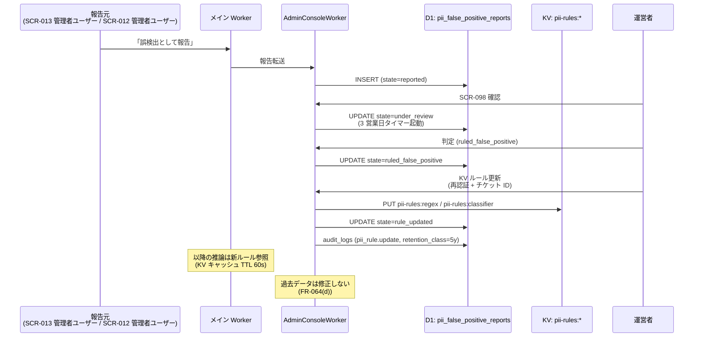
```mermaid
sequenceDiagram
    participant Reporter as 報告元<br/>(SCR-013 管理者ユーザー / SCR-012 管理者ユーザー)
    participant Main as メイン Worker
    participant Admin as AdminConsoleWorker
    participant D1 as D1: pii_false_positive_reports
    participant KV as KV: pii-rules:*
    participant Op as 運営者

    Reporter->>Main: 「誤検出として報告」
    Main->>Admin: 報告転送
    Admin->>D1: INSERT (state=reported)
    Op->>Admin: SCR-098 確認
    Admin->>D1: UPDATE state=under_review<br/>(3 営業日タイマー起動)
    Op->>Admin: 判定 (ruled_false_positive)
    Admin->>D1: UPDATE state=ruled_false_positive

    Op->>Admin: KV ルール更新<br/>(再認証 + チケット ID)
    Admin->>KV: PUT pii-rules:regex / pii-rules:classifier
    Admin->>D1: UPDATE state=rule_updated
    Admin->>D1: audit_logs (pii_rule.update, retention_class=5y)

    Note over Main: 以降の推論は新ルール参照<br/>(KV キャッシュ TTL 60s)
    Note over Admin: 過去データは修正しない<br/>(FR-064(d))
```

#### 6.3.11 監査ログ閲覧・エクスポートフロー(FR-232)

```mermaid
sequenceDiagram
    participant Op as 運営者
    participant Admin as AdminConsoleWorker
    participant D1 as D1: audit_logs
    participant Secrets as Secrets Store
    participant Op2 as 運営者(ダウンロード)

    Op->>Admin: SCR-096 検索<br/>(action, actor, target, 期間 ≤ 1 年, owner 横断)
    Admin->>D1: SELECT (カーソル 100/ページ)
    D1-->>Admin: 結果
    Admin->>Op: 一覧表示

    Op->>Admin: エクスポート要求 (CSV or JSON Lines)
    Admin->>D1: 全件 SELECT
    alt 100 万件超過
        Admin->>Op: 絞り込み再要求
    else 100 万件以内
        Admin->>Secrets: GET グローバル派生鍵 (info=audit-export)
        Admin->>Admin: 10 万行ごとにファイル分割
        Admin->>Admin: 各ファイル末尾に HMAC-SHA256 signature 行追加
        Admin->>D1: audit_logs INSERT (audit.export, retention_class=5y)
        Admin->>Op2: ダウンロードリンク提供
    end
```

#### 6.3.12 運営者操作 → 管理者ユーザー通知フロー(FR-211)

```mermaid
sequenceDiagram
    participant Admin as AdminConsoleWorker
    participant Queue as Queues
    participant Aggregator as 集約 Worker
    participant Main as メイン Worker
    participant TenantAdmin as 管理者ユーザー inbox + mail

    Note over Admin: 運営者操作完了
    Admin->>Queue: 通知ジョブ enqueue<br/>(owner_account_id, operation_kind, ticket_id)
    Note over Aggregator: 10 分集約窓
    Aggregator->>Queue: 同一 (owner_account_id, operation_kind) を集約
    Aggregator->>Main: 連携 IF #12 で通知発火
    Main->>TenantAdmin: inbox (system/high) 書込 → メール送信
    alt メール送信永久失敗 (NFR-502 5 回失敗後)
        Main->>Aggregator: 受信箱通知は残し<br/>運営者 inbox に手動連絡誘導
    end
```

**通知契機 5 種類**(FR-211 (a)〜(e)):
- (a) 論理削除データの復元
- (b) 契約無効化(`suspended` 遷移)・復旧
- (c) 契約別レート制限・利用しきい値の上書き設定変更
- (d) 契約単位の AI 推論パラメータ上書き変更
- (e) 緊急対応によるウィジェット強制停止

#### 6.3.13 「△ 緊急時のみ可」操作の発動フロー整合(参照: メイン要件 §6.2.1 緊急区分 / §6.2.2 発動条件、メイン基本設計 §3.2.1 / §3.2.2 検知ハンドラ、本書要件 §6.2 緊急区分の定義、顧客管理 FR-225)

メインシステム要件 §6.2.1 が「緊急とみなす状況」(WHAT)を 4 つの客観条件(重大障害 / 全員ロックアウト / セキュリティインシデント / 法令対応即応)で定義し、メイン基本設計 §3.2.1 / §3.2.2 が **メイン側受信実装方針 + 検知ハンドラ × 承認 SLA** を確定する。本書は **顧客管理側発行実装方針** として対称対応を定義する。両書を合わせて要件 §6.2 凡例「△」操作の発動条件 4 項目が完全に物理化される。

**発動条件 4 項目に対する顧客管理側の発行責務**:

| 発動条件(要件 §6.2) | 顧客管理側発行責務 | メイン側受信実装(§3.2.1)|
|---|---|---|
| (1) サポートチケット ID 必須 | SCR-091〜094 / 097 / 098 / 099 の操作前モーダルで `ticket_id` 入力必須(§3.6)、空白・最大 64 文字バリデーション。連携 IF #4 / #5 / #6 / #12 のリクエスト JSON に `ticket_id` を必須フィールドとして含めて発行 | リクエスト受信時に `ticket_id` 必須検証、空文字なら 400 |
| (2) 運営者 2 名承認(自己承認不可) | §6.3.1 4-eyes 申請承認フローで `operator_approvals.state='approved'` 確定後にメインへ転送。リクエスト JSON に `approvals[]`(承認者 2 名分の `operator_id` / `approved_at` / 署名 `kid`)を埋め込んで発行 | `approvals[]` 検証(承認者 ID 相互異なる、承認時刻 24h 以内、`kid` 検証)。違反は 403 |
| (3) 管理者ユーザーへの即時通知 | §6.3.12 運営者操作 → 管理者ユーザー通知フローで連携 IF #12 発火。10 分集約窓(D-19)で同一 `(owner_account_id, operation_kind)` を集約配信 | `inbox_messages(category=system, importance=high)` 書込 + メール送信 Queue 投入(NFR-317) |
| (4) 監査ログ必須記録 | 操作実行時に `audit_logs(action=<resource>.<verb>.by_operator, retention_class='5y', ticket_id, approval_ids)` を INSERT(D-08、NFR-602d) | メイン側でも受信時に `<resource>.<verb>.by_main_recv` 形式で受信記録(retention_class=5y) |

**MVP の発動条件**(§3.3 と整合):

| 区分 | (1) チケット ID | (2) 2 名承認 | (3) 即時通知 | (4) 監査ログ |
|---|---|---|---|---|
| MVP ハードゲート 3 操作(物理削除 / AI パラメータ / マスター鍵) | 必須 | **承認ワークフロー必須** | 必須 | 必須 |
| MVP 承認ログのみ 7 操作 | 必須 | **単独実行可・事後承認ログのみ**(SCR-096 で事後可視化) | 必須 | 必須 |

**MVP の「承認ログのみ 7 操作」での欠落補完**: MVP 期間は (2) 2 名承認が承認ワークフロー化されないが、(1) (3) (4) は MVP から必須適用する。MVP 期間の「承認ログのみ」操作のリスクは、(a) `audit_logs` での事後追跡、(b) §6.3.12 による管理者ユーザーへの即時通知(変更を運営者単独で隠蔽できない)、(c) RB-006 規約違反対応における運営者侵害疑義の発火基準で補完する。

### 6.4 機能と API の対応概要

| 機能ブロック | 主要 API プレフィックス | 認証 | Idempotency |
|---|---|---|---|
| 運営者認証 | `POST /admin/v1/auth/login`、`POST /admin/v1/auth/mfa/verify`、`POST /admin/v1/auth/reauth` | Cookie + CSRF | - |
| 4-eyes 申請承認 | `POST /admin/v1/approvals`、`POST /admin/v1/approvals/:id/approve`、`POST /admin/v1/approvals/:id/reject` | Cookie + Re-Auth | `approval_id` |
| 削除データ参照 | `GET /admin/v1/deleted-resources` | Cookie | - |
| 削除データ復元 | `POST /admin/v1/restorations` | Cookie + Re-Auth | `restoration_id` |
| AI パラメータ | `PUT /admin/v1/ai-parameters/{scope}/{id}` | Cookie + Re-Auth + Approval | `parameter_revision` |
| レート/予算上書き | `PUT /admin/v1/overrides/rate-limit/{owner_account_id}`、`PUT /admin/v1/overrides/budget/{owner_account_id}` | Cookie + Re-Auth | `override_id` |
| お知らせ配信 | `POST /admin/v1/announcements`、`POST /admin/v1/announcements/:id/schedule`、`DELETE /admin/v1/announcements/:id` | Cookie + Re-Auth | `announcement_id` |
| 監査ログ | `GET /admin/v1/audit-logs`、`POST /admin/v1/audit-logs/exports` | Cookie | `export_id` |
| Webhook リプレイ | `POST /admin/v1/webhooks/:id/replay` | Cookie + Re-Auth | `replay_id` |
| PII 報告 | `POST /admin/v1/pii-reports/:id/rule-update` | Cookie + Re-Auth | `rule_revision` |
| 内部 IF(運営者→メイン) | `https://app.open-faq.example.com/internal/v1/*` | mTLS + JWT | 連携 IF 別 |
| Stripe Webhook 受信 | `POST /webhooks/stripe` | Stripe-Signature | Stripe `event_id` |
| Resend Webhook 受信 | `POST /webhooks/resend` | Resend Signature | Resend `event_id` |

完全な API スキーマ・JSON Schema は詳細設計に回す。

### 6.5 4-eyes 承認基盤の方式

| 要素 | 設計 |
|---|---|
| データモデル | `operator_approvals(id, action_code, requested_by, approved_by, payload_hash, payload_json, state, requested_at, approved_at, executed_at, expires_at)` |
| 承認待ち TTL | 72 時間(`expires_at = requested_at + 72h`)、超過は自動 `expired` |
| 自己承認禁止 | DB CHECK 制約: `requested_by IS NULL OR approved_by IS NULL OR requested_by != approved_by` |
| payload 改ざん防止 | 承認時に payload_hash を確定、実行時に payload_hash 再計算で照合 |
| ハードゲート対象 | KV `feature:hard-gate:<action_code>` で動的制御(MVP は 3 操作のみ true) |
| 承認後 TTL | 承認後 72h 以内未実行で `expired`、再申請が必要 |
| 緊急例外手続き | MVP では紙ベース回復コード手続き(§12.3 RB-014) |

### 6.7 Webhook ペイロード差分検出方式(FR-302 異常系)

| 項目 | 仕様 |
|---|---|
| 正規化方式 | JSON のキーをソート(再帰)+ 空白除去 → SHA-256 ハッシュ計算 |
| 除外フィールド | 付録 H 固定列挙(`created`、`request_id`、`livemode` のテストモード差分など Stripe 仕様の非決定的フィールド)|
| 検出後アクション | (1) `webhook_payload_diffs` INSERT(state=detected)、(2) 運営者 inbox(system/high)、(3) SCR-099 で運営者判断待ち、(4) 自動上書き禁止 |
| 再処理経路 | SCR-099 から SCR-097 へ遷移し、運営者の手動判断でリプレイ |
| 監査記録 | `webhook.payload_diff.detect` / `webhook.payload_diff.review` / `webhook.payload_diff.reprocess` / `webhook.payload_diff.dismiss`(retention_class=5y) |

---

## 7. データ設計

### 7.1.1 顧客管理視点の BR ↔ FR / 設計章マッピング(参照: 要件 §7.1.1)

要件 §7.1.1「BR ↔ FR / NFR / AC トレーサビリティマトリクス」のうち、顧客管理システム側が主管または共同担当する BR(運営者責務・サスペンション・お知らせ・運営内部統制系)について、本書のどの章で実装されるかを示す。メイン側は §1.4 で同等マッピングを保持する。

| BR | 業務要件(要約) | 派生 FR(主管) | 本書の主たる実装章節 | 関連 SCR |
|---|---|---|---|---|
| BR-017 | 不正利用検知・対処(運営者) | FR-121, FR-128, FR-211(e), FR-224 | §6.3.8 / §10.10(検知)/ §6.3.12(通知) | SCR-093 |
| BR-018 | SaaS 全体利用状況の把握(運営者) | FR-303, FR-304, FR-232 | §6.3.7(月次集計)/ §6.3.11(監査ログ)/ §11.3 KPI / §12.8(SCR-096) | SCR-096 |
| BR-022 | 運営からのお知らせ配信(全契約・特定契約) | FR-149, FR-188, FR-189 | §6.3.6 / §4.6 / メイン基本設計 §8.7.6(縮退時遅延) | SCR-094 |
| BR-028 | 内部統制機能(監査ログ閲覧、削除データ復元、4-eyes、運営者操作通知) | FR-204, FR-211, FR-220〜232, FR-302〜304 | §3.3(4-eyes)/ §6.3.1〜6.3.13(主要フロー)/ §7.4(監査保持)/ §10.4(ハッシュチェーン) | SCR-090〜094, SCR-096〜099 全画面 |
| BR-021(共同) | 月次請求確定通知 | FR-303 | §6.3.7 月次請求確定 cron | SCR-096(管理者宛通知は連携 IF #12 経由でメイン §6.2.11 ヘ) |
| BR-027(共同) | お知らせ受信箱への自動生成(月次請求確定・運営お知らせ起点) | FR-149, FR-303, FR-211 | §6.3.6 / §6.3.7 / §6.3.12 | SCR-094 / 連携 IF #12 |
| BR-019 / BR-020(参照) | 未解決質問の状況識別・終了確定 | メイン側 FR-074 / FR-079 | メイン §4.3 / §6.2.2 を参照(メインシステム正本、§1.3.2 で明示) | - |

**本マッピングの運用ルール**:

1. **新規 BR 追加時**: 要件 §7.1.1 に BR を追加し、本書側で主管または共同担当となる場合は本表に行を追加する(派生 FR + 本書実装章節 + SCR)。
2. **本書実装章節の変更時**: §6 / §7 / §10 / §11 / §12 の章節再構成を行った場合は本表の「本書の主たる実装章節」列を更新する。
3. **派生 FR の主管移動時**: 要件側で FR の主管が顧客管理 → メイン or 逆方向に移った場合、本表の対象 BR 行を見直す。
4. **CI 検査項目との関係**: 要件 §1.5 検査項目 1〜9 のうち、項目 5「FR 派生元 BR 欠落」と項目 6「未定義 ID 参照」に該当する検査がここを起点に動作する想定(現行 `03_script/check-spec-sync.sh` は要件書のみ対象)。

### 7.1 主要エンティティ一覧(運営者側主管)

**本表はエンティティ識別と用途の概念レベルに留める**。物理スキーマ(列の物理型・NULL/DEFAULT・制約・インデックス・暗号化方式・ハッシュ方式)は詳細設計書 §8 全テーブル DDL で確定する。

| エンティティ | 用途 | 関連 FR / NFR |
|---|---|---|
| `service_operators` | 運営者アカウント(1 自然人 1 アカウント) | FR-220, NFR-311 |
| `operator_sessions` | 運営者セッション(8h、MFA 必須) | NFR-311, D-18 |
| `operator_mfa_secrets` | TOTP シークレット | FR-221 |
| `operator_mfa_recovery_codes` | MFA 回復コード(10 個、ハッシュ保存。ハッシュ方式は詳細設計 §12.3) | FR-221 |
| `operator_ip_allowlist` | IP 許可リスト | NFR-311 |
| `operator_approvals` | 4-eyes 申請・承認レコード | §6.3.1, FR-226 |
| `audit_logs` | 監査ログ(ハッシュチェーン、3 区分保持) | NFR-306, NFR-602, FR-229, FR-232 |
| `webhook_events` | Stripe Webhook 受信ログ | FR-302, NFR-808 |
| `webhook_payload_diffs` | ペイロード差分検出履歴(SCR-099) | FR-302 異常系, AC-041 |
| `dlq_replay_log` | DLQ リプレイ履歴(SCR-097) | FR-302(c), NFR-809 |
| `pii_false_positive_reports` | PII 誤検出報告(SCR-098) | FR-064, NFR-805 |
| `accounts_retired`(オーナー行スナップショット) | 物理削除済契約識別子の永久保持 | NFR-707 |
| `owner_registration_reviews` | EU/EEA/UK など MVP 対象外疑義を含む登録申込の審査状態。`accounts.contract_status`(オーナー行) 4 値固定を維持するため、承認前の保留は契約本体と分離 | NFR-402 |
| `announcement_drafts` | お知らせ下書き・配信予約(SCR-094) | FR-149, FR-188, FR-189 |
| `rate_limit_overrides` | 契約別レート上書き(D1 永続化、KV ミラー) | FR-121, FR-128, FR-224(b) |
| `ai_parameter_overrides` | AI パラメータ 3 階層上書き | FR-055, FR-061 |
| `budget_limit_overrides` | 運営者上書き予算上限 | FR-121(c) |
| `billing_invoices` | 月次請求書(運営者主管の cron で生成、7 年保持) | FR-303, NFR-602(c) |
| `webhook_replay_requests` | リプレイ要求受付 | FR-302, NFR-809 |

利用者側エンティティ(`accounts`、`accounts`、`projects`、`faqs`、`question_logs`、`chat_rooms`、`chat_messages`、`inbox_messages` 等)はメイン §7 を正本とする。

### 7.2 運営者側 ER 図(概念)

```mermaid
erDiagram
    service_operators ||--o{ operator_sessions : has
    service_operators ||--o{ operator_mfa_secrets : has
    service_operators ||--o{ operator_mfa_recovery_codes : has
    service_operators ||--o{ operator_ip_allowlist : grants
    service_operators ||--o{ operator_approvals : requests
    service_operators ||--o{ audit_logs : performs
    operator_approvals }o--|| service_operators : approves
    webhook_events ||--o{ webhook_payload_diffs : detects
    webhook_events ||--o{ dlq_replay_log : replays
    pii_false_positive_reports ||--|| service_operators : reviewed_by
    announcement_drafts ||--|| service_operators : created_by
    rate_limit_overrides ||--|| service_operators : authored_by
    ai_parameter_overrides ||--|| service_operators : authored_by
    budget_limit_overrides ||--|| service_operators : authored_by
    billing_invoices ||--o{ audit_logs : audited
    accounts_retired ||--o{ audit_logs : retains
```

### 7.3 監査ログ・ハッシュチェーン構造

| 列名 | 型 | 説明 |
|---|---|---|
| `id` | TEXT (UUID) | レコード ID |
| `prev_hash` | TEXT (hex) | 前レコードの `record_hash`(初行は固定値 `0x00...`) |
| `record_hash` | TEXT (hex) | `SHA-256(prev_hash || canonical_json(本レコードの他全フィールド))` |
| `actor_id` | TEXT | 操作者 ID(`service_operators.id` / `accounts.id` / `system`) |
| `actor_type` | TEXT | `service_operator` / `admin` / `end_user` / `system` |
| `action` | TEXT | `<resource>.<verb>` 形式(§12.6 と整合) |
| `target_id` | TEXT | 操作対象 ID |
| `target_type` | TEXT | 操作対象種別 |
| `owner_account_id` | TEXT | 影響契約(運営者横断操作は NULL 可) |
| `before_value` | JSON | 操作前の値(差分のみ) |
| `after_value` | JSON | 操作後の値(差分のみ) |
| `ip_masked` | TEXT | IPv4 末オクテット 0、IPv6 末 80 ビット 0 |
| `ticket_id` | TEXT | 対応チケット ID(FR-231) |
| `occurred_at` | TIMESTAMP | 発生時刻 |
| `retention_class` | TEXT | `1y` / `5y` / `7y`(NFR-602 と整合) |

**ハッシュチェーン検証**(D-04):

- 日次バッチ `AuditChainVerifierWorker`(02:00 JST 起動、Cron Triggers)
- **全件再計算**(直近 90 日窓ではなく全件)
- 不一致検出時: 運営者 inbox(system/high)+ メール + 検証実行ログ自体を `audit_logs(audit.chain.verify.fail, retention_class=5y)` に記録
- 鍵管理: 単一鍵(Cloudflare Secret Store)、年次ローテーション、ローテーション中は 60 日 dual-decrypt

**IP マスク**(NFR-306):
- IPv4: `203.0.113.42` → `203.0.113.0`
- IPv6: `2001:db8:1234:5678:9abc:def0:1234:5678` → `2001:db8:1234:5678:0:0:0:0`

### 7.4 3 区分保持の物理実装(D-08)

**採用方式**: 単一テーブル `audit_logs` + `retention_class` 列で区分し、区分別物理削除バッチで処理。

| 区分 | retention_class | 期間 | 対象 action コード(代表例) |
|---|---|---|---|
| 業務監査(a) | `1y` | 1 年 | `faq.create`、`faq.update`、`chat.reply`、`account.login`、`inbox.read` 等の利用者側操作 |
| 運営者高権限(b) | `5y` | 5 年 | `owner.suspend`、`owner.restore`、`owner.physical_delete`、`ai_parameter.update`、`rate_limit.override`、`budget_limit.override`、`announcement.send`、`operator.invite`、`operator.disable`、`webhook.replay`、`prod.direct_change`、`audit.export`、`pii_rule.update`、`webhook.payload_diff.*` |
| 課金・取引(c) | `7y` | 7 年 | `billing.invoice.issued`、`billing.credit_note.issued`、`billing.cron.run`、`stripe.event.processed` |

物理削除バッチ:
- 日次 03:00 JST 起動(Cron Triggers)
- `DELETE FROM audit_logs WHERE retention_class='1y' AND occurred_at < now() - 365d`
- 5y / 7y も同様
- 削除前に R2 へ圧縮アーカイブ(法令対応エビデンス保管、年次)

詳細マッピングは付録 F に集約。

### 7.5 `accounts_retired`(オーナー行スナップショット) 永久保持テーブル

| 列 | 型 | 説明 |
|---|---|---|
| `owner_account_id` | TEXT | 旧 `accounts.id`(永久保持) |
| `slug` | TEXT | 旧 `accounts.slug`(永久保持) |
| `retired_at` | TIMESTAMP | 物理削除完了時刻 |
| `reason` | TEXT | 物理削除理由(運営者入力) |
| `operator_id` | TEXT | 実行運営者 ID |
| `ticket_id` | TEXT | 対応チケット ID |

**ユニーク制約方針**: `accounts.id` および `accounts.slug` の UNIQUE 制約には `WHERE status != 'deleted'` を **含めない**(NFR-707)。これにより、`accounts` テーブル(オーナー行)に `deleted` 状態のレコードが残らない設計(物理削除完了で `accounts_retired`(オーナー行スナップショット) へ移送)としつつ、新規契約発行時のスラグ再利用を防止する。同一組織が再契約する場合も新規 ID/slug を発行する。

### 7.7 Webhook イベント `webhook_events`

| 列 | 型 | 説明 |
|---|---|---|
| `event_id` | TEXT (PK) | Stripe `evt_*` をそのまま使用 |
| `payload_hash` | TEXT (hex) | 正規化 JSON の SHA-256 |
| `received_at` | TIMESTAMP | 受信時刻 |
| `state` | TEXT | 4.3 の状態(`received` 等) |
| `dlq_path` | TEXT (nullable) | R2 退避パス |
| `last_transition_at` | TIMESTAMP | 最終遷移時刻 |
| `attempt_count` | INTEGER | 自動 BO 試行回数 |
| `owner_account_id` | TEXT (nullable) | 関連契約(イベント種別による) |

### 7.8 トレーサビリティ

運営者操作の追跡経路:

```text
SCR 操作 → チケット ID 入力 → audit_logs(ticket_id) → SCR-096 検索 → 対応チケット逆引き
```

連携 IF #1〜12 のトレーサビリティ:

```text
連携 IF 呼出 → 内部 API のリクエスト ID(JWT claim sub にチケット ID 紐付け)
            → 内部 API レスポンス → 監査ログ
```

### 7.9 命名規則・型方針

| 種別 | 規則 |
|---|---|
| テーブル名 | snake_case 複数形(例: `audit_logs`、`webhook_events`) |
| カラム名 | snake_case 単数形(例: `owner_account_id`、`occurred_at`) |
| 状態列 | `state`、値は snake_case |
| 主キー | UUID v4 / Stripe ID をそのまま(`evt_*`、`sub_*`) |
| タイムスタンプ | UTC(`TIMESTAMP`)、表示時に JST 変換 |
| KV キープレフィックス | `<feature>:<scope>:<id>`(例: `ai-params:owner:abc`、`rate-limit:owner:abc`、`pii-rules:regex`) |
| KV キー命名規約 | コロン区切り、英小文字 + ハイフン、TTL は機能ごとに設定 |
| `access_tokens.purpose` 列挙 | `invitation` / `chat_reentry` / `mfa_setup` / `password_reset` / `email_verify` |

### 7.10 インデックス方針

| テーブル | インデックス | 用途 |
|---|---|---|
| `webhook_events` | `(state, received_at)`、`(owner_account_id, received_at)` | DLQ 監視、リプレイ検索 |
| `audit_logs` | `(actor_id, occurred_at)`、`(target_id, occurred_at)`、`(action, occurred_at)`、`(owner_account_id, occurred_at)`、`(retention_class, occurred_at)` | SCR-096 検索、保持区分別削除 |
| `pii_false_positive_reports` | `(state, reported_at)` | 3 営業日判定 |
| `operator_approvals` | `(state, expires_at)` | 承認待ち TTL 監視 |
| `announcement_drafts` | `(state, scheduled_at)` | 1 分ポーリング |
| `billing_invoices` | `(owner_account_id, billing_year_month)` UNIQUE | 冪等性 |

---

## 8. 外部 IF・連携 IF 設計

**本章の前提**: 連携 IF #1〜#12 は全て URL パスを `/v1/` プレフィックスで統一する。API バージョンヘッダ(`API-Version`)の付与方式・廃止予告期間(180 日)・Breaking Change 定義は §8.3 を参照。

### 8.1 外部 IF 一覧

| 連携先 | 用途 | 通信方式 | 認証 | 本書側担当 |
|---|---|---|---|---|
| Stripe | 決済処理 | HTTPS API | Secret Key | `BillingWebhookWorker` / `MonthlyBillingCronWorker` / `AdminConsoleWorker`(復元時の Subscription resume) |
| Stripe Webhook | 決済イベント通知 | HTTPS Webhook | Stripe-Signature(HMAC-SHA256) | `BillingWebhookWorker`(一次受信主管) |
| Resend | メール送信 | HTTPS API | API Key | 運営者通知・テスト送信 |
| Resend Webhook | メール配信状態 | HTTPS Webhook | Resend Signature | バウンス・苦情の運営者観測(主管はメイン) |
| Workers AI | AnswerProvider 抽象、MVP は PII 第 1 / 第 3 層 | Cloudflare 内部呼出 | アカウント内部認可 | `AdminConsoleWorker`(モデル選定・段階ロールアウト) |

### 8.2 連携 IF マトリクス(本書側主管 8 件)

通信仕様正本はメイン基本設計 §8.7.2 / §8.7.3。本書側で主管する 8 件の契約定義:

| # | 連携 IF | 方向 | 認証 | API バージョン | Idempotency キー | DLQ 滞留上限 | タイムアウト | 関連 FR |
|---|---|---|---|---|---|---|---|---|
| #1 | 契約停止イベント | 本書 → メイン | mTLS + JWT | `/v1/` + `API-Version` ヘッダ | `(operation_id, owner_account_id, target_status)` | 100/30 分 | 5s | FR-124, FR-224(a) |
| #2 | 強制ログアウト | 本書 → メイン | mTLS + JWT | 同上 | `(operation_id, owner_account_id)` | 100/30 分 | 3s | FR-224 |
| #4 | 復元実行 | 本書 → メイン | mTLS + JWT | 同上 | `(restore_operation_id)` | 50/24h | 10s | FR-200〜FR-209, FR-211 |
| #5 | 契約別レート制限上書き | 本書 → メイン | mTLS + JWT | 同上 | `(owner_account_id, override_id)` | 50/30 分 | 3s | FR-121, FR-224(b) |
| #6 | AI 推論パラメータ上書き | 本書 → メイン | mTLS + JWT | 同上 | `(owner_account_id, scope, version)` | 50/30 分 | 3s | FR-055, FR-061 |
| #7 | お知らせ生成 | 本書 → メイン | mTLS + JWT | 同上 | `(announcement_id, owner_account_id)` | 1000/h | 30s | FR-149, FR-188, FR-189 |
| #10 | 課金 Webhook 受信・転送 | Stripe → 本書 → メイン | Stripe-Signature / mTLS + JWT | 同上 | Stripe `event_id` | 1000/24h + R2 退避 30d | 10s | FR-302, NFR-808 |
| #12 | 運営者操作通知 | 本書 → メイン → 利用者 | mTLS + JWT | 同上 | `(operation_id, owner_account_id)` | 200/30 分 | 5s | FR-211 |

補助 IF(本書側補助):
- #8 監視メトリクス取得(主管: メイン、本書側可視化)
- #9 不正利用検知通知(主管: メイン、本書側受領)

### 8.3 API バージョニング契約

| 項目 | 仕様 |
|---|---|
| URL パス | `/internal/v1/...`(メジャーバージョン) |
| ヘッダ | `API-Version: 2026-05-11`(実装日付、レスポンスに返す) |
| マイナー変更 | `/v1` 内で実施(後方互換あり) |
| メジャーバージョン廃止予告 | **180 日前**(両書改訂履歴に同期記載) |
| 廃止後の応答 | `HTTP 410 Gone` + `{"upgrade_to": "/v2/..."}` |
| Breaking Change 定義 | 必須フィールド削除 / enum 値削除 / エンドポイント URL 変更 / 認証方式変更 / レスポンスステータスコード変更 / 冪等性キー仕様変更 |

### 8.4 自動再試行ポリシー

| 連携 IF | 通常時 | 失敗時 |
|---|---|---|
| #1 / #2(即時性必須) | 自動指数 BO 最大 3 回 | 失敗で `high` アラート併発 + DLQ |
| #4, #5, #6, #12 | 自動指数 BO 最大 3 回 | 失敗で DLQ 4 日 |
| #7(お知らせ配信) | 自動指数 BO 最大 3 回 | 失敗で DLQ 4 日、永久失敗時は運営者 inbox 通知 |
| #10(Stripe Webhook 内部転送) | 自動指数 BO 最大 3 回 | 失敗で DLQ + R2 退避 30 日、運営者リプレイ |

### 8.5 Stripe Webhook 受信仕様(D-10)

| 項目 | 仕様 |
|---|---|
| 受信エンドポイント | `https://admin.open-faq.example.com/webhooks/stripe`(**唯一受信先**、メイン側は受けない) |
| 署名検証 | Stripe-Signature ヘッダの HMAC-SHA256(Stripe Webhook Secret) |
| 検証失敗時 | HTTP 401 即返却 + 運営者 inbox(system/high) |
| 冪等性 | Stripe `event_id`(`evt_*`)を `webhook_events.event_id` PK で UNIQUE 制約 |
| ペイロード比較 | 正規化 JSON(キーソート + 空白除去)SHA-256 ハッシュ(D-06 除外フィールド一覧は付録 H) |
| 同 event_id + ハッシュ一致 | 200 OK + ログ「duplicate, skipped, hash_match」 |
| 同 event_id + ハッシュ不一致 | 200 OK + SCR-099 記録 + 運営者 high alert + **自動上書き禁止** |
| リプレイ | 直近 30 日、SCR-097 から運営者の明示操作のみ |
| DLQ | Cloudflare Queues 4 日 + R2 退避 30 日(`event_id` ベースのパス) |
| 内部転送 | 必要イベント(支払成功/失敗確定/サスペンション解除)をメインへ mTLS + JWT で同期 |
| タイムアウト | 30 秒、超過は 5xx 返却で Stripe 側 Smart Retries に委ねる |
| DLQ 監視 | 1 時間で受信失敗率 5% 超過 / 30 分以上未処理 で運営者 high(NFR-808) |

**R2 退避の補足**: DLQ 投入と同時に Webhook ペイロード本体を R2 へ退避し、Cloudflare Queues の保持上限(4 日)を超える保管を実現する。退避パスは `dlq-stripe-events/<event_id>.json`(`webhook_events.dlq_path` に格納)。30 日経過で `dlq_archived` 状態へ遷移し以降のリプレイ不可。リプレイは SCR-097 から運営者操作で実施(§6.3.4 参照)。詳細リミット・監視 KPI は §11.7 を参照。

### 8.6 Resend Webhook 監視

Resend Webhook 監視の運用詳細は [../operations.md](../operations.md) の「顧客管理システム 基本設計 Resend Webhook 監視由来」へ移管した。

### 8.7 Workers AI 抽象化(AnswerProvider 抽象)

| 項目 | 仕様 |
|---|---|
| 抽象インターフェース | `AnswerProvider`(メイン側で定義、本書では参照のみ) |
| 運営者主管事項 | (a) モデル選定(MVP: `@cf/meta/llama-3.1-8b-instruct`)、(b) ロールアウト(0%→10%→50%→100%)、(c) 即時ロールバック、(d) AI 品質回帰データセット管理(MVP 50 組以上) |
| 切替時の手順 | (1) 品質回帰テスト実行、(2) 回答可能率・解決率・矛盾率の比較レポート、(3) 段階ロールアウト、(4) 監査ログ記録(`ai_model.switch`, retention_class=5y) |
| 抽象対象 | (1) PII 検出第 2 層(NFR-805、軽量 NER)、(2) 回答生成 LLM |

### 8.9 契約変更プロセス

| 項目 | 仕様 |
|---|---|
| スキーマ変更時 | (1) 本書とメイン基本設計の影響箇所を確認、(2) メイン基本設計 §8.7.2 の通信仕様表が必要な場合は同時更新 |
| Breaking Change 時 | (1) 180 日前廃止予告、(2) 新メジャーバージョン併存運用、(3) 期間経過後の旧バージョンは `HTTP 410 Gone` |
| マイナー変更時 | `/v1` 内で実施、`API-Version` ヘッダの日付を更新 |

---

## 9. メール通知設計

### 9.1 運営者向け通知契機一覧

| 契機 | 種別 / 重要度 | 配信先 | 関連 FR / NFR |
|---|---|---|---|
| 4-eyes 申請発生 | system / normal | 全運営者(inbox + メール) | §6.3.1 |
| 4-eyes 承認完了 | system / normal | 申請者(inbox + メール) | §6.3.1 |
| PII 誤検出報告 3 営業日判定リマインド | system / normal | 全運営者(inbox + メール) | AC-036 |
| Webhook ペイロード差分検出 | system / high | 全運営者(inbox + メール) | FR-302 異常系, AC-041 |
| DLQ 滞留 1h 以上 | system / high | 全運営者(inbox + メール) | NFR-808, NFR-809 |
| ハッシュチェーン不一致 | system / high | 全運営者(inbox + メール) | NFR-306, RB-017 |
| 運営者操作頻度異常 | system / high | 全運営者(inbox + メール) | FR-229(c) |
| SCR-094 テスト送信 | テスト | 運営者本人 | FR-149 |
| 課金 Webhook 署名検証失敗 | system / high | 全運営者(inbox + メール) | NFR-310 |
| 課金 Webhook 受信失敗率 5% 超過 | system / high | 全運営者(inbox + メール) | NFR-808 |
| 月次請求確定 cron 失敗(3 回連続) | system / high | 全運営者(inbox + メール) | FR-303 |
| 復元時 423 Locked(deletion-queue 競合) | system / high | 全運営者(inbox + メール) | FR-204 異常系 |

### 9.2 管理者ユーザーへの運営者操作通知(FR-211)

| 通知契機 | 配信先 | 形式 | 集約窓 |
|---|---|---|---|
| (a) 論理削除データの復元 | 対象契約全管理者 | inbox(system/high) + メール | 10 分 |
| (b) 契約無効化(`suspended` 遷移)・復旧 | 対象契約全管理者 | inbox(system/high) + メール | 10 分 |
| (c) 契約別レート制限・利用しきい値の上書き設定変更 | 対象契約全管理者 | inbox(system/high) + メール | 10 分 |
| (d) 契約単位の AI 推論パラメータ上書き変更 | 対象契約全管理者 | inbox(system/high) + メール | 10 分 |
| (e) 緊急対応によるウィジェット強制停止 | 対象契約全管理者 | inbox(system/high) + メール | 10 分 |

| 項目 | 仕様 |
|---|---|
| 集約キー | `(owner_account_id, operation_kind)` |
| 配信遅延目標 | 操作完了から 5 分以内 |
| 通知内容 | 操作種別 / 操作日時 / 対応チケット ID(任意)|
| 永久失敗時 | NFR-502 で 5 回再送後永久失敗 → 受信箱通知は残し、運営者 inbox(system/high)へ手動連絡誘導 |

### 9.3 信頼性設計(NFR-502)

| 項目 | 仕様 |
|---|---|
| 再送方式 | 指数バックオフ |
| 再送回数上限 | 5 回 |
| バックオフ間隔 | 1 分 → 2 分 → 4 分 → 8 分 → 16 分 |
| 累計打切 | 24 時間 |
| 永久失敗判定 | SMTP 5xx 確定 / バウンス確定 |
| 永久失敗時の挙動 | サプレスリスト登録 + 再送中止 + 監査ログ記録 |
| 重要通知(請求確定・サスペンション) | 永久失敗時に運営者 inbox(`high`)へ手動連絡誘導 |

### 9.4 サプレスリスト復帰承認

メイン基本設計 §9.3.2 が正本。本書側は SCR-093 経由で運営者が個別アドレス復帰承認を実施(連携 IF #5)。

### 9.5 テンプレート設計

| 通知種別 | テンプレート要素 |
|---|---|
| 4-eyes 申請通知 | 件名: `[承認待ち] {action_code} の承認依頼`、本文: 申請者・対象・payload プレビュー・承認 URL |
| Webhook ペイロード差分 | 件名: `[警告] Stripe Webhook payload 差分検出`、本文: event_id・diff サマリ・SCR-099 URL |
| 運営者操作通知(FR-211) | 件名: `[ご案内] 運営者操作のお知らせ({operation_kind})`、本文: 操作種別・日時・チケット ID |

**HTML サニタイズ二段階**(R-011):
- 永続化前: SCR-094 の保存時にサニタイズ
- 表示時: 受信箱表示 + メール HTML 部分の表示時にもサニタイズ
- 許可タグ・属性のホワイトリストはメイン §R-011 を参照(両書同一)

### 9.6 運営者 inbox 設計

| 項目 | 仕様 |
|---|---|
| データ | `inbox_messages(recipient_type='service_operator', recipient_id=operator_id)` |
| 保持期間 | 1 年(NFR-705) |
| 重要操作の起点 | 重要操作監査ログ(retention_class='5y')にリンクを保持(D-20) |
| 既読管理 | 個別 + 一括既読化(管理者 inbox と同仕様、FR-180〜192 と整合) |
| メール経由しない通知 | 一部の運用イベントは inbox のみ(メール送信は別途、§9.1 表で区別) |

---

## 10. セキュリティ設計

### 10.0 セッション管理統合参照(参照: 要件 §8.2.1 / メイン §3.4「セッション管理統合」/ CLAUDE.md 文書保守 TODO)

運営者・管理者ユーザーの **セッション管理に関する仕様の単一参照ハブ**。本書 §3.1 / §10.1 / §10.2 / §10.3 / §10.5 / §10.8 / §11.7、メイン §6.2.7 / §10.1 / §10.12.1 / 要件 §8.2.1 に分散している各仕様を、観点別に統合し参照先を明示する。詳細は各節を参照すること(本表は仕様の再定義ではなく整理表である)。

#### 10.0.1 ユーザー種別別の認証・セッション統合表

| 観点 | 運営者(`service_operator`) | 管理者ユーザー(`admin`) | 関連 FR / NFR | 詳細節 |
|---|---|---|---|---|
| 認証方式(初回) | パスワード + **MFA(TOTP)必須** | パスワードのみ(MVP) | FR-004, FR-220, FR-221, NFR-304 | §10.1, §10.3 / メイン §10.1 |
| パスワードハッシュ | Argon2id 運営者強化プロファイル(具体パラメータは詳細設計) | Argon2id 標準プロファイル(メイン §10.1.2 参照) | NFR-304 | §10.1, メイン §10.1.2 |
| セッション TTL | MVP 8 時間(D-18) | 無操作 30 分 + 絶対 12 時間 | FR-008, D-18 | §10.1 / 要件 §8.2.1 |
| 再認証(重要操作前) | SCR-091〜094 / 097〜099 操作前、5 分以内 + 操作 1 回限り | パスワード再入力(MVP) | FR-005, FR-222 | §10.1 / 要件 §8.2.1 |
| ロックアウト | 5 回連続失敗で `(IP × user_id)` 15 分ロック | 同左 | FR-007 | §10.1.1 / メイン §10.1 / 要件 §8.2.1 |
| ロックアウト通知経路 | 本人 email + 別運営者 inbox(system/normal)、orphan service_operator なら全運営者へ | 本人 email + オーナー / メンバー(ユーザー管理権限保持) inbox(system/normal)、orphan admin なら他 admin、全 admin が orphan なら運営者エスカレーション | FR-007 | メイン §6.2.7 |
| パスワードリセット | 60 分有効、**自己リセット禁止**(別運営者承認経由)| 60 分有効、本人自己リセット可 | FR-006, NFR-311 | §10.1 / メイン §10.1 |
| 同時ログイン | 複数デバイス可、SCR-090 でアクティブセッション一覧確認可 | 同左、SCR-001 でアクティブセッション一覧 | FR-332 | §10.1 / 要件 §8.2.1 |
| 強制ログアウト | 別運営者の操作で全セッション無効化(セッション無効化 KV キャッシュ 60s) | 連携 IF #2 経由、5 秒以内に全セッション無効化(運営者操作起点) | FR-022, FR-332 | §10.1, §8.2 / メイン §3.4 |
| サスペンション時 | 該当しない(運営者は SaaS 提供者所属) | サスペンション直後は継続(課金・エクスポート・退会画面のみアクセス可)、新規ログインは §9.10 ルール | FR-138, §9.10 | メイン §6.2.7 / 要件 §9.10 |
| Cookie 属性 | `Secure; HttpOnly; SameSite=Lax; Path=/; Domain=admin.open-faq.example.com` | `Secure; HttpOnly; SameSite=Lax; Path=/`、`Domain` 明示せず | NFR-318 | §10.8 / メイン §10.5 |
| CSRF 防御 | Double Submit Cookie + 状態変更 API で `X-CSRF-Token` ヘッダ突合 | 同左 | NFR-311 | §10.8 / メイン §10.5 |
| IP 許可リスト | **運営者 Worker 入口で必須**(`operator_ip_allowlist`、KV キャッシュ 60s)、未許可は 403 即時 | 契約単位でオプトイン(初期空 = 制限なし)、メイン側で評価 | NFR-311, FR-179, FR-330 | §10.2 / メイン §3.4 |
| MFA 方式 | TOTP(RFC 6238)、HMAC-SHA1、6 桁、30 秒 | 該当なし | FR-221 | §10.3 / メイン §10.1 |
| MFA 初回トークン | 72 時間有効、QR コードでセットアップ | 該当なし | NFR-311 | §10.3 |
| MFA 回復コード | 10 個、Argon2id ハッシュ、1 回限り | 該当なし | FR-221 | §10.3 |
| MFA リセット | **自己リセット禁止**、別運営者 + 組織内承認 | オーナー / メンバー(ユーザー管理権限保持)の依頼で運営者支援 | NFR-311 | §10.3, RB-004 |
| セッション保管 | `operator_sessions` テーブル + KV キャッシュ TTL 60s | `sessions` テーブル + KV キャッシュ(メイン §10.1) | NFR-311 | §10.1 / メイン §10.1 |
| トークン用途別 TTL 一覧 | 監査エクスポート / 監査アーカイブ / 内部 API JWT / 削除確認 / MFA セットアップ / パスワードリセット / 再認証 | 登録完了 / 再入室 / メール本人確認 / API キー(メイン §10.12.1) | NFR-305 | §10.5 / メイン §10.12.1 |

#### 10.0.2 優先順位

セッションに関するイベントが衝突した場合の優先順位(要件 §8.2.1 と整合):

1. **強制ログアウト**(FR-022、運営者操作起点、連携 IF #1/#2 経由 5 秒以内 ⇒ メイン側全セッション無効化)
2. **絶対タイムアウト**(FR-008(b)、12 時間 ⇒ 再ログイン要求)
3. **無操作タイムアウト**(FR-008(a)、30 分 ⇒ セッション失効)
4. **通常セッション**(FR-001〜004)
5. **重要操作の再認証要求**(FR-005、通常セッション維持下でも追加認証を要求、当該操作 1 回・15 分以内)

#### 10.0.3 セキュリティ二段ガード(運営者専用)

運営者向けには以下の追加二段ガードを敷く(本書側で正本管理):

- (a) **IP 許可リスト**(§10.2、未許可は 403 即時、ログイン画面さえ表示しない)
- (b) **MFA 必須**(§10.3、未設定アカウントはログイン不可)
- (c) **重要操作の再認証**(§10.1、5 分以内 + 操作 1 回限り)
- (d) **4-eyes 承認**(§3.3、要件 §6.2.3、MVP ハードゲート 3 操作 + 承認ログ 7 操作)
- (e) **ハードゲート KV フラグ**(§3.3、実装定数 + 緊急一時無効化のみ KV。緊急一時無効化はメイン要件 §6.2.1 区分3 + §6.2.2 成立時のみ)
- (f) **監査ログ 5 年保持**(NFR-602d、運営者高権限操作)

これらは独立にバイパスされても他層が機能するよう、各層が必須段階を持つ(セキュリティ深層防御)。

### 10.1 認証・セッション

| 項目 | 仕様 | 関連 |
|---|---|---|
| ログイン要素 | メール + パスワード + MFA(TOTP) | FR-220, FR-221 |
| パスワードハッシュ | Argon2id 運営者強化プロファイル(具体パラメータは詳細設計) | NFR-304 |
| セッション TTL | MVP 初期値 8 時間(D-18) | §10.12.1 |
| セッション保管 | `operator_sessions` テーブル + KV キャッシュ(TTL 60s) | NFR-311 |
| アクセス時無効化チェック | セッションテーブル参照、KV キャッシュ TTL 60s | - |
| 再認証 | SCR-091〜094 / 097 / 098 / 099 の操作前、5 分以内 + 操作 1 回限り | FR-005, FR-222 |
| パスワードリセット | 60 分有効、自己リセット禁止(別運営者承認経由) | NFR-311 |
| ロックアウト | 5 回連続失敗で `(IP × user_id)` ペア 15 分ロック | FR-007 |

### 10.2 IP 許可リスト

| 項目 | 仕様 |
|---|---|
| 適用箇所 | 運営者 Worker(`admin.open-faq.example.com`)の入口 |
| データ | `operator_ip_allowlist(operator_id, cidr, description, granted_at)` |
| 評価方式 | リクエスト元 IP が許可 CIDR にマッチするかを KV で即時参照(TTL 60s) |
| 未許可時の応答 | 403 Forbidden(ログイン画面さえ表示しない) |
| ホワイトリスト推奨 | 本社 IP・VPN IP・運営者自宅 IP |
| 一時例外 | メイン要件 §6.2.1 緊急区分(特に区分2 全員ロックアウト)+ §6.2.2 発動条件成立時に限り、別運営者の追加で許可 + 監査記録 |

### 10.3 MFA TOTP セットアップ

| 項目 | 仕様 |
|---|---|
| 方式 | TOTP(RFC 6238)、ハッシュ HMAC-SHA1、6 桁、30 秒 |
| 初回トークン | 72 時間有効、QR コードでセットアップ |
| 回復コード | 10 個、Argon2id ハッシュで `operator_mfa_recovery_codes` に保存、1 回限り |
| シークレット保管 | `operator_mfa_secrets`(暗号化、オーナー派生鍵で AES-256-GCM) |
| 失敗時 | 5 回連続失敗で 15 分ロック(FR-007 と同) |
| リセット | 別運営者 + 組織内承認 |

### 10.4 監査ハッシュチェーン

§7.3 と整合。

| 項目 | 仕様 |
|---|---|
| アルゴリズム | SHA-256 |
| 構造 | `record_hash = SHA-256(prev_hash || canonical_json(本レコード))` |
| `canonical_json` 仕様 | **JCS(JSON Canonicalization Scheme、RFC 8785)準拠**。キーをコードポイント昇順ソート、Unicode は NFC 正規化、数値は ES6 ToString 規則、`null`/`true`/`false` リテラル維持、文字列内の Unicode はサロゲートペアを保ち空白除去。Webhook ペイロード差分用の `canonical_json` は本仕様 + `EXCLUDE_FIELDS`(付録 H 固定列挙)引数差のみで、コアアルゴリズムは共通実装(詳細設計 §8.6.1 に擬似コード) |
| 鍵管理 | 単一鍵(Cloudflare Secret Store、年次ローテーション、60 日 dual-decrypt) |
| 検証バッチ | `AuditChainVerifierWorker` 日次 02:00 JST、全件再計算(D-04) |
| 不一致検出時 | 運営者 inbox(system/high)+ メール、検証実行ログ自体も `audit_logs(audit.chain.verify.fail)` に記録 |
| 削除整合性 | tombstone 方式(物理削除時にハッシュ整合性を維持) |
| R2 アーカイブ後の再検証 | `R2AuditArchiveWorker` が書き出す JSONL の末尾に `chain_summary` 行(最終 `record_hash` + HMAC-SHA256 署名、`info=audit-archive` 派生鍵)を付与。RB-017 で復元時の再検証手順を規定 |

### 10.5 トークン HMAC-SHA256(NFR-305)

**境界注釈**: 本表は **本書側で発行・検証するトークン** のみ列挙する。利用者側で発行・検証するトークン類(登録完了・再入室・メール本人確認・API キー・運営者セッション以外の利用者(オーナー / メンバー)セッション)はメインシステム §10.12.1 を正本参照し、本書では再掲しない。要件 §10.12.1 全 11 種類のうち本書側主管は下記 5 種類 + 運営者セッション(§10.1)、利用者側主管は 5 種類 + メール本人確認、共通(マスター鍵)は §10.9。

| 用途 | キー(HKDF info) | 有効期限 | 主管 | 関連 |
|---|---|---|---|---|
| 監査ログエクスポート署名 | `info=audit-export`(グローバル派生鍵) | ファイル単位 | 本書 | FR-232 |
| 監査ログ R2 アーカイブ署名 | `info=audit-archive`(グローバル派生鍵) | アーカイブ単位 | 本書 | NFR-602, RB-017 |
| 内部 API 認証(JWT 署名) | `info=internal-api`(グローバル派生鍵) | リクエスト毎(`exp` 5 分) | 本書 | NFR-320 |
| MFA セットアップトークン | `info=mfa-setup`(グローバル派生鍵) | 72 時間 | 本書 | NFR-311 |
| パスワードリセットトークン(運営者) | `info=password-reset`(グローバル派生鍵) | 60 分 | 本書 | FR-006 |
| 再認証セッショントークン | `info=re-auth`(グローバル派生鍵) | 15 分(1 回限り) | 本書 | FR-005 |
| 登録完了トークン(管理者ユーザー) | - | メイン §10.12.1 参照(MVP 初期値 7 日) | メイン | - |
| 個別チャット再入室トークン | - | メイン §10.12.1 参照(MVP 初期値 30 日) | メイン | - |
| メール本人確認トークン(アカウント登録) | - | メイン §10.12.1 参照(24 時間) | メイン | - |
| API キー(ウィジェット公開キー) | - | メイン §10.12.1 参照(ローテーション猶予 30 日) | メイン | - |
| マスター鍵 | Cloudflare Secrets Store | 年次ローテーション | 共通(§10.9) | NFR-320 |
| 外部プロバイダ API キー(Resend / Stripe) | Cloudflare Secrets Store | 90 日ローテーション | 共通 | NFR-323 |

### 10.6 Webhook 署名検証(NFR-310)

| 項目 | 仕様 |
|---|---|
| 対象 | Stripe Webhook、Resend Webhook |
| Stripe 署名 | `Stripe-Signature` ヘッダ、HMAC-SHA256(Webhook Secret) |
| Resend 署名 | Resend 公式手順に従う |
| 検証失敗時 | 即時 401 + ペイロード破棄 + 運営者 inbox(system/high) |
| Webhook Secret 管理 | Cloudflare Secrets Store、90 日ローテーション(NFR-323) |

### 10.7 PII 3 層検出(NFR-805)

| 層 | 採用方式 | 合格基準(レイテンシ) | 合格基準(精度) | MVP 実装 |
|---|---|---|---|---|
| 第 1 層 | 正規表現 | < 5ms | 既知パターン再現率 **100%**(国内携帯/固定電話・主要メール形式・JCB/VISA/Master/AMEX(Luhn 検証)・マイナンバー(チェックデジット)・7 桁郵便番号・IPv4/IPv6) | 実装済 |
| 第 3 層 | FAQ 整合性検査 | < 50ms | 参照 FAQ 外固有名詞・数値・手順の検出再現率 ≥ 95% / 適合率 ≥ 90% | 実装済 |

**マスキング形式**: `[情報型]`(例: `[電話番号]`)

**誤検出救済フロー**(SCR-098 経由):
- 報告 → 運営者 3 営業日判定 → KV ルール更新
- KV キー: `pii-rules:regex` / `pii-rules:classifier`(TTL 60s、推論 Worker は毎リクエスト参照)
- **過去データは修正しない**(今後の検出のみ適用、FR-064(d))

**テストデータセット**: 各層について陽性 100 件・陰性 100 件を QA が用意、CI で常時実行(モデル/ルール更新ごと)。

### 10.8 CSP / Web セキュリティヘッダ

運営者プレーン `admin.open-faq.example.com` 専用 CSP:

```text
Content-Security-Policy:
  default-src 'self';
  script-src 'self' 'wasm-unsafe-eval';
  style-src 'self' 'unsafe-inline';
  img-src 'self' data:;
  connect-src 'self' https://app.open-faq.example.com;
  frame-ancestors 'none';
  form-action 'self';
  base-uri 'self';
  upgrade-insecure-requests;

Strict-Transport-Security: max-age=31536000; includeSubDomains; preload
X-Content-Type-Options: nosniff
X-Frame-Options: DENY
Referrer-Policy: strict-origin-when-cross-origin
Permissions-Policy: camera=(), microphone=(), geolocation=()
```

利用者側 Cookie とは Domain スコープを分離し、CORS も完全閉(`Access-Control-Allow-Origin: https://admin.open-faq.example.com` 固定)。

### 10.9 鍵管理(メイン §10.12 正本参照)

NFR-320〜NFR-324 はメインシステム §10.12 が正本。本書では運営者観点の追加事項のみ記載。

| 項目 | 本書側補足 |
|---|---|
| マスター鍵 | Cloudflare Secrets Store、年次ローテーション。**ローテーション操作は MVP ハードゲート 4-eyes 対象**(要件 §6.2.3) |
| HKDF 派生鍵 info 値 | 本書側で使用するもの: `info=audit-export` / `info=mfa-setup` / `info=re-auth` / `info=internal-api`(連携 IF の JWT 署名) |
| Backup Key | NFR-324、Backup Worker のみ参照可、オーナー派生鍵とは独立 |

### 10.10 脆弱性対応 SLA・SCA・ペネトレ

| 項目 | 仕様 |
|---|---|
| 脆弱性対応 SLA(NFR-330) | Critical(CVSS 9.0+/悪用観測あり)= 24h、High(7.0〜8.9)= 7d、Medium(4.0〜6.9)= 30d、Low(< 4.0)= 次定例リリース |
| SLA 超過対応 | 運営者ダッシュボード(SCR-090 系)で可視化、§20.1 リスク管理 |
| SCA(NFR-331) | `npm audit` / Dependabot / Trivy 等を CI に必須組込、週次フルスキャン |
| Critical 検出時 | NFR-330 の SLA に従い対応開始、未対応 Critical でのリリースをブロック |
| ペネトレーションテスト(NFR-332) | 年 1 回以上 + 重大機能変更時(認証・認可・課金・運営者操作・AI 推論基盤の変更) |
| 実施記録 | 範囲・実施日・発見項目・対応状況を **5 年間保持**(`audit_logs(retention_class='5y')`) |

### 10.11 プロンプト注入対策(NFR-318)

メイン側で本体実装、本書側は以下を主管:

| 項目 | 仕様 |
|---|---|
| 回帰テストセット保守 | FR-063、20 ケース以上、四半期更新 |
| 攻撃パターン | 役割再定義 / タグ脱出 / コード注入 / 言語切替誘導 / 指示上書き / ロール変更要求 / システムプロンプト開示要求 / 参照 FAQ 外の事実回答誘導 / 機密情報抽出誘導 |
| 実行タイミング | AI モデル変更時 / プロンプトテンプレート変更時 / 四半期定期 |
| データセット管理者 | 運営者(SCR-092 系で管理 UI 提供) |

---

## 11. 非機能設計

### 11.1 性能設計

| ID | 区分 | 目標(本書側具体化) |
|---|---|---|
| NFR-101 | ウィジェット初期表示 p95 ≤ 300ms | メイン主管(参照のみ) |
| NFR-102 | FAQ 検索 p95 ≤ 150ms | メイン主管 |
| NFR-103 | AI 回答(質問送信)p95 ≤ 2.5s | メイン主管 |
| NFR-104 | チャット投稿 p95 ≤ 500ms | メイン主管 |
| NFR-105 | 管理画面一覧 p95 ≤ 800ms | 運営者画面一覧も同基準 |
| NFR-106 | お知らせ一覧 API p95 ≤ 800ms、未読件数 API p95 ≤ 200ms | 運営者 inbox 一覧 / バッジも同基準 |
| 本書独自 | 監査ログ検索 p95 ≤ 1000ms(100 万件以下) | SCR-096 |
| 本書独自 | 監査ログエクスポート 10 万行/ファイル ≤ 60s | SCR-096 |

### 11.2 可用性設計

| ID | 区分 | 目標 |
|---|---|---|
| NFR-201 | 公開ウィジェット/API | 月次 99.9% |
| NFR-202 | **管理画面(運営者含む)** | 月次 99.5% |
| NFR-203 | 個別チャット | 月次 99.9% |
| NFR-204 | メール通知 | 遅延しても確実に送達優先 |
| NFR-205 | 計画停止 | 事前告知のうえ実施(運営者通知 + ステータスページ) |

冗長化: Cloudflare Workers + D1 + KV + R2 はマルチリージョン冗長化済(MVP は単一リージョン apac、要件 §20.2 で確定)。

### 11.3 監視・観測性

監視・観測性の運用詳細は [../operations.md](../operations.md) の「顧客管理システム 基本設計 監視・観測性由来」へ移管した。

### 11.4 データ保持

§7.4 と整合。

| 区分 | 保持期間 | 物理削除バッチ |
|---|---|---|
| 業務監査(NFR-602(a)) | 1 年 | 日次 03:00 JST、R2 圧縮アーカイブ後削除 |
| 運営者高権限監査(NFR-602(b)) | 5 年 | 同上、年次 R2 アーカイブ |
| 課金エビデンス監査(NFR-602(c)) | 7 年 | 同上、年次 R2 アーカイブ |
| エラーログ(NFR-705) | 180 日 | 日次 |
| 通知ログ(NFR-705) | 1 年 | 集計後削除 |
| お知らせ inbox(NFR-705) | 1 年 | 日次 |
| 監査ログ R2 アーカイブ | 法令準拠期間内 | - |

### 11.5 バックアップ・復旧

バックアップ・復旧と縮退運転の運用詳細は [../operations.md](../operations.md) の「顧客管理システム 基本設計 バックアップ・復旧由来」へ移管した。

### 11.6 アクセシビリティ

NFR-1001〜1003 はメイン主管(エンドユーザー向けウィジェット中心)。本書側は運営者管理画面でも以下を目標とする:

| 項目 | 目標 |
|---|---|
| WCAG 2.1 AA 準拠 | 運営者管理画面も目標準拠 |
| キーボード操作 | 主要機能はキーボードのみで利用可 |
| スクリーンリーダー | コントロール・状態を読み上げ可能 |
| コントラスト | 4.5:1 以上 |
| CI / 手動評価 | SCR-090〜099 を axe-core 等で Critical / Serious 0 件に保ち、MVP リリース前にキーボード操作・NVDA / VoiceOver 読み上げ・色コントラストを QA が確認する(AC-047) |

### 11.7 リミット設計表

| 機能 | リミット | 関連 |
|---|---|---|
| 監査ログ検索期間 | 最大 1 年 | FR-232 |
| 監査ログ検索ヒット | 最大 100 万件(超過時は絞り込み再要求) | FR-232 |
| 監査ログエクスポートファイル | 最大 10 万行(超過時は自動分割) | FR-232 |
| 監査ログページング | カーソル方式 100 件/ページ | FR-232 |
| DLQ 保持(Cloudflare Queues) | 4 日 | NFR-809 |
| DLQ R2 退避 | 30 日 | NFR-809, FR-302 |
| Webhook リプレイ範囲 | 直近 30 日 | FR-302 |
| 4-eyes 承認待ち TTL | 72 時間 | §6.3.1 |
| お知らせ配信予約 | 最大 30 日先 | FR-149 |
| お知らせ配信予約取消 | 配信開始 5 分前まで | FR-149 |
| 運営者セッション | 8 時間 | D-18 |
| 再認証セッション | 15 分(1 回限り) | FR-005 |
| DLQ 自動 BO 間隔(Webhook / 通知) | 1m → 4m → 16m(指数バックオフ) | FR-302, NFR-808 |
| DLQ 自動 BO 最大回数 | 3 回(超過で永久失敗 → dlq_manual_replay or dlq) | FR-302, NFR-808 |
| DLQ 滞留 → 手動リプレイ移行 | 1 時間 | FR-302, NFR-808 |
| お知らせ配信失敗 BO | 1m → 4m → 16m、3 回超過で `announcement.dispatch.dlq` | FR-149 |
| 4-eyes 承認後 TTL(未実行) | 72 時間 | §6.3.1 |
| 監視 KPI しきい値変更可否 | KV `monitoring:thresholds:<kpi_id>` で動的、変更は 5y 監査 | §11.3 |

### 11.8 キャパシティ(メイン §10.13 正本参照)

NFR-110〜117 はメインシステム §10.13 が正本。本書側は運営者ダッシュボード(SCR-096)経由で全契約横断値を可視化する。

| キャパシティ KPI | 可視化先 |
|---|---|
| 同時アクティブ契約数(NFR-110、上限 200) | SCR-096 |
| 1 契約 FAQ 件数(NFR-111、上限 10,000) | SCR-096 |
| 質問ログ件数(NFR-112、上限 100 万/月) | SCR-096 |
| プロジェクト数 / 管理者ユーザー数(NFR-113) | SCR-096 |
| D1 容量(NFR-115、8GB 80% 警告) | SCR-096 + 自動シャーディング検討起動 |
| Workers CPU 時間(NFR-116、50ms 目標 / 100ms 警告) | SCR-096 |
| AI 推論並行数(NFR-117、オーナー 10 並列 / 全体 200 並列) | SCR-096 |

### 11.9 オンコール SLA(NFR-820)

オンコール SLA の運用詳細は [../operations.md](../operations.md) の「顧客管理システム 基本設計 オンコール SLA 由来」へ移管した。

---

## 12. 運用設計

運用設計の詳細は [../operations.md](../operations.md) の「顧客管理システム 基本設計由来」へ移管した。本書では運営者画面・API・データ設計を中心に扱う。

## 13. リリース戦略

リリース戦略は [../operations.md](../operations.md) の「顧客管理システム 基本設計 リリース戦略由来」へ移管した。

## 14. テスト戦略

### 14.1 テスト種別(要件 §14.6 メイン正本参照)

本書側で運営者主管分のみ抽出。「責務」列は本書側 / メイン側の主管区分(◎=共同、●=本書、○=メイン主管):

| 種別 | 範囲(本書側) | ツール | 実施タイミング | 責務 |
|---|---|---|---|---|
| ユニットテスト | Workers ハンドラ・ドメインロジック・SLA 計測ロジック・ハッシュチェーン計算 | Vitest | コミット毎 | ● 本書(運営者 Worker のみ) |
| 結合テスト | D1 / R2 / KV を含む、運営者認証・4-eyes 承認・Webhook 受信 | Miniflare + Vitest | PR 毎 | ● 本書 |
| E2E テスト(運営画面) | SCR-090〜094, SCR-096〜099 主要フロー、4-eyes 承認、削除データ復元、お知らせ配信 | Playwright | nightly + リリース前 | ● 本書 |
| Webhook 統合 | Stripe 署名検証、event_id 冪等、ペイロード差分検出ケース、DLQ 自動 BO、手動リプレイ | カスタムスイート + Stripe Test Mode | リリース前 + 月次 | ● 本書 |
| AI 品質回帰 | FAQ × 想定質問ペア(MVP 50 組以上) | カスタムバッチ | モデル更新時 + プロンプト変更時 | ◎ **データセット管理 = 本書(SCR-096 経由で進捗可視化)、テスト実行 = メイン側 CI** |
| プロンプト注入回帰 | 20 ケース以上(役割再定義 / タグ脱出 / コード注入 / 言語切替誘導 / 指示上書き / ロール変更 / システムプロンプト開示 / 参照 FAQ 外事実回答誘導 / 機密情報抽出誘導) | カスタムスイート | モデル更新時 + 四半期 | ◎ **テストセット管理 = 本書、実行 = メイン側 CI** |
| ペネトレーションテスト | 全エンドポイント(運営者プレーン重点) | 外部委託 | 年 1 回 + 重大機能変更時 | ◎ 共同(本書側で運営者プレーン分・実施記録 5 年保持を主管) |
| オーナー境界によるデータ分離検証 | クロス契約アクセス試行(自動 50 + 手動 5) | カスタムスイート | 月次自動 + 年次手動 | ○ メイン主管 / ● 本書側で運営者横断クエリの境界検証 |

### 14.2 受入条件マッピング(本書側主管)

| AC | 主管 | 検証手段 |
|---|---|---|
| AC-036(PII 3 層 + 報告フロー) | 本書 | 単体テスト + 報告フロー E2E + 都度運用 |
| AC-037(運営者 MFA + 再認証) | 本書 | 認証テスト |
| AC-038(運営者操作監査 + 通知) | 本書 | E2E + 月次監査 |
| AC-041(Webhook 冪等性 + 差分検出) | 本書 | 統合テスト(差分検出ケース含む)+ リプレイ運用 |
| AC-042(月次請求 cron 冪等) | 本書 | 統合テスト |
| AC-046(p95 4 週間達成) | メイン主管 / 本書観測 | Analytics Engine ダッシュボード |
| AC-047(アクセシビリティ) | 本書(SCR-090〜094, SCR-096〜099) / メイン(利用者側 SCR・ウィジェット) | axe-core CI + キーボード操作・NVDA / VoiceOver・色コントラスト手動評価 |

### 14.3 主管・補助(要件 §19.3)

- **AC-034 / AC-035**: AI 関連 — メイン(検査・実行)/ 顧客管理(設定 UI・ルール更新)
- **AC-036**: PII — 共通(本書側で報告フロー UI・ルール更新)
- **AC-037 / AC-038**: 運営者統制 — 顧客管理主管 / メイン被通知
- **AC-040 / AC-044**: 利用量・予算 — メイン主管 / 顧客管理(設定)
- **AC-041 / AC-042**: 課金 — 顧客管理主管
- **AC-043**: サスペンション — メイン主管 / 顧客管理(検知元)
- **AC-046**: メイン主管 / 顧客管理観測

---

## 15. 設計上の重要な決定事項

本章は本書策定中に確定した 20 件の決定事項を集約する。

| # | 決定事項 | 採用方針 | 根拠要件 |
|---|---|---|---|
| D-01 | 運営者ログイン URL 分離 | `admin.open-faq.example.com` 専用、利用者側からの発見可能性を下げる | NFR-311, FR-186 |
| D-02 | 運営者 Worker のデプロイ単位 | **メインと別 Worker / 別 wrangler プロジェクト**。攻撃面縮小、独立デプロイ、MFA/IP 許可ミドルウェア分離 | NFR-311, R-015 |
| D-03 | mTLS + JWT 鍵管理 | Cloudflare Origin CA 発行のクライアント証明書、JWT 署名鍵は HKDF-SHA256(`info=internal-api`)年次ローテーション、両 Worker 間で 60 日 dual-decrypt | NFR-320, NFR-321 |
| D-04 | ハッシュチェーン検証バッチ | 日次 02:00 JST、**全件再計算**(直近 90 日窓ではない)、不一致時は運営者 inbox(system/high)+ メール + 検証実行ログ自体を `audit_logs` に記録 | NFR-306, RB-017 |
| D-06 | Webhook ペイロード比較除外フィールド | `created` / `request_id` / `idempotency_key_resent` / `livemode` のテストモード差分など Stripe 仕様の非決定的フィールドを **付録 H に固定列挙**、正規化 JSON(キーソート + 空白除去)に対して SHA-256 計算 | FR-302 異常系, AC-041 |
| D-07 | FR-204 副作用ロールバック (a)〜(g) 具体手順 | (a) Stripe Subscription resume API + 無料枠 KV カウンタ TS 上書き、(b) DLQ 内 `owner_account_id=対象` のドライラン → 運営者判定、(c) `inbox_messages` の deleted_pending 中保留分を再キュー、(d) `accounts.contract_status='active'` 反映 + CDN `purge_by_tag`、(e) Stripe customer metadata 再有効化、(f) `access_tokens.revoked_at=NULL` で再有効/再発行判定、(g) `audit_logs` / `error_logs` の参照ポインタ整合性 SELECT 検証 | FR-204 |
| D-08 | 監査ログ 3 区分の物理分離方式 | **単一テーブル + `retention_class` 列方式**(MVP)。区分別物理削除バッチ、クエリ複雑性最小、運営者検索の横断性確保 | NFR-602 |
| D-09 | お知らせ配信予約スケジューラ | Cloudflare Cron Triggers + D1 `announcement_drafts(scheduled_at)` ポーリング(1 分間隔)。Durable Object 採用は MVP 不要 | FR-149, FR-188, FR-189 |
| D-10 | 課金 Webhook 一次受信エンドポイント | `https://admin.open-faq.example.com/webhooks/stripe` を**唯一の受信先**。メイン側は受けない。署名検証失敗時は即時 401 + 運営者 high alert | FR-302, NFR-310, NFR-808 |
| D-11 | 月次請求確定 cron 実装方式 | Cloudflare Cron Triggers、月初 1 日 02:00 JST(UTC ベース cron 表現で計算)、`(owner_account_id, billing_year_month)` UNIQUE 制約で冪等、失敗時は次回スロットで再試行最大 3 回 | FR-303, AC-042 |
| D-12 | 4-eyes 申請承認 UI/データモデル | `operator_approvals(id, action_code, requested_by, approved_by, rejected_by, withdrawn_by, payload_hash, state, requested_at, approved_at, executed_at, withdrawn_at, expires_at)`、状態は `requested/reviewing/approved/rejected/withdrawn/executed/expired` の 7 状態(`withdrawn` は申請者自己取下げで `rejected` と意味的に区別)、承認待ち TTL 72h、自己承認禁止 + 自己却下禁止 + 自己取下げのみ可、ハードゲート対象 action コードは実装定数(コード内 const)で管理し KV `feature:hard-gate:<action_code>` は緊急一時無効化(要件 §6.2.1 区分3 セキュリティインシデント + §6.2.2 発動条件成立時のみ)。KV フラグ変更は 4-eyes 対象操作 `feature.hard_gate.toggle`(5y 監査) | FR-226, 要件 §6.2.3 |
| D-13 | PII 誤検出ルール更新の即時反映 | KV に `pii-rules:regex` / `pii-rules:classifier` を保持、SCR-098 から更新 API 経由で書込、推論 Worker は毎リクエスト KV 参照(キャッシュ TTL 60 秒)、**過去データ修正なし** | FR-064, NFR-805 |
| D-14 | 契約別レート/予算上書きの即時反映 | KV `rate-limit:<owner_account_id>` / `budget-limit:<owner_account_id>`(キャッシュ TTL 30 秒)+ 連携 IF #5 でメインへ同期 | FR-121, FR-128, FR-224(b) |
| D-15 | AI 推論パラメータ 3 階層の優先解決 | KV `ai-params:global` / `ai-params:owner:<id>` / `ai-params:project:<id>`、推論 Worker は project → owner → global 順で参照、保存即時有効 | FR-061, AC-034 |
| D-17 | 監査ログエクスポート HMAC 署名 | グローバル派生鍵(`info=audit-export`)で HMAC-SHA256、ファイル末尾に `signature` 行を付与、検証ツールは別途 Runbook で配布 | FR-232 |
| D-18 | 運営者セッショントークン TTL | MVP 初期値 8 時間(MFA 必須)。アクセス時無効化チェック(KV キャッシュ TTL 60 秒) | §10.12.1 |
| D-19 | 運営者操作通知の集約窓 | 10 分集約窓、同一 `(owner_account_id, operation_kind)` の連続実行を 1 通にバッチ集約、対象契約全管理者宛配信 | FR-211 |
| D-20 | 運営者 inbox の保持 | `inbox_messages` 共通テーブル `recipient_type='service_operator'`、保持 1 年(NFR-705)、ただし運営者 inbox は重要操作起点のため `retention_class='5y'` の参照リンクを `audit_logs` 側に持つ | NFR-705, NFR-602(b) |

---

## 16. 詳細設計への引継ぎ事項

詳細設計書(`03_detailed_design.md`)で確定する事項:

| 区分 | 引継ぎ事項 |
|---|---|
| API 詳細 | エンドポイントごとの OpenAPI スキーマ、JSON Schema、エラーコード一覧 |
| DDL | NULL 制約、外部キー詳細、CHECK 制約、インデックスの正確な構文 |
| 画面詳細 | SCR-090〜094, SCR-096〜099 の画面設計書（`wireframes.html`）、Figma リンク、レスポンシブブレークポイント、コンポーネント実装 |
| HTML サニタイザ | 許可タグ・属性のホワイトリスト具体値(R-011 メイン参照) |
| 4-eyes UI | 申請承認モーダルの詳細レイアウト、差分表示の実装方式 |
| 監査 action コード | `<resource>.<verb>` 全コード一覧(本書 §12.6 体系に従う) |
| KV キー一覧 | 個別キーの命名・TTL 値・サンプル値 |
| Webhook 除外フィールド | D-06 付録 H 列挙を拡充(Stripe API バージョン追従) |
| Stripe API | Subscription resume / Invoice / Credit Note の具体パラメータ |
| Cron 実装 | UTC 表現の cron 式(月次請求確定の月初 02:00 JST → UTC 17:00 前日)|
| エラーログ詳細 | 構造化ログのスキーマ、必須フィールド、機密項目マスキングルール |
| HKDF info 値の正式リスト | 本書 §10.5 のリスト。追加ガイドラインは詳細設計を正本とする |

---

## 17. 参照資料

- 要件定義書 v2.6([02_admin/01_requirements.md](01_requirements.md))
- メインシステム要件定義 v2.6([01_main/01_requirements.md](../01_main/01_requirements.md))
- メインシステム基本設計 v3.3([01_main/02_basic_design.md](../01_main/02_basic_design.md))
- Cloudflare 公式ドキュメント(Workers / D1 / R2 / KV / Queues / Workers AI / Secrets Store / Cron Triggers)
- Resend 公式ドキュメント(API / Webhook)
- Stripe 公式ドキュメント(Webhook 署名検証 / Invoice API / Credit Note API / Subscription API)
- 内閣府「国民の祝日に関する法律」CSV 配布(`https://www8.cao.go.jp/chosei/shukujitsu/syukujitsu.csv`)
- 個人情報保護法・GDPR 関連ガイドライン
- 電子帳簿保存法・国税通則法・法人税法施行規則
- 改正電気通信事業法(2023 外部送信規律)
- 特定電子メール法
- WCAG 2.1 AA 仕様

---

## 付録 A. 用語集(メイン共通 §A〜C 参照)

本書の用語は、要件定義 §3 / 付録 A〜C と本付録に集約する。

| 用語 | 定義 |
|---|---|
| 運営者(`service_operator`) | 本SaaS提供者のプラットフォームオペレーター。1 自然人 1 アカウント |
| 4-eyes 原則 | 申請者と承認者を別運営者とする 2 人承認体制 |
| ハードゲート | MVP で必ず二人承認が必要な 3 操作(物理削除 / AI パラメータ / マスター鍵)。対象 action コードは実装定数で管理、KV `feature:hard-gate:<action_code>` は緊急一時無効化のみ(メイン要件 §6.2.1 区分3 + §6.2.2 成立時) |
| 承認ログのみ | MVP で単独実行可だが事後可視化対象とする 7 操作(`owner.suspend` / `owner.restore` / `pricing.update` / `rate_limit.override`(+`budget_limit.override`) / `widget.force_stop` / `owner.restore_data` / `feature.hard_gate.toggle`) |
| 副作用ロールバック (a)〜(g) | 削除データ復元時の契約関連リソース整合性確保手順(FR-204) |
| ペイロード差分 | 同一 Stripe `event_id` で正規化 JSON SHA-256 ハッシュが既処理レコードと不一致な状態 |
| 退避(R2 退避) | Cloudflare Queues DLQ から R2 オブジェクトストアへ移送したイベント |
| リプレイ | DLQ 退避イベントの再処理。直近 30 日まで運営者の手動操作 |
| 3 区分保持 | 監査ログを 1 年 / 5 年 / 7 年で物理削除する保持区分(NFR-602(a)(b)(c)) |
| 営業日 | 月〜金 から、国民の祝日・振替休日・国民の休日・特別祝日を控除し、12/29〜1/3(固定)も控除した日。SLA 計測の正本は §12.6 |
| `withdrawn`(operator_approvals) | 申請者本人が自発的に取り下げた状態。「承認すべきでない」と他者が判断する `rejected` と区別 |

その他はメイン §A〜C / 要件付録 A〜D を参照。

---

## 付録 B. 状態遷移詳細表

### B.2 Webhook イベント状態遷移(`webhook_events.state`)

| From | To | トリガー | 副作用 |
|---|---|---|---|
| (新規) | received | Stripe POST 受信 | - |
| received | verifying_signature | 署名検証開始 | - |
| verifying_signature | rejected | 署名 NG | 401 + 運営者 high |
| verifying_signature | checking_idempotency | 署名 OK | - |
| checking_idempotency | processing | event_id 未処理 | webhook_events INSERT |
| checking_idempotency | duplicate_skipped_hash_match | 既処理 + ハッシュ一致 | 200 OK + ログ |
| checking_idempotency | duplicate_diff_detected_high_alert | 既処理 + ハッシュ不一致 | 200 OK + SCR-099 + 運営者 high |
| processing | succeeded | 内部転送成功 | - |
| processing | failed | 内部転送失敗(5xx / Timeout 30s) | DLQ 投入 |
| failed | dlq_retrying | 1 時間自動指数 BO 中 | - |
| dlq_retrying | succeeded | 再試行成功 | - |
| dlq_retrying | dlq_manual_replay | 1 時間経過 | SCR-097 運営者待ち |
| dlq_manual_replay | succeeded | 運営者リプレイ成功 | - |
| dlq_manual_replay | dlq_archived | 30 日経過 | R2 退避のみ |

### B.3 4-eyes 申請・承認状態遷移(`operator_approvals.state`)

| From | To | トリガー | 制約 |
|---|---|---|---|
| (新規) | requested | 運営者申請 | requested_at = now、expires_at = +72h |
| requested | reviewing | 別運営者が確認開始 | - |
| requested | expired | 72h 経過 | 自動 |
| requested | withdrawn | 申請者本人が自己取下げ | `withdrawn_by = requested_by`(他者は撤回不可) |
| reviewing | approved | 別運営者承認 | requested_by != approved_by(自己承認禁止) |
| reviewing | rejected | 別運営者却下 | requested_by != rejected_by(自己却下禁止) |
| reviewing | withdrawn | 申請者本人が自己取下げ | `withdrawn_by = requested_by` |
| reviewing | expired | 72h 経過 | 自動 |
| approved | executed | 申請者実行 | payload_hash 再検証一致必須、承認後 72h 以内 |
| approved | expired | 承認後 72h 未実行 | 自動 |

**`withdrawn` と `rejected` の意味的区別**:
- `withdrawn`: 申請者本人が「もう不要になった」「ミスがあった」等の理由で自発的に取下げた状態
- `rejected`: 別運営者が業務的・規約的に「承認すべきでない」と判断した状態
- 両者は監査・KPI 集計で別カウントする(誤申請の検出と業務却下を区別)

### B.4 お知らせ下書き状態遷移(`announcement_drafts.state`)

| From | To | トリガー |
|---|---|---|
| (新規) | draft | SCR-094 で新規作成 |
| draft | preview | プレビュー画面表示 |
| preview | draft | 編集に戻る |
| preview | scheduled | 配信予約確定 |
| preview | sending | 即時配信実行 |
| scheduled | sending | scheduled_at 到達(AnnouncementSchedulerWorker) |
| scheduled | cancelled | scheduled_at - 5 分まで取消 |
| sending | sent | 連携 IF #7 成功 |
| sending | failed | 連携 IF #7 失敗 |
| failed | sending | 自動指数 BO 再試行(1m → 4m → 16m、最大 3 回) |
| failed | dlq | 自動 BO 3 回失敗で永久失敗(`announcement.dispatch.dlq` 監査記録、運営者 inbox high) |

### B.5 PII 誤検出報告状態遷移(`pii_false_positive_reports.state`)

| From | To | トリガー |
|---|---|---|
| (新規) | reported | 報告元から送信 |
| reported | under_review | 運営者が確認開始(3 営業日タイマー起動) |
| under_review | ruled_false_positive | 誤検出と判定 |
| under_review | ruled_correct_detection | 正しい検出と判定 |
| ruled_false_positive | rule_updated | KV ルール更新完了 |
| rule_updated | archived | 終了 |
| ruled_correct_detection | archived | 終了 |

### B.6 Webhook ペイロード差分状態(`webhook_payload_diffs.state`)

| From | To | トリガー |
|---|---|---|
| (新規) | detected | BillingWebhookWorker が検出 |
| detected | reviewed | 運営者が SCR-099 で確認 |
| reviewed | reprocessed_manually | SCR-097 で手動再処理選択 |
| reviewed | dismissed_no_action | 差分は無視可と判断 |

### B.7 契約状態(`accounts.contract_status`(オーナー行))— メイン §4.9 正本参照

| 値 | 説明 |
|---|---|
| active | 通常運用 |
| suspended | 課金未納等で機能制限 |
| deleted_pending | 退会申請後 30 日猶予 |
| deleted | 物理削除完了(`accounts_retired`(オーナー行スナップショット) へ移送) |

本書側は検知元のみ(連携 IF #1, #10)。状態遷移本体・画面制御はメイン §4.9 参照。

---

## 付録 C. SCR ↔ FR ↔ AC トレース表

| SCR | 主管 FR | 関連 AC |
|---|---|---|
| SCR-090 削除データ参照 | FR-200, FR-223 | AC-038 |
| SCR-091 削除データ復元 | FR-201〜FR-209, FR-211, FR-222 | AC-038 |
| SCR-092 AI 推論パラメータ設定 | FR-055, FR-061〜FR-066, FR-222 | AC-034, AC-037 |
| SCR-093 契約別レート/予算上書き | FR-121, FR-128, FR-224(b) | AC-040, AC-044 |
| SCR-094 お知らせ作成・配信 | FR-149, FR-188, FR-189 | AC-026, AC-032 |
| SCR-096 運営者活動(監査) | FR-229, FR-230, FR-232 | AC-021, AC-038 |
| SCR-097 Webhook リプレイ・DLQ | FR-302, NFR-808 | AC-041 |
| SCR-098 PII 誤検出報告 | FR-060, FR-064, NFR-805 | AC-036 |
| SCR-099 Webhook ペイロード差分 | FR-302 異常系 | AC-041 |

---

## 付録 D. 連携 IF 詳細マトリクス

| # | IF 名 | 主管 | 方向 | 認証 | API バージョン | Idempotency | DLQ 滞留上限 | タイムアウト | 契約変更プロセス |
|---|---|---|---|---|---|---|---|---|---|
| #1 | 契約停止イベント | 本書 | 本書 → メイン | mTLS + JWT | `/v1/` + `API-Version` ヘッダ | `(operation_id, owner_account_id, target_status)` | 100/30 分 | 5s | 両書改訂履歴同期、180 日廃止予告 |
| #2 | 強制ログアウト | 本書 | 本書 → メイン | mTLS + JWT | 同上 | `(operation_id, owner_account_id)` | 100/30 分 | 3s | 同上 |
| #4 | 復元実行 | 本書 | 本書 → メイン | mTLS + JWT | 同上 | `(restore_operation_id)` | 50/24h | 10s | 同上 |
| #5 | レート制限上書き | 本書 | 本書 → メイン | mTLS + JWT | 同上 | `(owner_account_id, override_id)` | 50/30 分 | 3s | 同上 |
| #6 | AI パラメータ上書き | 本書 | 本書 → メイン | mTLS + JWT | 同上 | `(owner_account_id, scope, version)` | 50/30 分 | 3s | 同上 |
| #7 | お知らせ生成 | 本書 | 本書 → メイン | mTLS + JWT | 同上 | `(announcement_id, owner_account_id)` | 1000/h | 30s | 同上 |
| #8 | 監視メトリクス取得 | メイン | メイン → 本書 | mTLS + JWT | 同上 | `(metric_window_id)` | n/a | 10s | 同上 |
| #9 | 不正利用検知通知 | メイン | メイン → 本書 | mTLS + JWT | 同上 | `(detection_id)` | 200/30 分 | 5s | 同上 |
| #10 | 課金 Webhook | 本書 | Stripe → 本書 → メイン | Stripe-Signature / mTLS + JWT | 同上 | Stripe `event_id` | 1000/24h + R2 退避 30d | 10s | 同上 |
| #12 | 運営者操作通知 | 本書 | 本書 → メイン | mTLS + JWT | 同上 | `(operation_id, owner_account_id)` | 200/30 分 | 5s | 同上 |

通信仕様正本: メイン基本設計 §8.7.2 / §8.7.3。

---

## 付録 E. 4-eyes 操作一覧(10 操作)

| 操作 | action コード | MVP ハードゲート | MVP 承認ログのみ |
|---|---|:---:|:---:|
| 契約物理削除(`deleted_pending → deleted`) | `owner.physical_delete` | ✅ 二人承認必須 | - |
| AI 推論パラメータ変更(信頼度/関連度/モデル) | `ai_parameter.update` | ✅ 二人承認必須 | - |
| マスター鍵ローテーション | `master_key.rotate` | ✅ 二人承認必須 | - |
| 契約無効化(`active → suspended`) | `owner.suspend` | - | ✅ 単独+事後可視化 |
| 契約復元(削除猶予中 → `active`) | `owner.restore` | - | ✅ 単独+事後可視化 |
| 従量単価表・無料枠改定 | `pricing.update` | - | ✅ 単独+事後可視化 |
| 契約別レート制限・予算上限上書き | `rate_limit.override` / `budget_limit.override` | - | ✅ 単独+事後可視化 |
| 緊急ウィジェット強制停止 | `widget.force_stop` | - | ✅ 単独+事後可視化 |
| ハードゲート KV フラグ切替 | `feature.hard_gate.toggle` | - | ✅ 単独+事後可視化 |
| 削除データの復元(FR-204) | `owner.restore_data` | - | ✅ 単独+事後可視化 |

---

## 付録 F. 3 区分保持テーブル割当表

`audit_logs.retention_class` 値ごとの代表 action コード(`<resource>.<verb>` 体系):

### 1 年保持(`1y`、業務監査)

| action コード | 対象操作 |
|---|---|
| `faq.create` / `faq.update` / `faq.publish` / `faq.delete` | FAQ 操作(利用者側) |
| `project.create` / `project.update` / `project.delete` | プロジェクト操作 |
| `chat.reply` / `chat.close` / `chat.reopen` | 個別チャット操作 |
| `unresolved.assign` / `unresolved.close` | 未解決質問操作 |
| `account.login` / `account.logout` / `account.password_change` | アカウント操作(利用者側) |
| `inbox.read` / `inbox.read.bulk` | お知らせ既読化 |
| `widget.config.update` | ウィジェット設定 |
| `apikey.rotate`(利用者側) | API キーローテーション |

### 5 年保持(`5y`、運営者高権限)

| action コード | 対象操作 |
|---|---|
| `owner.suspend` / `owner.restore` / `owner.physical_delete` | 契約状態操作 |
| `ai_parameter.update` | AI 推論パラメータ変更 |
| `ai_model.switch` | AI モデル切替 |
| `rate_limit.override` / `budget_limit.override` | レート/予算上書き |
| `announcement.send` | お知らせ配信 |
| `operator.invite` / `operator.disable` / `operator.mfa_reset` / `operator.password_reset` | 運営者アカウント操作 |
| `operator_approval.request` / `operator_approval.approve` / `operator_approval.reject` / `operator_approval.execute` | 4-eyes 操作 |
| `webhook.replay` / `webhook.payload_diff.*` | Webhook 操作 |
| `pii_rule.update` | PII ルール更新 |
| `audit.export` | 監査ログエクスポート |
| `prod.direct_change` | 本番直接変更 |
| `master_key.rotate` | マスター鍵ローテーション |

### 7 年保持(`7y`、課金・取引)

| action コード | 対象操作 |
|---|---|
| `billing.invoice.issued` | 月次請求書発行 |
| `billing.credit_note.issued` | 訂正請求(クレジットメモ)発行 |
| `billing.cron.run` | 月次請求確定 cron 実行 |
| `stripe.event.processed` | Stripe Webhook 処理 |
| `stripe.event.replayed` | Webhook リプレイ |

---

## 付録 G. 要件 ID トレース行列

**読み方**: 「対応章(主)」は当該要件 ID を **最も詳述している章** を 1 箇所のみ示す。複数章に分散して記載されている場合は「対応章(副)」に補足する。設計内容そのものは本文の相互参照に委ねるため、本表はピンポイントの起点として利用する。空欄(`—`)は主の章のみで完結を意味する。

### G.1 FR(機能要件)

| FR | 主管 | 対応章(主) | 対応章(副) |
|---|---|---|---|
| FR-001〜FR-021(アカウント・管理者ユーザー) | ○ メイン | §1.3 | — |
| FR-030〜FR-036(プロジェクト) | ○ メイン | §1.3 | — |
| FR-040〜FR-048(FAQ) | ○ メイン | §1.3 | — |
| FR-050〜FR-053, FR-056〜FR-058, FR-062, FR-067(AI 回答) | ○ メイン | §1.3 | — |
| FR-055(AI しきい値) | ● 本書 | §6.3.9 | §5.3.3, §8.7 |
| FR-059(AI モデル切替) | ● 本書 | §8.7 | §6.3.9, §14.1 |
| FR-060(PII 検出 3 層) | ● 本書 | §10.7 | §5.3.9, §6.3.10, §14.1 |
| FR-061(信頼度/関連度 3 階層) | ● 本書 | §6.3.9 | §5.3.3 |
| FR-063(プロンプト注入 20 ケース四半期) | ● 本書 | §10.11 | §14.1 |
| FR-064(PII 誤検出救済) | ● 本書 | §6.3.10 | §5.3.9, §10.7 |
| FR-065(モデル切替段階ロールアウト) | ● 本書 | §8.7 | §6.3.9 |
| FR-066(AI 品質メトリクス) | ● 本書 | §11.3 | §6.3.9 |
| FR-070〜FR-079(未解決質問) | ○ メイン | §1.3 | — |
| FR-080〜FR-091(個別チャット) | ○ メイン | §1.3 | — |
| FR-100〜FR-106(未解決→FAQ) | ○ メイン | §1.3 | — |
| FR-110〜FR-114(処理エラー) | ○ メイン | §1.3 | — |
| FR-120(集計) | ○ メイン | §1.3 | — |
| FR-121(月次予算上限) | ● 本書 | §6.3.8 | §5.3.4 |
| FR-122(三段階対応) | ○ メイン | §1.3 | §11.7 |
| FR-123(請求状態) | ○ メイン | §1.3 | — |
| FR-124(支払い失敗猶予 7 日) | ● 検知 / ○ 遷移 | §4.4 | §6.3.3, §12.6 |
| FR-125(契約解約申請) | ○ メイン | §1.3 | — |
| FR-127(予算アラート) | ○ メイン | §1.3 | — |
| FR-128(レート制限) | ● 上書き / ○ 適用 | §6.3.8 | §5.3.4 |
| FR-130〜FR-135(管理 DB) | ○ メイン | §1.3 | — |
| FR-137 / FR-139(課金/メール Webhook 仕様) | ○ メイン / ● 一次受信 | §8.5 | §8.6 |
| FR-140〜FR-147(通知) | ○ メイン | §1.3 | §9.3 |
| FR-148(請求確定通知) | ◎ | §6.3.7 | — |
| FR-149(お知らせ配信) | ● 本書 | §6.3.6 | §5.3.5, §9.5 |
| FR-150〜FR-156(ウィジェット) | ○ メイン | §1.3 | — |
| FR-160〜FR-165(プライバシー) | ○ メイン | §1.3 | — |
| FR-168(規約閲覧) | ○ メイン | §1.3 | — |
| FR-170〜FR-178(セキュリティ) | ○ メイン / ● 運営者側 | §10 | §1.3 |
| FR-180〜FR-187, FR-190〜FR-192(お知らせ受信箱) | ○ メイン | §1.3 | §9.6 |
| FR-188 / FR-189(announcement / system 配信) | ● 本書 | §6.3.6 | §5.3.5 |
| FR-193(API キーローテーション) | ○ メイン | §10.9 | — |
| FR-195(不正利用自動ブロック) | ○ メイン | §11.3 | — |
| FR-200(削除データ参照) | ● 本書 | §5.3.1 | — |
| FR-201〜FR-205(復元) | ● 本書 | §6.3.2 | §5.3.2 |
| FR-204(復元副作用ロールバック) | ● 本書 | §6.3.2 | §15 D-07 |
| FR-206〜FR-208(復元理由・権限・監査) | ● 本書 | §5.3.2 | §7.3 |
| FR-209(物理削除済 404) | ● 本書 | §6.3.2 | — |
| FR-211(運営者操作通知) | ● 本書 | §6.3.12 | §9.2 |
| FR-212(バックアップ個別救済禁止) | ● 本書 | §11.5 | — |
| FR-220〜FR-226(運営者責務) | ● 本書 | §3.1〜3.5 | §10.1〜10.3 |
| FR-229(運営者操作監査) | ● 本書 | §7.3 | §5.3.7, §10.4 |
| FR-230(全契約横断ダッシュボード) | ● 本書 | §11.3 | §5.3.7 |
| FR-231(チケット ID 紐付け) | ● 本書 | §3.6 | §6.3 |
| FR-232(監査ログ閲覧・エクスポート) | ● 本書 | §6.3.11 | §5.3.7 |
| FR-300(完全従量課金) | ● 本書 | §6.3.7 | — |
| FR-302(課金 Webhook 受信) | ● 本書 | §8.5 | §5.3.8, §5.3.10, §6.3.3, §6.3.4 |
| FR-303(月次請求 cron) | ● 本書 | §6.3.7 | — |
| FR-304(AI 内部原価) | ● 本書 | §11.3 | — |
| FR-305(予算超過 429) | ○ 適用 / ● 上書き影響 | §6.3.8 | — |
| FR-306(利用状況サマリ) | ○ メイン | §1.3 | — |
| FR-307(予算アラート設定) | ○ メイン | §1.3 | — |
| FR-308(SaaS 全体課金状況) | ● 本書 | §11.3 | §5.3.7 |
| FR-309(請求書 7 年保持) | ○ DL / ● 保持監査 | §7.4 | §11.4 |
| FR-310(`suspended` 中エクスポート) | ○ メイン | §1.3 | — |
| FR-342(プロンプトテンプレート編集) | ○ メイン / ● UI | §5.3.3 | §20.2 |

### G.2 NFR(非機能要件)

| NFR | 主管 | 対応章(主) | 対応章(副) |
|---|---|---|---|
| NFR-101〜106(性能) | ◎ | §11.1 | §11.3 |
| NFR-110〜117(キャパシティ) | ◎ メイン正本 + 本書監視 | §11.8 | — |
| NFR-201〜205(可用性) | ◎ | §11.2 | — |
| NFR-301〜307(セキュリティ基礎) | ◎ | §10 | — |
| NFR-304(Argon2id) | ● 運営者強化 | §10.1 | — |
| NFR-305(HMAC-SHA256) | ◎ | §10.5 | — |
| NFR-306(ハッシュチェーン) | ● 検証主管 | §10.4 | §7.3 |
| NFR-308(レート制限) | ◎ | §11.7 | §10 |
| NFR-309(お知らせ本文サニタイズ) | ● 本書 | §9.5 | — |
| NFR-310(Webhook 署名検証) | ● 本書 | §10.6 | §8.5, §8.6 |
| NFR-311(運営者 MFA・IP 許可・5 年保持) | ● 本書 | §10.1〜10.3 | — |
| NFR-318(プロンプト注入対策) | ● 本書 | §10.11 | §14.1 |
| NFR-319(個別チャット平文保管) | ○ メイン | §11.8 | — |
| NFR-320〜324(鍵管理) | ◎ メイン正本 | §10.9 | — |
| NFR-330〜332(脆弱性 SLA / SCA / ペネトレ) | ● 本書 | §10.10 | — |
| NFR-401〜405(プライバシー) | ◎ | §10 | §12.6 |
| NFR-501〜504(通知信頼性) | ● 監視主管 | §9.3 | §9.4 |
| NFR-601〜603(監査) | ● 本書 | §7.3 | §7.4 |
| NFR-602(3 区分保持) | ● 本書 | §7.4 | §11.4, 付録 F |
| NFR-701〜707(データ保持) | ◎ メイン / ● accounts_retired | §11.4 | §7.5 |
| NFR-707(識別子非再利用) | ● 本書 | §7.5 | — |
| NFR-801〜809(障害対応・DLQ) | ● 本書 | §11.5 | §12.2, §12.3 |
| NFR-803(三層スナップショット) | ● 本書 | §11.5 | — |
| NFR-804(KPI、(j)(k)(l) 本書独自) | ● 本書 | §11.3 | — |
| NFR-805(PII 3 層) | ● 本書 | §10.7 | — |
| NFR-808(課金 Webhook 監視) | ● 本書 | §11.3 | §5.3.8, §6.3.4 |
| NFR-809(DLQ 4 日 + R2) | ● 本書 | §11.7 | §5.3.8, §6.3.4 |
| NFR-820(オンコール SLA) | ● 本書 | §11.9 | §12.2, §12.7 |
| NFR-901〜904(拡張性) | ◎ | §2 | §11.5 |
| NFR-1001〜1003(アクセシビリティ) | ● 本書 | §11.6 | — |
| NFR-1101〜1103(国際化) | ◎ | §1.3 | §12.6 |

### G.3 BR(業務要件)

| BR | 対応章(主) | 対応章(副) |
|---|---|---|
| BR-001〜BR-027 | §1.3(利用者側=メイン主管、本書スコープ外として参照のみ) | — |
| BR-028(運営者内部統制) | §3 | §1.3, §6, §10(FR-220〜232 派生元として全章で参照) |

### G.4 AC(受入条件)

| AC | 主管 | 対応章(主) | 対応章(副) |
|---|---|---|---|
| AC-001〜AC-022 | ○ メイン | §1.3 | §14.2 |
| AC-023〜AC-033 | ○ メイン | §1.3 | — |
| AC-034(AI しきい値 3 階層) | ◎ | §6.3.9 | §5.3.3 |
| AC-035(プロンプト注入回帰) | ● Auto | §10.11 | §14.1 |
| AC-036(PII 3 層 + 報告フロー) | ● 本書 | §10.7 | §5.3.9, §6.3.10 |
| AC-037(運営者 MFA + 再認証) | ● 本書 | §10.1〜10.3 | — |
| AC-038(運営者操作監査 + 通知) | ● 本書 | §6.3.12 | §7.3, §9.2 |
| AC-040(80%/100%/125% 通知) | ○ メイン | §1.3 | §11.3 |
| AC-041(Webhook 冪等性 + 差分検出) | ● 本書 | §6.3.3 | §5.3.8, §5.3.10, §6.3.4 |
| AC-042(月次請求 cron 冪等) | ● 本書 | §6.3.7 | — |
| AC-043(支払い失敗 7 日 suspended) | ○ メイン / ● 検知 | §4.4 | — |
| AC-047(アクセシビリティ) | ◎ | §11.6 | §14.2 |
| AC-044(予算上限再認証) | ○ メイン / ● 上書き | §6.3.8 | — |
| AC-046(MVP リリース判定 p95 4 週間) | ○ メイン / ● 観測 | §11.3 | §13.4 |

### G.5 SCR(画面)

| SCR | 主管 | 対応章(主) | 対応章(副) |
|---|---|---|---|
| SCR-001〜SCR-025 | ○ メイン | §1.3 | — |
| SCR-090 | ● 本書 | §5.3.1 | — |
| SCR-091 | ● 本書 | §5.3.2 | §6.3.2 |
| SCR-092 | ● 本書 | §5.3.3 | §6.3.9 |
| SCR-093 | ● 本書 | §5.3.4 | §6.3.8 |
| SCR-094 | ● 本書 | §5.3.5 | §6.3.6, §9.5 |
| SCR-096 | ● 本書 | §5.3.7 | §6.3.11, §11.3 |
| SCR-097 | ● 本書 | §5.3.8 | §6.3.4 |
| SCR-098 | ● 本書 | §5.3.9 | §6.3.10 |
| SCR-099 | ● 本書 | §5.3.10 | §6.3.3 |

### G.6 R(リスク)

| R | 対応章(主) | 対応章(副) |
|---|---|---|
| R-001(ハルシネーション) | §10.11 | §8.7, §14.1 |
| R-002(プロンプト注入) | §10.11 | §14.1 |
| R-003(共通ドメインレピュテーション) | §9.3 | §11.3 |
| R-004(他契約漏えい) | §2.6 | §14.1 |
| R-005(不正利用) | §11.3 | §12.3 RB-006 |
| R-006(個人情報漏えい) | §10.7 | §12.6 |
| R-007(AI 基盤障害) | §8.7 | §11.3 |
| R-008(メール未達) | §9.3 | — |
| R-009(法令改正) | §1.5 | §12.6 |
| R-010(クラウド事業者障害) | §11.5 | §2, §12.3 RB-007 |
| R-011(お知らせ XSS) | §9.5 | §5.3.5 |
| R-012(受信箱肥大) | §11.4 | §7.10 |
| R-013(rename デプロイ事故) | §12.5 | — |
| R-014(運営者高権限の波及) | §3.2 | §6.3.12, §9.2, §12.3 RB-004 |
| R-015(運営者侵害) | §10.1〜10.3 | §12.3 RB-004 |
| R-016(Webhook 重複/欠損) | §6.3.3 | §6.3.4 |
| R-017(モデル切替品質回帰) | §8.7 | §6.3.9 |
| R-018(プロンプト注入) | §10.11 | §14.1 |
| R-019(PII 検出器不全) | §10.7 | — |

### G.7 RB(Runbook)

| RB | 対応章(主) | 対応章(副) |
|---|---|---|
| RB-001〜RB-008 | §12.3 | — |
| RB-009〜RB-020 | §12.3 | — |

---

## 付録 H. Webhook ペイロード比較の除外フィールド一覧(D-06)

Stripe Webhook ペイロードの正規化 JSON ハッシュ計算で **除外する** 非決定的フィールド。本一覧は基本設計時点での確定値であり、Stripe API バージョン変更時は詳細設計 / Runbook RB-015 で随時更新する。

| フィールドパス | 理由 |
|---|---|
| `$.created` | イベント生成タイムスタンプ(再送で変動) |
| `$.request.id` | Stripe 内部リクエスト ID(再送で変動) |
| `$.request.idempotency_key` | Stripe 側の冪等性キー再発行ありえる |
| `$.livemode` | テストモード/本番モードでの値差分(同 event_id で発生しないが念のため) |
| `$.data.object.created` | リソース作成時刻(再送タイミングで変動なし、ただし API 仕様変更耐性のため除外) |
| `$.data.object.metadata.stripe_request_id` | Stripe 内部メタデータ |
| `$.data.object.latest_charge.id`(該当時) | 同一イベント内の派生リソース ID(再送ごとに値が変わる可能性) |
| `$.api_version` | Stripe API バージョン(イベント再送時に最新バージョンへ昇格する可能性) |

**正規化方式**:
1. 上記フィールドを削除
2. JSON のキーを再帰的にアルファベット昇順ソート
3. 空白文字をすべて除去(`\s+` 完全削除、文字列値内は保持)
4. UTF-8 バイト列に対し SHA-256 を計算

実装詳細は顧客管理詳細設計 §6.6 / 付録 H で扱う。
