# 顧客管理システム 詳細設計書

| 項目 | 内容 |
|---|---|
| 文書種別 | 詳細設計書 |
| 対象システム | 顧客管理システム(運営者コンソール) |
| 版 | v2.0.13 |
| クラウド前提 | Cloudflare(Workers / D1 / KV / R2 / Queues / Workers AI / Secrets Store / Cron Triggers) |
| メール配信 | Resend |
| 課金プロバイダ | Stripe(Webhook 一次受信は本書側) |
| 作成日 | 2026-05-12 |
| 最終改訂日 | 2026-05-14 |
| 上位文書 | [基本設計書 v3.3](02_basic_design.md) / [要件定義書 v2.6](01_requirements.md) |
| 兄弟文書 | [メインシステム 詳細設計書 v2.0.13](../01_main/03_detailed_design.md) |

---

## 改訂履歴

| 版 | 日付 | 改訂内容 |
|---|---|---|
| v1.0 | 2026-05-16 | 初版 |

---

## 目次

0. 本書の前提
1. 本書の目的とスコープ
2. システム全体構成
3. 利用者・権限詳細設計
4. 状態詳細設計
5. 画面詳細設計(SCR-090〜099)
6. 機能詳細設計
7. API 詳細設計
8. データベース詳細設計
9. KV キー・R2 オブジェクト一覧
10. 連携 IF・外部 IF 詳細
11. メール通知設計
12. セキュリティ詳細設計
13. 非機能・運用詳細設計
14. Cron 実装詳細
15. 監査 action コード一覧
16. エラーログ・構造化ログ
17. テスト戦略・受入条件マッピング
18. リリース戦略・フィーチャーフラグ
19. 設計決定 D-01〜D-20 詳細化マッピング
20. 詳細設計引継ぎ事項 確定マッピング
- 付録 A 用語集差分
- 付録 B 状態遷移詳細表
- 付録 C SCR ↔ FR ↔ AC ↔ API トレース表
- 付録 D 連携 IF JSON Schema 抜粋
- 付録 E 4-eyes 操作詳細
- 付録 F 3 区分保持の物理対応
- 付録 G 要件 ID 詳細トレース
- 付録 H Webhook 除外フィールド完全リスト
- 付録 I OpenAPI 抜粋
- 付録 J KV キー早見表
- 付録 K 構造化ログ JSON Schema
- 付録 L Cron UTC 一覧

---

## 0. 本書の前提

### 0.1 本書の位置付け

本書は基本設計書 v3.0(`02_admin/02_basic_design.md`)を実装着手可能な粒度に詳細化した文書である。基本設計が「方式・全体像」を確定するのに対し、本書は「DDL・API スキーマ・KV キー命名・Cron UTC 式・HKDF info 値・action コード一覧・エラーログスキーマなど、実装担当者が即時着手できる具体値」を確定する。

表記、採番、文書同期、基本設計と詳細設計の境界などの文書保守ルールは [CLAUDE.md](../CLAUDE.md) に置く。

### 0.2 用語とスコープ

- 用語: 基本設計 v3.0 付録 A の用語を参照する。
- 主語: 「運営者」「管理者ユーザー」「エンドユーザー」を厳密に区別。本書のスコープは運営者(`service_operator`)が触れる機能のみ。
- 本書は **MVP 範囲のみ** を記載する。MVP で実現する実装仕様、初期値、運用制約だけを本文に置く。

### 0.3 実装データ形式・命名

| 項目 | 規約 |
|---|---|
| ID 形式 | ULID 26 文字(運営者・チケット・申請・リプレイ等)/ Stripe ID は `evt_*` `sub_*` `inv_*` `cn_*` をそのまま PK |
| 命名 | テーブル: snake_case 複数形 / カラム: snake_case 単数形 / 状態列: `state` または `status` / KV キー: `<feature>:<scope>:<id>` コロン区切り英小文字 + ハイフン |
| 日時 | `TIMESTAMP` 型 ISO 8601 UTC(`2026-05-12T10:00:00Z`)。表示時に JST 変換 |
| 真偽値 | `INTEGER` 0/1 |
| JSON | `TEXT` 列に JSON 文字列で保存 |
| エラー | RFC 7807 `application/problem+json`(`type` / `title` / `status` / `code` / `detail` / `trace_id`) |
| 改行 | ファイル末尾は LF 改行で終わる |

---

## 1. 本書の目的とスコープ

### 1.1 目的

本書は、顧客管理システム(運営者コンソール、`admin.open-faq.example.com`)の詳細設計を確定する。基本設計 v2.9 §1〜§17 + 付録 A〜H で確定した方式に対し、本書は次を具体化する。

| 区分 | 本書で確定する内容 |
|---|---|
| API | エンドポイントごとの OpenAPI スキーマ、JSON Schema、エラーコード一覧(§7、付録 I、TH-1) |
| DDL | NULL 制約、外部キー、CHECK 制約、インデックスの正確な構文(§8、TH-2) |
| 画面詳細 | SCR-090〜099 のコンポーネント、項目、API 呼出、4-eyes UI(§5、TH-3, TH-5) |
| HTML サニタイザ | 許可タグ・属性ホワイトリスト具体値(§5.7、TH-4) |
| 監査 action コード | `<resource>.<verb>` 全コード一覧 + retention_class(§15、付録 F、TH-6) |
| KV キー一覧 | 個別キーの命名・TTL 値・サンプル値(§9、付録 J、TH-7) |
| Webhook 除外フィールド | D-06 付録 H 列挙の Stripe API バージョン別拡充(§10.3、付録 H、TH-8) |
| Stripe API | Subscription resume / Invoice / Credit Note の具体パラメータ(§7.13、TH-9) |
| Cron 実装 | UTC 表現の cron 式(§14、付録 L、TH-10) |
| エラーログ詳細 | 構造化ログのスキーマ、必須フィールド、機密項目マスキング(§16、付録 K、TH-11) |
| HKDF info 値 | 正式リスト(§12.6、TH-12) |
| その他 | 連携 IF #1〜#12 通信スキーマ、Runbook 雛形、SLA 計測ロジック、状態遷移詳細 |

### 1.2 最重要方針(再掲)

基本設計 §0 / 要件 §2 を継承:

1. 運営者は本サービス全契約横断の最小限の運用権限のみを持ち、利用者側業務(FAQ 公開・チャット返信・退会受付など)を肩代わりしない。
2. 4-eyes 原則は MVP ハードゲート 3 操作 + 承認ログのみ 7 操作で実装する。
3. すべての運営者操作は監査ログ(ハッシュチェーン)に記録し、3 区分保持(1y / 5y / 7y)で物理管理する。
4. 課金 Webhook の一次受信は本書側のみが行い、メイン側は受けない(D-10)。
5. 運営者プレーンと利用者プレーンはサブドメイン分離(D-01)、Worker 分離(D-02)で攻撃面を最小化する。

### 1.3 スコープ(運営者コンソール限定)

本書はメイン §1.4 で「運営者主管」と区分されたものを詳細化する:

| # | 機能ブロック | 主管 SCR | 主管 FR / NFR |
|---|---|---|---|
| 1 | 運営者認証(MFA + IP 許可 + 再認証 5 分) | ログイン画面、全画面 | FR-220, FR-221, FR-222, FR-007, NFR-311 |
| 2 | 4-eyes 申請承認(MVP 3 ハードゲート + 7 承認ログ) | 承認待ち一覧、各操作モーダル | FR-226, §6.2.1(基本設計) |
| 3 | 削除データ参照・復元(副作用 (a)〜(g) ロールバック) | SCR-090 / SCR-091 | FR-200〜FR-211, FR-222, FR-223 |
| 4 | AI 推論パラメータ 3 階層上書き | SCR-092 | FR-055, FR-061〜FR-066, AC-034 |
| 5 | 契約別レート/予算上書き + サプレスリスト復帰 | SCR-093 | FR-121, FR-128, FR-224, NFR-503, NFR-504 |
| 6 | お知らせ作成・配信(運営者) | SCR-094 | FR-149, FR-188, FR-189 |
| 7 | 削除請求 SLA 監視(7 営業日) | SCR-095 | FR-227, FR-228, AC-039 |
| 8 | 監査ログ閲覧・エクスポート(HMAC 署名) | SCR-096 | FR-229, FR-230, FR-232, NFR-306, NFR-602 |
| 9 | 課金 Webhook リプレイ・DLQ 操作 | SCR-097 | FR-302, NFR-808, NFR-809 |
| 10 | PII 誤検出報告管理(3 営業日判定) | SCR-098 | FR-060, FR-064, NFR-805 |
| 11 | Webhook ペイロード差分検出 | SCR-099 | FR-302 異常系, AC-041 |
| 12 | 月次請求確定 cron(月初 02:00 JST) | バックグラウンド | FR-303, AC-042 |
| 13 | 監査ハッシュチェーン日次検証 | バックグラウンド | NFR-306, RB-017 |
| 14 | 祝日マスタ年次取込 | バックグラウンド | RB-019 |
| 15 | 運営者操作通知(FR-211、10 分集約) | 連携 IF #12 | FR-211, D-19 |

### 1.4 メインシステム正本範囲

次はメインシステム詳細設計(`01_main/03_detailed_design.md`)の正本対象であり、本書では連携境界として扱う:

- 利用者認証・管理者ユーザー登録完了・パスワードリセット(`/auth/*`)
- 公開ウィジェット(`/widget/*`)
- 未解決質問・個別チャット(`/inquiries/*`, `/chat/*`)
- FAQ CRUD・FTS 検索(`/projects/*/faqs/*`)
- 利用者側 個人情報の削除受付フォーム(SCR-026)
- 管理者ユーザー inbox(主管はメイン、本書は連携 IF #12 で配信指示のみ)
- ウィジェット側レート制限の実適用(主管はメイン、本書は連携 IF #5 で上書き値同期)
- メール送信(主管はメイン、本書は運営者通知 + テスト送信のみ Resend 直叩き)
- サプレスリスト本体(主管はメイン §11.3.2、本書は SCR-093 経由で個別アドレス復帰承認のみ)

メイン主管エンティティ(`accounts`, `accounts`, `projects`, `faqs`, `question_logs`, `chat_rooms`, `chat_messages`, `inquiries`, `inbox_messages` 等)はメイン §9 を正本参照し、本書 §8 では運営者側主管 20 エンティティのみ DDL を書き下す。

### 1.5 MVP 初期値

| 項目 | 本書での扱い |
|---|---|---|
| Workers AI 利用モデル | `@cf/meta/llama-3.1-8b-instruct` |
| データリージョン | Cloudflare apac |
| AI しきい値初期値 | 信頼度 0.60 / 関連度 0.50 |
| PII 検出 | 第 1 層(正規表現) + 第 3 層(FAQ 整合性検査) |
| 4-eyes | ハードゲート 3 操作 + 承認ログのみ 7 操作 |

---

## 2. システム全体構成

### 2.1 Worker トポロジー

本書側は **メインシステムと別の wrangler プロジェクト**(D-02)としてデプロイする。攻撃面の縮小、MFA / IP 許可ミドルウェアの分離、独立デプロイ・独立ロールバックを目的とする。


```mermaid
flowchart TB
    subgraph Browser[運営者ブラウザ]
        SPA[Admin SPA<br/>admin.open-faq.example.com<br/>Cloudflare Pages]
    end

    subgraph External[外部サービス]
        Stripe[Stripe API / Webhook]
        Resend[Resend API / Webhook]
        Cao[内閣府祝日 CSV]
    end

    subgraph AdminPlane[運営者プレーン Worker 群]
        AdminConsole[AdminConsoleWorker<br/>SPA 配信 + 全運営 API<br/>/admin/api/v1/*]
        BillingWebhook[BillingWebhookWorker<br/>POST /webhooks/stripe<br/>POST /webhooks/resend]
        Scheduler[AnnouncementSchedulerWorker<br/>1 分 cron]
        SlaTimer[DeletionSLAWorker<br/>15 分 cron]
        ChainVerifier[AuditChainVerifierWorker<br/>日次 02:00 JST cron]
        HolidayFetch[HolidayMasterFetchWorker<br/>年次 11/1 03:00 JST cron]
        MonthlyBilling[MonthlyBillingCronWorker<br/>月初 02:00 JST cron]
        RetentionPurge[RetentionPurgeWorker<br/>日次 03:00 JST cron]
        AuditArchive[R2AuditArchiveWorker<br/>年次 12/31 04:00 JST cron]
        DlqBackoff[DLQAutoBackoffWorker<br/>5 分 cron]
    end

    subgraph DataPlane[データプレーン]
        D1Admin[(D1: admin_db<br/>運営者主管 21 テーブル)]
        KV[(KV: admin_cache<br/>セッション / レート / AI パラメータ / フラグ)]
        R2[(R2: admin_archive<br/>DLQ 退避 / 監査エクスポート / アーカイブ)]
        Queues[(Queues: admin_queues<br/>webhook-dlq / notification-batch / restore-rollback)]
        AI[(Workers AI<br/>AI 推論 / PII 検査)]
        Secrets[Secrets Store<br/>マスター鍵 / API キー]
    end

    subgraph Main[メインシステム]
        MainWorker[Main Worker<br/>app.open-faq.example.com<br/>/internal/admin-integration/v1/*]
        MainDB[(メイン D1)]
    end

    SPA -- Cookie + CSRF --> AdminConsole
    Stripe -- POST /webhooks/stripe<br/>HMAC-SHA256 署名 --> BillingWebhook
    Resend -- POST /webhooks/resend --> BillingWebhook

    AdminConsole --> D1Admin
    AdminConsole --> KV
    AdminConsole --> Secrets
    BillingWebhook --> D1Admin
    BillingWebhook --> R2
    BillingWebhook --> Queues
    Scheduler --> D1Admin
    Scheduler --> Queues
    SlaTimer --> D1Admin
    ChainVerifier --> D1Admin
    HolidayFetch --> Cao
    HolidayFetch --> D1Admin
    MonthlyBilling --> D1Admin
    MonthlyBilling --> Stripe
    RetentionPurge --> D1Admin
    RetentionPurge --> R2
    AuditArchive --> D1Admin
    AuditArchive --> R2
    DlqBackoff --> Queues
    DlqBackoff --> D1Admin

    AdminConsole -- mTLS + JWT<br/>連携 IF #1, #4, #5, #6, #7, #12 --> MainWorker
    MainWorker -- mTLS + JWT<br/>連携 IF #3, #11 --> AdminConsole
    BillingWebhook -- mTLS + JWT<br/>連携 IF #10 --> MainWorker
    Scheduler -- 連携 IF #7 --> MainWorker
    AdminConsole -.読取参照(必要時).-> MainDB
```

### 2.2 Worker 責務マトリクス

| Worker | 責務 | バインド | 主な処理時間 |
|---|---|---|---|
| `AdminConsoleWorker` | 運営者ログイン、MFA、IP 許可、再認証、4-eyes 承認、SCR-090〜099 の全 API、内部 API クライアント(連携 IF 発信側) | `D1: admin_db` / `KV: admin_cache` / `Secrets` / Queues producer / R2 reader | リクエスト駆動 |
| `BillingWebhookWorker` | Stripe / Resend Webhook 一次受信、署名検証、event_id 冪等、ペイロード正規化 + 差分検出、内部転送(連携 IF #10)、DLQ 投入 + R2 退避 | `D1` / `R2` / `Queues` / `Secrets` | リクエスト駆動(30 秒以内) |
| `AnnouncementSchedulerWorker` | お知らせ配信予約の 1 分ポーリング、`scheduled_at ≤ now+5min` を `sending` 遷移、連携 IF #7 でメイン転送 | `D1` / `Queues` | 1 分間隔 |
| `DeletionSLAWorker` | 削除請求の SLA 監視。15 分間隔で `pending`/`in_review`/`processing` を走査、5 営業日 / 7 営業日 / 14 日経過のアラートと expired 遷移 | `D1` / `KV: holiday-cache` | 15 分間隔 |
| `AuditChainVerifierWorker` | 監査ログ全件のハッシュチェーン再計算(D-04)、不一致時の運営者 inbox + メール通知 | `D1` / `Secrets`(チェーン鍵) | 日次 02:00 JST |
| `HolidayMasterFetchWorker` | 内閣府祝日 CSV の年次取込(D-05)、Shift_JIS → UTF-8 変換、SLA 計測単体テスト再実行 | `D1` / 外部 HTTPS | 年次 11/1 03:00 JST |
| `MonthlyBillingCronWorker` | 月初 02:00 JST の請求書発行(D-11)、`(owner_account_id, billing_year_month)` 冪等、Stripe Invoice API 発行、契約通知 + 監査記録 | `D1` / Stripe / Queues | 月次 |
| `RetentionPurgeWorker` | 監査ログの 3 区分(1y / 5y / 7y)物理削除バッチ、R2 アーカイブ書出後に DELETE | `D1` / `R2` | 日次 03:00 JST |
| `R2AuditArchiveWorker` | 5y / 7y の年次 R2 圧縮アーカイブ書出 | `D1` / `R2` | 年次 12/31 04:00 JST |
| `DLQAutoBackoffWorker` | Cloudflare Queues DLQ の自動指数 BO(1m → 4m → 16m、最大 3 回)、1 時間経過で `dlq_manual_replay` 遷移 | `Queues` / `D1` | 5 分間隔 |

### 2.3 ドメイン・URL 分離(D-01)

| ホスト | 用途 | 入口制御 |
|---|---|---|
| `admin.open-faq.example.com` | 運営者プレーン全機能 | IP 許可リスト(エッジで `403 Forbidden` 早期返却) |
| `admin.open-faq.example.com/login` | 運営者ログイン | 利用者側からのリンクなし(発見可能性を下げる) |
| `admin.open-faq.example.com/webhooks/stripe` | Stripe Webhook 受信専用(D-10、唯一の受信先) | Stripe-Signature 検証、IP 許可リスト適用外 |
| `admin.open-faq.example.com/webhooks/resend` | Resend Webhook 受信 | Resend Signature 検証、IP 許可リスト適用外 |
| `app.open-faq.example.com` | 利用者プレーン(メインシステム正本) | 本書側 SPA からは Cookie スコープ分離(`Domain=admin.open-faq.example.com`) |
| `app.open-faq.example.com/internal/admin-integration/v1/*` | メイン側内部 API(連携 IF #1〜#12) | mTLS + JWT(本書側 Worker からのみアクセス可能) |

`/webhooks/stripe` と `/webhooks/resend` は IP 許可リストの適用外とする(外部サービスからのコールバックを受信するため)が、署名検証で代替する。それ以外のすべてのパスは IP 許可リスト適用後にルーティングされる。

### 2.4 環境構成

| 環境 | 用途 | wrangler.toml 環境名 | データ |
|---|---|---|---|
| `dev` | 開発(各開発者ローカル) | `local` | Miniflare 内 D1 / KV / R2 |
| `stg` | 結合テスト・E2E | `staging` | 本番別 D1 / 別 R2 バケット |
| `prod` | 本番 | `production` | `admin_db` / `admin_cache` / `admin_archive` |

各環境で個別の Stripe / Resend Webhook Secret、HKDF マスター鍵、JWT 署名鍵を発行する。staging から本番への昇格は GitHub OIDC + Environment Protection Rules で 2 名承認を必須化(§13.11)。

### 2.5 リクエストフロー

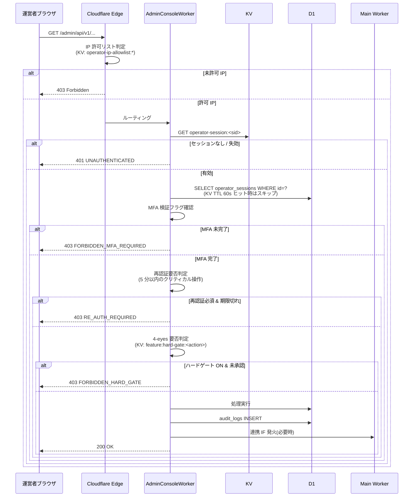
```mermaid
sequenceDiagram
    participant Browser as 運営者ブラウザ
    participant Edge as Cloudflare Edge
    participant Worker as AdminConsoleWorker
    participant KV
    participant D1
    participant Main as Main Worker

    Browser->>Edge: GET /admin/api/v1/...
    Edge->>Edge: IP 許可リスト判定<br/>(KV: operator-ip-allowlist:*)
    alt 未許可 IP
        Edge-->>Browser: 403 Forbidden
    else 許可 IP
        Edge->>Worker: ルーティング
        Worker->>KV: GET operator-session:<sid>
        alt セッションなし / 失効
            Worker-->>Browser: 401 UNAUTHENTICATED
        else 有効
            Worker->>D1: SELECT operator_sessions WHERE id=?<br/>(KV TTL 60s ヒット時はスキップ)
            Worker->>Worker: MFA 検証フラグ確認
            alt MFA 未完了
                Worker-->>Browser: 403 FORBIDDEN_MFA_REQUIRED
            else MFA 完了
                Worker->>Worker: 再認証要否判定<br/>(5 分以内のクリティカル操作)
                alt 再認証必須 & 期限切れ
                    Worker-->>Browser: 403 RE_AUTH_REQUIRED
                else
                    Worker->>Worker: 4-eyes 要否判定<br/>(KV: feature:hard-gate:<action>)
                    alt ハードゲート ON & 未承認
                        Worker-->>Browser: 403 FORBIDDEN_HARD_GATE
                    else
                        Worker->>D1: 処理実行
                        Worker->>D1: audit_logs INSERT
                        Worker->>Main: 連携 IF 発火(必要時)
                        Worker-->>Browser: 200 OK
                    end
                end
            end
        end
    end
```

### 2.6 ディレクトリ構成例

実装プロジェクトの参考レイアウト(別 wrangler プロジェクト):

```text
admin/
├── wrangler.toml                 # AdminConsoleWorker
├── wrangler.billing-webhook.toml # BillingWebhookWorker
├── wrangler.scheduler.toml       # AnnouncementSchedulerWorker, DeletionSLAWorker, ...
├── src/
│   ├── admin-console/
│   │   ├── handlers/             # /admin/api/v1/* ハンドラ
│   │   │   ├── auth.ts
│   │   │   ├── approvals.ts
│   │   │   ├── deleted-resources.ts
│   │   │   ├── restorations.ts
│   │   │   ├── ai-parameters.ts
│   │   │   ├── overrides.ts
│   │   │   ├── announcements.ts
│   │   │   ├── deletion-requests.ts
│   │   │   ├── audit-logs.ts
│   │   │   ├── webhooks-ops.ts
│   │   │   └── pii-fp-reports.ts
│   │   ├── middleware/
│   │   │   ├── ip-allowlist.ts
│   │   │   ├── session.ts
│   │   │   ├── mfa.ts
│   │   │   ├── reauth.ts
│   │   │   ├── csrf.ts
│   │   │   ├── ticket-id.ts
│   │   │   └── four-eyes.ts
│   │   └── lib/
│   │       ├── audit.ts          # audit_logs INSERT + ハッシュチェーン
│   │       ├── hkdf.ts           # HKDF info 値別派生鍵
│   │       ├── totp.ts
│   │       ├── argon2.ts
│   │       ├── pii.ts
│   │       └── stripe.ts
│   ├── billing-webhook/
│   │   ├── handler.ts
│   │   ├── verify.ts             # HMAC-SHA256 署名検証
│   │   ├── canonical.ts          # JSON 正規化 + SHA-256
│   │   └── forward.ts            # 連携 IF #10 mTLS+JWT
│   ├── scheduler/
│   │   ├── announcements.ts      # 1 分 cron
│   │   ├── deletion-sla.ts       # 15 分 cron
│   │   ├── audit-chain.ts        # 日次 02:00 JST
│   │   ├── holiday.ts            # 年次 11/1
│   │   ├── monthly-billing.ts    # 月初 02:00 JST
│   │   ├── retention-purge.ts    # 日次 03:00 JST
│   │   └── r2-audit-archive.ts   # 年次 12/31
│   └── shared/
│       ├── errors.ts             # 全エラーコード定義
│       ├── action-codes.ts       # 監査 action コード列挙
│       ├── kv-keys.ts            # KV キー定数
│       ├── logger.ts             # 構造化ログ
│       └── types.ts
├── migrations/
│   └── d1-admin/
│       ├── 0001_init_operators.sql
│       ├── 0002_init_audit_logs.sql
│       ├── 0003_init_webhook_events.sql
│       ├── ...
│       └── 0021_holiday_master.sql
├── tests/
│   ├── unit/                     # Vitest
│   ├── integration/              # Miniflare
│   ├── e2e/                      # Playwright(SCR-090〜099)
│   └── webhook/                  # Stripe Test Mode
├── scripts/
│   ├── audit-export-verify.ts    # HMAC 署名検証ツール(運営者配布)
│   └── canonical-json.ts         # 正規化アルゴリズム参考実装
└── openapi/
    └── admin-api.yaml            # OpenAPI v3.1 抜粋
```

実装プロジェクトの実際のディレクトリ名は実装段階で確定して構わない(本書はあくまで責務マッピングの参考)。

---

## 3. 利用者・権限詳細設計

### 3.1 運営者ロール定義

要件 §6 / 基本設計 §3.1 より、本書ではロールを **`service_operator` 単一**とする(MVP)。ロール分岐は持たず、操作ごとの安全性は再認証、IP 許可リスト、4-eyes ハードゲート / 承認ログ、監査ログで担保する。

| ロール | 識別子 | 権限範囲 |
|---|---|---|
| サービス運営者 | `service_operator` | 全契約横断の運用操作。本書 §1.3 機能 1〜15 |

利用者ロール(`admin` / `end_user`)はメイン §4 参照。運営者 Worker は **利用者ロールのセッションを受け付けない**(`Cookie` ドメインが `admin.open-faq.example.com` に分離されているため、混入は構造的に発生しない)。

### 3.2 認可ミドルウェア判定順序

すべての `/admin/api/v1/*` リクエストは以下の順で判定する(疑似コード):

```text
function authorize(req, action):
    1. IP 許可リスト
       if !ipAllowed(req.ip, KV:operator-ip-allowlist:<operator_id>):
           return 403 FORBIDDEN_IP
    2. セッション
       sess = KV:operator-session:<sid> or D1:operator_sessions
       if !sess or sess.expires_at < now:
           return 401 UNAUTHENTICATED
    3. MFA
       if !sess.mfa_verified_at:
           return 403 FORBIDDEN_MFA_REQUIRED
    4. CSRF(状態変更系のみ)
       if isMutating(req) and req.headers[X-CSRF-Token] != sess.csrf_token:
           return 403 FORBIDDEN_CSRF
    5. 再認証(action による)
       if action in REAUTH_REQUIRED_ACTIONS:
           if !sess.reauthenticated_at or now - sess.reauthenticated_at > 5min:
               return 403 RE_AUTH_REQUIRED
    6. 操作チケット ID
       if action in TICKET_REQUIRED_ACTIONS:
           if !req.headers[X-Op-Ticket-Id]:
               return 400 TICKET_ID_REQUIRED
    7. 4-eyes
       hardGate = KV:feature:hard-gate:<action>
       if hardGate == true:
           if !req.headers[X-Approval-Id]:
               return 403 FORBIDDEN_HARD_GATE
           approval = D1:operator_approvals WHERE id=? AND state='approved'
           if !approval or approval.requested_by == sess.operator_id:
               return 403 FORBIDDEN_SELF_APPROVE
           if approval.payload_hash != sha256(canonical(req.body)):
               return 409 APPROVAL_PAYLOAD_MISMATCH
           if now > approval.approved_at + 72h:
               return 410 APPROVAL_EXPIRED
    8. action 個別認可
       if !canPerform(sess.operator_id, action):
           return 403 FORBIDDEN
    return ok
```

判定順は固定。失敗時は最初に該当したコードを返す(段階を進めず情報漏洩を最小化)。

### 3.3 セッション・再認証一覧

| 項目 | 値 | 出典 |
|---|---|---|
| セッション TTL (絶対) | MVP 初期値 8 時間 | D-18 |
| セッション TTL (無操作) | <!-- TBD: メイン §4.4.1 は 30 分。運営者業務 (削除請求対応 / DLQ リプレイ等) の長時間操作中断を考慮し、MVP 初期値を 60 分とするか確定要。担当: PO --> 60 分を暫定値とし、最終アクセスで更新 | D-18 / FR-005 |
| セッション保管 | `operator_sessions` テーブル + KV キャッシュ `operator-session:<sid>`(TTL 60 秒) | NFR-311 |
| 再認証期限 | 5 分以内、1 回限り(クリティカル操作前) | FR-005, FR-222 |
| 再認証セッション TTL(KV) | 15 分(`re-auth:<sid>`) | §12.6 |
| 再認証必須 action(集合) | `owner.restore_data` / `ai_parameter.update` / `rate_limit.override` / `budget_limit.override` / `announcement.schedule` / `announcement.send` / `announcement.test_send` / `deletion_request.issue_token` / `webhook.replay` / `pii_rule.update` / `webhook.payload_diff.reprocess` / `master_key.rotate` / `operator.invite` / `operator.disable` / `pricing.update` / `feature.hard_gate.toggle` | SCR-091〜094 / 097 / 098 / 099 |
| MFA 方式 | TOTP(RFC 6238、HMAC-SHA1、6 桁、30 秒) | FR-221 |
| MFA セットアップ初回トークン | 72 時間(`mfa-setup:<account_id>`) | §12.3 |
| MFA 回復コード | 10 個、Argon2id ハッシュ保存、1 回限り | FR-221 |
| パスワードリセット | 60 分有効、自己リセット禁止(別運営者承認経由) | NFR-311 |
| ロックアウト | 5 回連続失敗で `(IP × user_id)` 15 分ロック | FR-007 |

### 3.4 IP 許可リスト

| 項目 | 値 |
|---|---|
| 適用箇所 | エッジ(全パス、ただし `/webhooks/stripe` `/webhooks/resend` は除外) |
| データ | `operator_ip_allowlist(operator_id, cidr, description, granted_at)` |
| KV キャッシュ | `operator-ip-allowlist:<operator_id>`(値は CIDR の JSON 配列、TTL 60 秒) |
| 評価方式 | リクエスト元 IP が CIDR 配列のいずれかにマッチ |
| 未許可時応答 | `403 Forbidden`(ログイン画面さえ表示しない、§13.6.Y アクセシビリティ規約に従う) |
| ホワイトリスト推奨 | 本社 IP・VPN IP・運営者自宅 IP(`/32` または `/64` 単位) |
| 一時例外 | メイン要件 §6.2.1 緊急区分(特に区分2 全員ロックアウト)+ §6.2.2 発動条件成立時に限り、別運営者の追加(SCR でなくチケット駆動の DB 直接変更 `prod.direct_change`)+ 監査記録 |

#### 3.4.1 MVP 仕様の明確化

ログイン前後の判定境界が曖昧だった点を以下で確定する:

| フェーズ | 採用 KV | 評価対象 | 振る舞い |
|---|---|---|---|
| **ログイン前** (`/admin/api/v1/auth/login` を含むすべてのエッジリクエスト) | **`operator-ip-allowlist:global`** (全運営者共通の許可リスト) | リクエスト IP が `global` リスト内か | マッチしなければ `403 IP_BLOCKED`、ログイン画面さえ表示しない |
| **ログイン後** (account_id が確定したセッション付リクエスト) | `operator-ip-allowlist:<operator_id>` (個別運営者リスト) | リクエスト IP が個別リスト内か | マッチしなければ `403 IP_BLOCKED` |

##### MVP では「グローバル」のみ

- **MVP (T1)**: **全運営者共通の IP 許可リスト** (`operator-ip-allowlist:global`) のみ実装。`operator_ip_allowlist` テーブルは存在するが本番では空のまま、`global` の CIDR を更新するフローのみ運用。
  - 更新は `prod.direct_change` (5y 監査) + 4-eyes 承認ログ (`operator_ip.grant` / `revoke`)。
  - グローバル KV の値: `["203.0.113.0/24", "198.51.100.0/24"]` のような社内 IP / VPN レンジ 5〜10 件。

##### 評価順序の擬似コード

```ts
async function evaluateOperatorIp(env: Env, ip: string, operatorId: string | null) {
  const global = await env.KV_CACHE.get<string[]>('operator-ip-allowlist:global', 'json') ?? [];
  if (matchAnyCidr(ip, global)) return true;
  if (operatorId) {  // ログイン後のみ
    const personal = await env.KV_CACHE.get<string[]>(`operator-ip-allowlist:${operatorId}`, 'json') ?? [];
    if (matchAnyCidr(ip, personal)) return true;
  }
  return false;
}
```

- **MVP の運用シンプル化**: `operator-ip-allowlist:<operator_id>` は MVP では **常に空** とすることで「個別リストを忘れて誰もログインできない」事故を防止。
- **緊急回避**: 全社 VPN 障害等で誰もログインできなくなった場合、`prod.direct_change` で `operator-ip-allowlist:global` に `0.0.0.0/0` を一時投入 → 障害復旧後 4-eyes で revert (24h 以内必須、監査ログ厳重)。

### 3.5 操作チケット ID

| 項目 | 値 |
|---|---|
| ヘッダ名 | `X-Op-Ticket-Id` |
| 正規表現 | `^[A-Za-z0-9_\-]{1,64}$`(最大 64 文字、英数 + `_` + `-`) |
| 必須 action | クリティカル操作のすべて(再認証必須 action ⊃ チケット必須 action) |
| 保存先 | `audit_logs.ticket_id` |
| 用途 | 対応チケット(社内 Jira / GitHub Issue / 顧客問合せ ID)から逆引き |

### 3.6 4-eyes MVP 適用範囲

基本設計 §13.2 / D-12 / §6.2.1 / E より:

| 区分 | ハードゲート(申請承認必須) | 承認ログのみ(単独実行可・事後監査) | バイパス |
|---|---|---|---|
| MVP | `owner.physical_delete` / `ai_parameter.update` / `master_key.rotate` | `owner.suspend` / `owner.restore` / `pricing.update` / `rate_limit.override` / `budget_limit.override` / `widget.force_stop` / `feature.hard_gate.toggle` / `owner.restore_data` | 不可 |

ハードゲート切替は KV `feature:hard-gate:<action_code>`(値 `true` / `false`)で動的制御。デプロイなしで切替可能(§9.2)。

### 3.7 運営者ロール

| 項目 | 仕様 |
|---|---|
| ロール | `service_operator` 単一 |
| 権限制御 | action 個別認可、再認証、4-eyes ハードゲート / 承認ログ、監査ログで統制 |
| 監査 | 運営者の高権限操作は action コード単位で `audit_logs` に記録 |

---

## 4. 状態詳細設計

本章は基本設計 §4 + 付録 B を物理化する。6 状態機械を stateDiagram-v2 で完全描画し、各遷移に「トリガー API」「副作用(連携 IF / inbox / audit action)」「ガード条件」を併記する。

### 4.1 状態機械の一覧

| # | 状態列 | 主管 |
|---|---|---|
| 4.2 | `deletion_requests.state` | 本書(SCR-095) |
| 4.3 | `webhook_events.state` | 本書(SCR-097) |
| 4.4 | `operator_approvals.state` | 本書(承認待ち一覧) |
| 4.5 | `announcement_drafts.state` | 本書(SCR-094) |
| 4.6 | `pii_false_positive_reports.state` | 本書(SCR-098) |
| 4.7 | `webhook_payload_diffs.state` | 本書(SCR-099) |
| 参考 | `accounts.contract_status`(オーナー行) | メイン主管(本書は連携 IF #1 / #10 検知側) |

### 4.2 deletion_requests.state(削除請求 SLA)

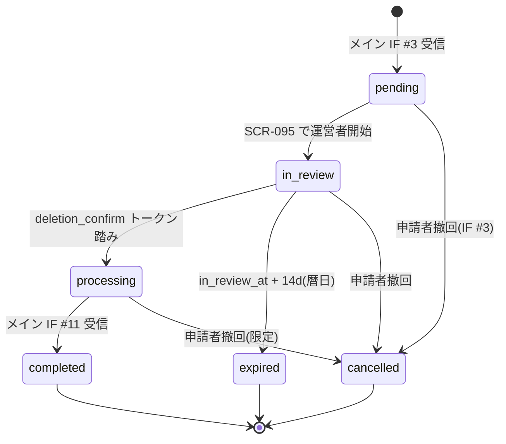
```mermaid
stateDiagram-v2
    [*] --> pending: メイン IF #3 受信
    pending --> in_review: SCR-095 で運営者開始
    pending --> cancelled: 申請者撤回(IF #3)
    in_review --> processing: deletion_confirm トークン踏み
    in_review --> expired: in_review_at + 14d(暦日)
    in_review --> cancelled: 申請者撤回
    processing --> completed: メイン IF #11 受信
    processing --> cancelled: 申請者撤回(限定)
    expired --> [*]
    completed --> [*]
    cancelled --> [*]
```

| From | To | トリガー | 副作用 | ガード条件 |
|---|---|---|---|---|
| - | pending | 連携 IF #3 受付通知受信(メイン SCR-026 経由) | SLA タイマー起動(`sla_due_at = pending_at + 7 営業日`)/ `audit:deletion_request.create`(1y) | `deletion_request_id` 冪等(UNIQUE) |
| pending | in_review | `POST /deletion-requests/{id}/transition` `to=in_review` | `in_review_at = now`、`expires_at = in_review_at + 14 暦日` 起動 / `audit:deletion_request.transition`(1y) | state=pending |
| pending / in_review | cancelled | 連携 IF #3 cancellation 受信 | SLA タイマー停止 / `audit:deletion_request.cancel`(1y) | 申請者本人確認(メイン側) |
| processing | cancelled | 連携 IF #3 cancellation 受信(限定) | SLA タイマー停止 / `audit:deletion_request.cancel`(5y) | 物理削除がまだメイン側で開始されていないことを確認。開始後は不可 |
| in_review | processing | `POST /deletion-requests/{id}/transition` `to=processing`(deletion_confirm トークン使用済を確認) | 連携 IF #3 削除実行指示送信 / `audit:deletion_request.transition`(5y) | state=in_review、`deletion_confirm` トークン消費済 |
| in_review | expired | DeletionSLAWorker(`expires_at < now`) | 運営者 inbox(system/normal) / `audit:deletion_request.expire`(1y) | now > expires_at |
| processing | completed | 連携 IF #11 受信(メインの物理削除完了通知) | 管理者ユーザー通知(IF #12)/ `accounts_retired`(オーナー行スナップショット) INSERT(メイン主管)/ `audit:deletion_request.complete`(5y) | state=processing |

**SLA タイマー** は §13.9(D-16 正本)で確定。営業日 = 月〜金 - `holiday_master` - {12/29, 12/30, 12/31, 1/1, 1/2, 1/3}。

### 4.3 webhook_events.state(Stripe Webhook)

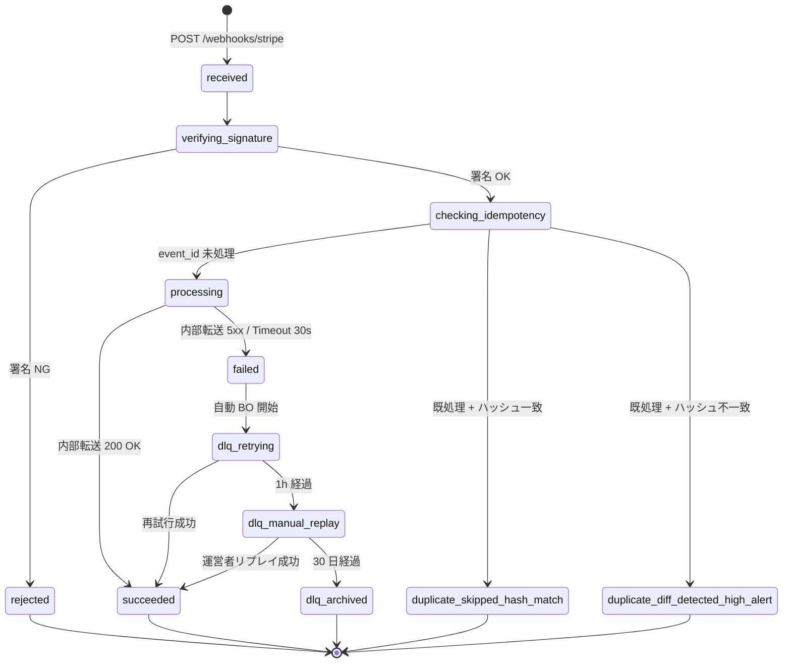
```mermaid
stateDiagram-v2
    [*] --> received: POST /webhooks/stripe
    received --> verifying_signature
    verifying_signature --> rejected: 署名 NG
    verifying_signature --> checking_idempotency: 署名 OK
    checking_idempotency --> processing: event_id 未処理
    checking_idempotency --> duplicate_skipped_hash_match: 既処理 + ハッシュ一致
    checking_idempotency --> duplicate_diff_detected_high_alert: 既処理 + ハッシュ不一致
    processing --> succeeded: 内部転送 200 OK
    processing --> failed: 内部転送 5xx / Timeout 30s
    failed --> dlq_retrying: 自動 BO 開始
    dlq_retrying --> succeeded: 再試行成功
    dlq_retrying --> dlq_manual_replay: 1h 経過
    dlq_manual_replay --> succeeded: 運営者リプレイ成功
    dlq_manual_replay --> dlq_archived: 30 日経過
    rejected --> [*]
    succeeded --> [*]
    duplicate_skipped_hash_match --> [*]
    duplicate_diff_detected_high_alert --> [*]
    dlq_archived --> [*]
```

| From | To | トリガー | 副作用 |
|---|---|---|---|
| - | received | Stripe POST | row INSERT |
| received | verifying_signature | 即時 | - |
| verifying_signature | rejected | HMAC NG | `401` + 運営者 inbox high(`webhook.signature.invalid`、5y) |
| verifying_signature | checking_idempotency | HMAC OK | `payload_hash = sha256(canonical(payload))` 計算 |
| checking_idempotency | processing | UNIQUE 違反なし | INSERT、R2 退避 (`dlq-stripe-events/<event_id>.json`、30d) |
| checking_idempotency | duplicate_skipped_hash_match | 既存 row.payload_hash と一致 | `200` 返却 + ログ(stripe.event.duplicate_skipped) |
| checking_idempotency | duplicate_diff_detected_high_alert | 既存 row.payload_hash と不一致 | `webhook_payload_diffs` INSERT(`state=detected`)、運営者 inbox high、SCR-099 待ち、**自動上書き禁止** |
| processing | succeeded | 連携 IF #10 200 OK | `audit:stripe.event.processed`(7y) |
| processing | failed | 5xx / Timeout 30s | `attempt_count++`、Queues DLQ 投入 |
| failed | dlq_retrying | DLQAutoBackoffWorker | 指数 BO(1m → 4m → 16m、最大 3 回) |
| dlq_retrying | succeeded | 再試行成功 | - |
| dlq_retrying | dlq_manual_replay | 1h 経過 + 自動 BO 3 回失敗 | 運営者 inbox high(`webhook.dlq.stuck`)、SCR-097 で運営者待ち |
| dlq_manual_replay | succeeded | SCR-097 リプレイ実行 | `audit:webhook.replay`(5y) |
| dlq_manual_replay | dlq_archived | 30 日経過 | リプレイ不可、R2 退避のみ保持 |

### 4.4 operator_approvals.state(4-eyes 承認)

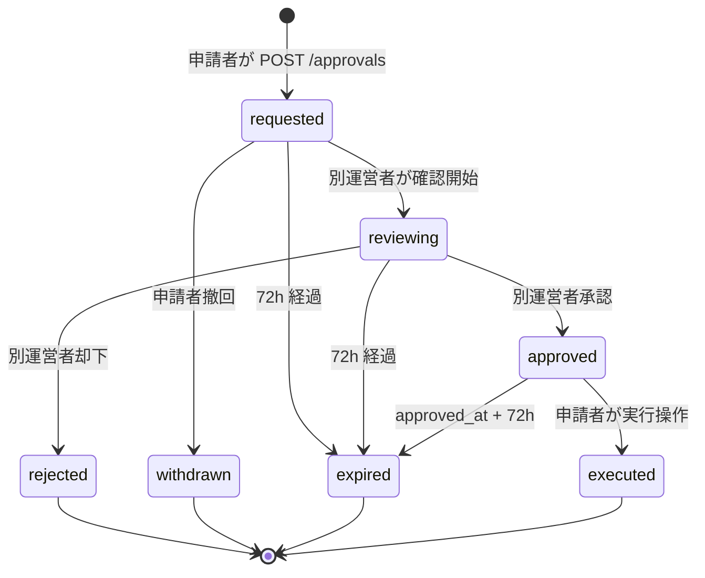
```mermaid
stateDiagram-v2
    [*] --> requested: 申請者が POST /approvals
    requested --> reviewing: 別運営者が確認開始
    requested --> withdrawn: 申請者撤回
    requested --> expired: 72h 経過
    reviewing --> approved: 別運営者承認
    reviewing --> rejected: 別運営者却下
    reviewing --> expired: 72h 経過
    approved --> executed: 申請者が実行操作
    approved --> expired: approved_at + 72h
    rejected --> [*]
    withdrawn --> [*]
    expired --> [*]
    executed --> [*]
```

**状態定義の補足**: `rejected` は **別運営者の却下**(他者による否認)、`withdrawn` は **申請者本人の撤回**(自己取り下げ)を表す。両者は監査上の意味が異なるため別状態とし、DB CHECK で `requested_by != rejected_by` を強制する一方、`withdrawn_by` は `requested_by` と同一であることを CHECK で強制する。

| From | To | トリガー | ガード条件 |
|---|---|---|---|
| - | requested | `POST /approvals` | `requested_at = now`、`expires_at = requested_at + 72h`、`payload_hash = sha256(canonical(payload))` |
| requested | reviewing | `POST /approvals/{id}/start-review`(別運営者) | requested_by ≠ session.operator_id |
| reviewing | approved | `POST /approvals/{id}/approve`(別運営者) | requested_by ≠ approved_by(DB CHECK)、payload_hash 改ざんなし |
| reviewing | rejected | `POST /approvals/{id}/reject`(別運営者) | requested_by ≠ rejected_by(DB CHECK)、コメント必須 |
| requested | withdrawn | `POST /approvals/{id}/withdraw`(申請者本人) | requested_by == withdrawn_by == session.operator_id(DB CHECK) |
| requested / reviewing | expired | `now > expires_at` | バッチで自動遷移 |
| approved | executed | `POST /approvals/{id}/execute`(申請者) + `X-Approval-Id` ヘッダ付きクリティカル操作 | `now < approved_at + 72h`、`sha256(canonical(req.body)) == payload_hash` |
| approved | expired | `now > approved_at + 72h` | バッチ |

### 4.5 announcement_drafts.state(お知らせ)

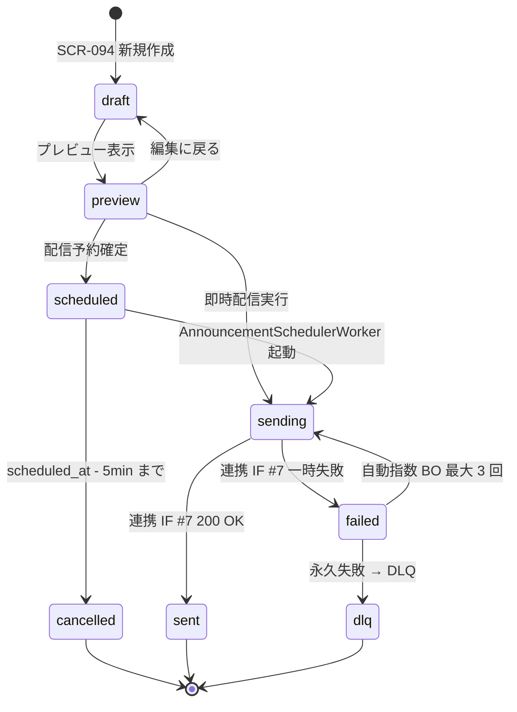
```mermaid
stateDiagram-v2
    [*] --> draft: SCR-094 新規作成
    draft --> preview: プレビュー表示
    preview --> draft: 編集に戻る
    preview --> scheduled: 配信予約確定
    preview --> sending: 即時配信実行
    scheduled --> sending: AnnouncementSchedulerWorker 起動
    scheduled --> cancelled: scheduled_at - 5min まで
    sending --> sent: 連携 IF #7 200 OK
    sending --> failed: 連携 IF #7 一時失敗
    failed --> sending: 自動指数 BO 最大 3 回
    failed --> dlq: 永久失敗 → DLQ
    cancelled --> [*]
    sent --> [*]
    dlq --> [*]
```

| From | To | トリガー | ガード条件 |
|---|---|---|---|
| - | draft | `POST /announcements` | 件名 / 本文サニタイズ後保存 |
| draft | preview | `POST /announcements/{id}/preview` | サニタイズ後 HTML を返却 |
| preview | scheduled | `POST /announcements/{id}/schedule` | `scheduled_at` ∈ [now, now+30d]、再認証 + チケット ID 必須 |
| preview | sending | `POST /announcements/{id}/send`(即時) | 同上 |
| scheduled | sending | AnnouncementSchedulerWorker(1 分 cron、`scheduled_at ≤ now + 5min`) | 同 row が `scheduled` のまま |
| scheduled | cancelled | `POST /announcements/{id}/cancel` | `now < scheduled_at - 5min` |
| sending | sent | 連携 IF #7 200 OK | - |
| sending | failed | 連携 IF #7 一時失敗(5xx / Timeout) | `attempt_count++`、自動指数 BO で再送 |
| failed | sending | AnnouncementSchedulerWorker 自動 BO(1m → 4m → 16m、最大 3 回) | `attempt_count < 3` |
| failed | dlq | 自動 BO 3 回失敗 | 運営者 inbox high(`announcement.dispatch.dlq`、5y) |

### 4.6 pii_false_positive_reports.state(PII 誤検出報告)

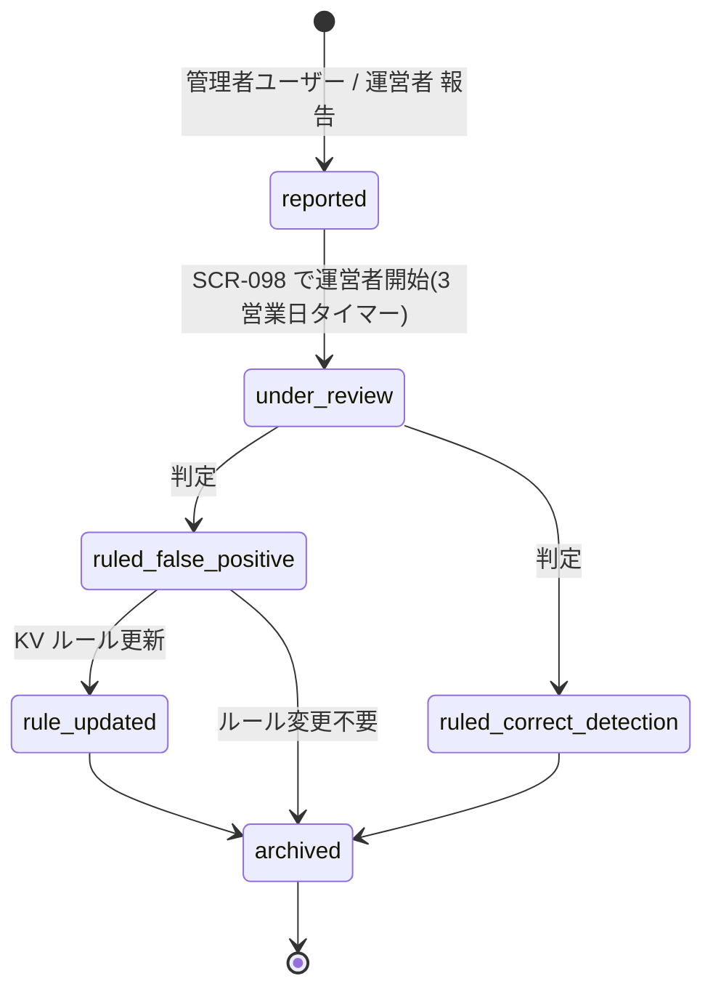
```mermaid
stateDiagram-v2
    [*] --> reported: 管理者ユーザー / 運営者 報告
    reported --> under_review: SCR-098 で運営者開始(3 営業日タイマー)
    under_review --> ruled_false_positive: 判定
    under_review --> ruled_correct_detection: 判定
    ruled_false_positive --> rule_updated: KV ルール更新
    ruled_false_positive --> archived: ルール変更不要
    ruled_correct_detection --> archived
    rule_updated --> archived
    archived --> [*]
```

| From | To | トリガー | 副作用 |
|---|---|---|---|
| - | reported | メイン IF or 運営者 POST | 3 営業日タイマー起動準備 |
| reported | under_review | `POST /pii-fp-reports/{id}/transition` `to=under_review` | `review_started_at = now`、`review_due_at = + 3 営業日`(holiday_master 参照) |
| under_review | ruled_false_positive | `POST /pii-fp-reports/{id}/transition` `to=ruled_false_positive` | ルール更新候補へ |
| under_review | ruled_correct_detection | 同 `to=ruled_correct_detection` | アーカイブ |
| ruled_false_positive | rule_updated | `POST /pii-rules/revisions`(再認証 + チケット必須) | `pii_rules_revisions` INSERT、KV `pii-rules:regex` / `pii-rules:classifier` PUT(D-13)、`audit:pii_rule.update`(5y) |
| - | archived | 90 日経過 or `rule_updated` 後 | 一覧から非表示 |

**重要**: D-13 より、ルール更新は **過去データを修正しない**(今後の検出にのみ適用)。

### 4.7 webhook_payload_diffs.state(ペイロード差分検出)

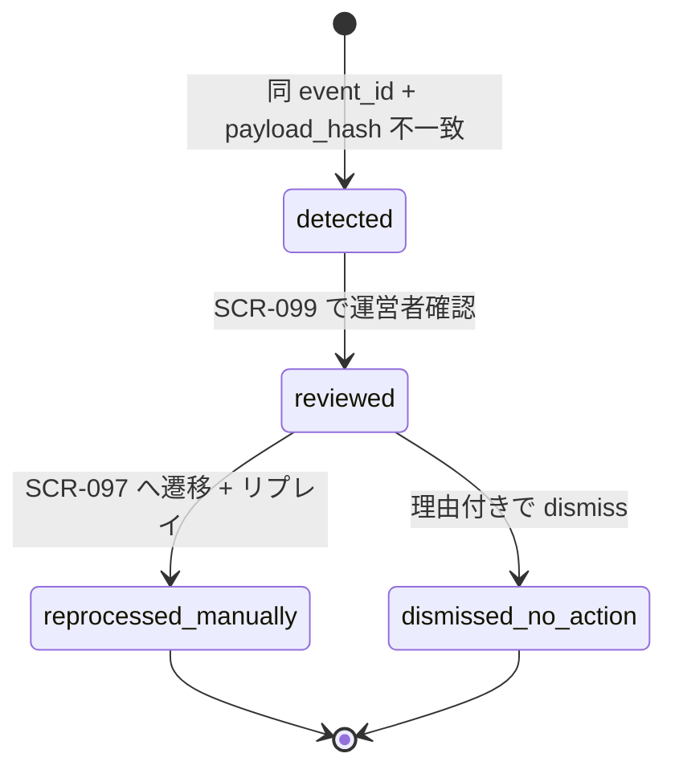
```mermaid
stateDiagram-v2
    [*] --> detected: 同 event_id + payload_hash 不一致
    detected --> reviewed: SCR-099 で運営者確認
    reviewed --> reprocessed_manually: SCR-097 へ遷移 + リプレイ
    reviewed --> dismissed_no_action: 理由付きで dismiss
    reprocessed_manually --> [*]
    dismissed_no_action --> [*]
```

| From | To | トリガー | 副作用 |
|---|---|---|---|
| - | detected | BillingWebhookWorker が差分検出 | 運営者 inbox high(`webhook.payload_diff.detect`)、`audit:webhook.payload_diff.detect`(5y) |
| detected | reviewed | `POST /webhook-payload-diffs/{id}/start-review` | `reviewed_at = now`、`audit:webhook.payload_diff.review`(5y) |
| reviewed | reprocessed_manually | `POST /webhook-payload-diffs/{id}/reprocess`(再認証 + チケット必須、SCR-097 リプレイへ遷移) | `audit:webhook.payload_diff.reprocess`(5y) |
| reviewed | dismissed_no_action | `POST /webhook-payload-diffs/{id}/dismiss`(理由必須) | `audit:webhook.payload_diff.dismiss`(5y) |

### 4.8 契約状態(参考、メイン主管)

`accounts.contract_status`(オーナー行)(active / grace / suspended / deleted_pending / deleted)はメイン §4.9 を正本参照。本書側では連携 IF #1(契約停止イベント)・連携 IF #10(課金 Webhook 起因)で検知し、SCR-090 / SCR-091 で参照表示・復元操作のみを行う。

---

## 5. 画面詳細設計(SCR-090〜099)

本章は基本設計 §5 + 画面設計書 v2.3(`wireframes.html`)を実装可能粒度に詳細化する。画面項目(表示項目 / 入力項目 / 操作ボタン / 主要バリデーション要件 / 表示エラー方針)は顧客管理基本設計 §5.3 を正本とし、本章では各 SCR について以下の実装詳細のみを確定する:

- Zod スキーマ / TypeScript 型(実装値)
- 正規表現・文字種制約の実装値
- エラーコード(`ERR_*`)とメッセージキー
- 呼出 API のリクエスト / レスポンス JSON Schema、必須ヘッダ
- 4-eyes ハードゲート / 再認証フローのハンドラ実装
- 副作用ロールバック (a)〜(g) 等の実装詳細
- CMP-E / CMP-F / CMP-L 共通 UI 部品との連携
- 関連 FR / AC(参照)

### 5.1 画面一覧(再掲 + 主管 API)

| SCR | 名称 | 主管 API グループ | 4-eyes(MVP) | 再認証 | 関連 FR |
|---|---|---|---|---|---|
| SCR-090 | 削除データ参照(運営者) | §7.5 | なし | 不要 | FR-200, FR-223 |
| SCR-091 | 削除データ復元 | §7.5 | 承認ログ | 必須 | FR-201〜FR-211, FR-222 |
| SCR-092 | AI 推論パラメータ設定 | §7.6 | **ハードゲート** | 必須 | FR-055, FR-061〜066 |
| SCR-093 | 契約別レート/予算上書き | §7.6 | 承認ログ | 必須 | FR-121, FR-128, FR-224(b) |
| SCR-094 | お知らせ作成・配信 | §7.7 | なし | 必須 | FR-149, FR-188, FR-189 |
| SCR-095 | 個人情報削除の対応ダッシュボード | §7.8 | なし | 必須(トークン発行時) | FR-227, FR-228 |
| SCR-096 | 運営者活動ダッシュボード(監査) | §7.9 | なし | 不要 / エクスポート時は記録 | FR-229, FR-230, FR-232 |
| SCR-097 | 課金 Webhook リプレイ・DLQ 操作 | §7.10 | なし | 必須(リプレイ実行時) | FR-302, NFR-808 |
| SCR-098 | PII 誤検出報告管理 | §7.11 | なし | 必須(ルール更新時) | FR-060, FR-064 |
| SCR-099 | Webhook ペイロード差分検出一覧 | §7.10 | なし | 必須(手動再処理時) | FR-302 異常系, AC-041 |

### 5.2 共通 UI 部品

| ID | 部品 | 配置 | 仕様 |
|---|---|---|---|
| CMP-A | グローバルヘッダ | 全画面上部 | サービス名 / 運営者表示名 / MFA バッジ(緑=検証済 / 赤=未検証) / 運営者 inbox バッジ(未読件数) / 再認証残り時間 / ログアウト |
| CMP-B | サイドメニュー | 全画面左 | 13 項目(§5.5)+ 各バッジ(承認待ち / SLA 違反 / DLQ 滞留 / ペイロード差分) |
| CMP-C | チケット ID 入力モーダル | クリティカル操作前 | ヘッダ `X-Op-Ticket-Id`、最大 64 文字、必須、正規表現 `^[A-Za-z0-9_\-]{1,64}$` |
| CMP-D | 再認証モーダル | クリティカル操作前(5 分以内に未実施) | パスワード再入力(MVP)、`POST /auth/reauth`、成功で `re-auth:<sid>` KV PUT(TTL 15 分、1 回限り) |
| CMP-E | 4-eyes 申請モーダル | ハードゲート操作前(MVP 3 操作) | action_code / 申請理由 / payload プレビュー(JSON) / payload_hash / `POST /approvals` |
| CMP-F | 4-eyes 承認モーダル | 別運営者のホーム画面「承認待ち」一覧経由 | 申請内容確認 / payload diff (改ざんチェック) / 承認 or 却下 / コメント / `POST /approvals/{id}/approve|reject` |
| CMP-G | 運営者 inbox バッジ | ヘッダ右上 | 未読件数表示、クリックで `/inbox` 画面へ |
| CMP-H | SLA 違反バッジ | サイドメニュー SCR-095 横 | 5 営業日経過件数(黄)/ 7 営業日超過件数(赤) |
| CMP-I | DLQ 滞留バッジ | サイドメニュー SCR-097 横 | 1h 以上 / 24h 以上(赤) |
| CMP-J | ペイロード差分バッジ | サイドメニュー SCR-099 横 | detected 件数(赤) |
| CMP-K | ハッシュチェーン検証バッジ | サイドメニュー SCR-096 横 | 直近の検証結果(緑 OK / 赤 不一致 / 灰 未実行) |
| CMP-L | ペイロード差分ビューア | SCR-099 詳細 | 既処理 payload と新 payload の JSON diff、除外フィールド(D-06)はグレーアウト |
| CMP-M | 状態バッジ | 一覧画面 | `state` 値別の色分け(pending=灰、processing=青、succeeded=緑、failed=赤、expired=橙) |

#### 5.2.1 CMP-E 4-eyes 申請モーダル詳細(★TH-5)

| 項目 | 仕様 |
|---|---|
| トリガー | クリティカル操作画面で「申請」ボタン押下、または KV `feature:hard-gate:<action>` が `true` のとき自動表示 |
| 入力 | action_code(表示固定) / 申請理由(必須、最大 1000 文字) / payload プレビュー(JSON、編集不可) / payload_hash(`sha256(canonical(payload))`、表示用) / 対応チケット ID(`X-Op-Ticket-Id` 必須) |
| 操作 | 「申請」: `POST /approvals` 発火、`state=requested` で INSERT、72h TTL / 「キャンセル」 |
| 完了表示 | 申請 ID + `expires_at` を表示、別運営者通知発火(全運営者 inbox normal) |
| エラー表示 | 自己申請禁止(自身の前申請が `requested`/`reviewing`/`approved` で存在し別運営者が処理中)→ `409 APPROVAL_PENDING` |

#### 5.2.2 CMP-F 4-eyes 承認モーダル詳細(★TH-5)

| 項目 | 仕様 |
|---|---|
| トリガー | ホーム画面「承認待ち一覧」または運営者 inbox 内リンクから遷移 |
| 表示 | action_code / 申請者 (`requested_by` 表示名) / 申請理由 / payload プレビュー(整形済 JSON) / payload_hash(検証用) / `requested_at` / `expires_at`(残り時間) |
| ガード(クライアント側) | 自身 == 申請者の場合は承認ボタン非活性(`FORBIDDEN_SELF_APPROVE` をサーバ側でも返却) |
| 操作 | 「承認」: `POST /approvals/{id}/approve`、コメント任意 / 「却下」: `POST /approvals/{id}/reject`、コメント必須 / 「保留」: 何もしないで閉じる |
| 完了表示 | 承認完了 → 申請者へ inbox 通知(承認後 72h 以内に申請者が実行操作を完了する必要あり)/ 却下完了 → 申請者へ inbox 通知 |
| エラー表示 | `requested_by == approved_by` で 403 / `expires_at < now` で 410 |

#### 5.2.3 ペイロード差分ビューア(CMP-L)詳細

| 項目 | 仕様 |
|---|---|
| 入力 | `event_id` / 既処理 `payload_hash` / 新 `payload_hash` / 除外フィールド適用済の差分 JSON |
| 表示 | 既処理 / 新 / 除外(グレーアウト)の 3 ペイン。差分は緑(追加)/ 赤(削除)/ 黄(変更)で色分け |
| 除外フィールド | 付録 H の固定リスト(`created`, `request_id`, `idempotency_key_resent`, `livemode`, `api_version`, `pending_webhooks`, `data.object.test_clock`, `data.object.metadata.test_*`)を `<span class="excluded">` で網掛け |
| 操作 | 「SCR-097 へ遷移」/ 「dismiss」(理由必須) |

#### 5.2.4 CMP × ARIA 属性指定一覧（WCAG 2.1 AA / NFR-1001〜1003）

各共通部品の **必須 ARIA 属性 / role** を以下に固定する。実装側は本表を機械検証可能なテーブルとし、Playwright + axe-core で違反 0 件維持（§13.6）。

| 部品 | 主要 role | aria 属性 | キーボード操作 | 補足 |
|---|---|---|---|---|
| CMP-A グローバルヘッダ | `role="banner"` | `aria-label="グローバルヘッダ"` | Tab で順次フォーカス | MFA バッジは `role="status"` + `aria-live="polite"` |
| CMP-B サイドメニュー | `role="navigation"` | `aria-label="メインナビゲーション"` / 現在地に `aria-current="page"` | 上下矢印 + Enter | バッジは `aria-label="<項目名> 未処理 N 件"` で読み上げ可 |
| CMP-C チケット ID 入力モーダル | `role="dialog"` `aria-modal="true"` | `aria-labelledby="cmp-c-title"` / `aria-describedby="cmp-c-desc"` | Tab で内部循環 (focus trap) / Esc で閉じる | フォーカス初期は入力欄、閉じた後は **発火元ボタンへ戻る** |
| CMP-D 再認証モーダル | `role="dialog"` `aria-modal="true"` | `aria-labelledby="cmp-d-title"` / `aria-describedby="cmp-d-reason"` | Tab 循環 / Esc 不可 (誤クリック防止、× ボタンで明示閉じ) | パスワード欄 `aria-required="true"` `autocomplete="current-password"` |
| CMP-E 4-eyes 申請モーダル | `role="dialog"` `aria-modal="true"` | `aria-labelledby="cmp-e-title"` / 理由欄 `aria-required="true"` / payload プレビュー `aria-readonly="true"` | Tab 循環 / Esc で「下書き保存して閉じる」 | エラー時 `role="alert"` でフォーカス移動 |
| CMP-F 4-eyes 承認モーダル | `role="dialog"` `aria-modal="true"` | `aria-labelledby="cmp-f-title"` / 自己承認時の承認ボタン `aria-disabled="true"` + `aria-describedby` でブロック理由を読み上げ | Tab 循環 / Esc 不可 | 却下時のコメント欄 `aria-required="true"` |
| CMP-G inbox バッジ | `role="status"` | `aria-live="polite"` / `aria-label="未読 N 件"` | Enter で `/inbox` へ遷移 | 件数 0 は `aria-hidden="true"` |
| CMP-H SLA 違反バッジ | `role="status"` | `aria-live="polite"` / `aria-label="SLA 違反 N 件、5 営業日経過 M 件"` | - | 色 + テキスト併用（色のみ依存禁止） |
| CMP-I DLQ 滞留バッジ | `role="status"` | `aria-live="polite"` | - | 1h 経過は polite、24h 超過は `aria-live="assertive"` |
| CMP-J ペイロード差分バッジ | `role="status"` | `aria-live="polite"` | - | 同上 |
| CMP-K ハッシュチェーン検証バッジ | `role="status"` | `aria-live="polite"` / NG 時 `aria-live="assertive"` | - | NG は color + icon + テキスト 3 重表示 |
| CMP-L ペイロード差分ビューア | `role="region"` | `aria-label="ペイロード差分"` / 各ペイン `aria-labelledby` で「既処理 / 新 / 除外」 | 左右矢印でペイン切替 | 除外フィールドは `aria-hidden="false"` + `aria-describedby="excluded-reason"` |
| CMP-M 状態バッジ | - | `aria-label="<state> 状態"` | - | 色 + 日本語ラベル併用 |

##### モーダル focus trap 実装規約

- **採用ライブラリ**: `focus-trap-react`（または同等 OSS。MVP 着手時に確定）。CMP-C / D / E / F の 4 モーダルに必須適用。
- **挙動**: モーダル開始時に **最初のフォーカス可能要素** にフォーカス、Tab / Shift+Tab で循環、Esc 押下時の挙動はモーダルごとに上表で定義。
- **閉じた直後**: フォーカスを **発火元ボタン**（あるいは指定要素 `data-focus-restore-target`）に明示復元。
- **テスト**: Playwright で「Tab を 50 回押してもフォーカスがモーダル外に出ない」「Esc 挙動」「閉じた直後の `document.activeElement` 検証」を `apps/admin-console/e2e/a11y/focus-trap.spec.ts` で確認。

> メイン側 §13.4.X でも同じ focus trap 規約を採用（共通基盤）。

### 5.3 各画面定義

#### 5.3.1 SCR-090 削除データ参照(運営者)

画面項目(表示・入力・操作・主要制約)は顧客管理基本設計 §5.3.1 SCR-090 を正本とする。本節では、当該画面の実装に関する Zod スキーマ・正規表現の実装値・エラーコード・呼出 API・ハンドラ実装方針のみを記載する。

呼出 API: §7.5 / 関連 FR: FR-200, FR-223, NFR-704

##### 5.3.1.1 呼出 API

| 用途 | メソッド | パス |
|---|---|---|
| 一覧検索 | GET | `/admin/api/v1/deleted-resources?type=&deletion_type=&owner=&from=&to=&cursor=` |
| 詳細取得 | GET | `/admin/api/v1/deleted-resources/{type}/{id}` |
| 復元遷移 | - | SCR-091 へ `resource_type` / `resource_id` をクエリで引き継ぎ |

##### 5.3.1.2 Zod スキーマ(検索クエリ)

```ts
const DeletedResourceQuery = z.object({
  type: z.array(z.enum(['owner', 'project', 'faq', 'account', 'announcement'])).optional(),
  deletion_type: z.array(z.enum(['deleted', 'disabled', 'deleted_pending'])).optional(),
  owner_account: z.string().max(100).optional(),
  from: z.string().datetime(),
  to: z.string().datetime(),
  cursor: z.string().optional(),
}).refine((q) => new Date(q.to).getTime() - new Date(q.from).getTime() <= 366 * 24 * 3600_000,
  { message: 'ERR_RANGE_TOO_WIDE' });
```

##### 5.3.1.3 エラーコード

| コード | メッセージキー | 条件 | HTTP |
|---|---|---|---|
| `ERR_RANGE_TOO_WIDE` | `errors.search.range_too_wide` | from-to 範囲が 1 年超 | 400 |
| `ERR_DELETED_PHYSICAL` | `errors.restore.physical_deleted`(FR-209) | 物理削除済参照 | 404 |
| `ERR_DELETED_GDPR` | `errors.restore.gdpr_deleted`(FR-210) | GDPR 削除済参照 | 404 |
| `ERR_TOO_MANY_RESULTS` | `errors.search.too_many_results` | ヒット 100 万件超過 | 400 |

#### 5.3.2 SCR-091 削除データ復元

画面項目(表示・入力・操作・主要制約)は顧客管理基本設計 §5.3.2 SCR-091 を正本とする。本節では、当該画面の実装に関する Zod スキーマ・正規表現の実装値・エラーコード・呼出 API・4-eyes フロー・副作用ロールバック (a)〜(g) の実装方針のみを記載する。

呼出 API: `POST /admin/api/v1/restorations`(§7.5)/ 関連 FR: FR-201〜FR-211, FR-222

##### 5.3.2.1 呼出 API

| 用途 | メソッド | パス | 必須ヘッダ |
|---|---|---|---|
| プリチェック | POST | `/admin/api/v1/restorations:precheck` | `X-Op-Ticket-Id`、`X-Reauth-Token`(5 分以内) |
| 復元実行 | POST | `/admin/api/v1/restorations` | `X-Op-Ticket-Id`、`X-Reauth-Token` |

##### 5.3.2.2 Zod スキーマ(復元実行リクエスト)

```ts
const RestoreRequest = z.object({
  resource_type: z.enum(['owner', 'project', 'faq', 'account', 'announcement']),
  resource_id: z.string().min(1),
  reason: z.string().min(1).max(1000),
  ticket_id: z.string().max(64).regex(/^[A-Za-z0-9_-]+$/).optional(),
});
type RestoreRequest = z.infer<typeof RestoreRequest>;
```

`ticket_id` は基本設計 §5.3.2 に従い任意項目。ヘッダ `X-Op-Ticket-Id` として送出される場合の文字種制約のみ実装側で正規表現で確認する。

##### 5.3.2.3 副作用ロールバック (a)〜(g) 実装(D-07)

プリチェック API は (a)〜(g) を並列実行し、結果を `precheck_result` として返す。

| ID | 実装内容 | 失敗判定 |
|---|---|---|
| (a) | Stripe API `customers.retrieve` + `subscriptions.list({status:'canceled'})` で再開可否確認 | NG → 復元ボタン非活性 |
| (b) | KV `dlq:owner:<id>` カウンタ取得 | 件数表示(警告) |
| (c) | `announcements_deliveries WHERE owner_account_id=? AND state='paused'` 件数 | 件数表示(警告) |
| (d) | KV `widget:config:<owner_account_id>` 整合確認 | NG → 復元ボタン非活性 |
| (e) | `accounts.stripe_customer_id` と Stripe `customer.id` の一致確認 | NG → 復元ボタン非活性 |
| (f) | `invitations WHERE owner_account_id=? AND state IN ('pending','accepted_pending')` 件数 | 件数表示(警告) |
| (g) | `audit_logs` / `error_logs` の `target_id` 参照整合確認 | NG → 復元ボタン非活性 |

実行 API はトランザクション内で (a)〜(g) のロールバック適用処理を順次走らせ、いずれか失敗時は全体ロールバックして `deleted_pending` に戻す。

##### 5.3.2.4 エラーコード

| コード | メッセージキー | 条件 | HTTP |
|---|---|---|---|
| `ERR_REAUTH_REQUIRED` | `errors.auth.reauth_required` | 5 分以内に再認証なし | 401 |
| `ERR_SELF_APPROVAL` | `errors.approval.self` | `requested_by == approved_by` | 403 |
| `ERR_DELETION_IN_PROGRESS` | `errors.restore.in_progress` | `deletion-queue` 競合(`423 Locked`)、運営者 inbox high(RB-011) | 423 |
| `ERR_PRECHECK_FAILED` | `errors.restore.precheck_failed` | (a)〜(g) いずれか NG | 409 |
| `ERR_DELETED_PHYSICAL` | `errors.restore.physical_deleted` | 物理削除完了済(FR-209) | 404 |
| `ERR_DELETED_GDPR` | `errors.restore.gdpr_deleted` | GDPR 削除済(FR-210) | 404 |

##### 5.3.2.6 完了時の副作用

- 監査ログ: `owner.restore` / `faq.restore` 等(操作者・対象・理由・チケット ID・変更前後 status を `before_value` / `after_value` に保存)。
- 管理者ユーザー通知発火: FR-211 連携 IF #12(10 分集約)。
- 復元完了時刻を `restorations.completed_at` に記録。

#### 5.3.3 SCR-092 AI 推論パラメータ設定(★MVP ハードゲート)

画面項目(表示・入力・操作・主要制約)は顧客管理基本設計 §5.3.3 SCR-092 を正本とする。本節では、当該画面の実装に関する Zod スキーマ・エラーコード・呼出 API・4-eyes ハードゲートの実装方針のみを記載する。

呼出 API: `PUT /admin/api/v1/ai-parameters/{scope}/{id}`(§7.6)/ 関連 FR: FR-055, FR-061〜066

D-15 に従い優先順位は project > owner > global。

##### 5.3.3.1 呼出 API

| 用途 | メソッド | パス | 必須ヘッダ |
|---|---|---|---|
| 現在値取得 | GET | `/admin/api/v1/ai-parameters/{scope}/{id}` | - |
| 4-eyes 申請 | POST | `/approvals`(`action_code=ai_parameter.update`) | `X-Op-Ticket-Id` |
| 適用(承認後) | PUT | `/admin/api/v1/ai-parameters/{scope}/{id}` | `X-Op-Ticket-Id`、`X-Reauth-Token`、`X-Approval-Id` |
| 履歴取得 | GET | `/admin/api/v1/ai-parameters/{scope}/{id}/history?days=90` | - |

##### 5.3.3.2 Zod スキーマ

```ts
const AiParameterUpdate = z.object({
  confidence_threshold: z.number().min(0).max(1).multipleOf(0.01),
  relevance_threshold: z.number().min(0).max(1).multipleOf(0.01),
  model_id: z.string().min(1), // KV `ai-models:available` 内の値か実装で照合
  rollout_percentage: z.union([z.literal(0), z.literal(10), z.literal(50), z.literal(100)]),
});
type AiParameterUpdate = z.infer<typeof AiParameterUpdate>;
```

`model_id` の有効値は KV `ai-models:available` を都度参照して検証する(MVP 既定 `@cf/meta/llama-3.1-8b-instruct`)。履歴表示は `audit_logs WHERE action='ai_parameter.update'` を直近 90 日で抽出する。

##### 5.3.3.3 4-eyes ハードゲート(MVP)

MVP からハードゲート。承認なしでの `PUT` を 403 で拒否する。

1. 申請者が `POST /approvals` で申請(payload に `{scope, id, new_values}` を含める)。
2. 別運営者が `POST /approvals/{id}/approve`(`requested_by != approved_by` を 403)。
3. 申請者が `X-Approval-Id` を付与して `PUT` を実行。
4. 適用後は再起動・再デプロイ不要で次リクエストから有効(FR-055)。

##### 5.3.3.4 エラーコード

| コード | メッセージキー | 条件 | HTTP |
|---|---|---|---|
| `ERR_APPROVAL_REQUIRED` | `errors.approval.required` | `X-Approval-Id` 欠落(MVP ハードゲート) | 403 |
| `ERR_SELF_APPROVAL` | `errors.approval.self` | 自己承認 | 403 |
| `ERR_MODEL_UNAVAILABLE` | `errors.ai_param.model_unavailable` | `model_id` が KV に存在しない | 400 |
| `ERR_REAUTH_REQUIRED` | `errors.auth.reauth_required` | 5 分以内に再認証なし | 401 |

#### 5.3.4 SCR-093 契約別レート制限・予算上書き管理

画面項目(表示・入力・操作・主要制約)は顧客管理基本設計 §5.3.4 SCR-093 を正本とする。本節では、当該画面の実装に関する Zod スキーマ・エラーコード・呼出 API・KV 反映の実装方針のみを記載する。

呼出 API: `PUT /admin/api/v1/overrides/rate-limit/{owner_account_id}`、`PUT /admin/api/v1/overrides/budget/{owner_account_id}`(§7.6)/ 関連 FR: FR-121, FR-128, FR-224(b)

##### 5.3.4.1 呼出 API

| 用途 | メソッド | パス | 必須ヘッダ |
|---|---|---|---|
| 現在値取得 | GET | `/admin/api/v1/overrides/{owner_account_id}` | - |
| レート上書き | PUT | `/admin/api/v1/overrides/rate-limit/{owner_account_id}` | `X-Op-Ticket-Id`、`X-Reauth-Token` |
| 予算上書き | PUT | `/admin/api/v1/overrides/budget/{owner_account_id}` | `X-Op-Ticket-Id`、`X-Reauth-Token` |
| サプレス復帰 | POST | `/admin/api/v1/suppressions/{email}:reinstate` | `X-Op-Ticket-Id`、`X-Reauth-Token` |

##### 5.3.4.2 Zod スキーマ

```ts
const RateLimitOverride = z.object({
  widget_ask_per_min: z.number().int().min(1).max(10000),
  end_user_chat: z.object({ seconds: z.number().int().min(1), per_min: z.number().int().min(1) }),
  operator_chat: z.object({ seconds: z.number().int().min(1), per_min: z.number().int().min(1) }),
  reason: z.string().min(1).max(1000),
});

const BudgetOverride = z.object({
  monthly_jpy: z.number().int(), // KV `budget-limit:min` ≤ x ≤ `budget-limit:max` を実装で照合
  reason: z.string().min(1).max(1000),
});

const SuppressionReinstate = z.object({
  email: z.string().email(),
  reason: z.string().min(1).max(1000),
});
```

##### 5.3.4.3 KV 即時反映(連携 IF #5)

適用成功時、Workers KV に TTL 30s で書き込む(D-14)。

| キー | 値 |
|---|---|
| `rate-limit:<owner_account_id>` | `{ widget_ask_per_min, end_user_chat, operator_chat }` |
| `budget-limit:<owner_account_id>` | `{ monthly_jpy }` |
| `suppression:<email>` | サプレス復帰時は `DELETE`(4-eyes Log Only、別運営者承認の監査ログを付与) |

完了時に管理者ユーザー通知発火(FR-211、10 分集約)。

##### 5.3.4.4 エラーコード

| コード | メッセージキー | 条件 | HTTP |
|---|---|---|---|
| `ERR_RANGE_INVALID` | `errors.override.range_invalid` | レート / 予算が許容範囲外 | 400 |
| `ERR_BUDGET_KV_BOUND` | `errors.override.budget_kv_bound` | KV 範囲を逸脱 | 400 |
| `ERR_REAUTH_REQUIRED` | `errors.auth.reauth_required` | 5 分以内に再認証なし | 401 |
| `ERR_TICKET_REQUIRED` | `errors.audit.ticket_required` | チケット ID 欠落 | 400 |

#### 5.3.5 SCR-094 お知らせ作成・配信(運営者)

画面項目(表示・入力・操作・主要制約)は顧客管理基本設計 §5.3.5 SCR-094 を正本とする。本節では、当該画面の実装に関する Zod スキーマ・HTML サニタイザ呼出・エラーコード・呼出 API の実装方針のみを記載する。

呼出 API: §7.7 / 関連 FR: FR-149, FR-188, FR-189

##### 5.3.5.1 呼出 API

| 用途 | メソッド | パス | 必須ヘッダ |
|---|---|---|---|
| ドラフト保存 | POST | `/admin/api/v1/announcements` | `X-Op-Ticket-Id` |
| ドライラン件数取得(連携 IF #7) | POST | `/admin/api/v1/announcements/{id}:dry-run` | - |
| テスト送信 | POST | `/admin/api/v1/announcements/{id}/test-send` | `X-Op-Ticket-Id` |
| 配信予約 | POST | `/admin/api/v1/announcements/{id}:schedule` | `X-Op-Ticket-Id`、`X-Reauth-Token` |
| 配信予約取消 | POST | `/admin/api/v1/announcements/{id}:cancel` | `X-Op-Ticket-Id` |
| 訂正告知発行 | POST | `/admin/api/v1/announcements`(`correction_of` フィールド) | `X-Op-Ticket-Id`、`X-Reauth-Token` |

##### 5.3.5.2 Zod スキーマ

```ts
const AudienceScope = z.union([
  z.object({ kind: z.literal('all') }),
  z.object({ kind: z.literal('owners'), owner_account_ids: z.array(z.string()).min(1) }),
  z.object({ kind: z.literal('roles'), roles: z.array(z.enum(['admin'])).min(1) }),
]);

const AnnouncementInput = z.object({
  type: z.enum(['announcement', 'system']),
  severity: z.enum(['low', 'normal', 'high']),
  audience: AudienceScope,
  subject: z.string().min(1).max(200),
  body_html: z.string().min(1).max(10000),
  optout: z.enum(['optional', 'mandatory']),
  scheduled_at: z.string().datetime().refine((d) => {
    const t = new Date(d).getTime();
    return t >= Date.now() && t <= Date.now() + 30 * 24 * 3600_000;
  }, { message: 'ERR_SCHEDULE_OUT_OF_RANGE' }),
});
```

##### 5.3.5.3 HTML サニタイズ(§5.7)

`subject` / `body_html` は §5.7 の二段階 HTML サニタイザを通す:

1. 永続化前: ホワイトリストフィルタ(DOMPurify ベース)で `<script>` / `<iframe>` / `on*=` / `javascript:` を除去。
2. 表示時: 再度サニタイズしてから CMP に渡す(プレビュー画面も同じ関数で処理)。

##### 5.3.5.4 配信予約取消の境界

`POST /announcements/{id}:cancel` は `now < scheduled_at - 5min` のときのみ受理。境界違反は `ERR_CANCEL_TOO_LATE` を返す。

##### 5.3.5.5 エラーコード

| コード | メッセージキー | 条件 | HTTP |
|---|---|---|---|
| `ERR_XSS_DETECTED` | `errors.announcement.xss_detected` | サニタイズで禁止タグ検出 | 400 |
| `ERR_SCHEDULE_OUT_OF_RANGE` | `errors.announcement.schedule_out_of_range` | 過去 / 30 日超 | 400 |
| `ERR_CANCEL_TOO_LATE` | `errors.announcement.cancel_too_late` | 配信開始 5 分前を過ぎた取消 | 409 |
| `ERR_AUDIENCE_INVALID` | `errors.announcement.audience_invalid` | 宛先範囲の組合せ不整合 | 400 |

#### 5.3.6 SCR-095 個人情報削除の対応ダッシュボード

画面項目(表示・入力・操作・主要制約)は顧客管理基本設計 §5.3.6 SCR-095 を正本とする。本節では、当該画面の実装に関する呼出 API・トークン発行 / 状態遷移ハンドラ・エラーコードの実装方針のみを記載する。

呼出 API: §7.8 / 関連 FR: FR-227, FR-228

##### 5.3.6.1 呼出 API

| 用途 | メソッド | パス | 必須ヘッダ |
|---|---|---|---|
| 一覧 / サマリ | GET | `/admin/api/v1/deletion-requests?state=&overdue=` | - |
| 詳細 | GET | `/admin/api/v1/deletion-requests/{id}` | - |
| 本人確認トークン発行 | POST | `/admin/api/v1/deletion-requests/{id}/issue-token` | `X-Op-Ticket-Id`、`X-Reauth-Token` |
| 状態遷移 | POST | `/admin/api/v1/deletion-requests/{id}/transition` | `X-Op-Ticket-Id` |
| 監査ログ取得 | GET | `/admin/api/v1/audit-logs?target_id={request_id}` | - |

##### 5.3.6.2 本人確認トークン発行

- `access_tokens` テーブルに `purpose='deletion_confirm'`、`expires_at = now + 24h` で INSERT。
- 複数回発行可。各発行で `audit:deletion_request.token_issued` を記録(retention_class=5y)。
- メール送信失敗時は別チャネル誘導(運営者 inbox に warning)。

##### 5.3.6.3 状態遷移ハンドラ

| from | to | トリガー |
|---|---|---|
| `pending` | `in_review` | `POST .../transition` (`to=in_review`)、運営者操作 |
| `in_review` | `processing` | トークン検証成功(連携 IF #11) |
| `processing` | `completed` | 連携 IF #11 受領で自動 |
| any | `expired` | 営業日換算 SLA 超過時の Scheduled Job |
| any | `cancelled` | 申請者撤回 |

営業日換算は `holiday_master`(当年 + 翌年)を参照。SLA 期限は 7 営業日(日本営業日基準)。

##### 5.3.6.4 エラーコード

| コード | メッセージキー | 条件 | HTTP |
|---|---|---|---|
| `ERR_REAUTH_REQUIRED` | `errors.auth.reauth_required` | 5 分以内に再認証なし | 401 |
| `ERR_INVALID_TRANSITION` | `errors.deletion_request.invalid_transition` | 不正な状態遷移 | 409 |
| `ERR_TOKEN_SEND_FAILED` | `errors.deletion_request.token_send_failed` | メール送信失敗 | 502 |

#### 5.3.7 SCR-096 運営者活動ダッシュボード(監査)

画面項目(表示・入力・操作・主要制約)は顧客管理基本設計 §5.3.7 SCR-096 を正本とする。本節では、当該画面の実装に関する Zod スキーマ・呼出 API・エクスポート HMAC 署名・APPI 監査記録の実装方針のみを記載する。

呼出 API: §7.9 / 関連 FR: FR-229, FR-230, FR-232

##### 5.3.7.1 呼出 API

| 用途 | メソッド | パス | 必須ヘッダ |
|---|---|---|---|
| 検索 | GET | `/admin/api/v1/audit-logs?...&cursor=` | - |
| 詳細 | GET | `/admin/api/v1/audit-logs/{id}` | - |
| エクスポート | POST | `/admin/api/v1/audit-logs:export` | `X-Op-Ticket-Id` |
| KPI 取得 | GET | `/admin/api/v1/kpis?metric=audit_*` | - |
| 電帳法請求書検索 | GET | `/admin/api/v1/billing-invoices?...`(§1.5 電帳法可視性要件、別タブで実装) | - |

##### 5.3.7.2 Zod スキーマ(検索クエリ)

```ts
const AuditLogQuery = z.object({
  action: z.string().regex(/^[a-z_]+\.[a-z_]+$/).optional(),
  actor_id: z.string().optional(),
  actor_type: z.enum(['service_operator', 'admin', 'end_user', 'system']).optional(),
  target_id: z.string().optional(),
  target_type: z.string().optional(),
  owner_account_id: z.string().optional(),
  ip_masked: z.string().optional(),
  retention_class: z.enum(['1y', '5y', '7y', 'all']).optional(),
  ticket_id: z.string().max(64).optional(),
  occurred_from: z.string().datetime(),
  occurred_to: z.string().datetime(),
  cursor: z.string().optional(),
}).refine((q) => new Date(q.occurred_to).getTime() - new Date(q.occurred_from).getTime() <= 366 * 24 * 3600_000,
  { message: 'ERR_RANGE_TOO_WIDE' });
```

##### 5.3.7.3 エクスポート(HMAC-SHA256 署名、D-17)

- 形式: `csv` / `jsonl`。1 ファイル 100,000 行で自動分割。
- ファイル末尾に `signature` 行を追加。鍵は `audit-export` 派生鍵を Workers Secrets から取得。
- エクスポート操作自体を `audit:audit.export`(retention_class=5y)で記録。

##### 5.3.7.4 APPI 監査記録(`audit.search`)

検索クエリ実行時に `audit_logs` へ INSERT する。

```ts
{
  action: 'audit.search',
  retention_class: '1y',
  payload_json: { filter: <AuditLogQuery>, hit_count: number, ticket_id?: string },
}
```

##### 5.3.7.5 異常検知 KPI

NFR-804 (j)(k)(l) の指標を KPI API から返す。運営者操作頻度異常は「同一 `actor_id` で 1h あたり 50 件超」を `severity=high` として強調表示する。

##### 5.3.7.6 エラーコード

| コード | メッセージキー | 条件 | HTTP |
|---|---|---|---|
| `ERR_RANGE_TOO_WIDE` | `errors.search.range_too_wide` | 検索期間が 1 年超 | 400 |
| `ERR_TOO_MANY_RESULTS` | `errors.search.too_many_results` | ヒット 100 万件超過 | 400 |
| `ERR_EXPORT_SIGN_FAILED` | `errors.audit.export_sign_failed` | HMAC 署名生成失敗 | 500 |

#### 5.3.8 SCR-097 課金 Webhook リプレイ・DLQ 操作画面

画面項目(表示・入力・操作・主要制約)は顧客管理基本設計 §5.3.8 SCR-097 を正本とする。本節では、当該画面の実装に関する呼出 API・リプレイ可否判定ロジック・エラーコードの実装方針のみを記載する。

呼出 API: §7.10 / 関連 FR: FR-302, NFR-808, NFR-809

##### 5.3.8.1 呼出 API

| 用途 | メソッド | パス | 必須ヘッダ |
|---|---|---|---|
| 一覧 | GET | `/admin/api/v1/webhooks?state=&from=&to=&cursor=` | - |
| 詳細(ペイロード呼戻し) | GET | `/admin/api/v1/webhooks/{event_id}` | - |
| リプレイ履歴 | GET | `/admin/api/v1/webhooks/{event_id}/replays` | - |
| 手動リプレイ | POST | `/admin/api/v1/webhooks/replay` | `X-Op-Ticket-Id`、`X-Reauth-Token` |

##### 5.3.8.2 リプレイ可否判定

```ts
function canManualReplay(ev: WebhookEvent, now: Date): boolean {
  if (ev.state === 'dlq_archived') return false;             // 30 日経過
  if (ev.state !== 'dlq_manual_replay') return false;        // 自動 BO 中は不可
  if (ev.next_auto_retry_at && ev.next_auto_retry_at > now) return false;
  return true;
}
```

リプレイ詳細画面ではペイロードの機密フィールド(`number`、`cvc`、`account_number`、`email`、`stripe_token` 等)を `*****` にマスクして表示する(マスク対象キーは KV `webhook:mask-fields` で管理)。

##### 5.3.8.3 監査ログ

リプレイ成功時 `audit:webhook.replay`(retention_class=5y)を記録。`payload_json` に `{event_id, replayed_at, ticket_id}` を含める。

##### 5.3.8.4 エラーコード

| コード | メッセージキー | 条件 | HTTP |
|---|---|---|---|
| `ERR_AUTO_BO_IN_PROGRESS` | `errors.webhook.auto_bo_in_progress` | 自動 BO 中のリプレイ試行 | 409 |
| `ERR_DLQ_ARCHIVED` | `errors.webhook.dlq_archived` | 30 日経過(R2 退避のみ) | 410 |
| `ERR_REAUTH_REQUIRED` | `errors.auth.reauth_required` | 5 分以内に再認証なし | 401 |
| `ERR_TICKET_REQUIRED` | `errors.audit.ticket_required` | チケット ID 欠落 | 400 |

#### 5.3.9 SCR-098 PII 誤検出報告管理

画面項目(表示・入力・操作・主要制約)は顧客管理基本設計 §5.3.9 SCR-098 を正本とする。本節では、当該画面の実装に関する呼出 API・状態遷移ハンドラ・KV ルール更新の段階ロールアウト・エラーコードの実装方針のみを記載する。

呼出 API: §7.11 / 関連 FR: FR-060, FR-064, NFR-805

##### 5.3.9.1 呼出 API

| 用途 | メソッド | パス | 必須ヘッダ |
|---|---|---|---|
| 一覧 | GET | `/admin/api/v1/pii-reports?state=&overdue=` | - |
| 詳細 | GET | `/admin/api/v1/pii-reports/{id}` | - |
| 状態遷移 | POST | `/admin/api/v1/pii-reports/{id}/transition` | `X-Op-Ticket-Id` |
| ルール改版作成 | POST | `/admin/api/v1/pii-rules/revisions` | `X-Op-Ticket-Id`、`X-Reauth-Token` |
| ロールアウト割合更新 | PUT | `/admin/api/v1/pii-rules/revisions/{id}/rollout` | `X-Op-Ticket-Id` |

##### 5.3.9.2 状態遷移ハンドラ

| from | to | トリガー |
|---|---|---|
| `reported` | `under_review` | `POST .../transition` `to=under_review`、3 営業日タイマー起動 |
| `under_review` | `ruled_false_positive` | 誤検出と判定 → ルール更新候補へ |
| `under_review` | `ruled_correct_detection` | 正検出と判定 → アーカイブ |
| `ruled_*` | `archived` | 確定処理完了 |

3 営業日タイマーは `holiday_master` を参照(残 1 日で黄バッジ、超過で赤バッジ、AC-036)。

##### 5.3.9.3 KV ルール更新と段階ロールアウト(D-13)

- ルール更新は **過去データを修正しない**。今後の検出のみに適用。
- 新リビジョン作成: `POST /admin/api/v1/pii-rules/revisions`(payload に正規表現 / 分類器パラメータを含む)。
- 段階ロールアウト KV キー: `feature:pii-rule-rollout:<revision_id>`(値は `0` / `10` / `50` / `100`)。
- 各段階で `audit:pii_rule.update`(retention_class=5y)を記録。

##### 5.3.9.4 エラーコード

| コード | メッセージキー | 条件 | HTTP |
|---|---|---|---|
| `ERR_INVALID_TRANSITION` | `errors.pii_report.invalid_transition` | 不正な状態遷移 | 409 |
| `ERR_REAUTH_REQUIRED` | `errors.auth.reauth_required` | 5 分以内に再認証なし | 401 |
| `ERR_ROLLOUT_INVALID` | `errors.pii_rule.rollout_invalid` | ロールアウト割合が許容値以外 | 400 |

#### 5.3.10 SCR-099 Webhook ペイロード差分検出一覧

画面項目(表示・入力・操作・主要制約)は顧客管理基本設計 §5.3.10 SCR-099 を正本とする。本節では、当該画面の実装に関する呼出 API・CMP-L 連携・dismiss 入力スキーマ・エラーコードの実装方針のみを記載する。

呼出 API: §7.10 / 関連 FR: FR-302 異常系, AC-041

##### 5.3.10.1 呼出 API

| 用途 | メソッド | パス | 必須ヘッダ |
|---|---|---|---|
| 一覧 | GET | `/admin/api/v1/webhooks/payload-diffs?state=&cursor=` | - |
| 詳細(diff 取得) | GET | `/admin/api/v1/webhooks/payload-diffs/{id}` | - |
| 手動再処理 | POST | `/admin/api/v1/webhooks/payload-diffs/{id}/reprocess` | `X-Op-Ticket-Id`、`X-Reauth-Token` |
| dismiss | POST | `/admin/api/v1/webhooks/payload-diffs/{id}/dismiss` | `X-Op-Ticket-Id` |

##### 5.3.10.2 CMP-L 連携(§5.2.3)

詳細画面は CMP-L ペイロード差分ビューア(§5.2.3)に `{ event_id, previous_payload_hash, new_payload_hash, diff_json }` を渡す。除外フィールド(D-06、付録 H)は CMP-L 側で `<span class="excluded">` 網掛け表示。

##### 5.3.10.3 dismiss / reprocess リクエストスキーマ

```ts
const DismissRequest = z.object({
  reason: z.string().min(1).max(1000),
});

const ReprocessRequest = z.object({
  reason: z.string().min(1).max(1000),
});
```

手動再処理成功後は SCR-097 のリプレイ詳細へリダイレクトする。

##### 5.3.10.4 監査ログ

- 再処理: `audit:webhook.payload_diff.reprocessed`(retention_class=5y)
- dismiss: `audit:webhook.payload_diff.dismissed`(retention_class=5y)

##### 5.3.10.5 エラーコード

| コード | メッセージキー | 条件 | HTTP |
|---|---|---|---|
| `ERR_REAUTH_REQUIRED` | `errors.auth.reauth_required` | 5 分以内に再認証なし | 401 |
| `ERR_INVALID_TRANSITION` | `errors.payload_diff.invalid_transition` | 既に処理済みの diff への操作 | 409 |
| `ERR_REASON_REQUIRED` | `errors.payload_diff.reason_required` | dismiss / reprocess の理由欠落 | 400 |

### 5.4 画面遷移図

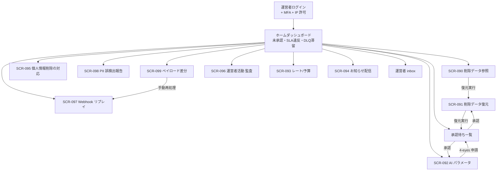
```mermaid
flowchart TD
    Login[運営者ログイン<br/>+ MFA + IP 許可] --> Home[ホームダッシュボード<br/>未承認・SLA違反・DLQ滞留]
    Home --> SCR090[SCR-090 削除データ参照]
    Home --> SCR095[SCR-095 個人情報削除の対応]
    Home --> SCR097[SCR-097 Webhook リプレイ]
    Home --> SCR098[SCR-098 PII 誤検出報告]
    Home --> SCR099[SCR-099 ペイロード差分]
    Home --> SCR096[SCR-096 運営者活動 監査]
    Home --> SCR092[SCR-092 AI パラメータ]
    Home --> SCR093[SCR-093 レート/予算]
    Home --> SCR094[SCR-094 お知らせ配信]
    Home --> ApprovalsList[承認待ち一覧]
    Home --> InboxList[運営者 inbox]
    SCR090 -->|復元実行| SCR091[SCR-091 削除データ復元]
    SCR099 -->|手動再処理| SCR097
    SCR092 -->|4-eyes 申請| ApprovalsList
    SCR091 -->|復元実行| ApprovalsList
    ApprovalsList -->|承認| SCR092
    ApprovalsList -->|承認| SCR091
```

#### 5.4.X 画面遷移 異常系経路（共通レイヤ）

正常系遷移は上記 + §6.2 機能フローで定義済み。本節は **異常系遷移** を整理する（メイン §6.1.X と対称形）。

##### A. 認証切れ / セッション失効 / MFA 失効

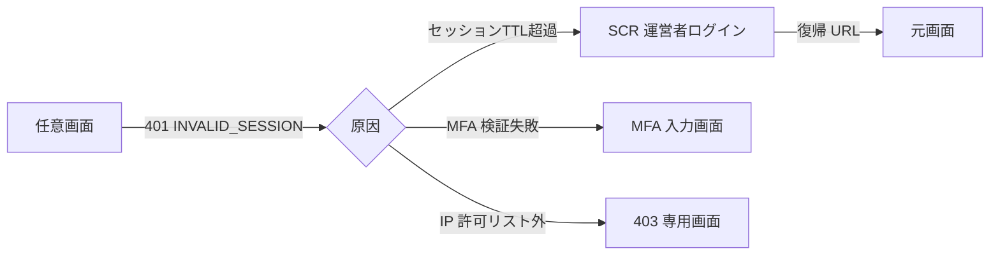
```mermaid
flowchart LR
  ANY[任意画面] -- 401 INVALID_SESSION --> RD{原因}
  RD -- セッションTTL超過 --> LOGIN[SCR 運営者ログイン]
  RD -- MFA 検証失敗 --> MFA[MFA 入力画面]
  RD -- IP 許可リスト外 --> IP403[403 専用画面]
  LOGIN -- 復帰 URL --> ORIG[元画面]
```

- セッション失効時は `returnTo` を sessionStorage に保持し、ログイン後に同一オリジン検証して復帰。
- IP 許可リスト 403 は `aria-live="assertive"` + 「許可された IP からアクセスしてください」固定文言（§13.6.X 参照）。

##### B. 4-eyes 関連の異常系

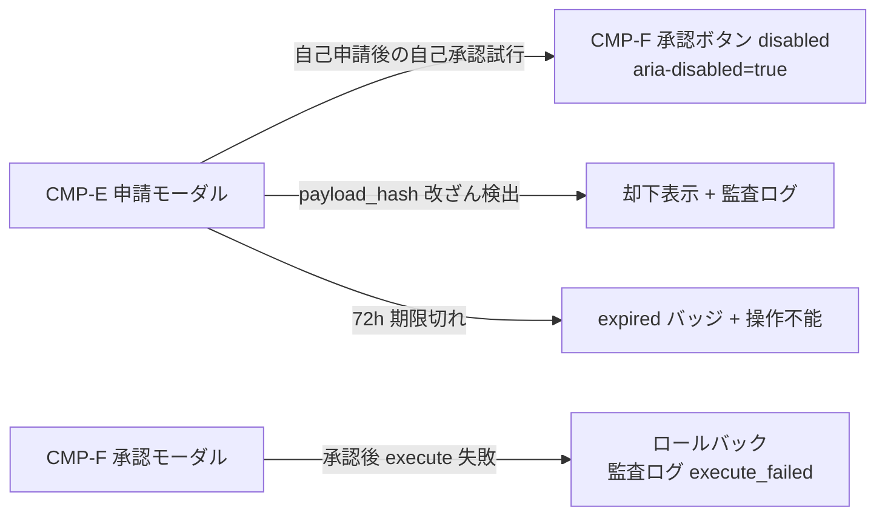
```mermaid
flowchart LR
  REQ[CMP-E 申請モーダル] -- 自己申請後の自己承認試行 --> SELFBLOCK[CMP-F 承認ボタン disabled<br/>aria-disabled=true]
  REQ -- payload_hash 改ざん検出 --> REJECT[却下表示 + 監査ログ]
  REQ -- 72h 期限切れ --> EXPIRED[expired バッジ + 操作不能]
  APV[CMP-F 承認モーダル] -- 承認後 execute 失敗 --> ROLLBACK[ロールバック<br/>監査ログ execute_failed]
```

- 自己承認禁止は **画面遷移なし**（承認ボタンを disable）。
- execute 失敗時は SCR-091 / SCR-092 など **元画面に戻り**、ロールバック結果を Toast で通知。

##### C. 削除請求 / Webhook 異常系

- SCR-095 で deletion_requests の transition が失敗（4-eyes 必須エラー）した場合は **モーダル内**にエラー表示、画面遷移しない。
- SCR-097 で DLQ リプレイ失敗が指数 BO 3 回継続した場合 → SCR-099 (ペイロード差分) へ自動誘導する Toast を表示。
- SCR-099 で `dismiss` 操作は理由必須 (4-eyes 不要)。理由未入力で送信時はモーダル内残留。

##### D. バリデーション失敗 / モーダル dismiss

- Zod バリデーション失敗時は同一画面残留、`aria-invalid="true"` 付与。
- 申請モーダル (CMP-E) / 承認モーダル (CMP-F) の dismiss (× / Esc) は **未送信状態で元画面に戻る**。入力中の理由テキストは localStorage に下書き保持（30 分で破棄）。

##### E. レート制限 / Stripe API 失敗

- 429 受領時は元画面残留 + Retry-After 表示、自動再試行しない。
- Stripe API 5xx は SCR-097 へ自動誘導しつつ、元画面に Toast 表示。

> a11y 要件 (focus trap / `aria-live`) は §13.6 / §13.6.X を参照。メイン側 §13.4 と統一規約。

### 5.5 サイドメニュー設計

| # | 項目 | 表示順 | バッジ条件 |
|---|---|---|---|
| 1 | ホーム | 1 | - |
| 2 | 削除データ参照(SCR-090) | 2 | - |
| 3 | 削除データ復元(SCR-091) | 3 | - |
| 4 | AI 推論パラメータ(SCR-092) | 4 | ハードゲート申請中件数 |
| 5 | レート/予算上書き(SCR-093) | 5 | - |
| 6 | お知らせ配信(SCR-094) | 6 | scheduled 件数 |
| 7 | 削除依頼対応(SCR-095) | 7 | 5 営業日(黄)/ 7 営業日(赤) |
| 8 | Webhook リプレイ(SCR-097) | 8 | DLQ 滞留 1h / 24h(赤) |
| 9 | PII 誤検出報告(SCR-098) | 9 | 3 営業日経過件数 |
| 10 | ペイロード差分(SCR-099) | 10 | detected 件数(赤) |
| 11 | 運営者活動(SCR-096) | 11 | ハッシュチェーン検証 NG(赤) |
| 12 | 承認待ち一覧 | 12 | 承認待ち件数 |
| 13 | 運営者 inbox | 13 | 未読件数 |
| 14 | ログアウト | 14 | - |

### 5.6 運営者ログイン画面(D-01 URL 分離)

| 項目 | 仕様 |
|---|---|
| URL | `https://admin.open-faq.example.com/login` |
| 入口 | 利用者側 `app.open-faq.example.com` からのリンクなし |
| 認証 | メール + パスワード(Argon2id 運営者プロファイル `m=128MB, t=4, p=4`)+ MFA(TOTP) |
| IP 許可 | リクエスト到着前にエッジで適用、未許可 IP は 403(ログイン画面さえ表示しない) |
| ロックアウト | 5 回連続失敗で `(IP × user_id)` 15 分ロック(FR-007) |
| パスワードリセット | 60 分有効、自己リセット禁止 → 別運営者承認経由 |
| MFA セットアップ | 初回 72h トークン(`mfa-setup:<account_id>`)、QR + 回復コード 10 個 |
| セッション TTL | 絶対 8 時間 / 無操作 60 分 (暫定、§3.3 参照、D-18) |
| CSP | §12.11 参照 |

### 5.7 HTML サニタイザ ホワイトリスト(★TH-4)

R-011 / NFR-309 / FR-149 を物理化。**二段階サニタイズ**(永続化前 + 表示時)を必須とする。

#### 5.7.1 許可タグ

| カテゴリ | タグ |
|---|---|
| ブロック | `p`, `br`, `div`, `blockquote`, `pre`, `hr` |
| 見出し | `h2`, `h3`, `h4`(`h1` 禁止: 件名が h1 のため) |
| 強調 | `strong`, `em`, `b`, `i`, `u`, `s`, `code` |
| リスト | `ul`, `ol`, `li` |
| リンク | `a` |
| インライン | `span` |
| 表 | `table`, `thead`, `tbody`, `tr`, `th`, `td` |

#### 5.7.2 禁止タグ(明示禁止)

`script`, `style`, `iframe`, `frame`, `frameset`, `object`, `embed`, `applet`, `form`, `input`, `button`, `textarea`, `select`, `option`, `label`, `link`, `meta`, `base`, `body`, `head`, `html`, `svg`, `math`, `video`, `audio`, `source`, `track`, `canvas`, `picture`, `img`(画像は許可しない)

#### 5.7.3 許可属性

| タグ | 許可属性 | 値の制約 |
|---|---|---|
| `a` | `href`, `title`, `rel` | `href` は `https:` または `mailto:` のみ、`rel` は `noopener noreferrer` を強制付与 |
| `table` | `border` | 0 または 1 のみ |
| `td`, `th` | `colspan`, `rowspan` | 1〜10 |
| 全タグ | `class` | 許可リスト `notice`, `warning`, `info`, `code` |

その他のすべての属性(`onclick`, `onload`, `style`, `srcset`, `data-*`, `id`, `name` 等)は禁止。

#### 5.7.4 URL スキーム ホワイトリスト

| スキーム | 用途 |
|---|---|
| `https:` | 外部リンク |
| `mailto:` | メールアドレス |
| (それ以外すべて禁止) | `http:`, `javascript:`, `data:`, `vbscript:`, `file:`, `ftp:` 等は除去 |

#### 5.7.5 二段階サニタイズ実装方式

| 段階 | タイミング | 実装 |
|---|---|---|
| 1 段目: 永続化前 | `POST /admin/api/v1/announcements` 受信時 | サーバ側で DOMPurify 互換ライブラリを使用(Workers でも動作可能なもの)、ホワイトリスト適用、JSON エスケープ後 `announcement_drafts.body` に保存 |
| 2 段目: 表示時 | SCR-094 プレビュー + メイン側 inbox 表示 + メール HTML 部分 | 表示直前にもう一度サニタイズ(永続化後の DB 改ざんやライブラリ脆弱性に備える多層防御) |

検証用に CI でサニタイズ攻撃ペイロード 50 ケース(`<script>`, ``, `<a href="javascript:">`, SVG イベントハンドラ等)を流し、サニタイズ後に禁止パターンが残っていないか自動チェック。

---

## 6. 機能詳細設計

本章は基本設計 §6 の機能ブロックと 12 の主要処理フローを実装可能粒度に詳細化する。各フローには参加者(Worker / DB / 外部)、ステップごとの API 名・テーブル名・KV キー・action コード・状態遷移を併記する。

### 6.1 機能ブロック図(再掲 + 物理化)

```mermaid
flowchart TB
    subgraph Auth[運営者認証・認可]
        Login[/auth/login]
        MFA[/auth/mfa/verify]
        ReAuth[/auth/reauth]
        Approval[/approvals + /approvals/.../{approve|reject|execute}]
    end

    subgraph Ops[運営機能]
        Deleted[/deleted-resources]
        Restore[/restorations 副作用 a-g]
        AIParam[/ai-parameters/<scope>/<id> 3 階層]
        RateOverride[/overrides/rate-limit + /overrides/budget]
        Announce[/announcements + scheduler]
        SLAMonitor[/deletion-requests + SLA 監視]
        WebhookRecv[POST /webhooks/stripe]
        WebhookReplay[/webhooks/replay]
        PiiReport[/pii-fp-reports + /pii-rules/revisions]
        AuditView[/audit-logs + /audit-logs/exports HMAC]
    end

    subgraph Bg[バックグラウンド Worker]
        BillingCron[MonthlyBillingCronWorker]
        ChainVerify[AuditChainVerifierWorker]
        HolidayFetch[HolidayMasterFetchWorker]
        AnnSched[AnnouncementSchedulerWorker]
        SlaTimer[DeletionSLAWorker]
        DlqBO[DLQAutoBackoffWorker]
        Retention[RetentionPurgeWorker]
        Archive[R2AuditArchiveWorker]
    end

    subgraph Notify[通知]
        OperatorNotify[運営者 inbox + メール]
        TenantNotify[連携 IF #12 → メイン inbox + メール]
    end

    Auth --> Ops
    Ops --> Bg
    Ops --> Notify
```

### 6.2 主要処理フロー(12 フロー)

#### 6.2.1 4-eyes 申請・承認フロー

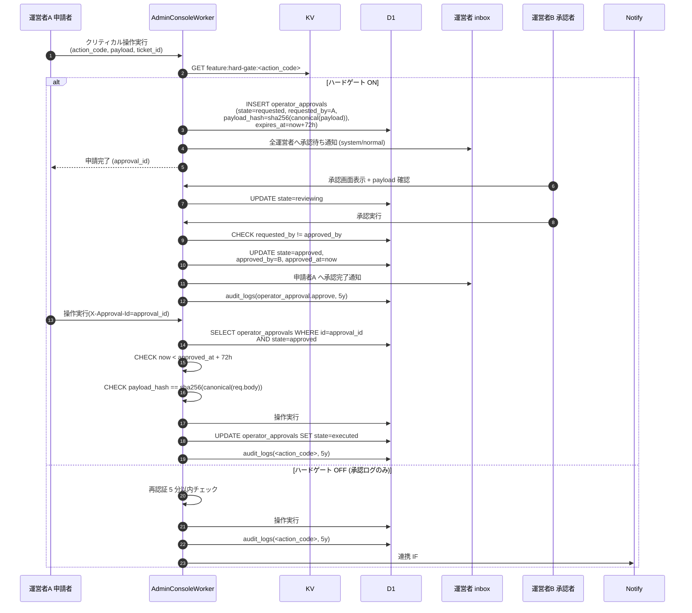
```mermaid
sequenceDiagram
    autonumber
    participant Op1 as 運営者A 申請者
    participant Worker as AdminConsoleWorker
    participant KV
    participant D1
    participant Inbox as 運営者 inbox
    participant Op2 as 運営者B 承認者

    Op1->>Worker: クリティカル操作実行<br/>(action_code, payload, ticket_id)
    Worker->>KV: GET feature:hard-gate:<action_code>
    alt ハードゲート ON
        Worker->>D1: INSERT operator_approvals<br/>(state=requested, requested_by=A,<br/>payload_hash=sha256(canonical(payload)),<br/>expires_at=now+72h)
        Worker->>Inbox: 全運営者へ承認待ち通知 (system/normal)
        Worker-->>Op1: 申請完了 (approval_id)
        Op2->>Worker: 承認画面表示 + payload 確認
        Worker->>D1: UPDATE state=reviewing
        Op2->>Worker: 承認実行
        Worker->>D1: CHECK requested_by != approved_by
        Worker->>D1: UPDATE state=approved,<br/>approved_by=B, approved_at=now
        Worker->>Inbox: 申請者A へ承認完了通知
        Worker->>D1: audit_logs(operator_approval.approve, 5y)
        Op1->>Worker: 操作実行(X-Approval-Id=approval_id)
        Worker->>D1: SELECT operator_approvals WHERE id=approval_id<br/>AND state=approved
        Worker->>Worker: CHECK now < approved_at + 72h
        Worker->>Worker: CHECK payload_hash == sha256(canonical(req.body))
        Worker->>D1: 操作実行
        Worker->>D1: UPDATE operator_approvals SET state=executed
        Worker->>D1: audit_logs(<action_code>, 5y)
    else ハードゲート OFF (承認ログのみ)
        Worker->>Worker: 再認証 5 分以内チェック
        Worker->>D1: 操作実行
        Worker->>D1: audit_logs(<action_code>, 5y)
        Worker->>Notify: 連携 IF #12(FR-211 該当時)
    end
```

**MVP ハードゲート対象**: `owner.physical_delete` / `ai_parameter.update` / `master_key.rotate`(3 操作)
**MVP 承認ログのみ(7 操作区分)**: `owner.suspend` / `owner.restore` / `pricing.update` / `rate_limit.override` または `budget_limit.override` / `widget.force_stop` / `owner.restore_data` / `feature.hard_gate.toggle`

#### 6.2.2 削除データ復元フロー(D-07 副作用ロールバック (a)〜(g))

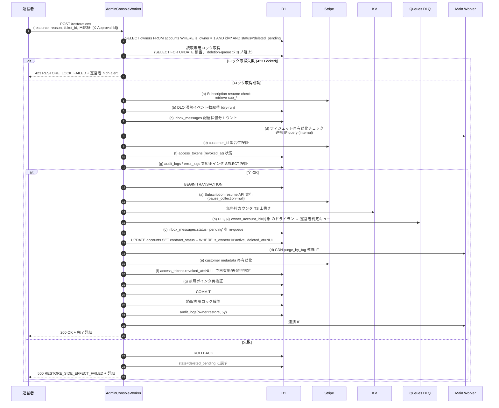
```mermaid
sequenceDiagram
    autonumber
    participant Op as 運営者
    participant Worker as AdminConsoleWorker
    participant D1
    participant Stripe
    participant KV
    participant DLQ as Queues DLQ
    participant Main as Main Worker

    Op->>Worker: POST /restorations<br/>(resource, reason, ticket_id, 再認証, [X-Approval-Id])
    Worker->>D1: SELECT owners FROM accounts WHERE is_owner = 1 AND id=? AND status='deleted_pending'
    Worker->>D1: 読取専用ロック取得<br/>(SELECT FOR UPDATE 相当、 deletion-queue ジョブ阻止)
    alt ロック取得失敗 (423 Locked)
        Worker-->>Op: 423 RESTORE_LOCK_FAILED + 運営者 high alert
    else ロック取得成功
        Worker->>Stripe: (a) Subscription resume check<br/>retrieve sub_*
        Worker->>D1: (b) DLQ 滞留イベント数取得 (dry-run)
        Worker->>D1: (c) inbox_messages 配信保留分カウント
        Worker->>Main: (d) ウィジェット再有効化チェック<br/>連携 IF query (internal)
        Worker->>Stripe: (e) customer_id 整合性検証
        Worker->>D1: (f) access_tokens (revoked_at) 状況
        Worker->>D1: (g) audit_logs / error_logs 参照ポインタ SELECT 検証
        alt 全 OK
            Worker->>D1: BEGIN TRANSACTION
            Worker->>Stripe: (a) Subscription resume API 実行<br/>(pause_collection=null)
            Worker->>KV: 無料枠カウンタ TS 上書き
            Worker->>DLQ: (b) DLQ 内 owner_account_id=対象 のドライラン → 運営者判定キュー
            Worker->>D1: (c) inbox_messages.status='pending' を re-queue
            Worker->>D1: UPDATE accounts SET contract_status -- WHERE is_owner=1='active', deleted_at=NULL
            Worker->>Main: (d) CDN purge_by_tag 連携 IF
            Worker->>Stripe: (e) customer metadata 再有効化
            Worker->>D1: (f) access_tokens.revoked_at=NULL で再有効/再発行判定
            Worker->>D1: (g) 参照ポインタ再検証
            Worker->>D1: COMMIT
            Worker->>D1: 読取専用ロック解除
            Worker->>D1: audit_logs(owner.restore, 5y)
            Worker->>Main: 連携 IF #12 で管理者ユーザー通知(FR-211)
            Worker-->>Op: 200 OK + 完了詳細
        else 失敗
            Worker->>D1: ROLLBACK
            Worker->>D1: state=deleted_pending に戻す
            Worker-->>Op: 500 RESTORE_SIDE_EFFECT_FAILED + 詳細
        end
    end
```

#### 6.2.3 課金 Webhook 受信フロー(FR-302 / D-06 / D-10)

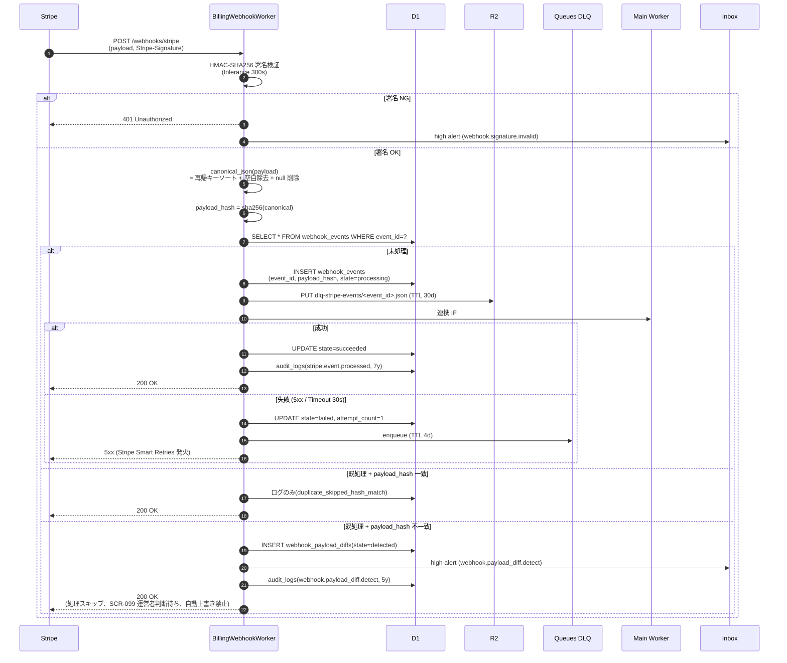
```mermaid
sequenceDiagram
    autonumber
    participant Stripe
    participant Webhook as BillingWebhookWorker
    participant D1
    participant R2
    participant DLQ as Queues DLQ
    participant Main as Main Worker
    participant Inbox

    Stripe->>Webhook: POST /webhooks/stripe<br/>(payload, Stripe-Signature)
    Webhook->>Webhook: HMAC-SHA256 署名検証<br/>(tolerance 300s)
    alt 署名 NG
        Webhook-->>Stripe: 401 Unauthorized
        Webhook->>Inbox: high alert (webhook.signature.invalid)
    else 署名 OK
        Webhook->>Webhook: canonical_json(payload)<br/>= 再帰キーソート + 空白除去 + null 削除
        Webhook->>Webhook: payload_hash = sha256(canonical)
        Webhook->>D1: SELECT * FROM webhook_events WHERE event_id=?
        alt 未処理
            Webhook->>D1: INSERT webhook_events<br/>(event_id, payload_hash, state=processing)
            Webhook->>R2: PUT dlq-stripe-events/<event_id>.json (TTL 30d)
            Webhook->>Main: 連携 IF #10 内部転送 (mTLS+JWT)
            alt 成功
                Webhook->>D1: UPDATE state=succeeded
                Webhook->>D1: audit_logs(stripe.event.processed, 7y)
                Webhook-->>Stripe: 200 OK
            else 失敗 (5xx / Timeout 30s)
                Webhook->>D1: UPDATE state=failed, attempt_count=1
                Webhook->>DLQ: enqueue (TTL 4d)
                Webhook-->>Stripe: 5xx (Stripe Smart Retries 発火)
            end
        else 既処理 + payload_hash 一致
            Webhook->>D1: ログのみ(duplicate_skipped_hash_match)
            Webhook-->>Stripe: 200 OK
        else 既処理 + payload_hash 不一致
            Webhook->>D1: INSERT webhook_payload_diffs(state=detected)
            Webhook->>Inbox: high alert (webhook.payload_diff.detect)
            Webhook->>D1: audit_logs(webhook.payload_diff.detect, 5y)
            Webhook-->>Stripe: 200 OK<br/>(処理スキップ、SCR-099 運営者判断待ち、自動上書き禁止)
        end
    end
```

#### 6.2.4 DLQ 自動 BO + 手動リプレイフロー

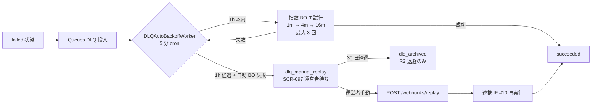
```mermaid
flowchart LR
    Failed[failed 状態] --> DLQ[Queues DLQ 投入]
    DLQ --> AutoBO{DLQAutoBackoffWorker<br/>5 分 cron}
    AutoBO -->|1h 以内| Retry[指数 BO 再試行<br/>1m → 4m → 16m<br/>最大 3 回]
    Retry -->|成功| Success[succeeded]
    Retry -->|失敗| AutoBO
    AutoBO -->|1h 経過 + 自動 BO 失敗| Manual[dlq_manual_replay<br/>SCR-097 運営者待ち]
    Manual -->|運営者手動| Replay[POST /webhooks/replay]
    Replay --> Forward[連携 IF #10 再実行]
    Forward --> Success
    Manual -->|30 日経過| Archived[dlq_archived<br/>R2 退避のみ]
```

#### 6.2.5 削除請求 SLA フロー(FR-227, FR-228)

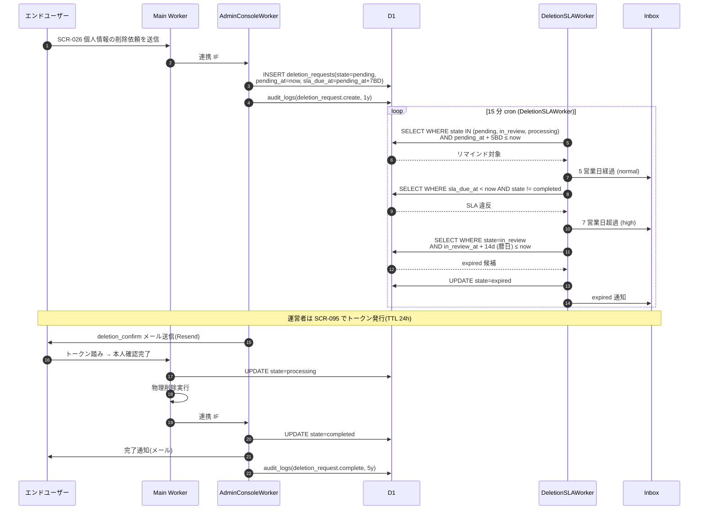
```mermaid
sequenceDiagram
    autonumber
    participant EU as エンドユーザー
    participant Main as Main Worker
    participant Worker as AdminConsoleWorker
    participant D1
    participant SLA as DeletionSLAWorker
    participant Inbox

    EU->>Main: SCR-026 個人情報の削除依頼を送信
    Main->>Worker: 連携 IF #3 受信
    Worker->>D1: INSERT deletion_requests(state=pending,<br/>pending_at=now, sla_due_at=pending_at+7BD)
    Worker->>D1: audit_logs(deletion_request.create, 1y)

    loop 15 分 cron (DeletionSLAWorker)
        SLA->>D1: SELECT WHERE state IN (pending, in_review, processing)<br/>AND pending_at + 5BD ≤ now
        D1-->>SLA: リマインド対象
        SLA->>Inbox: 5 営業日経過 (normal)

        SLA->>D1: SELECT WHERE sla_due_at < now AND state != completed
        D1-->>SLA: SLA 違反
        SLA->>Inbox: 7 営業日超過 (high)

        SLA->>D1: SELECT WHERE state=in_review<br/>AND in_review_at + 14d (暦日) ≤ now
        D1-->>SLA: expired 候補
        SLA->>D1: UPDATE state=expired
        SLA->>Inbox: expired 通知
    end

    Note over EU,Inbox: 運営者は SCR-095 でトークン発行(TTL 24h)
    Worker->>EU: deletion_confirm メール送信(Resend)
    EU->>Main: トークン踏み → 本人確認完了
    Main->>D1: UPDATE state=processing
    Main->>Main: 物理削除実行
    Main->>Worker: 連携 IF #11 削除完了通知
    Worker->>D1: UPDATE state=completed
    Worker->>EU: 完了通知(メール)
    Worker->>D1: audit_logs(deletion_request.complete, 5y)
```

**営業日定義**: 月〜金 - `holiday_master` (kind ∈ {national_holiday, substitute, national_rest, special}) - {12/29, 12/30, 12/31, 1/1, 1/2, 1/3}。詳細は §13.9。

#### 6.2.6 お知らせ配信フロー(FR-149, FR-188, FR-189)

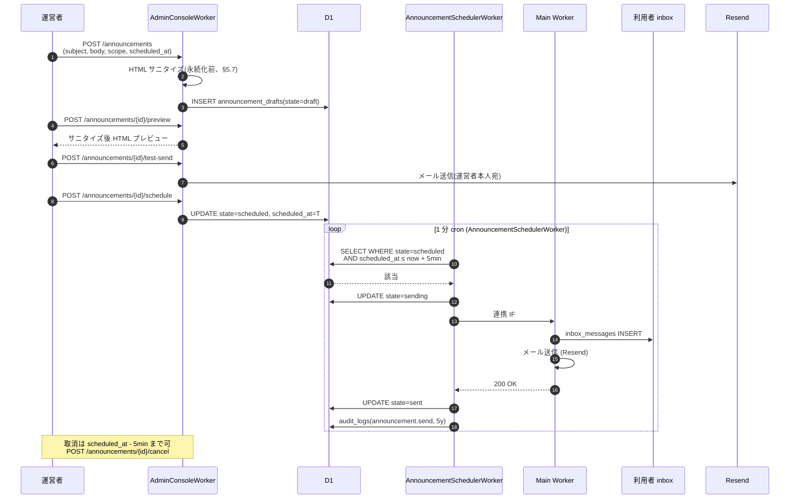
```mermaid
sequenceDiagram
    autonumber
    participant Op as 運営者
    participant Worker as AdminConsoleWorker
    participant D1
    participant Sched as AnnouncementSchedulerWorker
    participant Main as Main Worker
    participant OwnerInbox as 利用者 inbox

    Op->>Worker: POST /announcements<br/>(subject, body, scope, scheduled_at)
    Worker->>Worker: HTML サニタイズ(永続化前、§5.7)
    Worker->>D1: INSERT announcement_drafts(state=draft)
    Op->>Worker: POST /announcements/{id}/preview
    Worker-->>Op: サニタイズ後 HTML プレビュー
    Op->>Worker: POST /announcements/{id}/test-send
    Worker->>Resend: メール送信(運営者本人宛)
    Op->>Worker: POST /announcements/{id}/schedule
    Worker->>D1: UPDATE state=scheduled, scheduled_at=T

    loop 1 分 cron (AnnouncementSchedulerWorker)
        Sched->>D1: SELECT WHERE state=scheduled<br/>AND scheduled_at ≤ now + 5min
        D1-->>Sched: 該当
        Sched->>D1: UPDATE state=sending
        Sched->>Main: 連携 IF #7 (mTLS+JWT)<br/>{subject, body, scope, severity, ...}
        Main->>OwnerInbox: inbox_messages INSERT
        Main->>Main: メール送信 (Resend)
        Main-->>Sched: 200 OK
        Sched->>D1: UPDATE state=sent
        Sched->>D1: audit_logs(announcement.send, 5y)
    end

    Note over Op,Worker: 取消は scheduled_at - 5min まで可<br/>POST /announcements/{id}/cancel
```

#### 6.2.7 月次請求確定 cron(FR-303, D-11, AC-042)

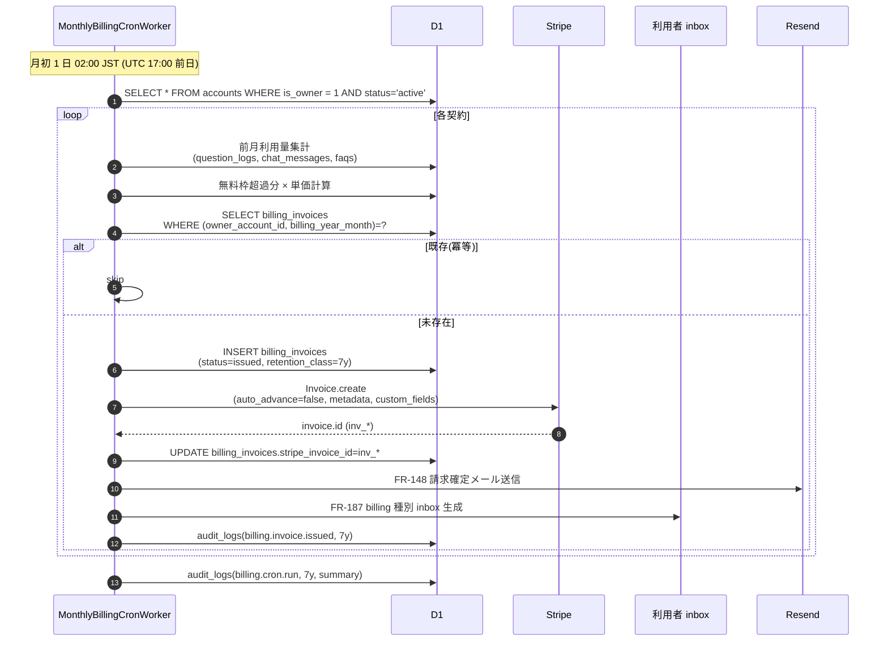
```mermaid
sequenceDiagram
    autonumber
    participant Cron as MonthlyBillingCronWorker
    participant D1
    participant Stripe
    participant OwnerInbox as 利用者 inbox
    participant Mail as Resend

    Note over Cron: 月初 1 日 02:00 JST (UTC 17:00 前日)
    Cron->>D1: SELECT * FROM accounts WHERE is_owner = 1 AND status='active'
    loop 各契約
        Cron->>D1: 前月利用量集計<br/>(question_logs, chat_messages, faqs)
        Cron->>D1: 無料枠超過分 × 単価計算
        Cron->>D1: SELECT billing_invoices<br/>WHERE (owner_account_id, billing_year_month)=?
        alt 既存(冪等)
            Cron->>Cron: skip
        else 未存在
            Cron->>D1: INSERT billing_invoices<br/>(status=issued, retention_class=7y)
            Cron->>Stripe: Invoice.create<br/>(auto_advance=false, metadata, custom_fields)
            Stripe-->>Cron: invoice.id (inv_*)
            Cron->>D1: UPDATE billing_invoices.stripe_invoice_id=inv_*
            Cron->>Mail: FR-148 請求確定メール送信
            Cron->>OwnerInbox: FR-187 billing 種別 inbox 生成
            Cron->>D1: audit_logs(billing.invoice.issued, 7y)
        end
    end
    Cron->>D1: audit_logs(billing.cron.run, 7y, summary)
```

**訂正請求(クレジットメモ)**: 自動発行禁止(FR-303(d))。運営者が `POST /admin/api/v1/billing/credit-notes` から Stripe Credit Note API 経由で手動発行(§7.13.3)。

#### 6.2.8 契約別レート/予算上書き適用(FR-121, FR-128, D-14)

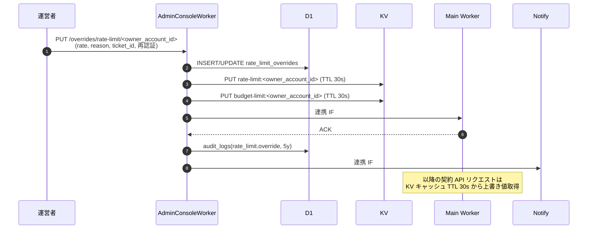
```mermaid
sequenceDiagram
    autonumber
    participant Op as 運営者
    participant Worker as AdminConsoleWorker
    participant D1
    participant KV
    participant Main as Main Worker
    participant Notify

    Op->>Worker: PUT /overrides/rate-limit/<owner_account_id><br/>(rate, reason, ticket_id, 再認証)
    Worker->>D1: INSERT/UPDATE rate_limit_overrides
    Worker->>KV: PUT rate-limit:<owner_account_id> (TTL 30s)
    Worker->>KV: PUT budget-limit:<owner_account_id> (TTL 30s)
    Worker->>Main: 連携 IF #5 同期 (mTLS+JWT)
    Main-->>Worker: ACK
    Worker->>D1: audit_logs(rate_limit.override, 5y)
    Worker->>Notify: 連携 IF #12 管理者ユーザー通知 (FR-211, 10 分集約)

    Note over Main: 以降の契約 API リクエストは<br/>KV キャッシュ TTL 30s から上書き値取得
```

**優先順位**: アカウント設定(オーナー設定) > 運営者上書き > デフォルト推奨値(FR-121(c))。

#### 6.2.9 AI 推論パラメータ 3 階層適用(FR-061, AC-034, D-15)

```mermaid
flowchart TD
    Request[エンドユーザー質問] --> Main[Main Worker]
    Main --> P1{KV: ai-params:project:projectId<br/>あり?}
    P1 -->|Yes| UseProj[プロジェクト値使用]
    P1 -->|No| T1{KV: ai-params:owner:ownerAccountId<br/>あり?}
    T1 -->|Yes| UseTenant[オーナー値使用]
    T1 -->|No| G1{KV: ai-params:global<br/>あり?}
    G1 -->|Yes| UseGlobal[グローバル値使用]
    G1 -->|No| Default[既定値<br/>信頼度 0.60 / 関連度 0.50]
    UseProj --> AI[AI 推論]
    UseTenant --> AI
    UseGlobal --> AI
    Default --> AI
```

**保存即時有効**: SCR-092 から `PUT /admin/api/v1/ai-parameters/{scope}/{id}` 受信 → D1 `ai_parameter_overrides` INSERT + KV PUT。メイン側 Worker は次リクエストから新値を参照(再起動・再デプロイ不要、FR-055)。

##### 段階ロールアウト中の矛盾解決ロジック

3 階層 (project > owner > global) の優先順位に **段階ロールアウト (`rollout_percentage` 0/10/50/100)** が組み合わさった場合の評価ロジック。例: owner に `rollout_percentage=50` で新パラメータ A、project に `rollout_percentage=0` で新パラメータ B が設定されている場合。

**評価ステップ**:

1. **リクエストハッシュを計算**: `hash = SHA-256(account_id || session_id || question_id) % 100`
2. **project レベル評価**:
   - `ai_parameter_overrides.scope='project'` の行を取得
   - `rollout_percentage` の値で判定: `hash < rollout_percentage` なら project 値を採用
   - **`rollout_percentage=0` の場合は project 値を完全 fallback** (どんな hash でも採用しない)
   - 採用すれば確定、しなければ次へ
3. **owner レベル評価** (project 不採用時):
   - `ai_parameter_overrides.scope='owner'` の行を取得
   - 同様に `hash < rollout_percentage` で判定
   - `rollout_percentage=0` なら完全 fallback、次へ
4. **global レベル評価** (project / owner 不採用時):
   - 同様に判定
5. **default 値**: すべて不採用なら既定値 (信頼度 0.60 / 関連度 0.50)

##### 例

| project rollout | owner rollout | hash | 採用される値 |
|---|---|---|---|
| 50 | 100 | 30 (< 50) | project |
| 50 | 100 | 70 (≥ 50) | owner |
| 0 | 100 | 任意 | owner (project は完全 fallback) |
| 0 | 0 | 任意 | global (project, owner とも完全 fallback) |
| 100 | 100 | 任意 | project |

##### 監査ログ

```ts
// 採用判定結果を audit_logs に記録 (operator_high_priv / 5y)
await writeAudit(env, {
  action: 'ai_parameter.applied',
  scope: 'project',  // 採用された scope
  scope_id: projectId,
  rollout_percentage: 50,
  request_hash: hash,
  retention_class: '5y',
});
```

##### 段階ロールアウト変更時の即時反映

- `rollout_percentage` を 100 → 50 に変更 → KV TTL 60s で次回リクエストから反映、ハッシュ計算で 50% のリクエストが旧 fallback (= owner or global) へ移行
- ロールアウト変更による分散逸脱検知: 旧値と新値で **平均回答時間 / 信頼度の差分** を統計取得し、`>10%` 劣化で運営者 inbox に warn

> **メイン §10.2 と整合**: 同ロジックを `worker-main-api` で実装、`worker-admin-api` (顧管) は SCR-092 経由で `rollout_percentage` を更新するのみ。

#### 6.2.10 PII 誤検出報告 → ルール更新(FR-064, NFR-805, D-13)

```mermaid
sequenceDiagram
    autonumber
    participant Reporter as 管理者ユーザー/運営者
    participant Main as Main Worker
    participant Worker as AdminConsoleWorker
    participant D1
    participant KV
    participant Op as 運営者

    Reporter->>Main: 「誤検出として報告」
    Main->>Worker: 報告転送 (連携 IF)
    Worker->>D1: INSERT pii_false_positive_reports(state=reported)
    Op->>Worker: SCR-098 確認 → POST .../transition (to=under_review)
    Worker->>D1: UPDATE state=under_review,<br/>review_started_at=now, review_due_at=now+3BD
    Op->>Worker: 判定 (POST .../transition to=ruled_false_positive)
    Worker->>D1: UPDATE state=ruled_false_positive

    Op->>Worker: POST /pii-rules/revisions<br/>(再認証 + チケット ID)
    Worker->>D1: INSERT pii_rules_revisions
    Worker->>KV: PUT pii-rules:regex (TTL 60s)
    Worker->>KV: PUT pii-rules:classifier
    Worker->>D1: UPDATE state=rule_updated
    Worker->>D1: audit_logs(pii_rule.update, 5y)

    Note over Main: 以降の推論は新ルール参照<br/>KV キャッシュ TTL 60s
    Note over Worker: 過去データは修正しない (FR-064(d), D-13)
```

#### 6.2.11 監査ログ閲覧・エクスポート(FR-232, D-17)

```mermaid
sequenceDiagram
    autonumber
    participant Op as 運営者
    participant Worker as AdminConsoleWorker
    participant D1
    participant Secrets
    participant R2

    Op->>Worker: GET /audit-logs?action=...&actor=...&from=...&to=...<br/>(最大期間 1 年)
    Worker->>D1: SELECT (カーソル 100/ページ)
    D1-->>Worker: 結果
    Worker-->>Op: 一覧表示

    Op->>Worker: POST /audit-logs/exports<br/>(format=csv|jsonl, filter=...)
    Worker->>D1: COUNT (検索条件)
    alt 100 万件超過
        Worker-->>Op: 422 EXPORT_TOO_LARGE (絞り込み再要求)
    else 100 万件以内
        Worker->>D1: 全件 SELECT (ストリーミング)
        Worker->>Secrets: GET グローバル派生鍵 HKDF info='audit-export'
        Worker->>Worker: 10 万行/ファイルで分割
        Worker->>Worker: 各ファイル末尾に HMAC-SHA256 signature 行 (D-17)
        Worker->>R2: PUT audit-export/<job_id>-<seq>.csv
        Worker->>R2: PUT audit-export/<job_id>-<seq>.sig
        Worker->>D1: audit_logs(audit.export, 5y)
        Worker-->>Op: 200 OK { downloadUrls: [...] }
    end
```

#### 6.2.12 運営者操作 → 管理者ユーザー通知(FR-211, D-19)

```mermaid
sequenceDiagram
    autonumber
    participant Worker as AdminConsoleWorker
    participant Queue as Queues notification-batch
    participant Aggregator as 集約 Worker (1 分 cron)
    participant Main as Main Worker
    participant TM as 管理者ユーザー inbox + mail

    Note over Worker: 運営者操作完了
    Worker->>Queue: enqueue {owner_account_id, operation_kind, ticket_id, actor, ts}
    Note over Aggregator: 10 分集約窓
    Aggregator->>Queue: (owner_account_id, operation_kind) で集約
    Aggregator->>Main: 連携 IF #12 (mTLS+JWT)
    Main->>TM: inbox_messages INSERT (system/high)
    Main->>Main: Resend 経由メール送信
    alt メール送信永久失敗 (NFR-502 5 回失敗後)
        Main->>Aggregator: 受信箱通知は残し<br/>運営者 inbox へ手動連絡誘導
    end
```

**通知契機 5 種類**(FR-211 (a)〜(e)):
- (a) 論理削除データの復元
- (b) 契約無効化(`suspended` 遷移)・復旧
- (c) 契約別レート制限・利用しきい値の上書き設定変更
- (d) 契約単位の AI 推論パラメータ上書き変更
- (e) 緊急対応によるウィジェット強制停止

### 6.3 機能と API の対応表

| 機能ブロック | 主要 API | 認証 | Idempotency | 4-eyes |
|---|---|---|---|---|
| 運営者認証 | `POST /admin/api/v1/auth/login`, `/auth/mfa/verify`, `/auth/reauth` | Cookie + CSRF | - | - |
| 4-eyes 申請承認 | `POST /admin/api/v1/approvals`, `/approvals/:id/{approve|reject|execute}` | Cookie + Re-Auth | `approval_id` | - |
| 削除データ参照 | `GET /admin/api/v1/deleted-resources` | Cookie | - | - |
| 削除データ復元 | `POST /admin/api/v1/restorations` | Cookie + Re-Auth + (Beta) Approval | `restoration_id` | MVP Log Only / Beta Hard Gate |
| AI パラメータ | `PUT /admin/api/v1/ai-parameters/{scope}/{id}` | Cookie + Re-Auth + Approval | `version` | **MVP Hard Gate** |
| レート/予算上書き | `PUT /admin/api/v1/overrides/rate-limit/{owner_account_id}`, `/overrides/budget/{owner_account_id}` | Cookie + Re-Auth | `override_id` | MVP Log Only |
| お知らせ配信 | `POST /admin/api/v1/announcements`, `/announcements/:id/{preview|schedule|cancel|send|test-send}` | Cookie + Re-Auth | `announcement_id` | - |
| 削除依頼対応 | `POST /admin/api/v1/deletion-requests/:id/{transition|issue-token}` | Cookie + Re-Auth | `transition_id` | - |
| 監査ログ | `GET /admin/api/v1/audit-logs`, `POST /admin/api/v1/audit-logs/exports` | Cookie | `export_id` | - |
| Webhook リプレイ | `POST /admin/api/v1/webhooks/replay` | Cookie + Re-Auth | `replay_id` | - |
| PII 報告 | `POST /admin/api/v1/pii-fp-reports/:id/transition`, `/pii-rules/revisions` | Cookie + Re-Auth | `rule_revision` | - |
| 内部連携 IF(運営者→メイン) | `https://app.open-faq.example.com/internal/admin-integration/v1/*` | mTLS + JWT | 連携 IF 別 | - |
| Stripe Webhook 受信 | `POST /webhooks/stripe` | Stripe-Signature | Stripe `event_id` | - |
| Resend Webhook 受信 | `POST /webhooks/resend` | Resend Signature | Resend `event_id` | - |

### 6.4 4-eyes 承認基盤の方式

D-12 の確定形:

| 要素 | 仕様 |
|---|---|
| データモデル | `operator_approvals(id, action_code, requested_by, approved_by, rejected_by, withdrawn_by, payload_hash, payload_json, payload_preview, reason, comment, state, requested_at, reviewing_at, approved_at, rejected_at, withdrawn_at, executed_at, expired_at, expires_at)`(状態 7 種: requested / reviewing / approved / rejected / withdrawn / executed / expired) |
| 申請 TTL | 72 時間(`expires_at = requested_at + 72h`)、超過は `expired` |
| 承認後 TTL | 承認後 72h 以内未実行で `expired`、再申請が必要 |
| 自己承認禁止 | DB CHECK 制約 `requested_by IS NULL OR approved_by IS NULL OR requested_by != approved_by` |
| 自己却下禁止 | DB CHECK 制約 `requested_by IS NULL OR rejected_by IS NULL OR requested_by != rejected_by` |
| 自己取下げのみ可 | DB CHECK 制約 `withdrawn_by IS NULL OR withdrawn_by = requested_by` |
| payload 改ざん防止 | 申請時に `payload_hash = sha256(canonical(payload))` 確定、実行時に再計算で照合 |
| ハードゲート対象の管理 | **2 段構え**: (1) ハードゲート対象 action コードは **実装定数(コード内 `HARD_GATE_ACTIONS` const、§7.4.2 参照)** で管理し、誤操作で MVP 重大操作(`owner.physical_delete` 等)が単独実行可能になるリスクを排除。MVP 定数: `['owner.physical_delete', 'ai_parameter.update', 'master_key.rotate']`。(2) KV `feature:hard-gate:<action_code>` は **緊急一時無効化**(メイン要件 §6.2.1 区分3 セキュリティインシデント + §6.2.2 発動条件成立時のみ。`true → false` 切替で一時バイパス)、変更操作自体が 4-eyes 承認ログ対象 `feature.hard_gate.toggle`(`retention_class='5y'`)。実行時判定は `isHardGate(action) = HARD_GATE_ACTIONS.includes(action) && (KV:feature:hard-gate:${action} !== 'false')`(KV 未設定時は const のまま true 扱い) |
| 申請者の承認禁止 | サーバ + クライアント両方でガード |
| 緊急例外 | 発動条件: メイン要件 §6.2.1 緊急区分(重大障害 / 全員ロックアウト / セキュリティインシデント / 法令対応即応)のいずれかが発動し、かつ §6.2.2 発動条件 4 項目の (2) 2 名承認が成立不能な場合のみ。**MVP**: マスター鍵保管庫からの紙ベース回復コード使用 + 2 名立会・記録、`master_key.emergency_bypass` action コード(5y)で記録、5 営業日以内ポストモーテム公開(詳細は RB-014) |

### 6.5 祝日マスタ取得バッチ方式(D-05, RB-019)

| 項目 | 仕様 |
|---|---|
| 起動 | Cron Triggers、**年次 11 月 1 日 03:00 JST**(UTC `0 18 31 10 *` = UTC 10/31 18:00 → JST 11/1 03:00 / §14.1 cron 一覧で根拠) |
| 取得元 | `https://www8.cao.go.jp/chosei/shukujitsu/syukujitsu.csv` |
| 文字コード | Shift_JIS → UTF-8 変換 |
| パース対象 | 翌年 1 月 1 日〜12 月 31 日 |
| 含めるもの | 国民の祝日 / 振替休日(`substitute`)/ 国民の休日(`national_rest`)/ 特別祝日(`special`) |
| upsert | `holiday_master(date, name, kind, imported_at)` PK = `date` |
| 取込後アクション | (1) SLA 計測ロジック単体テスト再実行(`npm run test:sla`)、(2) 結果を運営者 inbox 通知、(3) `audit_logs(holiday.import, 5y)` |
| 異常系 | CSV 取得失敗時は次日リトライ最大 7 日、永久失敗時は運営者 inbox high |
| ロールバック | 取込失敗時は前年マスタを維持(差分適用) |

### 6.6 Webhook ペイロード差分検出方式(FR-302 異常系, D-06)

| 項目 | 仕様 |
|---|---|
| 正規化方式 | `canonical_json(payload, WEBHOOK_EXCLUDE_FIELDS)` = JCS RFC 8785 準拠(コードポイントキーソート + NFC + ES6 ToString + 空白除去)+ 除外フィールド適用(§8.6.1 共通実装) |
| ハッシュ | `payload_hash = sha256(canonical_json(payload, WEBHOOK_EXCLUDE_FIELDS))` |
| 除外フィールド | 付録 H 完全リスト(`created`, `request_id`, `idempotency_key_resent`, `livemode`, `api_version`, `pending_webhooks`, `data.object.test_clock`, `data.object.metadata.test_*` 等を除外後に正規化) |
| 検出後アクション | (1) `webhook_payload_diffs` INSERT(state=detected)、(2) 運営者 inbox high、(3) SCR-099 で運営者判断待ち、(4) **自動上書き禁止** |
| 再処理経路 | SCR-099 → SCR-097 へ遷移、運営者の手動判断でリプレイ |
| 監査記録 | `webhook.payload_diff.detect` / `.review` / `.reprocess` / `.dismiss`(retention_class=5y) |

---

## 7. API 詳細設計(★TH-1, TH-9)

本章は基本設計 §8 + §6.3 + §16 引継ぎ事項 TH-1(API スキーマ・JSON Schema・エラーコード)と TH-9(Stripe API 具体パラメータ)を確定する。

### 7.1 共通仕様

| 項目 | 値 |
|---|---|
| Base URL | `https://admin.open-faq.example.com/admin/api/v1` |
| 認証 | Cookie セッション(`admin_session`)+ MFA 完了フラグ |
| Cookie 属性 | `Secure; HttpOnly; SameSite=Strict; Domain=admin.open-faq.example.com; Path=/` |
| CSRF | 状態変更系で `X-CSRF-Token` ヘッダ必須(ログイン時に発行、セッションごと固定) |
| Content-Type | リクエスト: `application/json` / レスポンス: `application/json` / エラー: `application/problem+json` |
| 日時 | ISO 8601 UTC(例 `2026-05-12T10:00:00Z`) |
| ID 形式 | ULID(26 文字)。例外: Stripe ID(`evt_*`, `sub_*`, `inv_*`, `cn_*`) |
| ページング | カーソル方式(`cursor`, `limit`(既定 50、最大 200)、`next_cursor`) |
| Idempotency | 状態変更系で `Idempotency-Key` ヘッダ受付(ULID 推奨、サーバ側で `(method, path, key) → (request_hash, response)` を 24h 保管。同 key で異なる request_hash は `409 IDEMPOTENCY_REPLAY_HASH_MISMATCH`) |
| 操作チケット ID | `X-Op-Ticket-Id` ヘッダ、§3.5 で確定 |
| 4-eyes 承認 ID | `X-Approval-Id` ヘッダ(ULID)、ハードゲート操作時必須 |
| API バージョン | URL パス `/v1/` で固定。Breaking Change は `/v2/` 併存運用、180 日廃止予告(基本設計 §8.3) |
| レート制限 | 運営者 1 名あたり 600 req/min(超過時 `429 TOO_MANY_REQUESTS`)、Webhook は別経路 |
| トレース ID | レスポンスヘッダ `X-Trace-Id: <ULID>` でクライアントに返却 |

#### 7.1.1 レスポンスヘッダ(共通)

| ヘッダ | 値 |
|---|---|
| `X-Trace-Id` | ULID(構造化ログと突合可能) |
| `X-Request-Id` | ULID |
| `X-Api-Version` | `2026-05-12` |
| `X-Idempotency-Replayed` | `true` / `false`(Idempotency-Key が再利用された場合 `true`) |
| `Content-Security-Policy` | §12.11 参照 |
| `Strict-Transport-Security` | `max-age=31536000; includeSubDomains; preload` |
| `X-Content-Type-Options` | `nosniff` |
| `X-Frame-Options` | `DENY` |
| `Referrer-Policy` | `strict-origin-when-cross-origin` |
| `Permissions-Policy` | `camera=(), microphone=(), geolocation=()` |

#### 7.1.2 エラーレスポンス形式(RFC 7807)

```json
{
  "type": "https://docs.open-faq.example.com/errors/FORBIDDEN_HARD_GATE",
  "title": "Hard gate requires approval",
  "status": 403,
  "code": "FORBIDDEN_HARD_GATE",
  "detail": "action=ai_parameter.update requires X-Approval-Id header",
  "trace_id": "01J9V0...",
  "instance": "/admin/api/v1/ai-parameters/owner/01J9..."
}
```

### 7.2 エラーコード一覧

| code | HTTP | detail 例 | 主な発生 SCR/FR |
|---|---|---|---|
| `VALIDATION_ERROR` | 400 | `field=confidence_threshold reason=range 0..1` | 全 SCR |
| `TICKET_ID_REQUIRED` | 400 | `header X-Op-Ticket-Id is required` | クリティカル操作 |
| `IDEMPOTENCY_REPLAY_HASH_MISMATCH` | 409 | `Idempotency-Key was reused with different request body` | 状態変更系 |
| `UNAUTHENTICATED` | 401 | `session expired or missing` | 全 |
| `INVALID_CREDENTIALS` | 401 | `email or password is invalid` | `/auth/login` |
| `MFA_INVALID_CODE` | 401 | `TOTP code did not match` | `/auth/mfa/verify` |
| `FORBIDDEN_MFA_REQUIRED` | 403 | `MFA must be completed for this session` | 全 |
| `FORBIDDEN_IP` | 403 | `your IP is not in operator allowlist` | 全(エッジ早期返却) |
| `FORBIDDEN_CSRF` | 403 | `X-CSRF-Token does not match session` | 状態変更系 |
| `FORBIDDEN_HARD_GATE` | 403 | `action requires X-Approval-Id` | SCR-092 等 |
| `FORBIDDEN_SELF_APPROVE` | 403 | `requested_by must differ from approved_by` | 4-eyes |
| `FORBIDDEN_ROLE` | 403 | `service_operator role required` | 全 |
| `RE_AUTH_REQUIRED` | 403 | `re-authentication required within 5 minutes` | SCR-091〜094 等 |
| `RE_AUTH_USED` | 403 | `re-auth token already consumed` | 同上 |
| `LOCKED` | 423 | `account locked due to 5 failed login attempts` | `/auth/login` |
| `RESTORE_LOCK_FAILED` | 423 | `deletion-queue is processing physical delete` | SCR-091 |
| `APPROVAL_EXPIRED` | 410 | `approval expired at <timestamp>` | 4-eyes 実行時 |
| `APPROVAL_PAYLOAD_MISMATCH` | 409 | `payload_hash mismatch` | 4-eyes 実行時 |
| `APPROVAL_PENDING` | 409 | `another approval is pending for same action` | 4-eyes 申請 |
| `WEBHOOK_SIGNATURE_INVALID` | 401 | `Stripe-Signature verification failed` | `/webhooks/stripe` |
| `WEBHOOK_DIFF_DETECTED` | 409 | `event_id reused with different payload_hash` | (内部記録のみ、外部応答は 200) |
| `WEBHOOK_REPLAY_WINDOW_EXPIRED` | 410 | `event_id is older than 30 days` | SCR-097 |
| `WEBHOOK_REPLAY_AUTO_BO_IN_PROGRESS` | 409 | `automatic backoff in progress` | SCR-097 |
| `SLA_TIMER_INVALID` | 422 | `state transition not allowed in current state` | SCR-095 |
| `RESTORE_SIDE_EFFECT_FAILED` | 500 | `side-effect (a)-(g) rollback failed at step <id>` | SCR-091 |
| `DELETION_QUEUE_CONFLICT` | 409 | `deletion queue job in progress for owner` | SCR-091 |
| `ANNOUNCEMENT_CANCEL_WINDOW_EXPIRED` | 422 | `cannot cancel within 5 minutes of scheduled_at` | SCR-094 |
| `XSS_PATTERN_DETECTED` | 422 | `forbidden HTML tag/attribute detected: <tag>` | SCR-094 |
| `PII_RULE_REVISION_CONFLICT` | 409 | `another revision is in progress` | SCR-098 |
| `EXPORT_TOO_LARGE` | 422 | `match count <X> exceeds 1,000,000` | SCR-096 |
| `RATE_LIMIT_EXCEEDED` | 429 | `600 req/min per operator exceeded` | 全 |
| `NOT_FOUND` | 404 | `resource not found` | 全 |
| `METHOD_NOT_ALLOWED` | 405 | - | 全 |
| `CONFLICT` | 409 | `version mismatch` | PATCH 系 |
| `INTERNAL_ERROR` | 500 | `internal server error, trace_id=<id>` | 全 |
| `SERVICE_UNAVAILABLE` | 503 | `downstream Stripe/Resend timeout` | Webhook / Cron |
| `UPSTREAM_TIMEOUT` | 504 | `connection to Main worker timed out` | 連携 IF |

### 7.3 認証 API(`/auth/*`)

#### 7.3.1 `POST /admin/api/v1/auth/login`

| 項目 | 内容 |
|---|---|
| 認証 | 不要(ただし IP 許可リスト適用) |
| Body | `{ "email": "string", "password": "string" }` |
| 成功 | `200 { "sessionId": "01J...", "csrfToken": "...", "mfaRequired": true, "mfaSetupRequired": false }` + Cookie `admin_session` Set |
| エラー | 401 `INVALID_CREDENTIALS` / 423 `LOCKED` / 400 `VALIDATION_ERROR` |
| 監査 | `operator.login.attempt`(1y、成功失敗問わず) |

#### 7.3.2 `POST /admin/api/v1/auth/mfa/verify`

| 項目 | 内容 |
|---|---|
| 認証 | セッション必須(MFA 未検証) |
| Body | `{ "code": "123456" }` または `{ "recoveryCode": "ABCDEF-..." }` |
| 成功 | `200 { "mfaVerifiedAt": "...", "expiresAt": "..." }` |
| エラー | 401 `MFA_INVALID_CODE` / 423 `LOCKED`(5 連続失敗) |
| 監査 | `operator.mfa.verify`(5y) |

#### 7.3.3 `POST /admin/api/v1/auth/mfa/setup`

| 項目 | 内容 |
|---|---|
| 認証 | 招待トークン(`mfa-setup:<account_id>` KV、72h) |
| Body | `{ "setupToken": "..." }` |
| 成功 | `200 { "qrCodeDataUrl": "data:image/png;base64,...", "secret": "BASE32...", "recoveryCodes": ["...", ...] }`(回復コードは 1 回限り表示) |
| エラー | 401 / 404 |
| 監査 | `operator.mfa.setup`(5y) |

#### 7.3.4 `POST /admin/api/v1/auth/reauth`

| 項目 | 内容 |
|---|---|
| 認証 | セッション + MFA 完了 |
| Body | `{ "password": "string" }` |
| 成功 | `200 { "reauthenticatedAt": "...", "expiresAt": "<now+15min>", "reauthId": "01J..." }` |
| エラー | 401 `INVALID_CREDENTIALS` |
| 監査 | `operator.reauth`(5y) |

#### 7.3.5 パスワード再設定(運営者)

| API | リクエスト | レスポンス | 認可 |
|---|---|---|---|
| `POST /auth/password/reset-requests` | `{ "email": "string" }` | `202 { "ok": true }` (列挙攻撃対策) | 認証不要 |
| `POST /auth/password/reset` | `{ "token": "...", "newPassword": "string", "approvalId": "01J..." }` | `200 { "ok": true }` | 別運営者承認必須(`X-Approval-Id`) |

#### 7.3.6 `POST /admin/api/v1/auth/logout`

| 項目 | 内容 |
|---|---|
| 成功 | `204` + Cookie 失効 + `operator_sessions.revoked_at=now` |

#### 7.3.7 `POST /admin/api/v1/auth/sessions/{session_id}/revoke`(別運営者のセッション失効)

| 項目 | 内容 |
|---|---|
| 認証 | service_operator + 再認証 |
| 監査 | `operator.session.revoke`(5y) |

### 7.4 4-eyes 申請承認 API(`/approvals`)

#### 7.4.1 `POST /admin/api/v1/approvals`

| 項目 | 内容 |
|---|---|
| 認証 | service_operator + 再認証 + `X-Op-Ticket-Id` |
| Body | `{ "actionCode": "ai_parameter.update", "payload": {...}, "reason": "string" }` |
| 処理 | `payload_hash = sha256(canonical(payload))` を確定し INSERT |
| 成功 | `201 { "approvalId": "01J...", "expiresAt": "<now+72h>", "payloadHash": "<hex>" }` |
| エラー | 409 `APPROVAL_PENDING` |
| 監査 | `operator_approval.request`(5y) |

#### 7.4.2 `POST /admin/api/v1/approvals/{id}/start-review`

| 項目 | 内容 |
|---|---|
| 認証 | service_operator(申請者以外) |
| 成功 | `200 { "state": "reviewing" }` |
| 監査 | `operator_approval.start_review`(5y) |

#### 7.4.3 `POST /admin/api/v1/approvals/{id}/approve`

| 項目 | 内容 |
|---|---|
| 認証 | service_operator(申請者以外) |
| Body | `{ "comment": "string?" }` |
| 成功 | `200 { "state": "approved", "approvedAt": "..." }` |
| エラー | 403 `FORBIDDEN_SELF_APPROVE` / 410 `APPROVAL_EXPIRED` / 409 `APPROVAL_PAYLOAD_MISMATCH` |
| 監査 | `operator_approval.approve`(5y) |

#### 7.4.4 `POST /admin/api/v1/approvals/{id}/reject`

| 項目 | 内容 |
|---|---|
| 認証 | service_operator(申請者以外) |
| Body | `{ "comment": "string"(必須) }` |
| 成功 | `200 { "state": "rejected", "rejectedAt": "..." }` |
| エラー | 403 `FORBIDDEN_SELF_APPROVE`(申請者本人による却下) |
| 監査 | `operator_approval.reject`(5y) |

#### 7.4.5 `POST /admin/api/v1/approvals/{id}/withdraw`

| 項目 | 内容 |
|---|---|
| 認証 | service_operator(申請者本人) |
| Body | `{ "comment": "string"(任意) }` |
| 成功 | `200 { "state": "withdrawn", "withdrawnAt": "..." }` |
| エラー | 403 `FORBIDDEN`(申請者以外の撤回試行)/ 409 `CONFLICT`(state が `requested` 以外) |
| 監査 | `operator_approval.withdraw`(5y) |

注: 申請者本人による自己取下げ専用エンドポイント。`/reject` とは状態(`rejected` ↔ `withdrawn`)と監査 action コードで区別する。`reviewing` 状態以降は撤回不可(既に別運営者が確認開始済のため)。

#### 7.4.6 `POST /admin/api/v1/approvals/{id}/execute`

| 項目 | 内容 |
|---|---|
| 認証 | service_operator(申請者本人)+ 再認証 |
| Body | 申請時の payload と完全一致(`payload_hash` 再検証) |
| 成功 | `200 { "state": "executed", "result": {...} }`(実際の操作実行結果) |
| エラー | 410 `APPROVAL_EXPIRED` / 409 `APPROVAL_PAYLOAD_MISMATCH` |
| 監査 | `operator_approval.execute`(5y) + 実 action コード(5y) |

**実装方針(確定)**: 本エンドポイント `POST /approvals/{id}/execute` は **採用しない**。代替として、各クリティカル操作の API(例: `POST /owners/{id}/physical-delete`、`POST /ai-parameters/global` など)が `X-Approval-Id` ヘッダ付きで呼ばれた際に **当該 API 内部で同じ payload_hash 検証を実施** する。理由:
- API 契約を単純化(クライアントは「申請承認後、本来の操作 API を呼ぶ」のみ)
- 各操作 API が責務を持ち、`execute` のような汎用ディスパッチャを Worker 側で持たない
- 承認 → 実行の 2 ステップ間で payload 改ざんが起きないことを各操作 API が自前で保証

**呼出例**:
```http
POST /admin/api/v1/owners/01J9V0.../physical-delete
X-Approval-Id: 01J9X7...
Content-Type: application/json

{"ownerAccountId":"01J9V0...","slug":"acme-corp","reason":"...","ticketId":"OPS-1234"}
```

サーバ側は (1) `operator_approvals.id = X-Approval-Id AND state='approved' AND approved_at + 72h > now` を検証、(2) リクエスト body の `canonical_json` ハッシュが `payload_hash` と一致することを検証、(3) 検証通過時に物理削除実行 + `operator_approval.execute`(5y) + 実 action コード(5y)の 2 件を監査記録。本 §7.4.6 のエンドポイント定義は廃止予定(本書 v2.0.2 で履歴目的のみ残置)。

#### 7.4.7 `GET /admin/api/v1/approvals`

| 項目 | 内容 |
|---|---|
| クエリ | `state`(複数指定可、enum: requested/reviewing/approved/rejected/withdrawn/executed/expired)、`actionCode`、`requestedBy`、`cursor`、`limit` |
| 成功 | `200 { "items": [{ approvalId, actionCode, state, requestedBy, requestedAt, expiresAt, payloadHash }, ...], "nextCursor": "..." }` |

### 7.5 削除データ参照・復元 API

#### 7.5.1 `GET /admin/api/v1/deleted-resources`

| 項目 | 内容 |
|---|---|
| 認証 | service_operator |
| クエリ | `ownerSearch`, `resourceTypes[]`, `deletionTypes[]`, `from`, `to`, `cursor`, `limit` |
| 成功例 |

```json
{
  "items": [
    {
      "resourceType": "owner",
      "resourceId": "01J9V0...",
      "ownerAccountId": "01J9V0...",
      "ownerSlug": "acme-corp",
      "deletionType": "deleted_pending",
      "deletedAt": "2026-05-10T03:14:00Z",
      "scheduledPhysicalDeleteAt": "2026-06-10T03:14:00Z",
      "preview": { "name": "Acme Corp", "status": "deleted_pending" }
    }
  ],
  "nextCursor": "eyJpZCI6Ij..."
}
```

| 注意 | 本文(FAQ 回答テキスト等)は preview に含めない(FR-223) |

#### 7.5.2 `GET /admin/api/v1/deleted-resources/{resourceType}/{resourceId}`

| 項目 | 内容 |
|---|---|
| 成功 | preview + プリチェック (a)〜(g) 結果(復元可否) |
| エラー | 404 `NOT_FOUND`(物理削除済 = FR-209、GDPR 削除済 = FR-210) |

#### 7.5.3 `POST /admin/api/v1/restorations`

| 項目 | 内容 |
|---|---|
| 認証 | service_operator + 再認証 + `X-Op-Ticket-Id` + (Beta) `X-Approval-Id` |
| Body |

```json
{
  "resourceType": "owner",
  "resourceId": "01J9V0...",
  "reason": "顧客問合せ #ABC-123 に対応"
}
```

| 成功例 |

```json
{
  "restorationId": "01J9V0...",
  "restoredAt": "2026-05-12T10:00:00Z",
  "rollback": {
    "stripeSubscriptionResumed": "sub_xxx",
    "dlqRequeued": 3,
    "inboxRequeued": 5,
    "widgetReactivated": true,
    "stripeCustomerVerified": "cus_xxx",
    "tokensReactivated": 2,
    "auditPointersOk": true
  }
}
```

| エラー | 423 `RESTORE_LOCK_FAILED` / 500 `RESTORE_SIDE_EFFECT_FAILED` / 404 / 410 |
| 監査 | `owner.restore` または `<resource>.restore`(5y) |
| 連携 IF | #4 復元実行(本書→メイン)、#12 管理者ユーザー通知(10 分集約) |

### 7.6 AI パラメータ / レート・予算上書き API

#### 7.6.1 `PUT /admin/api/v1/ai-parameters/{scope}/{scopeId}`

| 項目 | 内容 |
|---|---|
| `scope` | `global` / `owner` / `project` |
| `scopeId` | `global` のときは `global` 固定、それ以外は ID |
| 認証 | service_operator + 再認証 + `X-Op-Ticket-Id` + **`X-Approval-Id`(MVP ハードゲート)** |
| Body |

```json
{
  "confidenceThreshold": 0.62,
  "relevanceThreshold": 0.55,
  "modelId": "@cf/meta/llama-3.1-8b-instruct",
  "rolloutPercentage": 10,
  "reason": "test increase to 0.62 for owner acme"
}
```

| 成功 |

```json
{
  "scope": "owner",
  "scopeId": "01J9V0...",
  "version": "2026-05-13T10:00:00Z",
  "appliedAt": "2026-05-12T10:00:00Z",
  "kvKey": "ai-params:owner:01J9V0..."
}
```

| エラー | 403 `FORBIDDEN_HARD_GATE` / 400 `VALIDATION_ERROR` |
| 監査 | `ai_parameter.update`(5y) |

#### 7.6.2 `PUT /admin/api/v1/overrides/rate-limit/{owner_account_id}`

| 項目 | 内容 |
|---|---|
| Body |

```json
{
  "widgetAskPerMin": 200,
  "chatEndUserPerMin": 10,
  "chatStaffPerMin": 30,
  "reason": "急増対応 #TKT-1234"
}
```

| 成功 | `200 { "overrideId": "...", "kvKey": "rate-limit:01J9V0..." }` |
| 連携 IF | #5 メイン同期 |
| 監査 | `rate_limit.override`(5y) |

#### 7.6.3 `PUT /admin/api/v1/overrides/budget/{owner_account_id}`

| Body | `{ "monthlyBudgetYen": 100000, "reason": "..." }` |
| 監査 | `budget_limit.override`(5y) |

#### 7.6.4 `POST /admin/api/v1/overrides/suppress-list/{owner_account_id}/restore`(サプレスリスト復帰承認)

| Body | `{ "email": "user@example.com", "reason": "..." }` |
| 認証 | service_operator + 再認証 + (4-eyes Log Only) |
| 連携 IF | #5 メイン同期 |
| 監査 | `suppress_list.restore`(5y) |

### 7.7 お知らせ API

#### 7.7.1 `POST /admin/api/v1/announcements`

| Body |

```json
{
  "kind": "announcement",
  "severity": "normal",
  "scope": { "type": "all" },
  "subject": "メンテナンス予告",
  "bodyHtml": "<p>...</p>",
  "optOut": "optional",
  "scheduledAt": "2026-05-15T10:00:00Z"
}
```

| `scope.type` | `all` / `owners` (with `ownerAccountIds[]`) / `userTypes` (with `userTypes[]`) |
| 成功 | `201 { "announcementId": "...", "state": "draft", "sanitizedBodyHtml": "..." }` |
| エラー | 422 `XSS_PATTERN_DETECTED` |
| 監査 | `announcement.create`(5y) |

#### 7.7.2 `POST /admin/api/v1/announcements/{id}/preview`

| 成功 | `200 { "sanitizedBodyHtml": "...", "estimatedRecipients": 123 }` |

#### 7.7.3 `POST /admin/api/v1/announcements/{id}/schedule`

| Body | `{ "scheduledAt": "..." }`(再認証 + チケット ID 必須) |
| バリデーション | `now <= scheduledAt <= now + 30d` |
| 監査 | `announcement.schedule`(5y) |

#### 7.7.4 `POST /admin/api/v1/announcements/{id}/cancel`

| バリデーション | `now < scheduledAt - 5min` |
| エラー | 422 `ANNOUNCEMENT_CANCEL_WINDOW_EXPIRED` |
| 監査 | `announcement.cancel`(5y) |

#### 7.7.5 `POST /admin/api/v1/announcements/{id}/test-send`

| 処理 | 運営者本人宛に Resend 経由送信 |

#### 7.7.6 `POST /admin/api/v1/announcements/{id}/send`(即時配信)

| 認証 | 再認証 + チケット ID |
| 監査 | `announcement.send`(5y) |

### 7.8 削除請求 API

#### 7.8.1 `GET /admin/api/v1/deletion-requests`

| クエリ | `state[]`, `slaDueFrom`, `slaDueTo`, `cursor`, `limit` |
| 成功 |

```json
{
  "items": [
    {
      "id": "01J9V0...",
      "state": "in_review",
      "requesterEmailMasked": "us***@example.com",
      "ownerAccountId": "01J9V0...",
      "pendingAt": "2026-05-05T10:00:00Z",
      "slaDueAt": "2026-05-14T10:00:00Z",
      "businessDaysElapsed": 5,
      "slaStatus": "warning"
    }
  ]
}
```

#### 7.8.2 `POST /admin/api/v1/deletion-requests/{id}/transition`

| Body | `{ "to": "in_review" \| "processing" }` |
| エラー | 422 `SLA_TIMER_INVALID` |
| 監査 | `deletion_request.transition`(1y or 5y) |

#### 7.8.3 `POST /admin/api/v1/deletion-requests/{id}/issue-token`

| 認証 | service_operator + 再認証 + `X-Op-Ticket-Id` |
| 処理 | HKDF info=`deletion-confirm`(オーナー派生鍵)で 24h トークン発行 + メール送信 |
| 成功 | `201 { "tokenIssuedAt": "...", "tokenExpiresAt": "<now+24h>", "tokenSentTo": "us***@example.com" }` |
| 監査 | `deletion_request.issue_token`(5y) |

### 7.9 監査ログ API

#### 7.9.1 `GET /admin/api/v1/audit-logs`

| クエリ | `action`, `actorId`, `actorType`, `targetId`, `targetType`, `ownerAccountId`, `from`, `to`, `ipMasked`, `retentionClass`, `ticketId`, `cursor`, `limit` |
| バリデーション | `to - from ≤ 365d` |
| 成功 |

```json
{
  "items": [
    {
      "id": "01J9V0...",
      "occurredAt": "2026-05-12T10:00:00Z",
      "actorId": "01J9V0...",
      "actorType": "service_operator",
      "action": "owner.restore",
      "targetId": "01J9V0...",
      "targetType": "owner",
      "ownerAccountId": "01J9V0...",
      "ipMasked": "203.0.113.0",
      "ticketId": "TKT-1234",
      "retentionClass": "5y",
      "beforeValue": { "status": "deleted_pending" },
      "afterValue": { "status": "active" },
      "prevHash": "abc123...",
      "recordHash": "def456..."
    }
  ],
  "nextCursor": "..."
}
```

#### 7.9.2 `POST /admin/api/v1/audit-logs/exports`

| Body |

```json
{
  "filter": { "action": "owner.*", "from": "2026-04-01", "to": "2026-05-01" },
  "format": "csv"
}
```

| 成功 |

```json
{
  "exportId": "01J9V0...",
  "status": "processing",
  "estimatedRows": 12345,
  "files": []
}
```

| 完了後の `GET /admin/api/v1/audit-logs/exports/{exportId}` で `files: [{ url, sigUrl, rows }]` を返却 |
| エラー | 422 `EXPORT_TOO_LARGE`(>100 万行) |
| 監査 | `audit.export`(5y) |
| 署名 | 各 CSV / JSONL ファイル末尾に `# signature: hmac-sha256=<hex>` 行 + 別途 `.sig` ファイル(D-17) |

### 7.10 Webhook 運営 API

#### 7.10.1 `GET /admin/api/v1/webhooks/stripe/events`

| クエリ | `state[]`, `receivedFrom`, `receivedTo`, `ownerAccountId`, `cursor`, `limit` |
| 成功 | `200 { items: [{ eventId, eventType, payloadHash, state, attemptCount, receivedAt, dlqPath }, ...] }` |

#### 7.10.2 `GET /admin/api/v1/webhooks/stripe/events/{eventId}/payload`

| 処理 | R2 `dlq-stripe-events/<event_id>.json` から呼戻し、機密フィールドはマスク |
| 成功 | `200 { eventId, payloadMasked: {...}, payloadHash: "..." }` |
| エラー | 410 `WEBHOOK_REPLAY_WINDOW_EXPIRED`(30 日超) |

#### 7.10.3 `POST /admin/api/v1/webhooks/replay`

| Body | `{ "eventId": "evt_xxx", "ticketId": "TKT-1234" }`(再認証 + チケット ID) |
| バリデーション | state が `dlq_manual_replay` であること、自動 BO 完了済 |
| エラー | 409 `WEBHOOK_REPLAY_AUTO_BO_IN_PROGRESS` |
| 処理 | 連携 IF #10 再実行、成功で `state=succeeded` |
| 監査 | `webhook.replay`(5y) |

#### 7.10.4 `GET /admin/api/v1/webhook-payload-diffs`

| 成功 | `200 { items: [{ id, eventId, detectedAt, state, diffSummary }, ...] }` |

#### 7.10.5 `POST /admin/api/v1/webhook-payload-diffs/{id}/start-review`

| 監査 | `webhook.payload_diff.review`(5y) |

#### 7.10.6 `POST /admin/api/v1/webhook-payload-diffs/{id}/reprocess`

| 認証 | service_operator + 再認証 + `X-Op-Ticket-Id` |
| 処理 | SCR-097 リプレイへ遷移、`/webhooks/replay` を内部で呼出 |
| 監査 | `webhook.payload_diff.reprocess`(5y) |

#### 7.10.7 `POST /admin/api/v1/webhook-payload-diffs/{id}/dismiss`

| Body | `{ "reason": "string"(必須) }` |
| 監査 | `webhook.payload_diff.dismiss`(5y) |

### 7.11 PII 誤検出 API

#### 7.11.1 `GET /admin/api/v1/pii-fp-reports`

| クエリ | `state[]`, `reportedFrom`, `reportedTo`, `detectionLayer`, `cursor`, `limit` |

#### 7.11.2 `POST /admin/api/v1/pii-fp-reports/{id}/transition`

| Body | `{ "to": "under_review" \| "ruled_false_positive" \| "ruled_correct_detection" }` |
| 監査 | `pii_fp_report.transition`(5y) |

#### 7.11.3 `POST /admin/api/v1/pii-rules/revisions`

| 認証 | service_operator + 再認証 + `X-Op-Ticket-Id` |
| Body |

```json
{
  "regexRules": [
    { "id": "phone_jp", "pattern": "0[789]0-\\d{4}-\\d{4}", "enabled": true }
  ],
  "classifierParams": { "threshold": 0.85 },
  "rolloutPercentage": 10,
  "reason": "誤検出報告 #PFP-001 対応"
}
```

| 処理 | D1 INSERT + KV `pii-rules:regex` / `pii-rules:classifier` PUT(TTL 60s) |
| 注意 | **過去データは修正しない**(D-13) |
| 監査 | `pii_rule.update`(5y) |

### 7.12 内部連携 IF #1〜#12

通信仕様の正本はメイン §11.5.2 / §11.5.3。本書側主管 10 件 + 補助 2 件の URL と JSON Schema 抜粋を §10.1 で確定する。

| # | 方向 | URL(エンドポイント) |
|---|---|---|
| #1 | 本書→メイン | `POST https://app.open-faq.example.com/internal/admin-integration/v1/owner/suspend` / `.../owner/resume` |
| #2 | 本書→メイン | `POST .../internal/admin-integration/v1/owner/forced-logout` |
| #3 | 双方向 | 受付通知: `POST https://admin.open-faq.example.com/internal/main-integration/v1/deletion/intake` / 実行指示: `POST https://app.open-faq.example.com/internal/admin-integration/v1/deletion/intake` |
| #4 | 本書→メイン | `POST .../internal/admin-integration/v1/restore/execute` |
| #5 | 本書→メイン | `POST .../internal/admin-integration/v1/rate-limit/override` |
| #6 | 本書→メイン | `POST .../internal/admin-integration/v1/threshold/update` |
| #7 | 本書→メイン | `POST .../internal/admin-integration/v1/announcement/inbound` |
| #8 | メイン→本書(補助) | `GET https://app.open-faq.example.com/internal/admin-integration/v1/metrics` |
| #9 | メイン→本書(補助) | `POST https://admin.open-faq.example.com/internal/main-integration/v1/abuse-detection/notify` |
| #10 | 本書→メイン | `POST .../internal/admin-integration/v1/billing-webhook/forward` |
| #11 | メイン→本書 | `POST https://admin.open-faq.example.com/internal/main-integration/v1/deletion/completed` |
| #12 | 本書→メイン | `POST .../internal/admin-integration/v1/operator-operation/notify` |

すべて mTLS + JWT(HKDF info=`internal-api`、年次ローテーション、60 日 dual-decrypt、D-03)。

### 7.13 Stripe API 呼出仕様(★TH-9)

API バージョン: `2024-06-20`(本書策定時の最新安定版)。バージョン更新時は付録 H の除外フィールドリストも追従更新する。

#### 7.13.1 Subscription resume(復元時、D-07 (a))

| 項目 | 値 |
|---|---|
| メソッド | `POST /v1/subscriptions/{sub_id}` |
| パラメータ | `pause_collection=` (空文字で解除)、`metadata[restored_by]=<operator_id>`、`metadata[restored_at]=<iso>`、`metadata[ticket_id]=<ticket>` |
| Idempotency-Key | `restore-<restoration_id>` |
| 再試行 | 指数 BO 最大 3 回(1s → 4s → 16s) |
| エラー | `invalid_request_error` → 復元中止 |

#### 7.13.2 Invoice 発行(月次請求、D-11)

| 項目 | 値 |
|---|---|
| 1. InvoiceItem 作成 | `POST /v1/invoiceitems`、`customer=cus_xxx`, `amount=<jpy>`, `currency=jpy`, `description=...`, `metadata[owner_account_id]=...`, `metadata[billing_year_month]=2026-04` |
| 2. Invoice 作成 | `POST /v1/invoices`、`customer=cus_xxx`, `auto_advance=false`(運営者ダブルチェック前提)、`custom_fields=[{name:"対応期間",value:"2026/04"}]`, `metadata[owner_account_id]=...`, `metadata[billing_year_month]=...` |
| 3. Invoice ファイナライズ | `POST /v1/invoices/{inv_id}/finalize`(送信時)、または運営者手動 |
| Idempotency-Key | `monthly-billing-<owner_account_id>-<year>-<month>` |
| エラー時 | `MonthlyBillingCronWorker` で 3 回再試行、永久失敗で運営者 inbox high |

#### 7.13.3 Credit Note 発行(訂正請求、FR-303(d))

| 項目 | 値 |
|---|---|
| 発行責務 | **運営者の手動操作のみ**(自動発行禁止、FR-303(d))。月次請求 cron や Webhook 受信では発行しない |
| トリガー API | `POST /admin/api/v1/billing/credit-notes`(本書独自エンドポイント、運営者操作画面 SCR-097 経由) |
| Stripe メソッド | `POST /v1/credit_notes` |
| パラメータ | `invoice=inv_xxx`, `lines=[{type:"invoice_lineitem", invoice_line_item:"il_xxx", amount:<jpy>}]`, `reason=` enum(`duplicate` / `fraudulent` / `order_change` / `product_unsatisfactory`)、`out_of_band_amount=<jpy>`(返金額)、`memo="<理由>"`、`metadata[ticket_id]=<ticket>` |
| Idempotency Key | `credit-note-${invoice_id}-${ticket_id}`(同一チケット ID での重複発行を防止) |
| 認証 | service_operator + 再認証 + チケット ID 必須 + 4-eyes 承認ログ対象(MVP Log Only / Beta Hard Gate 候補) |
| 監査 | 発行操作: `billing.credit_note.issued`(7y) / Webhook 受信側: `stripe.event.processed`(7y、`event_type=credit_note.created`) |

### 7.14 OpenAPI 抜粋(代表 5 エンドポイント)

完全な OpenAPI スキーマは `admin/openapi/admin-api.yaml` で管理。本書では代表 5 件のみ抜粋(付録 I 参照)。

**OpenAPI YAML 管理 (顧管側、メイン §8.1.6a と同方針)**:

- 正本所在: `app/workers/admin-api/openapi.yaml` (運営者画面 `/admin/api/v1/*`)。連携 IF (#1〜#12) はメイン側 `app/workers/internal-api/openapi.yaml` を正本参照とし、本書は受信側 (Idempotency-Key 検証含む) の振る舞いを記載する。
- 生成タイミング: ハンドラ + Zod スキーマから `zod-to-openapi` で半自動生成 + 手書き拡張、PR ごとにコミット。
- CI 検証:
  - (a) `openapi-diff` で破壊的変更検出 → `breaking-change` ラベル必須化、メイン側 IF と同期した形で `/v2` 併存に昇格。
  - (b) `spectral lint` で命名規約 + `X-Op-Ticket-Id` / `X-Approval-Id` の必須宣言義務を検証。
  - (c) Schemathesis 夜間 CI で 4-eyes 系 API も含めた fuzz 100 ケース。
- 配布: 運営者向け Swagger UI は MVP 段階では社内限定 (`admin.open-faq.example.com/openapi/`) で公開。

```yaml
openapi: 3.1.0
info:
  title: Admin Console API
  version: "2026-05-12"
servers:
  - url: https://admin.open-faq.example.com/admin/api/v1
paths:
  /restorations:
    post:
      summary: 削除データ復元
      security:
        - sessionCookie: []
      parameters:
        - in: header
          name: X-Op-Ticket-Id
          required: true
          schema: { type: string, maxLength: 64, pattern: "^[A-Za-z0-9_\\-]{1,64}$" }
        - in: header
          name: X-Approval-Id
          required: false
          schema: { type: string }
        - in: header
          name: Idempotency-Key
          required: true
          schema: { type: string }
      requestBody:
        required: true
        content:
          application/json:
            schema: { $ref: "#/components/schemas/RestorationRequest" }
      responses:
        "200":
          content: { application/json: { schema: { $ref: "#/components/schemas/RestorationResponse" } } }
        "423":
          content: { application/problem+json: { schema: { $ref: "#/components/schemas/Problem" } } }
        "500":
          content: { application/problem+json: { schema: { $ref: "#/components/schemas/Problem" } } }
components:
  schemas:
    RestorationRequest:
      type: object
      required: [resourceType, resourceId, reason]
      properties:
        resourceType: { type: string, enum: [owner, project, faq, account, announcement] }
        resourceId: { type: string }
        reason: { type: string, maxLength: 1000 }
    RestorationResponse:
      type: object
      properties:
        restorationId: { type: string }
        restoredAt: { type: string, format: date-time }
        rollback: { type: object }
    Problem:
      type: object
      properties:
        type: { type: string, format: uri }
        title: { type: string }
        status: { type: integer }
        code: { type: string }
        detail: { type: string }
        trace_id: { type: string }
```

---

## 8. データベース詳細設計(★TH-2)

本章は基本設計 §7 + 付録 F + D-04 / D-08 を物理化し、運営者主管 20 エンティティの DDL を確定する。

### 8.1 命名規則・配置

| 項目 | 規約 |
|---|---|
| テーブル名 | snake_case 複数形 |
| カラム名 | snake_case 単数形 |
| 主キー | `id`(TEXT, ULID 26 文字)、または外部 ID(`evt_*`, `sub_*`, `inv_*`, `cn_*`) |
| 外部キー | `{table_singular}_id`(例 `operator_id`, `owner_account_id`) |
| タイムスタンプ | `TEXT`(ISO 8601 UTC、`2026-05-12T10:00:00Z`) |
| 真偽値 | `INTEGER` 0/1 |
| JSON | `TEXT` |
| 状態列 | `state` または `status` |
| 配置 | **Control Plane 専用 D1**(`admin_db`)。利用者側 D1 とは物理分離 |

### 8.2 ER 図(運営者側 20 エンティティ)

```mermaid
erDiagram
    service_operators ||--o{ operator_sessions : has
    service_operators ||--o{ operator_mfa_secrets : has
    service_operators ||--o{ operator_mfa_recovery_codes : has
    service_operators ||--o{ operator_ip_allowlist : grants
    service_operators ||--o{ operator_approvals : requests
    service_operators ||--o{ audit_logs : performs
    operator_approvals }o--|| service_operators : approves
    webhook_events ||--o{ webhook_payload_diffs : detects
    webhook_events ||--o{ dlq_replay_log : replays
    deletion_requests ||--o{ audit_logs : tracked
    pii_false_positive_reports ||--|| service_operators : reviewed_by
    pii_rules_revisions ||--|| service_operators : authored_by
    announcement_drafts ||--|| service_operators : created_by
    rate_limit_overrides ||--|| service_operators : authored_by
    ai_parameter_overrides ||--|| service_operators : authored_by
    budget_limit_overrides ||--|| service_operators : authored_by
    billing_invoices ||--o{ audit_logs : audited
    accounts_retired ||--o{ audit_logs : retains
    inbox_messages ||--|| service_operators : recipient
    webhook_replay_requests ||--|| service_operators : requested_by
    holiday_import_runs ||--|| service_operators : triggered_by
```

### 8.3 主要テーブル DDL

#### 8.3.1 `service_operators`

**メイン `accounts` / `users` との外部関係 (重要)**:

- `service_operators` はメインシステムの `accounts` / `users` とは **完全に別系統** で管理する。Workers (Cloudflare Workers) も別バインディング、D1 データベースも `db_admin` 名で分離。FK は両者間に存在しない。
- メイン側 `accounts.role = 'service_operator'` という値は本書 §3.1 / 基本設計に登場するが、これは「運営者がメイン管理画面 (SCR-001〜027) を覗き見できる役割」を表現する論理ラベルであり、物理的なリレーションではない。実体としての運営者アカウントは本テーブル `service_operators` のみが正本である。
- 運営者操作の被監査リソースが「メイン側契約 / アカウント / FAQ など」を指す場合、`audit_logs.target_kind` (例: `account`, `owner`, `faq`) と `audit_logs.target_id` (ULID) で表現する。FK は張らない (契約削除時に audit_logs.target_id が dangling になっても監査履歴は保持する必要があるため、要件 NFR-602)。
- 削除請求 (顧管 §6.2.5 / §10.10) の `deletion_requests.requester_account_id` はメイン側 `accounts.id` を文字列として保持する。GDPR 削除完了後はメイン側 accounts レコードが物理削除されるため、本書では NULL 化を許容し、参照整合性は意図的に運用しない (要件 §13 GDPR 対応)。
- 整合性検証バッチ: 月次でメイン側に `account_id` 存在確認を行い、`requester_account_id` で参照不能 (= 削除完了済) な行が「すべて `deletion_completed_at IS NOT NULL`」であることを確認する。違反検出時は `data.deletion.dangling_reference` action コードで `operator_high_priv` 5 年保持で記録 (顧管 §15)。<!-- TBD: 月次バッチの cron 登録は §11 / 顧管 §11 で確定。担当: バックエンドリード -->

```sql
-- 運営者アカウント(1 自然人 1 アカウント、FR-220)
CREATE TABLE service_operators (
  id                  TEXT PRIMARY KEY,           -- ULID
  email               TEXT NOT NULL UNIQUE,
  password_hash       TEXT NOT NULL,              -- Argon2id m=128MB t=4 p=4
  display_name        TEXT NOT NULL,
  status              TEXT NOT NULL DEFAULT 'invited',
                                                  -- invited / active / disabled
  failed_login_count  INTEGER NOT NULL DEFAULT 0,
  locked_until        TEXT,                       -- ロックアウト解除時刻
  last_login_at       TEXT,
  invited_by          TEXT,                       -- 招待した運営者 ID
  invited_at          TEXT NOT NULL,
  activated_at        TEXT,
  disabled_at         TEXT,
  disabled_reason     TEXT,
  created_at          TEXT NOT NULL,
  updated_at          TEXT NOT NULL,
  CHECK (status IN ('invited', 'active', 'disabled')),
  FOREIGN KEY (invited_by) REFERENCES service_operators(id)
);
CREATE INDEX idx_service_operators_status ON service_operators(status);
CREATE INDEX idx_service_operators_email ON service_operators(email);
```

#### 8.3.2 `operator_sessions`

```sql
-- 運営者セッション(D-18 TTL 8h、MFA 必須)
CREATE TABLE operator_sessions (
  id                  TEXT PRIMARY KEY,           -- ULID
  operator_id         TEXT NOT NULL,
  token_hash          TEXT NOT NULL UNIQUE,       -- セッショントークンの SHA-256
  csrf_token          TEXT NOT NULL,              -- CSRF 用ランダム
  ip_address          TEXT,                       -- IP マスク前(必要時のみ参照)
  user_agent          TEXT,
  mfa_verified_at     TEXT,                       -- MFA 完了時刻
  reauthenticated_at  TEXT,                       -- 直近の再認証時刻
  expires_at          TEXT NOT NULL,              -- created_at + 8h
  revoked_at          TEXT,
  created_at          TEXT NOT NULL,
  FOREIGN KEY (operator_id) REFERENCES service_operators(id)
);
CREATE INDEX idx_operator_sessions_operator ON operator_sessions(operator_id);
CREATE INDEX idx_operator_sessions_expires ON operator_sessions(expires_at);
```

#### 8.3.3 `operator_mfa_secrets`

```sql
-- TOTP シークレット(暗号化保存)
CREATE TABLE operator_mfa_secrets (
  operator_id         TEXT PRIMARY KEY,
  secret_encrypted    TEXT NOT NULL,              -- AES-256-GCM 暗号化済
  secret_iv           TEXT NOT NULL,              -- AES-GCM IV
  algorithm           TEXT NOT NULL DEFAULT 'totp-sha1-6-30',
  setup_completed_at  TEXT,
  created_at          TEXT NOT NULL,
  updated_at          TEXT NOT NULL,
  FOREIGN KEY (operator_id) REFERENCES service_operators(id)
);
```

#### 8.3.4 `operator_mfa_recovery_codes`

```sql
-- MFA 回復コード(10 個、1 回限り)
CREATE TABLE operator_mfa_recovery_codes (
  id                  TEXT PRIMARY KEY,
  operator_id         TEXT NOT NULL,
  code_hash           TEXT NOT NULL,              -- Argon2id ハッシュ
  used_at             TEXT,
  created_at          TEXT NOT NULL,
  FOREIGN KEY (operator_id) REFERENCES service_operators(id)
);
CREATE INDEX idx_recovery_codes_operator ON operator_mfa_recovery_codes(operator_id, used_at);
```

#### 8.3.5 `operator_ip_allowlist`

```sql
-- 運営者別 IP 許可リスト(エッジで参照、KV キャッシュ TTL 60s)
CREATE TABLE operator_ip_allowlist (
  id              TEXT PRIMARY KEY,
  operator_id     TEXT NOT NULL,
  cidr            TEXT NOT NULL,                  -- IPv4/IPv6 CIDR
  description     TEXT,
  granted_at      TEXT NOT NULL,
  granted_by      TEXT NOT NULL,
  revoked_at      TEXT,
  FOREIGN KEY (operator_id) REFERENCES service_operators(id),
  FOREIGN KEY (granted_by) REFERENCES service_operators(id)
);
CREATE INDEX idx_ip_allowlist_operator ON operator_ip_allowlist(operator_id, revoked_at);
```

#### 8.3.6 運営者ロール制御

運営者ロールは `service_operator` 単一で固定する。`service_operators` にはロール列を持たせず、ログイン済みの運営者は全員同一ロールとして扱う。

#### 8.3.7 `operator_approvals`(D-12、4-eyes 申請承認)

```sql
-- 4-eyes 申請・承認レコード
CREATE TABLE operator_approvals (
  id                  TEXT PRIMARY KEY,           -- ULID
  action_code         TEXT NOT NULL,              -- 'owner.physical_delete' 等
  state               TEXT NOT NULL DEFAULT 'requested',
                                                  -- requested / reviewing / approved / rejected / withdrawn / executed / expired
  requested_by        TEXT NOT NULL,
  approved_by         TEXT,                       -- 承認した別運営者
  rejected_by         TEXT,                       -- 却下した別運営者(他者否認)
  withdrawn_by        TEXT,                       -- 撤回した申請者本人(自己取下げ)
  payload_hash        TEXT NOT NULL,              -- sha256(canonical(payload))
  payload_json        TEXT NOT NULL,              -- 正規化後 JSON
  payload_preview     TEXT,                       -- 表示用整形済
  reason              TEXT NOT NULL,              -- 申請理由(必須)
  comment             TEXT,                       -- 承認・却下コメント
  requested_at        TEXT NOT NULL,
  reviewing_at        TEXT,
  approved_at         TEXT,
  rejected_at         TEXT,
  withdrawn_at        TEXT,
  executed_at         TEXT,
  expired_at          TEXT,
  expires_at          TEXT NOT NULL,              -- requested_at + 72h
  CHECK (state IN ('requested','reviewing','approved','rejected','withdrawn','executed','expired')),
  -- 自己承認禁止: 承認者は申請者と異なる別運営者
  CHECK (requested_by IS NULL OR approved_by IS NULL OR requested_by != approved_by),
  -- 自己却下禁止: 却下は別運営者の意思決定であり、申請者本人による却下は許可しない(撤回は別状態)
  CHECK (requested_by IS NULL OR rejected_by IS NULL OR requested_by != rejected_by),
  -- 撤回者は申請者本人のみ: 申請者本人による自己取下げを区別
  CHECK (withdrawn_by IS NULL OR withdrawn_by = requested_by),
  FOREIGN KEY (requested_by) REFERENCES service_operators(id),
  FOREIGN KEY (approved_by) REFERENCES service_operators(id),
  FOREIGN KEY (withdrawn_by) REFERENCES service_operators(id),
  FOREIGN KEY (rejected_by) REFERENCES service_operators(id)
);
CREATE INDEX idx_approvals_state_expires ON operator_approvals(state, expires_at);
CREATE INDEX idx_approvals_action ON operator_approvals(action_code, state);
CREATE INDEX idx_approvals_requested_by ON operator_approvals(requested_by, requested_at);
```

#### 8.3.8 `audit_logs`(D-04, D-08、ハッシュチェーン + 3 区分保持)

```sql
-- 監査ログ(ハッシュチェーン、3 区分保持)
CREATE TABLE audit_logs (
  id                  TEXT PRIMARY KEY,           -- ULID
  prev_hash           TEXT NOT NULL,              -- 前レコードの record_hash(初行は 0x00...32B)
  record_hash         TEXT NOT NULL,              -- SHA-256(prev_hash || canonical_json(other fields))
  actor_id            TEXT,                       -- service_operator / account / system / NULL
  actor_type          TEXT NOT NULL,
                                                  -- service_operator / admin / end_user / system
  action              TEXT NOT NULL,              -- <resource>.<verb>(§15)
  target_id           TEXT,
  target_type         TEXT,
  owner_account_id           TEXT,                       -- 横断操作は NULL 可
  before_value        TEXT,                       -- JSON 差分
  after_value         TEXT,                       -- JSON 差分
  ip_masked           TEXT,                       -- IPv4: 末オクテット 0 / IPv6: 末 80b 0
  ticket_id           TEXT,                       -- 対応チケット
  approval_id         TEXT,                       -- 4-eyes 承認 ID(該当時)
  occurred_at         TEXT NOT NULL,
  retention_class     TEXT NOT NULL,              -- 1y / 5y / 7y
  CHECK (actor_type IN ('service_operator','admin','end_user','system')),
  CHECK (retention_class IN ('1y','5y','7y')),
  FOREIGN KEY (approval_id) REFERENCES operator_approvals(id)
);
CREATE INDEX idx_audit_actor ON audit_logs(actor_id, occurred_at);
CREATE INDEX idx_audit_target ON audit_logs(target_id, occurred_at);
CREATE INDEX idx_audit_action ON audit_logs(action, occurred_at);
CREATE INDEX idx_audit_owner ON audit_logs(owner_account_id, occurred_at);
CREATE INDEX idx_audit_retention ON audit_logs(retention_class, occurred_at);
CREATE INDEX idx_audit_ticket ON audit_logs(ticket_id);
```

#### 8.3.9 `webhook_events`(Stripe Webhook 受信ログ)

```sql
-- Stripe Webhook 受信ログ(event_id 冪等、D-06, D-10)
CREATE TABLE webhook_events (
  event_id            TEXT PRIMARY KEY,           -- Stripe evt_* をそのまま
  event_type          TEXT NOT NULL,              -- 'invoice.paid' 等
  payload_hash        TEXT NOT NULL,              -- sha256(canonical(payload))
  payload_size_bytes  INTEGER NOT NULL,
  received_at         TEXT NOT NULL,
  state               TEXT NOT NULL DEFAULT 'received',
                                                  -- received / verifying_signature / rejected / checking_idempotency /
                                                  -- processing / succeeded / failed / dlq_retrying /
                                                  -- dlq_manual_replay / dlq_archived /
                                                  -- duplicate_skipped_hash_match / duplicate_diff_detected_high_alert
  last_transition_at  TEXT NOT NULL,
  attempt_count       INTEGER NOT NULL DEFAULT 0,
  next_retry_at       TEXT,
  dlq_path            TEXT,                       -- R2 退避パス
  owner_account_id           TEXT,                       -- 関連契約(イベント種別による)
  stripe_api_version  TEXT,                       -- '2024-06-20' 等
  CHECK (state IN ('received','verifying_signature','rejected','checking_idempotency',
                   'processing','succeeded','failed','dlq_retrying','dlq_manual_replay',
                   'dlq_archived','duplicate_skipped_hash_match','duplicate_diff_detected_high_alert'))
);
CREATE INDEX idx_webhook_events_state_received ON webhook_events(state, received_at);
CREATE INDEX idx_webhook_events_owner ON webhook_events(owner_account_id, received_at);
CREATE INDEX idx_webhook_events_next_retry ON webhook_events(next_retry_at) WHERE next_retry_at IS NOT NULL;
```

#### 8.3.10 `webhook_payload_diffs`(SCR-099)

```sql
-- ペイロード差分検出履歴(同 event_id + payload_hash 不一致)
CREATE TABLE webhook_payload_diffs (
  id                  TEXT PRIMARY KEY,
  event_id            TEXT NOT NULL,
  original_payload_hash TEXT NOT NULL,
  new_payload_hash    TEXT NOT NULL,
  diff_summary        TEXT NOT NULL,              -- JSON: { added: [...], removed: [...], changed: [...] }
  state               TEXT NOT NULL DEFAULT 'detected',
                                                  -- detected / reviewed / reprocessed_manually / dismissed_no_action
  detected_at         TEXT NOT NULL,
  reviewed_at         TEXT,
  reviewed_by         TEXT,
  decided_at          TEXT,
  decision_reason     TEXT,
  CHECK (state IN ('detected','reviewed','reprocessed_manually','dismissed_no_action')),
  FOREIGN KEY (event_id) REFERENCES webhook_events(event_id),
  FOREIGN KEY (reviewed_by) REFERENCES service_operators(id)
);
CREATE INDEX idx_diffs_state_detected ON webhook_payload_diffs(state, detected_at);
```

#### 8.3.11 `dlq_replay_log`(SCR-097)

```sql
-- DLQ リプレイ履歴
CREATE TABLE dlq_replay_log (
  id                  TEXT PRIMARY KEY,
  event_id            TEXT NOT NULL,
  replay_type         TEXT NOT NULL,              -- 'auto_bo' / 'manual'
  attempted_at        TEXT NOT NULL,
  attempted_by        TEXT,                       -- manual 時の運営者 ID
  result              TEXT NOT NULL,              -- 'succeeded' / 'failed'
  error_detail        TEXT,
  ticket_id           TEXT,
  FOREIGN KEY (event_id) REFERENCES webhook_events(event_id),
  FOREIGN KEY (attempted_by) REFERENCES service_operators(id)
);
CREATE INDEX idx_replay_event ON dlq_replay_log(event_id, attempted_at);
```

#### 8.3.12 `webhook_replay_requests`

```sql
-- 手動リプレイ要求(SCR-097)
CREATE TABLE webhook_replay_requests (
  id                  TEXT PRIMARY KEY,
  event_id            TEXT NOT NULL,
  requested_by        TEXT NOT NULL,
  ticket_id           TEXT NOT NULL,
  state               TEXT NOT NULL DEFAULT 'pending',
                                                  -- pending / executing / succeeded / failed
  requested_at        TEXT NOT NULL,
  executed_at         TEXT,
  result              TEXT,
  CHECK (state IN ('pending','executing','succeeded','failed')),
  FOREIGN KEY (event_id) REFERENCES webhook_events(event_id),
  FOREIGN KEY (requested_by) REFERENCES service_operators(id)
);
CREATE INDEX idx_replay_req_state ON webhook_replay_requests(state, requested_at);
```

#### 8.3.13 `deletion_requests`(SCR-095)

```sql
-- 削除請求の状態 + SLA タイマー
CREATE TABLE deletion_requests (
  id                  TEXT PRIMARY KEY,           -- ULID(連携 IF #3 で受領した deletionRequestId)
  owner_account_id           TEXT NOT NULL,
  requester_account_id TEXT,                      -- メイン側 accounts.id(GDPR 削除済時は NULL)
  requester_email_masked TEXT NOT NULL,
  state               TEXT NOT NULL DEFAULT 'pending',
                                                  -- pending / in_review / processing / completed / expired / cancelled
  pending_at          TEXT NOT NULL,              -- 受信時刻(SLA 計測起点)
  in_review_at        TEXT,
  processing_at       TEXT,
  completed_at        TEXT,
  cancelled_at        TEXT,
  expired_at          TEXT,
  sla_due_at          TEXT NOT NULL,              -- pending_at + 7 営業日(D-16)
  expires_at          TEXT,                       -- in_review_at + 14 暦日
  token_issued_count  INTEGER NOT NULL DEFAULT 0,
  last_token_issued_at TEXT,
  processed_by        TEXT,                       -- 担当運営者 ID
  notes               TEXT,
  CHECK (state IN ('pending','in_review','processing','completed','expired','cancelled')),
  FOREIGN KEY (processed_by) REFERENCES service_operators(id)
);
CREATE INDEX idx_deletion_state_sla ON deletion_requests(state, sla_due_at);
CREATE INDEX idx_deletion_state_expires ON deletion_requests(state, expires_at);
CREATE INDEX idx_deletion_owner ON deletion_requests(owner_account_id);
```

#### 8.3.14 `holiday_master`(D-05)

```sql
-- 内閣府祝日マスタ(年次取込)
CREATE TABLE holiday_master (
  date                TEXT PRIMARY KEY,           -- 'YYYY-MM-DD'
  name                TEXT NOT NULL,
  kind                TEXT NOT NULL,
                                                  -- national_holiday / substitute / national_rest / special
  imported_at         TEXT NOT NULL,
  imported_run_id     TEXT NOT NULL,
  CHECK (kind IN ('national_holiday','substitute','national_rest','special'))
);
CREATE INDEX idx_holiday_kind ON holiday_master(kind, date);
```

#### 8.3.15 `holiday_import_runs`

```sql
-- 祝日マスタ取込実行履歴(RB-019)
CREATE TABLE holiday_import_runs (
  id                  TEXT PRIMARY KEY,
  triggered_by        TEXT NOT NULL,              -- 'cron' or operator_id
  target_year         INTEGER NOT NULL,
  started_at          TEXT NOT NULL,
  completed_at        TEXT,
  result              TEXT NOT NULL DEFAULT 'in_progress',
                                                  -- in_progress / succeeded / failed
  rows_imported       INTEGER,
  error_detail        TEXT,
  retry_count         INTEGER NOT NULL DEFAULT 0,
  CHECK (result IN ('in_progress','succeeded','failed'))
);
CREATE INDEX idx_holiday_runs_target ON holiday_import_runs(target_year, started_at);
```

#### 8.3.16 `pii_false_positive_reports`(SCR-098)

```sql
-- PII 誤検出報告
CREATE TABLE pii_false_positive_reports (
  id                  TEXT PRIMARY KEY,
  reporter_type       TEXT NOT NULL,              -- 'admin' / 'service_operator'
  reporter_id         TEXT,
  owner_account_id           TEXT,
  detection_layer     TEXT NOT NULL,              -- 'layer_1' / 'layer_2' / 'layer_3'
  detected_text_masked TEXT NOT NULL,             -- マスキング後
  context_excerpt     TEXT,                       -- 周辺コンテキスト(マスキング後)
  state               TEXT NOT NULL DEFAULT 'reported',
                                                  -- reported / under_review / ruled_false_positive /
                                                  -- ruled_correct_detection / rule_updated / archived
  reported_at         TEXT NOT NULL,
  review_started_at   TEXT,
  review_due_at       TEXT,                       -- + 3 営業日
  reviewed_by         TEXT,
  ruled_at            TEXT,
  rule_revision_id    TEXT,                       -- 更新したルールリビジョン
  archived_at         TEXT,
  CHECK (state IN ('reported','under_review','ruled_false_positive','ruled_correct_detection','rule_updated','archived')),
  CHECK (detection_layer IN ('layer_1','layer_2','layer_3')),
  FOREIGN KEY (reviewed_by) REFERENCES service_operators(id),
  FOREIGN KEY (rule_revision_id) REFERENCES pii_rules_revisions(id)
);
CREATE INDEX idx_pii_state_reported ON pii_false_positive_reports(state, reported_at);
CREATE INDEX idx_pii_review_due ON pii_false_positive_reports(state, review_due_at) WHERE state = 'under_review';
```

#### 8.3.17 `pii_rules_revisions`

```sql
-- PII ルール改訂履歴(KV ミラー元、D-13)
CREATE TABLE pii_rules_revisions (
  id                  TEXT PRIMARY KEY,
  revision_no         INTEGER NOT NULL,           -- 連番
  regex_rules_json    TEXT NOT NULL,              -- JSON
  classifier_params_json TEXT,                    -- JSON
  rollout_percentage  INTEGER NOT NULL DEFAULT 100,
  reason              TEXT NOT NULL,
  authored_by         TEXT NOT NULL,
  authored_at         TEXT NOT NULL,
  applied_at          TEXT,
  applied_to_kv       INTEGER NOT NULL DEFAULT 0, -- 0/1
  source_report_id    TEXT,                       -- 起点の pii_false_positive_reports.id
  CHECK (rollout_percentage BETWEEN 0 AND 100),
  FOREIGN KEY (authored_by) REFERENCES service_operators(id),
  FOREIGN KEY (source_report_id) REFERENCES pii_false_positive_reports(id)
);
CREATE INDEX idx_pii_rev_no ON pii_rules_revisions(revision_no DESC);
```

#### 8.3.18 `accounts_retired`(オーナー行スナップショット)(永久保持)

```sql
-- 物理削除済契約識別子の永久保持(NFR-707、slug 再利用防止)
CREATE TABLE accounts_retired (
  owner_account_id           TEXT PRIMARY KEY,           -- 旧 accounts.id
  slug                TEXT NOT NULL UNIQUE,       -- 旧 accounts.slug
  retired_at          TEXT NOT NULL,
  reason              TEXT NOT NULL,              -- 物理削除理由(運営者入力)
  operator_id         TEXT NOT NULL,
  ticket_id           TEXT,
  FOREIGN KEY (operator_id) REFERENCES service_operators(id)
);
CREATE INDEX idx_retired_retired_at ON accounts_retired(retired_at);
```

##### 設計意図 (slug 物理削除しない理由)

ULID の衝突確率 (2^80) は実質ゼロのため owner_account_id 重複リスクはない。にもかかわらず本テーブルを **永久保持** で残す目的は以下:

1. **slug 再利用防止 (主目的)**: 旧オーナー `acme` を物理削除した直後に別事業者が同 slug でサインアップした場合、**監査ログ閲覧時 / 顧客サポート時に旧オーナーと新オーナーを誤認するリスク** がある。`accounts_retired.slug UNIQUE`(オーナー行) 制約により、新規オーナー作成時に slug 重複で `409 SLUG_RETIRED` を返却し、運営合議なしでは再利用させない。
2. **監査ログ参照断絶の防止**: `audit_logs.owner_account_id` は ULID で残存するが、運用者が監査ログを閲覧する際に **「この契約は何者だったか (slug / 名称)」** を遡及できる必要がある。GDPR 等で物理削除後も法令保持 5y/7y の監査ログは残るため、ラベル参照源として本テーブルが機能する。
3. **法令上の証跡**: 物理削除の理由・実行者・チケット ID を 5y / 7y を超える永久保持で残すことで、監査・訴訟対応で「いつ・誰が・なぜ消したか」を証明できる。
4. **slug 復活時の運営判断トリガ**: 同 slug の再利用が必要な場合も MVP では再利用を許可しない。本テーブルを参照して拒否し、新規 slug / 新規 ID を発行する。

> retention: 永久保持。`RetentionPurgeWorker` の対象外（DELETE しない）。テーブルサイズは 1 契約物理削除あたり 1 行で軽微 (5 年で数百行を想定)。

#### 8.3.19 `announcement_drafts`(SCR-094)

```sql
-- お知らせ下書き・配信予約(D-09)
CREATE TABLE announcement_drafts (
  id                  TEXT PRIMARY KEY,
  kind                TEXT NOT NULL,              -- 'announcement' / 'system'
  severity            TEXT NOT NULL,              -- 'low' / 'normal' / 'high'
  scope_type          TEXT NOT NULL,              -- 'all' / 'owners' / 'user_types'
  scope_targets_json  TEXT,                       -- owners の場合 [owner_account_id, ...]
  subject             TEXT NOT NULL,
  body_html_sanitized TEXT NOT NULL,              -- 永続化前サニタイズ後
  opt_out             TEXT NOT NULL DEFAULT 'optional',
                                                  -- 'optional' / 'mandatory'
  scheduled_at        TEXT,
  state               TEXT NOT NULL DEFAULT 'draft',
                                                  -- draft / preview / scheduled / sending / sent / failed / cancelled / dlq
  attempt_count       INTEGER NOT NULL DEFAULT 0, -- 自動指数 BO の試行回数(最大 3 で dlq)
  next_retry_at       TEXT,                       -- 自動 BO の次回再試行時刻
  created_by          TEXT NOT NULL,
  created_at          TEXT NOT NULL,
  updated_at          TEXT NOT NULL,
  cancelled_at        TEXT,
  sent_at             TEXT,
  failed_at           TEXT,
  failed_reason       TEXT,
  dlq_at              TEXT,                       -- dlq 遷移時刻(永久失敗)
  correction_of       TEXT,                       -- 訂正告知元 ID
  CHECK (state IN ('draft','preview','scheduled','sending','sent','failed','cancelled','dlq')),
  CHECK (kind IN ('announcement','system')),
  CHECK (severity IN ('low','normal','high')),
  CHECK (opt_out IN ('optional','mandatory')),
  FOREIGN KEY (created_by) REFERENCES service_operators(id),
  FOREIGN KEY (correction_of) REFERENCES announcement_drafts(id)
);
CREATE INDEX idx_ann_state_scheduled ON announcement_drafts(state, scheduled_at);
CREATE INDEX idx_ann_created_by ON announcement_drafts(created_by, created_at);
```

#### 8.3.20 `rate_limit_overrides` / `budget_limit_overrides` / `ai_parameter_overrides`

```sql
-- レート制限上書き(D-14)
CREATE TABLE rate_limit_overrides (
  owner_account_id             TEXT PRIMARY KEY,
  widget_ask_per_min    INTEGER,
  chat_end_user_per_min INTEGER,
  chat_staff_per_min    INTEGER,
  reason                TEXT NOT NULL,
  authored_by           TEXT NOT NULL,
  authored_at           TEXT NOT NULL,
  override_id           TEXT NOT NULL,            -- ULID(連携 IF #5 冪等キー)
  FOREIGN KEY (authored_by) REFERENCES service_operators(id)
);

-- 予算上書き
CREATE TABLE budget_limit_overrides (
  owner_account_id             TEXT PRIMARY KEY,
  monthly_budget_yen    INTEGER NOT NULL,
  reason                TEXT NOT NULL,
  authored_by           TEXT NOT NULL,
  authored_at           TEXT NOT NULL,
  override_id           TEXT NOT NULL,
  FOREIGN KEY (authored_by) REFERENCES service_operators(id)
);

-- AI 推論パラメータ 3 階層上書き(D-15)
CREATE TABLE ai_parameter_overrides (
  scope                 TEXT NOT NULL,            -- 'global' / 'owner' / 'project'
  scope_id              TEXT NOT NULL,            -- 'global' or ULID
  confidence_threshold  REAL NOT NULL,
  relevance_threshold   REAL NOT NULL,
  model_id              TEXT NOT NULL,
  rollout_percentage    INTEGER NOT NULL DEFAULT 100,
  reason                TEXT NOT NULL,
  authored_by           TEXT NOT NULL,
  authored_at           TEXT NOT NULL,
  version               TEXT NOT NULL,
  PRIMARY KEY (scope, scope_id),
  CHECK (scope IN ('global','owner','project')),
  CHECK (confidence_threshold BETWEEN 0.0 AND 1.0),
  CHECK (relevance_threshold BETWEEN 0.0 AND 1.0),
  CHECK (rollout_percentage IN (0,10,50,100)),
  FOREIGN KEY (authored_by) REFERENCES service_operators(id)
);
CREATE INDEX idx_aip_scope ON ai_parameter_overrides(scope);
```

#### 8.3.21 `billing_invoices`(D-11、月次請求)

```sql
-- 月次請求書(7 年保持、NFR-602(c))
CREATE TABLE billing_invoices (
  id                    TEXT PRIMARY KEY,         -- ULID
  owner_account_id             TEXT NOT NULL,
  billing_year_month    TEXT NOT NULL,            -- 'YYYY-MM'
  stripe_invoice_id     TEXT UNIQUE,              -- 'inv_*'
  amount_yen            INTEGER NOT NULL,
  free_quota_usage_json TEXT NOT NULL,            -- 質問数 / チャット / FAQ 等の集計
  status                TEXT NOT NULL,            -- 'issued' / 'finalized' / 'paid' / 'void' / 'uncollectible'
  issued_at             TEXT NOT NULL,
  finalized_at          TEXT,
  paid_at               TEXT,
  voided_at             TEXT,
  retry_count           INTEGER NOT NULL DEFAULT 0,
  CHECK (status IN ('issued','finalized','paid','void','uncollectible')),
  UNIQUE (owner_account_id, billing_year_month)
);
CREATE INDEX idx_invoices_owner ON billing_invoices(owner_account_id, billing_year_month);
CREATE INDEX idx_invoices_status ON billing_invoices(status, issued_at);
```

#### 8.3.22 `inbox_messages`(D-20、運営者 inbox)

```sql
-- 運営者 inbox(recipient_type='service_operator')
-- メイン側で同名テーブルがあるが、本書側は運営者向け専用シャードとして物理分離
CREATE TABLE inbox_messages (
  id                  TEXT PRIMARY KEY,
  recipient_type      TEXT NOT NULL,              -- 'service_operator' のみ(本書側)
  recipient_id        TEXT NOT NULL,              -- operator_id
  kind                TEXT NOT NULL,              -- 'announcement' / 'system' / 'approval_pending' / 'sla_warning' / ...
  severity            TEXT NOT NULL,              -- 'low' / 'normal' / 'high'
  subject             TEXT NOT NULL,
  body_html           TEXT NOT NULL,              -- サニタイズ済
  link_url            TEXT,                       -- クリック先 SCR
  related_audit_log_id TEXT,                      -- 5y 保持監査ログへのリンク(D-20)
  read_at             TEXT,
  created_at          TEXT NOT NULL,
  CHECK (recipient_type = 'service_operator'),
  CHECK (severity IN ('low','normal','high')),
  FOREIGN KEY (recipient_id) REFERENCES service_operators(id),
  FOREIGN KEY (related_audit_log_id) REFERENCES audit_logs(id)
);
CREATE INDEX idx_inbox_recipient ON inbox_messages(recipient_id, read_at, created_at);
CREATE INDEX idx_inbox_kind_severity ON inbox_messages(kind, severity, created_at);
```

#### 8.3.23 `analytics_kpi_daily`(D-16、SLA エンジン KPI 集計)

§13.3.1 AC-046 達成判定 SLA エンジン仕様のデータ層実装。日次バッチで KPI を集計し、達成判定の元データを保持する。

```sql
-- D-16 SLA エンジン用 KPI 日次集計テーブル
CREATE TABLE analytics_kpi_daily (
  date                    TEXT NOT NULL,                 -- 'YYYY-MM-DD' JST 日付
  kpi_id                  TEXT NOT NULL,                 -- 'NFR-103-ai-p95' 等
  value                   REAL NOT NULL,                 -- 当日 p95 / カウント等
  threshold               REAL NOT NULL,                 -- 動的閾値 (KV `monitoring:thresholds:<kpi_id>` を当日コピー)
  achieved                INTEGER NOT NULL,              -- 0/1: threshold を満たしたか
  sample_count            INTEGER NOT NULL,              -- 集計対象サンプル数
  excluded_windows_count  INTEGER NOT NULL DEFAULT 0,    -- 除外窓数 (DDoS / 上流障害 / 計画停止)
  excluded_duration_sec   INTEGER NOT NULL DEFAULT 0,    -- 除外窓合計秒数
  excluded_reasons        TEXT,                          -- JSON 配列 ['ddos','planned','upstream_outage']
  computed_at             TEXT NOT NULL,                 -- バッチ実行時刻
  computed_by             TEXT NOT NULL,                 -- 'SLAComputeWorker' 等
  PRIMARY KEY (date, kpi_id),
  CHECK (achieved IN (0, 1)),
  CHECK (value >= 0),
  CHECK (sample_count >= 0)
);
CREATE INDEX idx_kpi_daily_kpi_date ON analytics_kpi_daily(kpi_id, date DESC);
CREATE INDEX idx_kpi_daily_achieved ON analytics_kpi_daily(kpi_id, achieved, date DESC);

-- AC-046 達成判定の参照クエリ (4 週間連続達成判定)
-- SELECT COUNT(*) FROM analytics_kpi_daily
--   WHERE kpi_id = 'NFR-103-ai-p95'
--     AND date >= date('now', '-28 days')
--     AND achieved = 1;
-- 結果 = 28 (DDoS 除外日含む) なら AC-046 達成
```

書込元: `SLAComputeWorker` (cron JST 03:30 daily、§14.2 に追加予定)。読出元: SCR-096 監査ダッシュボード / SCR-046 達成判定 / 月次レポート。

> retention: 5y (運営者高権限 NFR-602(b) 相当、SLA 達成証跡として保存)。`RetentionPurgeWorker` で 5 年経過分を物理削除。

### 8.4 インデックス方針

基本設計 §7.10 を物理化:

| テーブル | インデックス | 用途 |
|---|---|---|
| `deletion_requests` | `(state, sla_due_at)`, `(state, expires_at)` | SLA 監視バッチ、14 日 expired |
| `webhook_events` | `(state, received_at)`, `(owner_account_id, received_at)`, `next_retry_at` partial | DLQ 監視、リプレイ検索、自動 BO |
| `audit_logs` | `(actor_id, occurred_at)`, `(target_id, occurred_at)`, `(action, occurred_at)`, `(owner_account_id, occurred_at)`, `(retention_class, occurred_at)`, `ticket_id` | SCR-096 検索、保持区分別削除 |
| `pii_false_positive_reports` | `(state, reported_at)`, `(state, review_due_at) WHERE state='under_review'` | 3 営業日判定 |
| `operator_approvals` | `(state, expires_at)`, `(action_code, state)`, `(requested_by, requested_at)` | 承認待ち TTL 監視、承認者画面 |
| `announcement_drafts` | `(state, scheduled_at)`, `(created_by, created_at)` | 1 分ポーリング |
| `billing_invoices` | `(owner_account_id, billing_year_month)` UNIQUE, `(status, issued_at)` | 冪等性、未払検索 |

#### 8.4.1 SQLite ANALYZE 実行ポリシー

D1 (SQLite) は **インデックス選択を統計情報** に依存するため、大量更新後に statistics が古いと plan が劣化する。本書では以下のポリシーで ANALYZE を運用する:

- **日次定期実行**: `RetentionPurgeWorker`（§14.2.7、JST 03:00）の末尾で `ANALYZE audit_logs; ANALYZE webhook_events;` を実行。retention purge で大量 DELETE が走った直後に統計を更新。
- **インクリメンタル実行**: `audit_logs` の月次セグメント切替後（§10.7.0 / §8.6）に `ANALYZE audit_logs` を必ず実行。
- **ad-hoc**: 大量バックフィル（>10 万行 INSERT / UPDATE）を手動で実行した場合は、運用者が `wrangler d1 execute admin-db --command="ANALYZE <table>"` を **必ず** runbook RB-013 に従って実行。
- **対象テーブル優先順位**: `audit_logs` (毎日) > `webhook_events` (毎日) > `deletion_requests` / `operator_approvals` (週次月曜) > その他 (月次)。
- **AUTO ANALYZE**: D1 の `PRAGMA optimize`（自動 ANALYZE 機能）は本書では利用しない（バッチタイミングを制御できないため）。SQLite 公式の `sqlite_stat4` 拡張統計は SQLite 3.35+ で安定だが D1 ランタイムでの挙動が未確定のため MVP では使用しない。
- **検証**: ANALYZE 実行前後の `EXPLAIN QUERY PLAN` 差分を staging で計測し、p95 が劣化した場合は手順を見直す。

### 8.5 3 区分保持テーブル割当(D-08、付録 F 全列挙)

**採用方式**: 単一テーブル `audit_logs` + `retention_class` 列方式(D-08、MVP)。区分別物理削除バッチを `RetentionPurgeWorker`(日次 03:00 JST)で実行。

| 区分 | retention_class | 期間 | 主な action コード(代表) |
|---|---|---|---|
| 業務監査(NFR-602(a)) | `1y` | 1 年 | `faq.create`, `faq.update`, `chat.reply`, `account.login`, `inbox.read`, `deletion_request.create`, `deletion_request.transition`(pending→in_review) |
| 運営者高権限(NFR-602(b)) | `5y` | 5 年 | `owner.suspend`, `owner.restore`, `owner.physical_delete`, `ai_parameter.update`, `rate_limit.override`, `budget_limit.override`, `announcement.send`, `operator.invite`, `operator.disable`, `operator_approval.*`, `webhook.replay`, `prod.direct_change`, `audit.export`, `pii_rule.update`, `webhook.payload_diff.*`, `master_key.rotate`, `mfa.setup`, `reauth` |
| 課金・取引(NFR-602(c)) | `7y` | 7 年 | `billing.invoice.issued`, `billing.credit_note.issued`, `billing.cron.run`, `stripe.event.processed`, `stripe.subscription.resume` |

完全な対応表は付録 F。

物理削除バッチ DDL(`RetentionPurgeWorker`):

```sql
-- 日次 03:00 JST 実行
-- 1y 区分の削除
DELETE FROM audit_logs
  WHERE retention_class = '1y'
    AND occurred_at < datetime('now', '-1 year');

-- 5y 区分
DELETE FROM audit_logs
  WHERE retention_class = '5y'
    AND occurred_at < datetime('now', '-5 years');

-- 7y 区分
DELETE FROM audit_logs
  WHERE retention_class = '7y'
    AND occurred_at < datetime('now', '-7 years');
```

削除前に R2 へ年次圧縮アーカイブ(`R2AuditArchiveWorker`、年次 12/31 04:00 JST)。

### 8.6 ハッシュチェーン構造(D-04)

**チェーンセグメント分割方針 (長大化対策)**:

ハッシュチェーンは「契約単位 × 月次セグメント」を原則とする。`segment_key = YYYY-MM` をキーとし、prev_hash 連結は同セグメント内のみで完結。月初の最初の行は前月末の最後の行の record_hash を `prev_segment_hash` カラムに記録し、セグメント間の連続性を担保する。

これにより、運営者操作 (owner_account_id=NULL) のグローバルチェーンも月次セグメントに分割される。日次差分検証 (前日分の prev_hash 連結のみ再計算) + 月次フル検証 (セグメント単位) で全件再計算の O(N) コストを抑制する。

性能目標:

| 項目 | 目標値 |
|------|--------|
| 日次差分検証 | 前日分 ≤ 5 分 |
| 月次フル検証 (1 セグメント) | <!-- TBD: X 万行で Y 分。担当: SRE --> ≤ 30 分 |
| 年次総合検証 | <!-- TBD: 全契約全セグメント。担当: SRE --> ≤ 8 時間 |

`audit_logs` に `segment_key TEXT NOT NULL` + `prev_segment_hash TEXT` カラム追加。既存データバックフィル手順は §13.12 / RB-XXX (<!-- TBD: 番号確定 -->) で別途定義する。

**仕様**:

| 項目 | 値 |
|---|---|
| アルゴリズム | SHA-256 |
| 計算式 | `record_hash = sha256(prev_hash || canonical_json({id, actor_id, action, target_id, target_type, owner_account_id, before_value, after_value, ip_masked, ticket_id, occurred_at, retention_class, segment_key}))` |
| 初行 prev_hash | `"0000000000000000000000000000000000000000000000000000000000000000"`(32 バイト 0) |
| セグメント切替時 prev_hash | 前セグメントの最終 record_hash を `prev_segment_hash` に記録、当月初行の prev_hash は `prev_segment_hash` を使用 |
| 削除整合性 | tombstone 方式(物理削除時にハッシュ整合性を維持) |
| 鍵管理 | 単一鍵(Secrets Store、年次ローテーション、60 日 dual-decrypt) |

**検証 SQL**(`AuditChainVerifierWorker`、日次 02:00 JST):

```sql
-- 全件再計算(D-04、90 日窓ではない)
-- 擬似コード(実装は Worker で行う)
SELECT id, prev_hash, record_hash,
       actor_id, action, target_id, target_type, owner_account_id,
       before_value, after_value, ip_masked, ticket_id,
       occurred_at, retention_class
  FROM audit_logs
  ORDER BY occurred_at, id;

-- 取得結果に対し以下を検証:
-- for each row r in order:
--   expected = sha256(prev_row.record_hash || canonical_json(r.{...}))
--   if expected != r.record_hash:
--     INSERT audit_logs(action='audit.chain.verify.fail', ...) (retention_class=5y)
--     send operator inbox high
```

#### 8.6.1 canonical_json の共通実装

`canonical_json` 関数は **JCS(JSON Canonicalization Scheme、RFC 8785)準拠** の実装を採用する。実装ファイル `src/shared/canonical.ts` に集約し、本書内では以下の 2 用途で呼び出す:

| 用途 | 呼出元 | `EXCLUDE_FIELDS` 引数 |
|---|---|---|
| 監査ハッシュチェーン(`audit_logs.record_hash` 計算) | `audit-chain-verifier`、各 Worker の `audit_logs` INSERT 前 | **空配列 `[]`**(全フィールド対象) |
| Stripe Webhook ペイロード比較(`webhook_events.payload_hash`) | `BillingWebhookWorker` | 付録 H の固定リスト(`created`、`request_id`、`livemode` 等) |

**正規化ルール(RFC 8785 §3 準拠 + プロジェクト拡張)**:

| 規則 | 仕様 | 補足 |
|---|---|---|
| キーソート | オブジェクトキーを **Unicode コードポイント昇順** でソート(RFC 8785 §3.2.3) | UTF-16 コードユニット比較ではなくコードポイント比較 |
| 空白除去 | キー・値・区切り文字間の余分な空白を全て除去 | `JSON.stringify(value)` で改行・タブも不含 |
| 数値表現 | **ES6 ToString**(RFC 8785 §3.2.2.3 / ECMA-262 §7.1.12.1) | `1.0` → `"1"`、`1e2` → `"100"`、IEEE 754 倍精度範囲内 |
| Unicode 正規化 | **NFC** 正規化を文字列値に適用 | `é` と `é` を同一視 |
| サロゲートペア | UTF-16 サロゲートペアは結合してコードポイントとして扱う | RFC 8785 §3.2.4 |
| `null` 値 | 監査用は維持、Webhook 用は `EXCLUDE_FIELDS` パスとマッチすれば削除 | 本書独自拡張(JCS デフォルトは維持) |
| `true` / `false` | リテラル維持 | - |
| 配列順序 | 入力順を保持 | RFC 8785 §3.2.5 |

```text
// 同一実装、第二引数で除外フィールドを切替
function canonical_json(value: any, excludeFields: string[] = []): string {
    // RFC 8785 JCS 準拠 + 本書拡張
    // 1. 値を再帰的に走査
    // 2. オブジェクトはキーをコードポイント昇順ソート
    // 3. 文字列は NFC 正規化
    // 4. 数値は ES6 ToString
    // 5. excludeFields に含まれるドット記法パス(例: `data.object.test_clock`)を削除
    // 6. 結果を JSON.stringify(コンパクト形式)
}

// 監査ログ用
const recordHash = sha256(prevHash + canonical_json(auditFields, []));

// Webhook 用
const payloadHash = sha256(canonical_json(stripeEvent, WEBHOOK_EXCLUDE_FIELDS));
```

**重要**: 監査ハッシュチェーンの `canonical_json` 呼出では **絶対に除外フィールドを渡さない**(`EXCLUDE_FIELDS = []` 固定)。除外を指定するとチェーン整合性検証が回避可能になり、改ざん検知が無効化される。CI で `audit_logs` 関連の `canonical_json` 呼出を grep し、第二引数が空配列以外の場合はビルド失敗にする。

### 8.7 `accounts_retired`(オーナー行スナップショット) 永久保持仕様(NFR-707)

`accounts.id` および `accounts.slug` の UNIQUE 制約には `WHERE status != 'deleted'` を **含めない**:

```sql
-- メイン §9 で定義される accounts(is_owner=1) の UNIQUE 制約は contract_status を含めない(本書 §1.4 で参照)
-- 物理削除時に accounts(is_owner=1) 行は DELETE されるが、accounts_retired(オーナー行)にコピーが永久残る
-- 新規オーナー発行時、accounts_retired.slug と衝突する slug は発行不可
```

実装(疑似コード):

```text
function createTenant(name, slug):
  if D1:accounts_retired WHERE slug=? exists:
    return 409 SLUG_RETIRED
  if D1:accounts WHERE is_owner=1 AND slug=? exists:
    return 409 SLUG_TAKEN
  INSERT D1:accounts(is_owner=1) (...)

function physicalDeleteTenant(owner_account_id):
  BEGIN
    SELECT slug FROM accounts WHERE is_owner = 1 AND id=?
    INSERT accounts_retired (owner_account_id, slug, retired_at, reason, operator_id, ticket_id)
    DELETE FROM accounts WHERE is_owner = 1 AND id=?
    audit_logs(owner.physical_delete, 5y)
  COMMIT
```

同一組織が再契約する場合も新規 ID / slug を発行する。

---

## 9. KV キー・R2 オブジェクト一覧(★TH-7)

本章は基本設計 §16 引継ぎ事項 TH-7 を確定する。全 KV キーの命名・値スキーマ・TTL・サンプル・参照 Worker を一覧化する。

### 9.1 KV キー命名規則

| 項目 | 規約 |
|---|---|
| 一般形式 | `<feature>:<scope>:<id>`(英小文字 + ハイフン + コロン区切り) |
| 機能ごとに TTL を設定 | 認証系 60s〜15min、フラグ系 60s、ルール系 60s、レート/予算 30s、トークン系 個別 |
| 文字制限 | 英数 + `-` + `_` + `:`、最大 512 バイト |
| 値形式 | JSON 文字列、bool、数値、または ID 文字列 |
| Namespace | `admin_cache`(本書側専用 KV namespace) |

### 9.2 KV キー全表

#### 9.2.1 認証・セッション

| キー形式 | 値スキーマ | TTL | 更新タイミング | 参照 Worker | サンプル |
|---|---|---|---|---|---|
| `operator-session:<session_id>` | `{ operatorId, mfaVerifiedAt, reauthenticatedAt, csrfToken, expiresAt }` | 60 秒(キャッシュ) | ログイン時、ログアウト時失効 | AdminConsoleWorker | `{"operatorId":"01J...","mfaVerifiedAt":"...","csrfToken":"abc"}` |
| `operator-ip-allowlist:<operator_id>` | `["203.0.113.0/24","2001:db8::/48"]`(CIDR 配列) | 60 秒 | IP リスト変更時に Invalidate | エッジ(AdminConsoleWorker) | `["203.0.113.0/24"]` |
| `mfa-setup:<account_id>` | `{ token, secret, expiresAt }` | 72 時間 | MFA セットアップ開始時 | AdminConsoleWorker | - |
| `password-reset:<token_hash>` | `{ operatorId, expiresAt }` | 60 分 | リセット要求時 | AdminConsoleWorker | - |
| `re-auth:<session_id>` | `{ operatorId, reauthenticatedAt, consumed }` | 15 分(1 回限り、`consumed=true` で即時失効) | 再認証成功時 | AdminConsoleWorker | `{"operatorId":"01J...","consumed":false}` |
| `login-lockout:<ip_hash>:<account_id>` | `{ failedCount, lockedUntil }` | 15 分 | ログイン失敗時 | AdminConsoleWorker | `{"failedCount":5,"lockedUntil":"..."}` |

#### 9.2.2 機能フラグ

| キー形式 | 値 | TTL | 用途 |
|---|---|---|---|
| `feature:hard-gate:<action_code>` | `true` / `false` | 60 秒(キャッシュ) | MVP ハードゲート 3 操作を制御 |
| `feature:ai-model:rollout:<version>` | `{ percentage: 0\|10\|50\|100 }` | 60 秒 | AI モデルロールアウト |
| `feature:pii-rule-rollout:<revision_id>` | `{ percentage: 0\|10\|50\|100 }` | 60 秒 | PII ルールロールアウト |
| `feature:announcement-batch-size` | 数値 | 60 秒 | 1 cron tick あたりのお知らせ最大処理件数(既定 100) |

#### 9.2.3 ルール・パラメータ

| キー形式 | 値スキーマ | TTL | 主管 | 更新元 |
|---|---|---|---|---|
| `pii-rules:regex` | `[{ id, pattern, enabled }, ...]` | 60 秒(D-13) | 本書 | SCR-098 `POST /pii-rules/revisions` |
| `pii-rules:classifier` | `{ threshold, weights, modelId }` | 60 秒(D-13) | 本書 | 同上 |
| `ai-params:global` | `{ confidenceThreshold, relevanceThreshold, modelId }` | 60 秒(D-15) | 本書 | SCR-092 |
| `ai-params:owner:<owner_account_id>` | 同上 | 60 秒 | 本書 | SCR-092 |
| `ai-params:project:<project_id>` | 同上 | 60 秒 | 本書 | SCR-092 |
| `ai-models:available` | `["@cf/meta/llama-3.1-8b-instruct", ...]` | 60 秒 | 本書 | 運営者手動 |
| `ai-cost:unit-prices` | `{ "<model_id>": { "input_per_1k_tokens": <yen>, "output_per_1k_tokens": <yen> } }` | 60 秒 | 本書 | 運営者手動(NFR-804 (m) FR-304) |

#### 9.2.4 レート / 予算上書き

| キー形式 | 値スキーマ | TTL | 用途 |
|---|---|---|---|
| `rate-limit:<owner_account_id>` | `{ widgetAskPerMin, chatEndUserPerMin, chatStaffPerMin }` | 30 秒(D-14) | メイン側参照 |
| `budget-limit:<owner_account_id>` | `{ monthlyBudgetYen }` | 30 秒 | 同上 |
| `budget-limit:min` | 数値 | 永続(運営者更新時のみ Invalidate) | バリデーション下限 |
| `budget-limit:max` | 数値 | 永続 | バリデーション上限 |

#### 9.2.5 Webhook・トークン

| キー形式 | 値スキーマ | TTL | 用途 |
|---|---|---|---|
| `webhook:idempotency:<event_id>` | `{ payloadHash, state, processedAt }` | 30 日 | event_id 冪等(D1 `webhook_events` のキャッシュ) |
| `audit-export:<job_id>` | `{ status, files, signature }` | 24 時間 | エクスポート進捗 |
| `holiday-cache:<year>` | `[{date,name,kind}, ...]` | 永続(年次更新時のみ) | SLA 計測高速参照 |
| `deletion-confirm:<token_hash>` | `{ requestId, ownerAccountId, expiresAt }` | 24 時間(発行時刻 +24h) | 削除確認本人確認(HKDF info=`deletion-confirm`) |

#### 9.2.6 通知集約

| キー形式 | 値スキーマ | TTL | 用途 |
|---|---|---|---|
| `notify-batch:<owner_account_id>:<operation_kind>` | `{ entries: [...], firstAt }` | 10 分(D-19) | FR-211 集約窓 |

### 9.3 R2 オブジェクトパス

Namespace: `admin_archive`(本書側専用 R2 バケット)

| パス | 用途 | 保持 | アクセス |
|---|---|---|---|
| `dlq-stripe-events/<event_id>.json` | DLQ 退避 Webhook ペイロード | 30 日(life-cycle rule) | BillingWebhookWorker / SCR-097 |
| `audit-export/<job_id>-<seq>.csv` | 監査ログエクスポート(CSV) | 24 時間 | AdminConsoleWorker |
| `audit-export/<job_id>-<seq>.jsonl` | 同(JSONL) | 24 時間 | 同上 |
| `audit-export/<job_id>-<seq>.sig` | HMAC 署名ファイル(D-17) | 24 時間 | 同上 |
| `webhook-payload-snapshots/<event_id>-<received_at>.json` | ペイロード差分検出時のスナップショット | 30 日 | BillingWebhookWorker |
| `audit-archive/<retention_class>/<year>/<month>.tar.gz` | 監査ログ年次アーカイブ | 法令対応期間内 | R2AuditArchiveWorker |
| `backup/d1-snapshots/<env>/<date>.sqlite` | D1 日次バックアップ(NFR-803 三層) | 日次 30 日 / 週次 12 週 / 月次 12 ヶ月 | Backup Worker(別 Worker) |
| `holiday-csv/<year>.csv` | 内閣府 CSV 原本(取込前) | 5 年 | HolidayMasterFetchWorker |

---

## 10. 連携 IF・外部 IF 詳細(★TH-8)

本章は基本設計 §8 + 付録 D / H + D-06 / D-10 を物理化する。連携 IF #1〜#12 の JSON Schema、Stripe Webhook の正規化アルゴリズム、Webhook 除外フィールドリスト(TH-8)を確定する。

### 10.1 連携 IF #1〜#12 詳細

各 IF は `Authorization: Bearer <JWT>` + `X-Client-Cert` ヘッダ(mTLS、Cloudflare Origin CA)で認証する。JWT 署名鍵は HKDF info=`internal-api`(年次ローテーション、60 日 dual-decrypt、D-03)。

| # | 方向 | URL | 主な Body | 冪等性キー | DLQ 滞留上限 | タイムアウト |
|---|---|---|---|---|---|---|
| #1 | 本書→メイン | `POST /internal/admin-integration/v1/owner/suspend` / `.../owner/resume` | `{operationId, ownerAccountId, targetStatus, reason, occurredAt, ticketId}` | `(operation_id, owner_account_id, target_status)` | 100/30 分 | 5s |
| #2 | 本書→メイン | `POST /internal/admin-integration/v1/owner/forced-logout` | `{operationId, ownerAccountId, scope, accountId?, reason}` | `(operation_id, owner_account_id)` | 100/30 分 | 3s |
| #3 | 双方向 | 受付通知: `POST /internal/main-integration/v1/deletion/intake` / 実行指示: `POST /internal/admin-integration/v1/deletion/intake` | `{deletionRequestId, ownerAccountId, operation, ...}` | `(deletion_request_id, operation)` | 50/24h | 10s |
| #4 | 本書→メイン | `POST /internal/admin-integration/v1/restore/execute` | `{restoreOperationId, ownerAccountId, restoredAt, ticketId, rollback}` | `(restore_operation_id)` | 50/24h | 10s |
| #5 | 本書→メイン | `POST /internal/admin-integration/v1/rate-limit/override` | `{ownerAccountId, overrideId, limits, reason, authoredBy, authoredAt}` | `(owner_account_id, override_id)` | 50/30 分 | 3s |
| #6 | 本書→メイン | `POST /internal/admin-integration/v1/threshold/update` | `{ownerAccountId, scope, version, confidenceThreshold, relevanceThreshold, modelId, rolloutPercentage, authoredBy}` | `(owner_account_id, scope, version)` | 50/30 分 | 3s |
| #7 | 本書→メイン | `POST /internal/admin-integration/v1/announcement/inbound` | `{announcementId, ownerAccountId?, kind, severity, scope, subject, bodyHtml, optOut, scheduledAt}` | `(announcement_id, owner_account_id)` | 1000/h | 30s |
| #8 | メイン→本書(補助) | `GET /internal/admin-integration/v1/metrics`(本書から参照、主管はメイン) | (query: `from`, `to`, `ownerAccountId?`) → `{kpis: [...]}` | `(metric_window_id)` | n/a | 10s |
| #9 | メイン→本書(補助) | `POST /internal/main-integration/v1/abuse-detection/notify` | `{detectionId, ownerAccountId, abuseKind, detectedAt, evidence}` | `(detection_id)` | 200/30 分 | 5s |
| #10 | 本書→メイン | `POST /internal/admin-integration/v1/billing-webhook/forward` | `{eventId, eventType, payload, receivedAt}` | Stripe `event_id` | 1000/24h + R2 退避 30d | 10s |
| #11 | メイン→本書 | `POST /internal/main-integration/v1/deletion/completed` | `{deletionRequestId, ownerAccountId, completedAt, result, deletedCounts}` | `(deletion_request_id, completed_at)` | 50/24h | 5s |
| #12 | 本書→メイン | `POST /internal/admin-integration/v1/operator-operation/notify` | `{operationId, ownerAccountId, operationKind, occurredAt, actorOperatorId, ticketId, summary}` | `(operation_id, owner_account_id)` | 200/30 分 | 5s |

**補助 IF の位置付け**:
- **#8 監視メトリクス取得**(主管: メイン): 本書側 SCR-096 KPI ダッシュボードからメイン主管 KPI(NFR-804 (a)〜(i))を参照するためのリード API。スキーマ正本はメイン §11.5.2。本書側はクライアントとして利用のみ。
- **#9 不正利用検知通知**(主管: メイン): メイン側で検知した不正利用イベント(レート異常、Bot 疑い等)を本書側へ通知。本書側は受信し SCR-093 / SCR-097 / 運営者 inbox へ連携。スキーマ正本はメイン §11.5.3。本書側は受信ハンドラのみ実装。

#### 10.1.1 連携 IF #1 契約停止イベント JSON Schema

```json
{
  "$schema": "https://json-schema.org/draft/2020-12/schema",
  "type": "object",
  "required": ["eventId", "ownerAccountId", "reason", "suspendedAt"],
  "properties": {
    "eventId": { "type": "string", "pattern": "^[0-9A-HJKMNP-TV-Z]{26}$" },
    "ownerAccountId": { "type": "string" },
    "reason": { "type": "string", "enum": ["payment_failed", "policy_violation", "manual", "fraud_detected"] },
    "suspendedAt": { "type": "string", "format": "date-time" },
    "ticketId": { "type": "string", "maxLength": 64 }
  }
}
```

#### 10.1.2 連携 IF #10 Stripe Webhook 内部転送 JSON Schema

```json
{
  "type": "object",
  "required": ["eventId", "eventType", "payload", "receivedAt", "payloadHash"],
  "properties": {
    "eventId": { "type": "string", "pattern": "^evt_" },
    "eventType": { "type": "string" },
    "payload": { "type": "object" },
    "payloadHash": { "type": "string", "pattern": "^[a-f0-9]{64}$" },
    "receivedAt": { "type": "string", "format": "date-time" },
    "stripeApiVersion": { "type": "string" }
  }
}
```

#### 10.1.3 自動再試行ポリシー

| 連携 IF | 通常 | 失敗時 |
|---|---|---|
| #1 / #2(即時性必須) | 指数 BO 最大 3 回(1s → 4s → 16s) | `high` アラート + DLQ |
| #3, #4, #5, #6, #11, #12 | 指数 BO 最大 3 回 | DLQ 4 日 |
| #7 | 同上 | DLQ 4 日、永久失敗で運営者 inbox |
| #10(Stripe → メイン) | 同上 | DLQ + R2 30 日、運営者リプレイ |

### 10.2 Stripe Webhook 受信仕様(D-10)

#### 10.2.1 受信エンドポイント

| 項目 | 値 |
|---|---|
| URL | `https://admin.open-faq.example.com/webhooks/stripe` |
| 唯一性 | メイン側は受けない(D-10) |
| 認証 | `Stripe-Signature` ヘッダ HMAC-SHA256 |
| Webhook Secret | Cloudflare Secrets Store、90 日ローテーション(NFR-323) |
| Tolerance | 300 秒(replay 防止) |

#### 10.2.2 署名検証アルゴリズム

```text
function verifyStripeSignature(payload: string, header: string, secret: string, tolerance=300):
    parts = parseHeader(header) // 't=<ts>,v1=<sig>,v1=<sig>,...' をパース
    timestamp = parts.t
    if abs(now - timestamp) > tolerance:
        return false
    signedPayload = timestamp + "." + payload
    expectedSig = HMAC-SHA256(secret, signedPayload)
    for sig in parts.v1[]:
        if constantTimeEqual(sig, expectedSig):
            return true
    return false
```

#### 10.2.3 ペイロード正規化(canonical_json)

```text
function canonical_json(value):
    if value is object:
        sorted_keys = sorted(value.keys)
        filtered = [(k, canonical_json(value[k])) for k in sorted_keys if v != null and k not in EXCLUDE_FIELDS]
        return "{" + join(",", [`"${k}":${v}` for k,v in filtered]) + "}"
    if value is array:
        return "[" + join(",", [canonical_json(item) for item in value]) + "]"
    if value is string:
        return JSON.stringify(value)
    if value is number or boolean:
        return JSON.stringify(value)
    if value is null:
        return null // null は親で除外
```

EXCLUDE_FIELDS は §10.3(付録 H)で確定。

#### 10.2.4 内部転送対象イベント

メイン側へ転送する Stripe イベント(必要最小限):

| event_type | 用途 | メイン側処理 |
|---|---|---|
| `invoice.paid` | 支払成功確定 | サスペンション解除、`accounts.contract_status`(オーナー行) 復帰 |
| `invoice.payment_failed` | 支払失敗確定 | grace 突入、運営者通知 |
| `invoice.finalized` | 請求書確定 | 利用者 inbox 通知 |
| `customer.subscription.updated` | サブスクリプション更新 | プラン変更反映 |
| `customer.subscription.deleted` | サブスクリプション解約 | 契約 `suspended` 遷移 |
| `customer.subscription.trial_will_end` | トライアル終了予告 | 契約通知 |
| `charge.refunded` | 返金 | 請求書状態更新 |
| `payment_intent.succeeded` | 決済成功 | (請求書経由で処理) |
| `payment_intent.payment_failed` | 決済失敗 | 同上 |

その他のイベントは受信記録のみ(`webhook_events` INSERT)、内部転送しない。

#### 10.2.5 監視

| 指標 | しきい値 | 通知 |
|---|---|---|
| 1h Webhook 受信失敗率 | > 5% | 運営者 high(NFR-808) |
| DLQ 滞留 30 分以上 | 検出時 | 運営者 high |
| 差分検出 | 検出時 | 運営者 high + SCR-099 |
| 署名検証失敗 | 検出時 | 運営者 high |

### 10.3 Webhook 比較除外フィールド完全リスト(★TH-8、付録 H 拡充)

D-06 で除外する Stripe 仕様の非決定的フィールド(同 event_id 再送時に値が変わるが意味的に等価):

#### 10.3.1 ルートレベル

| パス | 理由 |
|---|---|
| `created` | Stripe 側の再送タイムスタンプが変わる |
| `request.id` | 同じイベントの再送リクエスト ID は変化 |
| `request.idempotency_key` | 再送時に再生成される |
| `idempotency_key_resent` | テストモード再送フラグ |
| `livemode` | テストモード/本番モード切替時の差分(同 event_id では通常変化しないが念のため除外) |
| `api_version` | Stripe API バージョンアップ後の互換性確保 |
| `pending_webhooks` | 残 Webhook 数(動的に変化) |

#### 10.3.2 `data.object` レベル

| パス | 理由 |
|---|---|
| `data.object.created` | オブジェクト作成時刻(再送時不変だが念のため) |
| `data.object.updated_at` | 不変だが念のため |
| `data.object.test_clock` | テストモード時計参照 |
| `data.object.metadata.test_*` | テストモード専用メタデータ |
| `data.object.metadata._stripe_internal_*` | Stripe 内部メタデータ |
| `data.previous_attributes` | 直前属性(履歴情報、ハッシュ対象外) |

#### 10.3.3 配列要素内

配列内オブジェクトの以下フィールドも除外(再帰的):

| パス | 理由 |
|---|---|
| `*.created` | 作成時刻 |
| `*.updated_at` | 更新時刻 |
| `*.id`(配列要素の自動生成 ID で意味的に同一値の場合) | 例: `lines.data[].id` の `il_*` は再送時不変だが行追加で順序が変わる可能性。**MVP は除外しない**(順序変化を差分として検出する設計)。 |

#### 10.3.4 Stripe API バージョン別追加除外

| Stripe API バージョン | 追加除外フィールド | 適用開始 |
|---|---|---|
| `2024-06-20`(MVP) | 上記 §10.3.1〜§10.3.3 のみ | 本書 v2.0 |

### 10.4 Resend Webhook 監視

| 項目 | 仕様 |
|---|---|
| URL | `https://admin.open-faq.example.com/webhooks/resend` |
| 署名検証 | Resend Webhook Signature(Resend 公式手順) |
| 監視対象 | バウンス率・苦情率(全契約横断 + 契約別) |
| しきい値 | NFR-503 バウンス 5% / NFR-504 苦情 0.1% |
| サプレスリスト管理 | メイン §11.3.2 が正本。本書側は SCR-093 経由で個別アドレス復帰承認のみ(連携 IF #5) |

### 10.5 Workers AI AnswerProvider 抽象(§8.7 補足)

| 項目 | 仕様 |
|---|---|
| 抽象インターフェース | `AnswerProvider`(メイン側で定義) |
| 運営者主管事項 | (a) モデル選定(MVP `@cf/meta/llama-3.1-8b-instruct`)、(b) ロールアウト(0% → 10% → 50% → 100%)、(c) 即時ロールバック、(d) AI 品質回帰データセット管理(MVP 50 組) |
| 切替時の手順 | (1) 品質回帰テスト実行、(2) 回答可能率・解決率・矛盾率の比較レポート、(3) ロールアウト、(4) `audit_logs(ai_model.switch, 5y)` |
| 抽象対象 | 回答生成 LLM |
| KV 反映 | `feature:ai-model:rollout:<version>` で制御 |

### 10.6 内閣府祝日 CSV 取込(RB-019)

§6.5 と整合。実装詳細は §14.2 参照。

| 項目 | 仕様 |
|---|---|
| URL | `https://www8.cao.go.jp/chosei/shukujitsu/syukujitsu.csv` |
| プロトコル | HTTPS GET、認証なし |
| 文字コード | Shift_JIS(UTF-8 変換) |
| 取得頻度 | 年次 11/1 03:00 JST |
| 失敗時 | 翌日リトライ最大 7 日、永久失敗で運営者 inbox high |
| パーステスト | 取込前に CSV ヘッダ・行数を検証 |
| ロールバック | 取込失敗時は前年マスタを維持 |
| 取込後 | (1) SLA 計測ロジック単体テスト再実行、(2) 結果を運営者 inbox 通知、(3) `audit:holiday.import`(5y) |

### 10.7 契約変更プロセス

| 項目 | 仕様 |
|---|---|
| スキーマ変更時 | (1) 本書とメイン詳細設計の影響箇所を確認、(2) メイン §11.5.2 「対応バージョン」表が必要な場合は同時更新 |
| Breaking Change | 180 日前廃止予告、新メジャー併存、期間経過後 `410 Gone` |
| マイナー変更 | `/v1` 内、`API-Version` ヘッダ日付更新 |

---

## 11. メール通知設計

基本設計 §9 を物理化する。Resend テンプレ ID は実装段階で確定するため本書では空欄で枠を確保する。

### 11.1 運営者向けテンプレート 15 種類

**テンプレ ID 命名規約**: `op-<kebab-case-purpose>`(`op-` プレフィックス + 用途を kebab-case で表現)。実装時に Resend 管理 UI で実体テンプレを作成、ここに記載のキーをそのまま使用する。CI で各テンプレキーが Resend API に登録済みかを起動時ヘルスチェックで検証。

| # | 契機 | 種別 / 重要度 | 件名 | dedup_key | Resend テンプレキー | 集約窓 |
|---|---|---|---|---|---|---|
| 1 | 4-eyes 申請発生 | system / normal | `[承認待ち] {action_code} の承認依頼` | `approval-request:<approval_id>` | `op-approval-request` | なし |
| 2 | 4-eyes 承認完了 | system / normal | `[承認完了] {action_code} の承認が完了しました` | `approval-approved:<approval_id>` | `op-approval-approved` | なし |
| 3 | 削除請求 5 営業日経過 | system / normal | `[リマインド] 削除請求 {request_id} が 5 営業日経過` | `deletion-reminder:<request_id>` | `op-deletion-reminder` | なし |
| 4 | 削除請求 7 営業日超過 | system / high | `[緊急] 削除請求 SLA 超過` | `deletion-escalation:<request_id>` | `op-deletion-escalation` | なし |
| 5 | PII 誤検出 3 営業日判定リマインド | system / normal | `[リマインド] PII 誤検出報告 {report_id} 判定期限` | `pii-fp-reminder:<report_id>` | `op-pii-fp-reminder` | なし |
| 6 | Webhook ペイロード差分検出 | system / high | `[警告] Stripe Webhook payload 差分検出` | `webhook-diff:<event_id>` | `op-webhook-diff` | 即時 |
| 7 | DLQ 滞留 1h 以上 | system / high | `[警告] Webhook DLQ 滞留 {count} 件` | `dlq-stuck:<batch_id>` | `op-dlq-stuck` | 30 分集約 |
| 8 | ハッシュチェーン不一致 | system / high | `[緊急] 監査ハッシュチェーン検証 NG` | `audit-chain-fail:<verify_date>` | `op-audit-chain-fail` | なし |
| 9 | 運営者操作頻度異常 | system / high | `[警告] 運営者 {operator_id} の操作頻度異常` | `operator-anomaly:<operator_id>:<hour>` | `op-operator-anomaly` | 1h |
| 10 | SCR-094 テスト送信 | テスト | `[テスト] {announcement_subject}` | なし | `op-announcement-test` | なし |
| 11 | 課金 Webhook 署名検証失敗 | system / high | `[緊急] Stripe Webhook 署名検証失敗` | `webhook-sig-fail:<hour>` | `op-webhook-sig-fail` | 1h |
| 12 | 課金 Webhook 受信失敗率 5% 超過 | system / high | `[緊急] Webhook 受信失敗率 {rate}%` | `webhook-fail-rate:<hour>` | `op-webhook-fail-rate` | 1h |
| 13 | 祝日マスタ取込失敗(7 日連続) | system / high | `[緊急] 祝日マスタ取込失敗 7 日連続` | `holiday-import-fail:<year>` | `op-holiday-import-fail` | なし |
| 14 | 月次請求確定 cron 失敗(3 回連続) | system / high | `[緊急] 月次請求確定 cron 失敗` | `monthly-billing-fail:<month>` | `op-monthly-billing-fail` | なし |
| 15 | 復元時 423 Locked(deletion-queue 競合) | system / high | `[警告] 復元失敗: deletion-queue 競合` | `restore-lock:<restoration_id>` | `op-restore-lock` | なし |

**Resend 連携の実装方針**:
- 起動時ヘルスチェック: アプリ起動時に `GET https://api.resend.com/templates` で全 15 キーの存在を検証、欠落時は `op-resend-template-missing` 内部ログ + 起動失敗
- 実体 ID(`tpl_xxxxx`)はキー → ID マッピングを Cloudflare Secret `RESEND_TEMPLATE_MAP_JSON` に注入(環境別)
- 実体 ID(`tpl_xxxxx`)は環境別デプロイ前に `RESEND_TEMPLATE_MAP_JSON` へ投入して確定する。キー名と用途の対応は **本表で確定済み**

### 11.2 管理者ユーザー向け通知(FR-211、10 分集約、D-19)

| 契機 | 配信先 | 形式 | 集約 |
|---|---|---|---|
| (a) 論理削除データ復元 | 対象契約全管理者 | inbox(high)+ メール | 10 分(`owner_account_id, operation_kind`) |
| (b) 契約無効化・復旧 | 同上 | 同上 | 同上 |
| (c) レート/予算上書き変更 | 同上 | 同上 | 同上 |
| (d) AI 推論パラメータ上書き変更 | 同上 | 同上 | 同上 |
| (e) 緊急対応によるウィジェット強制停止 | 同上 | 同上 | 同上 |

集約キー: `notify-batch:<owner_account_id>:<operation_kind>`(KV TTL 10 分)
配信遅延目標: 操作完了から 5 分以内(集約窓 + ネットワーク余裕)
集約処理: AggregatorWorker(1 分 cron)が KV をスキャンし、`firstAt + 10min < now` の項目を確定送信
永久失敗時(NFR-502 5 回失敗後): 受信箱通知は残し、運営者 inbox へ手動連絡誘導

### 11.3 信頼性設計(NFR-502)

| 項目 | 値 |
|---|---|
| 再送方式 | 指数バックオフ |
| 再送回数上限 | 5 回 |
| バックオフ間隔 | 1m → 2m → 4m → 8m → 16m |
| 累計打切 | 24 時間 |
| 永久失敗判定 | SMTP 5xx 確定 / バウンス確定 |
| 永久失敗時 | サプレスリスト登録 + 再送中止 + 監査記録(`mail.suppress.add`、5y) |
| 重要通知 | 永久失敗時に運営者 inbox `high` へ手動連絡誘導 |

### 11.4 サプレスリスト復帰承認

メイン §11.3.2 が正本。本書側は SCR-093 経由(`POST /admin/api/v1/overrides/suppress-list/{owner_account_id}/restore`)で運営者が個別アドレス復帰承認を実施し、連携 IF #5 でメインへ反映。

### 11.5 二段階 HTML サニタイズ

§5.7 と整合。

| 段階 | 実施箇所 | 入力 | 出力 |
|---|---|---|---|
| 1 段目 | `POST /admin/api/v1/announcements` 受信時 | リッチエディタ生 HTML | サニタイズ後 HTML(DB 保存) |
| 2 段目 | SCR-094 プレビュー、メイン inbox 表示、メール HTML 表示 | DB の保存 HTML | サニタイズ後 HTML(表示) |

ライブラリ: Workers 互換の DOMPurify 風サニタイザを使用。許可タグ・属性は §5.7 を参照。

#### 11.5.1 メール本文末尾の法令必須フィールド(特定電子メール法対応)

運営者発のお知らせ・通知メール(本書 §11.1 全 15 種類 + 管理者ユーザー通知 §11.2 全 5 種類)送信時、メール本文末尾に以下を **自動付与** する。基本設計 §1.5 物理化方針に対応。

| 項目 | optOut = `optional` | optOut = `mandatory` | optOut = `none`(運営者向け system 通知等) | 根拠 |
|---|:---:|:---:|:---:|---|
| 法人名(`{COMPANY_LEGAL_NAME}`) | 必須 | 必須 | 必須 | 特定電子メール法 §4 |
| 法人住所(`{COMPANY_ADDRESS}`) | 必須 | 必須 | 必須 | 特定電子メール法 §4 |
| 問合せ先(URL or メールアドレス) | 必須 | 必須 | 必須 | 特定電子メール法 §4 |
| 配信停止 URL(`{UNSUBSCRIBE_URL}`) | 推奨 | **必須** | 不要 | 特定電子メール法 §3 |

**実装**: `MailRendererWorker` がテンプレ HTML/text 末尾に `<footer>` ブロックを自動挿入。差込値は KV `mail:footer-config`(運営者管理、変更は `mail.footer.update` action コード 5y 監査)を参照。各テンプレ側で手動記載されている同等情報は CI で重複検出し警告。

```html
<!-- メール末尾自動挿入(optOut=mandatory の例) -->
<hr/>
<footer style="font-size: 0.85em; color: #666;">
  <p>送信元: {COMPANY_LEGAL_NAME}<br/>
     {COMPANY_ADDRESS}<br/>
     お問合せ: <a href="{COMPANY_CONTACT_URL}">{COMPANY_CONTACT_URL}</a></p>
  <p><a href="{UNSUBSCRIBE_URL}">このメールの配信を停止する</a></p>
</footer>
```

### 11.6 運営者 inbox 設計(D-20)

| 項目 | 仕様 |
|---|---|
| データ | `inbox_messages(recipient_type='service_operator')`(§8.3.22) |
| 保持 | 1 年(NFR-705) |
| 重要操作の起点 | 重要操作監査ログ(retention_class='5y')への `related_audit_log_id` リンクを保持(D-20) |
| 既読管理 | 個別 + 一括既読化(管理者 inbox と同仕様、FR-180〜192 と整合) |
| メールなし通知 | 一部は inbox のみ(別途 §11.1 表で区別) |

---

## 12. セキュリティ詳細設計(★TH-12)

基本設計 §10 を物理化し、HKDF info 値正式リスト(TH-12)を確定する。

### 12.1 認証・セッション

| 項目 | 値 |
|---|---|
| パスワードハッシュ | Argon2id `m=128MB, t=4, p=4, salt=16B`(NFR-304 運営者プロファイル) |
| パスワード要件 | 12 文字以上、英大文字 + 英小文字 + 数字 + 記号 各 1 文字以上 |
| セッション TTL | 8 時間 絶対 / 30 分 無操作 (D-18、メイン §4.4.1 と同形式) |
| セッション保管 | `operator_sessions` テーブル + KV キャッシュ(TTL 60s) |
| 再認証 | 5 分以内、1 回限り |
| パスワードリセット | 60 分有効、自己リセット禁止 → 別運営者承認経由 |
| ロックアウト | 5 回連続失敗で `(IP × user_id)` 15 分(FR-007)、自動解除 (KV TTL)、再ロックアウト時の挙動はメイン §12.1.3 と同形式 |

#### 12.1.1 Argon2id `m=128MB, t=4, p=4` のレイテンシ実測値と Workers 制限への適合確認

Argon2id `m=128MB, t=4, p=4` (NFR-304 運営者プロファイル、メイン側 `m=65MB, t=3` より厳しい設定) は **Cloudflare Workers の CPU 50ms 制限 (request 単位の同期処理上限)** に収まるかが懸念点。本書では以下のレイテンシ目標と検証手段を定める。

| 計測項目 | 目標 | 計測方法 | リリースゲート |
|---|---|---|---|
| Argon2id verify (1 回) | **≤ 200ms (p95)** | staging で 1000 サンプル | MVP リリース前に達成 |
| Argon2id verify (1 回) | **≤ 50ms (p50)** | 同上 | 同上 |
| ログイン API 全体 (`POST /auth/login`) | **p95 ≤ 800ms** | NFR-105 + Argon2id 200ms + MFA verify 50ms + セッション発行 50ms = 約 300〜500ms 想定 | MVP リリース前 |
| Argon2id verify CPU 時間 (Workers Subrequest 制限) | **≤ 50ms CPU (sync)** | Workers の `cf.cpuTime` で測定 (実時間ではなく CPU 時間で 50ms 上限) | MVP 着手前 |

##### Workers の 50ms CPU 制限とその回避

- **問題**: Cloudflare Workers の **CPU 時間制限は同期処理 50ms / リクエスト** (`Workers Free` は 10ms、`Paid` は 50ms、`Unbound` は 30 秒)。Argon2id `m=128MB` は WebAssembly 実装でも数十 ms の CPU 時間を消費する。
- **採用プラン**: Workers **Paid (Bundled / Standard)** プラン以上で 50ms CPU を確保。`Unbound` プランは課金体系が違うため MVP では不採用。
- **回避策 (CPU 50ms 超過時)**:
  1. WebAssembly Argon2id 実装 (`argon2-browser` / `hash-wasm`) を使い、Wasm のメモリ確保を `m=128MB` から **`m=64MB` に下げる**案を性能検証で確認する
  2. もしくは **Cloudflare Workers AI / Durable Objects 経由で Argon2id を別 Worker に移譲** (CPU 制限を別インスタンスに分散)
  3. パスワード検証を **非同期化** (`waitUntil` でなく Promise で実行、CPU 時間ではなく実時間で計測される)
- **MVP 時点の合意**: `m=128MB` を維持しつつ、Workers Paid プラン + Wasm 実装で **CPU 時間 50ms 以内に収まることを** MVP リリース前に実測検証する。検証 NG なら `m` パラメータの低減または前述の回避策に切替。
- **メイン側との差異**: メイン (`m=65MB, t=3`) は CPU 50ms 制限内に余裕で収まる想定。本書 (`m=128MB, t=4`) は **運営者数 30 名規模 + ログイン頻度が低い** ことを前提に厳しい設定を採用。負荷に余裕があるため CPU 制限超過は実用上ほぼ問題なし。
- **監視**: ログイン API の p95 / p99 を §13.1.0 で計測、p95 > 800ms 5 分連続で warn、> 1500ms で high alert。

### 12.2 IP 許可リスト評価順序

```text
1. リクエスト元 IP を抽出(`CF-Connecting-IP` ヘッダ)
2. KV `operator-ip-allowlist:<operator_id>` を取得(キャッシュミス時は D1 SELECT)
   - 注: ログイン前は account_id 未確定のため、ログイン画面 IP 制限は別 KV `login-ip-allowlist` を使用
3. CIDR 配列のいずれかに IP がマッチするか確認
4. マッチしなければ 403 Forbidden(ログイン画面さえ表示しない)
```

例外パス: `/webhooks/stripe`, `/webhooks/resend` は IP 許可リスト適用外(署名検証で代替)。

### 12.3 MFA TOTP

| 項目 | 値 |
|---|---|
| 方式 | TOTP(RFC 6238) |
| ハッシュ | HMAC-SHA1 |
| 桁数 | 6 桁 |
| 周期 | 30 秒 |
| シークレット長 | 160 ビット(20 バイト) |
| QR コード形式 | `otpauth://totp/Open-FAQ:{email}?secret={base32}&issuer=Open-FAQ` |
| 初回トークン | 72 時間(`mfa-setup:<account_id>`) |
| 回復コード | 10 個、Argon2id ハッシュ、1 回限り |
| シークレット保管 | `operator_mfa_secrets` AES-256-GCM 暗号化(マスター鍵派生) |
| 失敗時 | 5 回連続失敗で 15 分ロック(FR-007 と同) |
| リセット | 別運営者 + 組織内承認 |

### 12.4 監査ハッシュチェーン(D-04)

§8.6 と整合。

| 項目 | 値 |
|---|---|
| アルゴリズム | SHA-256 |
| 鍵管理 | 単一鍵(Secrets Store、年次ローテーション) |
| ローテーション | 60 日 dual-decrypt(旧鍵と新鍵で計算した両方の record_hash を保管し、検証時に旧→新へ段階的に書き換え) |
| 検証バッチ | `AuditChainVerifierWorker` 日次 02:00 JST、全件再計算(D-04) |
| 不一致時 | 運営者 inbox(system/high)+ メール、`audit_logs(audit.chain.verify.fail, 5y)` |
| 削除整合性 | tombstone 方式 |

### 12.5 Webhook 署名検証

| 対象 | 仕様 |
|---|---|
| Stripe | `Stripe-Signature` ヘッダ、HMAC-SHA256、tolerance 300s |
| Resend | Resend 公式手順 |
| 検証失敗時 | 即時 401 + ペイロード破棄 + 運営者 inbox high |
| Webhook Secret 管理 | Secrets Store、90 日ローテーション(NFR-323) |

### 12.6 HKDF info 値の正式リスト(★TH-12)

全 HKDF 派生鍵の info 値を確定する。HKDF-SHA256、出力長 32 バイト、salt は info ごとに指定。

| info 値 | 用途 | 派生長 | 主管 | salt | 利用箇所 | TTL |
|---|---|---|---|---|---|---|
| `audit-export` | 監査ログエクスポート HMAC 署名 | 32B | グローバル | グローバルマスター | §7.9.2, §10.6, D-17 | ファイル単位 |
| `deletion-confirm` | 削除確認トークン | 32B | オーナー派生 | 契約 ID | §7.8.3, FR-228 | 24 時間 |
| `mfa-setup` | MFA セットアップトークン | 32B | グローバル | グローバルマスター | §7.3.3, NFR-311 | 72 時間 |
| `password-reset` | パスワードリセット(運営者) | 32B | グローバル | グローバルマスター | §7.3.5, FR-006 | 60 分 |
| `re-auth` | 再認証セッショントークン | 32B | グローバル | グローバルマスター | §7.3.4, FR-005, FR-222 | 15 分(1 回限り) |
| `internal-api` | 連携 IF #1〜#12 JWT 署名 | 32B | グローバル | グローバルマスター | §10.1, D-03 | 年次ローテーション |

#### 12.6.1 HKDF info 値の追加手順

新たな HKDF info 値を追加する場合の手順:

1. 命名規約: 英小文字 + ハイフン、用途を簡潔に表す(例: `webhook-replay-signature`)
2. 本表に追加し、`派生長`・`主管`・`salt`・`利用箇所`・`TTL` を確定
3. `audit-export` と命名空間が重ならないこと(プレフィックス重複禁止)
4. ローテーション戦略(60 日 dual-decrypt)を継承
5. 監査 action コード(`master_key.rotate` のサブカテゴリとして記録)を追加
6. CI で本表と実装(`src/admin-console/lib/hkdf.ts` 等)の整合を検証

### 12.7 PII 3 層検出(NFR-805)

| 層 | 方式 | レイテンシ目標 | 精度目標 | MVP 実装 |
|---|---|---|---|---|
| 第 1 層 | 正規表現 | < 5ms | 既知パターン再現率 100%(国内携帯/固定電話・主要メール・JCB/VISA/Master/AMEX(Luhn 検証)・マイナンバー(チェックデジット)・7 桁郵便番号・IPv4/IPv6) | 実装済 |
| 第 3 層 | FAQ 整合性検査 | < 50ms | 参照 FAQ 外固有名詞・数値・手順の再現率 ≥ 95% / 適合率 ≥ 90% | 実装済 |

マスキング形式: `[情報型]`(例 `[電話番号]`)

誤検出救済フロー(SCR-098):
- 報告 → 運営者 3 営業日判定 → KV ルール更新
- KV: `pii-rules:regex`(TTL 60s)
- **過去データは修正しない**(D-13、FR-064(d))

テストデータセット: 各層 陽性 100 + 陰性 100、CI で常時実行。

#### 12.7.1 MVP の救済対象スコープ

SCR-098 PII 誤検出救済フローの対象は **第 1 層 (正規表現) と第 3 層 (FAQ 整合性) の誤検出** に限定する。SCR-098 の検出種別フィルタは `layer=1 | layer=3` のみを選択肢として表示する。

### 12.8 鍵管理(メイン §10.12 正本参照 + 本書補足)

| 項目 | 本書側補足 |
|---|---|
| マスター鍵 | Secrets Store、年次ローテーション。**ローテーション操作は MVP ハードゲート 4-eyes 対象**(`master_key.rotate`、§3.6) |
| HKDF info 値 | §12.6 で確定 |
| Backup Key | Backup Worker のみ参照可、オーナー派生鍵とは独立(NFR-324) |

### 12.9 脆弱性 SLA(NFR-330)、SCA、ペネトレ

| 項目 | 仕様 |
|---|---|
| 脆弱性対応 SLA | Critical(CVSS 9.0+ / 悪用観測あり)= 24h、High(7.0〜8.9)= 7d、Medium(4.0〜6.9)= 30d、Low(< 4.0)= 次定例リリース |
| SCA | `pnpm audit` / Dependabot / `trivy` または `osv-scanner` を CI 必須組込、週次フルスキャン |
| Critical 検出時 | NFR-330 SLA に従い対応開始、未対応 Critical でのリリースをブロック |
| ペネトレーションテスト | 年 1 回以上 + 重大機能変更時(認証・認可・課金・運営者操作・AI 推論基盤の変更) |
| 実施記録 | 範囲・実施日・発見項目・対応状況を 5 年間保持(`audit_logs(retention_class='5y')`) |

> **両書整合性 (Session 4 追加)**: SCA ツール構成 / 重点監視ライブラリ / バージョン固定方針 / 実施記録テンプレートは **メイン §12.17 を正本** とする。本書はメイン §12.17 と同一 SLA を適用し、顧管側固有の `dependency.security_critical.update` action コード (4-eyes 承認、`retention_class='5y'`) のみ §15.2 で個別管理する。重点監視ライブラリ (DOMPurify / Argon2id / Hono / Zod / Cloudflare Workers runtime) で Critical 検知時は **メイン §12.17.3 の上書き SLA (12 時間以内)** を顧管側にも適用。

### 12.10 プロンプト注入対策(NFR-318)

メイン側で本体実装、本書側は以下を主管:

| 項目 | 仕様 |
|---|---|
| 回帰テストセット保守 | FR-063、20 ケース以上、四半期更新 |
| 攻撃パターン | 役割再定義 / タグ脱出 / コード注入 / 言語切替誘導 / 指示上書き / ロール変更 / システムプロンプト開示 / 参照 FAQ 外事実回答誘導 / 機密情報抽出誘導 |
| 実行タイミング | AI モデル変更時 + プロンプトテンプレート変更時 + 四半期定期 |
| データセット管理 | 運営者(SCR-092 系) |

### 12.11 CSP / Web セキュリティヘッダ

運営者プレーン `admin.open-faq.example.com` 専用:

```text
Content-Security-Policy:
  default-src 'self';
  script-src 'self' 'wasm-unsafe-eval';
  style-src 'self' 'unsafe-inline';
  img-src 'self' data:;
  connect-src 'self' https://app.open-faq.example.com;
  frame-ancestors 'none';
  form-action 'self';
  base-uri 'self';
  upgrade-insecure-requests;

Strict-Transport-Security: max-age=31536000; includeSubDomains; preload
X-Content-Type-Options: nosniff
X-Frame-Options: DENY
Referrer-Policy: strict-origin-when-cross-origin
Permissions-Policy: camera=(), microphone=(), geolocation=()
```

**`style-src 'unsafe-inline'` 残置の根拠と脱却計画**:

- MVP では Tailwind CSS / styled-components 等のフレームワーク制約により、ビルド成果物にインラインスタイルが含まれるため暫定許容する。
- ただし入力経路の HTML サニタイザは §5.7.3 で `style` 属性を明示禁止しているため、ユーザ入力経由でのインラインスタイル注入は閉じている。
- CSP は MVP のビルド成果物に合わせ、`style-src 'self'` を基本とし、必要なインラインスタイルはハッシュで許可する。

---

利用者側 Cookie とは Domain スコープ分離(`Domain=admin.open-faq.example.com`)。CORS は完全閉(`Access-Control-Allow-Origin: https://admin.open-faq.example.com` 固定)。

---

## 13. 非機能・運用詳細設計

非機能・運用詳細は [../operations.md](../operations.md) の「顧客管理システム 非機能・運用詳細由来」へ移管した。本書では cron、監査 action、API、DB など実装詳細との接点のみを扱う。

## 14. Cron 実装詳細(★TH-10)

基本設計 §6.5 / §6.2.7 / §10.4 + D-04 / D-05 / D-09 / D-11 を物理化し、UTC cron 式を確定する。

### 14.1 Cron Triggers UTC cron 式表(全 cron)

**前提**: Cloudflare Cron Triggers は標準 cron 構文(分・時・日・月・曜日)のみをサポートし、`L`(last day of month)・`W`・`#` 等の拡張構文は使用できない。月末日付や JST の月初判定は **Worker 内のロジック**で行う(後述 §14.1.1 ガード)。JST = UTC + 9 時間。

| Worker | JST 想定 | UTC cron 式 | UTC 換算 | Worker 内ガード | 冪等性キー | リトライ | 関連 D |
|---|---|---|---|---|---|---|---|
| `MonthlyBillingCronWorker` | 月初 1 日 02:00 JST | `0 17 * * *`(毎日 17:00 UTC) | 翌日 02:00 JST | `if (jstNow().day !== 1) return;` | `(owner_account_id, billing_year_month)` UNIQUE | 3 回 | D-11 |
| `AuditChainVerifierWorker` | 日次 02:00 JST | `0 17 * * *` | 翌日 02:00 JST | - | `(verify_date)` | - | D-04 |
| `HolidayMasterFetchWorker` | 年次 11/1 03:00 JST | `0 18 31 10 *` | UTC 10/31 18:00 = JST 11/1 03:00 | - | `(target_year)` | 7 日連続 | D-05 |
| `AnnouncementSchedulerWorker` | 1 分ポーリング | `* * * * *` | 毎分 | - | - | - | D-09 |
| `DeletionSLAWorker` | 15 分ポーリング | `*/15 * * * *` | 15 分間隔 | - | `(check_minute)` | - | D-16 |
| `DLQAutoBackoffWorker` | 5 分ポーリング | `*/5 * * * *` | 5 分間隔 | - | `(event_id, attempt)` | 指数 BO 3 回 | - |
| `RetentionPurgeWorker` | 日次 03:00 JST | `0 18 * * *` | 翌日 03:00 JST | - | `(purge_date, retention_class)` | - | D-08 |
| `R2AuditArchiveWorker` | 年次 12/31 04:00 JST | `0 19 30 12 *` | UTC 12/30 19:00 = JST 12/31 04:00 | - | `(archive_year)` | - | - |
| `OperatorNotifyAggregatorWorker` | 1 分(10 分集約処理) | `* * * * *` | 毎分 | - | KV TTL | - | D-19 |

#### 14.1.1 Worker 内 JST 判定ガード(MonthlyBillingCronWorker)

Cloudflare Cron Triggers は `L`(月末日)構文をサポートしないため、`MonthlyBillingCronWorker` は **毎日 17:00 UTC に起動し、JST 換算で当日が月初(`day === 1`)である場合のみ処理を進める**:

```text
function shouldRun(): boolean {
    const utcNow = new Date();              // Worker 起動時刻(UTC)
    const jstNow = new Date(utcNow.getTime() + 9 * 60 * 60 * 1000);
    return jstNow.getUTCDate() === 1;       // JST の日付が 1 日のとき true
}

if (!shouldRun()) {
    log.info("monthly-billing: skipped (jstDay != 1)");
    return;
}
// 以降が §14.2.1 の処理
```

ガード判定自体は毎日実行されるが、`shouldRun()=false` で即 return するため副作用は発生しない。閏年・夏時間影響を受けず、確定的に「JST の月初日に 1 回だけ」実行される。

#### 14.1.2 月末日のずれ対策

`R2AuditArchiveWorker` は `0 19 30 12 *`(UTC 12/30 19:00 = JST 12/31 04:00)を採用。`HolidayMasterFetchWorker` は `0 18 31 10 *`(UTC 10/31 18:00 = JST 11/1 03:00)を採用。いずれも JST の意図時刻を起点に UTC 計算した結果で、`L` 構文に依存しない。

UTC 換算の検算ルール(本書改訂時の必須チェック):

| JST 想定 | UTC 換算 | cron 式 | 検算 |
|---|---|---|---|
| 03:00 JST | 前日 18:00 UTC | `0 18 <day-1> <month> *` | 翌日 03:00 JST に発火 ✓ |
| 02:00 JST | 前日 17:00 UTC | `0 17 <day-1> <month> *` | 翌日 02:00 JST に発火 ✓ |
| 04:00 JST | 前日 19:00 UTC | `0 19 <day-1> <month> *` | 翌日 04:00 JST に発火 ✓ |
| 11/1 03:00 JST | 10/31 18:00 UTC | `0 18 31 10 *` | 11/1 03:00 JST に発火 ✓ |
| 12/31 04:00 JST | 12/30 19:00 UTC | `0 19 30 12 *` | 12/31 04:00 JST に発火 ✓ |

### 14.2 各 cron の擬似コード

#### 14.2.1 `MonthlyBillingCronWorker`(D-11)

```text
function monthlyBilling():
    target_month = (now - 1 day).format("YYYY-MM")  // 月初実行時に前月を対象
    audit_logs(billing.cron.run, 7y, payload={month: target_month, started_at: now})
    
    owners = D1.query("SELECT id FROM accounts WHERE is_owner = 1 AND contract_status='active'")
    success = 0; failed = 0
    for owner in owners:
        try:
            usage = computeUsage(owner.id, target_month)
            amount = computeAmount(usage)
            existing = D1.query("SELECT id FROM billing_invoices WHERE owner_account_id=? AND billing_year_month=?", owner.id, target_month)
            if existing:
                continue  // 冪等
            invoiceId = ULID()
            D1.exec("INSERT INTO billing_invoices (id, owner_account_id, billing_year_month, amount_yen, status, issued_at) VALUES (?, ?, ?, ?, 'issued', ?)", invoiceId, owner.id, target_month, amount, now)
            stripeInvoice = stripe.invoiceItems.create({customer: owner.stripe_customer_id, amount: amount, currency: 'jpy', metadata: {owner_account_id: owner.id, billing_year_month: target_month}})
            stripeInv = stripe.invoices.create({customer: owner.stripe_customer_id, auto_advance: false, metadata: {owner_account_id, billing_year_month}, idempotencyKey: `monthly-billing-${owner.id}-${target_month}`})
            D1.exec("UPDATE billing_invoices SET stripe_invoice_id=? WHERE id=?", stripeInv.id, invoiceId)
            audit_logs(billing.invoice.issued, 7y, payload={invoice_id: invoiceId})
            sendMail(owner, FR-148)
            sendInbox(owner, FR-187)
            success++
        catch e:
            failed++
            if attempt >= 3:
                notifyOperator(high, "Monthly billing failed for owner=${owner.id}")
    
    audit_logs(billing.cron.run, 7y, payload={summary: {success, failed}})
```

#### 14.2.2 `AuditChainVerifierWorker`(D-04)

```text
function auditChainVerify():
    verify_date = today
    runId = ULID()
    audit_logs(audit.chain.verify.start, 5y, payload={verify_date, run_id: runId})
    
    prev_hash = "0" * 64
    mismatch_count = 0
    cursor = null
    do:
        rows = D1.query("SELECT id, prev_hash, record_hash, ... FROM audit_logs WHERE id > ? ORDER BY occurred_at, id LIMIT 1000", cursor)
        for r in rows:
            expected = sha256(prev_hash + canonical_json(r.{actor_id, action, ..., retention_class}))
            if expected != r.record_hash:
                audit_logs(audit.chain.verify.fail, 5y, payload={row_id: r.id, expected, actual: r.record_hash})
                notifyOperator(high, "Audit chain mismatch at row=${r.id}")
                mismatch_count++
            prev_hash = r.record_hash
            cursor = r.id
    while rows.length > 0
    
    audit_logs(audit.chain.verify, 5y, payload={verify_date, run_id: runId, mismatch_count, total_rows: ...})
```

#### 14.2.3 `HolidayMasterFetchWorker`(D-05)

```text
function fetchHoliday():
    target_year = (now.year + 1)  // 翌年分
    runId = ULID()
    D1.exec("INSERT INTO holiday_import_runs (id, triggered_by, target_year, started_at, result) VALUES (?, 'cron', ?, ?, 'in_progress')", runId, target_year, now)
    try:
        csv = fetch("https://www8.cao.go.jp/chosei/shukujitsu/syukujitsu.csv")
        csvUtf8 = decodeShiftJIS(csv)
        rows = parseCSV(csvUtf8)
        validateHeader(rows)
        upserted = 0
        for row in rows.filter(year == target_year):
            D1.exec("INSERT INTO holiday_master (date, name, kind, imported_at, imported_run_id) VALUES (?, ?, ?, ?, ?) ON CONFLICT (date) DO UPDATE SET name=excluded.name, kind=excluded.kind, imported_at=excluded.imported_at, imported_run_id=excluded.imported_run_id", row.date, row.name, row.kind, now, runId)
            upserted++
        KV.put(`holiday-cache:${target_year}`, JSON.stringify(rows))
        D1.exec("UPDATE holiday_import_runs SET result='succeeded', completed_at=?, rows_imported=? WHERE id=?", now, upserted, runId)
        audit_logs(holiday.import, 5y, payload={target_year, rows_imported: upserted})
        runSlaUnitTests()  // npm run test:sla
        notifyOperator(normal, "Holiday master imported: ${upserted} rows")
    catch e:
        D1.exec("UPDATE holiday_import_runs SET result='failed', error_detail=? WHERE id=?", e.message, runId)
        if consecutiveFailures(7):
            notifyOperator(high, "Holiday import failed 7 days in a row")
```

#### 14.2.4 `AnnouncementSchedulerWorker`(D-09)

```text
function announcementSchedule():
    candidates = D1.query("SELECT id FROM announcement_drafts WHERE state='scheduled' AND scheduled_at <= ? LIMIT ?", now + 5min, KV.get("feature:announcement-batch-size") || 100)
    for c in candidates:
        D1.exec("UPDATE announcement_drafts SET state='sending' WHERE id=? AND state='scheduled'", c.id)
        try:
            result = callMainIF(7, {announcementId: c.id, ...})
            if result.ok:
                D1.exec("UPDATE announcement_drafts SET state='sent', sent_at=? WHERE id=?", now, c.id)
                audit_logs(announcement.send, 5y, payload={announcement_id: c.id, recipients: result.recipients})
            else:
                handleRetry(c.id)
        catch e:
            handleRetry(c.id)
```

#### 14.2.5 `DeletionSLAWorker`(D-16)

```text
function deletionSla():
    // 5 営業日リマインド
    candidates = D1.query("SELECT * FROM deletion_requests WHERE state IN ('pending','in_review','processing') AND addBusinessDays(pending_at, 5) <= ?", now)
    for r in candidates:
        if !alreadyReminded(r.id, 5):
            notifyOperator(normal, "Deletion request ${r.id} reached 5 business days")
            markReminded(r.id, 5)
    
    // 7 営業日超過
    violations = D1.query("SELECT * FROM deletion_requests WHERE state != 'completed' AND sla_due_at < ?", now)
    for r in violations:
        if !alreadyEscalated(r.id):
            notifyOperator(high, "Deletion request ${r.id} SLA violated")
            markEscalated(r.id)
    
    // 14 日 expired
    expired = D1.query("SELECT * FROM deletion_requests WHERE state='in_review' AND expires_at < ?", now)
    for r in expired:
        D1.exec("UPDATE deletion_requests SET state='expired', expired_at=? WHERE id=?", now, r.id)
        audit_logs(deletion_request.expire, 1y)
        notifyOperator(normal, "Deletion request ${r.id} expired (14 days)")
```

#### 14.2.6 `DLQAutoBackoffWorker`

```text
function dlqAutoBackoff():
    candidates = D1.query("SELECT * FROM webhook_events WHERE state='failed' AND next_retry_at <= ? AND attempt_count < 3", now)
    for e in candidates:
        try:
            payload = R2.get(`dlq-stripe-events/${e.event_id}.json`)
            result = callMainIF(10, payload)
            if result.ok:
                D1.exec("UPDATE webhook_events SET state='succeeded', last_transition_at=? WHERE event_id=?", now, e.event_id)
                D1.exec("INSERT INTO dlq_replay_log (id, event_id, replay_type, attempted_at, result) VALUES (?, ?, 'auto_bo', ?, 'succeeded')", ULID(), e.event_id, now)
                audit_logs(stripe.event.processed, 7y)
            else:
                attempt = e.attempt_count + 1
                backoffMs = [1*60_000, 4*60_000, 16*60_000][attempt - 1]
                D1.exec("UPDATE webhook_events SET attempt_count=?, next_retry_at=?, last_transition_at=? WHERE event_id=?", attempt, now + backoffMs, now, e.event_id)
                if attempt >= 3:
                    D1.exec("UPDATE webhook_events SET state='dlq_manual_replay' WHERE event_id=?", e.event_id)
                    notifyOperator(high, "Webhook DLQ stuck: ${e.event_id}")
    
    // 30 日経過 archived
    D1.exec("UPDATE webhook_events SET state='dlq_archived' WHERE state='dlq_manual_replay' AND received_at < ?", now - 30days)
```

#### 14.2.7 `RetentionPurgeWorker`(D-08)

```text
function retentionPurge():
    today = today
    runId = ULID()
    audit_logs(retention.purge.run.start, 5y, payload={run_id: runId, date: today})
    
    for cls, days in [('1y', 365), ('5y', 365*5), ('7y', 365*7)]:
        cutoff = today - days
        deletedCount = D1.exec("DELETE FROM audit_logs WHERE retention_class=? AND occurred_at < ?", cls, cutoff)
        audit_logs(retention.purge.run, 5y, payload={run_id: runId, retention_class: cls, deleted_count: deletedCount})
    
    // 通知ログ・エラーログも個別保持
    D1.exec("DELETE FROM inbox_messages WHERE created_at < ?", today - 365)
```

#### 14.2.8 `R2AuditArchiveWorker`

```text
function r2AuditArchive():
    year = now.year - 1
    for cls in ['5y', '7y']:
        for month in 1..12:
            rows = D1.query("SELECT * FROM audit_logs WHERE retention_class=? AND occurred_at BETWEEN ? AND ?", cls, `${year}-${month}-01`, `${year}-${month}-31`)
            if rows.length == 0: continue
            jsonl = rows.map(r => JSON.stringify(r)).join('\n')
            gzipped = gzip(jsonl)
            R2.put(`audit-archive/${cls}/${year}/${month}.tar.gz`, gzipped)
    audit_logs(retention.archive.run, 5y, payload={archive_year: year})
```

### 14.3 Cron 失敗時の通知ポリシー

| Worker | 連続失敗回数 | 通知 |
|---|---|---|
| MonthlyBillingCronWorker | 3 回 | 運営者 high |
| AuditChainVerifierWorker | 1 回(不一致検出) | 運営者 high |
| HolidayMasterFetchWorker | 7 日連続 | 運営者 high |
| AnnouncementSchedulerWorker | 5 回(同一 ID) | 運営者 normal、対象 announcement を `failed` 遷移 |
| DeletionSLAWorker | - | (個別請求の SLA 違反を通知) |
| DLQAutoBackoffWorker | 3 回 / event | 運営者 high(`dlq_manual_replay` 遷移時) |

---

## 15. 監査 action コード一覧(★TH-6)

`<resource>.<verb>` 命名規約で全 action コードを確定する。

### 15.1 命名規約

| 項目 | 規約 |
|---|---|
| 形式 | `<resource>.<verb>` または `<resource>.<sub-resource>.<verb>` |
| 文字 | 英小文字 + ハイフン + ドット + アンダースコア |
| 動詞 | 過去形は使わない(`create`/`update`/`delete`/`approve`/`reject`/`execute` 等) |

### 15.2 全 action コード一覧(約 60 件)

| action コード | retention_class | 4-eyes 対象 | payload スキーマ参照 |
|---|---|---|---|
| **owner.*** | | | |
| `owner.suspend` | 5y | MVP Log Only / Beta Hard Gate | `{ownerAccountId, reason, suspendedAt}` |
| `owner.restore` | 5y | MVP Log Only / Beta Hard Gate | `{ownerAccountId, restorationId, reason, rollback}` |
| `owner.physical_delete` | 5y | **MVP Hard Gate** | `{ownerAccountId, slug, reason, ticketId}` |
| `owner.restore_data` | 5y | MVP Log Only / Beta Hard Gate | `{ownerAccountId, resourceType, resourceId, reason, rollback}` |
| `owner.update` | 5y | - | `{ownerAccountId, before, after}` |
| **operator.*** | | | |
| `operator.invite` | 5y | - | `{invitedId, invitedBy, email}` |
| `operator.accept` | 5y | - | `{operatorId}` |
| `operator.disable` | 5y | - | `{operatorId, reason}` |
| `operator.session.revoke` | 5y | - | `{operatorId, sessionId}` |
| `operator.login.attempt` | 1y | - | `{email, success, ipMasked}` |
| `operator.login.success` | 5y | - | `{operatorId, sessionId}` |
| `operator.login.failed` | 5y | - | `{email, failedCount}` |
| `operator.lockout` | 5y | - | `{accountId, lockedUntil}` |
| `operator.password.reset.request` | 5y | - | `{email}` |
| `operator.password.reset` | 5y | - | `{operatorId, approvalId}` |
| `operator.subrole.grant` | 5y | - | `{operatorId, subrole}` |
| `operator.subrole.revoke` | 5y | - | `{operatorId, subrole}` |
| **operator_approval.*** | | | |
| `operator_approval.request` | 5y | - | `{approvalId, actionCode, payloadHash}` |
| `operator_approval.start_review` | 5y | - | `{approvalId, reviewerId}` |
| `operator_approval.approve` | 5y | - | `{approvalId, approvedBy}` |
| `operator_approval.reject` | 5y | - | `{approvalId, rejectedBy, comment}` |
| `operator_approval.withdraw` | 5y | - | `{approvalId, withdrawnBy, comment?}` |
| `operator_approval.execute` | 5y | - | `{approvalId, executedBy, result}` |
| `operator_approval.expire` | 5y | - | `{approvalId}` |
| **operator_mfa.*** | | | |
| `mfa.setup` | 5y | - | `{operatorId}` |
| `mfa.verify` | 5y | - | `{operatorId, success}` |
| `mfa.recovery_code.used` | 5y | - | `{operatorId, codeIdMasked}` |
| `reauth` | 5y | - | `{operatorId, reauthId}` |
| **operator_ip.*** | | | |
| `operator_ip.grant` | 5y | - | `{operatorId, cidr}` |
| `operator_ip.revoke` | 5y | - | `{operatorId, cidr}` |
| **ai_parameter.*** | | | |
| `ai_parameter.update` | 5y | **MVP Hard Gate** | `{scope, scopeId, before, after, version}` |
| `ai_model.switch` | 5y | - | `{from, to, rolloutPercentage}` |
| **rate_limit.*** / **budget_limit.*** | | | |
| `rate_limit.override` | 5y | MVP Log Only / Beta Hard Gate | `{ownerAccountId, before, after, overrideId}` |
| `budget_limit.override` | 5y | MVP Log Only / Beta Hard Gate | `{ownerAccountId, before, after, overrideId}` |
| `suppress_list.restore` | 5y | MVP Log Only | `{ownerAccountId, email}` |
| `widget.force_stop` | 5y | MVP Log Only / Beta Hard Gate | `{ownerAccountId, reason}` |
| **announcement.*** | | | |
| `announcement.create` | 5y | - | `{announcementId, kind, severity, scope}` |
| `announcement.preview` | 1y | - | `{announcementId}` |
| `announcement.schedule` | 5y | - | `{announcementId, scheduledAt}` |
| `announcement.cancel` | 5y | - | `{announcementId, cancelledBy}` |
| `announcement.test_send` | 1y | - | `{announcementId, sentTo}` |
| `announcement.send` | 5y | - | `{announcementId, recipients}` |
| `announcement.dispatch.dlq` | 5y | - | `{announcementId, attemptCount, failedReason}`(自動 BO 3 回失敗で永久失敗) |
| `announcement.correction.issue` | 5y | - | `{newAnnouncementId, correctionOf}` |
| **deletion_request.*** | | | |
| `deletion_request.create` | 1y | - | `{requestId, ownerAccountId, requesterEmailMasked}` |
| `deletion_request.transition` | 1y or 5y | - | `{requestId, from, to}` |
| `deletion_request.issue_token` | 5y | - | `{requestId, tokenIssuedCount}` |
| `deletion_request.complete` | 5y | - | `{requestId, completedAt}` |
| `deletion_request.expire` | 1y | - | `{requestId}` |
| `deletion_request.cancel` | 1y | - | `{requestId}` |
| **webhook.*** | | | |
| `webhook.receive` | 7y | - | `{eventId, eventType, payloadHash}` |
| `webhook.replay` | 5y | - | `{eventId, replayId, attemptedBy}` |
| `webhook.signature.invalid` | 5y | - | `{ipMasked, attemptedAt}` |
| `webhook.payload_diff.detect` | 5y | - | `{diffId, eventId, originalHash, newHash}` |
| `webhook.payload_diff.review` | 5y | - | `{diffId, reviewedBy}` |
| `webhook.payload_diff.reprocess` | 5y | - | `{diffId, replayId}` |
| `webhook.payload_diff.dismiss` | 5y | - | `{diffId, reason}` |
| **billing.*** | | | |
| `billing.invoice.issued` | 7y | - | `{invoiceId, ownerAccountId, amount, billingYearMonth}` |
| `billing.invoice.finalized` | 7y | - | `{invoiceId}` |
| `billing.credit_note.issued` | 7y | - | `{creditNoteId, invoiceId, amount, reason}` |
| `billing.cron.run` | 7y | - | `{month, success, failed}` |
| `pricing.update` | 7y | MVP Log Only / Beta Hard Gate | `{pricingVersion, before, after, effectiveFrom}` |
| **stripe.*** | | | |
| `stripe.event.processed` | 7y | - | `{eventId, eventType}` |
| `stripe.subscription.resume` | 5y | - | `{subscriptionId, ownerAccountId}` |
| **pii.*** | | | |
| `pii_fp_report.create` | 1y | - | `{reportId, detectionLayer}` |
| `pii_fp_report.transition` | 5y | - | `{reportId, from, to}` |
| `pii_rule.update` | 5y | - | `{revisionId, rolloutPercentage}` |
| **audit.*** | | | |
| `audit.export` | 5y | - | `{exportId, format, rows}` |
| `audit.search` | 1y | - | `{operatorId, filter, hitCount, ticketId}`(APPI 30 条:監査ログ閲覧自体の記録) |
| `audit.chain.verify` | 5y | - | `{verifyDate, runId, mismatchCount}` |
| `audit.chain.verify.fail` | 5y | - | `{runId, rowId, expected, actual}` |
| **master_key.*** | | | |
| `master_key.rotate` | 5y | **MVP Hard Gate** | `{rotationId, oldKeyId, newKeyId}` |
| `master_key.emergency_bypass` | 5y | - | `{bypassId, reason, witnesses, ticketId}`(RB-014 MVP の紙ベース回復コード使用記録) |
| **holiday.*** | | | |
| `holiday.import` | 5y | - | `{targetYear, rowsImported, runId}` |
| **retention.*** | | | |
| `retention.purge.run` | 5y | - | `{runId, retentionClass, deletedCount}` |
| `retention.archive.run` | 5y | - | `{archiveYear}` |
| **prod.*** | | | |
| `prod.direct_change` | 5y | - | `{operatorId, query, ticketId}` |
| **mail.*** | | | |
| `mail.suppress.add` | 5y | - | `{email, reason}` |
| `mail.suppress.remove` | 5y | - | `{email, approvalId}` |
| `mail.footer.update` | 5y | - | `{before, after, operatorId}`(特定電子メール法フッタ設定変更) |
| **feature.*** | | | |
| `feature.hard_gate.toggle` | 5y | MVP Log Only / Beta Hard Gate | `{actionCode, before, after, reason}`(ハードゲート KV フラグ切替) |
| **monitoring.*** | | | |
| `monitoring.threshold.update` | 5y | - | `{kpiId, before, after, reason}`(監視 KPI しきい値変更) |

### 15.3 action コード使用ルール

1. 新規 action コード追加時は **本表に追記** + `src/shared/action-codes.ts` 定数を更新する。
2. CI で本表と実装の整合性を検証(grep ベース + TypeScript 型)。
3. 既存 action コードの retention_class 変更は RB-018 に従う。
4. 4-eyes 対象列の変更(ハードゲート ↔ Log Only)は KV `feature:hard-gate:<action>` の操作で行い、本表の備考を更新する。

---

## 16. エラーログ・構造化ログ(★TH-11)

### 16.1 構造化ログ JSON Schema

すべての Worker は以下のスキーマで JSON 構造化ログを出力する(stderr 経由で Cloudflare Workers Logpush へ送出)。

```json
{
  "$schema": "https://json-schema.org/draft/2020-12/schema",
  "title": "AdminConsoleLog",
  "type": "object",
  "required": ["timestamp", "level", "worker", "request_id", "trace_id", "cf_ray"],
  "properties": {
    "timestamp": { "type": "string", "format": "date-time" },
    "level": { "type": "string", "enum": ["debug","info","warn","error","fatal"] },
    "worker": { "type": "string", "enum": [
      "admin-console", "billing-webhook", "announcement-scheduler",
      "deletion-sla", "audit-chain-verifier", "holiday-master-fetch",
      "monthly-billing-cron", "retention-purge", "r2-audit-archive",
      "dlq-auto-backoff", "operator-notify-aggregator"
    ]},
    "request_id": { "type": "string", "pattern": "^[0-9A-HJKMNP-TV-Z]{26}$" },
    "trace_id": { "type": "string" },
    "cf_ray": { "type": "string", "description": "Cloudflare cf-ray ヘッダ。CDN ログとの突合用。メイン §15.8 参照" },
    "operator_id": { "type": ["string","null"] },
    "action_code": { "type": ["string","null"] },
    "owner_account_id": { "type": ["string","null"] },
    "approval_id": { "type": ["string","null"] },
    "ticket_id": { "type": ["string","null"] },
    "payload_hash": { "type": ["string","null"], "pattern": "^[a-f0-9]{64}$" },
    "error_code": { "type": ["string","null"] },
    "error_detail": { "type": ["string","null"] },
    "ip_masked": { "type": ["string","null"] },
    "http_method": { "type": ["string","null"] },
    "http_path": { "type": ["string","null"] },
    "http_status": { "type": ["integer","null"] },
    "duration_ms": { "type": ["integer","null"] },
    "user_agent": { "type": ["string","null"] }
  }
}
```

### 16.2 機密項目マスキングルール表

| 項目 | マスキング規則 (既定 `default`) | GDPR 強化 (`gdpr_enhanced`) | 例 |
|---|---|---|---|
| email | 先頭 2 文字 + `***@` + ドメイン | 同左 (変更なし) | `us***@example.com` |
| IPv4 | 末オクテット 0(`/24`) | **末 2 オクテット 0(`/16`)** | `default`: `203.0.113.0` / `gdpr_enhanced`: `203.0.0.0` |
| IPv6 | 末 80 ビット 0(`/48`) | **末 96 ビット 0(`/32`)** | `default`: `2001:db8:1234:5678:0:0:0:0` / `gdpr_enhanced`: `2001:db8:0:0:0:0:0:0` |
| Stripe secret(API key) | 完全マスク `***` | 同左 | `***` |
| Stripe Webhook secret | 完全マスク | 同左 | - |
| password / token | 完全マスク | 同左 | `***` |
| PII 検出一致箇所 | `<PII_REDACTED>` | 同左 | - |
| 削除確認トークン | `<TOKEN_REDACTED>` | 同左 | - |
| Webhook ペイロード本体 | `payload_hash` のみ記録、本文は R2 退避 | 同左 | `payload_hash: abc123...` |
| 監査ログの `before_value` / `after_value` | PII 検出後にマスキング | 同左 | - |
| クレジットカード番号(Stripe イベント内) | 末 4 桁のみ | 同左 | `****-****-****-1234` |

> **GDPR 強化モード適用条件 (Session 4 追加)**: `accounts.gdpr_applicable=true` のオーナー (T2 で導入予定) に対して `accounts_settings.ip_mask_mode(オーナー行)='gdpr_enhanced'` を選択した場合のみ IPv4/IPv6 マスクを上記強化値に切替。マスク関数 `maskIp(ip, mode)` の正本実装と運用ガイドはメイン §10.7.3.X を参照。設定変更は `owner.ip_mask.update` action コード (`retention_class='operator_high_priv' = 5y`、§15.2)、4-eyes 承認の要否は §3.2 / §6.4 ハードゲート判定に従う。MVP では設計予約のみで実装は T2。

### 16.3 ログ送出先・保持

| 項目 | 仕様 |
|---|---|
| 送出先 | Cloudflare Analytics Engine + R2 |
| 保持期間 | 180 日(NFR-705) |
| 検索インデックス | `worker`, `level`, `request_id`, `trace_id`, `operator_id`, `action_code`, `error_code` |
| アラート | `level=error` and `worker=admin-console` で 1h で 10 件超 → 運営者 high |
| 連携 | 構造化ログの `trace_id` は API レスポンスヘッダ `X-Trace-Id` と一致(クライアントから報告された問題を逆引き可能) |

### 16.4 ログ出力例

成功:
```json
{
  "timestamp": "2026-05-12T10:00:00.123Z",
  "level": "info",
  "worker": "admin-console",
  "request_id": "01J9V0...",
  "trace_id": "01J9V0...",
  "operator_id": "01J9V0...",
  "action_code": "owner.restore",
  "owner_account_id": "01J9V0...",
  "approval_id": null,
  "ticket_id": "TKT-1234",
  "payload_hash": null,
  "error_code": null,
  "ip_masked": "203.0.113.0",
  "http_method": "POST",
  "http_path": "/admin/api/v1/restorations",
  "http_status": 200,
  "duration_ms": 350
}
```

エラー:
```json
{
  "timestamp": "2026-05-12T10:01:23.456Z",
  "level": "error",
  "worker": "admin-console",
  "request_id": "01J9V0...",
  "trace_id": "01J9V0...",
  "operator_id": "01J9V0...",
  "action_code": "owner.restore",
  "owner_account_id": "01J9V0...",
  "ticket_id": "TKT-5678",
  "error_code": "RESTORE_LOCK_FAILED",
  "error_detail": "deletion-queue is processing physical delete for owner=01J...",
  "ip_masked": "203.0.113.0",
  "http_method": "POST",
  "http_path": "/admin/api/v1/restorations",
  "http_status": 423,
  "duration_ms": 120
}
```

---

## 17. テスト戦略・受入条件マッピング

### 17.1 テスト種別 × 責務(基本設計 §14.1 準拠)

| 種別 | 範囲 | ツール | 実施タイミング | 責務 |
|---|---|---|---|---|
| ユニット | Workers ハンドラ・ドメインロジック・SLA 計測・ハッシュチェーン計算 | Vitest | コミット毎 | 本書 |
| 結合 | D1 / R2 / KV を含む、運営者認証・4-eyes 承認・Webhook 受信 | Miniflare + Vitest | PR 毎 | 本書 |
| E2E(運営画面) | SCR-090〜099 主要フロー、4-eyes 承認、削除データ復元、お知らせ配信 | Playwright | nightly + リリース前 | 本書 |
| Webhook 統合 | Stripe 署名検証、event_id 冪等、ペイロード差分検出、DLQ 自動 BO、手動リプレイ | カスタム + Stripe Test Mode | リリース前 + 月次 | 本書 |
| AI 品質回帰 | FAQ × 想定質問ペア(MVP 50) | カスタムバッチ | モデル更新時 + プロンプト変更時 | データセット = 本書、実行 = メイン CI |
| プロンプト注入回帰 | 20 ケース以上 | カスタム | モデル更新時 + 四半期 | テストセット = 本書、実行 = メイン CI |
| ペネトレーション | 全エンドポイント(運営者プレーン重点) | 外部委託 | 年 1 回 + 重大機能変更時 | 共同(本書側で実施記録 5 年保持) |
| オーナー境界によるデータ分離 | クロス契約アクセス試行(自動 50 + 手動 5) | カスタム | 月次自動 + 年次手動 | メイン主管 + 本書側で運営者横断クエリ境界 |
| 負荷試験 | 監査ログ検索 (100 万件以下) / エクスポート (10 万行/60s) / 4-eyes 承認 API | k6 | 月次 + 主要リリース前 | 本書 |
| 4-eyes E2E | 申請 → 承認 → 実行 → 失敗ロールバック | Playwright | nightly | 本書 |

**カバレッジ目標** (MVP リリース判定で達成必須):

| 種別 | 目標値 | 補足 |
|------|--------|------|
| ユニット statements | <!-- TBD: 80% 目安、要 PO 承認 --> ≥ 80% | SLA 計測 / ハッシュチェーン計算は ≥ 90% |
| ユニット branches | <!-- TBD: 75% --> ≥ 75% | 状態遷移ガード系は ≥ 90% |
| 結合 (Miniflare) | API エンドポイント網羅率 100% | 認可境界・状態遷移 1 件以上 |
| E2E (Playwright) | SCR-090〜099 各画面で主要フロー 1 件以上 + 4-eyes 完全フロー | — |
| AC マッピング | §17.3 受入条件すべてに対応するテスト ID | AC 識別子をテスト記述に埋め込み |

**負荷試験シナリオ詳細** (本書主管):

| シナリオ | 構成 | 目的 |
|---------|------|------|
| (A1) 監査ログ検索負荷 | audit_logs 100 万件、SCR-096 検索 50 RPS | p95 ≤ 1000ms 検証 |
| (A2) 監査ログエクスポート | 10 万行/ファイル、5 並列実行 | ≤ 60s + メモリ上限遵守 |
| (A3) 4-eyes 承認バースト | 同時申請 50 件 / 承認 50 件 | 楽観ロック・状態遷移整合性 |
| (A4) Stripe Webhook 受信 | 100 event/分 + 10% で差分検出 | 冪等性 + DLQ 挙動 |

合格基準: 全シナリオで §13.1 目標値 + http_req_failed < 1%。<!-- TBD: 初回実施日とログ保管場所。担当: SRE -->

**ペネトレーション実施記録テンプレート** (5 年保持):

- 保管場所: <!-- TBD: docs/security/pentest/YYYY-MM-DD.md -->
- 記載項目: scope / 実施者 / 日付 / findings (Critical/High/Medium/Low) / retest 結果 / 残課題チケット ID
- 整合: GitHub Issue に findings を同期 (Critical/High は §12.9 SLA で対応)

### 17.2 SCR × FR × AC × テストレベル早見表

| SCR | 主 FR | AC | ユニット | 結合 | E2E |
|---|---|---|---|---|---|
| SCR-090 | FR-200, FR-223 | - | 検索条件バリデーション | API 経由表示 | 一覧表示 + 詳細遷移 |
| SCR-091 | FR-201〜211 | - | (a)〜(g) 各ステップ | トランザクション + ロールバック | 復元フロー全体 + 423 ケース |
| SCR-092 | FR-055, FR-061〜066 | AC-034 | 階層解決 | KV PUT + メイン同期 | 4-eyes ハードゲート + 段階ロールアウト |
| SCR-093 | FR-121, FR-128 | AC-040, AC-044 | バリデーション | KV PUT | 上書き + IF #5 同期 |
| SCR-094 | FR-149, FR-188-189 | - | サニタイズ | 1 分 cron 配信 | 予約 + 取消 + テスト送信 + 訂正告知 |
| SCR-095 | FR-227, FR-228 | AC-039 | SLA 計算(営業日) | 15 分 cron | 受付 → トークン発行 → 完了 |
| SCR-096 | FR-229, FR-230, FR-232 | AC-038 | ハッシュチェーン計算 | カーソル検索 | エクスポート + HMAC 検証 |
| SCR-097 | FR-302, NFR-808 | AC-041 | 状態遷移 | DLQ 自動 BO + 手動リプレイ | 30 日ウィンドウ |
| SCR-098 | FR-060, FR-064 | AC-036 | ルール更新 | KV 即時反映 | 3 営業日タイマー |
| SCR-099 | FR-302 異常系 | AC-041 | 差分検出アルゴリズム | 同 event_id 再送 | dismiss / reprocess |

### 17.3 受入条件マッピング(本書側主管)

| AC | 主管 | 検証手段 |
|---|---|---|
| AC-036(PII 3 層 + 報告フロー) | 本書 | 単体 + 報告 E2E + 都度運用 |
| AC-037(運営者 MFA + 再認証) | 本書 | 認証テスト |
| AC-038(運営者操作監査 + 通知) | 本書 | E2E + 月次監査 |
| AC-039(削除請求 SLA 7 営業日) | 本書 | バッチ + 月次ダッシュボード |
| AC-041(Webhook 冪等性 + 差分検出) | 本書 | 統合テスト(差分検出ケース含)+ リプレイ運用 |
| AC-042(月次請求 cron 冪等) | 本書 | 統合テスト |
| AC-046(p95 4 週間達成) | メイン主管 / 本書観測 | Analytics Engine ダッシュボード |

### 17.4 品質回帰データセット

| データセット | 件数(MVP) | 管理 | 実行 |
|---|---|---|---|
| AI 品質回帰(質問→FAQ→回答) | 50 | 本書 SCR-096 経由 | メイン CI |
| プロンプト注入 | 20+(役割再定義 / タグ脱出 / コード注入 / 言語切替 / 指示上書き / ロール変更 / SP 開示 / FAQ 外事実 / 機密抽出) | 本書 | メイン CI |
| PII 第 1 層 | 陽性 100 + 陰性 100 / 各国内パターン | 本書 | 本書 CI |
| HTML サニタイズ攻撃 | 50 ペイロード | 本書 | 本書 CI |

### 17.5 負荷試験 (顧管側、メイン §17.5 と対称形)

メイン §17.5 で定義した 5 シナリオ (S1〜S5) に加え、本書側 (運営者画面) 固有のシナリオを以下に定義する。

| シナリオ | 構成 | 目的 | 合格基準 |
|---|---|---|---|
| (A1) 監査ログ大量検索 | 200 契約 × 5 年分監査ログ (約 550 万行) を `GET /audit-logs` で `(action, occurred_at)` 範囲検索 100 並列 | SCR-096 検索性能 / インデックス選択性 | p95 ≤ 1000ms |
| (A2) 監査ログ大量エクスポート | 10 万行エクスポートを 5 並列で同時起動 | R2 chunk PUT のスループット、メモリ上限 128MB の遵守 | 全ジョブ完了 ≤ 90s、メモリ上限ヒット率 0% |
| (A3) Webhook 集中受信 | Stripe Webhook 1000 件/分 × 5 分間 | 署名検証 + 冪等性ストア (KV) のスループット | p95 ≤ 500ms、`webhook_events.state` 整合性 100% |
| (A4) 4-eyes 同時申請 | 100 申請を 10 秒間に集中投入、別運営者から 100 並列承認 | `operator_approvals` テーブルの楽観ロック、同時実行制御 | レース条件で重複承認 = 0 件、申請 → 承認 → 実行が単調進行 |
| (A5) DLQ 大量リプレイ | 1000 件の `dlq_manual_replay` を同時起動 | サーキットブレーカ・指数 BO の挙動 | サーキットブレーカ open 率が想定通り、5xx → 自動 BO で全件最終完了 |

実行: k6 + Miniflare 組合せ。月次 + 主要リリース前。<!-- TBD: 顧管側 k6 シナリオファイル所在 + 初回実施日。担当: SRE -->

---

## 18. リリース戦略・フィーチャーフラグ

リリース運用とフィーチャーフラグ運用は [../operations.md](../operations.md) の「顧客管理システム リリース戦略由来」へ移管した。本書では設計決定との対応のみを扱う。

## 19. 設計決定 D-01〜D-20 詳細化マッピング

| # | 決定事項 | 採用方針(基本設計 §15 抜粋) | 本書での詳細化箇所 |
|---|---|---|---|
| D-01 | 運営者ログイン URL 分離 | `admin.open-faq.example.com` 専用 | §2.3, §5.6 |
| D-02 | 運営者 Worker のデプロイ単位 | 別 wrangler プロジェクト | §2.1, §2.6 |
| D-03 | mTLS + JWT 鍵管理 | Origin CA + HKDF info=`internal-api`、60 日 dual-decrypt | §10.1, §12.6 |
| D-04 | ハッシュチェーン検証バッチ | 日次 02:00 JST 全件再計算 | §8.6, §12.4, §14.2.2 |
| D-05 | 祝日マスタ取得バッチ | 年次 11/1 03:00 JST | §6.5, §10.6, §14.2.3 |
| D-06 | Webhook ペイロード比較除外フィールド | 付録 H に固定列挙 | §10.3, 付録 H |
| D-07 | FR-204 副作用ロールバック (a)〜(g) | 7 ステップ具体手順 | §5.3.2, §6.2.2, §7.5.3 |
| D-08 | 監査ログ 3 区分の物理分離方式 | 単一テーブル + `retention_class` 列 | §8.3.8, §8.5, §14.2.7 |
| D-09 | お知らせ配信予約スケジューラ | Cron Triggers + D1 ポーリング 1 分 | §6.2.6, §14.2.4 |
| D-10 | 課金 Webhook 一次受信エンドポイント | 唯一の受信先 | §2.3, §6.2.3, §10.2 |
| D-11 | 月次請求確定 cron 実装方式 | 月初 02:00 JST、(owner_account_id, year_month) UNIQUE | §6.2.7, §8.3.21, §14.2.1 |
| D-12 | 4-eyes 申請承認 UI/データモデル | `operator_approvals` テーブル | §5.2, §6.4, §8.3.7 |
| D-13 | PII 誤検出ルール更新の即時反映 | KV `pii-rules:*`、過去データ修正なし | §6.2.10, §9.2.3, §7.11.3 |
| D-14 | 契約別レート/予算上書き即時反映 | KV TTL 30s + IF #5 | §6.2.8, §9.2.4, §7.6 |
| D-15 | AI 推論パラメータ 3 階層 | KV `ai-params:*`、project > owner > global | §6.2.9, §9.2.3, §7.6.1 |
| D-16 | 削除請求 SLA 計測ロジック | 営業日 = 月〜金 − 祝日 − {12/29-1/3} | §4.2, §13.9 |
| D-17 | 監査エクスポート HMAC 署名 | HKDF info=`audit-export`、SHA-256 | §6.2.11, §7.9.2, §12.6 |
| D-18 | 運営者セッショントークン TTL | MVP 8h | §3.3, §12.1 |
| D-19 | 運営者操作通知の集約窓 | 10 分集約(owner_account_id, operation_kind) | §6.2.12, §11.2 |
| D-20 | 運営者 inbox の保持 | 1 年 + retention_class='5y' リンク | §8.3.22, §11.6 |

---

## 20. 詳細設計引継ぎ事項 確定マッピング

基本設計 §16 引継ぎ事項 12 区分の本書での確定箇所:

| # | 引継ぎ事項(基本設計 §16) | 本書での確定箇所 |
|---|---|---|
| TH-1 | API 詳細 | §7 + 付録 I |
| TH-2 | DDL | §8 |
| TH-3 | 画面詳細 | §5 |
| TH-4 | HTML サニタイザ | §5.7 |
| TH-5 | 4-eyes UI | §5.2 + 付録 E |
| TH-6 | 監査 action コード | §15 + 付録 F |
| TH-7 | KV キー一覧 | §9 + 付録 J |
| TH-8 | Webhook 除外フィールド | §10.3 + 付録 H |
| TH-9 | Stripe API | §7.13 |
| TH-10 | Cron 実装 | §14 + 付録 L |
| TH-11 | エラーログ詳細 | §16 + 付録 K |
| TH-12 | HKDF info 値 | §12.6 |

**全 12 区分確定済**。未確定が発生した場合は §18.4 残課題へエスカレーション。

---

## 付録 A. 用語集差分(基本設計 付録 A 補完)

基本設計 v2.9 付録 A の用語表を参照し、本書で新たに使用する用語のみを補完:

| 用語 | 定義 |
|---|---|
| 構造化ログ | `level`/`worker`/`request_id`/`trace_id` を含む JSON 形式のログ(§16) |
| 二段階サニタイズ | 永続化前 + 表示時の二度の HTML サニタイズ(§5.7) |
| 自動 BO | 自動指数バックオフ(automatic backoff、1m → 4m → 16m、最大 3 回、§14.2.6) |
| 集約窓 | 通知の重複排除のための時間窓(10 分、D-19) |
| ペイロード差分ビューア | CMP-L、SCR-099 の既処理 / 新 / 除外の 3 ペイン表示部品(§5.2.3) |
| HKDF info 値 | HMAC-based Key Derivation Function の用途識別子(§12.6) |

---

## 付録 B. 状態遷移詳細表(本書版)

§4 の 6 状態機械をまとめて参照可能にする。

### B.1 `deletion_requests.state`

| From | To | トリガー | 副作用 | retention |
|---|---|---|---|---|
| - | pending | 連携 IF #3 受付通知受信 | SLA タイマー起動 | 1y |
| pending | in_review | `POST .../transition to=in_review` | 14 日タイマー起動 | 1y |
| pending / in_review | cancelled | 連携 IF #3 cancellation | SLA タイマー停止 | 1y |
| in_review | processing | deletion_confirm トークン使用 | 連携 IF #3 削除実行指示送信 | 5y |
| in_review | expired | DeletionSLAWorker(14d) | 運営者通知 | 1y |
| processing | cancelled | 連携 IF #3 cancellation(限定) | メイン側物理削除未開始時のみ | 5y |
| processing | completed | 連携 IF #11 受信 | 管理者ユーザー通知、`accounts_retired`(オーナー行スナップショット) INSERT | 5y |

### B.2 `webhook_events.state`

| From | To | トリガー | 副作用 |
|---|---|---|---|
| - | received | POST 受信 | row INSERT |
| received | verifying_signature | 即時 | - |
| verifying_signature | rejected | HMAC NG | 401 + high alert |
| verifying_signature | checking_idempotency | HMAC OK | payload_hash 計算 |
| checking_idempotency | processing | 未処理 | INSERT + R2 退避 |
| checking_idempotency | duplicate_skipped_hash_match | 既処理 + 一致 | 200 + ログ |
| checking_idempotency | duplicate_diff_detected_high_alert | 既処理 + 不一致 | webhook_payload_diffs INSERT、SCR-099 待ち |
| processing | succeeded | IF #10 200 | audit:stripe.event.processed(7y) |
| processing | failed | 5xx/Timeout | DLQ 投入 |
| failed | dlq_retrying | DLQAutoBackoffWorker | 指数 BO |
| dlq_retrying | succeeded | 再試行成功 | - |
| dlq_retrying | dlq_manual_replay | 1h 経過 | 運営者 high |
| dlq_manual_replay | succeeded | SCR-097 リプレイ | audit:webhook.replay(5y) |
| dlq_manual_replay | dlq_archived | 30 日経過 | リプレイ不可 |

### B.3 `operator_approvals.state`

| From | To | トリガー | ガード |
|---|---|---|---|
| - | requested | POST /approvals | expires_at = +72h |
| requested | reviewing | start-review | requested_by ≠ reviewer |
| reviewing | approved | approve | DB CHECK 自己承認禁止 |
| reviewing | rejected | reject | requested_by ≠ rejected_by、コメント必須 |
| requested | withdrawn | withdraw(申請者本人) | withdrawn_by == requested_by(自己取下げ) |
| requested/reviewing | expired | 72h 経過 | バッチ |
| approved | executed | execute | now < approved_at + 72h、payload_hash 一致 |
| approved | expired | 72h 経過 | バッチ |

### B.4 `announcement_drafts.state`

| From | To | トリガー |
|---|---|---|
| - | draft | POST /announcements |
| draft | preview | preview |
| preview | scheduled | schedule(再認証 + チケット必須) |
| scheduled | sending | AnnouncementSchedulerWorker(scheduled_at ≤ now+5min) |
| scheduled | cancelled | cancel(now < scheduled_at - 5min) |
| sending | sent | 連携 IF #7 200 OK |
| sending | failed | 連携 IF #7 一時失敗(5xx/Timeout)、`attempt_count++` |
| failed | sending | 自動指数 BO(1m → 4m → 16m、最大 3 回) |
| failed | dlq | 自動 BO 3 回失敗、運営者 inbox high |

### B.5 `pii_false_positive_reports.state`

| From | To | トリガー |
|---|---|---|
| - | reported | 報告転送 |
| reported | under_review | SCR-098 開始(3 営業日タイマー起動) |
| under_review | ruled_false_positive | 判定 |
| under_review | ruled_correct_detection | 判定 |
| ruled_false_positive | rule_updated | KV ルール更新 |
| - | archived | 90 日経過 or rule_updated 後 |

### B.6 `webhook_payload_diffs.state`

| From | To | トリガー |
|---|---|---|
| - | detected | BillingWebhookWorker が差分検出 |
| detected | reviewed | start-review |
| reviewed | reprocessed_manually | reprocess(再認証 + チケット必須) |
| reviewed | dismissed_no_action | dismiss(理由必須) |

### B.7 `accounts.contract_status`(オーナー行)(参考、メイン主管)

メイン §4.9 を正本参照。本書側は SCR-090 / SCR-091 で参照表示のみ。

---

## 付録 C. SCR ↔ FR ↔ AC ↔ API トレース表

メイン §20 と同形式で、各 SCR にテスト ID を紐付ける。テスト ID は `<level>-<feature>-<seq>` 形式で固定（メイン §20 と整合）。ファイルパスは MVP リリース前に確定する。

| SCR | 関連 FR | AC | 主管 API | テストファイル | テスト ID |
|---|---|---|---|---|---|
| SCR-090 | FR-200, FR-223 | - | `GET /admin/api/v1/deleted-resources` | `apps/admin-console/e2e/deleted-resources/list.spec.ts` | `e2e-scr090-001` |
| SCR-091 | FR-201, FR-202, FR-203, FR-204(a)〜(g), FR-205, FR-206, FR-207, FR-208, FR-209, FR-210, FR-211, FR-222 | - | `POST /admin/api/v1/restorations` | `apps/admin-console/e2e/restorations/full.spec.ts` | `e2e-scr091-001` |
| SCR-092 | FR-055, FR-061, FR-062, FR-063, FR-064, FR-065, FR-066, FR-222 | AC-034 | `PUT /admin/api/v1/ai-parameters/{scope}/{id}` | `apps/admin-console/e2e/ai-parameters/4eyes.spec.ts` | `e2e-scr092-001` |
| SCR-093 | FR-121, FR-128, FR-224(b) | AC-040, AC-044 | `PUT /admin/api/v1/overrides/rate-limit/{owner_account_id}`, `/overrides/budget/{owner_account_id}` | `apps/admin-console/e2e/overrides/rate-budget.spec.ts` | `e2e-scr093-001` |
| SCR-094 | FR-149, FR-188, FR-189 | - | `POST /admin/api/v1/announcements`, `/announcements/{id}/{preview\|schedule\|cancel\|send\|test-send}` | `apps/admin-console/e2e/announcements/lifecycle.spec.ts` | `e2e-scr094-001` |
| SCR-095 | FR-227, FR-228 | AC-039 | `POST /admin/api/v1/deletion-requests/{id}/{transition\|issue-token}` | `apps/admin-console/e2e/deletion-requests/sla.spec.ts` | `e2e-scr095-001` |
| SCR-096 | FR-229, FR-230, FR-232 | AC-038 | `GET /admin/api/v1/audit-logs`, `POST /audit-logs/exports` | `apps/admin-console/e2e/audit-logs/search-export.spec.ts` | `e2e-scr096-001` |
| SCR-097 | FR-302, NFR-808 | AC-041 | `POST /admin/api/v1/webhooks/replay` | `apps/admin-console/e2e/webhooks/replay.spec.ts` | `e2e-scr097-001` |
| SCR-098 | FR-060, FR-064 | AC-036 | `POST /admin/api/v1/pii-fp-reports/{id}/transition`, `/pii-rules/revisions` | `apps/admin-console/e2e/pii-fp/transition.spec.ts` | `e2e-scr098-001` |
| SCR-099 | FR-302 異常系 | AC-041 | `POST /admin/api/v1/webhook-payload-diffs/{id}/{reprocess\|dismiss}` | `apps/admin-console/e2e/webhook-diff/review.spec.ts` | `e2e-scr099-001` |

### C.X 4-eyes フロー E2E テストシナリオ（観点 N 補完）

4-eyes 申請 → 承認 → 実行 → 失敗ロールバックの完全フロー E2E を別途定義し、SCR 個別 E2E と分離管理する:

| シナリオ ID | 内容 | 対象 action_code 例 | テストファイル |
|---|---|---|---|
| `e2e-4eyes-happy-001` | 正常: 申請→start_review→承認→実行 → 監査ログ 4 件記録 | `ai_parameter.update` | `apps/admin-console/e2e/4eyes/happy-path.spec.ts` |
| `e2e-4eyes-self-block-001` | 自己承認拒否: requester==approver で 403 | `ai_parameter.update` | `apps/admin-console/e2e/4eyes/self-approve-block.spec.ts` |
| `e2e-4eyes-expire-001` | 72h 期限切れ自動 expire | `owner.physical_delete` | `apps/admin-console/e2e/4eyes/expire-flow.spec.ts` |
| `e2e-4eyes-rollback-001` | 実行失敗→ロールバック→監査ログ `execute_failed` 記録 | `owner.restore` | `apps/admin-console/e2e/4eyes/execute-failure-rollback.spec.ts` |
| `e2e-4eyes-hash-001` | payload_hash 改ざん検出（承認時に Hash 不一致で却下） | `master_key.rotate` | `apps/admin-console/e2e/4eyes/payload-tampering.spec.ts` |

---

## 付録 D. 連携 IF JSON Schema 抜粋

§10.1 を補完。本書側が **JSON Schema を主管する 4 件**(#3 実行指示 / #7 / #10 / #12)は詳細スキーマを掲載。本書が **クライアントとして呼び出す側で、メインが主管する 6 件**(#1 / #2 / #4 / #5 / #6 / #11)は参照行のみ掲載し、完全な JSON Schema は **メイン §11.5.2 / §11.5.3 が正本**。連携 IF #8 / #9 は補助 IF。

### 連携 IF 参照マトリクス(メイン主管)

| IF # | 方向 | エンドポイント | メイン側 JSON Schema 正本 | 本書での呼出箇所 |
|---|---|---|---|---|
| #1 | 本書 → メイン | `POST /internal/admin-integration/v1/owner/suspend` / `.../owner/resume` | メイン §11.5.2 D.1 | §10.1 / §7.5.4 |
| #2 | 本書 → メイン | `POST /internal/admin-integration/v1/owner/forced-logout` | メイン §11.5.2 D.2 | §10.1 / §7.5.4 |
| #4 | 本書 → メイン | `POST /internal/admin-integration/v1/restore/execute` | メイン §11.5.2 D.4 | §10.1 / §7.5.4 |
| #5 | 本書 → メイン | `POST /internal/admin-integration/v1/rate-limit/override` | メイン §11.5.2 D.5 | §10.1 / §7.6 |
| #6 | 本書 → メイン | `POST /internal/admin-integration/v1/threshold/update` | メイン §11.5.2 D.6 | §10.1 / §7.7 |
| #11 | メイン → 本書 | `POST /internal/main-integration/v1/deletion/completed` | メイン §11.5.2 D.11 | §10.1 / §7.8 |

各 IF の認証(mTLS + JWT、`info=internal-api` HKDF 派生鍵)、Idempotency Key 規約、DLQ 滞留上限、タイムアウトは §10.1 マトリクス参照。

### 本書主管(下記 D.1 〜 D.4)

### D.1 連携 IF #3 削除請求受付通知 / 削除実行指示

```json
{
  "$schema": "https://json-schema.org/draft/2020-12/schema",
  "type": "object",
  "required": ["deletionRequestId", "ownerAccountId", "operation"],
  "properties": {
    "deletionRequestId": { "type": "string", "pattern": "^[0-9A-HJKMNP-TV-Z]{26}$" },
    "ownerAccountId": { "type": "string" },
    "operation": { "type": "string", "enum": ["intake", "execute"] },
    "requesterAccountId": { "type": ["string", "null"] },
    "requesterEmailMasked": { "type": "string" },
    "source": { "type": "string", "enum": ["scr_026", "member_console", "operator_proxy"] },
    "receivedAt": { "type": "string", "format": "date-time" },
    "approvedBy": { "type": "string" },
    "approvedAt": { "type": "string", "format": "date-time" }
  }
}
```

`operation=intake` はメインから本書への受付通知、`operation=execute` は本書からメインへの削除実行指示。Idempotency-Key は `(deletion_request_id, operation)`。

### D.2 連携 IF #7 お知らせ配信(本書 → メイン)

```json
{
  "type": "object",
  "required": ["announcementId", "kind", "severity", "scope", "subject", "bodyHtml"],
  "properties": {
    "announcementId": { "type": "string" },
    "kind": { "type": "string", "enum": ["announcement", "system"] },
    "severity": { "type": "string", "enum": ["low", "normal", "high"] },
    "scope": {
      "type": "object",
      "required": ["type"],
      "properties": {
        "type": { "type": "string", "enum": ["all", "owners", "user_types"] },
        "ownerAccountIds": { "type": "array", "items": { "type": "string" } },
        "userTypes": { "type": "array", "items": { "type": "string", "enum": ["admin"] } }
      }
    },
    "subject": { "type": "string", "maxLength": 200 },
    "bodyHtml": { "type": "string", "maxLength": 10000 },
    "optOut": { "type": "string", "enum": ["optional", "mandatory"] },
    "scheduledAt": { "type": "string", "format": "date-time" }
  }
}
```

### D.3 連携 IF #12 運営者操作通知(本書 → メイン)

```json
{
  "type": "object",
  "required": ["operationId", "ownerAccountId", "operationKind", "occurredAt", "actorOperatorId"],
  "properties": {
    "operationId": { "type": "string" },
    "ownerAccountId": { "type": "string" },
    "operationKind": { "type": "string", "enum": [
      "owner.restore_data", "owner.restore", "owner.suspend",
      "rate_limit.override", "budget_limit.override",
      "ai_parameter.update", "widget.force_stop"
    ]},
    "occurredAt": { "type": "string", "format": "date-time" },
    "actorOperatorId": { "type": "string" },
    "ticketId": { "type": ["string", "null"], "maxLength": 64 },
    "summary": { "type": "string" }
  }
}
```

---

## 付録 E. 4-eyes 操作詳細(MVP)

| # | action_code | MVP ハードゲート | MVP 承認ログ |
|---|---|---|---|
| 1 | `owner.physical_delete` | 必須 | - |
| 2 | `ai_parameter.update` | 必須 | - |
| 3 | `master_key.rotate` | 必須 | - |
| 4 | `owner.suspend` | - | 単独 + 事後監査 |
| 5 | `owner.restore` | - | 対象 |
| 6 | `pricing.update` | - | 対象 |
| 7 | `rate_limit.override` / `budget_limit.override` | - | 対象 |
| 8 | `widget.force_stop` | - | 対象 |
| 9 | `feature.hard_gate.toggle` | - | 対象 |
| 10 | `owner.restore_data`(FR-204、削除データ復元) | - | 対象 |

### E.1 4-eyes 申請モーダル仕様(CMP-E、★TH-5)

§5.2.1 と整合。実装上のレイアウト指針:

```text
+---------------------------------------------------+
| ★ 申請モーダル: AI 推論パラメータ更新                |
+---------------------------------------------------+
| action_code: ai_parameter.update                    |
| 申請者: 田中(現在ログイン中)                          |
|                                                     |
| 申請理由 [必須、最大1000文字]                         |
| ┌─────────────────────────────────────────────┐ |
| │                                              │ |
| └─────────────────────────────────────────────┘ |
|                                                     |
| 対応チケット ID [必須、最大64文字]                    |
| ┌──────────────────┐                              |
| │ TKT-               │                              |
| └──────────────────┘                              |
|                                                     |
| payload プレビュー(編集不可、整形済 JSON)             |
| ┌─────────────────────────────────────────────┐ |
| │ {                                             │ |
| │   "scope": "owner",                          │ |
| │   "scopeId": "01J9...",                        │ |
| │   "confidenceThreshold": 0.65,                │ |
| │   ...                                          │ |
| │ }                                              │ |
| └─────────────────────────────────────────────┘ |
| payload_hash: sha256:abc123def...                   |
| 承認 TTL: 72 時間                                    |
|                                                     |
| [キャンセル]                          [申請する] →   |
+---------------------------------------------------+
```

### E.2 4-eyes 承認モーダル仕様(CMP-F、★TH-5)

```text
+---------------------------------------------------+
| ★ 承認モーダル: AI 推論パラメータ更新                |
+---------------------------------------------------+
| 申請者: 田中(2026-05-12 10:00)                       |
| あなた: 佐藤(承認者)                                  |
| 申請ID: 01J9V0...                                    |
| 申請から: 1 時間 15 分前                              |
| 期限: 70 時間 45 分後                                 |
|                                                     |
| 申請理由:                                            |
| ┌─────────────────────────────────────────────┐ |
| │ 契約 acme 向け関連度しきい値を緩和         │ |
| │ #TKT-1234                                      │ |
| └─────────────────────────────────────────────┘ |
|                                                     |
| payload プレビュー(整形済 JSON、改ざんチェック済):   |
| ┌─────────────────────────────────────────────┐ |
| │ {                                             │ |
| │   "scope": "owner",                          │ |
| │   "scopeId": "01J9...",                        │ |
| │   "confidenceThreshold": 0.65,                │ |
| │   ...                                          │ |
| │ }                                              │ |
| └─────────────────────────────────────────────┘ |
| ✓ payload_hash: sha256:abc123def...(検証 OK)        |
|                                                     |
| コメント [任意]                                       |
| ┌─────────────────────────────────────────────┐ |
| │                                              │ |
| └─────────────────────────────────────────────┘ |
|                                                     |
| [保留]               [却下(コメント必須)]  [承認]    |
+---------------------------------------------------+
```

---

## 付録 F. 3 区分保持の物理対応(action_code × retention_class)

§8.5 + §15.2 を完全列挙:

### F.1 1 年保持(NFR-602(a) 業務監査)

| action_code | 主管 |
|---|---|
| `faq.create` / `faq.update` / `faq.publish` / `faq.unpublish` / `faq.delete` | メイン |
| `chat.reply` / `chat.close` / `chat.reopen` | メイン |
| `account.login` / `account.logout` | メイン + 本書(本書側は `operator.login.*`) |
| `inbox.read` | メイン + 本書 |
| `deletion_request.create` | 本書 |
| `deletion_request.transition`(pending→in_review) | 本書 |
| `deletion_request.expire` | 本書 |
| `deletion_request.cancel` | 本書 |
| `announcement.preview` | 本書 |
| `announcement.test_send` | 本書 |
| `pii_fp_report.create` | 本書 |

### F.2 5 年保持(NFR-602(b) 運営者高権限)

| action_code | 4-eyes |
|---|---|
| `owner.suspend` / `owner.restore` / `owner.physical_delete` / `owner.update` | ✅(`physical_delete` のみハードゲート) |
| `ai_parameter.update` / `ai_model.switch` | ✅ ハードゲート |
| `rate_limit.override` / `budget_limit.override` / `suppress_list.restore` / `widget.force_stop` | ✅(Beta から) |
| `announcement.create` / `announcement.schedule` / `announcement.cancel` / `announcement.send` / `announcement.correction.issue` | - |
| `operator.*` 全般(`invite` / `accept` / `disable` / `session.revoke` / `login.success` / `login.failed` / `lockout` / `password.reset.request` / `password.reset` / `subrole.grant` / `subrole.revoke`) | - |
| `operator_approval.*` 全般(`request` / `start_review` / `approve` / `reject` / `withdraw` / `execute` / `expire`) | - |
| `mfa.setup` / `mfa.verify` / `mfa.recovery_code.used` / `reauth` | - |
| `operator_ip.grant` / `operator_ip.revoke` | - |
| `webhook.replay` / `webhook.signature.invalid` / `webhook.payload_diff.*` | - |
| `pii_fp_report.transition` / `pii_rule.update` | - |
| `audit.export` / `audit.chain.verify` / `audit.chain.verify.fail` | - |
| `master_key.rotate` | ✅ ハードゲート |
| `holiday.import` | - |
| `retention.purge.run` / `retention.archive.run` | - |
| `prod.direct_change` | - |
| `mail.suppress.add` / `mail.suppress.remove` | - |
| `deletion_request.transition`(in_review→processing 以降)/ `.issue_token` / `.complete` | - |

### F.3 7 年保持(NFR-602(c) 課金・取引)

| action_code |
|---|
| `billing.invoice.issued` / `billing.invoice.finalized` |
| `billing.credit_note.issued` |
| `billing.cron.run` |
| `stripe.event.processed` / `stripe.subscription.resume` |
| `webhook.receive` |

---

## 付録 G. 要件 ID 詳細トレース

本書で詳細化した要件 ID の一覧(要件 v2.2 / 基本設計 v2.9 とのリンク):

### G.1 機能要件(FR)

| FR | 主な詳細化箇所 |
|---|---|
| FR-005 / FR-006 / FR-007 | §3.3, §12.1 |
| FR-055 | §6.2.9, §7.6.1 |
| FR-060 / FR-064 | §6.2.10, §7.11, §12.7 |
| FR-061〜FR-066 | §6.2.9, §7.6.1, §9.2.3 |
| FR-121 / FR-128 | §6.2.8, §7.6.2, §9.2.4 |
| FR-148 / FR-149 / FR-187 / FR-188 / FR-189 | §6.2.6, §6.2.7, §7.7 |
| FR-180〜192 | §11.6, §8.3.22 |
| FR-200〜FR-211 | §5.3.1, §5.3.2, §6.2.2, §7.5 |
| FR-220〜FR-225 | §3, §8.3.1〜8.3.6 |
| FR-226 | §6.4, §8.3.7, §7.4 |
| FR-227 / FR-228 | §6.2.5, §13.9, §8.3.13 |
| FR-229 / FR-230 / FR-231 / FR-232 | §6.2.11, §7.9, §8.3.8 |
| FR-302 | §6.2.3, §6.2.4, §7.10, §10.2 |
| FR-303 | §6.2.7, §7.13, §8.3.21 |
| FR-304 | §13.3 |

### G.2 非機能要件(NFR)

| NFR | 主な詳細化箇所 |
|---|---|
| NFR-101〜106 | §13.1 |
| NFR-201〜205 | §13.2 |
| NFR-304 / NFR-305 / NFR-306 | §12.1, §12.4, §12.6 |
| NFR-310 / NFR-311 | §3.3, §3.4, §10.2, §12.1 |
| NFR-318 | §12.10 |
| NFR-320〜324 | §12.8 |
| NFR-330〜332 | §12.9 |
| NFR-502 / NFR-503 / NFR-504 | §11.3 |
| NFR-602(a)(b)(c) | §8.5, §15.2, 付録 F |
| NFR-705 | §8.3.22, §11.6, §13.4, §16.3 |
| NFR-707 | §8.3.18, §8.7 |
| NFR-803 | §13.5 |
| NFR-804(a)〜(l) | §13.3 |
| NFR-805 | §12.7 |
| NFR-807 / NFR-808 / NFR-809 | §13.3, §10.2 |
| NFR-820 | §13.8 |
| NFR-1001〜1003 | §13.6 |

### G.3 受入条件(AC)

| AC | 主管 | 主な検証箇所 |
|---|---|---|
| AC-034 | 共通 | §6.2.9, §7.6.1, §17.2 |
| AC-036 | 共通 | §6.2.10, §12.7, §17.3 |
| AC-037 / AC-038 | 本書 | §3, §6.2.11, §17.3 |
| AC-039 | 本書 | §6.2.5, §13.9, §17.3 |
| AC-040 / AC-044 | メイン主管 / 本書 | §6.2.8 |
| AC-041 / AC-042 | 本書 | §6.2.3, §6.2.7, §17.3 |
| AC-046 | 共通 | §18.3 |

### G.4 Runbook(RB)

すべての RB-001〜RB-020 は §13.10 で参照。

### G.5 制約(R)

| R | 主な詳細化箇所 |
|---|---|
| R-010 | §13.2(マルチリージョン化、§18.4 T3) |
| R-011 | §5.7, §11.5 |
| R-013 | §13.12 |
| R-015 | §2.3, §3, §12 |

### G.X 未マッピング FR / NFR 検出ルール（本書側網羅性保証）

- 本書で詳細化される FR / NFR / AC / RB / R は G.1〜G.5 + 第 20 章 + 付録 C / 付録 F で網羅する。
- メイン側付録 F.X と対称形で、未マッピング ID を CI で検出する:
  - **CI スクリプト**: `03_script/check-fr-coverage.sh`（TODO: スクリプト整備で追加）
  - **入力**: 顧管要件 v2.2 (`02_admin/01_requirements.md`) の `FR-XXX` / `NFR-XXX` / `AC-XXX` / `RB-XXX` / `R-XXX` ID 全件
  - **本書スコープ**: 顧管要件のうち詳細化対象 ID（運営者コンソール・SCR-090〜099 配下・連携 IF 受信・4-eyes・SLA エンジン）。スコープ外 ID は **§1.4** に明示し、本書では参照しない
  - **判定基準**: スコープ内 ID の未マッピング ≤ 0 件 / 警告閾値 95% 未満
- **除外 ID 一覧**: 現時点なし。除外時は `<ID>: <理由> / <代替参照先>` 形式で本節末に追記する。
- **AC × テスト ID 紐付け**: 本書付録 C「SCR ↔ FR ↔ AC ↔ API」表に **テストファイル / テスト ID** 列を追加し、メイン §20 と同形式で管理する（下記更新済）。

---

## 付録 H. Webhook 除外フィールド完全リスト(★TH-8)

§10.3 を補完。Stripe API バージョン別の除外フィールド完全リスト。

### H.1 全バージョン共通(ルートレベル)

```text
created
request.id
request.idempotency_key
idempotency_key_resent
livemode
api_version
pending_webhooks
```

### H.2 全バージョン共通(`data.object` レベル)

```text
data.object.created
data.object.updated_at
data.object.test_clock
data.object.metadata.test_*
data.object.metadata._stripe_internal_*
data.previous_attributes
```

### H.3 全バージョン共通(配列再帰)

```text
*.created
*.updated_at
```

### H.4 Stripe API バージョン `2024-06-20` 固有

(現時点で追加除外なし)

### H.5 バージョン管理ルール + 併存運用

#### H.5.1 バージョン追加手順

新しい Stripe API バージョンをサポートする際は、以下の手順:

1. Stripe 公式変更履歴を確認
2. 同一 event の再送で値が変わるフィールドを特定
3. 本付録 H.X として追加
4. `BillingWebhookWorker` の正規化関数(`canonical_json`)の `EXCLUDE_FIELDS_BY_VERSION` マップを更新
5. 既存 Webhook イベントの再ハッシュ計算は実施しない(同 API バージョンでの整合性のみ保証)
6. 監査記録: `audit:webhook.exclude_list.update`(5y)を追加(action コードを §15.2 に追加)

#### H.5.2 複数バージョン併存運用ルール

Stripe ダッシュボードで API バージョンをアップグレードすると、**同一契約への Webhook が新旧バージョンを跨いで配信される**(切替期間中の混在 + テストモード / 本番モードで異なる API バージョンを使い分けるケース等)。この前提で本書では以下のルールを定める:

| 項目 | 仕様 |
|---|---|
| バージョン保管 | `webhook_events.stripe_api_version` 列(§8.3.9)に受信時の `api_version` を保管 |
| ハッシュ計算 | `EXCLUDE_FIELDS_BY_VERSION[stripe_api_version]` を選択して `canonical_json` 呼出 |
| マップ未登録時 | `EXCLUDE_FIELDS_BY_VERSION["default"]` = H.1〜H.3 共通リストにフォールバックし、運営者 inbox normal(`webhook.unknown_api_version`、5y)で通知 |
| 同 `event_id` 異 API バージョン | 既処理 `event_id` + `api_version` 不一致 → §10.2 の通常フローでは `webhook_payload_diffs` に記録するが、`stripe_api_version_mismatch` フラグを立てて SCR-099 で見分け可能にする |
| 廃止予告 | Stripe が API バージョンを EOL 通知してから 180 日以内に該当バージョンのサポートを終了。本書改訂で `EXCLUDE_FIELDS_BY_VERSION` から削除 |
| サポート対象範囲 | 同時にサポートするバージョン数は **最大 2**(現行 + 直前の 1 つ)。3 つ以上は技術的負債とみなし要件レビュー対象 |

#### H.5.3 バージョン管理マップ実装例

```text
const EXCLUDE_FIELDS_BY_VERSION: Record<string, string[]> = {
  "default": [...H1_FIELDS, ...H2_FIELDS, ...H3_FIELDS],
  "2024-06-20": [...H1_FIELDS, ...H2_FIELDS, ...H3_FIELDS], // H.4 で追加なし
  // バージョン追加時:
  // "2024-12-XX": [...H1_FIELDS, ..., "data.object.new_field_xxx"],
};

function getExcludeFields(apiVersion: string): string[] {
  if (EXCLUDE_FIELDS_BY_VERSION[apiVersion]) {
    return EXCLUDE_FIELDS_BY_VERSION[apiVersion];
  }
  log.warn("unknown_api_version", { apiVersion });
  notifyOperator("normal", `Stripe API version ${apiVersion} not in exclude list`);
  return EXCLUDE_FIELDS_BY_VERSION["default"];
}
```

#### H.5.4 監視

- `webhook_events.stripe_api_version` の分布を SCR-096 KPI セクションで可視化(同時稼働バージョン数の追跡)
- 未登録バージョン受信時の通知頻度が日次 10 件超で運営者 high(`webhook.unknown_api_version.spike`、5y)

### H.6 除外フィールド適用例

入力 payload:
```json
{
  "id": "evt_xxx",
  "created": 1715500000,
  "livemode": false,
  "api_version": "2024-06-20",
  "request": { "id": "req_xxx", "idempotency_key": "abc" },
  "pending_webhooks": 0,
  "data": {
    "object": {
      "id": "in_xxx",
      "created": 1715500000,
      "amount_paid": 10000,
      "metadata": { "owner_account_id": "01J...", "test_run": "true" }
    },
    "previous_attributes": { "status": "open" }
  },
  "type": "invoice.paid"
}
```

除外後の正規化対象:
```json
{
  "id": "evt_xxx",
  "data": {
    "object": {
      "id": "in_xxx",
      "amount_paid": 10000,
      "metadata": { "owner_account_id": "01J..." }
    }
  },
  "type": "invoice.paid"
}
```

`payload_hash = sha256(canonical_json(filtered_payload))`

---

## 付録 I. OpenAPI 抜粋

§7.14 を補完。代表的な 5 つのエンドポイントの OpenAPI v3.1 抜粋:

```yaml
openapi: 3.1.0
info:
  title: Admin Console API
  version: "2026-05-12"
  description: 顧客管理システム 運営者コンソール API
servers:
  - url: https://admin.open-faq.example.com/admin/api/v1

security:
  - sessionCookie: []

components:
  securitySchemes:
    sessionCookie:
      type: apiKey
      in: cookie
      name: admin_session

  parameters:
    XOpTicketId:
      in: header
      name: X-Op-Ticket-Id
      required: true
      schema:
        type: string
        pattern: "^[A-Za-z0-9_\\-]{1,64}$"
        maxLength: 64

    XApprovalId:
      in: header
      name: X-Approval-Id
      required: false
      schema: { type: string }

    IdempotencyKey:
      in: header
      name: Idempotency-Key
      required: true
      schema: { type: string }

    XCsrfToken:
      in: header
      name: X-CSRF-Token
      required: true
      schema: { type: string }

  schemas:
    Problem:
      type: object
      required: [type, title, status, code, trace_id]
      properties:
        type: { type: string, format: uri }
        title: { type: string }
        status: { type: integer }
        code: { type: string }
        detail: { type: string }
        trace_id: { type: string }
        instance: { type: string }

    Approval:
      type: object
      properties:
        approvalId: { type: string }
        actionCode: { type: string }
        state:
          type: string
          enum: [requested, reviewing, approved, rejected, withdrawn, executed, expired]
        requestedBy: { type: string }
        approvedBy: { type: string, nullable: true }
        payloadHash: { type: string }
        requestedAt: { type: string, format: date-time }
        expiresAt: { type: string, format: date-time }

    DeletionRequest:
      type: object
      properties:
        id: { type: string }
        state:
          type: string
          enum: [pending, in_review, processing, completed, expired, cancelled]
        requesterEmailMasked: { type: string }
        ownerAccountId: { type: string }
        pendingAt: { type: string, format: date-time }
        slaDueAt: { type: string, format: date-time }
        businessDaysElapsed: { type: integer }
        slaStatus: { type: string, enum: [ok, warning, violated] }

paths:
  /approvals:
    post:
      summary: 4-eyes 申請作成
      parameters:
        - $ref: "#/components/parameters/XOpTicketId"
        - $ref: "#/components/parameters/IdempotencyKey"
        - $ref: "#/components/parameters/XCsrfToken"
      requestBody:
        required: true
        content:
          application/json:
            schema:
              type: object
              required: [actionCode, payload, reason]
              properties:
                actionCode: { type: string }
                payload: { type: object }
                reason: { type: string, maxLength: 1000 }
      responses:
        "201":
          description: 申請完了
          content:
            application/json:
              schema:
                type: object
                properties:
                  approvalId: { type: string }
                  expiresAt: { type: string, format: date-time }
                  payloadHash: { type: string }
        "409":
          content:
            application/problem+json:
              schema: { $ref: "#/components/schemas/Problem" }

  /restorations:
    post:
      summary: 削除データ復元
      parameters:
        - $ref: "#/components/parameters/XOpTicketId"
        - $ref: "#/components/parameters/XApprovalId"
        - $ref: "#/components/parameters/IdempotencyKey"
        - $ref: "#/components/parameters/XCsrfToken"
      requestBody:
        required: true
        content:
          application/json:
            schema:
              type: object
              required: [resourceType, resourceId, reason]
              properties:
                resourceType:
                  type: string
                  enum: [owner, project, faq, account, announcement]
                resourceId: { type: string }
                reason: { type: string, maxLength: 1000 }
      responses:
        "200":
          content:
            application/json:
              schema:
                type: object
                properties:
                  restorationId: { type: string }
                  restoredAt: { type: string, format: date-time }
                  rollback: { type: object }
        "423":
          content:
            application/problem+json:
              schema: { $ref: "#/components/schemas/Problem" }

  /ai-parameters/{scope}/{scopeId}:
    put:
      summary: AI パラメータ更新(ハードゲート)
      parameters:
        - in: path
          name: scope
          required: true
          schema: { type: string, enum: [global, owner, project] }
        - in: path
          name: scopeId
          required: true
          schema: { type: string }
        - $ref: "#/components/parameters/XOpTicketId"
        - $ref: "#/components/parameters/XApprovalId"
        - $ref: "#/components/parameters/IdempotencyKey"
        - $ref: "#/components/parameters/XCsrfToken"
      requestBody:
        required: true
        content:
          application/json:
            schema:
              type: object
              required: [confidenceThreshold, relevanceThreshold, modelId, rolloutPercentage, reason]
              properties:
                confidenceThreshold: { type: number, minimum: 0, maximum: 1 }
                relevanceThreshold: { type: number, minimum: 0, maximum: 1 }
                modelId: { type: string }
                rolloutPercentage: { type: integer, enum: [0, 10, 50, 100] }
                reason: { type: string, maxLength: 1000 }
      responses:
        "200": { description: 適用完了 }
        "403":
          content:
            application/problem+json:
              schema: { $ref: "#/components/schemas/Problem" }

  /audit-logs:
    get:
      summary: 監査ログ検索
      parameters:
        - in: query
          name: action
          schema: { type: string }
        - in: query
          name: from
          schema: { type: string, format: date-time }
        - in: query
          name: to
          schema: { type: string, format: date-time }
        - in: query
          name: cursor
          schema: { type: string }
        - in: query
          name: limit
          schema: { type: integer, default: 100, maximum: 200 }
      responses:
        "200":
          content:
            application/json:
              schema:
                type: object
                properties:
                  items:
                    type: array
                    items:
                      type: object
                  nextCursor: { type: string, nullable: true }

  /webhooks/replay:
    post:
      summary: Webhook 手動リプレイ
      parameters:
        - $ref: "#/components/parameters/XOpTicketId"
        - $ref: "#/components/parameters/IdempotencyKey"
        - $ref: "#/components/parameters/XCsrfToken"
      requestBody:
        required: true
        content:
          application/json:
            schema:
              type: object
              required: [eventId]
              properties:
                eventId: { type: string }
      responses:
        "200": { description: リプレイ実行完了 }
        "409":
          content:
            application/problem+json:
              schema: { $ref: "#/components/schemas/Problem" }
        "410":
          content:
            application/problem+json:
              schema: { $ref: "#/components/schemas/Problem" }

  /approvals/{id}/start-review:
    post:
      summary: 4-eyes 承認確認開始
      parameters:
        - in: path
          name: id
          required: true
          schema: { type: string }
        - $ref: "#/components/parameters/XOpTicketId"
        - $ref: "#/components/parameters/IdempotencyKey"
      responses:
        "200": { description: reviewing 遷移完了 }
        "403":
          content: { application/problem+json: { schema: { $ref: "#/components/schemas/Problem" } } }

  /approvals/{id}/approve:
    post:
      summary: 4-eyes 承認
      parameters:
        - in: path
          name: id
          required: true
          schema: { type: string }
        - $ref: "#/components/parameters/XOpTicketId"
        - $ref: "#/components/parameters/IdempotencyKey"
        - $ref: "#/components/parameters/XCsrfToken"
      requestBody:
        required: true
        content:
          application/json:
            schema:
              type: object
              required: [payloadHash]
              properties:
                payloadHash: { type: string }
                comment: { type: string }
      responses:
        "200": { description: approved 遷移完了 }
        "403":
          content: { application/problem+json: { schema: { $ref: "#/components/schemas/Problem" } } }

  /approvals/{id}/reject:
    post:
      summary: 4-eyes 却下(別運営者)
      parameters:
        - in: path
          name: id
          required: true
          schema: { type: string }
        - $ref: "#/components/parameters/XOpTicketId"
      requestBody:
        required: true
        content:
          application/json:
            schema:
              type: object
              required: [comment]
              properties:
                comment: { type: string }
      responses:
        "200": { description: rejected 遷移完了 }
        "403":
          content: { application/problem+json: { schema: { $ref: "#/components/schemas/Problem" } } }

  /approvals/{id}/withdraw:
    post:
      summary: 4-eyes 自己取下げ(申請者本人)
      parameters:
        - in: path
          name: id
          required: true
          schema: { type: string }
        - $ref: "#/components/parameters/XOpTicketId"
      responses:
        "200": { description: withdrawn 遷移完了 }
        "403":
          content: { application/problem+json: { schema: { $ref: "#/components/schemas/Problem" } } }
        "409":
          content: { application/problem+json: { schema: { $ref: "#/components/schemas/Problem" } } }

  /owners/{ownerAccountId}/suspend:
    post:
      summary: 契約無効化(MVP Log Only / Beta Hard Gate)
      parameters:
        - in: path
          name: ownerAccountId
          required: true
          schema: { type: string }
        - $ref: "#/components/parameters/XOpTicketId"
        - $ref: "#/components/parameters/XApprovalId"
        - $ref: "#/components/parameters/IdempotencyKey"
        - $ref: "#/components/parameters/XCsrfToken"
      requestBody:
        required: true
        content:
          application/json:
            schema:
              type: object
              required: [reason]
              properties:
                reason: { type: string, maxLength: 1000 }
      responses:
        "200": { description: 無効化完了 }
        "403":
          content: { application/problem+json: { schema: { $ref: "#/components/schemas/Problem" } } }

  /owners/{ownerAccountId}/physical-delete:
    post:
      summary: 契約物理削除(MVP Hard Gate、X-Approval-Id 必須)
      parameters:
        - in: path
          name: ownerAccountId
          required: true
          schema: { type: string }
        - $ref: "#/components/parameters/XOpTicketId"
        - $ref: "#/components/parameters/XApprovalId"
        - $ref: "#/components/parameters/IdempotencyKey"
        - $ref: "#/components/parameters/XCsrfToken"
      requestBody:
        required: true
        content:
          application/json:
            schema:
              type: object
              required: [ownerAccountId, slug, reason]
              properties:
                ownerAccountId: { type: string }
                slug: { type: string }
                reason: { type: string, maxLength: 1000 }
      responses:
        "200": { description: 物理削除完了 }
        "403":
          description: ハードゲート違反 / payload 不一致
          content: { application/problem+json: { schema: { $ref: "#/components/schemas/Problem" } } }

  /overrides/rate-limit/{ownerAccountId}:
    put:
      summary: 契約別レート制限上書き
      parameters:
        - in: path
          name: ownerAccountId
          required: true
          schema: { type: string }
        - $ref: "#/components/parameters/XOpTicketId"
        - $ref: "#/components/parameters/IdempotencyKey"
        - $ref: "#/components/parameters/XCsrfToken"
      requestBody:
        required: true
        content:
          application/json:
            schema:
              type: object
              required: [widgetAskPerMin, chatEndUserPerMin, reason]
              properties:
                widgetAskPerMin: { type: integer, minimum: 0 }
                chatEndUserPerMin: { type: integer, minimum: 0 }
                reason: { type: string, maxLength: 1000 }
      responses:
        "200": { description: 上書き反映完了 }

  /overrides/budget-limit/{ownerAccountId}:
    put:
      summary: 契約別予算上限上書き
      parameters:
        - in: path
          name: ownerAccountId
          required: true
          schema: { type: string }
        - $ref: "#/components/parameters/XOpTicketId"
        - $ref: "#/components/parameters/IdempotencyKey"
        - $ref: "#/components/parameters/XCsrfToken"
      requestBody:
        required: true
        content:
          application/json:
            schema:
              type: object
              required: [monthlyJpy, reason]
              properties:
                monthlyJpy: { type: integer, minimum: 0 }
                reason: { type: string, maxLength: 1000 }
      responses:
        "200": { description: 反映完了 }

  /deletion-requests/{id}/transition:
    post:
      summary: 削除請求の状態遷移
      parameters:
        - in: path
          name: id
          required: true
          schema: { type: string }
        - $ref: "#/components/parameters/XOpTicketId"
        - $ref: "#/components/parameters/IdempotencyKey"
        - $ref: "#/components/parameters/XCsrfToken"
      requestBody:
        required: true
        content:
          application/json:
            schema:
              type: object
              required: [toState]
              properties:
                toState:
                  type: string
                  enum: [in_review, processing, completed, expired, cancelled]
                reason: { type: string }
      responses:
        "200":
          content:
            application/json:
              schema: { $ref: "#/components/schemas/DeletionRequest" }
        "409":
          content: { application/problem+json: { schema: { $ref: "#/components/schemas/Problem" } } }

  /announcements:
    post:
      summary: お知らせ作成
      parameters:
        - $ref: "#/components/parameters/XOpTicketId"
        - $ref: "#/components/parameters/IdempotencyKey"
        - $ref: "#/components/parameters/XCsrfToken"
      requestBody:
        required: true
        content:
          application/json:
            schema:
              type: object
              required: [kind, severity, scope, subject, bodyHtml]
              properties:
                kind: { type: string, enum: [maintenance, incident, feature, policy] }
                severity: { type: string, enum: [info, normal, high] }
                scope: { type: string, enum: [all, owner_subset] }
                ownerAccountIds: { type: array, items: { type: string } }
                subject: { type: string }
                bodyHtml: { type: string }
                optOut: { type: string, enum: [none, optional, mandatory] }
      responses:
        "201":
          content:
            application/json:
              schema:
                type: object
                properties:
                  announcementId: { type: string }
                  state: { type: string, enum: [draft] }
        "422":
          description: HTML サニタイザ拒否
          content: { application/problem+json: { schema: { $ref: "#/components/schemas/Problem" } } }

  /pii-fp-reports:
    post:
      summary: PII 誤検出報告作成
      parameters:
        - $ref: "#/components/parameters/IdempotencyKey"
        - $ref: "#/components/parameters/XCsrfToken"
      requestBody:
        required: true
        content:
          application/json:
            schema:
              type: object
              required: [detectionLayer, sampleText, reason]
              properties:
                detectionLayer: { type: string, enum: [regex, classifier, llm] }
                sampleText: { type: string }
                reason: { type: string }
      responses:
        "201":
          content: { application/json: { schema: { type: object, properties: { reportId: { type: string } } } } }

  /pii-rules/revisions:
    post:
      summary: PII ルール改定(段階ロールアウト)
      parameters:
        - $ref: "#/components/parameters/XOpTicketId"
        - $ref: "#/components/parameters/IdempotencyKey"
        - $ref: "#/components/parameters/XCsrfToken"
      requestBody:
        required: true
        content:
          application/json:
            schema:
              type: object
              required: [layer, rules, rolloutPercentage]
              properties:
                layer: { type: string, enum: [regex, classifier] }
                rules: { type: array, items: { type: object } }
                rolloutPercentage: { type: integer, enum: [0, 10, 50, 100] }
      responses:
        "201":
          content: { application/json: { schema: { type: object, properties: { revisionId: { type: string } } } } }
```

完全な OpenAPI は実装プロジェクトの `admin/openapi/admin-api.yaml` で管理(本書付録 I は全状態変更系 API を網羅、参照用クライアント生成は本付録から可能)。

---

## 付録 J. KV キー早見表

§9.2 を 1 ページにまとめる:

| キー形式 | 値 | TTL | 用途 |
|---|---|---|---|
| `operator-session:<sid>` | JSON | 60s | セッションキャッシュ |
| `operator-ip-allowlist:<operator_id>` | JSON 配列 | 60s | エッジ IP 判定 |
| `mfa-setup:<account_id>` | JSON | 72h | 初回 MFA |
| `password-reset:<token_hash>` | JSON | 60m | リセット |
| `re-auth:<sid>` | JSON | 15m | 1 回限り |
| `login-lockout:<ip_hash>:<account_id>` | JSON | 15m | ロックアウト |
| `feature:hard-gate:<action_code>` | bool | 60s | 4-eyes 切替 |
| `feature:pii-layer2:enabled` | bool | 60s | PII NER |
| `feature:ai-model:rollout:<version>` | JSON | 60s | モデル段階展開 |
| `feature:pii-rule-rollout:<revision>` | JSON | 60s | PII ルール段階 |
| `feature:announcement-batch-size` | int | 60s | お知らせバッチ |
| `pii-rules:regex` | JSON 配列 | 60s | PII 第 1 層 |
| `ai-params:global` | JSON | 60s | AI 既定値 |
| `ai-params:owner:<owner_account_id>` | JSON | 60s | 契約上書き |
| `ai-params:project:<project_id>` | JSON | 60s | プロジェクト上書き |
| `ai-models:available` | JSON 配列 | 60s | モデル一覧 |
| `ai-cost:unit-prices` | JSON | 60s | 単価表(FR-304) |
| `rate-limit:<owner_account_id>` | JSON | 30s | レート上書き |
| `budget-limit:<owner_account_id>` | JSON | 30s | 予算上書き |
| `budget-limit:min` / `max` | int | 永続 | バリデーション |
| `webhook:idempotency:<event_id>` | JSON | 30d | 冪等キャッシュ |
| `audit-export:<job_id>` | JSON | 24h | エクスポート進捗 |
| `holiday-cache:<year>` | JSON 配列 | 永続(年次更新) | SLA 計算高速化 |
| `deletion-confirm:<token_hash>` | JSON | 24h | 削除確認 |
| `notify-batch:<owner_account_id>:<kind>` | JSON | 10m | FR-211 集約 |
| `monitoring:thresholds:<kpi_id>` | JSON | 永続 | KPI 動的閾値 (下表で初期値定義) |
| `cb:internal-api:<endpoint>` | JSON | 60s (open 時) | サーキットブレーカ状態 (§13.2.2) |
| `sre:planned-outage:<id>` | JSON | 永続 | 計画停止期間 (SLA 除外用、§13.2.0) |

### J.X 監視 KPI 動的閾値の初期値 (`monitoring:thresholds:<kpi_id>`)

`SLAComputeWorker` (§14.2、新設) が KPI 集計時に参照する。MVP の初期値を以下に固定し、運営が `wrangler kv key put` で CLI 更新する。

| kpi_id | 初期値 | 単位 | 意味 | チューニングガイド |
|---|---|---|---|---|
| `NFR-103-ai-p95` | 2500 | ms | AI 推論 p95 目標 | MVP で 2500ms を維持。p95 が 80% を超える日が月内 3 回以上 → 緩和判定 (運営合議) |
| `NFR-105-admin-p95` | 800 | ms | 管理画面一覧 p95 | 4 週連続達成で AC-046 判定 |
| `NFR-106-unread-p95` | 200 | ms | 未読件数バッジ p95 | 同上 |
| `audit-search-p95` | 1000 | ms | 監査ログ検索 p95 | 100 万件超過時に運営者へ通知 |
| `audit-export-duration-p95` | 60 | s | エクスポート完了時間 p95 | 行平均サイズ実測値で運営者へ通知 |
| `chain-verify-duration` | 3600 | s | ハッシュチェーン日次検証時間 | 1000 万行超過時に分割検証へ |
| `deletion-sla-7bd` | 7 | 営業日 | 削除請求 SLA | 法令準拠、変更不可 |
| `dlq-stale-1h-count` | 0 | count | 1h 超過 DLQ 件数 | 0 維持、1 件で high alert |
| `four-eyes-pending-72h` | 0 | count | 72h 経過承認待ち件数 | 0 維持、1 件で high alert |
| `webhook-payload-diff-detected-24h` | 0 | count | 24h 内 detected 件数 | 0 維持、1 件で normal alert |
| `pii-fp-pending-3bd` | 0 | count | 3 営業日経過 PII 誤検出報告 | 0 維持、1 件で normal alert |
| `owner-mau-total` | — | count | 全契約横断 MAU | 観測のみ、閾値なし |
| `ai-cost-per-owner-monthly` | 50000 | yen | 契約月次 AI 原価 (運営判断用) | 5 万円超過契約は月次レビュー対象 |

**変更履歴監査**: 閾値変更時は **`monitoring.threshold.update`** action コード (`retention_class='5y'`) で `audit_logs` に記録。`before` / `after` 値を `audit_logs.diff` に格納。

### J.Y サーキットブレーカ KV (`cb:internal-api:<endpoint>`)

§13.2.2 で定義。値の形式:

```json
{
  "state": "closed" | "open" | "half_open",
  "openedAt": 1715600000000,
  "failureCount": 3
}
```

TTL は `open` 状態時 60s、`closed` 復帰時は明示 DELETE。

---

## 付録 K. 構造化ログ JSON Schema

§16.1 と同一。実装ファイル `admin/src/shared/logger.ts` の型定義と一致させること。

---

## 付録 L. Cron UTC 一覧

§14.1 を 1 ページに集約:

| Worker | UTC cron 式 | JST 想定時刻 | 用途 |
|---|---|---|---|
| MonthlyBillingCronWorker | `0 17 * * *`(毎日 17:00 UTC、Worker 内で JST 月初 1 日のみ実行) | 翌月 02:00 JST | 月次請求 |
| AuditChainVerifierWorker | `0 17 * * *` | 02:00 JST | ハッシュチェーン検証 |
| HolidayMasterFetchWorker | `0 18 31 10 *` | 11/1 03:00 JST | 祝日マスタ |
| AnnouncementSchedulerWorker | `* * * * *` | 毎分 | お知らせ予約配信 |
| DeletionSLAWorker | `*/15 * * * *` | 15 分間隔 | SLA 監視 |
| DLQAutoBackoffWorker | `*/5 * * * *` | 5 分間隔 | DLQ 自動 BO |
| RetentionPurgeWorker | `0 18 * * *` | 03:00 JST | 保持期間別物理削除 |
| R2AuditArchiveWorker | `0 19 31 12 *` | 12/31 04:00 JST | 年次 R2 アーカイブ |
| OperatorNotifyAggregatorWorker | `* * * * *` | 毎分 | FR-211 10 分集約処理 |

UTC ↔ JST 変換: JST = UTC + 9 時間。Cloudflare Cron Triggers は `L`(last day of month)をサポートしないため、月初・月末判定は Worker 内ガードで行う。

---

## 文書末尾

| 項目 | 内容 |
|---|---|
| 版 | v2.0.7 |
| 作成日 | 2026-05-12 |
| 最終更新 | 2026-05-14(基本設計 v2.9 / 要件定義 v2.2 同期) |
| 関連文書 | [02_basic_design.md v2.5](02_basic_design.md) / [01_requirements.md v1.7](01_requirements.md) / [01_main/03_detailed_design.md v2.0.7](../01_main/03_detailed_design.md) |
