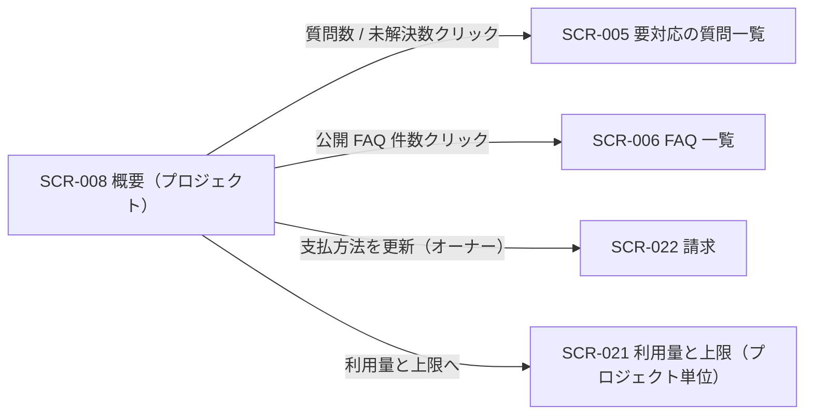
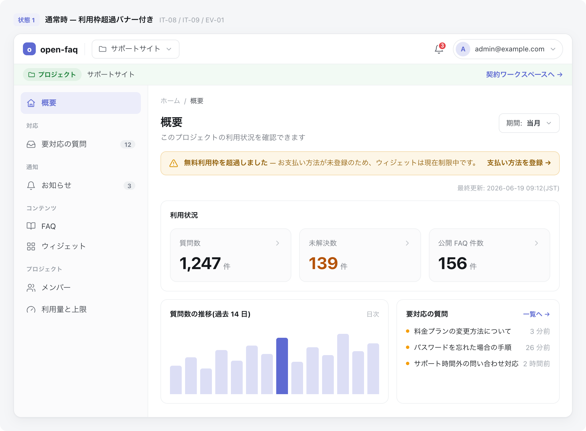

<!-- portal-top -->
[設計ポータル](../../README.md) ／ [基本設計](../index.md) ／ [画面設計](index.md) ／ **SCR-008 概要(プロジェクト)**
<!-- /portal-top -->

# SCR-008 概要(プロジェクト)

> **このページは、選択中プロジェクトの質問数・未解決数・公開 FAQ 件数を確認し、各ワークスペース画面への導線を提供するダッシュボード画面 SCR-008 を定義します。** 画面概要 / 画面遷移図 / 画面レイアウト / 画面項目定義 / 入出力一覧 / 画面イベント一覧 の 6 セクションで記述します。

*版数 v1.0 ・ 更新 2026-06-17 ・ 承認済*

## 1. 画面概要

選択中プロジェクトの質問数・未解決数・公開 FAQ 件数を白背景モノクロの 4 カードで確認し、数値クリックで関連画面へ遷移するプロジェクト概要画面です。

| 画面 ID | 画面名 | 機能概要 |
|----|----|----|
| `SCR-008` | 概要(プロジェクト) | 選択中プロジェクトの質問数・未解決数・公開 FAQ 件数を確認する |

| 関連 | 内容 |
|----|----|
| FR / BR | FR-077〜FR-081h, FR-127 / BR-069 |
| 関連画面 | [`SCR-005` 要対応の質問一覧](SCR-005.md) / [`SCR-006` FAQ 一覧](SCR-006.md) / [`SCR-016` 利用状況](SCR-016.md)(本画面からの直接遷移はなくサイドメニュー経由) / [`SCR-022` 請求](SCR-022.md) |

| ステークホルダ | 対象 |
|----------------|------|
| オーナー       | ◯    |
| メンバー       | ◯    |

> [!NOTE]
> **補足** 各ステークホルダとも当該プロジェクトへの割当が前提です。本画面はプロジェクト概要のみを扱い、変更・削除操作は置きません。契約全体の利用状況は SCR-016、請求は SCR-022、プロジェクト編集・削除は SCR-004 / SCR-004-001 に分離します。表示ルール(数値・期間・最終更新・色語彙・状態表現)は 画面設計 §1.5 ダッシュボード / KPI 共通表示ルール に正本化します。

## 2. 画面遷移図

本画面からの画面遷移を、画面 ID・画面名とイベント(操作)で示します。

## 3. 画面レイアウト

## 4. 画面項目定義

本画面の入出力項目(ヘッダ・期間選択・状態アラート・KPI カード)を定義します。項目の正本は本表です。各カードは項目名と件数のみを表示し、前月比・コメント・ゲージは表示しません。0 件 / 集計中 / 取得失敗時のクリック非活性ルールは 画面設計 §1.5 に従います。

| 項目 ID | 項目 | 説明 | 種類 | 表示条件 | 表示 |
|----|----|----|----|----|----|
| `IT-01` | PageHeader | 画面タイトル「概要」を表示する(プロジェクト名は付加せず WorkspaceSwitcher で確認) | 見出し | — | 「概要」 |
| `IT-02` | 期間選択 | 集計対象の期間を選択する | ドロップダウン | — | 選択肢「当月」/「前月」/「任意期間」(最大 13 ヶ月) |
| `IT-03` | 最終更新タイムスタンプ | 集計値の最終更新時刻を表示する | ラベル | — | 「最終更新: YYYY-MM-DD HH:MM(JST)」。5 分以上前は「集計遅延」黄表記 |
| `IT-04` | サスペンション中の表示 | 契約停止中であることと再開導線をアラート表示する | アラート | 契約状態が停止中(サスペンション)の場合のみ表示 | 「現在ご利用いただけません」+ オーナー連絡導線(non-owner)/「支払方法を更新する(請求)」リンク(オーナー向け) |
| `IT-05` | 質問数 | 期間内の質問総数を表示する | カード | — | 「質問数」+ 件数(例「1,247 件」) |
| `IT-06` | 未解決数 | 期間内の未解決質問数を表示する | カード | — | 「未解決数」+ 件数(例「139 件」) |
| `IT-07` | 公開 FAQ 件数 | 当該プロジェクトの公開 FAQ 件数を表示する | カード | — | 「公開 FAQ 件数」+ 件数(例「156 件」) |
| `IT-08` | 無料利用枠超過バナー | 無料利用枠超過と支払方法登録の導線を表示する | バナー | 無料利用枠を超過した場合のみ表示 | 「無料利用枠を超過しました」+ 支払方法未登録時はウィジェット制限中の旨と「支払い方法を登録」導線(オーナー向け) |
| `IT-09` | 質問数上限到達バナー | 質問数の上限到達と利用量画面への導線を表示する | バナー | 質問数が月次上限に到達した場合のみ表示 | 「質問数が上限に達しました」+ ウィジェット制限中の旨と「利用量と上限へ」導線(<a href="SCR-021.md">SCR-021</a>) |

## 5. 入出力一覧

本画面が読み書きするテーブルと、呼び出す API の一覧です。テーブルの正本は [データベース設計](../03_database-design/index.md)、API の正本は [API設計a.1](../02_api-design/index.md#API-DASH-001) です。本画面は集計取得のみで永続更新は行いません。

<table>
<thead>
<tr>
<th rowspan="2">入出力名</th>
<th rowspan="2">説明</th>
<th rowspan="2">種別</th>
<th rowspan="2">I/O</th>
<th colspan="4">アクセス種別(CRUD)</th>
<th rowspan="2">備考</th>
</tr>
<tr>
<th>C</th>
<th>R</th>
<th>U</th>
<th>D</th>
</tr>
</thead>
<tbody>
<tr>
<td>利用量計測</td>
<td>質問数・未解決数を集計取得する</td>
<td>テーブル</td>
<td>入力</td>
<td>—</td>
<td>◯</td>
<td>—</td>
<td>—</td>
<td><code>T_USAGE_METER</code>(<a href="../03_database-design/index.md#TBL-T-008">テーブル設計 3.22</a>)</td>
</tr>
<tr>
<td>FAQ</td>
<td>公開 FAQ 件数を集計取得する</td>
<td>テーブル</td>
<td>入力</td>
<td>—</td>
<td>◯</td>
<td>—</td>
<td>—</td>
<td><code>M_FAQS</code>(<a href="../03_database-design/index.md#TBL-M-006">テーブル設計 3.9</a>)</td>
</tr>
<tr>
<td>ダッシュボード集計取得</td>
<td>期間・プロジェクト別の KPI 集計を取得する</td>
<td>API</td>
<td>入力</td>
<td>—</td>
<td>—</td>
<td>—</td>
<td>—</td>
<td><code>GET /dashboard/summary</code>(<code>period</code> / <code>projectId</code>)(<a href="../02_api-design/index.md#API-DASH-001">API 設計 5.8a.1</a>)</td>
</tr>
</tbody>
</table>

## 6. 画面イベント一覧

本画面のイベント(初期表示・各操作)ごとに、対象の項目 ID と処理内容を定義します。

<table>
<colgroup>
<col style="width: 12%" />
<col style="width: 12%" />
<col style="width: 30%" />
<col style="width: 46%" />
</colgroup>
<thead>
<tr>
<th>イベント ID</th>
<th>項目 ID</th>
<th>イベント</th>
<th>処理</th>
</tr>
</thead>
<tbody>
<tr>
<td><code>EV-01</code></td>
<td>—</td>
<td>初期表示</td>
<td><ul>
<li><a href="../02_api-design/API-dashboard.md#API-DASH-001">ダッシュボードサマリ</a> API(デフォルト期間: 当月)で質問数・未解決数・公開 FAQ 件数を取得し KPI カード(<a href="#IT-05">IT-05</a>〜<a href="#IT-07">IT-07</a>)へ表示</li>
<li>最終更新タイムスタンプ(<a href="#IT-03">IT-03</a>)を表示し、5 分以上前なら「集計遅延」黄表記</li>
<li>契約状態がサスペンション中の場合: サスペンション中アラート(<a href="#IT-04">IT-04</a>)を表示</li>
<li>無料利用枠超過の場合: 超過バナー(<a href="#IT-08">IT-08</a>)を表示</li>
<li>質問数が月次上限到達の場合: 上限到達バナー(<a href="#IT-09">IT-09</a>)を表示</li>
</ul></td>
</tr>
<tr>
<td><code>EV-02</code></td>
<td><a href="#IT-02">IT-02</a></td>
<td>期間を選択</td>
<td><ul>
<li>選択期間で <a href="../02_api-design/API-dashboard.md#API-DASH-001">ダッシュボードサマリ</a> API を再取得し KPI カードを更新</li>
<li>取得失敗時: 各カードをエラー状態で表示し、クリック不可とする</li>
</ul></td>
</tr>
<tr>
<td><code>EV-03</code></td>
<td><a href="#IT-05">IT-05</a></td>
<td>質問数カードを押下</td>
<td><ul>
<li>成功時: <a href="SCR-005.md">SCR-005 要対応の質問一覧</a>へ遷移(絞り込みなし)</li>
<li>0 件・集計中・取得失敗時: クリック不可(非活性)</li>
</ul></td>
</tr>
<tr>
<td><code>EV-04</code></td>
<td><a href="#IT-06">IT-06</a></td>
<td>未解決数カードを押下</td>
<td><ul>
<li>成功時: <a href="SCR-005.md">SCR-005 要対応の質問一覧</a>へ遷移(status=open で絞り込み)</li>
<li>0 件・集計中・取得失敗時: クリック不可(非活性)</li>
</ul></td>
</tr>
<tr>
<td><code>EV-05</code></td>
<td><a href="#IT-07">IT-07</a></td>
<td>公開 FAQ 件数カードを押下</td>
<td><ul>
<li>成功時: <a href="SCR-006.md">SCR-006 FAQ 一覧</a>へ遷移</li>
<li>0 件・集計中・取得失敗時: クリック不可(非活性)</li>
</ul></td>
</tr>
<tr>
<td><code>EV-06</code></td>
<td><a href="#IT-04">IT-04</a></td>
<td>「支払方法を更新」を押下(オーナー)</td>
<td><ul><li><a href="SCR-022.md">SCR-022 請求</a>へ遷移</li></ul></td>
</tr>
<tr>
<td><code>EV-07</code></td>
<td><a href="#IT-08">IT-08</a></td>
<td>「支払い方法を登録」を押下(オーナー)</td>
<td><ul><li><a href="SCR-022.md">SCR-022 請求</a>へ遷移</li></ul></td>
</tr>
<tr>
<td><code>EV-08</code></td>
<td><a href="#IT-09">IT-09</a></td>
<td>「利用量と上限へ」を押下</td>
<td><ul><li><a href="SCR-021.md">SCR-021 利用量と上限(プロジェクト単位)</a>へ遷移</li></ul></td>
</tr>
</tbody>
</table>

---

<!-- portal-bottom -->
[← 画面設計](index.md) ・ [基本設計](../index.md) ・ [↑ 設計ポータル](../../README.md)
<!-- /portal-bottom -->
