<!-- portal-top -->
[設計ポータル](../README.md) ／ [基本設計](index.md) ／ **データベース設計**
<!-- /portal-top -->

# データベース設計書

**メインシステムのデータベース(Cloudflare D1 / SQLite)全 31 テーブルを機能ドメイン別に定義する設計書です。** 全ユーザーは `M_USER`、契約は `M_CONTRACT`(オーナー判定 + プロジェクトの親)で管理します。各テーブルの詳細はテーブル名のリンクから辿れます。

*版数 v3.3 ・ 更新 2026-06-20 ・ テーブル数 31 ・ 独立設計書*

## 1.データストア構成

D1
<h4>Cloudflare D1(SQLite)</h4>
全 31 テーブル。契約境界は <code>contract_id</code>(<code>M_CONTRACT.id</code>)で表す。

KV
<h4>Workers KV</h4>
セッション / トークン / レート制限のキャッシュ。

R2
<h4>R2 オブジェクト</h4>
CSV 添付・ウィジェット静的アセット。

## 2.テーブル一覧

全 31 テーブルを 7 ドメインに分類しています。テーブル名は個別ページ(概要 / カラム定義 / インデックス / コード値)へのリンクです。

#### 認証・アカウント・契約 (7)

全ユーザーの認証(M_USER)、契約とオーナー判定(M_CONTRACT)、プロジェクトメンバー割当、セッション・トークン・規約。

| 物理名 | 論理名 | 分類 / 保持 | 概要 |
|----|----|----|----|
| [`M_USER`](TBL-M-001.md) | ユーザーマスタ | マスタ | オーナー・メンバーを含む全ユーザーの認証情報を一元保持。 |
| [`M_CONTRACT`](TBL-M-002.md) | 契約マスタ | マスタ | 契約を管理。id が契約境界キー、user_id でオーナーを判定。プロジェクトの親。 |
| [`M_PRJ_USERS`](TBL-M-003.md) | プロジェクトメンバー(割当) | マスタ | ユーザーをプロジェクトへ割り当て(役割差は持たない)。 |
| [`T_SESSIONS`](TBL-T-001.md) | セッション | トランザクション | 複数デバイス対応のログインセッション。 |
| [`T_ACCESS_TOKENS`](TBL-T-002.md) | アクセストークン | トランザクション | 招待・パスワード再設定・メール確認などの短期トークン。 |
| [`M_TERMS_VER`](TBL-M-012.md) | 規約版数 | マスタ | 利用規約・プライバシーポリシーの版。 |
| [`T_TERMS_AGREE`](TBL-T-012.md) | 規約同意 | トランザクション | 利用者ごとの規約同意履歴。 |

#### プロジェクト・ウィジェット (3)

FAQ プロジェクト本体(契約の子)、許可ドメイン、ウィジェット鍵。

| 物理名 | 論理名 | 分類 / 保持 | 概要 |
|----|----|----|----|
| [`M_PROJECTS`](TBL-M-004.md) | プロジェクト | マスタ | FAQ プロジェクトとウィジェット設定。契約(M_CONTRACT)の子テーブル。 |
| [`M_ALLOWED_DOMAINS`](TBL-M-005.md) | 許可ドメイン | マスタ | ウィジェット埋め込みを許可するドメイン。 |
| [`T_PRJ_LEGACY_KEYS`](TBL-T-003.md) | レガシー API キー | トランザクション | 鍵ローテーション時に旧キーを 24 時間だけ有効化。 |

#### FAQ・質問・未解決 (6)

FAQ 本体と改訂履歴・全文検索、質問ログ、参照 FAQ、未解決質問。

| 物理名 | 論理名 | 分類 / 保持 | 概要 |
|----|----|----|----|
| [`M_FAQS`](TBL-M-006.md) | FAQ | マスタ | FAQ 本体(質問・回答・公開状態)。 |
| [`H_FAQ_REV`](TBL-H-001.md) | FAQ 改訂履歴 | 履歴 | 全文スナップショットの改訂履歴(最大 50 件)。 |
| [`TP_FAQ_FTS`](TBL-TP-001.md) | FAQ 全文検索 | ワーク | FTS5 仮想テーブル(trigram)。 |
| [`H_QUESTION_LOGS`](TBL-H-002.md) | 質問ログ | 履歴 | ウィジェット利用者の質問と AI 推論結果。 |
| [`T_QLOG_FAQ_REFS`](TBL-T-004.md) | 参照 FAQ(M:N) | トランザクション | 質問ログと参照 FAQ の中間テーブル。 |
| [`T_INQUIRIES`](TBL-T-005.md) | 未解決質問 | トランザクション | FAQ 登録前の未解決質問。 |

#### 利用量・課金・上限 (5)

利用量計測、サブスク・請求書(7 年保持)、利用上限・無料枠。

| 物理名 | 論理名 | 分類 / 保持 | 概要 |
|----|----|----|----|
| [`T_USAGE_METER`](TBL-T-008.md) | 利用量計測 | トランザクション 課金7年 | 質問数・FAQ 件数をプロジェクト単位で計測し契約単位で集計。 |
| [`T_BILL_SUBS`](TBL-T-006.md) | 課金サブスクリプション | トランザクション 課金7年 | Stripe サブスクと連動。 |
| [`T_BILL_INVOICES`](TBL-T-007.md) | 請求書 | トランザクション 課金7年 | 月次請求書(電子帳簿保存法 7 年)。 |
| [`M_PRJ_QUOTA_LIMITS`](TBL-M-009.md) | プロジェクト別利用設定 | マスタ | 質問数の月次上限・無料枠・アラート。 |
| [`M_OWNER_QUOTA_OVR`](TBL-M-008.md) | 契約別レート上書き | マスタ | 契約単位のレート制限上書き(contract 単位)。 |

#### お知らせ・通知 (5)

運営お知らせ、配信対象、受信者集計、受信箱、メール通知ログ。

| 物理名 | 論理名 | 分類 / 保持 | 概要 |
|----|----|----|----|
| [`M_SERVICE_ANNOUNCE`](TBL-M-010.md) | お知らせ(Control Plane) | マスタ | お知らせ本体。 |
| [`M_ANNOUNCE_AUD`](TBL-M-011.md) | お知らせ配信対象(M:N) | マスタ | 配信先を限定指定。 |
| [`T_ANNOUNCE_RCPT`](TBL-T-009.md) | お知らせ受信者 | トランザクション | 実配信先・配信集計・監査。 |
| [`T_INBOX_MSG`](TBL-T-010.md) | 受信箱(Tenant Plane) | トランザクション | 利用者が受け取る通知の既読状態。 |
| [`H_NOTIF_LOGS`](TBL-H-003.md) | 通知ログ | 履歴 | メール通知の送信履歴。 |

#### 退会・データ管理 (1)

退会申請(90 日猶予)とデータ削除モード。

| 物理名 | 論理名 | 分類 / 保持 | 概要 |
|----|----|----|----|
| [`T_WITHDRAW_REQ`](TBL-T-011.md) | 退会申請 | トランザクション | 退会申請レコード(90 日猶予)。 |

#### システム・ログ・運用 (4)

監査ログ、エラーログ、メールサプレス、AI しきい値キャッシュ。

| 物理名 | 論理名 | 分類 / 保持 | 概要 |
|----|----|----|----|
| [`H_AUDIT_LOGS`](TBL-H-004.md) | 監査ログ | 履歴 一部課金 | メイン側 API 操作ログ。 |
| [`H_ERROR_LOGS`](TBL-H-005.md) | エラーログ | 履歴 | サーバーエラー記録。 |
| [`M_EMAIL_SUPPRESS`](TBL-M-007.md) | メールサプレスリスト | マスタ | バウンス・苦情アドレス(全契約横断)。 |
| [`TP_AI_THRESH_CACHE`](TBL-TP-002.md) | AI しきい値キャッシュ | ワーク | 3 階層しきい値の永続キャッシュ。 |

## 3.ER 図(親子関係)

`M_USER`(全ユーザー)と `M_CONTRACT`(契約境界・オーナー判定)を起点に、全 31 テーブルの親子関係を機能ドメイン別の ER 図と外部キー表で示します(§3.1)。`M_EMAIL_SUPPRESS`(全契約横断)・`H_ERROR_LOGS`(外部キーなし)は外部キーを持たない独立テーブルです。

### 3.1 親子関係の図解(ドメイン別)

全テーブルの親子関係を、テーブル一覧(§2)の機能ドメインに沿って図と表で示します(§2 の「認証・アカウント・契約」は認証系を独立節として切り出し、「FAQ・質問・未解決」は FAQ / 質問ログ・参照 FAQ / 未解決質問の 3 節に分割しています)。各表は当該節に属する子テーブルの外部キーを**すべて**列挙します。多態参照(`*_id` + `*_type`)は `owner`→`M_CONTRACT` / `project_user`→`M_PRJ_USERS` を指します。

**(1) アカウント・契約・メンバー**

`M_USER`(全ユーザー)を `M_CONTRACT.user_id` が参照してオーナーを定める。`M_CONTRACT` がプロジェクトとメンバー割当(`M_PRJ_USERS`)の親となり、`M_PRJ_USERS` がユーザーをプロジェクトへ割り当てる。

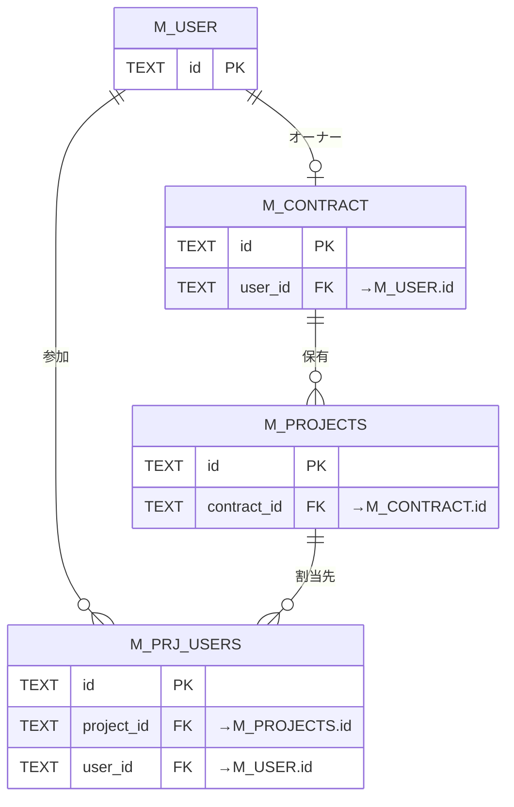

| 親 | 子(FK カラム) | 多重度 | 説明 |
|----|----|----|----|
| [`M_USER`](TBL-M-001.md) | [`M_CONTRACT`](TBL-M-002.md)(`user_id`) | 1:0..1 | オーナー判定。一致するユーザーが当該契約のオーナー |
| [`M_USER`](TBL-M-001.md) | [`M_PRJ_USERS`](TBL-M-003.md)(`user_id`) | 1:N | ユーザーの参加プロジェクト割当 |
| [`M_CONTRACT`](TBL-M-002.md) | [`M_PROJECTS`](TBL-M-004.md)(`contract_id`) | 1:N | 契約はプロジェクトを保有 |
| [`M_PROJECTS`](TBL-M-004.md) | [`M_PRJ_USERS`](TBL-M-003.md)(`project_id`) | 1:N | 割当先プロジェクト |

**(2) 認証 — セッション**

ログインセッションは認証主体である `M_USER`(`user_id`)に紐づく。複数デバイスからの同時ログインに対応する。オーナー / メンバーの種別はセッションに保持せず、`M_CONTRACT.user_id` 一致(オーナー)/ `M_PRJ_USERS` の有効割当(メンバー)で導出する。

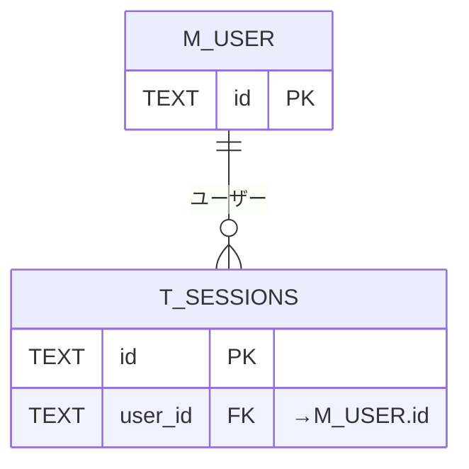

| 親 | 子(FK カラム) | 多重度 | 説明 |
|----|----|----|----|
| [`M_USER`](TBL-M-001.md) | [`T_SESSIONS`](TBL-T-001.md)(`user_id`) | 1:N | ログインセッション(認証主体 = `M_USER`) |

**(3) 認証 — トークン**

招待・パスワード再設定・メール確認などの短期トークンは、認証主体 `M_USER`(`user_id`)に紐づく(招待は有効化前の予約 `M_USER` 行を指す)。`user_id` は NULL 可で、問い合わせ先メール確認(`contact_verify`)は主体ユーザーが無く NULL とし、対象プロジェクトは `meta` で持つ。

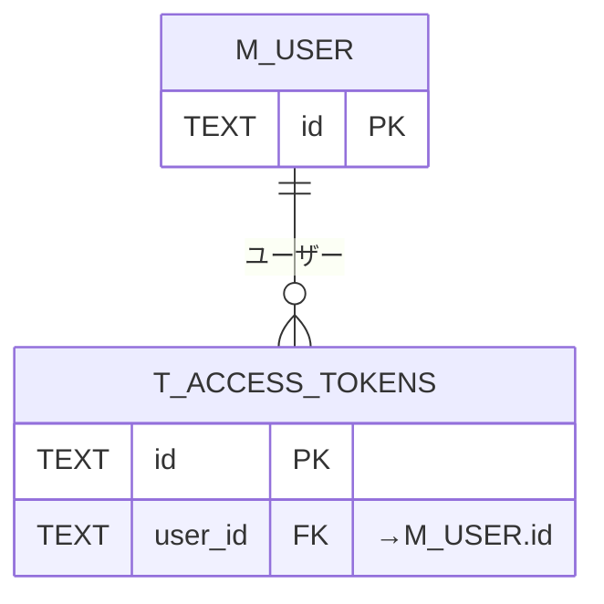

| 親 | 子(FK カラム) | 多重度 | 説明 |
|----|----|----|----|
| [`M_USER`](TBL-M-001.md) | [`T_ACCESS_TOKENS`](TBL-T-002.md)(`user_id`) | 1:N | 招待・再設定・確認トークン(認証主体 = `M_USER`。`user_id` は NULL 可、`contact_verify` は NULL で対象は `meta`) |

**(4) 認証 — 規約同意**

規約同意は認証主体 `M_USER`(`user_id`)に紐づき、同意した版を `M_TERMS_VER` の複合キー(`doc_type` + `version`)で参照する。

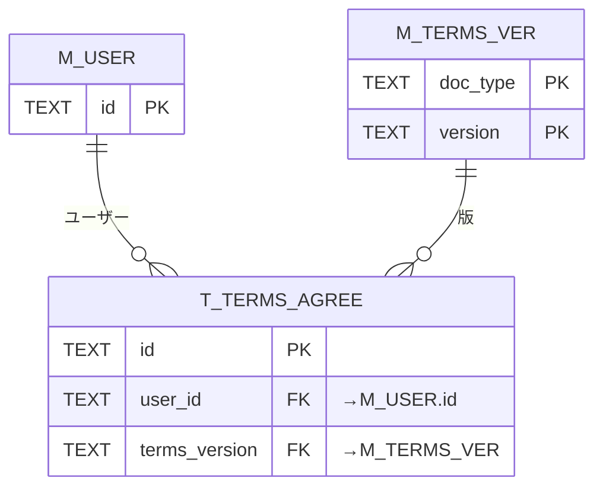

| 親 | 子(FK カラム) | 多重度 | 説明 |
|----|----|----|----|
| [`M_USER`](TBL-M-001.md) | [`T_TERMS_AGREE`](TBL-T-012.md)(`user_id`) | 1:N | 規約同意履歴(認証主体 = `M_USER`) |
| [`M_TERMS_VER`](TBL-M-012.md) | [`T_TERMS_AGREE`](TBL-T-012.md)(`doc_type, terms_version`) | 1:N | 同意した規約版(複合 FK) |

**(5) プロジェクト・ウィジェット**

`M_PROJECTS`(契約 `M_CONTRACT` の子)に、ウィジェット埋め込みの許可ドメインと、鍵ローテーション時の旧公開キーがぶら下がる。

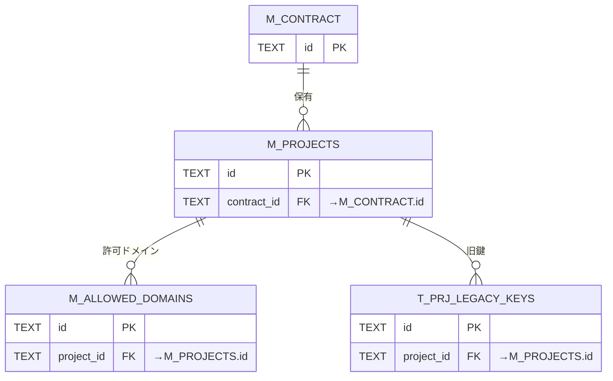

| 親 | 子(FK カラム) | 多重度 | 説明 |
|----|----|----|----|
| [`M_CONTRACT`](TBL-M-002.md) | [`M_PROJECTS`](TBL-M-004.md)(`contract_id`) | 1:N | 契約はプロジェクトを保有 |
| [`M_PROJECTS`](TBL-M-004.md) | [`M_ALLOWED_DOMAINS`](TBL-M-005.md)(`project_id`) | 1:N | ウィジェット埋め込み許可ドメイン |
| [`M_PROJECTS`](TBL-M-004.md) | [`T_PRJ_LEGACY_KEYS`](TBL-T-003.md)(`project_id`) | 1:N | ローテーション時の旧公開キー(24 時間有効) |

**(6) FAQ**

FAQ 本体 `M_FAQS` は `M_PROJECTS`(契約境界 `M_CONTRACT`)に帰属し、改訂履歴(`H_FAQ_REV`)と全文検索索引(`TP_FAQ_FTS`)を従える。未解決質問の FAQ 化(`source_inquiry_id`)で `T_INQUIRIES`(→ (8))から生まれ、質問ログから参照 FAQ(`T_QLOG_FAQ_REFS`、→ (7))として被参照される。

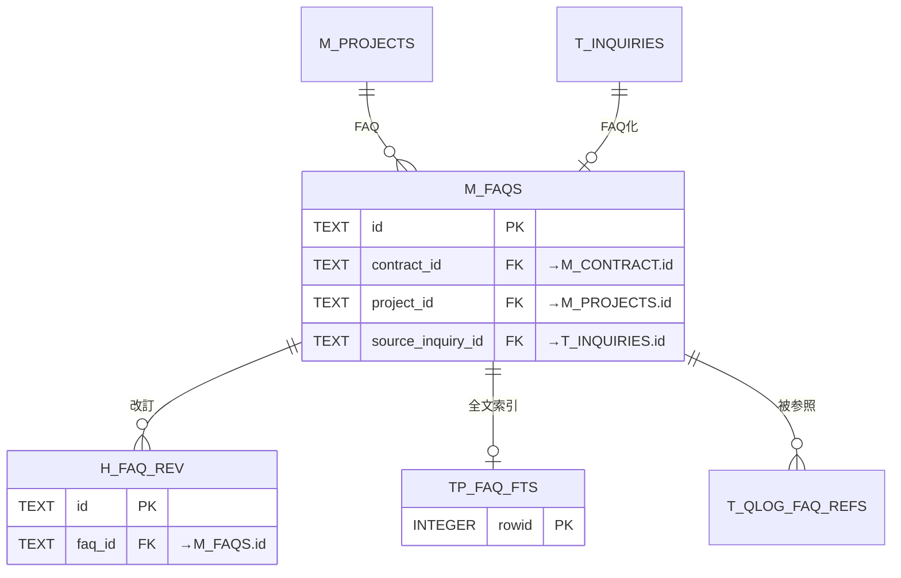

| 親 | 子(FK カラム) | 多重度 | 説明 |
|----|----|----|----|
| [`M_CONTRACT`](TBL-M-002.md) | [`M_FAQS`](TBL-M-006.md)(`contract_id`) | 1:N | 契約境界 |
| [`M_PROJECTS`](TBL-M-004.md) | [`M_FAQS`](TBL-M-006.md)(`project_id`) | 1:N | プロジェクトの FAQ |
| [`T_INQUIRIES`](TBL-T-005.md) | [`M_FAQS`](TBL-M-006.md)(`source_inquiry_id`) | 0..1:N | FAQ 化の発生元未解決質問(NULL 可) |
| `M_CONTRACT` / `M_PRJ_USERS` | [`M_FAQS`](TBL-M-006.md)(`created_by_id` / `updated_by_id`) | 1:N | 作成者・更新者(多態) |
| [`M_FAQS`](TBL-M-006.md) | [`H_FAQ_REV`](TBL-H-001.md)(`faq_id`) | 1:N | 改訂履歴(最大 50 件) |
| `M_CONTRACT` / `M_PRJ_USERS` | [`H_FAQ_REV`](TBL-H-001.md)(`created_by_id`) | 1:N | 改訂者(多態) |
| [`M_FAQS`](TBL-M-006.md) | [`TP_FAQ_FTS`](TBL-TP-001.md)(`rowid`) | 1:1 | 全文検索索引(`rowid` 同期。物理 FK ではない) |

**(7) 質問ログ・参照 FAQ**

ウィジェット利用者の質問ログ `H_QUESTION_LOGS` は `M_PROJECTS`(契約境界 `M_CONTRACT`)に帰属し、AI が参照した FAQ を中間テーブル `T_QLOG_FAQ_REFS` で `M_FAQS`(→ (6))と M:N に結ぶ。未解決化すると `T_INQUIRIES`(→ (8))を生む。

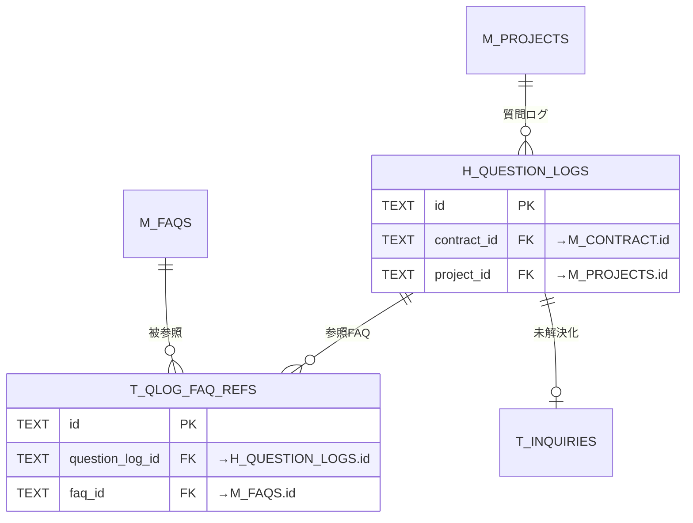

| 親 | 子(FK カラム) | 多重度 | 説明 |
|----|----|----|----|
| [`M_CONTRACT`](TBL-M-002.md) | [`H_QUESTION_LOGS`](TBL-H-002.md)(`contract_id`) | 1:N | 契約境界 |
| [`M_PROJECTS`](TBL-M-004.md) | [`H_QUESTION_LOGS`](TBL-H-002.md)(`project_id`) | 1:N | 質問ログ |
| [`H_QUESTION_LOGS`](TBL-H-002.md) | [`T_QLOG_FAQ_REFS`](TBL-T-004.md)(`question_log_id`) | 1:N | 参照 FAQ(M:N 中間) |
| [`M_FAQS`](TBL-M-006.md) | [`T_QLOG_FAQ_REFS`](TBL-T-004.md)(`faq_id`) | 1:N | 被参照 FAQ(M:N 中間) |

**(8) 未解決質問**

未解決質問 `T_INQUIRIES` は `M_PROJECTS`(契約境界 `M_CONTRACT`)に帰属し、発生元の質問ログ `H_QUESTION_LOGS`(→ (7))を `question_log_id` で保持する。FAQ 化されると `M_FAQS`(→ (6))を `source_inquiry_id` 経由で生む。

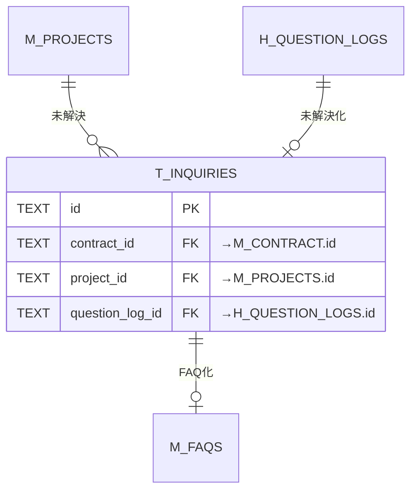

| 親 | 子(FK カラム) | 多重度 | 説明 |
|----|----|----|----|
| [`M_CONTRACT`](TBL-M-002.md) | [`T_INQUIRIES`](TBL-T-005.md)(`contract_id`) | 1:N | 契約境界 |
| [`M_PROJECTS`](TBL-M-004.md) | [`T_INQUIRIES`](TBL-T-005.md)(`project_id`) | 1:N | 未解決質問 |
| [`H_QUESTION_LOGS`](TBL-H-002.md) | [`T_INQUIRIES`](TBL-T-005.md)(`question_log_id`) | 1:0..1 | 未解決化の発生元質問ログ(NULL 可) |

**(9) 利用量・課金・上限**

利用量計測・サブスク・請求書・利用上限はすべて契約 `M_CONTRACT` に帰属し、利用量計測(`T_USAGE_METER`)と上限設定(`M_PRJ_QUOTA_LIMITS`)はプロジェクト単位でも紐づく。

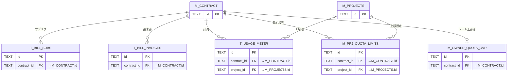

| 親 | 子(FK カラム) | 多重度 | 説明 |
|----|----|----|----|
| [`M_CONTRACT`](TBL-M-002.md) | [`T_BILL_SUBS`](TBL-T-006.md)(`contract_id`) | 1:N | Stripe サブスクリプション |
| [`M_CONTRACT`](TBL-M-002.md) | [`T_BILL_INVOICES`](TBL-T-007.md)(`contract_id`) | 1:N | 月次請求書(7 年保持) |
| [`M_CONTRACT`](TBL-M-002.md) | [`T_USAGE_METER`](TBL-T-008.md)(`contract_id`) | 1:N | 契約単位の利用量集計 |
| [`M_PROJECTS`](TBL-M-004.md) | [`T_USAGE_METER`](TBL-T-008.md)(`project_id`) | 1:N | プロジェクト単位の計測 |
| [`M_CONTRACT`](TBL-M-002.md) | [`M_PRJ_QUOTA_LIMITS`](TBL-M-009.md)(`contract_id`) | 1:N | 契約境界 |
| [`M_PROJECTS`](TBL-M-004.md) | [`M_PRJ_QUOTA_LIMITS`](TBL-M-009.md)(`project_id`) | 1:N | 月次上限・無料枠・アラート設定 |
| [`M_CONTRACT`](TBL-M-002.md) | [`M_OWNER_QUOTA_OVR`](TBL-M-008.md)(`contract_id`) | 1:0..1 | 契約単位のレート制限上書き |

**(10) お知らせ・通知**

運営お知らせ本体 `M_SERVICE_ANNOUNCE` から配信対象(`M_ANNOUNCE_AUD`)・受信者集計(`T_ANNOUNCE_RCPT`)へ展開し、利用者の受信箱(`T_INBOX_MSG`)とメール通知ログ(`H_NOTIF_LOGS`)は契約に帰属する。

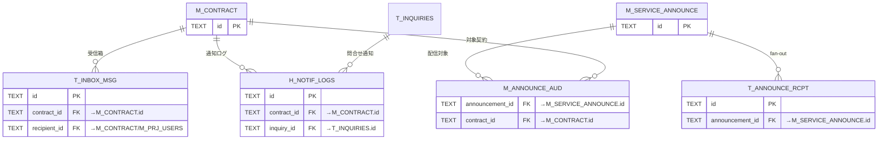

| 親 | 子(FK カラム) | 多重度 | 説明 |
|----|----|----|----|
| [`M_SERVICE_ANNOUNCE`](TBL-M-010.md) | [`M_ANNOUNCE_AUD`](TBL-M-011.md)(`announcement_id`) | 1:N | 配信対象指定(複合 PK①) |
| [`M_CONTRACT`](TBL-M-002.md) | [`M_ANNOUNCE_AUD`](TBL-M-011.md)(`contract_id`) | 1:N | 対象契約(複合 PK②) |
| `M_CONTRACT` / `M_PRJ_USERS` | [`M_SERVICE_ANNOUNCE`](TBL-M-010.md)(`created_by_id`) | 1:N | 作成者(多態。Control Plane) |
| [`M_SERVICE_ANNOUNCE`](TBL-M-010.md) | [`T_ANNOUNCE_RCPT`](TBL-T-009.md)(`announcement_id`) | 1:N | 受信者集計(fan-out) |
| [`M_CONTRACT`](TBL-M-002.md) | [`T_INBOX_MSG`](TBL-T-010.md)(`contract_id`) | 1:N | 受信箱 |
| `M_CONTRACT` / `M_PRJ_USERS` | [`T_INBOX_MSG`](TBL-T-010.md)(`recipient_id`) | 1:N | 受信者(多態) |
| [`M_CONTRACT`](TBL-M-002.md) | [`H_NOTIF_LOGS`](TBL-H-003.md)(`contract_id`) | 1:N | メール通知ログ |
| [`T_INQUIRIES`](TBL-T-005.md) | [`H_NOTIF_LOGS`](TBL-H-003.md)(`inquiry_id`) | 1:N | 問い合わせ起点の通知(NULL 可) |

**(11) 退会・データ管理**

退会申請 `T_WITHDRAW_REQ` は契約 `M_CONTRACT` に紐づき(90 日猶予)、申請者(`applied_by`)は多態参照で主体を指す。

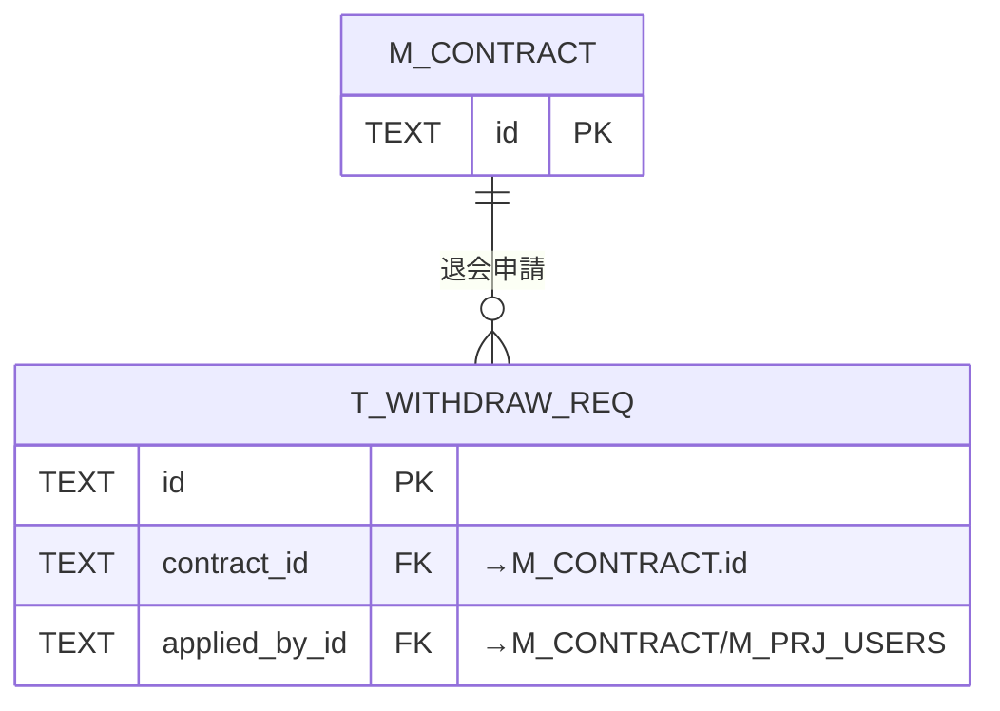

| 親 | 子(FK カラム) | 多重度 | 説明 |
|----|----|----|----|
| [`M_CONTRACT`](TBL-M-002.md) | [`T_WITHDRAW_REQ`](TBL-T-011.md)(`contract_id`) | 1:N | 退会申請(90 日猶予) |
| `M_CONTRACT` / `M_PRJ_USERS` | [`T_WITHDRAW_REQ`](TBL-T-011.md)(`applied_by_id`) | 1:N | 申請者(多態) |

**(12) システム・ログ・運用**

監査ログ(`H_AUDIT_LOGS`)と AI しきい値キャッシュ(`TP_AI_THRESH_CACHE`)は契約(一部プロジェクト)に紐づく。エラーログ(`H_ERROR_LOGS`)とメールサプレスリスト(`M_EMAIL_SUPPRESS`、全契約横断)は外部キーを持たない独立テーブル。

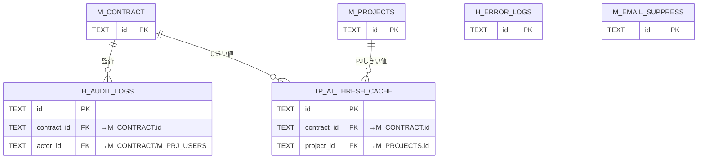

| 親 | 子(FK カラム) | 多重度 | 説明 |
|----|----|----|----|
| [`M_CONTRACT`](TBL-M-002.md) | [`H_AUDIT_LOGS`](TBL-H-004.md)(`contract_id`) | 1:N | 操作監査ログ(NULL 可) |
| `M_CONTRACT` / `M_PRJ_USERS` | [`H_AUDIT_LOGS`](TBL-H-004.md)(`actor_id`) | 1:N | 操作者(多態) |
| [`M_CONTRACT`](TBL-M-002.md) | [`TP_AI_THRESH_CACHE`](TBL-TP-002.md)(`contract_id`) | 1:N | AI しきい値キャッシュ(NULL 可) |
| [`M_PROJECTS`](TBL-M-004.md) | [`TP_AI_THRESH_CACHE`](TBL-TP-002.md)(`project_id`) | 1:N | プロジェクト別しきい値(NULL 可) |
| — | [`H_ERROR_LOGS`](TBL-H-005.md) / [`M_EMAIL_SUPPRESS`](TBL-M-007.md) | — | 外部キーを持たない独立テーブル |

## 4.命名・分類規約

| 接頭辞 | 分類             | 用途                 | 例                      |
|--------|------------------|----------------------|-------------------------|
| `M_`   | マスタ           | マスタ・設定         | `M_USER` / `M_CONTRACT` |
| `T_`   | トランザクション | トランザクション     | `T_INQUIRIES`           |
| `H_`   | 履歴             | 履歴・ログ(追記専用) | `H_QUESTION_LOGS`       |
| `TP_`  | ワーク           | ワーク・派生         | `TP_FAQ_FTS`            |

---

<!-- portal-bottom -->
[基本設計](index.md) ・ [↑ 設計ポータル](../README.md)
<!-- /portal-bottom -->
