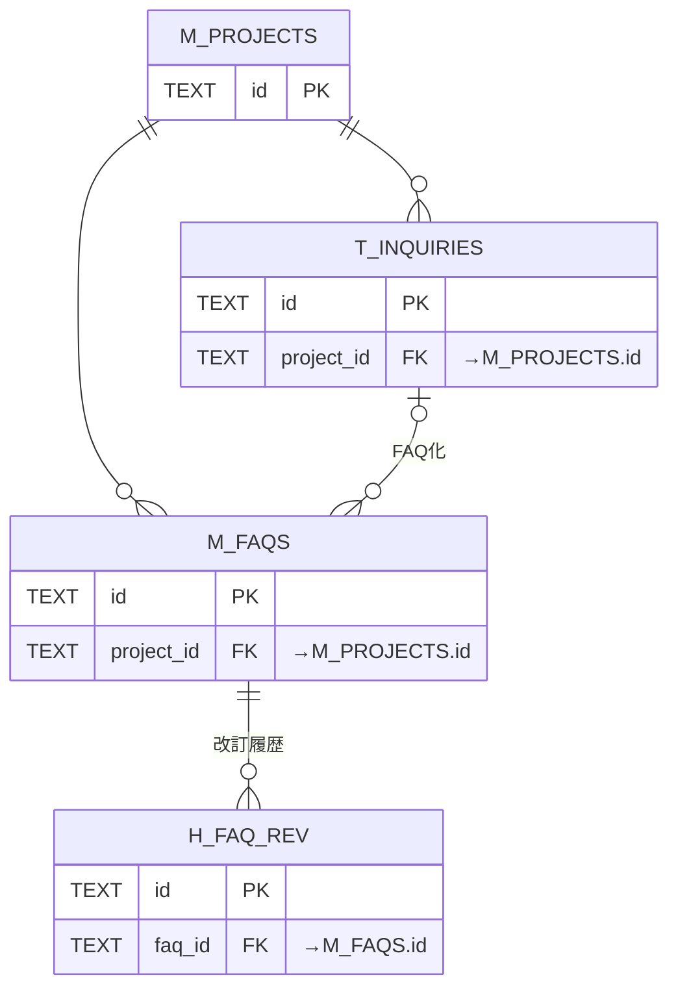
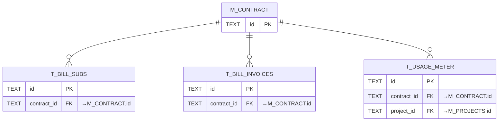
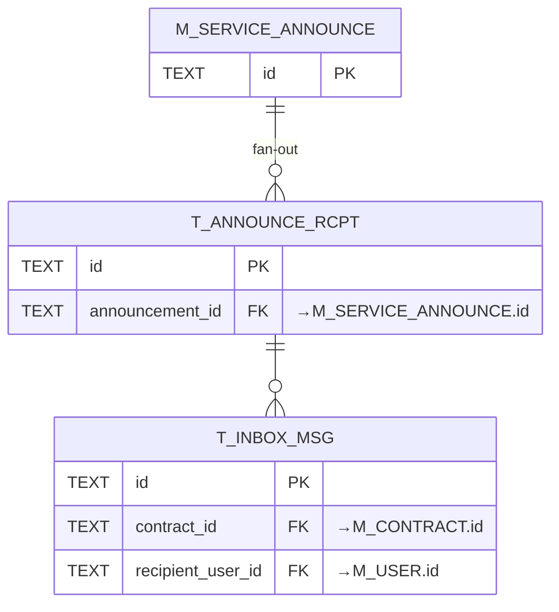

<!-- portal-top -->
[設計ポータル](../README.md) ／ [基本設計](index.md) ／ **データベース設計**
<!-- /portal-top -->

# データベース設計書

**メインシステムのデータベース(Cloudflare D1 / SQLite)全 31 テーブルを機能ドメイン別に定義する設計書です。** 全ユーザーは `M_USER`、契約は `M_CONTRACT`(オーナー判定 + プロジェクトの親)で管理します。各テーブルの詳細はテーブル名のリンクから辿れます。

*版数 v3.0 ・ 更新 2026-06-19 ・ テーブル数 31 ・ 独立設計書*

## <span id="store"></span>1.データストア構成

<div class="card-grid cols-3">
<div class="card"><div class="lead-ico">D1</div><h4>Cloudflare D1(SQLite)</h4><p>全 31 テーブル。契約境界は <code>contract_id</code>(<code>M_CONTRACT.id</code>)で表す。</p></div>
<div class="card"><div class="lead-ico">KV</div><h4>Workers KV</h4><p>セッション / トークン / レート制限のキャッシュ。</p></div>
<div class="card"><div class="lead-ico">R2</div><h4>R2 オブジェクト</h4><p>CSV 添付・ウィジェット静的アセット。</p></div>
</div>

## <span id="change"></span>2.モデル変更点(ユーザー / 契約の再設計)

- \+**M_USER(ユーザーマスタ)を新設** — オーナー・プロジェクト管理者・メンバーを含む**すべてのユーザー**の認証主体を 1 テーブルに統合。
- \+**M_CONTRACT(契約マスタ)を新設** — 契約を管理し、`id` を契約境界キーとする。`user_id` で**オーナーを判定**。`M_PROJECTS` はこの契約の子テーブル。
- ↺**M_PRJ_USERS をメンバー管理へ統合** — 認証情報は `M_USER` へ分離し、本テーブルは「ユーザー × プロジェクト × ロール」の割当を保持(旧 `M_PRJ_USER_ASGN` を統合)。
- −**M_OWNERS を廃止** — 認証は `M_USER`、契約属性は `M_CONTRACT` へ移管。
- −**M_PRJ_USER_ASGN を廃止** — `M_PRJ_USERS` に統合。

> [!NOTE]
> <span class="c-ic">ℹ</span>
>
> <div>
>
> 契約境界キーは旧 `owner_id` から `contract_id`(`M_CONTRACT.id` 参照)へ置換します。オーナー判定は「ユーザーが `M_CONTRACT.user_id` と一致するか」で行います。
>
> </div>

## <span id="map"></span>3.テーブル一覧

全 31 テーブルを 7 ドメインに分類しています。テーブル名は個別ページ(概要 / カラム定義 / インデックス / コード値)へのリンクです。

#### 認証・アカウント・契約 (7)

全ユーザーの認証(M_USER)、契約とオーナー判定(M_CONTRACT)、プロジェクトメンバー割当、セッション・トークン・規約。

| 物理名 | 論理名 | 分類 / 保持 | 概要 |
|----|----|----|----|
| [`M_USER`](TBL-M-001.md) 新規 | ユーザーマスタ | マスタ | オーナー・管理者・メンバーを含む全ユーザーの認証情報を一元保持。 |
| [`M_CONTRACT`](TBL-M-002.md) 新規 | 契約マスタ | マスタ | 契約を管理。id が契約境界キー、user_id でオーナーを判定。プロジェクトの親。 |
| [`M_PRJ_USERS`](TBL-M-003.md) | プロジェクトメンバー(割当 + ロール) | マスタ | ユーザーをプロジェクトへ割り当て、ロール(admin / member)を保持。旧 M_PRJ_USER_ASGN を統合。 |
| [`T_SESSIONS`](TBL-T-001.md) | セッション | トランザクション | 複数デバイス対応のログインセッション。 |
| [`T_ACCESS_TOKENS`](TBL-T-002.md) | アクセストークン | トランザクション | 招待・パスワード再設定・メール確認などの短期トークン。 |
| [`M_TERMS_VER`](TBL-M-012.md) | 規約版数 | マスタ | 利用規約・プライバシーポリシーの版。 |
| [`T_TERMS_AGREE`](TBL-T-012.md) | 規約同意 | トランザクション | 利用者ごとの規約同意履歴。 |

#### プロジェクト・ウィジェット (3)

FAQ プロジェクト本体(契約の子)、許可ドメイン、ウィジェット鍵。

| 物理名 | 論理名 | 分類 / 保持 | 概要 |
|----|----|----|----|
| [`M_PROJECTS`](TBL-M-004.md) | プロジェクト | マスタ | FAQ プロジェクトとウィジェット設定。契約(M_CONTRACT)の子テーブル。 |
| [`M_ALLOWED_DOMAINS`](TBL-M-005.md) | 許可ドメイン | マスタ | ウィジェット埋め込みを許可するドメイン。 |
| [`T_PRJ_LEGACY_KEYS`](TBL-T-003.md) | レガシー API キー | トランザクション | 鍵ローテーション時に旧キーを 24 時間だけ有効化。 |

#### FAQ・質問・未解決 (6)

FAQ 本体と改訂履歴・全文検索、質問ログ、参照 FAQ、未解決質問。

| 物理名 | 論理名 | 分類 / 保持 | 概要 |
|----|----|----|----|
| [`M_FAQS`](TBL-M-006.md) | FAQ | マスタ | FAQ 本体(質問・回答・公開状態)。 |
| [`H_FAQ_REV`](TBL-H-001.md) | FAQ 改訂履歴 | 履歴 | 全文スナップショットの改訂履歴(最大 50 件)。 |
| [`TP_FAQ_FTS`](TBL-TP-001.md) | FAQ 全文検索 | ワーク | FTS5 仮想テーブル(trigram)。 |
| [`H_QUESTION_LOGS`](TBL-H-002.md) | 質問ログ | 履歴 | ウィジェット利用者の質問と AI 推論結果。 |
| [`T_QLOG_FAQ_REFS`](TBL-T-004.md) | 参照 FAQ(M:N) | トランザクション | 質問ログと参照 FAQ の中間テーブル。 |
| [`T_INQUIRIES`](TBL-T-005.md) | 未解決質問 | トランザクション | FAQ 登録前の未解決質問。 |

#### 利用量・課金・上限 (5)

利用量計測、サブスク・請求書(7 年保持)、利用上限・無料枠。

| 物理名 | 論理名 | 分類 / 保持 | 概要 |
|----|----|----|----|
| [`T_USAGE_METER`](TBL-T-008.md) | 利用量計測 | トランザクション 課金7年 | 質問数・FAQ 件数をプロジェクト単位で計測し契約単位で集計。 |
| [`T_BILL_SUBS`](TBL-T-006.md) | 課金サブスクリプション | トランザクション 課金7年 | Stripe サブスクと連動。 |
| [`T_BILL_INVOICES`](TBL-T-007.md) | 請求書 | トランザクション 課金7年 | 月次請求書(電子帳簿保存法 7 年)。 |
| [`M_PRJ_QUOTA_LIMITS`](TBL-M-009.md) | プロジェクト別利用設定 | マスタ | 質問数の月次上限・無料枠・アラート。 |
| [`M_OWNER_QUOTA_OVR`](TBL-M-008.md) | 契約別レート上書き | マスタ | 契約単位のレート制限上書き(contract 単位)。 |

#### お知らせ・通知 (5)

運営お知らせ、配信対象、受信者集計、受信箱、メール通知ログ。

| 物理名 | 論理名 | 分類 / 保持 | 概要 |
|----|----|----|----|
| [`M_SERVICE_ANNOUNCE`](TBL-M-010.md) | お知らせ(Control Plane) | マスタ | お知らせ本体。 |
| [`M_ANNOUNCE_AUD`](TBL-M-011.md) | お知らせ配信対象(M:N) | マスタ | 配信先を限定指定。 |
| [`T_ANNOUNCE_RCPT`](TBL-T-009.md) | お知らせ受信者 | トランザクション | 実配信先・配信集計・監査。 |
| [`T_INBOX_MSG`](TBL-T-010.md) | 受信箱(Tenant Plane) | トランザクション | 利用者が受け取る通知の既読状態。 |
| [`H_NOTIF_LOGS`](TBL-H-003.md) | 通知ログ | 履歴 | メール通知の送信履歴。 |

#### 退会・データ管理 (1)

退会申請(90 日猶予)とデータ削除モード。

| 物理名 | 論理名 | 分類 / 保持 | 概要 |
|----|----|----|----|
| [`T_WITHDRAW_REQ`](TBL-T-011.md) | 退会申請 | トランザクション | 退会申請レコード(90 日猶予)。 |

#### システム・ログ・運用 (4)

監査ログ、エラーログ、メールサプレス、AI しきい値キャッシュ。

| 物理名 | 論理名 | 分類 / 保持 | 概要 |
|----|----|----|----|
| [`H_AUDIT_LOGS`](TBL-H-004.md) | 監査ログ | 履歴 一部課金 | メイン側 API 操作ログ。 |
| [`H_ERROR_LOGS`](TBL-H-005.md) | エラーログ | 履歴 | サーバーエラー記録。 |
| [`M_EMAIL_SUPPRESS`](TBL-M-007.md) | メールサプレスリスト | マスタ | バウンス・苦情アドレス(全契約横断)。 |
| [`TP_AI_THRESH_CACHE`](TBL-TP-002.md) | AI しきい値キャッシュ | ワーク | 3 階層しきい値の永続キャッシュ。 |

## <span id="er"></span>4.ER 図(中核リレーション)

`M_USER`(全ユーザー)と `M_CONTRACT`(契約境界・オーナー判定)を起点とした主要な親子関係です。

```mermaid
erDiagram
  M_USER ||--o| M_CONTRACT : "オーナー"
  M_CONTRACT ||--o{ M_PROJECTS : "保有"
  M_CONTRACT ||--o{ M_PRJ_USERS : "メンバー"
  M_USER ||--o{ M_PRJ_USERS : "参加"
  M_PROJECTS ||--o{ M_PRJ_USERS : "割当"
  M_PROJECTS ||--o{ M_ALLOWED_DOMAINS : "許可"
  M_PROJECTS ||--o{ M_FAQS : "保有"
  M_FAQS ||--o{ H_FAQ_REV : "改訂"
  M_PROJECTS ||--o{ H_QUESTION_LOGS : "記録"
  H_QUESTION_LOGS ||--o| T_INQUIRIES : "未解決化"
  T_INQUIRIES ||--o| M_FAQS : "FAQ化"
  M_CONTRACT ||--o{ T_USAGE_METER : "計測"
  M_CONTRACT ||--o{ T_BILL_SUBS : "契約"
  M_CONTRACT ||--o{ T_BILL_INVOICES : "請求"
  M_CONTRACT ||--o{ T_INBOX_MSG : "受信"
  M_SERVICE_ANNOUNCE ||--o{ T_ANNOUNCE_RCPT : "配信"
```中核テーブルのリレーション

### <span id="rel"></span>4.1 親子関係の図解(ドメイン別)

主要テーブルの親子関係をドメインごとに図と表で示します。

**(1) ユーザー・契約・プロジェクト・メンバー**

**概要** — `M_USER`(全ユーザー)を `M_CONTRACT.user_id` が参照してオーナーを定める。`M_CONTRACT` がプロジェクトを保有し、`M_PRJ_USERS` がユーザーをプロジェクトへ割り当てる。

```mermaid
erDiagram
  M_USER {
    TEXT id PK
    TEXT email
  }
  M_CONTRACT {
    TEXT id PK
    TEXT user_id FK "→M_USER.id"
    TEXT status
  }
  M_PROJECTS {
    TEXT id PK
    TEXT contract_id FK "→M_CONTRACT.id"
  }
  M_PRJ_USERS {
    TEXT id PK
    TEXT contract_id FK "→M_CONTRACT.id"
    TEXT project_id FK "→M_PROJECTS.id"
    TEXT user_id FK "→M_USER.id"
    TEXT role
  }
  M_USER ||--o| M_CONTRACT : "オーナー(user_id)"
  M_CONTRACT ||--o{ M_PROJECTS : "保有"
  M_CONTRACT ||--o{ M_PRJ_USERS : "契約境界"
  M_PROJECTS ||--o{ M_PRJ_USERS : "割当先"
  M_USER ||--o{ M_PRJ_USERS : "参加"
```

| 親 | 子 | カーディナリティ | 説明 |
|----|----|----|----|
| [`M_USER`](TBL-M-001.md) | [`M_CONTRACT`](TBL-M-002.md) | 1:0..N | オーナー。`M_CONTRACT.user_id` → `M_USER(id)`。一致するユーザーが当該契約のオーナー |
| [`M_CONTRACT`](TBL-M-002.md) | [`M_PROJECTS`](TBL-M-004.md) | 1:N | 契約はプロジェクトを保有(`contract_id`)。契約削除で連鎖 |
| [`M_PROJECTS`](TBL-M-004.md) | [`M_PRJ_USERS`](TBL-M-003.md) | 1:N | 割当先。`role`(admin / member)を保持 |
| [`M_USER`](TBL-M-001.md) | [`M_PRJ_USERS`](TBL-M-003.md) | 1:N | ユーザーの参加プロジェクト割当 |

**(2) プロジェクト配下(FAQ・未解決質問)**

**概要** — コンテンツ系は `M_PROJECTS` に帰属します。



**(3) 課金(契約配下)**

**概要** — 課金系はすべて契約 `M_CONTRACT` に帰属します。



**(4) お知らせ(fan-out)**

**概要** — 本体 1 件から受信者ごとの受信箱へ展開します。



## <span id="rule"></span>5.命名・分類規約

| 接頭辞 | 分類             | 用途                 | 例                      |
|--------|------------------|----------------------|-------------------------|
| `M_`   | マスタ           | マスタ・設定         | `M_USER` / `M_CONTRACT` |
| `T_`   | トランザクション | トランザクション     | `T_INQUIRIES`           |
| `H_`   | 履歴             | 履歴・ログ(追記専用) | `H_QUESTION_LOGS`       |
| `TP_`  | ワーク           | ワーク・派生         | `TP_FAQ_FTS`            |

---

---

<!-- portal-bottom -->
[基本設計](index.md) ・ [↑ 設計ポータル](../README.md)
<!-- /portal-bottom -->
