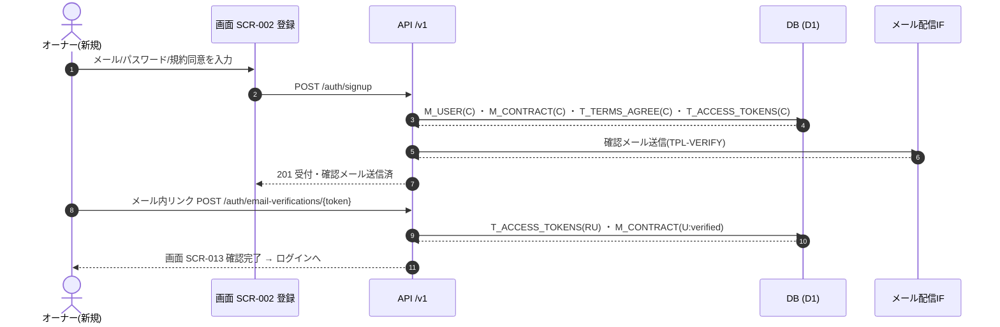
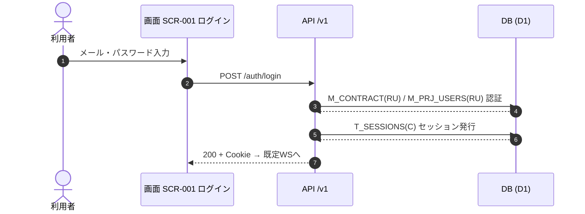
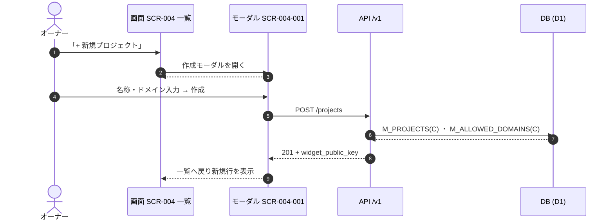
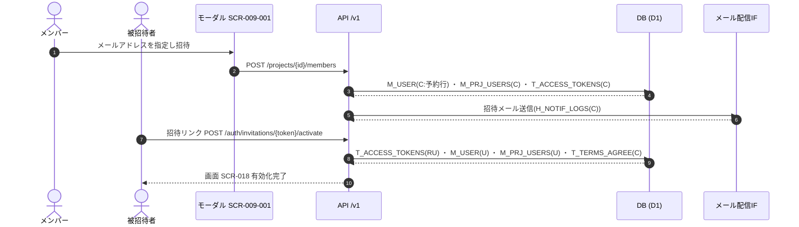
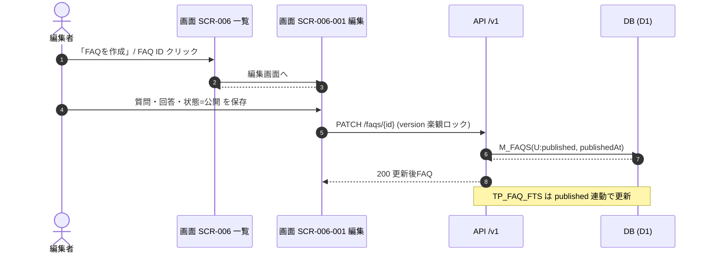
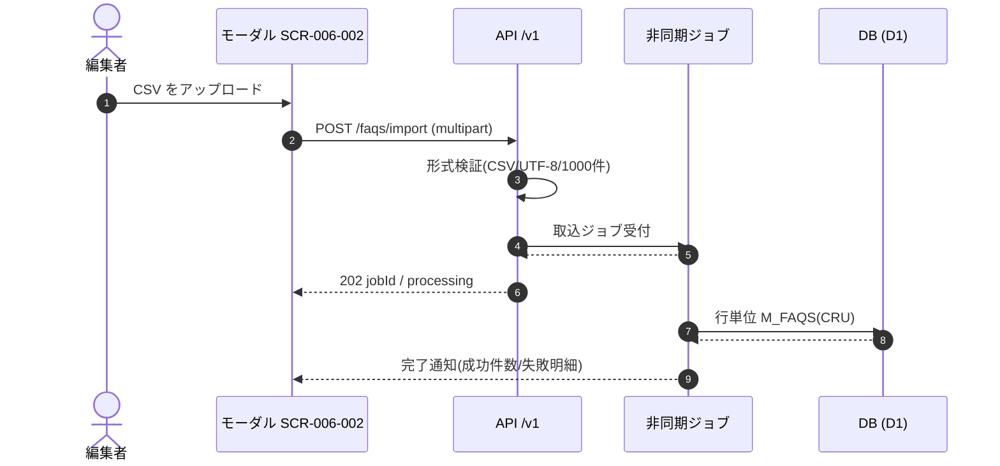
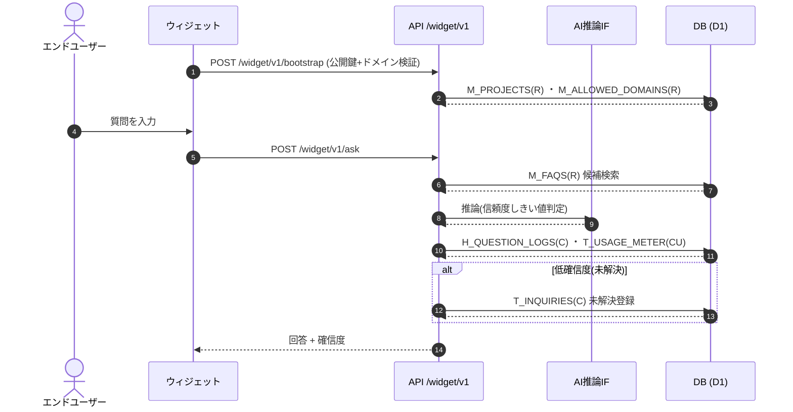
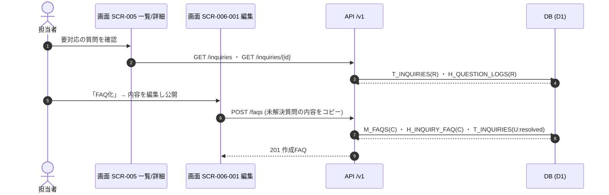
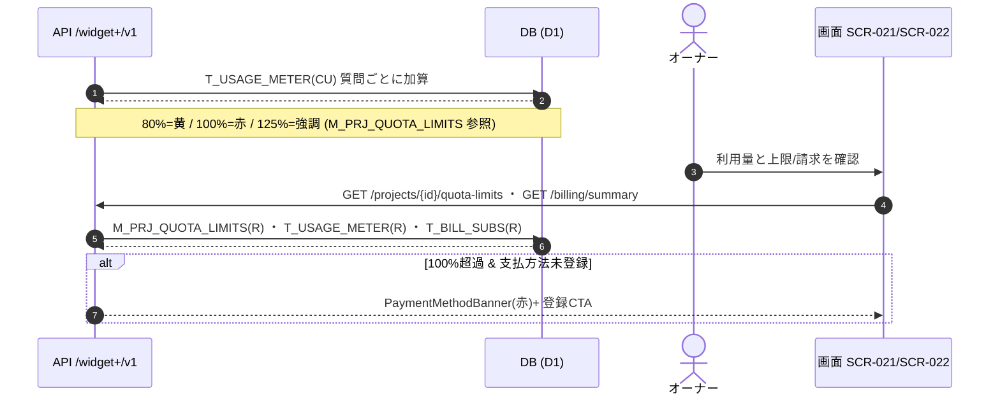
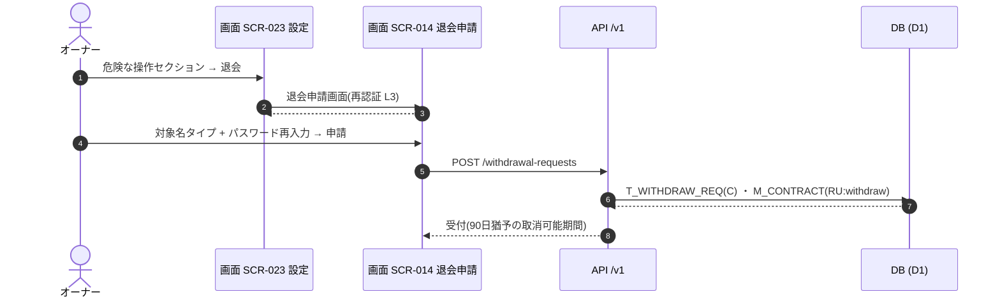

<!-- portal-top -->
[設計ポータル](../README.md) ／ [基本設計](index.md) ／ **ユースケース・シーケンス設計書**
<!-- /portal-top -->

# ユースケース・シーケンス設計書

**画面設計・API設計・データベース設計の 3 つの独立設計書を横断し、業務の流れ(ユースケース)を「アクター → 画面 → API → DB」のシーケンスで明確化する設計書です。** 各設計書をどう組み合わせて 1 つの業務が成立するかを、本書のシーケンス図とトレーサビリティ・マトリクスで追跡できます。

*版数 v2.2 ・ 更新 2026-06-20 ・ ユースケース 10 ・ 横断設計書*

> [!NOTE]
> **本書と詳細ユースケースの関係** 本書は複数画面・非同期処理をまたぐ横断フロー(粗粒度の 10 UC)を示します。画面イベント単位(`EV-xx`)に 1:1 対応した詳細ユースケースと、システム起点(バッチ・Webhook・非同期ジョブ)のユースケースは [ユースケース一覧](../04_usecases/index.md) を参照してください。

## 0.横断設計の考え方

本システムの 1 操作は、必ず次の 5 層を縦に貫きます。本書はこの縦串を「フロー」として可視化します。

要件FR / BR → 画面SCR(アクション) → API/v1 エンドポイント → DBテーブル(CRUD) 

①
<h4>要件 → 画面</h4>
要件(FR)がどの画面・アクションに落ちるかは <a href="index.md#fr">ポータル §3</a> と <a href="01_screen-design.md">画面設計</a> が担う。

②
<h4>画面 → API → DB</h4>
画面の各アクションが呼ぶ API と触れるテーブルは <a href="01_screen-design.md#flow">画面設計 §4</a> に集約。

③
<h4>横断フロー</h4>
複数画面・API・非同期処理にまたがる業務の流れを本書のシーケンス図で繋ぐ。

## 1.ユースケース一覧

主要な 10 ユースケースです。各 UC はシーケンス図(§2)へリンクします。

<table style="min-width:760px">
<colgroup>
<col />
<col style="width: 28%" />
<col style="width: 20%" />
<col style="width: 20%" />
<col />
</colgroup>
<thead>
<tr>
<th>UC ID</th>
<th>ユースケース</th>
<th>アクター</th>
<th>主な画面</th>
<th>関連要件</th>
</tr>
</thead>
<tbody>
<tr>
<td><a href="#UC-01"><code>UC-01</code></a></td>
<td><strong>アカウント新規登録〜メール確認</strong></td>
<td>契約オーナー(新規)</td>
<td><a href="01_screen-design.md#SCR-002" style="font-size:10.5px">SCR-002</a> <a href="01_screen-design.md#SCR-013" style="font-size:10.5px">SCR-013</a></td>
<td style="font-size: 11.5px">FR01 アカウント管理</td>
</tr>
<tr>
<td><a href="#UC-02"><code>UC-02</code></a></td>
<td><strong>ログイン</strong></td>
<td>全認証ユーザー</td>
<td><a href="01_screen-design.md#SCR-001" style="font-size:10.5px">SCR-001</a></td>
<td style="font-size: 11.5px">FR01 アカウント管理</td>
</tr>
<tr>
<td><a href="#UC-03"><code>UC-03</code></a></td>
<td><strong>プロジェクト作成</strong></td>
<td>オーナー</td>
<td><a href="01_screen-design.md#SCR-004" style="font-size:10.5px">SCR-004</a> <a href="01_screen-design.md#SCR-004-001" style="font-size:10.5px">SCR-004-001</a></td>
<td style="font-size: 11.5px">FR03 プロジェクト管理</td>
</tr>
<tr>
<td><a href="#UC-04"><code>UC-04</code></a></td>
<td><strong>メンバー招待〜アカウント有効化</strong></td>
<td>オーナー / メンバー → 被招待者</td>
<td><a href="01_screen-design.md#SCR-009-001" style="font-size:10.5px">SCR-009-001</a> <a href="01_screen-design.md#SCR-018" style="font-size:10.5px">SCR-018</a></td>
<td style="font-size: 11.5px">FR02 ユーザー管理</td>
</tr>
<tr>
<td><a href="#UC-05"><code>UC-05</code></a></td>
<td><strong>FAQ 作成・公開</strong></td>
<td>オーナー / メンバー+</td>
<td><a href="01_screen-design.md#SCR-006" style="font-size:10.5px">SCR-006</a> <a href="01_screen-design.md#SCR-006-001" style="font-size:10.5px">SCR-006-001</a></td>
<td style="font-size: 11.5px">FR04 FAQ管理</td>
</tr>
<tr>
<td><a href="#UC-06"><code>UC-06</code></a></td>
<td><strong>FAQ CSV 一括インポート(非同期)</strong></td>
<td>オーナー / メンバー+</td>
<td><a href="01_screen-design.md#SCR-006-002" style="font-size:10.5px">SCR-006-002</a></td>
<td style="font-size: 11.5px">FR17 インポート・エクスポート</td>
</tr>
<tr>
<td><a href="#UC-07"><code>UC-07</code></a></td>
<td><strong>エンドユーザー質問 → AI 回答</strong></td>
<td>エンドユーザー(公開)</td>
<td><a href="01_screen-design.md#WIDGET" style="font-size:10.5px">WIDGET</a></td>
<td style="font-size: 11.5px">FR05 AI回答 
FR20 AI推論動作</td>
</tr>
<tr>
<td><a href="#UC-08"><code>UC-08</code></a></td>
<td><strong>未解決質問 → FAQ 化</strong></td>
<td>オーナー / メンバー+</td>
<td><a href="01_screen-design.md#SCR-005" style="font-size:10.5px">SCR-005</a> <a href="01_screen-design.md#SCR-005-001" style="font-size:10.5px">SCR-005-001</a> <a href="01_screen-design.md#SCR-006-001" style="font-size:10.5px">SCR-006-001</a></td>
<td style="font-size: 11.5px">FR06 未解決質問登録 
FR07 未解決質問からFAQ登録</td>
</tr>
<tr>
<td><a href="#UC-09"><code>UC-09</code></a></td>
<td><strong>利用量超過 → 支払方法ゲート</strong></td>
<td>オーナー</td>
<td><a href="01_screen-design.md#SCR-021" style="font-size:10.5px">SCR-021</a> <a href="01_screen-design.md#SCR-022" style="font-size:10.5px">SCR-022</a></td>
<td style="font-size: 11.5px">FR09 利用量・課金</td>
</tr>
<tr>
<td><a href="#UC-10"><code>UC-10</code></a></td>
<td><strong>退会申請(90日猶予)</strong></td>
<td>オーナー</td>
<td><a href="01_screen-design.md#SCR-023" style="font-size:10.5px">SCR-023</a> <a href="01_screen-design.md#SCR-014" style="font-size:10.5px">SCR-014</a></td>
<td style="font-size: 11.5px">FR01 アカウント管理 
FR13 プライバシー・データ管理</td>
</tr>
</tbody>
</table>

## 2.シーケンス図(フロー)

各ユースケースを「アクター → 画面(SCR)→ API → DB」のシーケンスで示します。メッセージ中の `テーブル名(CRUD)` は [データベース設計書](03_database-design.md) のテーブルに対応します。

### UC-01 アカウント新規登録〜メール確認

**アクター** 契約オーナー(新規) **関連要件** FR01 アカウント管理

|  |  |
|----|----|
| **事前条件** | 未登録のメールアドレスを保有している。 |
| **事後条件** | `M_CONTRACT` が `status=active` で作成され、ログイン可能になる。 |
| **関連画面** | [`SCR-002`](01_screen-design.md#SCR-002) ・ [`SCR-013`](01_screen-design.md#SCR-013) |

### UC-02 ログイン

**アクター** 全認証ユーザー **関連要件** FR01 アカウント管理

|              |                                                         |
|--------------|---------------------------------------------------------|
| **事前条件** | 有効なアカウントを保有している。                        |
| **事後条件** | `T_SESSIONS` が発行され、既定ワークスペースへ着地する。 |
| **関連画面** | [`SCR-001`](01_screen-design.md#SCR-001)              |

### UC-03 プロジェクト作成

**アクター** オーナー **関連要件** FR03 プロジェクト管理

|  |  |
|----|----|
| **事前条件** | 契約ワークスペースにログインしている。 |
| **事後条件** | `M_PROJECTS` と許可ドメインが作成され、ウィジェット公開鍵が払い出される。 |
| **関連画面** | [`SCR-004`](01_screen-design.md#SCR-004) ・ [`SCR-004-001`](01_screen-design.md#SCR-004-001) |

### UC-04 メンバー招待〜アカウント有効化

**アクター** オーナー / メンバー → 被招待者 **関連要件** FR02 ユーザー管理

|  |  |
|----|----|
| **事前条件** | オーナーまたは当該プロジェクトのメンバーである。 |
| **事後条件** | 被招待者の `M_USER`(予約行)が有効化(`status='active'`)され、当該プロジェクトのメンバー割当(`M_PRJ_USERS`)が有効になる。 |
| **関連画面** | [`SCR-009-001`](01_screen-design.md#SCR-009-001) ・ [`SCR-018`](01_screen-design.md#SCR-018) |

### UC-05 FAQ 作成・公開

**アクター** オーナー / メンバー+ **関連要件** FR04 FAQ管理

|  |  |
|----|----|
| **事前条件** | プロジェクトに編集権限で参加している。 |
| **事後条件** | `M_FAQS` が `status=published` となる。 |
| **関連画面** | [`SCR-006`](01_screen-design.md#SCR-006) ・ [`SCR-006-001`](01_screen-design.md#SCR-006-001) |

### UC-06 FAQ CSV 一括インポート(非同期)

**アクター** オーナー / メンバー+ **関連要件** FR17 インポート・エクスポート

|  |  |
|----|----|
| **事前条件** | CSV(UTF-8・最大1000件)を用意している。 |
| **事後条件** | 各行が新規/上書き判定され `M_FAQS` に取り込まれる(行単位エラー集計)。 |
| **関連画面** | [`SCR-006-002`](01_screen-design.md#SCR-006-002) |

### UC-07 エンドユーザー質問 → AI 回答

**アクター** エンドユーザー(公開) **関連要件** FR05 AI回答 / FR20 AI推論動作

|  |  |
|----|----|
| **事前条件** | ウィジェットが許可ドメインに設置されている。 |
| **事後条件** | 質問が `H_QUESTION_LOGS` に記録され、低確信度なら `T_INQUIRIES` に未解決登録される。利用量を計測。 |
| **関連画面** | [`WIDGET`](01_screen-design.md#WIDGET) |

### UC-08 未解決質問 → FAQ 化

**アクター** オーナー / メンバー+ **関連要件** FR06 未解決質問登録 / FR07 未解決質問からFAQ登録

|  |  |
|----|----|
| **事前条件** | UC-07 で未解決質問が登録されている。 |
| **事後条件** | 未解決質問を基に `M_FAQS` が作成され、`T_INQUIRIES` が解決状態に更新される。 |
| **関連画面** | [`SCR-005`](01_screen-design.md#SCR-005) ・ [`SCR-005-001`](01_screen-design.md#SCR-005-001) ・ [`SCR-006-001`](01_screen-design.md#SCR-006-001) |

### UC-09 利用量超過 → 支払方法ゲート

**アクター** オーナー **関連要件** FR09 利用量・課金

|  |  |
|----|----|
| **事前条件** | 当月の質問数が無料枠に近づいている。 |
| **事後条件** | 無料枠 100% 超過かつ支払方法未登録ならウィジェットを制限(契約は active のまま)。 |
| **関連画面** | [`SCR-021`](01_screen-design.md#SCR-021) ・ [`SCR-022`](01_screen-design.md#SCR-022) |

### UC-10 退会申請(90日猶予)

**アクター** オーナー **関連要件** FR01 アカウント管理 / FR13 プライバシー・データ管理

|  |  |
|----|----|
| **事前条件** | オーナーとしてログインしている。 |
| **事後条件** | `T_WITHDRAW_REQ` が作成され、`M_CONTRACT.status` が退会フローに入る。 |
| **関連画面** | [`SCR-023`](01_screen-design.md#SCR-023) ・ [`SCR-014`](01_screen-design.md#SCR-014) |

## 3.縦串トレーサビリティ・マトリクス

要件群(FR)→ ユースケース → 画面 → 中核 API → 主テーブル の対応一覧です。詳細なアクション単位の対応は [画面設計書 §4](01_screen-design.md#flow) を正本とします。

| 要件群 | UC | 画面 | 中核API | 主テーブル |
|----|----|----|----|----|
| **FR01 アカウント管理** | UC-01 / UC-02 | SCR-001/002/013 | `POST /auth/signup ・ /auth/login` | `M_USER` ・ `M_CONTRACT` ・ `T_SESSIONS` ・ `T_TERMS_AGREE` |
| **FR02 ユーザー管理** | UC-04 | SCR-009 / SCR-009-001 / SCR-018 | `POST /projects/{id}/members` | `M_USER` ・ `M_PRJ_USERS` ・ `T_ACCESS_TOKENS` |
| **FR03 プロジェクト管理** | UC-03 | SCR-004 / SCR-004-001 | `POST/PATCH/DELETE /projects` | `M_PROJECTS` ・ `M_ALLOWED_DOMAINS` |
| **FR04 FAQ管理** | UC-05 | SCR-006 / SCR-006-001 | `PATCH /faqs/{id}` | `M_FAQS` ・ `TP_FAQ_FTS` |
| **FR05 / FR20 AI回答** | UC-07 | WIDGET | `POST /widget/v1/ask` | `H_QUESTION_LOGS` ・ `M_FAQS` ・ `T_USAGE_METER` |
| **FR06 / FR07 未解決→FAQ** | UC-08 | SCR-005 / SCR-005-001 | `GET/PATCH /inquiries ・ POST /faqs` | `T_INQUIRIES` ・ `M_FAQS` ・ `H_QUESTION_LOGS` |
| **FR09 利用量・課金** | UC-09 / UC-10(課金) | SCR-021 / SCR-022 | `GET /billing/summary ・ /quota-limits` | `T_USAGE_METER` ・ `T_BILL_SUBS` ・ `M_PRJ_QUOTA_LIMITS` |
| **FR11 / FR15 通知・お知らせ** | — | SCR-011 / SCR-012 | `GET /me/announcements` | `T_INBOX_MSG` ・ `M_SERVICE_ANNOUNCE` |
| **FR12 ウィジェット** | UC-07 | SCR-007 / WIDGET | `POST /widget/v1/bootstrap ・ /widget-key/rotate` | `M_PROJECTS` ・ `M_ALLOWED_DOMAINS` ・ `T_PRJ_LEGACY_KEYS` |
| **FR13 プライバシー・データ** | UC-10(退会) | SCR-023 / SCR-014 | `POST /withdrawal-requests` | `T_WITHDRAW_REQ` ・ `M_CONTRACT` |
| **FR17 インポート・エクスポート** | UC-06 | SCR-006-002 | `POST /faqs/import` | `M_FAQS` |

> [!TIP]
> **縦串が一直線に追える** 要件(FR)から DB テーブルまで、各層の設計書を本マトリクスとシーケンス図がつなぎます。逆方向(テーブル → 使用元 API / 画面)は [データベース設計書 §2](03_database-design.md#map) の「使用元」で追跡できます。

---

<!-- portal-bottom -->
[基本設計](index.md) ・ [↑ 設計ポータル](../README.md)
<!-- /portal-bottom -->
