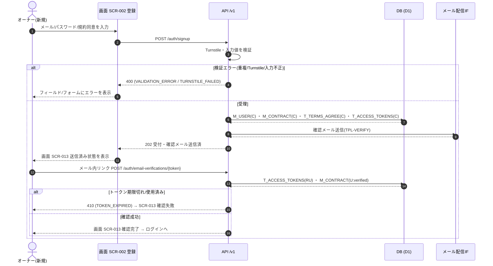

<!-- portal-top -->
[設計ポータル](../../README.md) ／ [基本設計](../index.md) ／ [ユースケース設計](index.md) ／ **UC-01: アカウント新規登録〜メール確認**
<!-- /portal-top -->

# UC-01: アカウント新規登録〜メール確認

> **このページは、新規オーナーが [SCR-002](../01_screen-design/SCR-002.md#SCR-002) でメールアドレス・パスワード・規約同意を入力してアカウントを登録し、確認メール内リンクから本人確認を完了して([SCR-013](../01_screen-design/SCR-013.md#SCR-013))ログイン可能になるまでの横断フローを定義します。**

*版数 v1.0 ・ 更新 2026-06-21 ・ 種別 横断フロー ・ ステータス ドラフト*

## 1. 概要

未登録のメールアドレスを持つ新規オーナーが、[SCR-002](../01_screen-design/SCR-002.md#SCR-002) アカウント登録画面でメールアドレス・パスワード・利用規約 / プライバシーポリシー同意を入力する。[API-AUTH-001](../02_api-design/API-auth.md#API-AUTH-001)(`POST /auth/signup`)が Turnstile と入力値を検証し、`M_USER(C)` ・ `M_CONTRACT(C)` ・ `T_TERMS_AGREE(C)` ・ `T_ACCESS_TOKENS(C)` を作成して確認メールを送信する。オーナーは確認メール内リンク([SCR-013](../01_screen-design/SCR-013.md#SCR-013) にトークン付きで着地)から [API-AUTH-006](../02_api-design/API-auth.md#API-AUTH-006)(`POST /auth/email-verifications/{token}`)を呼び、メールアドレスを確認済みとする。確認完了後はログイン([UC-02](UC-02.md#UC-02))へ進む。

| 項目 | 内容 |
|---|---|
| 目的 | 新規オーナーのアカウントを登録し、メール所有権を確認したうえでログイン可能な状態にする |
| 関連要件 | [FR-001](../../01_requirements/FR01.md#FR-001) アカウント登録 ・ [FR-003](../../01_requirements/FR01.md#FR-003) メール確認 |
| 主テーブル | `M_USER(C)` ・ `M_CONTRACT(CRU)` ・ `T_TERMS_AGREE(C)` ・ `T_ACCESS_TOKENS(CRU)` |
| 関連 API | [API-AUTH-001](../02_api-design/API-auth.md#API-AUTH-001) 新規登録 ・ [API-AUTH-006](../02_api-design/API-auth.md#API-AUTH-006) メール確認 |

## 2. 利用者(アクター)

| アクター | 役割 |
|---|---|
| 契約オーナー(新規) | 未登録メールでアカウントを登録し、確認メールのリンクから本人確認を完了する |
| 画面 SCR-002 | 登録フォームの入力・検証と新規登録 API の呼び出し、確認メール送信フローへの導線を担う |
| 画面 SCR-013 | 送信済み / 確認成功 / 確認失敗の状態表示とメール再送・ログインへの導線を担う |
| API /v1 | Turnstile・入力値検証、アカウント / 契約の作成、確認トークン発行・検証を担う |
| メール配信 IF | 確認メール(`TPL-VERIFY`)を送信する |

## 3. 事前条件

- 未登録(`M_USER` で未使用)のメールアドレスを保有している。
- [SCR-002](../01_screen-design/SCR-002.md#SCR-002) アカウント登録画面に到達している(認証前・権限不要)。
- Turnstile ウィジェット([SCR-002](../01_screen-design/SCR-002.md#SCR-002) IT-11)が初期化され、検証トークンを取得できる。

## 4. トリガー

新規オーナーが [SCR-002](../01_screen-design/SCR-002.md#SCR-002) で必要項目を入力し「登録して確認メールを送信する」(EV-10)を押下する。

## 5. 基本フロー

1. オーナーが [SCR-002](../01_screen-design/SCR-002.md#SCR-002) でメールアドレス・パスワード・パスワード確認・利用規約同意・プライバシーポリシー同意を入力する(EV-02〜EV-07)。
2. 画面が全項目のクライアント側バリデーションと Turnstile トークン取得を確認する(EV-10 ・ EV-12)。
3. 画面が [API-AUTH-001](../02_api-design/API-auth.md#API-AUTH-001)(`POST /auth/signup`)を Turnstile トークン付きで呼び出す。
4. API が Turnstile トークンと入力値(メール形式・パスワード強度・一致・規約同意・メール重複)を検証する。
5. API が `M_USER(C)`(オーナー本体)・ `M_CONTRACT(C)` を作成し、`T_TERMS_AGREE(C)` に同意を記録する。
6. API がメール確認トークン(`T_ACCESS_TOKENS(C)`)を発行し、確認メール(`TPL-VERIFY`)を送信する。
7. API が受付結果(202)を返し、画面は [SCR-013](../01_screen-design/SCR-013.md#SCR-013)(メール確認待ち・送信済み状態)へ遷移する。
8. オーナーが確認メール内リンクを開き、トークン付きで [SCR-013](../01_screen-design/SCR-013.md#SCR-013) に着地する(EV-01・トークンあり)。
9. 画面が [API-AUTH-006](../02_api-design/API-auth.md#API-AUTH-006)(`POST /auth/email-verifications/{token}`)を呼び出す。
10. API が確認トークンの有効性(期限)を検証し、`M_CONTRACT(U)` をメール確認済みに更新し、`T_ACCESS_TOKENS(U)` を使用済みにする。
11. 画面が確認成功状態を表示し、「ログインする」で [SCR-001](../01_screen-design/SCR-001.md#SCR-001) ログイン([UC-02](UC-02.md#UC-02))へ誘導する。

## 6. 異常系フロー

- **メール重複**(既存メールで登録): [API-AUTH-001](../02_api-design/API-auth.md#API-AUTH-001) が `VALIDATION_ERROR`(400)を返し、画面はメールアドレス欄にエラーを表示する。アカウントは作成しない。
- **Turnstile 検証失敗**: [API-AUTH-001](../02_api-design/API-auth.md#API-AUTH-001) が `TURNSTILE_FAILED`(400)を返し、画面はフォーム上部にエラーを表示して Turnstile ウィジェットをリセットする。
- **入力値検証エラー**(パスワード強度不足・不一致・規約未同意): クライアント側で送信を中止し対象欄にエラーを表示する。サーバー到達時も `VALIDATION_ERROR`(400)で拒否する。
- **メール未達**: オーナーは [SCR-013](../01_screen-design/SCR-013.md#SCR-013) の「メールを再送する」(EV-02)で確認メールを再送できる(レート制限 5 分以内 1 回)。送信先を誤った場合は「メールアドレスを変更する」(EV-03)で [SCR-002](../01_screen-design/SCR-002.md#SCR-002) へ戻り登録をやり直す。
- **確認トークン期限切れ / 使用済み**: [API-AUTH-006](../02_api-design/API-auth.md#API-AUTH-006) が `TOKEN_EXPIRED`(410)を返し、画面は確認失敗状態を表示する。「新規登録からやり直す」(EV-04)で [SCR-002](../01_screen-design/SCR-002.md#SCR-002) へ復旧する(有効期限 24 時間)。

## 7. 事後条件

- `M_USER`(オーナー本体)と `M_CONTRACT` が作成され、メールアドレスが確認済みとなり、ログイン可能になる。
- 利用規約・プライバシーポリシーへの同意が `T_TERMS_AGREE` に記録される。
- 確認トークン(`T_ACCESS_TOKENS`)が使用済みとなり、再利用できない。
- 異常終了時はアカウントが作成されない、またはメール未確認のままとなり、ログインできない。

## 8. シーケンス図

---

<!-- portal-bottom -->
[← ユースケース設計](index.md) ・ [基本設計](../index.md) ・ [↑ 設計ポータル](../../README.md)
<!-- /portal-bottom -->
