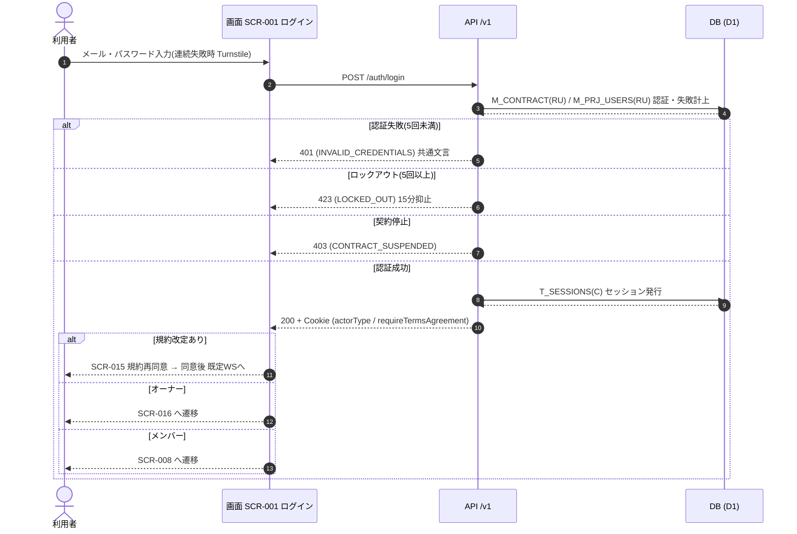

<!-- portal-top -->
[設計ポータル](../../README.md) ／ [基本設計](../index.md) ／ [ユースケース設計](index.md) ／ **UC-02: ログイン**
<!-- /portal-top -->

# UC-02: ログイン

> **このページは、アカウント利用者(オーナー / メンバー)が [SCR-001](../01_screen-design/SCR-001.md#SCR-001) でメールアドレスとパスワードを入力してセッションを確立し、種別に応じた既定ワークスペースへ着地するまでの横断フローを定義します。**

*版数 v1.0 ・ 更新 2026-06-21 ・ 種別 横断フロー ・ ステータス ドラフト*

## 1. 概要

有効なアカウントを持つ利用者が [SCR-001](../01_screen-design/SCR-001.md#SCR-001) ログイン画面でメールアドレスとパスワードを入力する。[API-AUTH-002](../02_api-design/API-auth.md#API-AUTH-002)(`POST /auth/login`)が資格情報を `M_CONTRACT(R)`(オーナー)/ `M_PRJ_USERS(R)`(メンバー)に照合し、ロックアウト・契約停止を判定したうえでセッション(`T_SESSIONS(C)`)を発行する。応答の `actorType` と `requireTermsAgreement` に応じて、規約再同意割込み([SCR-015](../01_screen-design/index.md#SCR-015))・オーナーの既定画面([SCR-016](../01_screen-design/index.md#SCR-016))・メンバーの既定画面([SCR-008](../01_screen-design/index.md#SCR-008))のいずれかへ着地する。連続失敗時は Turnstile を要求し、5 回連続失敗で一時ロックする([FR-007](../../01_requirements/FR01.md#FR-007))。

| 項目 | 内容 |
|---|---|
| 目的 | 資格情報を照合してセッションを確立し、利用者種別に応じた既定ワークスペースへ着地させる |
| 関連要件 | [FR-004](../../01_requirements/FR01.md#FR-004) ログイン認証 ・ [FR-007](../../01_requirements/FR01.md#FR-007) ロックアウト ・ [FR-008](../../01_requirements/FR01.md#FR-008) 認証エラー文言(FR14 セキュリティ) |
| 主テーブル | `M_CONTRACT(RU)` ・ `M_PRJ_USERS(RU)` ・ `T_SESSIONS(C)` |
| 関連 API | [API-AUTH-002](../02_api-design/API-auth.md#API-AUTH-002) ログイン |

## 2. 利用者(アクター)

| アクター | 役割 |
|---|---|
| 全認証ユーザー(オーナー / メンバー) | メールアドレス・パスワードを入力してログインする |
| 画面 SCR-001 | 入力検証・ログイン API 呼び出し・連続失敗時の Turnstile 提示・着地先への遷移を担う |
| API /v1 | 資格情報照合・失敗試行計上・ロックアウト / 契約停止判定・セッション発行を担う |
| 認証 IF(Turnstile) | 連続失敗後のボット検証トークンを取得する |

## 3. 事前条件

- 有効なアカウント(オーナーは `M_CONTRACT`、メンバーは `M_PRJ_USERS`)を保有している。
- [SCR-001](../01_screen-design/SCR-001.md#SCR-001) ログイン画面に到達している(認証前・権限不要)。
- アカウントが一時ロック中でなく、契約が停止状態でない。

## 4. トリガー

利用者が [SCR-001](../01_screen-design/SCR-001.md#SCR-001) でメールアドレス・パスワードを入力し「ログイン」(EV-04)を押下する。

## 5. 基本フロー

1. 利用者が [SCR-001](../01_screen-design/SCR-001.md#SCR-001) でメールアドレス・パスワードを入力する(EV-02 ・ EV-03)。
2. 画面が必須・形式を再検証し、連続失敗後は Turnstile チャレンジ(IT-08)のトークンを取得する。
3. 画面が [API-AUTH-002](../02_api-design/API-auth.md#API-AUTH-002)(`POST /auth/login`)を呼び出す(必要時 Turnstile トークンを含める)。
4. API が連続失敗時の Turnstile を検証し、メール / パスワードを `M_CONTRACT(R)` ・ `M_PRJ_USERS(R)` に照合する(両マスタは完全分離・両方を照合対象とする)。
5. API がアカウントロック状態・契約停止状態を判定する。
6. API が `T_SESSIONS(C)` でセッションを発行し、`actorType`・`requireTermsAgreement`・有効セッション一覧を返す(200 + Cookie)。
7. 画面が着地先を分岐する。
   1. `requireTermsAgreement=true`: [SCR-015](../01_screen-design/index.md#SCR-015) 規約再同意割込みへ遷移する(同意完了後に既定画面へ)。
   2. `actorType=owner`: [SCR-016](../01_screen-design/index.md#SCR-016) 利用状況へ遷移する。
   3. `actorType=project_user`: [SCR-008](../01_screen-design/index.md#SCR-008) 概要へ遷移する。

## 6. 異常系フロー

- **認証失敗**(連続失敗 5 回未満): [API-AUTH-002](../02_api-design/API-auth.md#API-AUTH-002) が `INVALID_CREDENTIALS`(401)を返し、失敗試行を計上する。画面はメールアドレスの存在有無を区別しない共通エラー文言(IT-06)を表示する([FR-008](../../01_requirements/FR01.md#FR-008))。
- **ロックアウト**(連続失敗 5 回以上): API が `LOCKED_OUT`(423)を返し、画面はロックアウト警告(IT-07)を表示する。以後 15 分間は試行を抑止する([FR-007](../../01_requirements/FR01.md#FR-007))。
- **Turnstile 要求**: API が `TURNSTILE_REQUIRED`(400)を返した場合、画面は Turnstile チャレンジ(IT-08)を表示し、取得トークンを付して再送信する。
- **規約再同意割込み**: `requireTermsAgreement=true` の場合、既定画面へ進む前に [SCR-015](../01_screen-design/index.md#SCR-015) を割り込ませ、同意完了後に既定画面へ着地させる。
- **契約停止**: API が `CONTRACT_SUSPENDED`(403)を返し、ログインを拒否する。画面は契約停止の旨を提示する。

## 7. 事後条件

- 認証成功時に `T_SESSIONS` が発行され、Cookie が設定されて利用者種別に応じた既定ワークスペースへ着地する。
- 認証失敗時はセッションが発行されず、失敗試行が計上される。5 回連続でアカウントが一時ロック(15 分)される。
- 契約停止時はセッションが発行されず、ログインできない。

## 8. シーケンス図

---

<!-- portal-bottom -->
[← ユースケース設計](index.md) ・ [基本設計](../index.md) ・ [↑ 設計ポータル](../../README.md)
<!-- /portal-bottom -->
