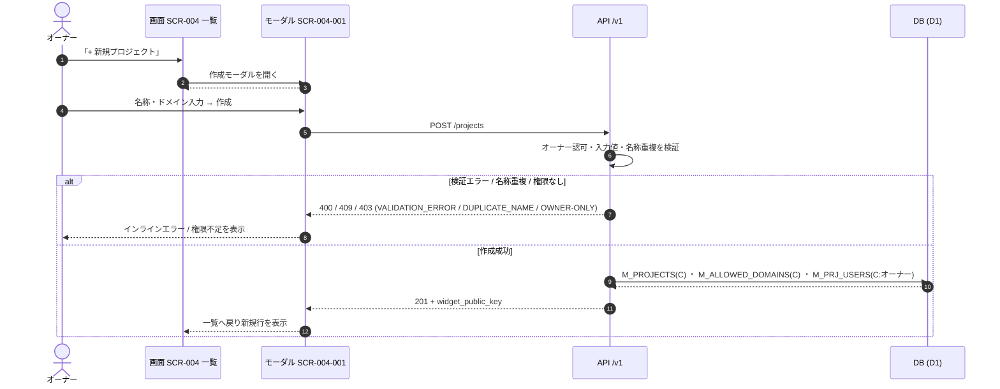

<!-- portal-top -->
[設計ポータル](../../README.md) ／ [基本設計](../index.md) ／ [ユースケース設計](index.md) ／ **UC-03: プロジェクト作成**
<!-- /portal-top -->

# UC-03: プロジェクト作成

> **このページは、オーナーが [SCR-004](../01_screen-design/SCR-004.md#SCR-004) から [SCR-004-001](../01_screen-design/SCR-004-001.md#SCR-004-001) 作成モーダルを開き、プロジェクト名・許可ドメインを入力してプロジェクトを作成し、ウィジェット公開鍵を払い出すまでの横断フローを定義します。**

*版数 v1.0 ・ 更新 2026-06-21 ・ 種別 横断フロー ・ ステータス ドラフト*

## 1. 概要

契約ワークスペースにログインしたオーナーが [SCR-004](../01_screen-design/SCR-004.md#SCR-004) プロジェクト一覧で「+ 新規プロジェクトを作成」を押下し、[SCR-004-001](../01_screen-design/SCR-004-001.md#SCR-004-001) 作成モーダルでプロジェクト名・許可ドメイン・(任意)連絡先メールを入力する。[API-PRJ-002](../02_api-design/API-project.md#API-PRJ-002)(`POST /projects`)がオーナー認可と入力値・名称重複を検証し、`M_PROJECTS(C)` ・ `M_ALLOWED_DOMAINS(C)` を作成してウィジェット公開鍵を発行する。あわせて作成者であるオーナーを当該プロジェクトのメンバーとして `M_PRJ_USERS(C, valid=1)` に自動登録する。完了後はモーダルを閉じ、[SCR-004](../01_screen-design/SCR-004.md#SCR-004) 一覧に新規行が反映される。本ユースケースはオーナー専有である。

| 項目 | 内容 |
|---|---|
| 目的 | 契約配下にプロジェクトと許可ドメインを作成し、ウィジェット公開鍵を払い出す |
| 関連要件 | [FR03 プロジェクト管理](../../01_requirements/FR03.md) |
| 主テーブル | `M_PROJECTS(C)` ・ `M_ALLOWED_DOMAINS(C)` ・ `M_PRJ_USERS(C)` |
| 関連 API | [API-PRJ-002](../02_api-design/API-project.md#API-PRJ-002) プロジェクト新規作成 |

## 2. 利用者(アクター)

| アクター | 役割 |
|---|---|
| オーナー | 契約ワークスペースでプロジェクトを新規作成する(本操作はオーナー専有) |
| 画面 SCR-004 | プロジェクト一覧を表示し、作成モーダルへの導線を提供する |
| モーダル SCR-004-001 | 名称・許可ドメイン・連絡先メールの入力・検証と作成 API 呼び出しを担う |
| API /v1 | オーナー認可・入力値検証・名称重複判定・プロジェクト作成・公開鍵発行・オーナーのメンバー自動登録を担う |

## 3. 事前条件

- オーナーとして契約ワークスペースにログインしている(セッションが有効)。
- [SCR-004](../01_screen-design/SCR-004.md#SCR-004) プロジェクト一覧画面に到達している(オーナー専有・メンバーは利用不可)。

## 4. トリガー

オーナーが [SCR-004](../01_screen-design/SCR-004.md#SCR-004) で「+ 新規プロジェクトを作成」(EV-02)、または空状態の同ボタン(EV-05)を押下する。

## 5. 基本フロー

1. オーナーが [SCR-004](../01_screen-design/SCR-004.md#SCR-004) で「+ 新規プロジェクトを作成」を押下する(EV-02)。
2. 画面が [SCR-004-001](../01_screen-design/SCR-004-001.md#SCR-004-001) を新規作成モードで開く(EV-01)。
3. オーナーがプロジェクト名・許可ドメイン・(任意)連絡先メールを入力する(EV-03〜EV-05)。画面が入力のたびに必須・文字数・ドメイン形式・メール形式を検証する。
4. オーナーが「プロジェクトを作成」(EV-06)を押下する。画面が全項目のバリデーションを実行する。
5. 画面が [API-PRJ-002](../02_api-design/API-project.md#API-PRJ-002)(`POST /projects`)を呼び出す。
6. API がオーナー認可と入力値・名称重複を検証する。
7. API が `M_PROJECTS(C)` ・ `M_ALLOWED_DOMAINS(C)` を作成し、ウィジェット公開鍵を発行する。
8. API が作成者オーナーを当該プロジェクトのメンバーとして `M_PRJ_USERS(C, valid=1)` に自動登録する(一覧表示・担当割当・通知宛先の網羅用。認可権威は引き続き `isOwner`)。
9. API が作成結果(`id` ・ `widgetKey`)を 201 で返す。
10. 画面がモーダルを閉じ、[SCR-004](../01_screen-design/SCR-004.md#SCR-004) 一覧を更新して新規行を表示する。

## 6. 異常系フロー

- **バリデーションエラー**(プロジェクト名未入力 / 長さ超過・許可ドメイン未入力 / 形式不正): クライアント側で送信を中断し対象欄にインラインエラーを表示する。サーバー到達時も [API-PRJ-002](../02_api-design/API-project.md#API-PRJ-002) が `VALIDATION_ERROR`(400)で拒否する。
- **名称重複**: [API-PRJ-002](../02_api-design/API-project.md#API-PRJ-002) が `DUPLICATE_NAME`(409)を返し、画面はプロジェクト名欄に「このプロジェクト名は既に使用されています」を表示する。
- **権限なし**: メンバーが [SCR-004](../01_screen-design/SCR-004.md#SCR-004) / 作成 API に到達した場合、[API-PRJ-002](../02_api-design/API-project.md#API-PRJ-002) が `E-AUTHZ-OWNER-ONLY`(403)を返す。画面は権限不足を提示し、プロジェクトは作成しない。
- **その他のエラー**: 画面はトーストでエラーを表示し、入力内容を保持する。

> [!NOTE]
> **楽観ロックの適用範囲** プロジェクトの更新([API-PRJ-003](../02_api-design/API-project.md#API-PRJ-003) PATCH)では既存行への同時編集を版数で検出する。新規作成は新規行の挿入であり版数衝突は生じないため、本ユースケースでは名称重複(409)を一意性の競合として扱う。

## 7. 事後条件

- `M_PROJECTS` と `M_ALLOWED_DOMAINS` が作成され、ウィジェット公開鍵が払い出される。
- 作成者オーナーが当該プロジェクトのメンバー(`M_PRJ_USERS.valid=1`)として自動登録される。
- [SCR-004](../01_screen-design/SCR-004.md#SCR-004) 一覧に新規プロジェクト行が反映される。
- 異常終了時はプロジェクトが作成されず、一覧は変化しない。

## 8. シーケンス図

---

<!-- portal-bottom -->
[← ユースケース設計](index.md) ・ [基本設計](../index.md) ・ [↑ 設計ポータル](../../README.md)
<!-- /portal-bottom -->
