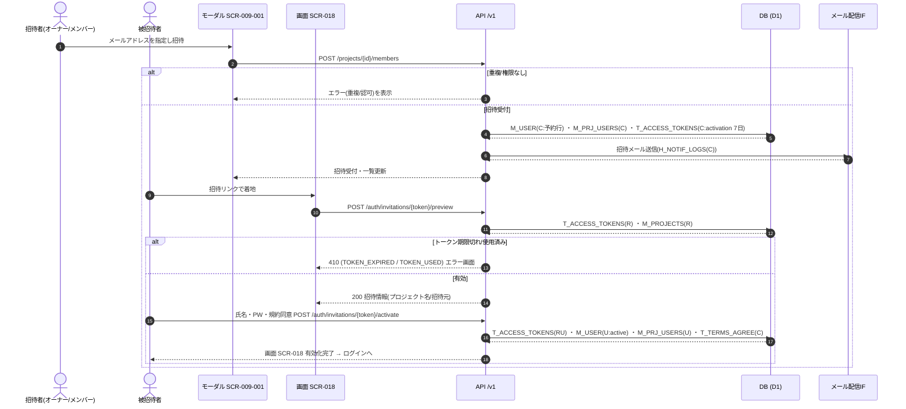

<!-- portal-top -->
[設計ポータル](../../README.md) ／ [基本設計](../index.md) ／ [ユースケース設計](index.md) ／ **UC-04: メンバー招待〜アカウント有効化**
<!-- /portal-top -->

# UC-04: メンバー招待〜アカウント有効化

> **このページは、オーナー / メンバーが [SCR-009-001](../01_screen-design/SCR-009-001.md#SCR-009-001) からメンバーを招待し、被招待者が招待メール内リンクから [SCR-018](../01_screen-design/SCR-018.md#SCR-018) で氏名・初回パスワード・規約同意を入力してアカウントを有効化するまでの横断フローを定義します。**

*版数 v1.0 ・ 更新 2026-06-21 ・ 種別 横断フロー ・ ステータス ドラフト*

## 1. 概要

オーナーまたは当該プロジェクトのメンバーが [SCR-009-001](../01_screen-design/SCR-009-001.md#SCR-009-001) 招待モーダルで招待先メールアドレスを指定する。[API-MBR-002](../02_api-design/API-member.md#API-MBR-002)(`POST /projects/{id}/members`)が予約 `M_USER(C)` 行・割当 `M_PRJ_USERS(C)` を作成し、有効化トークン(`T_ACCESS_TOKENS(C, purpose='activation'`・有効期限 7 日)を発行して招待メールを送信する。被招待者は招待リンクから [SCR-018](../01_screen-design/SCR-018.md#SCR-018) に着地し、[API-AUTH-007](../02_api-design/API-auth.md#API-AUTH-007)(プレビュー)で招待情報を確認したうえで氏名・初回パスワード・規約同意・Turnstile を入力する。[API-AUTH-008](../02_api-design/API-auth.md#API-AUTH-008)(`POST /auth/invitations/{token}/activate`)が予約 `M_USER(U, status='active')` 化・`M_PRJ_USERS(U)` 有効化・`T_TERMS_AGREE(C)` 記録・トークン消費を 1 トランザクションで実行し、ログインへ誘導する。氏名は招待された本人のみが入力する(個人情報原則)。

| 項目 | 内容 |
|---|---|
| 目的 | プロジェクトへメンバーを招待し、本人がアカウントを有効化して当該プロジェクトの割当を有効にする |
| 関連要件 | [FR02 ユーザー管理](../../01_requirements/FR02.md) |
| 主テーブル | `M_USER(CU)` ・ `M_PRJ_USERS(CU)` ・ `T_ACCESS_TOKENS(CRU)` ・ `T_TERMS_AGREE(C)` |
| 関連 API | [API-MBR-002](../02_api-design/API-member.md#API-MBR-002) メンバー招待 ・ [API-AUTH-007](../02_api-design/API-auth.md#API-AUTH-007) 招待トークン検証・プレビュー ・ [API-AUTH-008](../02_api-design/API-auth.md#API-AUTH-008) メンバーアカウント有効化 ・ [API-MBR-005](../02_api-design/API-member.md#API-MBR-005) 招待メール再送 |

## 2. 利用者(アクター)

| アクター | 役割 |
|---|---|
| オーナー / メンバー(招待者) | 当該プロジェクトのメンバーを招待し、必要に応じて招待メールを再送する |
| 被招待者 | 招待リンクから氏名・初回パスワード・規約同意を入力してアカウントを有効化する |
| モーダル SCR-009-001 | 招待先メールの入力・検証と招待 API 呼び出し、招待メール再送の導線を担う |
| 画面 SCR-018 | 招待トークンの検証・プレビュー、有効化フォームの入力・検証と有効化 API 呼び出しを担う |
| API /v1 | 招待先の予約行作成・有効化トークン発行、トークン検証、アカウント有効化トランザクションを担う |
| メール配信 IF | 招待メールを送信し、`H_NOTIF_LOGS(C)` に記録する |

## 3. 事前条件

- 招待者がオーナー、または当該プロジェクトのメンバーである。
- 招待先メールアドレスが既存の有効・招待中アカウントと重複しない。
- 被招待者が招待メール内リンク(`purpose='activation'` の有効トークン)から [SCR-018](../01_screen-design/SCR-018.md#SCR-018) に到達できる(認証前・トークン認証のみ)。

## 4. トリガー

招待者が [SCR-009-001](../01_screen-design/SCR-009-001.md#SCR-009-001) 招待モーダルで「招待メールを送信する」(EV-04)を押下する。

## 5. 基本フロー

1. 招待者が [SCR-009-001](../01_screen-design/SCR-009-001.md#SCR-009-001) を招待モードで開き(EV-01)、招待先メールアドレスを入力する(EV-03)。招待モードでは氏名フィールドを表示しない(個人情報原則)。
2. 招待者が「招待メールを送信する」(EV-04)を押下し、画面が入力バリデーションを実行する。
3. 画面が [API-MBR-002](../02_api-design/API-member.md#API-MBR-002)(`POST /projects/{id}/members`)を呼び出す。
4. API が予約 `M_USER(C)` 行・割当 `M_PRJ_USERS(C)` を作成し、有効化トークン(`T_ACCESS_TOKENS(C, purpose='activation'`・7 日)を発行する。
5. API がメール配信 IF を通じて招待メールを送信し(`H_NOTIF_LOGS(C)`)、画面はモーダルを閉じて [SCR-009](../01_screen-design/index.md#SCR-009) 一覧を更新する。
6. 被招待者が招待リンクを開き、トークン付きで [SCR-018](../01_screen-design/SCR-018.md#SCR-018) に着地する(EV-01)。
7. 画面が [API-AUTH-007](../02_api-design/API-auth.md#API-AUTH-007)(`POST /auth/invitations/{token}/preview`)で招待情報(プロジェクト名 / 招待元)を取得し、招待情報パネル・入力フォームを表示する。
8. 被招待者が氏名・初回パスワード・パスワード確認・利用規約同意・プライバシーポリシー同意・Turnstile を入力する(EV-02〜EV-09)。
9. 被招待者が「登録を完了する」(EV-10)を押下し、画面が [API-AUTH-008](../02_api-design/API-auth.md#API-AUTH-008)(`POST /auth/invitations/{token}/activate`)を呼び出す。
10. API がトークンの有効性を検証し、1 トランザクションで予約 `M_USER(U)` に氏名・パスワードを設定して `status='active'` 化し、`M_PRJ_USERS(U)` の割当を有効化、`T_TERMS_AGREE(C)` を記録、`T_ACCESS_TOKENS(U)` を使用済みにする。
11. 画面が完了画面を表示し、「ログインする」で [SCR-001](../01_screen-design/SCR-001.md#SCR-001) ログイン([UC-02](UC-02.md#UC-02))へ誘導する。

## 6. 異常系フロー

- **招待先メール重複**: [API-MBR-002](../02_api-design/API-member.md#API-MBR-002) が同一メールの既存有効・招待中アカウントとの重複を検出し、画面は重複エラーを表示する。予約行は作成しない。
- **権限なし**: 招待・割当操作の権限を持たない利用者が招待 API に到達した場合、認可エラーを返し、招待を行わない。
- **招待メール未達 / 再送**: 招待者は [SCR-009-001](../01_screen-design/SCR-009-001.md#SCR-009-001) 編集モードの「招待メールを再送する」(EV-05)から [API-MBR-005](../02_api-design/API-member.md#API-MBR-005) を呼び、旧リンクを失効させ新トークン(7 日)を発行して再送できる。
- **招待トークン期限切れ / 使用済み**: [API-AUTH-007](../02_api-design/API-auth.md#API-AUTH-007) / [API-AUTH-008](../02_api-design/API-auth.md#API-AUTH-008) が `TOKEN_EXPIRED` / `TOKEN_USED`(410)を返す。[SCR-018](../01_screen-design/SCR-018.md#SCR-018) はトークン無効 / 期限切れエラー画面(IT-11)または既使用エラー画面(IT-12)を表示し、招待元への再送依頼とログインへの復旧導線を出す。
- **有効化入力エラー**(氏名長・パスワード強度不足 / 不一致・規約未同意・Turnstile 失敗): [API-AUTH-008](../02_api-design/API-auth.md#API-AUTH-008) が `VALIDATION_ERROR` / `TURNSTILE_FAILED`(400)を返し、画面はフィールド単位のエラーを表示して入力フォームを操作可能なまま維持する。

## 7. 事後条件

- 被招待者の予約 `M_USER` 行が `status='active'` で有効化され、氏名・パスワードが設定される。
- 当該プロジェクトのメンバー割当(`M_PRJ_USERS`)が有効(`valid=1`)になる。
- 利用規約・プライバシーポリシーへの同意が `T_TERMS_AGREE` に記録される。
- 招待トークン(`T_ACCESS_TOKENS`)が使用済みとなり、再利用できない。
- 異常終了時はアカウントが有効化されず、割当も有効にならない。

## 8. シーケンス図

---

<!-- portal-bottom -->
[← ユースケース設計](index.md) ・ [基本設計](../index.md) ・ [↑ 設計ポータル](../../README.md)
<!-- /portal-bottom -->
