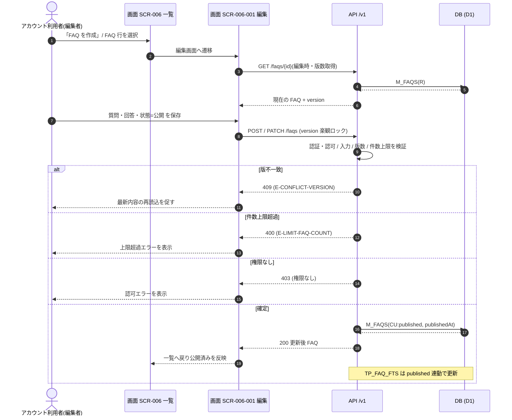

<!-- portal-top -->
[設計ポータル](../../README.md) ／ [基本設計](../index.md) ／ [ユースケース設計](index.md) ／ **UC-05: FAQ 作成・公開**
<!-- /portal-top -->

# UC-05: FAQ 作成・公開

> **このページは、アカウント利用者(編集権限保持者)が FAQ 一覧から新規作成・編集を行い、状態を「公開」にして公開 FAQ を確定するまでの横断ユースケースを定義します。**

*版数 v1.0 ・ 更新 2026-06-21 ・ 種別 横断フロー ・ ステータス ドラフト*

## 1. 概要

編集権限を持つアカウント利用者が、[SCR-006](../01_screen-design/SCR-006.md#SCR-006) FAQ 一覧から「FAQ を作成」または既存 FAQ を選んで [SCR-006-001](../01_screen-design/SCR-006-001.md#SCR-006-001) FAQ 編集画面へ遷移し、質問・回答・カテゴリ・状態を入力する。状態を「公開」にして保存すると、[API-FAQ-002](../02_api-design/API-faq.md#API-FAQ-002)(`POST` / `PATCH /faqs`)が版数(version)による楽観ロックと権限・件数上限を検証のうえ、`M_FAQS` を `status=published` に更新する。更新後の FAQ がウィジェットの回答根拠(公開中 FAQ)に加わる。

| 項目 | 内容 |
|---|---|
| 目的 | 編集者が FAQ を新規作成・編集し、公開状態に確定して回答根拠に反映する |
| 関連要件 | [FR-025](../../01_requirements/FR04.md#FR-025) FAQ の登録・編集・削除 ・ [FR-026](../../01_requirements/FR04.md#FR-026) 質問と回答の登録 ・ [FR-027](../../01_requirements/FR04.md#FR-027) 下書き / 公開中 / 非公開の状態管理 |
| 主テーブル | `M_FAQS(CRU)` |
| 関連 API | [API-FAQ-002](../02_api-design/API-faq.md#API-FAQ-002)(FAQ 作成・更新・削除) ・ [API-FAQ-009](../02_api-design/API-faq.md#API-FAQ-009)(個別取得) |

## 2. 利用者(アクター)

| アクター | 役割 |
|---|---|
| アカウント利用者(編集者) | 当該プロジェクトに編集権限(オーナー / メンバー)で参加し、FAQ を作成・編集して公開する |
| 画面 SCR-006 | FAQ 一覧の表示と「FAQ を作成」・編集遷移の起点を担う |
| 画面 SCR-006-001 | 質問・回答・カテゴリ・状態の入力と保存・削除を担う |

## 3. 事前条件

- アカウント利用者が当該プロジェクトの編集権限(オーナー / メンバー)を持つ。
- 編集対象が既存 FAQ の場合、当該 FAQ が当該プロジェクトに属し、編集画面に最新版数(version)が読み込まれている。
- 新規作成時、当該プロジェクトの FAQ 件数が上限に達していない。

## 4. トリガー

アカウント利用者が [SCR-006](../01_screen-design/SCR-006.md#SCR-006) で「FAQ を作成」を押下する、または既存 FAQ 行を選択して [SCR-006-001](../01_screen-design/SCR-006-001.md#SCR-006-001) 編集画面を開き、状態「公開」で保存することを契機とする。

## 5. 基本フロー

1. アカウント利用者が [SCR-006](../01_screen-design/SCR-006.md#SCR-006) で「FAQ を作成」を押下するか、既存 FAQ 行を選択する。
2. 画面が [SCR-006-001](../01_screen-design/SCR-006-001.md#SCR-006-001) 編集画面へ遷移する。編集時は [API-FAQ-009](../02_api-design/API-faq.md#API-FAQ-009) で当該 FAQ と版数を取得して表示する。
3. アカウント利用者が質問・回答・カテゴリを入力し、状態を「公開」に設定して保存する。
4. 画面が [API-FAQ-002](../02_api-design/API-faq.md#API-FAQ-002) を呼び出す(新規は `POST`、更新は版数付き `PATCH`)。
5. API が認証・認可、入力検証、版数による楽観ロック、件数上限を検証し、合格時に `M_FAQS` を `status=published`(公開日時を設定)で確定する。
6. API が更新後の FAQ を返し、画面が一覧へ戻って公開済みを反映する。

> [!NOTE]
> 全文検索インデックス(`TP_FAQ_FTS`)は FAQ の公開状態に連動して更新される。本ユースケースは FAQ 本体の作成・公開確定までを範囲とし、全文検索の連動更新は担当システム処理で扱う。

## 6. 異常系フロー

- **楽観ロック衝突(版不一致)**: 他者が先に更新して保存版数が一致しない場合、API は競合(`E-CONFLICT-VERSION`)を返す。画面は最新内容の再読込を促し、上書きを防ぐ。
- **件数上限超過**: 当該プロジェクトの FAQ 件数が上限に達している状態で新規作成すると、API が上限超過(`E-LIMIT-FAQ-COUNT`)を返す。画面はエラーを提示し、登録は行われない。
- **権限なし(403)**: 編集権限を持たない利用者の保存要求は API が認可エラー(403)で拒否し、`M_FAQS` は変更されない。

## 7. 事後条件

- 対象 FAQ が `M_FAQS` に `status=published`(公開日時付き)で確定し、ウィジェットの回答根拠(公開中 FAQ)に加わる([FR-027](../../01_requirements/FR04.md#FR-027))。
- 異常系で確定しなかった場合、`M_FAQS` は変更前の状態を保つ(版不一致・上限超過・権限なしのいずれも副作用なし)。

## 8. シーケンス図

---

<!-- portal-bottom -->
[← ユースケース設計](index.md) ・ [基本設計](../index.md) ・ [↑ 設計ポータル](../../README.md)
<!-- /portal-bottom -->
