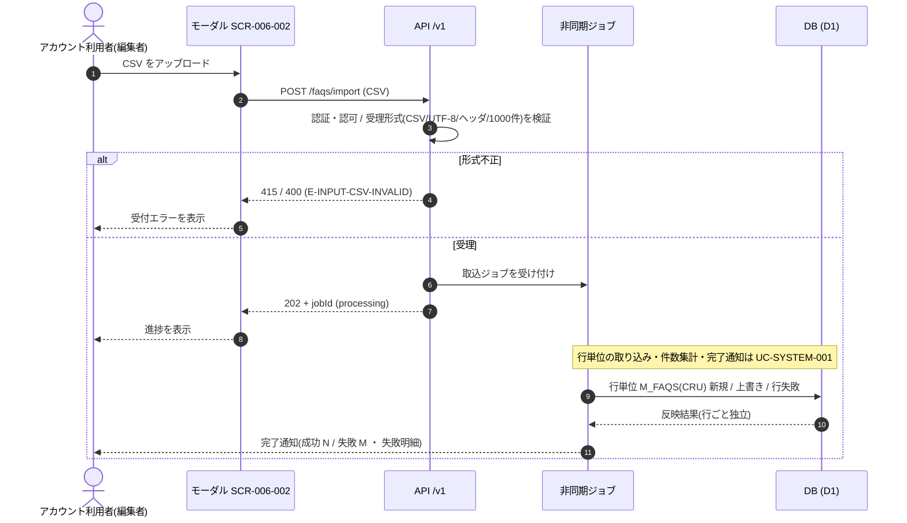

<!-- portal-top -->
[設計ポータル](../../README.md) ／ [基本設計](../index.md) ／ [ユースケース設計](index.md) ／ **UC-06: FAQ CSV 一括インポート(非同期)**
<!-- /portal-top -->

# UC-06: FAQ CSV 一括インポート(非同期)

> **このページは、アカウント利用者が CSV ファイルで FAQ を一括取り込みする横断ユースケースを定義します。受付(202 + ジョブ ID)までを本フローの範囲とし、行単位の取り込み実体は非同期ジョブへ委譲します。**

*版数 v1.0 ・ 更新 2026-06-21 ・ 種別 横断フロー ・ ステータス ドラフト*

## 1. 概要

編集権限を持つアカウント利用者が、[SCR-006-002](../01_screen-design/SCR-006-002.md#SCR-006-002) FAQ CSV インポートモーダルから CSV をアップロードする。[API-FAQ-004](../02_api-design/API-faq.md#API-FAQ-004)(`POST /faqs/import`)が受理形式(CSV / UTF-8 / ヘッダ行 / 件数上限)を検証し、合格時にジョブ ID(`jobId`)と受付状態(`processing`)を 202 で即時返却する。実体の行単位取り込み(新規 / 上書き / 行失敗の判定と件数集計・完了通知)は非同期ジョブが担う。画面は `jobId` を受け取って進捗表示に切り替える。

| 項目 | 内容 |
|---|---|
| 目的 | 大量 FAQ を画面応答をブロックせず非同期で一括取り込みする(受付までを本フローの範囲とする) |
| 関連要件 | [FR-130](../../01_requirements/FR17.md#FR-130) FAQ CSV 一括取り込み(新規 / 上書き / 部分失敗の確認) |
| 主テーブル | `M_FAQS(CRU)`(取り込み実体はジョブ側) |
| 関連 API | [API-FAQ-004](../02_api-design/API-faq.md#API-FAQ-004)(CSV インポート受付) ・ [API-FAQ-005](../02_api-design/API-faq.md#API-FAQ-005)(インポートテンプレート取得) |

## 2. 利用者(アクター)

| アクター | 役割 |
|---|---|
| アカウント利用者(編集者) | 当該プロジェクトに編集権限で参加し、CSV をアップロードして完了通知と部分失敗明細を受け取る |
| 画面 SCR-006-002 | CSV アップロード、受付応答(`jobId`)の表示、進捗・完了の提示を担う |
| インポートジョブ(システム) | 受け付けた CSV を行単位で取り込み、件数集計と完了通知を行う(実体は別 UC) |

## 3. 事前条件

- アカウント利用者が当該プロジェクトの編集権限(オーナー / メンバー)を持つ。
- アップロード対象が CSV(UTF-8、ヘッダ行あり、1 ファイル最大 1000 件、列構成 `FAQ ID, 質問, 回答, カテゴリ`)である。
- 取り込み後の合計件数が、当該プロジェクトの FAQ 件数上限の範囲に収まる見込みである。

## 4. トリガー

アカウント利用者が [SCR-006-002](../01_screen-design/SCR-006-002.md#SCR-006-002) で CSV を選択してアップロードを実行することを契機とする。

## 5. 基本フロー

1. アカウント利用者が [SCR-006-002](../01_screen-design/SCR-006-002.md#SCR-006-002) で CSV を選択し、アップロードを実行する。
2. 画面が [API-FAQ-004](../02_api-design/API-faq.md#API-FAQ-004)(`POST /faqs/import`)へ CSV を送信する。
3. API が認証・認可と受理形式(CSV / UTF-8 / ヘッダ行 / 件数上限 1000)を検証する。
4. 合格時、API は取込ジョブを受け付け、`jobId` と受付状態(`processing`)を 202 で返す。
5. 画面が `jobId` を受け取り、進捗表示に切り替える。
6. 非同期ジョブが CSV を行単位で取り込み、`M_FAQS(CRU)` へ新規 / 上書き / 行失敗として反映し、成功・失敗件数を集計してアカウント利用者へ完了を通知する。

> [!NOTE]
> 行単位の取り込みと件数集計・完了通知の実体は [UC-SYSTEM-001](UC-SYSTEM-001.md#UC-SYSTEM-001) 非同期 CSV インポートジョブが担う。本ユースケースは受付(202 + `jobId`)までを範囲とし、ジョブの詳細フローは当該 UC を正本とする。

## 6. 異常系フロー

- **受付前の形式不正**(CSV 以外 / UTF-8 不正 / ヘッダ行欠落 / 件数上限超過): [API-FAQ-004](../02_api-design/API-faq.md#API-FAQ-004) が受付前に 415 / 400(`E-INPUT-CSV-INVALID`)で拒否し、ジョブは起動しない。画面は受付エラーを提示する。
- **行単位エラー(部分失敗)**: 受付後、当該契約に存在しない `FAQ ID`(`E-INPUT-CSV-FAQID-NOTFOUND`)や必須列欠落などの行は失敗扱いとし、成功分は反映する。1 行の失敗は他行の取り込みに影響しない。失敗明細は完了通知で確認できる(実体は [UC-SYSTEM-001](UC-SYSTEM-001.md#UC-SYSTEM-001))。

## 7. 事後条件

- 受付成功時、取込ジョブが受け付けられ、画面は `jobId` で進捗を追跡できる状態になる。
- ジョブ完了後、成功した行が `M_FAQS` に反映され、失敗した行は反映されない(各行の成否は独立)。アカウント利用者へ完了が通知され、成功件数・失敗件数・失敗理由を確認できる([FR-130](../../01_requirements/FR17.md#FR-130))。
- 受付前の形式不正で拒否された場合、ジョブは起動せず `M_FAQS` は変更されない。

## 8. シーケンス図

---

<!-- portal-bottom -->
[← ユースケース設計](index.md) ・ [基本設計](../index.md) ・ [↑ 設計ポータル](../../README.md)
<!-- /portal-bottom -->
