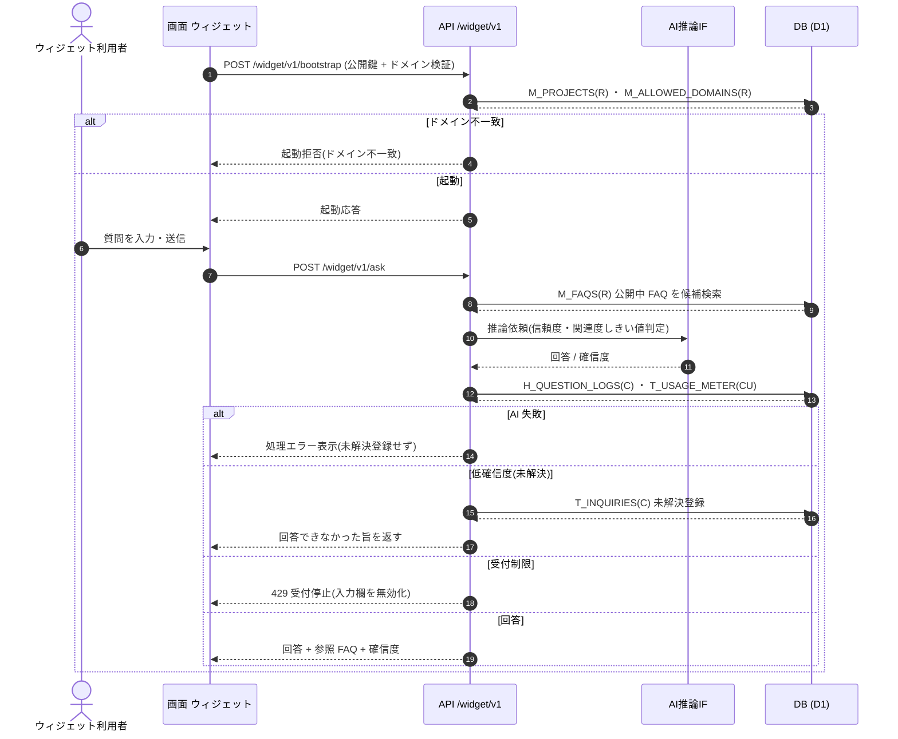

<!-- portal-top -->
[設計ポータル](../../README.md) ／ [基本設計](../index.md) ／ [ユースケース設計](index.md) ／ **UC-07: エンドユーザー質問 → AI 回答**
<!-- /portal-top -->

# UC-07: エンドユーザー質問 → AI 回答

> **このページは、ウィジェット利用者(エンドユーザー)がウィジェットで質問を入力し、公開中 FAQ を根拠に AI が回答するまでの横断ユースケースを定義します。低確信度のときは未解決質問として登録します。**

*版数 v1.0 ・ 更新 2026-06-21 ・ 種別 横断フロー ・ ステータス ドラフト*

## 1. 概要

許可ドメインに設置された [WIDGET](../01_screen-design/SCR-WIDGET.md#WIDGET) ウィジェットで、ウィジェット利用者が質問を入力する。ウィジェットは [API-WGT-001](../02_api-design/API-widget.md#API-WGT-001)(起動・公開鍵 / ドメイン検証)で初期化したのち、[API-WGT-002](../02_api-design/API-widget.md#API-WGT-002)(質問送信)を呼ぶ。API は公開中 FAQ を候補検索し、[API-AI-001](../02_api-design/API-ai.md#API-AI-001) AI 推論 IF へ推論を依頼する。信頼度・関連度のしきい値を満たせば AI が公開中 FAQ のみを根拠に回答し、質問ログ・利用量を記録する。しきい値未満(低確信度)のときは未解決質問として登録し、回答できなかった旨を返す。

| 項目 | 内容 |
|---|---|
| 目的 | エンドユーザーの質問に、公開中 FAQ のみを根拠とした AI 回答を返し、未解決は記録する |
| 関連要件 | [FR-034](../../01_requirements/FR05.md#FR-034) 公開中 FAQ のみを根拠に回答 ・ [FR-037](../../01_requirements/FR05.md#FR-037) 参照 FAQ の記録・提示 ・ [FR-040](../../01_requirements/FR05.md#FR-040) 未解決質問の登録 ・ [FR-153](../../01_requirements/FR20.md#FR-153) AI 推論動作 |
| 主テーブル | `H_QUESTION_LOGS(C)` ・ `T_USAGE_METER(CU)` ・ `T_INQUIRIES(C)` ・ `M_FAQS(R)` |
| 関連 API | [API-WGT-001](../02_api-design/API-widget.md#API-WGT-001)(起動) ・ [API-WGT-002](../02_api-design/API-widget.md#API-WGT-002)(質問送信) ・ [API-AI-001](../02_api-design/API-ai.md#API-AI-001)(AI 推論 IF) |

## 2. 利用者(アクター)

| アクター | 役割 |
|---|---|
| ウィジェット利用者(エンドユーザー) | 許可ドメイン上のウィジェットで質問を入力し、AI 回答または未回答通知を受け取る |
| ウィジェット(画面) | 起動・公開鍵 / ドメイン検証、質問入力、回答・参照 FAQ の表示を担う |
| AI 推論 IF(システム) | 公開中 FAQ を根拠に回答を生成し、信頼度・関連度のしきい値で回答可否を判定する |

## 3. 事前条件

- ウィジェットが当該プロジェクトの許可ドメインに設置され、公開鍵が有効である。
- 当該プロジェクトに公開中 FAQ が存在する(回答根拠となる)。
- 当該プロジェクトが質問数上限に達しておらず、ウィジェット受付が停止していない。

## 4. トリガー

ウィジェット利用者がウィジェットの質問入力欄に質問文を入力し、送信を実行することを契機とする。

## 5. 基本フロー

1. ウィジェットが [API-WGT-001](../02_api-design/API-widget.md#API-WGT-001)(起動)を呼び、公開鍵と設置ドメインの検証を受けて初期化する。
2. ウィジェット利用者が質問文を入力し、送信する。
3. ウィジェットが [API-WGT-002](../02_api-design/API-widget.md#API-WGT-002)(質問送信)を呼ぶ。
4. API が公開中 `M_FAQS(R)` を候補検索し、候補と質問を [API-AI-001](../02_api-design/API-ai.md#API-AI-001) AI 推論 IF へ渡す。
5. AI 推論 IF が信頼度・関連度のしきい値で回答可否を判定し、可なら公開中 FAQ のみを根拠に回答(参照 FAQ 付き)を返す。
6. API が質問ログ(`H_QUESTION_LOGS(C)`)と利用量(`T_USAGE_METER(CU)`)を記録する。
7. API が回答と参照 FAQ・確信度をウィジェットへ返し、ウィジェットが利用者に提示する。
8. 低確信度(しきい値未満)の場合、API は未解決質問を `T_INQUIRIES(C)` に登録し、回答できなかった旨を返す(問い合わせ ID はウィジェットに表示しない)。

## 6. 異常系フロー

- **ドメイン不一致**: 設置ドメインが許可ドメインに一致しない場合、[API-WGT-001](../02_api-design/API-widget.md#API-WGT-001) が起動を拒否し、ウィジェットは動作しない。
- **AI 推論失敗時フォールバック**: AI 推論 IF が失敗・タイムアウトした場合は処理エラーとして扱い、未解決登録ではなくエラー表示を行う([FR-041](../../01_requirements/FR05.md#FR-041))。
- **上限到達で受付停止**: 当該プロジェクトが質問数上限に達している場合、[API-WGT-002](../02_api-design/API-widget.md#API-WGT-002) が受付制限(429)を返し、ウィジェットは入力欄を無効化して受付停止を提示する。

## 7. 事後条件

- 質問が `H_QUESTION_LOGS` に記録され、当月の利用量(`T_USAGE_METER`)が加算される。
- しきい値を満たした質問には公開中 FAQ を根拠とした回答と参照 FAQ が返る([FR-034](../../01_requirements/FR05.md#FR-034) ・ [FR-037](../../01_requirements/FR05.md#FR-037))。
- 低確信度の質問は `T_INQUIRIES` に未解決登録され、後続の FAQ 化([UC-08](UC-08.md#UC-08))の対象となる([FR-040](../../01_requirements/FR05.md#FR-040))。

## 8. シーケンス図

---

<!-- portal-bottom -->
[← ユースケース設計](index.md) ・ [基本設計](../index.md) ・ [↑ 設計ポータル](../../README.md)
<!-- /portal-bottom -->
