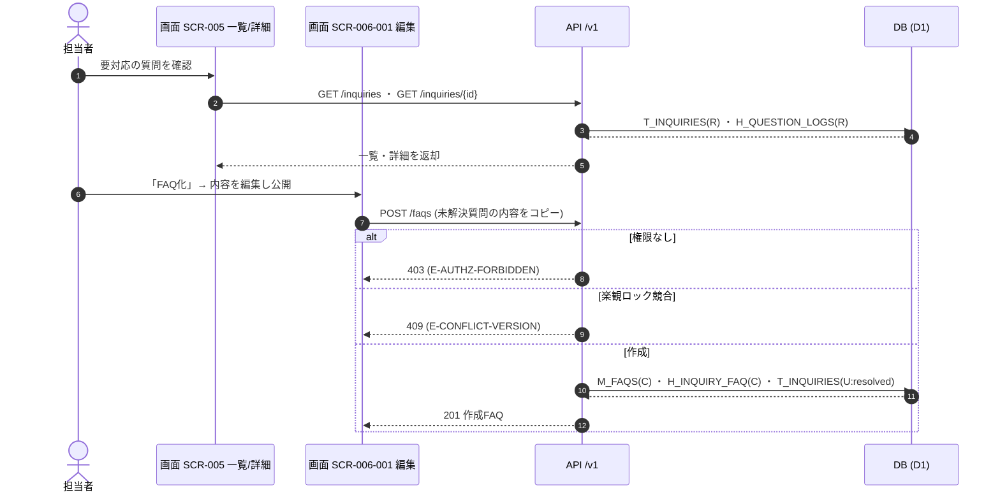

<!-- portal-top -->
[設計ポータル](../../README.md) ／ [基本設計](../index.md) ／ [ユースケース設計](index.md) ／ **UC-08: 未解決質問 → FAQ 化**
<!-- /portal-top -->

# UC-08: 未解決質問 → FAQ 化

> **このページは、ウィジェットで AI が回答できず未解決となった質問を、アカウント利用者が要対応一覧から確認し、内容を編集して FAQ として公開したうえで、元の未解決質問を解決済みに更新するまでの横断業務フローを定義します。**

*版数 v1.0 ・ 更新 2026-06-21 ・ 種別 横断フロー ・ ステータス ドラフト*

## 1. 概要

[UC-07](UC-07.md#UC-07) でウィジェット利用者の質問が低確信度と判定され未解決登録(`T_INQUIRIES`)された質問を、アカウント利用者が [SCR-005](../01_screen-design/SCR-005.md#SCR-005) 要対応の質問一覧 / [SCR-005-001](../01_screen-design/SCR-005-001.md#SCR-005-001) 詳細で確認し、「FAQ 化」導線から [SCR-006-001](../01_screen-design/SCR-006-001.md#SCR-006-001) FAQ 編集へ遷移して質問内容を初期値に編集・公開する。FAQ 公開と同時に元の未解決質問を解決済み(`resolved`)へ更新し、未解決質問と作成 FAQ の対応を記録する。

| 項目 | 内容 |
|---|---|
| 目的 | AI が回答できなかった質問を FAQ として整備し、以後の自動回答率を高める |
| 関連要件 | [FR-045](../../01_requirements/FR06.md#FR-045) 未解決質問登録 ・ [FR-053](../../01_requirements/FR07.md#FR-053) 未解決質問から FAQ 登録 |
| 主テーブル | `M_FAQS(C)` ・ `T_INQUIRIES(RU)` ・ `H_INQUIRY_FAQ(C)` ・ `H_QUESTION_LOGS(R)` |
| 関連 API | [API-INQ-001](../02_api-design/API-inquiry.md#API-INQ-001) 一覧 ・ [API-INQ-002](../02_api-design/API-inquiry.md#API-INQ-002) 詳細・状況切替 ・ [API-FAQ-002](../02_api-design/API-faq.md#API-FAQ-002) FAQ 作成 |
| 関連画面 | [SCR-005](../01_screen-design/SCR-005.md#SCR-005) ・ [SCR-005-001](../01_screen-design/SCR-005-001.md#SCR-005-001) ・ [SCR-006-001](../01_screen-design/SCR-006-001.md#SCR-006-001) |

## 2. 利用者(アクター)

| アクター | 役割 |
|---|---|
| アカウント利用者(オーナー / 編集権限メンバー) | 要対応一覧で未解決質問を確認し、FAQ 化して公開する |
| 画面 SCR-005 / SCR-005-001 | 未解決質問の一覧・詳細を表示し、FAQ 化導線を提供する |
| 画面 SCR-006-001 | FAQ の質問・回答を編集し、公開状態で保存する |
| API /v1 | 未解決質問の取得・状況更新と FAQ 作成を担う |

## 3. 事前条件

- [UC-07](UC-07.md#UC-07) により未解決質問が `T_INQUIRIES` に登録済みで、当該質問が未解決状態である。
- アカウント利用者が当該プロジェクトの編集権限(オーナー / メンバー)を持ち、ログイン済みである。

## 4. トリガー

アカウント利用者が [SCR-005](../01_screen-design/SCR-005.md#SCR-005) 要対応の質問一覧、または [SCR-005-001](../01_screen-design/SCR-005-001.md#SCR-005-001) 詳細で「FAQ 化」を選択する。

## 5. 基本フロー

1. アカウント利用者が [SCR-005](../01_screen-design/SCR-005.md#SCR-005) 要対応の質問一覧を開き、[API-INQ-001](../02_api-design/API-inquiry.md#API-INQ-001) が `T_INQUIRIES(R)` から未解決質問の一覧を返す。
2. アカウント利用者が対象を選び、[SCR-005-001](../01_screen-design/SCR-005-001.md#SCR-005-001) 詳細を表示する。[API-INQ-002](../02_api-design/API-inquiry.md#API-INQ-002) が `T_INQUIRIES(R)` と `H_QUESTION_LOGS(R)` から質問内容・元ログを返す。
3. アカウント利用者が「FAQ 化」を選択し、[SCR-006-001](../01_screen-design/SCR-006-001.md#SCR-006-001) FAQ 編集へ遷移する。質問文・回答案が初期値として引き継がれる。
4. アカウント利用者が質問・回答・カテゴリを編集し、状態を公開にして保存する。
5. [API-FAQ-002](../02_api-design/API-faq.md#API-FAQ-002) が編集権限を検証し、`M_FAQS(C)` に FAQ を `status=published` で作成、`H_INQUIRY_FAQ(C)` に未解決質問と FAQ の対応を記録し、`T_INQUIRIES(U)` で当該未解決質問を `resolved` へ更新する。
6. 画面が作成完了を提示し、要対応一覧から当該質問が解決済みへ移る。

> [!NOTE]
> 全文検索(`TP_FAQ_FTS`)の連動更新は FAQ の `published` 連動でシステム側が行う。本ユースケースは未解決質問の確認・FAQ 化・解決更新までを範囲とする。

## 6. 異常系フロー

- **権限なし**: 編集権限を持たない利用者が FAQ 化を試みた場合、[API-FAQ-002](../02_api-design/API-faq.md#API-FAQ-002) が `403`(`E-AUTHZ-FORBIDDEN`)で拒否する。FAQ は作成されず、未解決質問の状態も変化しない。
- **既に解決済み**: 対象の未解決質問が他の操作で既に `resolved` に更新済みの場合、状況切替・FAQ 化を冪等に扱い、二重解決・重複 FAQ 作成を防ぐ。画面は最新状態を再表示する。
- **楽観ロック競合**: 同一未解決質問を別の利用者が同時に FAQ 化・状況更新した場合、後続要求を `409`(`E-CONFLICT-VERSION`)で拒否する。画面は最新状態を再読込して再操作を促す。

## 7. 事後条件

- 新規 FAQ が `M_FAQS` に `status=published` で作成される。
- 元の未解決質問が `T_INQUIRIES` で `resolved` に更新され、要対応一覧から外れる([FR-053](../../01_requirements/FR07.md#FR-053))。
- `H_INQUIRY_FAQ` に未解決質問と作成 FAQ の対応が記録され、トレーサビリティが残る。
- 異常終了時は FAQ は作成されず、未解決質問の状態は変化しない。

## 8. シーケンス図

---

<!-- portal-bottom -->
[← ユースケース設計](index.md) ・ [基本設計](../index.md) ・ [↑ 設計ポータル](../../README.md)
<!-- /portal-bottom -->
