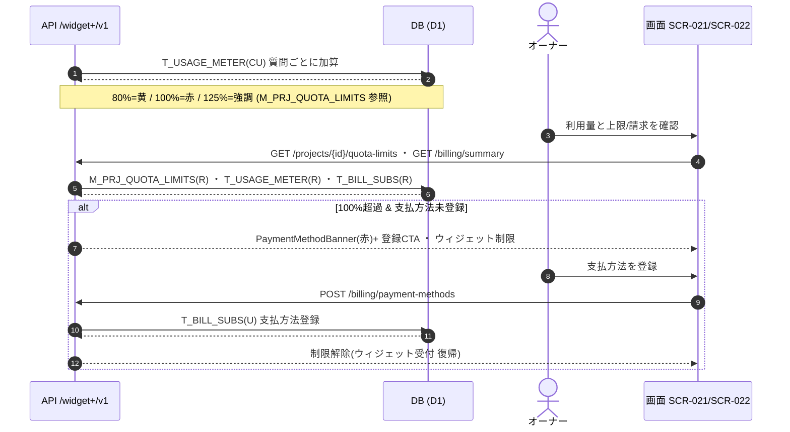

<!-- portal-top -->
[設計ポータル](../../README.md) ／ [基本設計](../index.md) ／ [ユースケース設計](index.md) ／ **UC-09: 利用量超過 → 支払方法ゲート**
<!-- /portal-top -->

# UC-09: 利用量超過 → 支払方法ゲート

> **このページは、プロジェクトの当月質問数が無料枠に近づき超過する過程で、システムが利用量を加算してしきい値(80% / 100% / 125%)で警告を提示し、無料枠 100% 超過かつ支払方法未登録のときにウィジェット受付を制限するまでの横断業務フローを定義します。**

*版数 v1.0 ・ 更新 2026-06-21 ・ 種別 横断フロー ・ ステータス ドラフト*

## 1. 概要

ウィジェットへの質問ごとに利用量(`T_USAGE_METER`)を加算し、プロジェクトの月次上限(`M_PRJ_QUOTA_LIMITS`)に対する消化率がしきい値(80% = 黄 / 100% = 赤 / 125% = 強調)を跨ぐと警告状態を更新する。オーナーは [SCR-021](../01_screen-design/SCR-021.md#SCR-021) 利用量と上限 / [SCR-022](../01_screen-design/SCR-022.md#SCR-022) 請求で消化率と支払方法登録状況を確認できる。無料枠 100% を超過し、かつ支払方法が未登録の場合は支払方法登録 CTA(ゲート)を提示し、ウィジェット受付を制限する。契約自体は `active` を維持し、支払方法を登録すれば即時に制限が解除される。

| 項目 | 内容 |
|---|---|
| 目的 | 無料枠超過時に課金導線へ誘導し、未払いのまま無制限利用が続くのを防ぐ |
| 関連要件 | [FR-064](../../01_requirements/FR09.md#FR-064) 利用量・課金 |
| 主テーブル | `T_USAGE_METER(CU)` ・ `M_PRJ_QUOTA_LIMITS(R)` ・ `T_BILL_SUBS(R)` |
| 関連 API | [API-BIL-003](../02_api-design/API-billing.md#API-BIL-003) 請求サマリ ・ [API-BIL-005](../02_api-design/API-billing.md#API-BIL-005) 支払方法 ・ [API-BIL-006](../02_api-design/API-billing.md#API-BIL-006) 上限・アラート取得 |
| 関連画面 | [SCR-021](../01_screen-design/SCR-021.md#SCR-021) ・ [SCR-022](../01_screen-design/SCR-022.md#SCR-022) |

## 2. 利用者(アクター)

| アクター | 役割 |
|---|---|
| オーナー | 利用量・請求を確認し、支払方法を登録して制限を解除する |
| 画面 SCR-021 / SCR-022 | 消化率・上限・支払方法状況を表示し、登録 CTA を提示する |
| 利用量集計(システム) | 質問ごとに利用量を加算し、しきい値到達でアラート状態を更新する |
| API /widget+/v1 | 利用量加算・上限判定・支払方法登録を担う |

## 3. 事前条件

- プロジェクトにウィジェットが公開され、ウィジェット利用者からの質問を受け付けている。
- プロジェクトに月次上限(無料枠)が `M_PRJ_QUOTA_LIMITS` に設定されている。
- オーナーがログイン済みで、利用量・請求画面にアクセスできる。

## 4. トリガー

ウィジェットへの質問受付による利用量加算で消化率がしきい値を跨ぐ、またはオーナーが [SCR-021](../01_screen-design/SCR-021.md#SCR-021) / [SCR-022](../01_screen-design/SCR-022.md#SCR-022) を開いて利用状況を確認する。

## 5. 基本フロー

1. ウィジェットへの質問ごとに、システムが `T_USAGE_METER(CU)` の当月件数を加算する。
2. システムが消化率を `M_PRJ_QUOTA_LIMITS(R)` の上限と照合し、しきい値(80% = 黄 / 100% = 赤 / 125% = 強調)を跨いだ場合にアラート状態を更新する。
3. オーナーが [SCR-021](../01_screen-design/SCR-021.md#SCR-021) 利用量と上限、または [SCR-022](../01_screen-design/SCR-022.md#SCR-022) 請求を開く。
4. [API-BIL-006](../02_api-design/API-billing.md#API-BIL-006) と [API-BIL-003](../02_api-design/API-billing.md#API-BIL-003) が `M_PRJ_QUOTA_LIMITS(R)` ・ `T_USAGE_METER(R)` ・ `T_BILL_SUBS(R)` から消化率・上限・支払方法登録状況を返す。
5. 消化率が 100% を超過し、かつ支払方法が未登録の場合、画面が支払方法登録バナー(赤)と登録 CTA を提示し、ウィジェット受付を制限する。
6. オーナーが [API-BIL-005](../02_api-design/API-billing.md#API-BIL-005) で支払方法を登録すると、ゲートが解除され、ウィジェット受付が即時に復帰する。

> [!NOTE]
> しきい値到達時のアラート通知生成・上限到達によるウィジェット受付停止の自律処理は、それぞれの担当システム処理が扱う。本ユースケースは利用量加算・消化率提示・支払方法ゲートの判定と解除までを範囲とする。

## 6. 異常系フロー

- **支払方法登録で即時復帰**: 100% 超過で制限中のプロジェクトでも、オーナーが [API-BIL-005](../02_api-design/API-billing.md#API-BIL-005) で支払方法を登録すれば、制限が即時解除されウィジェット受付が再開する(超過分は従量として後続の請求確定で扱う)。
- **支払方法登録の失敗**: 決済事業者側のカード検証エラー等で登録に失敗した場合、制限は維持されたまま画面が登録エラーを提示し、再入力を促す。

## 7. 事後条件

- `T_USAGE_METER` に当月の質問数が加算され、消化率が画面に反映される([FR-064](../../01_requirements/FR09.md#FR-064))。
- 100% 超過かつ支払方法未登録の間はウィジェット受付が制限される(契約は `active` のまま)。
- 支払方法を登録した時点で制限が解除され、ウィジェット受付が復帰する。

## 8. シーケンス図

---

<!-- portal-bottom -->
[← ユースケース設計](index.md) ・ [基本設計](../index.md) ・ [↑ 設計ポータル](../../README.md)
<!-- /portal-bottom -->
